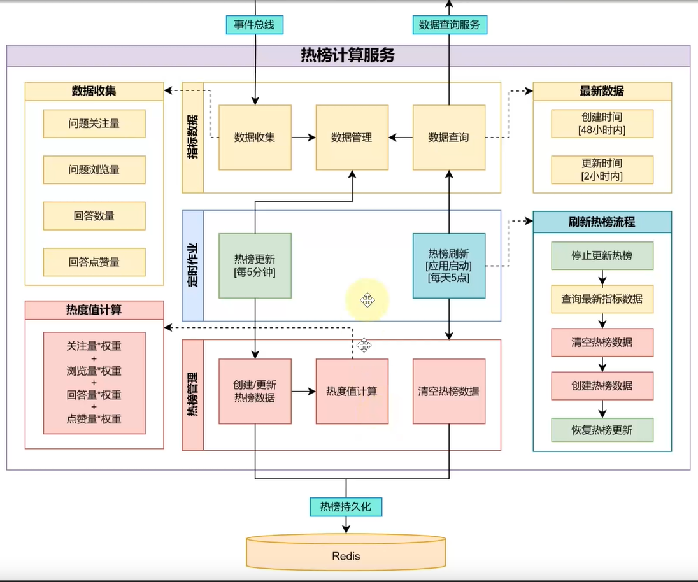
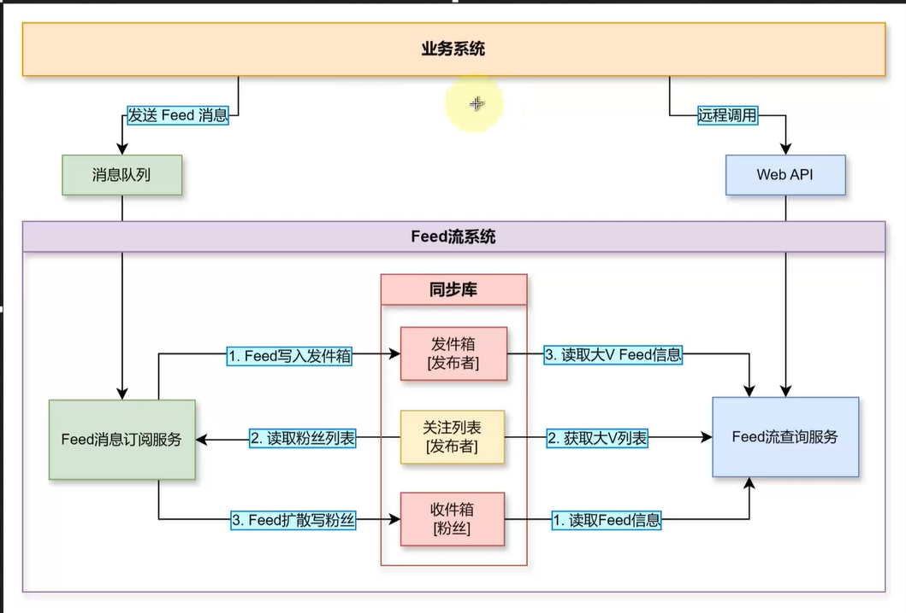
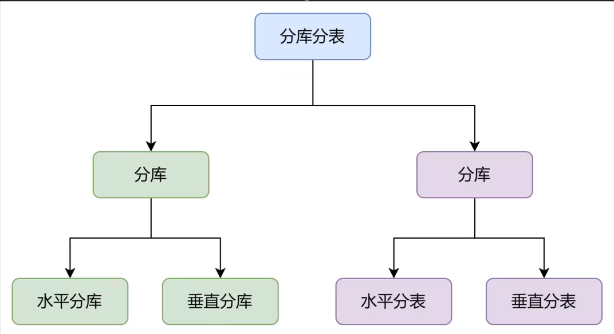
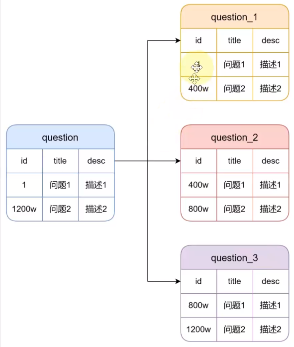
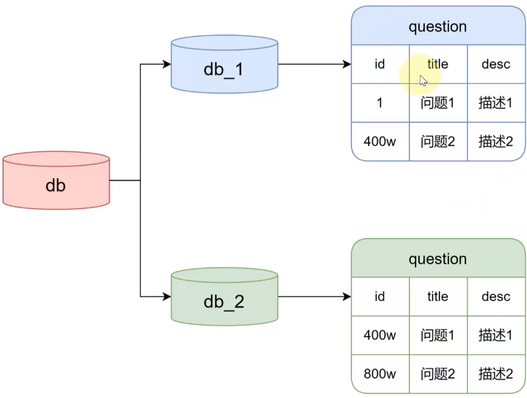

# 需求分析

> 项目说明与需求分析

项目说明：仿知乎问答系统

需求分析：


# 系统用例图

>  使用系统用例图梳理业务流程


# 整洁架构

> 使用领域驱动设计的整洁架构

参照文档《DDD基础》

整洁架构的代码分层设计：


# 实体类图

> 设计领域模型—确定聚合边界和实体设计


# 实现

**实现领域模型规范**

**实现实体基类与审计实体**

**实现用户聚合中的实体设计**

（1）用户属性中为什么没有包含用户名，密码之类的信息

因为在DDD中，用户的业务功能（关注与用户相关的业务逻辑、围绕用户的业务活动）和用户的登录/身份认证（系统安全层面，如何确保用户的身份真实性、保护用户的数据、实现用户权限的控制）通常被划分在不同聚合中。用户的登录/身份认证属于通用域，而非核心域。

**实现问答聚合中的实体设计**

**实现集成数据访问框架**

**实现数据初始化基础设施服务**

使用了Bogus框架，在测试环境下，生成种子数据

**实现审计属性自动设置**

审计属性自动设置：

- 应用代码中设置

  （1）在业务逻辑相关的处理中手动设置。这种方式会导致审计属性与业务代码紧密耦合，不易于后期维护

  （2）使用数据访问框架实现审计属性自动设置（建议）。此处使用EF Core中SaveChangesInterceptor拦截器实现

- 使用数据库特性自动设置

  缺乏灵活性，调用数据库函数实现；可能会导致并发问题；不可跨数据库迁移（因为一些数据库可能不支持时间戳特性）

**实现命令查询职责模式**

使用的框架为MediatR

读取：查询模型
写入：命令模型

可以根据各自的需求进行独立优化，从而避免因为读写操作之间潜在的冲突导致的性能瓶颈
命令用于改变领域实体的状态，因此命令操作应该依赖于领域层所提供的仓储服务
查询命令因为其只读特性，不会修改实体，所以无需依赖领域服务（此处的IQuery一般很少使用）

追加了命令（ICommand）查询（IQuery）接口到共享代码库，使其可以更直观的看出参数类型和返回类型

**实现用户注册用例和身份服务**

在用例层追加用户注册处理

**实现通用结果返回与通用仓储**

- 通用结果返回：共享类库

- 通用仓储

  仓储服务：只有聚合根才能操作管理实体。没有设计具体处理逻辑，只是对实体进行增删改查
  仓储接口：主要是限制只有聚合根才能操作管理实体。即可以放在基础层，也可以放在核心层。此处放在核心层，而仓储的实现实在基础设施层。在用例层使用仓储时，则通过依赖注入的方式。
  EFCore中的DbSet实际都是一个仓储，CellChange就是工作单元。但是如果要想实现严格的领域驱动设计，则需要使用通用的泛型接口。仓储接口是用来约束，EFCore DbSet是对外开放的，权限太大，外部可以操作任何实体。所有此处定义了仓储接口可以对仓储进行约束。

  根据整洁架构的定义，命令模型必须调用领域层的仓储服务，而查询模型则可以绕过领域层，因为它不操作实体。

**实现用户注册接口**

**实现 JWT 访问令牌**

**实现用户登录用例与接口**

**身份系统设计与改造**

问题：将用户注册和登录处理放在用例层，在架构和设计上有什么问题？
思考：用户分为身份认证系统和业务系统，身份认证系统属于基础设施。（PS：授权则是与业务系统相关的）
	将用户注册和登录处理放在用例层，会导致用户注册和用户登录与用户用例过度耦合
	用户注册其实横跨了两个系统（身份认证系统和业务系统），应该在接口层分开调用	
	用户登录整个实现与业务领域没有任何关系，所以更不应该放在用例层
改造：将用户注册和用户登录处理放在基础设施层

**实现基于令牌的身份认证**

认证协议：
基于访问访问令牌（JWT）的认证协议（客户端发）
基于Cookie的认证协议（浏览器来发、不能跨域、必须同域）

Bearer：认证方案，将令牌放在HTTP请求头部，进行传递。Authorization:Bearer JWT
Clockskew：时钟偏差。访问令牌是由身份认证中心办法，用户提交后，由于网络原因，导致Token时间有偏差。如果偏差在设置的偏差内，则认为令牌是有效的。例如令牌过期时间为12：00,时钟偏差为5min，则12：05之前令牌都是有效的。0则认为不允许有时钟偏差。在分布式系统时，可以设置一个较小的时间偏差

思考：访问令牌生成后传给客户端，假设有效期为30min，但10min登出后，服务器没有保存该访问令牌，如何吊销客户端访问令牌。
解决：将身份令牌保存到Redis中，当客户端请求时，先判断Redis是否存在，如果存在，则正常使用；如果不存在，则说明访问令牌失效

**详解MediatR管道行为模式**

ASP.NET Core通过什么方式来实现用户认证和授权
管道中间件==》AOP面向切面变成的思想
用例层==》命令查询职责分离模式==》MediaR
MediaR实现了请求响应模型，也使用了管道模式，所有的请求都经过管道行为（MedieR架构图）

**实现用户查询用例与数据查询服务**

根据用户id查询用户信息，此处使用了查询服务，没有使用仓储服务（查询模型可以绕过领域层，访问基础设施）
IReadRepository什么时候使用？
（1）命令模型中需要查询时
（2）IDataQueryService是在用例层，领域中实体如果需要查询则只能使用仓储

**实现用例层授权与接口层异常处理**

使用Mediat管道行为实现用例层授权与接口层异常处理
（1）为什么此处使用异常处理器IExceptionHandler而不使用异常处理器
过滤器==过滤HTTP请求和响应，更偏向处理控制器的异常
处理器==偏向处理控制器之外的异常
过滤器底层也是使用的处理器
（2）本身框架有中间件，为什么还要使用Mediat的中间件
Contrller添加的中间件与用例层是无关的，依赖由外向内，用例层（内层）不能去调用Contrller（外层）HttpAPI项目只是提供请求转发。HttpAPI项目后期也可以换成桌面程序。

## 5

**实现用户关注问题与功能测试**

在用例层追加用户关注问题的命令模型

功能测试库

FluentAssertion

Microsoft.EntityFramworkCore.Sqlite(提供关系型内存数据库)

Moq（提供模拟功能）

**实体业务与领域服务应用场景**

问题：在用例层追加用户关注问题的命令模型中会针对用户所关注的问题进行判断（一个用户只能关注一个问题、关注的问题必须存在），这是属于领域业务规则，是对领域概念和行为的约束和限制，确保实体的一致性。领域规则应放在领域层实现，而不是用例层。

改造：

（1）判断一个用户只能关注一个问题

这部分处理可以放在领域实体中，同时还需要限制外部修改关注问题列表

领域实体不仅仅是数据的容器，还要包含与它相关的领域规则和行为，除此之外，还要管理自身的变化和周期。

（2）关注的问题必须存在

这个不属于用户聚合，而属于问题聚合，与（1）是一个跨聚合的业务规则，所以应该放在领域服务中

> **总结**
>
> 业务用例：创建用户关注问题
>
> 领域业务规则
>
> 规则1：一个用户只能关注一个问题一次，修改在用户自身状态（实体业务方法实现）
>
> 规则2：关注的问题必须存在（领域服务）

**详解规范模式以及应用与实现**

规范对象：将一组固定的查询条件封装在一个对象中（FollowQuestionByIdSpec）

规范模式：

是一种设计模式，可以用于封装业务规则和查询逻辑，会将复杂的查询条件封装成一个对象，这样查询条件就可以被重复使用，组合和扩展。

通常会定义一个抽象的规范类，这里面包含了查询条件的方法和属性，具体规范类继承该抽象类。	

EFCore默认不会进行贪婪加载(即不会自动加载导航属性），必须手动去加载导航属性。如果使用Include，则会把所有的导航属性值加载出来。所以使用规范模式去查询需要的数据。

> 知识点：规约模式、规范评估器

**规模模式在仓储中的应用**

问题：多表查询，可以使用规范模式吗？

当前规范模式仅限于当前聚合（导航属性），但可以进行扩展

命令模型一般只是用来修改，里面的查询都比较简单。涉及到复杂的查询，一般使用数据查询服务，绕过仓储。

**实现用户取关问题**

无论问题是否存在==》用户都可以顺利取消关注

问题关注数量的变化、用户关注问题的行为（主)==》强一致性的关系？？？❌这个是弱一致性，因为我们以用户关注问题的行为为主业务，所以不能被其他子业务影响。

如何实现既能够跨聚合修改实体状态，还能让主业务流程不受影响，还可以在不修改业务逻辑代码的情况下，为它进行可扩展——领域事件（本质就是事件总线）

> 场景不同，对一致性的要求可能不同：
>
> 如果是强一致性，则需领域服务进行处理
>
> 如果是弱一致性，则可以通过领域事件处理

## 6

**实现领域事件与关注问题事件**

领域事件：

- 实现跨聚合修改实体状态。当一个实体修改状态后，发布一个事件，其他聚合就可以订阅这个事件，做出响应处理。
- 实现不同聚合之间的松耦合

是由MediatR的通知消息模式：一个消息可以分发给多个处理程序

一个事件模型包括事件类型、事件消息、事件处理器。

何时发布事件：使用EFCore拦截器在实体变更保存完成后，读取实体中的时间集合，进行分发

>领域事件与集成事件的区别
>
>在单体应用中，集体事件就是领域事件
>
>在微服务中，不同的微服务是不同领域，不同领域之间如果需要实现事件，则需要使用集成事件。
>
>即同一领域，则为领域事件；不同领域，则为集体事件

**为用例添加数据验证器**

使用FluentValidation.DependencyInjectionExtensions包实现数据验证

**使用MediatR添加数据验证行为**

**实现增删改查问题用例**

## 7

**实现增删改查回答用例**

**实现通用分页查询模型**

**实现关注与取关用户**

1、关注者只能关注某个用户一次

2、被关注的用户必须存在

3、不能关注自己

问题：为什么关注用户需要通过领域层而取关则不需要

答：1、2、3点属于领域业务规则，需要在领域层进行判断，而取关没有任何规则，所以不需要通过领域层

**点赞/点踩/取消**

关于非聚合根子实体管理与实体仓储

点赞/点踩是针对回答实体，与问题实体无关，但问题实体是聚合根，回答是问题的子实体。如果想获取某个回答的点赞记录则必须通过问题获取，通过问题实体来和获取点赞记录实体是不合理的，因为：

- 聚合根实体一般只会管理有直接关联的子实体，不会越级管理
- 在技术上，则需要实现孙子实体（ThenInclude）的查询，但如果再加上过滤处理，很复杂而且不高效

当前仓储接口和规范模式都只是针对聚合根，所以增加了通用仓储接口，这个仓储接口必须在领域中针对实体实现一个自定义仓储接口

## 8

**API设计规范与用例API接口**

1、RestFul API 面向资源，唯一标识符=>HTTP GET/POST/DELTE/PUT

2、响应=>紧密围绕资源=》遵循HTTP状态码标准：

200：资源查询成功

201：资源创建成功

204：执行成功

404：查询或操作的资源不存在

400：一般错误

3、传统URL与Restful URI的区别

传统URL，采用动词化，Restful URI则倾向于名词化。例如：用户相关CRUD

传统URL：

~/createUser - 用于创建用户

~/getUser?id=1 - 根据id获取用户信息

~/updateUser?id=1  - 根据id更新用户信息

~/delteUser?id=1  -  根据id删除用户信息

Restful URI：

~ POST + /user - 用于创建用户

~GET + /user/1 - 根据id获取用户信息

~PUT + /user/1  - 根据id更新用户信息

~DELETE + /user?id=1  -  根据id删除用户信息

**实现问题浏览量聚合更新**

关于问题浏览量+1更新功能，为什么不在每次问题查询更新？

原因：

①查询命令职责分离模型，在查询模型中是不允许修改实体状态的

②信息类系统（问答、博客、微博等），一般查询量大于写入量。如果每次查询都伴随一个写操作，则数据库的压力会很大。尤其在流量高峰期，会导致数据库崩溃

方案：

①异步更新，使用消息队列。

②Redis，利用Redis高性能的实时存储更新浏览量。浏览量数据通过Redis读写，然后启动定时作业任务，将Redis浏览量同步到数据库

浏览量，不是核心业务数据，只是展示一个问题的热度，和参与热榜的计算，不需实时更新，延迟更新显示也不会影响业务。所以可以将大量的写入，定期聚合统计，然后增量更新，这样就可以减少数据库更新频率。例如：问题1=》10000个人同时访问=》10000个浏览量=》产生10000写操作.我们可以5s统计更新到数据库，就可以将5s内的多次写操作，变为1此更新操作。

**使用Quartz实现定时作业**

定时作业，使用作业调度框架Quartz.Net

- Job：作业，是实际的工作单元
- Trigger：触发作业的股则，作业何时被执行
- Scheduler：调度程序/调度器，管理作业和触发器
- ThreadPool：默认为10个线程池，用来执行作业的线程池，负责管理作业的并发执行
- JobStore：用于存储作业和触发器相关信息的组件，以保证调度程序重启后可以恢复

分批更新：因为在作业间隔内，大量的问题需要被更新，如果一次性更新数据库，会对数据库造成一定压力，所以选中分批更新

问题：如果上一次作业没有执行完成，下一次任务就开始了？

在作业类上使用特性DisallowConcurrentExecution，禁用并发执行，只有当上一轮作业执行完成后才会执行下一轮，即排队执行

**分析热榜实现方案**

热榜,最受关注、最热门的问题榜单，算法和数据指标来排序，例如问题关注量、浏览量、回答量、点赞量。

分析：

- 简单实现热榜方法=》最近发布或最近更新的问题的相关数据直播=》计算出热度之，然后排序=》取出TOP。（问题：在大数据高并发情况下，会频繁查询数据库）
- 热榜=》每24小时查询一次数据库中的热点问题=》指标数据计算出热度=》保存起来=》此处了一般是在流量低谷，例如凌晨
- 生成初始的热榜数据（静态）=》变化=》根据热榜中的指标，实时更新初始的热榜数据，实现近实时热榜（例如：分钟级别）=》使用Redis

总结：每24小时属性热榜数据（从数据库查询），将热榜数据存储在Redis，然后每5分钟更新一次热榜数据

## 9

热榜计算服务如下：



**实现指标数据收集服务**

**实现指标数据查询服务**

**实现热榜数管理服务**

**实现刷新、更新热榜数据作业**

**多作业并发问题**

1、单体应用下，作业模式没有问题，但是集群模式部署多节点应用时，作业会同时执行

更新问题浏览量和更新热榜数据，是没有问题的，但是固定时间点刷新热榜，查询数据库，将数据保存到Redis，这部分是有问题的。因为多节点应用可能会多次执行，浪费系统资源

思考：①作业单独部署为一个应用实例（会存在单点故障问题）②加上分布式锁（浪费资源，需要锁）

解决方法：Quartz是一个分布式作业调度框架，支持集群模式在作业的负载均衡，还支持故障转移。触发器的信息会保存在数据库，保证每个节点的数据一致性，利用数据库分布式锁控制作业并发。

- 负载均衡：运行作业的节点是随机，不一定每次都在同一个节点执行，与节点的繁忙程度有关系，对于触发器较少的空闲调度程序，更倾向于使用同一个。
- 故障转移：当一个节点执行失败，其他健康节点就会检测到这个错误，数据库会识别到在失败节点内执行的作业，然后由其他节点执行（需在触发器里开启故障转移RequestRecovery，与DisallowConcurrentExecution特性是不同的，DisallowConcurrentExecution是为了保证处理串行执行）

2、如何配置Quartz的集群模式

JobStore管理作业和触发器的持久化存储组件，有两种模式：RAM（内存，适合单节点或小规模应用）和JobstoreTX（使用事务管理作业和触发器的状态信息，通常与关系数据库一起使用，内部使用了ADO.NET）

**详解QUartz集群模式配置**

- 配置Quarz

  ```json
    "Quartz": {
      //调度程序的实例名称
      "quartz.scheduler.instanceName": "YY.ZhiHu.Scheduler",
      //调度程序的标识符ID，在同一集群中的ID必须是唯一的，此处设置为AUTO，会自动生成标识符 
      "quartz.scheduler.instanceId": "AUTO",
      //不要使用时间戳，因为程序启动后会根据调度器标识符来存储各个节点调度器的状态，重启后重置标识符，导致原有信息丢失，为了保证调度器的稳定性，设置标识符每次启动不变，此处使用了主机名来生成标识符。只有instanceId为AUTO时，此项才生效
      "quartz.scheduler.instanceIdGenerator.type": "Quartz.Simpl.HostnameInstanceIdGenerator, Quartz",
      //设置JobStore模式
      "quartz.jobStore.type": "Quartz.Impl.AdoJobStore.JobStoreTX, Quartz", 
      //数据库表集群
      "quartz.jobStore.tablePrefix": "QRTZ_",
      //启用集群，多个节点使用同一个数据库，则必须设置为true
      "quartz.jobStore.clustered": "true",
      //数据源
      "quartz.jobStore.dataSource": "default",
      "quartz.dataSource.default.provider": "MySql",
      "quartz.dataSource.default.connectionString": "server=localhost;userid=root;password=123456;database=quartznet",
      //序列化类型
      "quartz.serializer.type": "json"
    },
  ```

- 创建Quartz相关表

  使用官网的脚本：https://github.com/quartznet/quartznet/tree/main/database/tables

## 10

**实现多作业调度器与多重触发器**

1、问题：调度器一旦启动集群模式，所有的作业都在集群模式下，会导致的问题

其实只要刷新热榜数据需要在集群模式下工作，更新热榜数据和更新问题浏览量是不需要的

以更新问题浏览量为例，浏览量数据是存在内存的，加入每5min更新执行一次，两个节点恰巧在同一时刻启动，那每次被触发时，根据负载均衡策略和机制，调度空闲时，倾向在同一个节点处理，会导致有一个节点的数据会被更新到数据库，另一个节点可能永远不会被执行。

故互不影响的作业就不适合使用Quartz集群模式

三种解决方案：

- 分布式作业调度方案：让热榜刷新服务作为一个独立的后台服务应用，通过消息队列与业务应用进行通信
  - 优点：调度器完全隔离，调度性能最优
  - 缺点：整体架构复杂
- 多作业调度方案：在同一个应用中创建两个不同模式的调度器（集群模式==热榜刷新作业/内存模式==定时更新作业）
  - 优点：不需要对架构进行边度
  - 缺点：调度器不能完全隔离，调度性能中等、配置复杂
- 多重触发器方案：使用单一的集群模式，不同节点的更新作业，单独定义不同的触发器。如果多个节点使用相同标识符的触发器，则会被认为是一个集群，进行负载均衡。可以使用不同的标识符创建相同作业的触发器。
  - 优点：几乎不需要任何修改，无需进行复杂配置，只需要修改触发器标识符
  - 缺点：非集群作业和集群作业耦合在一个调度器、调度性能最差。触发器越多，性能越差

业务分析：

- 更新问题浏览作业。也热榜无关，不需要负载均衡，不需要集群调度，不需要持久化作业状态，执行频率最高（使用本地内存调度器）
- 热榜更新作业：与热榜计算紧密管理，不需要负载均衡，收到热榜刷新作业管控，需要集群调度。（多重触发器方案）

结论：应用中配置两个调度器，本地内存调度器（更新问题浏览量作业）和集群调度器（热榜刷新、热榜更新作业）

2、实现Quartz多调度器

Quartz提供的依赖注入只支持单调度器

**热榜列表生成与浏览**

热榜更新数据时，热度值会发生变化，排名会发生变化， 此时生成或更新热榜列表

**使用二级缓存方案缓存热点数据**

热点数据，不仅仅只是列表，还包括了热点问题、热点回答。

热点数据，不仅仅只有上班的数据，没有上榜的也同样是热榜数据。

大量中低热度的数据也需要缓存。这部分数据量比较大，

热榜列表缓存方式：是通过后台服务定时更新，所有用户看到的数据是相同的，主动式缓存，是由我们来决定哪些数据被缓存，何时更新缓存

问题和和回答缓存方式：是核心业务数据，不断增长，随着产品的运行，会变成海量数据。缓存是有限的。因为哪些数据会被用户查看，是不可预知的。所以此处使用被动缓存策略，设置较短的过期时间（一般是秒级），无需关心修改问题和回答后的缓存更新问题。由于过期时间短，请求多的情况下，对于Redis压力会比较大。为了获得更好的性能，可以考虑`采用本地缓存和分布式缓存相结合的二级缓存方案`。

使用二级缓存的原因：服务一般采用集群模式，有高并发高吞吐的优势，集群的节点往往采用负载均衡来均匀处理外部请求。当有多个请求通过不同的节点访问相同的数据，由于本地缓存具有互相隔离的性质，就会导致A节点缓存了一个数据，B节点未缓存，则会导致B节点未命中，就需要调用后端存储系统（数据库）。因此在应用集群的后端里，我们还需要使用Redis作为二级缓存，降低数据库访问压力。

**使用FusionCache实现通用缓存服务**

FusionCache：开源免费，是一个本地缓存+分布式缓存框架。具有容错特性，支持分布式二级缓存。它也是使用本地内存作为主要缓存存储。它符合.Net内存缓存接口。除此之外，它还提供了回程机制（多节点场景中保持所有本地缓存同步）

需要引入：

Microsoft.Extensions.Caching.StackExchangeRedis

ZiggyCreatures.FusionCache

ZiggyCreatures.FusionCache.Serialization.SystemTextJson

## 11

**什么是Feed流？**

一般亿级用户量才会考虑Feed流

Feed流：通俗来讲，一个用户可以远远不断获得他所关注的内容。

Feed就是一个信息单元。比如：一条朋友圈动态、一条微博、一条短视频

核心是提供信息，涉及两个主体：投喂者和被投喂者。

数据层面，Feed的数据可分为三类：

1、发布数据：被关注者产生的数据，需要按照时间线进行组织

2、关注关系（关系数据）：用户间的关系（双向=微信、单向=知乎、微博）

3、接受者的数据（同步数据）：从不同发布者获取的数据，按时间顺序组织在一起（关注页、朋友圈）

即：

业务数据：对应发布数据，发布的问题、回答，需要永久保存（一致增长，易于水平扩展，关系型数据库，则需要考虑分库分表，亿级数据则需要考虑使用NoSQL）

关系数据：数据流向的桥梁

同步数据：两种方式

- 推模式（写扩散），当一个发布者发布一个消息后，需要将消息推送给接收者，接收者需要存储推送的数据，发送者发送一个信息给多个粉丝，则每个粉丝都要复制一份，即写入放大。**此方式要求写入能力强**
- 拉模式（读扩散）：接收者通过拉取的方式，获取发布者发布的信息，发送者只需将数据写入自己发件箱，粉丝需要去发送者的收件箱读取数据，读取放大。**此方式要求读取能力强**
- 推拉模式

建议：双向关系，则使用推模式；单向模式，针对大V模式使用拉模式，针对普通用户使用推模式。

**Feed流系统的分类**

设计Feed流系统，需要结合实际业务来进行，比如用户规模、关注关系（单向、双向）

单向：超量粉丝数的大V，粉丝数量极限是整个系统所有用户

双向：不会有大V用户

Feed流类型：

- 知乎类：单向、大V、时效性较低、按时间排序
- 微信朋友圈类：双向、无大V、时效性高、按时间排序
- 抖音类：单向/双向、大V、时效性较低、按推荐排序

**Feed发布和读取流程**

1、Feed发布和读取流程

发布Feed信息的流程：

- 当用户发布一条内容（问题、回答），会同步生产Feed信息，Feed信息会包含内容的类型、内容ID、发布者ID、发布时间等。
- Feed信息会保存的消息队列，消息队列会负责从关注关系表中读取关注者的粉丝列表，然后通过粉丝数量判断是否为大V
- 队列服务会将Feed信息发布到自己的发件箱，如果是大V（拉模式），流程结束；如果是普通用户，则会将Feed信息写入到粉丝用户的收件箱，流程结束

读取Feed流的流程：

- 当用户刷新自己的Feed流时，本质就是在读取自己的收件箱（两种查询方式：增量查询和全量查询）
- 还需要读取所关注的大V列表，然后并发读取每个大V的发件箱
- 由于是推拉结合模式，用户需要将自己的收件箱和大V的发件箱合并，按时间排序，生成Feed列表（内容ID）

2、只有推模式的情况

- 发布信息=》不需要判断大V=》写入到发布者的发件箱（可选：个人动态页面）和粉丝收件箱即可
- 读取信息=》不需要读取大V=》只需要读取用户自己的收件箱即可

3、Feed流的更新和删除

更新和删除是不是也需要写扩散呢？不需要，只需要更新/删除原内容，因为Feed流只保存了内容ID，没有具体消息内容，当业务读取具体的内容时，还是需要到业务库读取数据，所以只要更新/删除原数据即可。

**Feed流系统架构与技术选型**

Feed系统的流程架构图



第一阶段：改造业务系统，实现消息发送

第二阶段：创建同步库表，实现Feed系统的两个核心功能（发布Feed消息、查询Feed流）

第三阶段：收件箱，实现分库分表策略

MassTransit：.Net开源的消息传递框架。

为什么不直接使用RabbitMQ，可以直接使用，但是MassTransit提供了更多现场的功能，

MassTransit：其核心思想是借助消息来实现服务之间的松耦合异步通信，进而确保应用更高的可用性、可靠性和可扩展性。通过对消息模型的高度抽象，以及对主流的消息代理（包括RabbitMQ、ActiveMQ、Kafaka、Azure Service Bus、Amazon SQS等）的集成，大大简化了基于消息驱动的开发门槛，同时内置了连接管理、消息序列化和消费者生命周期管理，以及诸如重试、限流、断路器等异常处理机制，让开发者更好的专注于业务实现。

## 12

**Feed流同步库设计与实现**

**实现Feed消息发布与查询**

**分库分表**

1、定义：在海里数据下，单库单表数据量过大，导致数据库性能持续下降问题，演变出来的一种技术方案

2、为什么需要分库分表：单一的数据库或表无法满足高并发、大规模存储

- 为什么分库：由于数据库实例分配给磁盘的容量是有限的，当数据量持续大幅增长，单机无法承载，想要解决这个问题，就需要增加容量。虽然磁盘容量可以随意扩展，但数据库的连接数是有限的，所以只扩展容量是不可行的。因此可以将单库，按照不同的业务特性进行拆分。（例如：此项目将业务库和同步库进行了拆分）
- 为什么分表：数据表中的数据量过大，会导致查询变慢。简单来说，是因为InnoDB存储引擎的聚簇索引结构使用了B+树，数据越多，B+树层级变高，层级越高，会导致磁盘IO就越高。单表容量只是又逻辑上的限制（限制是多少呢？与表字段结构，是通过公式计算出来的），物理上没有，只要能够忍受查询耗时过久的问题。
- 何时分库分表：当我们需要解决海里数据访问的性能瓶颈的时候，或对于持续激增的数据量所做出的架构预见性，才会进行分库分表。

**分库分表的实现方案**

核心思想：对数据进行分表，使其相对均匀的存储在 不同的库或表中

可以从两个维度进行拆分：



垂直拆分：

- 垂直分库：按照业务和功能进行拆分，专库专用

- 垂直分表：业务上字段比较多的大表进行拆分，即将宽表拆分为窄表。（一般将不常用的字段、大数据类型的数据的字段拆分到单独的数据表中）

  例如：问题表和回答表，用于两个大数据类型，问题表的描述字段和回答表的内容字段。如果拆表，则会将这两个字段拆分到单独的表中

水平拆分：又称横向拆分。通过某个字段的某种规则，将数据分散到多个库或者表中，每个分批只包含了数据的一部分。

- 水平分表：将大数据量的表按规则（例如：id，日期）查分成多个结构完全相同的子表。（如下图）

  

- 水平分库（如下图）

  优点：解决高并发时单库数据量过大的问题，而且对业务系统改造工作量也不大

  缺点：跨分片的事务一致性难以保证，而且跨库的关联查询性能差，扩容难度和维护量大

  

**分库分表会导致哪些问题**

常用分片策略：

- Hash取模分片：存放数据均匀，扩容很麻烦

  以关键字段进行Hash计算，然后再取模N运算。但对集群的伸缩非常不友好，因为原来在节点1的数据，重新取模后，可能会分配到新增节点，所有需要对原有数据进行迁移

- 范围分片：容易扩容，但是数据分布不均匀

  以ID区段、时间范围进行分片。容易扩容，但由于是连续分片，所以可能热点数据（例如：最近一个月的数据）所在的表可能被频繁读写，这会导致数据倾斜，数据库的压力分摊不均匀。

- 范围+取模

  例如：在拆分库时，0~4000W的数据存放在节点1，4000~8000W的数据存放在节点2，8000~12000W的数据存放在节点3....然后在针对每个库中的数据进行Hash取模后存放到不同的表中

- 其他：按枚举值（地区）、按自定义规则（字段前缀）、预定义分片（事先明确了数据总量，例如当数据量达到1亿数据量时，就升级为分布式数据库）

分库分表会导致哪些问题

- 跨分片查询：分页、排序、联表查询。
- 主键问题：分库分表后就不能依赖数据库自身的自增主键，它已经无法标识唯一记录。可以考虑使用
  - GUID：UUID的实现，GUID的缺点是长（128位），不易读取，会占用较多空间。优点：具有良好的兼容性
  - 雪花ID：分布式唯一的ID生成算法，它是一个64为的long类型。它是由时间戳+数据中心标识+机器表示+序列号。优点是生成速度快，存储空间小。
- 事务一致性
- 历史数据迁移问题

**分库分表工具选型**

分为两类：

- 基于应用分库分表框架：一般是作为EFCore的扩展存在，分库分表的逻辑都在应用内部控制分库分表的策略和逻辑，应用会根据分片策略自动操作数据库。
- 基于数据库透明代理的分库分表中间件：可以应用与数据库隔离，应用不再直接连接数据库，而是通过代理中间件。我们只需要配置代理中间件即可

比较：

- 性能：基于应用分库分表框架较好，因为它是直连数据库。而，代理中间件多了一层转发，会有一些性能上的损耗。但两者差距不是很大
- 复杂度：分库分表框架只需引入扩展包，代理中间件则需要部署单独服务，有一定的维护成本。
- 升级方面：NET框架更新后，分库分表框架也需要一起升级。Net生态中没有应用广泛且成熟的分库分表框架。但成熟的代理中间件就比较多
- 功能：分库分表框架是内嵌在应用里，一般都只是轻量分表，功能没有那么丰富，而代理中间件功能更加丰富（SQL限流、读写分离、监控告警、自动伸缩、分片、迁移）

> 主流玩法：代理中间件（MyCat、Vitess）

## 13. Vitess

**什么是Vitess**


# 参考资料

[DDD~领域服务的规约模式 - 张占岭 - 博客园 (cnblogs.com)](https://www.cnblogs.com/lori/p/3472793.html)

测试Xuint、Moq、FluentAssertions

[详解HTTP四种请求：POST、GET、DELETE、PUT-阿里云开发者社区 (aliyun.com)](https://developer.aliyun.com/article/1476820)

Quartz

FusionCache

Feed流

MassTransit


