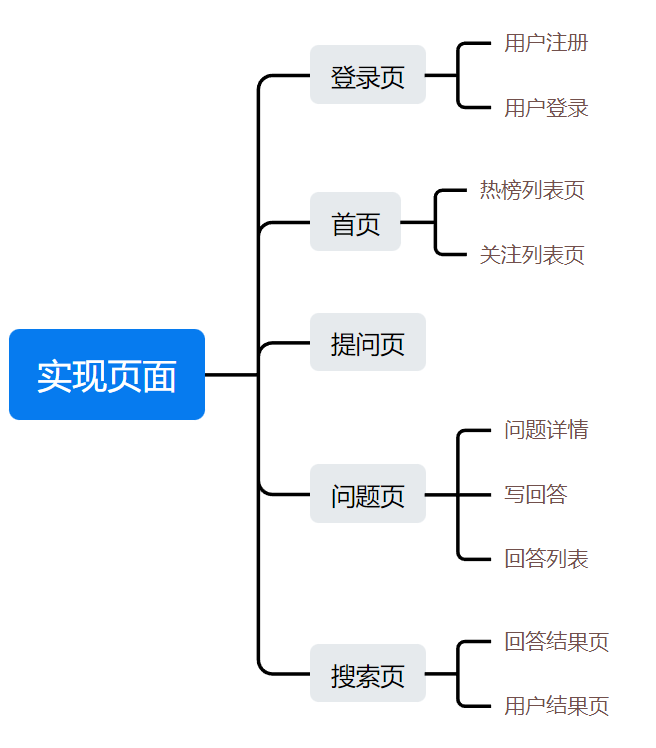
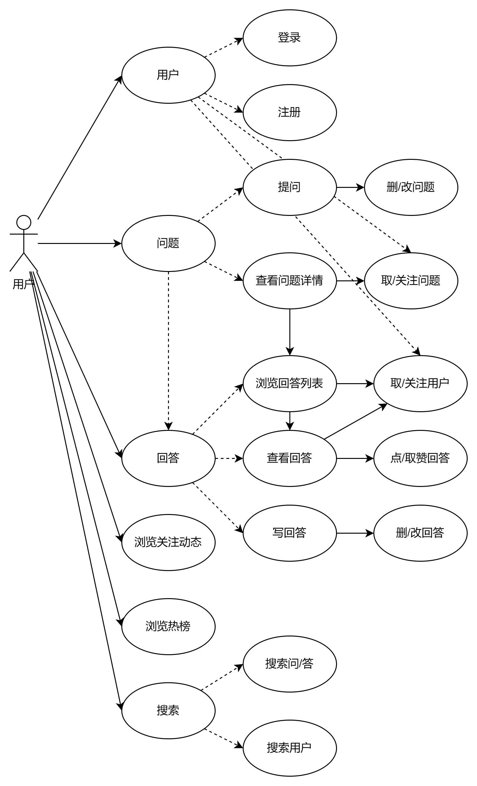
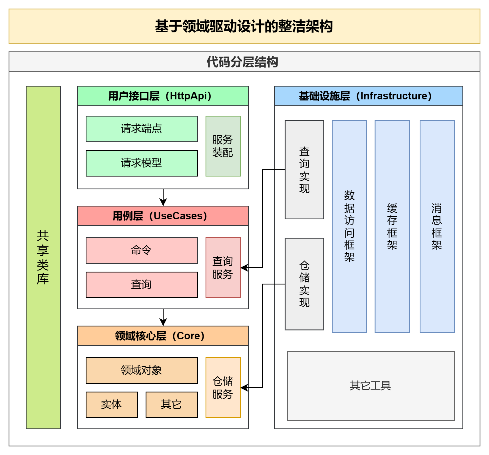
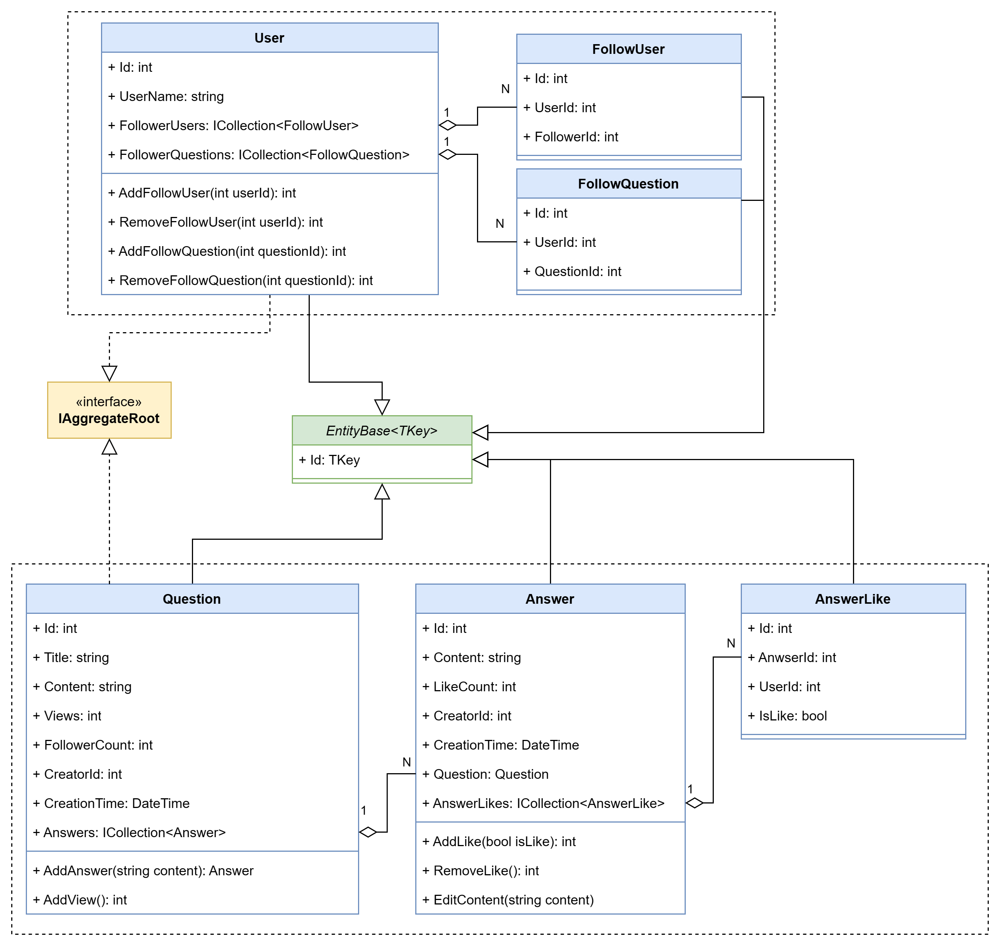

# 需求分析

> 项目说明与需求分析

项目说明：仿知乎问答系统

需求分析：

# 系统用例图

>  使用系统用例图梳理业务流程

# 整洁架构

> 使用领域驱动设计的整洁架构

参照文档《DDD基础》

整洁架构的代码分层设计：

# 实体类图

> 设计领域模型—确定聚合边界和实体设计

# 实现

**实现领域模型规范**

**实现实体基类与审计实体**

**实现用户聚合中的实体设计**

（1）用户属性中为什么没有包含用户名，密码之类的信息

因为在DDD中，用户的业务功能（关注与用户相关的业务逻辑、围绕用户的业务活动）和用户的登录/身份认证（系统安全层面，如何确保用户的身份真实性、保护用户的数据、实现用户权限的控制）通常被划分在不同聚合中。用户的登录/身份认证属于通用域，而非核心域。

**实现问答聚合中的实体设计**

**实现集成数据访问框架**

**实现数据初始化基础设施服务**

使用了Bogus框架，在测试环境下，生成种子数据

**实现审计属性自动设置**

审计属性自动设置：

- 应用代码中设置

  （1）在业务逻辑相关的处理中手动设置。这种方式会导致审计属性与业务代码紧密耦合，不易于后期维护

  （2）使用数据访问框架实现审计属性自动设置（建议）。此处使用EF Core中SaveChangesInterceptor拦截器实现

- 使用数据库特性自动设置

  缺乏灵活性，调用数据库函数实现；可能会导致并发问题；不可跨数据库迁移（因为一些数据库可能不支持时间戳特性）

**实现命令查询职责模式**

使用的框架为MediatR

读取：查询模型
写入：命令模型

可以根据各自的需求进行独立优化，从而避免因为读写操作之间潜在的冲突导致的性能瓶颈
命令用于改变领域实体的状态，因此命令操作应该依赖于领域层所提供的仓储服务
查询命令因为其只读特性，不会修改实体，所以无需依赖领域服务（此处的IQuery一般很少使用）

追加了命令（ICommand）查询（IQuery）接口到共享代码库，使其可以更直观的看出参数类型和返回类型

**实现用户注册用例和身份服务**

在用例层追加用户注册处理

**实现通用结果返回与通用仓储**

- 通用结果返回：共享类库

- 通用仓储

  仓储服务：只有聚合根才能操作管理实体。没有设计具体处理逻辑，只是对实体进行增删改查
  仓储接口：主要是限制只有聚合根才能操作管理实体。即可以放在基础层，也可以放在核心层。此处放在核心层，而仓储的实现实在基础设施层。在用例层使用仓储时，则通过依赖注入的方式。
  EFCore中的DbSet实际都是一个仓储，CellChange就是工作单元。但是如果要想实现严格的领域驱动设计，则需要使用通用的泛型接口。仓储接口是用来约束，EFCore DbSet是对外开放的，权限太大，外部可以操作任何实体。所有此处定义了仓储接口可以对仓储进行约束。

  根据整洁架构的定义，命令模型必须调用领域层的仓储服务，而查询模型则可以绕过领域层，因为它不操作实体。

**实现用户注册接口**

**实现 JWT 访问令牌**

**实现用户登录用例与接口**

**身份系统设计与改造**

问题：将用户注册和登录处理放在用例层，在架构和设计上有什么问题？
思考：用户分为身份认证系统和业务系统，身份认证系统属于基础设施。（PS：授权则是与业务系统相关的）
	将用户注册和登录处理放在用例层，会导致用户注册和用户登录与用户用例过度耦合
	用户注册其实横跨了两个系统（身份认证系统和业务系统），应该在接口层分开调用	
	用户登录整个实现与业务领域没有任何关系，所以更不应该放在用例层
改造：将用户注册和用户登录处理放在基础设施层

**实现基于令牌的身份认证**

认证协议：
基于访问访问令牌（JWT）的认证协议（客户端发）
基于Cookie的认证协议（浏览器来发、不能跨域、必须同域）

Bearer：认证方案，将令牌放在HTTP请求头部，进行传递。Authorization:Bearer JWT
Clockskew：时钟偏差。访问令牌是由身份认证中心办法，用户提交后，由于网络原因，导致Token时间有偏差。如果偏差在设置的偏差内，则认为令牌是有效的。例如令牌过期时间为12：00,时钟偏差为5min，则12：05之前令牌都是有效的。0则认为不允许有时钟偏差。在分布式系统时，可以设置一个较小的时间偏差

思考：访问令牌生成后传给客户端，假设有效期为30min，但10min登出后，服务器没有保存该访问令牌，如何吊销客户端访问令牌。
解决：将身份令牌保存到Redis中，当客户端请求时，先判断Redis是否存在，如果存在，则正常使用；如果不存在，则说明访问令牌失效

**详解MediatR管道行为模式**

ASP.NET Core通过什么方式来实现用户认证和授权
管道中间件==》AOP面向切面变成的思想
用例层==》命令查询职责分离模式==》MediaR
MediaR实现了请求响应模型，也使用了管道模式，所有的请求都经过管道行为（MedieR架构图）

**实现用户查询用例与数据查询服务**

根据用户id查询用户信息，此处使用了查询服务，没有使用仓储服务（查询模型可以绕过领域层，访问基础设施）
IReadRepository什么时候使用？
（1）命令模型中需要查询时
（2）IDataQueryService是在用例层，领域中实体如果需要查询则只能使用仓储

**实现用例层授权与接口层异常处理**

使用Mediat管道行为实现用例层授权与接口层异常处理
（1）为什么此处使用异常处理器IExceptionHandler而不使用异常处理器
过滤器==过滤HTTP请求和响应，更偏向处理控制器的异常
处理器==偏向处理控制器之外的异常
过滤器底层也是使用的处理器
（2）本身框架有中间件，为什么还要使用Mediat的中间件
Contrller添加的中间件与用例层是无关的，依赖由外向内，用例层（内层）不能去调用Contrller（外层）HttpAPI项目只是提供请求转发。HttpAPI项目后期也可以换成桌面程序。

## 5

**实现用户关注问题与功能测试**

在用例层追加用户关注问题的命令模型

功能测试库

FluentAssertion

Microsoft.EntityFramworkCore.Sqlite(提供关系型内存数据库)

Moq（提供模拟功能）

**实体业务与领域服务应用场景**

问题：在用例层追加用户关注问题的命令模型中会针对用户所关注的问题进行判断（一个用户只能关注一个问题、关注的问题必须存在），这是属于领域业务规则，是对领域概念和行为的约束和限制，确保实体的一致性。领域规则应放在领域层实现，而不是用例层。

改造：

（1）判断一个用户只能关注一个问题

这部分处理可以放在领域实体中，同时还需要限制外部修改关注问题列表

领域实体不仅仅是数据的容器，还要包含与它相关的领域规则和行为，除此之外，还要管理自身的变化和周期。

（2）关注的问题必须存在

这个不属于用户聚合，而属于问题聚合，与（1）是一个跨聚合的业务规则，所以应该放在领域服务中

> **总结**
>
> 业务用例：创建用户关注问题
>
> 领域业务规则
>
> 规则1：一个用户只能关注一个问题一次，修改在用户自身状态（实体业务方法实现）
>
> 规则2：关注的问题必须存在（领域服务）

**详解规范模式以及应用与实现**

规范对象：将一组固定的查询条件封装在一个对象中（FollowQuestionByIdSpec）

规范模式：

是一种设计模式，可以用于封装业务规则和查询逻辑，会将复杂的查询条件封装成一个对象，这样查询条件就可以被重复使用，组合和扩展。

通常会定义一个抽象的规范类，这里面包含了查询条件的方法和属性，具体规范类继承该抽象类。	

EFCore默认不会进行贪婪加载(即不会自动加载导航属性），必须手动去加载导航属性。如果使用Include，则会把所有的导航属性值加载出来。所以使用规范模式去查询需要的数据。

> 知识点：规约模式、规范评估器

**规模模式在仓储中的应用**

问题：多表查询，可以使用规范模式吗？

当前规范模式仅限于当前聚合（导航属性），但可以进行扩展

命令模型一般只是用来修改，里面的查询都比较简单。涉及到复杂的查询，一般使用数据查询服务，绕过仓储。

**实现用户取关问题**

无论问题是否存在==》用户都可以顺利取消关注

问题关注数量的变化、用户关注问题的行为（主)==》强一致性的关系？？？❌这个是弱一致性，因为我们以用户关注问题的行为为主业务，所以不能被其他子业务影响。

如何实现既能够跨聚合修改实体状态，还能让主业务流程不受影响，还可以在不修改业务逻辑代码的情况下，为它进行可扩展——领域事件（本质就是事件总线）

> 场景不同，对一致性的要求可能不同：
>
> 如果是强一致性，则需领域服务进行处理
>
> 如果是弱一致性，则可以通过领域事件处理

## 6

**实现领域事件与关注问题事件**

领域事件：

- 实现跨聚合修改实体状态。当一个实体修改状态后，发布一个事件，其他聚合就可以订阅这个事件，做出响应处理。
- 实现不同聚合之间的松耦合

是由MediatR的通知消息模式：一个消息可以分发给多个处理程序

一个事件模型包括事件类型、事件消息、事件处理器。

何时发布事件：使用EFCore拦截器在实体变更保存完成后，读取实体中的时间集合，进行分发

>领域事件与集成事件的区别
>
>在单体应用中，集体事件就是领域事件
>
>在微服务中，不同的微服务是不同领域，不同领域之间如果需要实现事件，则需要使用集成事件。
>
>即同一领域，则为领域事件；不同领域，则为集体事件

**为用例添加数据验证器**

使用FluentValidation.DependencyInjectionExtensions包实现数据验证

**使用MediatR添加数据验证行为**

**实现增删改查问题用例**

## 7

**实现增删改查回答用例**

**实现通用分页查询模型**

**实现关注与取关用户**

1、关注者只能关注某个用户一次

2、被关注的用户必须存在

3、不能关注自己

问题：为什么关注用户需要通过领域层而取关则不需要

答：1、2、3点属于领域业务规则，需要在领域层进行判断，而取关没有任何规则，所以不需要通过领域层

**点赞/点踩/取消**

关于非聚合根子实体管理与实体仓储

点赞/点踩是针对回答实体，与问题实体无关，但问题实体是聚合根，回答是问题的子实体。如果想获取某个回答的点赞记录则必须通过问题获取，通过问题实体来和获取点赞记录实体是不合理的，因为：

- 聚合根实体一般只会管理有直接关联的子实体，不会越级管理
- 在技术上，则需要实现孙子实体（ThenInclude）的查询，但如果再加上过滤处理，很复杂而且不高效

当前仓储接口和规范模式都只是针对聚合根，所以增加了通用仓储接口，这个仓储接口必须在领域中针对实体实现一个自定义仓储接口

# 参考资料

[DDD~领域服务的规约模式 - 张占岭 - 博客园 (cnblogs.com)](https://www.cnblogs.com/lori/p/3472793.html)

测试Xuint、Moq、FluentAssertions

