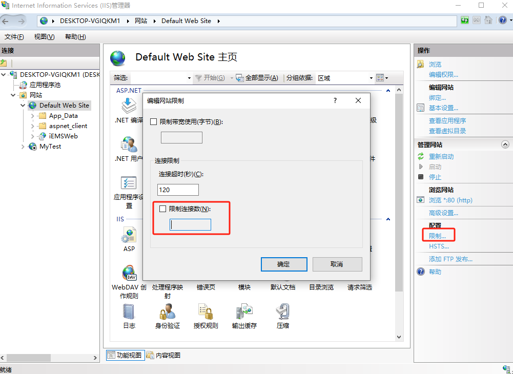
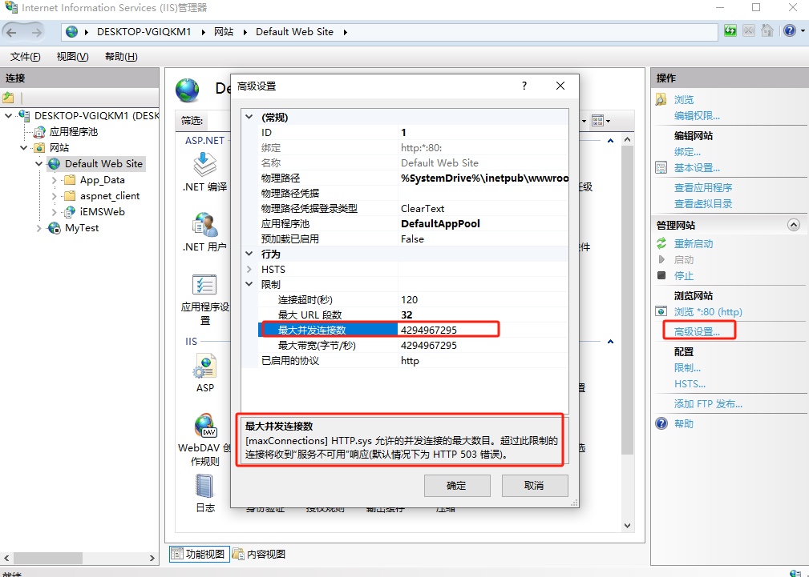
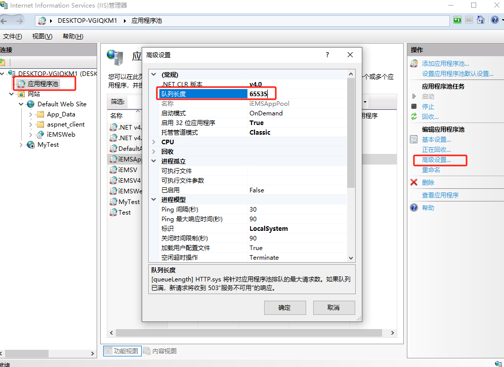
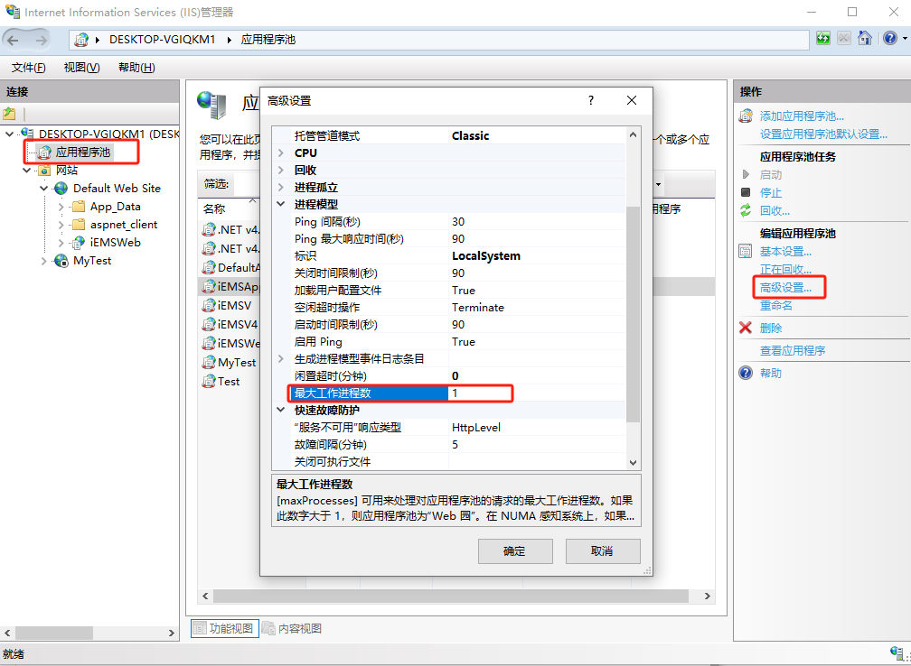
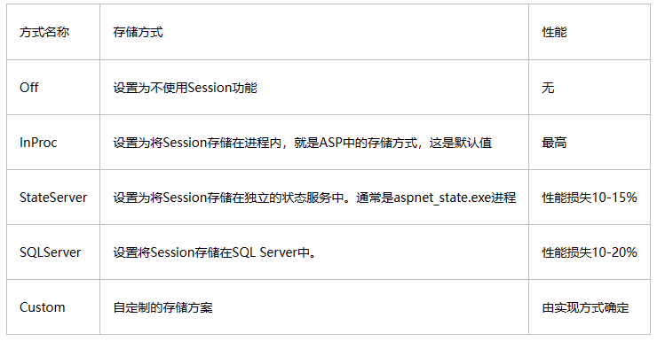

> 原文链接：[IIS 之 连接数、并发连接数、最大并发工作线程数、队列长度、最大工作进程数 - 桃花雪 - 博客园 (cnblogs.com)](https://www.cnblogs.com/l1pe1/p/7742936.html)

## IIS连接数

一般购买过虚拟主机的朋友都熟悉购买时，会限制IIS连接数，顾名思义即为IIS服务器可以同时容纳客户请求的最高连接数，准确的说应该叫“IIS限制连接数”。

客户请求的连接内容包括：

- 网站html请求，html中的图片资源，html中的脚本资源，其他需要连接下载的资源等等，任何一个资源的请求即一次连接（虽然有的资源请求连接响应很快）
- 如果网页采用框架（框架内部嵌套网页请求），那么一个框架即一次连接　　
- 如果网页弹出窗口（窗口内部嵌套网页请求），那么一个窗口一个连接　　

很多人对连接数的概念认识都很模糊，现介绍如下：

- 浏览者访问站点，必需与站点通过TCP协议，建立连接。这个连接在从服务器上读取信息时存在，读取结束时，一般即自动关闭。所以，当一个页面已经完全地显示在客户端的显示器上时，使用的连接也许已经关闭了。
- 每个浏览者，访问某站点时，可能会占用1-3多个连接，这是由计算机自动处理的，这样做的目的是为了加快速度。所以，对于连接数为30的基础型主机而言，有时只能十几个人访问。
- 虽然服务器中可以规定每个站点的最大连接数，但同时也存在服务器的总计最大连接数。所以，即使规定用户站点的最大连接数为不限，当服务器达到了最大连接数时，仍不能访问站点。而服务器的最大连接数一般在1000—2000。

注意：

- 这就是为什么服务商敢于开出不限连接数的主机，本质上不是无限连接数的。
-  西部数码提供的主机，允许连接数均较高，一般可以满足用户需求。

在IIS（6.2版及以上版本）中  “点击网站”->“右击切换到功能视图”->“点击界面右侧的 ‘限制...’ 链接”->“编辑网站限制”

限制连接数(N)即为虚拟主机供应公开的IIS连接数标准，如果购买的IIS连接数为50,那么我们不得不考虑网站的内容框架和访问量。

如果网站图片够多，弹窗窗口随意（可能连时间选择框、简单条件筛选框也用弹出新窗口），加上不得已的打开新页面浏览内容，那么仅仅能容忍10个人同时操作也很正常，我不会把这个操作描述为很多网站说的“10同时在线”，这很容易让人误解，在用户的一次请求（表面上可能是刷新一次网页，实际上内部请求不止一次，事实上很少只有一次）都完成得到服务器响应完毕之后，连接全部会被释放，当然在你看到展示的页面之前，内部嵌套如果有请求图片等连接请求，连接会早早的被释放。

事实上，很多企业门户网站访问量低的惊人，IIS连接数为50也是绰绰有余了。

## IIS最大并发连接数

“管理网站” → “高级设置...” → “限制” → “最大并发连接数”

　其实，普通用户常说的“IIS连接数”就是这边的“最大并发连接数”，如果PC端有IIS的朋友，可以测试上述“限制连接数”和“最大并发连接数”的设置，是相互影响的。“最大并发连接数”默认为：4294967295，这是一个很惊人的数字，难道这代表着网站能具有并发执行连接数为4294967295的能力？

**这边做两个假设：**

1、很多虚拟主机供应商所说的无并发连接数限制真的成立吗？

2、每个连接的处理，IIS都会开启一个线程去处理，假设这个处理方式成立，那么4294967295个并发连接请求来了是否IIS会立即启动4294967295个线程去处理？

**对于假设1：**很显然不成立，最大并发连接数的设置绝对有上限；

**对于假设2：**这是很多朋友的误区，假设4294967295并发连接同时来了，IIS不会立即启动4294967295个线程去处理，因为这不现实，对于处理连接，IIS是有“最大并发工作线程数”限制的。从一些资料上查阅到，该数字跟操作系统相关，win7系统的IIS的值是10（或者其他不确定），VS2012自带的IIS Express的值是80。对于windows服务器版本的系统的具体值不清楚，即4294967295个并发连接来了后，（这边以win7下的10为例），iis第一时间只能启动10个工作线程去处理，那么其他4294967285必须排队，排队对用户的体验来说就是网页正在加载，但是什么都不显示，然后此时购买了据虚拟主机供应商所说的无并发连接数限制的客户就要开始狂暴了，为何购买了所谓的“无限并发连接数”，还是会一直在加载的情况，这就是IIS处理能力有限的问题。

​    当然服务器没有直接返回“HTTP Error 503. The service is unavailable.”应该也算是一些你花更多钱的安慰吧，因为你只购买了IIS连接数为50的话，那么第50+1个连接请求操作得到的就直接是“HTTP Error 503. The service is unavailable.”了。另外，如果web服务器的硬件设备够牛，那么IIS的工作线程也会处理的更快，那么响应的用户等待的时间也会更短（前提是IIS连接数够大，否则就直接503了）。

　　总的来说，**最大并发连接数，影响了排队的数量**，很多时候需要我们评估自己的网站的最大并发连接数，然后来进行设置最佳数量。

## IIS最大并发工作线程数

　　在上面有所涉及，简单的说就是 IIS 在并发连接请求过来时的处理机制，它会更智能的以某个数量级为单位来分批处理，让没有处理连接请求排队等待，用户浏览器中对于排队等待的响应就是“正在加载”，这比页面直接显示“HTTP Error 503. The service is unavailable.”更加能让人接受。但是切勿怒点刷新按钮，因为点的越多，请求在排队队列中越靠后。

　　当然很多朋友会说，为什么我有时候第一次刷不出来，重新多刷一次内容就出来了，

**可能是：**

- 页面脚本哪个地方下载或者处理出了问题，导致页面显示异常或者直接不显示
- 你重新刷新的那个秒级别的操作，web服务器更快速的已经处理好了其他队列的请求或者他人放弃了对web服务器连接请求的操作
- 路由或者宽带网络运营商问题（不稳定）
- 浏览器或者本身电脑问题

暂不知道“IIS最大并发工作线程数”有无地方可以设置。

## 队列长度

最大并发连接数，影响了排队的数量，那么进一步影响排队数量的设置就是队列长度。

假设最大连接数设置为100，1000个并发连接请求过来了，首先900直接返回给客户“HTTP Error 503. The service is unavailable.”

然后IIS先启动（假设最大并发工作线程数为10）10个线程处理请求，其他90个进入排队状态，如果此时如下操作：

“应用程序池” → 找到网站的所属应用程序池 → 右键“高级设置...” → “常规” → “列队长度”，设置为20

那么实际情况只会有20个进入排队状态了，70（队列中的20-90）个请求也会立刻返回“HTTP Error 503. The service is unavailable”，IIS 默认队列长度设置是1000，范围在10-65535 之间。

## 最大工作进程数

IIS 6.0 及以后允许将应用程序池配置成一个Web园（Web Garden）。每个应用程序池的单一工作进程，能够大约承受30-50个左右的并发。

“应用程序池” → 找到网站的所属应用程序池 → 右键“高级设置...” → “进程模型” → “最大工作进程数”，默认值为1。

​	如果这个值大于 1，那么当有连接请求时会启动多个新的工作进程实例，可启动的最多进程数为所指定的最大工作进程数，后续更多的请求将以循环的方式发送至工作进程，这样每个工作进程都能承担负载一些连接请求，当然是以消耗cpu等硬件做代价，这是值得的，如果web服务器cpu使用率很低但是又需要更高效的处理并发连接请求，应当这样做。

​	如果网站中用到了依赖进程的Session和Cache等对象，则不能保存在服务器内存中，存储方式选用StateServer或者SQLServer会更好，另外多个工作进程切换时会有上下文复制，这也是资源消耗更多地方。

### 最大工作进程数值的设置依据

​	在确定每个应用程序池的最大工作进程数时，最主要参考的数据包括网站的最大并发用户数以及WEB服务器的可用内存数。最大并发用户数需要通过一段时间的观察，记录下在系统忙时的最大并发用户数，按照每工作进程能承载30个并发的原则来确定应用程序池的最大工作进程数。同时要注意，每个工作进程大约会占用200M左右的系统内存，在设置最大工作进程数的时候，要主要最大工作进程数与200M的乘积不要超过系统最大可用内存数。一般情况下，建议按照每次增加5个工作进程数的方式对最大工作进程数进行调整，调整完后对网站观察一段时间，如依然无法满足要求，再继续增加5个工作进程数。

### session共享问题

　　如果网站没有用到session机制，则不会引发此问题。如果用到了session机制进行传值和保存数据，则需要考虑在应用程序池多个工作进程间进行session共享，防止出现session丢失的问题。此问题的解决措施见 Asp.Net 之 Session共享设置。

#### Asp.Net的Session共享设置

Asp.Net提供了以下几种Session保存机制，如表 1所示：Session保存方式

　 在Asp.Net程序的web.config配置文件中对Session的保存方式进行设置。如果不显示指定Session的保存方式，默认使用InProc的方式保存，即Session由提供服务的工作进程保存。

　　为了提高IIS对高并发的支持，可以增加应用程序池的工作进程数，IIS会根据内置的调度算法，将用户的请求在多个工作进程间动态分配，如果搭建了服务器集群和负载均衡，则用户请求会在多台机器的多个工作进程间进行动态分配。在上述情况下，如果Session的保存方式依然为InProc，则用户请求在多个工作进程间切换时可能出现Session丢失的情况，导致请求失败或出错。

　　为解决上述为，需要将Session的保存方式设置为共享，即表 1中的“StateServer”、“SQLServer”或“Custom”方式。这几种方法中，“SQLServer”方式需要安装独立的SQLServer数据库，“Custom”方式需要自行实现相应的Session存储与检索过程，部署起来相对复杂，相对上述两种方式，“StateServer”方式在功能性和可实施性上最好。

## 总结

　当很多请求同时到来的时候，IIS会根据【最大并发连接数】来判断是否有多余的请求，多余的请求直接返回503，然后再根据【队列长度】来判断是否有多余的请求排不了队，排不了队的也直接返回503。所以，如何设置【最大并发连接数】和【队列长度】，实际上是有公式可以计算的：

　　**最大并发连接数 = 队列长度 + IIS最大并发工作线程数**

　　IIS的默认值对我们网站并发处理能力的影响：

　　IIS默认的" 最大并发连接数 "为4294967295（42亿多），而" 队列长度 "默认值为1000。对于windows server版本的IIS，最大并发工作线程数可能几百（猜测，可能没有限制），按照这个默认值，那么IIS同时处理的请求数也就1000多。1000多这个数字才是IIS真正的并发处理能力，而这个能力跟我们的代码没有关系。

　　哪些指标是评判我们网站的处理能力的呢？最重要的指标可能莫过于" 每秒处理请求数 "（在性能分析器里面可以查看），这个数字也叫吞吐率。如果每个请求处理速度非常快，那么那么网站吞吐率就大，吞吐率大那么支持的同时在线人数就大。如果要做秒杀，那就看你的秒杀相关的URL支持多大的吞吐率吧。

　　CPU的计算能力是如何影响网站的处理能力的呢？还是那么多请求，如果CPU很强大，能够缩减每个请求的处理时间，那必然会提高吞吐率。还有很多的请求，如果花在网络传输或者到数据库的传输时间比较多，这部分等待时间CPU是闲置的，如果能够提高CPU的利用率，也可能提高网站的处理能力，最充分的利用服务器的资源。如果不想改代码而想提高CPU利用率，可以在IIS的应用程序池中设置最大工作进程数（默认值为1），可以设置为10如果当前CPU利用率只有百分之几的话，调整这个数值需要特别注意每一个工作进程是独立的应用程序，全局静态变量不共享。