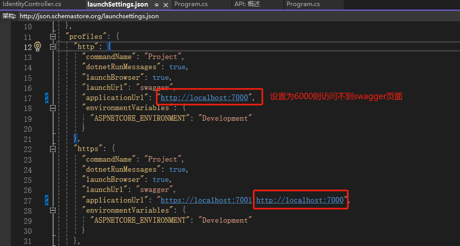

### yield关键字

[yield：一个与循环语句绝配的C#语法 - 知乎 (zhihu.com)](https://zhuanlan.zhihu.com/p/654506407)

### explicit和implicit

[C#中的explicit和implicit了解一下吧 - 依乐祝 - 博客园 (cnblogs.com)](https://www.cnblogs.com/yilezhu/p/10898582.html)

### 项目配置

**.NET Core，.NET5 固定输出目录，不要版本目录**

```xml
<PropertyGroup>  <AppendTargetFrameworkToOutputPath>false</AppendTargetFrameworkToOutputPath>  <AppendRuntimeIdentifierToOutputPath>false</AppendRuntimeIdentifierToOutputPath>
</PropertyGroup>
```

### BeginInvoke

**.net core委托不支持BeginInvoke**

Net Framework

```C#
delegate int WorkDelegate(int arg);
...
WorkDelegate del = DoWork;

// Calling del.BeginInvoke starts executing the delegate on a
// separate ThreadPool thread
Console.WriteLine("Starting with BeginInvoke");
var result = del.BeginInvoke(11, WorkCallback, null);

// This writes output to the console while DoWork is running in the background
Console.WriteLine("Waiting on work...");

// del.EndInvoke waits for the delegate to finish executing and 
// gets its return value
var ret = del.EndInvoke(result);
```

NetCore

```C#
delegate int WorkDelegate(int arg);
...
WorkDelegate del = DoWork;

// Schedule the work using a Task and 
// del.Invoke instead of del.BeginInvoke.
Console.WriteLine("Starting with Task.Run");
var workTask = Task.Run(() => del.Invoke(11));

// Optionally, we can specify a continuation delegate 
// to execute when DoWork has finished.
var followUpTask = workTask.ContinueWith(TaskCallback);

// This writes output to the console while DoWork is running in the background.
Console.WriteLine("Waiting on work...");

// We await the task instead of calling EndInvoke.
// Either workTask or followUpTask can be awaited depending on which
// needs to be finished before proceeding. Both should eventually
// be awaited so that exceptions that may have been thrown can be handled.
var ret = await workTask;
await followUpTask;

```

详细说明参考：https://devblogs.microsoft.com/dotnet/migrating-delegate-begininvoke-calls-for-net-core/

### Swagger

问题：如果launchSettings.json配置http端口为6000（如下）,则会导致以http方式启动项目时无法访问swagger页面，但是设置为其他端口则可以正常显示



原因：不明