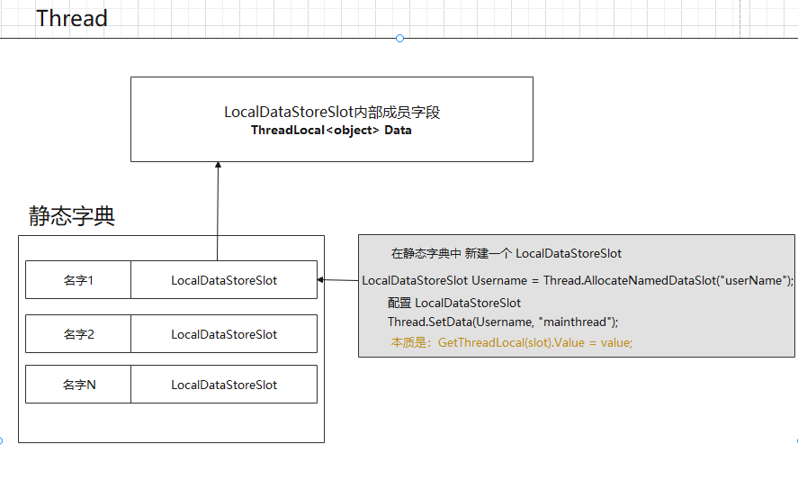

# 线程本地存储

线程本地存储（Thread Local Storage），字面意思就是专属某个线程的存储空间。变量大体上分为全局变量和局部变量，一个进程中的所有线程共享地址空间，这个地址空间被划分为几个固有的区域，比如堆栈区，全局变量区等，全局变量存储在全局变量区，虚拟地址固定；局部变量存储在堆栈区，虚拟地址不固定。每个线程都有自己的栈空间，局部变量就存储在栈空间里面，虽然这个局部变量是与线程相联系的，但是这个局部变量不能在不同的函数栈中互相直接访问，但TLS可以，概括来讲，TLS是属于线程的“局部变量”，作用域为线程作用域，而不像全局变量为全局作用域，局部变量为局部作用域，因为这个变量独属于这个线程，所以这个变量是线程安全的。

TLS保证了对象在线程内唯一的。

.NET 提供了 三种线程本地存储：相对于线程的静态字段（**ThreadStatic**）、数据槽（**LocalDataStoreSlot** ）和**ThreadLocal<T>**。

- **ThreadStatic**：如果可以在编译时预测确切需求，请使用线程相对静态字段（Visual Basic 中的线程相对 `Shared` 字段）。相对于线程的静态字段的性能最佳。 它们还支持编译时类型检查。

- **LocalDataStoreSlot**：如果只能在运行时发现实际需求，请使用数据槽。 数据槽使用起来比线程相对静态字段更慢、更加棘手。由于数据存储为类型 [Object](https://docs.microsoft.com/zh-cn/dotnet/api/system.object)，因此使用前必须将它强制转换为正确类型。

- **ThreadLocal<T>**：在.NET Framework 4.0以后新增了一种泛型化的本地变量存储机制 - ThreadLocal`<T>`。他的出现更大的简化了TLS的操作，下面的例子也是在之前例子基础上修改的。

  对比之前代码就很好理解ThreadLocal`<T>`的使用，ThreadLocal`<T>`的构造函数接收一个lambda用于线程本地变量的延迟初始化，通过Value属性可以访问本地变量的值。

  IsValueCreated可以判断本地变量是否已经创建。 

## 相对于线程的静态字段

背景：为了解决多线程竞用共享资源的问题，引入数据槽的概念，即将数据存放到线程的环境块中，使该数据只能单一线程访问.（属于线程空间上的开销）

1、如果确定一条数据始终对线程和应用域是唯一的，请向静态字段应用 [ThreadStaticAttribute](https://docs.microsoft.com/zh-cn/dotnet/api/system.threadstaticattribute) 属性。 此字段的使用方法与其他任何静态字段一样。 此字段中的数据对使用它的每个线程都是唯一的。

2、使用 [ThreadStaticAttribute标记的`static`字段](https://docs.microsoft.com/zh-cn/dotnet/api/system.threadstaticattribute?view=net-6.0) 不会在线程之间共享。 每个执行线程都有单独的字段实例，并分别设置和获取该字段的值。 如果在不同的线程上访问该字段，则该字段将包含不同的值。

3、请注意，除了将特性应用于 [ThreadStaticAttribute](https://docs.microsoft.com/zh-cn/dotnet/api/system.threadstaticattribute?view=net-6.0) 字段外，还必须将其定义为 c # 中的 `static`字段

4、相对于线程的静态字段的性能优于数据槽，并支持编译时类型检查。

5、请注意，任何类构造函数代码都会在访问此字段的首个上下文中的第一个线程上运行。 在同一应用域中的其他所有线程或上下文中，如果字段是引用类型，便会初始化为 `null`（Visual Basic 中的 `Nothing`）；如果字段是值类型，便会初始化为默认值。 因此，不得依赖类构造函数来初始化线程相对静态字段。 相反，请避免初始化线程相对静态字段，而是假设它们初始化为 `null` (`Nothing`) 或默认值。

 6、如果数据类型确定请使用相对于线程的静态字段。

7、[ThreadStaticAttribute](https://docs.microsoft.com/zh-cn/dotnet/api/system.threadstaticattribute?view=net-6.0)属性声明如下：

```C#
[System.AttributeUsage(System.AttributeTargets.Field, Inherited=false)]
public class ThreadStaticAttribute : Attribute
```

 案例

```C#
class Programe
{
   
    [ThreadStatic] public static string Username = "";
    static void Main()
    {

        Username = "mainthread";
   
        Thread thread1 = new Thread(() => {  Username = "thread1"; Console.WriteLine($"Username：{Username}"); });
        Thread thread2 = new Thread(() => { Username = "thread2"; Console.WriteLine($"Username：{Username}"); });
        Thread thread3 = new Thread(() => { Username = "thread3"; Console.WriteLine($"Username：{Username}"); });
  
        thread1.Start();
        thread2.Start();
        thread3.Start();

        Console.WriteLine($"Username：{Username}");
    }
 
}


//输出结果：
//Username：mainthread
//Username：thread1
//Username：thread2
//Username：thread3
```

## 数据槽（**LocalDataStoreSlot** ）

数据槽 LocalDataStoreSlot简称DataSlot

背景：为了解决多线程竞用共享资源的问题，引入数据槽的概念，即将数据存放到线程的环境块中，使该数据只能单一线程访问.（属于线程空间上的开销）



 Thread 静态类的内部有一个静态类LocalDataStore。该类维护这一个静态字典，该字典装着所有线程的LocalDataStoreSlot的变量。LocalDataStoreSlot类是ThreadLocal<object> Data封装。 

**AllocateNamedDataSlot命名槽位和AllocateDataSlot未命名槽位 解决线程竞用资源共享问题。** 

数据槽对于每个线程都是唯一的。 没有其他线程 (甚至子线程) 可以获取该数据。

.NET 提供了对于线程和应用程序域都是唯一的动态数据槽。 数据槽分为下列两种类型：命名槽和未命名槽。 两种类型都是使用 [LocalDataStoreSlot](https://docs.microsoft.com/zh-cn/dotnet/api/system.localdatastoreslot) 结构实现。[LocalDataStoreSlot](https://docs.microsoft.com/zh-cn/dotnet/api/system.localdatastoreslot) 封装的是internal ThreadLocal<object> Data 字段。

- 若要创建命名数据槽，请使用 [Thread.AllocateNamedDataSlot](https://docs.microsoft.com/zh-cn/dotnet/api/system.threading.thread.allocatenameddataslot) 或 [Thread.GetNamedDataSlot](https://docs.microsoft.com/zh-cn/dotnet/api/system.threading.thread.getnameddataslot) 方法。 若要获取对现有命名槽的引用，请将它的名称传递给 [GetNamedDataSlot](https://docs.microsoft.com/zh-cn/dotnet/api/system.threading.thread.getnameddataslot) 方法。
- 若要创建未命名数据槽，请使用 [Thread.AllocateDataSlot](https://docs.microsoft.com/zh-cn/dotnet/api/system.threading.thread.allocatedataslot) 方法。

对于命名槽和未命名槽，请使用 [Thread.SetData](https://docs.microsoft.com/zh-cn/dotnet/api/system.threading.thread.setdata) 和 [Thread.GetData](https://docs.microsoft.com/zh-cn/dotnet/api/system.threading.thread.getdata) 方法设置和检索槽中的信息。 这些静态方法始终处理当前正在执行它们的线程的数据。

命名槽非常便捷，因为可以在需要时检索槽，具体操作是将它的名称传递给 [GetNamedDataSlot](https://docs.microsoft.com/zh-cn/dotnet/api/system.threading.thread.getnameddataslot) 方法，而不用维护对未命名槽的引用。 不过，如果另一个组件对线程相对存储使用相同的名称，并且线程同时执行你的组件和另一个组件的代码，这两个组件可能会相互损坏数据。 （此方案假定这两个组件都在同一个应用域中运行，并不旨在共享相同的数据。） 

显然ThreadStatic特性只支持静态字段太受限制了，.NET线程类型中的LocalDataStoreSlot提供更好的TLS支持，但是性能不如上面介绍的ThreadStatic方法。注意：LocalDataStoreSlot有命名类型和非命名类型区分。

我们先来看看**命名的LocalDataStoreSlot类型**，可以通过Thread.AllocateNamedDataSlot来分配一个的空间，通过Thread.FreeNamedDataSlot来销毁一个的空间。

把线程相关的数据存储在LocalDataStoreSlot对象中，数据槽的获取和设置则通过Thread类型的GetData方法和SetData方法。

存放局部存储步骤：
1、申请数据槽：Thread.GetNamedDataSlot("para");如果不存在名为para的数据槽，将分配一个所有线程均可用的para数据槽
2、往数据槽存放数据：Thread.SetData(slot,para);
3、如有必要，释放数据槽：Thread.FreeNamedDataSlot("para");
释放数据槽要小心，该操作将使所有线程存放在被释放的数据槽中的数据丢失。

```C#
class Programe
{
    static void Main()
    {

            LocalDataStoreSlot Username = Thread.AllocateNamedDataSlot("userName");
            Thread.SetData(Username, "mainthread");
            Thread thread1 = new Thread(() =>
            {
                //Username = Thread.AllocateNamedDataSlot("userName"); 会报错，因为静态字典中已经存在了同名的数据槽
                LocalDataStoreSlot Username = Thread.AllocateNamedDataSlot("userName1");
                Thread.SetData(Username, "Thread1");
                Console.WriteLine($"Username1：{Thread.GetData(Username)}");
            });
            Thread thread2 = new Thread(() =>
            {
                LocalDataStoreSlot Username = Thread.AllocateNamedDataSlot("userName2");
                Thread.SetData(Username, "Thread2");
                Thread.Sleep(10000);
                Console.WriteLine($"Username2：{Thread.GetData(Username)}");
            });
            Thread thread3 = new Thread(() =>
            {
                LocalDataStoreSlot Username = Thread.AllocateNamedDataSlot("userName3");
                Thread.SetData(Username, "Thread3");
                Console.WriteLine($"Username3：{Thread.GetData(Username)}");
            });

            thread1.Start();
            thread2.Start();
            Thread.Sleep(10000);
            Console.WriteLine($"Username：{Thread.GetData(Username)}");
            thread3.Start();
    }
 
}

//输出结果：
//Username：mainthread
//Username：Thread1
//Username：Thread2
//Username：Thread3
```

## ThreadLocal<T> 类

该类相当与一个线程结界，将变量的值和作用限制在线程中。所以用该类包装过的类型是线程安全的。该类包装过的类型变量的只能在该线程中使用，其他线程包括子线程无法使用。

ThreadLoal 变量，线程局部变量，同一个 ThreadLocal 所包含的对象，在不同的 Thread 中有不同的副本。这里有几点需要注意：

- 因为每个 Thread 内有自己的实例副本，且该副本只能由当前 Thread 使用。这是也是 ThreadLocal 命名的由来。
- 既然每个 Thread 有自己的实例副本，且其它 Thread 不可访问，那就不存在多线程间共享的问题。

ThreadLocal 提供了线程本地的实例。它与普通变量的区别在于，每个使用该变量的线程都会初始化一个完全独立的实例副本。ThreadLocal 变量通常被private static修饰。当一个线程结束时，它所使用的所有 ThreadLocal 相对的实例副本都可被回收。

总的来说，ThreadLocal 适用于每个线程需要自己独立的实例且该实例需要在多个方法中被使用，也即变量在线程间隔离而在方法或类间共享的场景。

```C#
static void Main(string[] args)
{
     ThreadLocal<int> threadLocal = new ThreadLocal<int>();
     //在主线程这个变量值为1
     threadLocal.Value = 1;
     new Thread(() => Console.WriteLine($"托管线程ID：{Thread.CurrentThread.ManagedThreadId} 值为：{threadLocal.Value++}")).Start();
     new Thread(() => Console.WriteLine($"托管线程ID：{Thread.CurrentThread.ManagedThreadId} 值为：{threadLocal.Value++}")).Start();
     new Thread(() => Console.WriteLine($"托管线程ID：{Thread.CurrentThread.ManagedThreadId} 值为：{threadLocal.Value++}")).Start();
     Console.WriteLine($"主线程ID：{Thread.CurrentThread.ManagedThreadId} 值为：{threadLocal.Value}");
}

//输出结果：
//托管线程ID：10 值为：0
//主线程ID：1 值为：1
//托管线程ID：11 值为：0
//托管线程ID：12 值为：0
```