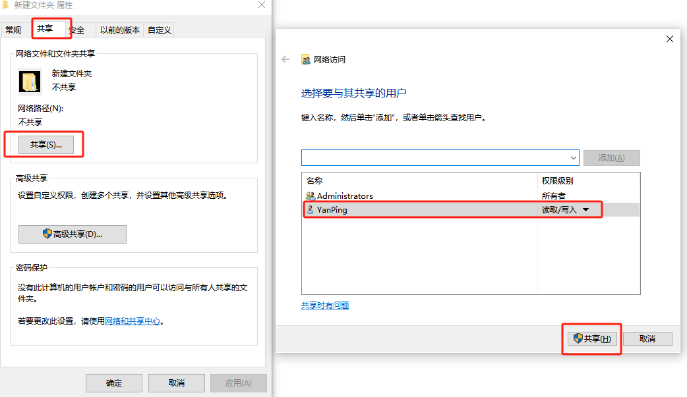
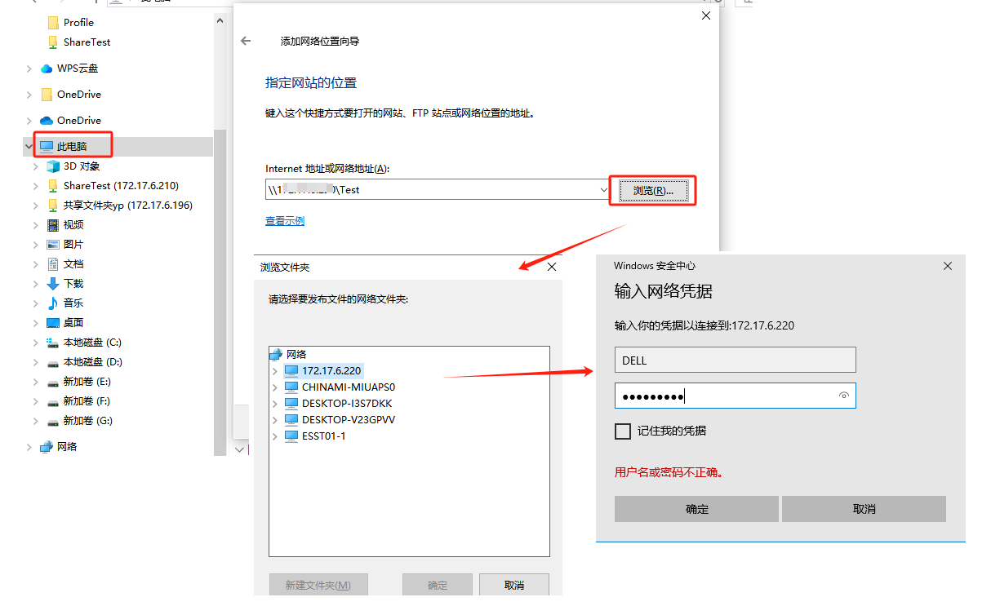
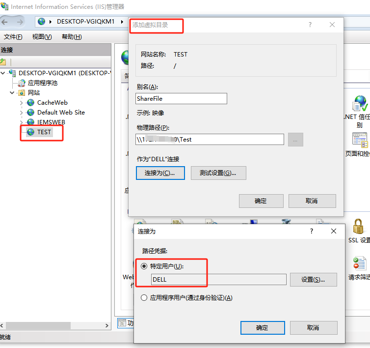
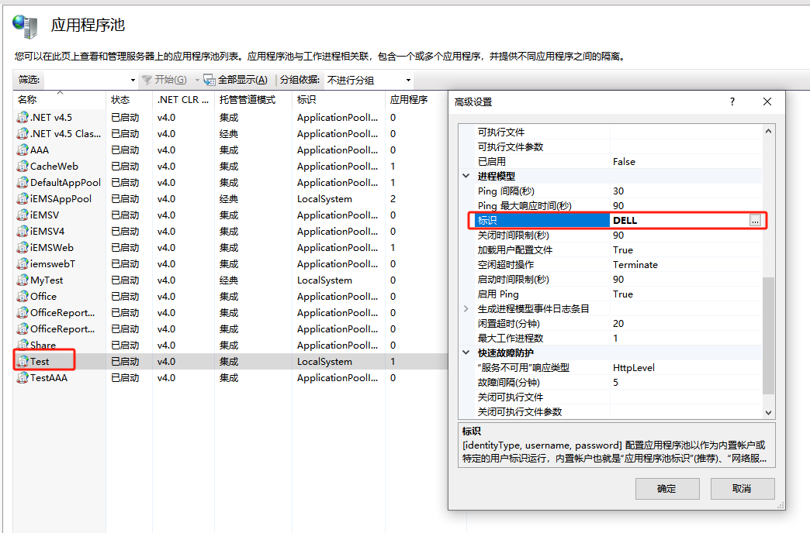

## 控制台

- 在服务器设置一个共享文件夹，在这里我的服务器ip地址是10.200.8.73，共享文件夹名字是share，访问权限，用户名是administrator，密码是11111111。

- 新建一个控制台项目。

- 添加后台代码如下：

  ```C#
  class Program
      {
          static void Main(string[] args)
          {
              bool status = false;
  
              //连接共享文件夹
              status = connectState(@"\\10.200.8.73\share", "administrator", "11111111");
              if (status)
              {
                  //共享文件夹的目录
                  DirectoryInfo theFolder = new DirectoryInfo(@"\\10.200.8.73\share");
                  //相对共享文件夹的路径
                  string fielpath=@"\123\456\";
                  //获取保存文件的路径
                  string filename = theFolder.ToString() +fielpath ;
                  //执行方法
                  Transport(@"D:\1.jpg", filename, "1.jpg");
              }
              else
              {
                  //ListBox1.Items.Add("未能连接！");
              }
              Console.ReadKey();
          }
  
          public static bool connectState(string path)
          {
              return connectState(path, "", "");
          }
      
          /// <summary>
          /// 连接远程共享文件夹
          /// </summary>
          /// <param name="path">远程共享文件夹的路径</param>
          /// <param name="userName">用户名</param>
          /// <param name="passWord">密码</param>
          /// <returns></returns>
          public static bool connectState(string path, string userName, string passWord)
          {
              bool Flag = false;
              Process proc = new Process();
              try
              {
                  proc.StartInfo.FileName = "cmd.exe";
                  proc.StartInfo.UseShellExecute = false;
                  proc.StartInfo.RedirectStandardInput = true;
                  proc.StartInfo.RedirectStandardOutput = true;
                  proc.StartInfo.RedirectStandardError = true;
                  proc.StartInfo.CreateNoWindow = true;
                  proc.Start();
                  string dosLine = "net use " + path + " " + passWord + " /user:" + userName;
                  proc.StandardInput.WriteLine(dosLine);
                  proc.StandardInput.WriteLine("exit");
                  while (!proc.HasExited)
                  {                   
                      proc.WaitForExit(1000);
                  }
                  string errormsg = proc.StandardError.ReadToEnd();
                  proc.StandardError.Close();
                  if (string.IsNullOrEmpty(errormsg))
                  {
                      Flag = true;
                  }
                  else
                  {
                      throw new Exception(errormsg);
                  }
              }
              catch (Exception ex)
              {
                  throw ex;
              }
              finally
              {
                  proc.Close();
                  proc.Dispose();
              }
              return Flag;
          }
  
          /// <summary>
          /// 向远程文件夹保存本地内容，或者从远程文件夹下载文件到本地
          /// </summary>
          /// <param name="src">要保存的文件的路径，如果保存文件到共享文件夹，这个路径就是本地文件路径如：@"D:\1.avi"</param>
          /// <param name="dst">保存文件的路径，不含名称及扩展名</param>
          /// <param name="fileName">保存文件的名称以及扩展名</param>
          public static void Transport(string src, string dst,string fileName)
          {
              FileStream inFileStream = new FileStream(src, FileMode.Open);
              if (!Directory.Exists(dst))
              {
                  Directory.CreateDirectory(dst);
              }
              dst = dst  + fileName;
              FileStream outFileStream = new FileStream(dst, FileMode.OpenOrCreate);
  
              byte[] buf = new byte[inFileStream.Length];
  
              int byteCount;
  
              while ((byteCount = inFileStream.Read(buf, 0, buf.Length)) > 0)
              {
                  outFileStream.Write(buf, 0, byteCount);
              }
  
              inFileStream.Flush();
              inFileStream.Close();
              outFileStream.Flush();
              outFileStream.Close();
          }
      }
  ```

## IIS部署

**环境说明**

现有2台服务器：A, B ;

A服务器:图片服务器，提供共享文件夹Ashare。

B 部署报表系统，使用A提供的Ashare文件。

提醒下，如果B的程序是跑的IIS Express，访问A的Ashare没问题，但是使用IIS，就访问不到。不信你试试，下面讲解是让IIS也能访问到的全过程。

**创建共享文件**
首先建立共享文件，不要嫌弃，创建这里也给整理一下。

- 要共享出来的文件，右击属性：共享，加入用户权限。

  

- 来到172.18.5.61，B服务器，打开我的电脑，在空白处右击，添加网路位置：

  

  

- 验证A服务器的用户密码，然后就可以啦。

**IIS创建虚拟目录**

- 如果程序中有连接远程共享文件夹的处理（即调用控制台程序中的connectState函数，则无需进行如下配置）

- 右击B服务器的当前站点，添加虚拟目录---连接为---特定用户：具体配置如下

  

  **这里需要注意的是，A文件共享服务器需要创建YanPing用户名，B，C应用服务器也要创建同样的用户名DELL。谨记，必须！！**

- 该站点也需要制定特定用户访问，且访问用户为共享目录提供的DELL用户。

  

  


