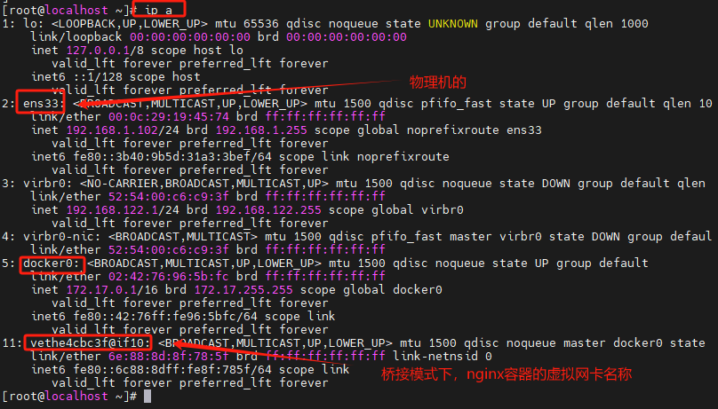

# 基础知识

## 什么是Docker

Docker是一种开源的容器化平台，它可以帮助开发人员和运维团队更轻松地创建、部署和运行应用程序。Docker利用了Linux操作系统的特性，如命名空间（namespaces）和控制组（cgroups），实现了虚拟化技术中的容器化。容器是一种轻量级、独立的运行环境，其中包含应用程序及其依赖的所有组件，例如库文件、配置文件和运行时环境。

通过Docker，开发人员可以将应用程序和其依赖打包成一个称为Docker镜像（Docker Image）的单个可执行文件。这个镜像包含了应用程序的代码、运行时环境和所有的依赖项，使得应用在任何支持Docker的环境中都能以相同的方式运行，无论是开发环境、测试环境还是生产环境。

Docker的一个重要特性是它提供了简单且快速的容器管理工具，可以通过命令行或图形界面对容器进行创建、启动、停止、删除等操作。这使得开发人员可以更加高效地管理应用的生命周期，快速地构建、测试和部署应用程序。

Docker的流行得益于它的高度可移植性、资源效率和快速启动等优势。它已经成为现代云计算和容器编排技术的核心组件，为应用部署和管理带来了革命性的改变。

## 什么是容器和虚拟化


###  传统虚拟化技术

传统虚拟化技术主要基于Hypervisor，也称为虚拟机监控器（VMM），它是一种软件或硬件层，允许在物理硬件上运行多个虚拟机。这些虚拟机是完全独立的，每个虚拟机都有自己的操作系统（Guest OS）运行在虚拟硬件上。Hypervisor负责将物理硬件资源划分为多个虚拟资源，并确保它们之间相互隔离，以防止互相干扰。

传统虚拟化技术的工作原理如下：

- Hypervisor直接安装在物理硬件上，它可以访问CPU、内存、存储等硬件资源。
- 每个虚拟机在Hypervisor的管理下，它们的操作系统和应用程序以及虚拟硬件都运行在虚拟化的环境中。
- Hypervisor负责虚拟机的创建、销毁和管理，确保它们之间资源的隔离和安全性。
- 由于每个虚拟机都运行自己的操作系统，因此它们可以是不同的操作系统，如Windows、Linux等。

###  Docker容器

进程级隔离的虚拟化。相比传统虚拟化技术，Docker容器采用一种不同的虚拟化方式，它是一种轻量级的虚拟化，基于进程级隔离。Docker容器不需要Hypervisor，而是直接运行在宿主操作系统上。

Docker容器的工作原理如下：

- Docker利用Linux内核的特性，例如命名空间（namespaces）和控制组（cgroups），实现容器之间的进程级隔离和资源限制。
- 每个Docker容器运行在共享的宿主操作系统上，但是各自拥有自己的文件系统、网络空间和进程空间。
- 容器与宿主操作系统共享内核，因此启动和停止容器非常快速，并且几乎不会占用额外的资源。
- Docker镜像是容器运行的基础，它包含应用程序及其所有依赖项。容器可以从镜像创建，类似于类从对象实例化。

### Docker与传统虚拟机的比较

Docker容器和传统虚拟化技术（基于Hypervisor的虚拟机）都是虚拟化技术，但它们在一些关键方面有着显著的差异。在本节中，我们将对比Docker容器和传统虚拟化技术的优势和劣势，以及它们在不同应用场景中的适用性。

#### 资源消耗与性能

Docker容器： 由于Docker容器共享宿主操作系统的内核，它们比传统虚拟机更加轻量级，资源消耗更少。每个容器仅包含应用程序及其依赖项，不需要额外的操作系统，因此启动时间更快，占用的硬盘空间更小。

传统虚拟化技术： 传统虚拟机需要运行完整的操作系统，包括操作系统的内核和必要的库文件。这使得传统虚拟机在资源利用率和启动时间方面相对较低，占用更多的硬盘空间。

适用性： 在需要更高资源利用率和更快启动时间的场景下，Docker容器是更合适的选择。特别是在云计算环境中，Docker容器能够更好地满足弹性伸缩和快速部署的需求。

#### 隔离性与安全性

Docker容器： Docker容器使用进程级隔离，它们共享宿主操作系统的内核。这种隔离性较传统虚拟化技术要弱一些，容器之间可以访问同一内核的资源。尽管Docker在很大程度上保持了隔离性，但在安全敏感的场景下可能不如传统虚拟化技术的完全隔离。

传统虚拟化技术： 传统虚拟机运行在完全隔离的虚拟环境中，每个虚拟机都有自己的操作系统和内核。这种完全隔离确保了虚拟机之间的资源互不干扰，提供了更高的安全性。

适用性： 在安全性要求较高的场景中，传统虚拟化技术可能是更好的选择。特别是在多租户的云环境中，传统虚拟机的完全隔离性能够更好地保护不同用户之间的数据和资源。

#### 可移植性与部署简易性

Docker容器： Docker容器具有高度的可移植性，镜像可以在不同的环境中轻松迁移。容器的可移植性使得应用程序可以在开发、测试和生产环境之间无缝切换，大大简化了部署过程。

传统虚拟化技术： 传统虚拟机也可以进行迁移，但相较于Docker容器，其迁移过程相对复杂。虚拟机的迁移涉及到整个虚拟机镜像和操作系统的迁移，需要更多的时间和资源。

适用性： 在需要频繁迁移应用程序或在不同环境中部署的场景下，Docker容器的可移植性和部署简易性使其成为首选。特别是在持续集成和持续部署（CI/CD）的环境中，Docker容器的优势更加明显。

####  综合建议

根据以上对比，我们可以得出以下综合建议：

- 对于资源敏感、需要高性能和快速启动的场景： Docker容器是更优的选择，特别适用于云计算和容器编排的场景。
- 对于安全敏感的多租户环境： 传统虚拟化技术的完全隔离性提供了更高的安全性保障，更适合需要强隔离的场景。
- 在实现灵活部署的情况下： 可以结合使用Docker容器和传统虚拟化技术。例如，将核心服务和敏感数据使用传统虚拟机隔离，而将应用程序和开发环境使用Docker容器来快速部署。

综合而言，Docker容器和传统虚拟化技术各有优势，根据具体的应用需求和场景来选择合适的虚拟化技术，甚至可以结合使用两者，以达到更灵活、高效的部署方式。

# 镜像与容器的工作原理

## bootfs和rootfs

通常而言，Linux的操作系统由两类文件系统组成：bootfs（boot file system）和rootfs（root file system），它们分别对应着系统内核与根目录文件。bootfs层主要为系统内核文件，这层的内容是无法修改的。当我们的系统在启动时会加载bootfs，当加载完成后整个内核都会存到内存中，然后系统会将bootfs卸载掉。而rootfs层则包含了系统中常见的目录和文件，如/bin，/etc，/proc等等。

Docker的镜像技术可以使用宿主机的bootfs层，这使得镜像本身只需要封装rootfs层所需要的文件和工具即可。因此，镜像可以根据需要进行定制化封装，减少占用的存储空间，如部分极精简的镜像只有几MB大小。

在不同Linux发行版本中，它们之间的主要区别在于rootfs层，比如ubuntu使用apt管理软件，而Centos使用yum方式。而在内核层面，两者的差别并不大。因此，我们可以在一台主机上同时支持不同Linux系统的镜像而不出现报错，如同时启动Centos和Ubuntu的容器。

但需要注意的是，不管容器使用什么系统的镜像，实际的内核版本都与镜像无关，都为宿主机的内核。如ubuntu16.04 的容器跑在Centos7.x的宿主机上，虽然ubuntu的内核版本是4.x.x，但我们在容器中会看到内核为centos 7.x 的内核，即 3.x.x。如果是对内核版本的要求的程序，可能会因此受到影响。

## 镜像结构

Docker镜像采用分层的结构，由一些松耦合的只读层堆叠而成，并对外展示为一个统一的对象。所有的镜像都开始于一个基础的镜像层，当我们进行修改或内容添加时，会在镜像层上面创建新的一层。

最底层通常为基础层镜像，然后再层层叠加上来，比如安装一个Python软件，此时会在基础层上面添加一个新的层，上面包含了我们所安装的Python程序。


镜像做为所有镜像层的组合，如果镜像中有相同路径的文件，则上层镜像会覆盖下层镜像的内容，最终展示为所有层的数据汇总。

如下图所示，由于第二层的文件2与第一层具有相同的文件路径，则镜像将以第二层的文件2内容进行展示，第一层只有文件1会被显示。


我们再来回顾一下前面镜像拉取时的输出内容，Pull complete结尾的每一行代表镜像中某个被拉取的层，每个层级通过一个唯一的ID进行标识。

```shell
$ docker pull nginx:1.20
1.20: Pulling from library/nginx
5eb5b503b376: Pull complete
cdfeb356c029: Pull complete
d86da7454448: Pull complete
7976249980ef: Pull complete
8f66aa6726b2: Pull complete
c004cabebe76: Pull complete
Digest: sha256:02923d65cde08a49380ab3f3dd2f8f90aa51fa2bd358bd85f89345848f6e6623
Status: Downloaded newer image for nginx:1.20
docker.io/library/nginx:1.20
```

镜像层的松耦合代表着它不属于某个镜像独有，当不同镜像包含相同的层时，系统只会存储该层的一份内容，这是Docker镜像的重要特点，这样的好处有利于减少存储空间的占用。如下所示，当我们拉取另一个版本的Nginx镜像时，其中ID号为5eb5b503b376的层已经存在，则会显示为Already exists，直接使用此镜像层。

```shell
$ docker pull nginx:1.21
1.21: Pulling from library/nginx
5eb5b503b376: Already exists
1ae07ab881bd: Pull complete
78091884b7be: Pull complete
091c283c6a66: Pull complete
55de5851019b: Pull complete
b559bad762be: Pull complete
Digest: sha256:2834dc507516af02784808c5f48b7cbe38b8ed5d0f4837f16e78d00deb7e7767
Status: Downloaded newer image for nginx:1.21
docker.io/library/nginx:1.21
```

## 容器层

我们前面说到镜像层是只读模板，那么当我们使用镜像生成容器时，为什么又能写入数据呢？这个问题的答案涉及到一个概念：容器层。

当容器启动时，会有一个新的可写层被加载到镜像的顶部，这一层通常被称为容器层。所有对容器的修改都会发生在容器层，只有容器层是可写入的，容器层以下的镜像层都是只读的。


**当我们对容器进行操作时，底层的工作原理如下：**

- **读取文件：**当容器需要读取文件时，会先在容器层寻找，如果没有发现，则会从最上层的镜像层往下寻找，当找到文件后读取到内存使用。
- **增加文件：**当增加文件时，文件会直接写到最上面容器层，不会影响到镜像层内容。所以，当我们将容器删除时，容器中的文件也会随着消失。
- **修改文件：**此时，如果该文件是在容器层的，则会直接修改。否则的话，Docker会从上往下依次在各层镜像中查找此文件 ，当找到后将其复制到容器层中，并进行修改。这被称为容器的写时复制特性（Copy-on-Write），这个技术保证了我们对容器的修改不会影响到底层的镜像，也实现了一个镜像可以被多个容器共用。
- **删除文件：**当我们需要删除文件时，Docker也是由上往下寻找该文件 ，如果在容器层的文件会被直接删除，而在镜像层的文件则会被标记，此时在容器将不会再出现此文件，但镜像中的文件并不会做更改。

## 联合文件系统

关于镜像与容器功能的实现，依赖其使用了联合文件系统（UnionFS）技术，这是一种分层、轻量级并且高性能的文件系统。Docker 目前支持的联合文件系统包括 `OverlayFS`, `AUFS`, `VFS` `Device Mapper等`，而默认的存储驱动为Overlay2。

# Dokcer持久化

## 数据卷挂载

### 定义

数据卷设计的目的，在于数据的永久化，他完全独立于容器的生存周期，因此，Docker不会在容器删除时删除其挂载的数据卷，也不会存在类似的垃圾收集机制，对容器引用的数据卷进行处理。

特点

- `持久性`：容器数据卷是在主机上的持久目录，它们不会受到容器的生命周期的影响。即使容器被删除，数据卷仍然存在。
- `.共享性`：多个容器可以共享同一个数据卷，这样它们之间可以轻松地共享文件和数据。这对于多个容器之间的通信和数据共享非常有用。
- `数据卷容器`：可以创建一个专门用于管理数据卷的容器，其他容器可以通过挂载这个数据卷容器来访问其中的数据。这样可以使数据卷的管理更加灵活和方便。

- `数据卷的更新`：当数据卷中的内容被更新时，所有挂载该数据卷的容器都可以立即看到更新后的内容。这使得容器之间的数据同步更加简单。

### 实现数据卷的挂载

```shell
# 创建数据卷
docker volume create hello

# 挂载数据卷
docker run -d -it -v hello:/world busybox

#查看文件是否挂载成功
docker exec -it 38796429a94e /bin/sh
ls 

#其他命令
# 删除数据卷
docker volume rm hello

# 查看数据卷的详细信息
docker volume inspect hello

# 查看数据卷的列表
docker volume ls

```

## 数据卷容器挂载

命名的容器挂载数据卷，其他容器通过挂载这个容器实现数据共享，挂载数据卷的这个容器成为数据卷容器

使用数据卷挂载数据实际上这个数据卷容器所起到的作用仅仅是将数据挂载的配置传递到挂载了这个数据卷容器的容器中。所以在docker中如果一个数据卷还在被容器使用，那么它就会一直存在。

```shell
# 启动容器并进行数据卷挂载
# 未指定宿主机容器，/dbdata为匿名数据卷
docker run -d -it --name dbdata -v /dbdata busybox:latest

# 挂载数据卷容器
# --volumes-from用来挂载指定容器的数据卷
docker run -d -it --name db1 --volumes-from dbdata busybox:latest

# 挂载数据卷容器
docker run -d -it --name db2 --volumes-from dbdata busybox:latest
#--volumes-from可挂载多个
docker run -d -it --name db2 --volumes-from dbdata --volumes-from dbdata1 busybox:latest

#dbdata 、db1、db2共享dbdata
```

应用：--volumes-from 顾名思义，就是从另一个容器当中挂载容器中已经创建好的数据卷。如果你有一些持续更新的数据需要在容器之间共享，最好创建数据卷容器。 数据卷容器，其实就是一个正常的容器，专门用来提供数据卷供其它容器挂载的。

# Dokcer网络

## 关于Docker0

查看本地IP

```shell
[root@localhost _data]# ip addr
1: lo: <LOOPBACK,UP,LOWER_UP> mtu 65536 qdisc noqueue state UNKNOWN group default qlen 1000
    link/loopback 00:00:00:00:00:00 brd 00:00:00:00:00:00
    inet 127.0.0.1/8 scope host lo
       valid_lft forever preferred_lft forever
    inet6 ::1/128 scope host
       valid_lft forever preferred_lft forever
2: ens33: <BROADCAST,MULTICAST,UP,LOWER_UP> mtu 1500 qdisc pfifo_fast state UP group default qlen 1000
    link/ether 00:0c:29:c1:ba:21 brd ff:ff:ff:ff:ff:ff
    inet 192.168.1.103/24 brd 192.168.1.255 scope global noprefixroute ens33
       valid_lft forever preferred_lft forever
    inet6 fe80::521f:87ab:2c41:2660/64 scope link noprefixroute
       valid_lft forever preferred_lft forever
3: docker0: <NO-CARRIER,BROADCAST,MULTICAST,UP> mtu 1500 qdisc noqueue state DOWN group default
    link/ether 02:42:7c:20:3c:4a brd ff:ff:ff:ff:ff:ff
    inet 172.17.0.1/16 brd 172.17.255.255 scope global docker0
       valid_lft forever preferred_lft forever
    inet6 fe80::42:7cff:fe20:3c4a/64 scope link
       valid_lft forever preferred_lft forever
```

- lo      	127.0.0.1      # 本机回环地址
- eth33         192.168.1.103   # 虚拟机的ip
- docker0       172.17.0.1       # docker网桥

> lo和eth33在我们的虚拟机启动的时候就会创建，但是docker0在我们安装了docker的时候就会创建。docker0用来和虚拟机之间通信。

当 Docker 启动时，会自动在主机上创建一个 docker0 虚拟网桥，实际上是 Linux 的一个 bridge，可以理解为一个软件交换机。它会在挂载到它的网口之间进行转发。

当创建一个 Docker 容器的时候，同时会创建了一对 veth pair 接口(当数据包发送到一个接口时，另外一个接口也可以收到相同的数据包)。这对接口一端在容器内，即 eth33 ;另一端在本地并被挂载到docker0 网桥，名称以 veth 开头(例如 vethAQI2QT )。通过这种方式，主机可以跟容器通信，容器 之间也可以相互通信。Docker 就创建了在主机和所有容器之间一个虚拟共享网络。


## 容器网络模型（CNM）


核心组件包括：

- 沙盒（sandbox）
   一个沙盒也包含了一个容器网络栈的信息。沙盒可以对容器的接口、路由和DNS设置等进行管理。沙盒的实现可以是Linux netwrok namespace、FreeBSD jail或者类似的机制。一个沙盒可以有多个端点和多个网络。

- 端点（endpoint）
   一个端点可以加入一个沙盒和一个网络。端点的实现可以是veth pair、Open vSwitch内部端口或者相似的设备。一个端点只可以属于一个网络并且只属于一个沙盒。

- 网络（network）

   一个网络是一组可以直接互相联通的端点。网络的实现可以是Linux bridge、VLAN等。一个网络可以包含多个端点

## 网络模式

| 模式名称  | 简介                                                         | 使用方式                                             | 备注                                                         |
| --------- | ------------------------------------------------------------ | :--------------------------------------------------- | ------------------------------------------------------------ |
| bridge    | 容器拥有独属于自己的虚拟网卡和和虚拟IP等网络资源，它们分别通过docker0虚拟网卡与宿主机的eth0网卡交互，进而和外界网络交互 | docker run 后面添加 --net参数即可。<br/>--net=bridge | 默认模式<br/>默认的bridge网络是不支持DNS域名解析,但新建的bridge支持，即同一网络中，可通过容器别名相互通信 |
| host      | 容器没有自己的任何独立的网络资源(比如：容器的IP、网卡和端口)，完全和宿主机共享网络空间 | --net=host                                           | 弊端：同一个端口只能同时被一个容器服务绑定                   |
| none      | 该模式关闭了容器的网络功能，仅有独自的网络空间（一个空架子），并且该模式不会给容器分配任何网络资源，包括虚拟网卡、路由、防火墙、IP、网关、端口等 | --net=none                                           | 光秃秃的一个容器，没有任何的网络资源，就是自娱自乐的光杆司令（很少用） |
| container | 它是bridge和host模式的合体，优先以bridge方式启动启动第一个容器，后面的所有容器启动时，均指定网络模式为container，它们均共享第一个容器的网络资源，除了网络资源，其他资源，容器彼此之间依然是相互隔离的 | --net=container                                      | 第一个以bridge方式启动的容器服务挂掉，后面依赖它的容器，都暂停服务 |
| 自定义    | 该模式也更为灵活，可以通过-d 指定自定义的网络模式的类型，可以是bridge或者overlay，其中overlay功能更为强大，可以指定多个subnet子网网段。 |                                                      | 该模式，在容器之间可以使用别名相互通信，这一点很nice（重要） |

> docker0虚拟网卡科普：
>
> 当docker进程启动时，会在主机上创建一个名为docker0的虚拟网桥，宿主机上以Bridge模式启动的容器会链接到这个虚拟网桥上。docker0默认地址172.17.0.0/16。虚拟网桥的工作方式和物理交换机类似，这样宿主机上的所有容器就通过docker0连在一个二层网络中，再通过docker0和物理网卡eth0交互（我本机的物理网卡名字是ens33）。
>

Docker 安装以后，会默认创建三种网络，可以通过 docker network ls 查看

```shell
[root@localhost _data]# docker network ls
NETWORK ID     NAME      DRIVER    SCOPE
2ebb01219455   bridge    bridge    local
aa7016ff2dd8   host      host      local
421c6eb0da39   none      null      local
```

说明：剩余的两种需要手动定义后，再通过docker network ls命令查看才会展现出来！

### 桥接网络模式


docker run默认模式，最为常用。所以 --stat=bridge 可以省略不写。

#### 特点

- 默认为每个容器分配单独的网络空间，彼此相互隔离。
- 每个容器都单独的网卡、路由、IP等一些列基本的网络设施。
- 每个容器启动后，都会被分配一个独立的虚拟IP。
- 该模式会自动，将宿主机上的所有容器，都链接到 #ip a 看到的docker0的虚拟网卡上。 
- 外界主机不能直接访问宿主机内的容器服务，需要宿主机通过-p做端口映射后访问宿主的映射端口。

#### 实战

1、启动nginx前查看宿主机桥接模式网关、80端口占用情况

```shell
# 启动nginx
docker run -d -it --name nginx01 nginx

#总览桥接模式下的网关和子网网段（结果参考下图1）
docker inspect bridge

# 查看宿主机80端口占用情况
# 可以得知，在桥接模式下，不进行端口映射的情况下，容器自始至终使用的都是容器自身的虚拟网卡和虚拟IP，并不会占用宿主机的(80)端口和IP。
netstat -nalpt
```

图1：下图中查看的网关信息，是bridge模式下的网关信息，可以看到桥接模式的网关和IP，docker0是桥接模式下，所有容器交互通信的交通枢纽。


2、查看桥接模式下资源分配情况

```shell
# 可以看到系统给nginx容器服务单独分配了一个虚拟网卡veth
# 在桥接模式下，每个容器启动后，都会被分配一个独属于容器自己的虚拟网卡和虚拟IP。
ip a
```



```shell

#查看桥接模式下，容器的网络配置详细信息
docker inspect nginx01
```

可以看到独立的IP、Port、GateWay、Mac等资源。


3、宿主机下，curl nginx容器IP，可以正常访问

```shell
# 桥接模式下，系统自动为nginx容器分配的虚拟IP
curl 172.17.0.2
```

4、在同一宿主机其他容器内部可以访问curl nginx容器IP

```shell
# 启动其他容器
docker run -d -it --name tomcat01 tomcat

# 进入该容器
docker exec -it tomcat01 /bin/bash

# 访问nginx01容器
curl 172.17.0.2
```

#### 小结

- docker run 命令不带--net参数时，默认就是桥接模式。
- 桥接模式下，同一个宿主机内的容器，彼此的网络是互通的。
- 桥接模式下容器的虚拟IP，容器内部彼此之间可以访问，非宿主机的其他其他主机无法直接访问容器内部的服务。
- 注意：桥接模式下，虽然外界主机不能直接访问宿主机容器内部的服务，但是可以通过间接方式访问宿主机docker run -p时，对外暴露的映射端口。
  比如：docker run -p 8000:8080，其他主机可访问宿主机IP:8000端口，而不能直接访问宿主机内容器的8080端口。

### 主机模式


#### 特点

- host模式，它没有独立的网络空间。
- host模式下的容器，完全和宿主机共用一个网络空间（端口、IP等），所以该模式下的容器不会虚拟出容器自身的虚拟网卡，也不会配置自己的虚拟IP。
- host模式下的容器，除了网络和宿主机共享，其他的资源，如文件系统、进程列表等，容器之间依然是相互隔离的。

#### 弊端

同一个端口，比如宿主机的80端口，只能被一个服务占用，如果被某个容器占用了，宿主机就不能用，后续的容器也不能用，直到优先抢到80端口的服务，停止提供服务（放弃80端口）。

#### 实战

1、停掉并删除无关的容器

```shell
docker rm -f $(docker ps -aq)
```

2、查看宿主机端口占用情况

验证一下，是否有未知程序占用80，有的话kill it，依次确保下面实验的准确性（nginx占用的是80端口，稍后启动的nginx容器会霸占宿主机的80端口）

```shell
netstat -nalpt
```


3、ip -a 没有启动任何容器情况下，查看宿主机的网卡列表信息

通过ip a 查看网卡列表信息，以便验证稍后以Host模式启动nginx容器后，是否会产生新的虚拟网卡。实际在Host模式下，各容器不产生新的虚拟网卡


4、启动容器服务

```shell
# 以host模式启动
docker run -d -it --net=host --name nginx01 nginx
```

5、ip a 命令，查看host模式下并有没开启新的虚拟网卡


6、查看host模式下的网络详细信息

```shell
docker inspect nginx01
```


7、curl 访问一下宿主机的80端口，看是否可以访问到内部容器nginx


8、再次以host模式，在宿主机启动nginxV2 

```shell
docker run -d -it --net=host --name nginx02 nginx
```

发现会启动失败，因为宿主机的80端口已经被占用了


#### 小结

Host模式的优点和缺点，都十分明显，容器内的服务只要部署成功，可以被同一网段内的局域网的其他任一主机访问，给人的错觉就是“宿主机就是容器，容器就是宿主机”。缺点就是，一个端口只能被一个服务占用，且容器的网络也缺少隔离性，故该使用场景十分有限。

因为该模式，不是默认的网络模式，所以在docker run的时候，要添加参数--net=host 或者 --network=host 来手动指定。

### 容器模式


该模式≈bridge+host的混合模式，指定一个容器以bridge方式启动，后面容器启动时指定网络模式为container，它们自动共享第一个容器的网络资源。

#### 特点

- 新创建的容器，仅同前面已存在的容器，共享网络空间，不与宿主机共享网络。
- 新创建的容器，不会有自己的虚拟网卡和IP，后面新创建容器的网络资源用的是上一个容器的。
- 新创建的容器，仅仅是网络和第一个容器共享，其他资源彼此还都是相互隔离的。

#### 弊端

第一个指定容器服务一旦停掉，后续的容器也没有办法继续运行 

#### 实战

1、清除所有容器，确保docker ps -a，看不到任何容器

```shell
docker rm -f $(docker ps -aq)
dokcer ps -a
ip a
```

2、第一个nginx容器，以bridge网络模式启动，然后ip a 查看网卡信息

目的，便于对比，第二个容器以container网络模式启动后，网卡的变化。

```shell
docker run -d -it --name nginx01 nginx
ip a 
```


3、第二个tomcat容器，以container网络模式启动，然后再ip a 查看网卡信息

```shell
docker run -d -it  --net=container:nginx01 --name tomcat01 tomcat
```

注意：container模式，docker run的时候，不能使用-p，因为-p是手动指定端口，而container模式的ip和端口是不受container模式的容器自身控制，它的IP和端口，相当于完全委托给第一个以桥接方式启动的容器了。

如果你不小心带了-p 8080:8080这个参数，你将看到这个错误：docker: Error response from daemon: conflicting options: port publishing and the container type network mode.

另外：--net=container后面直接跟冒号，冒号后面是它所依靠的以桥接方式启动的指定容器，即为：--net=container**:**nginx01,其中nginx01是上一步以bridge方式启动的第一个指定的容器。

```shell
ip a # 再次查看网卡信息
```


4、docker inspect 分别查看两个容器的网络IP信息

```shell
docker inspect nginx01
docker inspect tomcat01
```


发现，第一个以桥接方式启动的容器的网络信息是全套的，ip 端口 网关，都有。第二个以container模式启动容器的网络信息，都是空的

5、访问curl nginx容器的IP

在宿主机可以访问，在非宿主机的其他局域网主机访问虚拟内部容器，则无法访问

### none网络模式


#### 特点

该模式下的容器各个都是光杆司令，虽然可以启动，但是启动后，几乎什么服务都提供不了，因为它不会被宿主机分配任何网络资源。更没有IP和虚拟网卡，所以只能自娱自乐。

#### 实战

```shell
# 清除前面实验留下的容器
docker rm -f $(docker ps -aq)
docker ps -a

# 以--net=none模式启动容器，并通过ip a 查看宿主机网卡列表
docker run -d --net=none --name nginx01 nginx

# 看到宿主机的网卡列表没有任何变化，仅ens33物理网卡和docker0虚拟网卡，两个网卡
ip a

# 查看容器的端口启用情况,容器虽然启动了，但是并没有被分配任何端口
docker ps 

# docker inspect 查看none网络模式下，容器的网络信息
# 可以发现网络相关资源信息都是空
docker inspect nginx01
```

### 自定义网络模式

#### 相关命令

注：自定义网络模式，本身也是一个较大的知识点，本讲主要是站在容器五种网络类型层面解析一下，学习该模式前，先了解docker network几个常用的命令（如下命令，先混个脸熟）。

| 命令                                               | 说明                         |
| -------------------------------------------------- | ---------------------------- |
| docker network ls                                  | 查看已存在的网络模式列表     |
| docker network create -d [mode_type] **_name       | 创建新的自定义网络           |
| docker network rm  [id / name]                     | 移除自定义网络模式           |
| docker network connect  [id                        | name]连接到特定网络          |
| docker network disconnect net_name contain_id/name | 给指定容器，取消某个网络模式 |
| docker network [birdge/none/host/自定义]           | 查看网络模式的详细网络信息   |

#### 创建一个bridge网络

需要说明的是，docker network create 自定义网络时，不指定网络模式，默认就是bridge桥接模式

```shell
docker network create mybridgework  #不用-d指定网络模式，默认就是bridge
docker network ls
docker network inspect mybridgework  #查看自定义网络详细信息
docker network rm mybridgework   #实验完毕移除自定义网络
```

#### 创建一个overlay网络

```shell
docker network create -d overlay myOverLay  #需要用-d 指定overlay
```

使用--subnet选项创建子网而言，bridge网络只能指定一个子网，而overlay网络支持多个子网。
在bridge和overlay网络驱动下创建的网络可以指定不同的参数。

注：通过命令docker inspect 命令，查找"Driver": "overlay2"，可以看到驱动模式是overlay2。

下面继续探讨和自定义网络模式的使用（其实和上面差不多 --net=mynet就可以了） 

#### 实战

1、创建桥接模式的自定义网络，名字就叫mynet（网络模式为bridge）

```shell
# 自定义名字为mynet的网络，subnet指定子网网段（不能与其他网卡的网段重叠）
docker network create -d bridge --subnet 172.25.0.0/16 mynet  
```

提示：这里有个细节需要注意一下，因为docker0网卡，已经把网段172.17.0.0/16占用了（用docker inspect bridge可以得知，上面自定义的mybridgework占用的是172.20.0.0/16 子网网段），本例的mynet就指定为172.25.0.0/16，各网卡之间的子网网段不能有重叠！

2、创建三个容器（分别指定不同的网络模式）

```shell
# 使用默认的docker0网卡
docker run -itd --name=nginx01 nginx 

# 使用默认的docker0网卡；注：稍后下面会单独给container2添加自定义网络mynet，使其拥有两个网络模式
docker run -itd --name=nginx02 nginx  

# 只使用自定义网络
docker run -itd --name=nginx03 --net=mynet --ip=172.25.3.3  nginx
```

注：以上三个容器都已经启动，默认都是使用docker0网卡，且都是桥接模式，

下面再额外给container2添加自定义的mynet网络模式

```shell
# 指定nginx02的网络模式为mynet
docker network connect mynet nginx02  
```

3、查看三个容器的网络情况

```shell
# 查看这三个容器的网络情况
docker inspect nginx01 # docker0
docker inspect nginx02 # docker0, mynet
docker inspect nginx03# mynet
```

nginx01


nginx02


nginx03


4、ip a查看网卡信息

可以看到，在通过docker network create 命令创建新的网络模式，并指定--subnet子网网段时，会自动创建新的虚拟网卡。


> ### **默认网络与自定义bridge的区别**
>
> - 默认网络docker0：网络中所有主机间**只能**用IP相互访问。
> - 自定义网络(bridge)：网络中所有主机除ip访问外，还可以直接用**容器名**(container-name)作为hostname相互访问。

# ASP.NET应用容器镜像

> 具体代码参考G:\架构学习\Demo\Docker\YY.Docker.Http.API

1、在创建项目时选中启动Docker，则会创建Dockerfile文件


2、选择项目->添加->容器业务流程协调程序支持，则会创建docker-compose程序（使用此功能，本地则不行安装docker），如下：


3、编写docker-compose.yml文件

```shell
version: '3.4'

services:
  zhaoxi.sample.httpapi:
    image: ${DOCKER_REGISTRY-}yydockerhttpapi
    build:
      context: .
      dockerfile: YY.Docker.Http.API/Dockerfile
    depends_on:
      - mysql-db

  # 追加MySQL容器
  mysql-db:
    image: mysql:latest
    restart: always
    container_name: mysql-db
    environment:
      - MYSQL_ROOT_PASSWORD=123456
    volumes:
      - ./initdb:/docker-entrypoint-initdb.d
      - dbdata:/var/lib/mysql

volumes:
  dbdata:
```

说明：/docker-entrypoint-initdb.d：当mysql容器初次启动时会执行该文件夹中的脚本。


# 扩展

## 虚拟化方式

- 全虚拟化（Hypervisor）

  全虚拟化是指通过在宿主操作系统上安装一个虚拟化软件层，将物理硬件资源完全虚拟化成多个独立的虚拟机，每个虚拟机都可以独立运行其自己的操作系统和应用程序。全虚拟化具有较好的兼容性和隔离性，但会对宿主操作系统的性能造成一定的影响。

- 半虚拟化

  　半虚拟化是指虚拟机需要与宿主操作系统进行协作，共同完成虚拟化过程。半虚拟化需要对虚拟机的操作系统进行修改，以使其能够与虚拟化软件层进行通信。半虚拟化具有较好的性能和隔离性，但需要对虚拟机的操作系统进行修改，增加了部署和维护的难度。

- 硬件辅助虚拟化

  　硬件辅助虚拟化是指利用硬件提供的虚拟化支持，将物理硬件资源虚拟化成多个独立的虚拟机。硬件辅助虚拟化具有较好的性能和隔离性，同时不需要对虚拟机的操作系统进行修改，简化了部署和维护的难度。

- 操作系统级虚拟化（Docker）

  操作系统级虚拟化是指在操作系统内核中实现虚拟化，将物理硬件资源虚拟化成多个独立的容器或命名空间，每个容器或命名空间都可以独立运行其自己的应用程序和服务。操作系统级虚拟化具有较好的性能和隔离性，同时可以实现更细粒度的资源分配和管理。

## kvm虚拟机和vmware区别

KVM虚拟机和VMware虚拟机是两种常见的虚拟化技术，它们都可以在物理服务器上创建多个虚拟操作系统环境，尽管它们都提供了强大的功能和灵活性，但它们之间还是存在一些关键区别，本文将详细介绍KVM虚拟机和VMware虚拟机之间的差异，以帮助您了解这两种技术的特点和适用场景。

### 差异

`KVM虚拟机`：KVM(Kernel-based Virtual Machine)是一种基于Linux内核的虚拟化技术，它使用Linux内核的VMM(Virtual Machine Monitor)来管理虚拟硬件，KVM虚拟机可以直接运行在宿主机上，也可以作为Guest OS运行在宿主机上，KVM虚拟机的管理和配置相对简单，因为它使用的是Linux内核的一部分。

`VMware虚拟机`：Mware是一家商业公司开发的虚拟化解决方案，它使用自己的ESXi(Exchange Server Virtualization Infrastructure)软件作为虚拟化引擎，VMware虚拟机需要在宿主机上安装VMware ESXi软件，然后通过ESXi来管理虚拟硬件，VMware虚拟机支持更多的操作系统和硬件平台，因为它可以使用VMware的通用API。

### 性能差异

`KVM虚拟机`的性能通常优于VMware虚拟机，尤其是在处理大量I/O密集型任务时，这是因为KVM使用了Linux内核的VMM,可以更有效地管理CPU、内存和I/O资源，KVM还支持多种调度策略，可以根据应用程序的需求进行优化。

`VMware虚拟机`的性能也相当不错，尤其是在处理图形密集型任务时，这是因为VMware使用了专用的ESXi软件，可以更好地优化虚拟硬件资源，VMware还提供了一些高级功能，如实时快照、克隆和迁移等，这些功能可以帮助提高应用程序的性能和可用性。

### 兼容性和扩展性差异

`KVM虚拟机`具有良好的兼容性，可以运行大多数主流操作系统，如Windows、Linux、macOS等，KVM还可以与其他开源虚拟化技术(如QEMU、Xen等)兼容，这使得KVM成为一种跨平台的解决方案，KVM的可扩展性相对较差，因为它依赖于宿主机的硬件资源。

`VMware虚拟机`的兼容性也很好，可以运行大多数主流操作系统和应用程序，VMware还支持多种第三方插件和扩展，如vCenter Server、vRealize Suite等，这些插件和扩展可以帮助提高VMware虚拟机的管理和监控能力，VMware的可扩展性较好，因为它可以在不同类型的硬件平台上运行，并支持动态资源分配和管理。

### 易用性和成本差异

`KVM虚拟机`的易用性较高，因为它直接使用Linux内核的VMM,用户可以通过命令行或图形界面进行管理和配置，KVM的成本较低，因为它不需要购买额外的软件许可证，对于初学者来说，学习KVM的基本知识可能需要一定的时间和精力。

`VMware虚拟机`的易用性也很好，因为它提供了丰富的图形界面和管理工具，VMware还提供了多种培训和认证课程，帮助用户快速掌握其技术和功能，由于需要购买VMware ESXi软件和相关许可证，因此VMware虚拟机的总体成本可能高于KVM。

## Linux的Namespace和Cgroups

Linux的命名空间（Namespace）和控制组（Cgroups）是Linux操作系统提供的两个强大的特性，用于实现进程隔离和资源限制。下面将深入探讨Linux的命名空间和控制组，并介绍它们的原理、用法和常见应用场景。

### 命名空间（Namespace）

**1、命名空间的概念**

命名空间是Linux内核提供的一种进程隔离技术，用于隔离进程的运行环境，包括文件系统挂载点、进程ID、网络接口、UTS名称等。通过使用命名空间，可以创建具有独立运行环境的进程，使其对其他进程和系统资源不可见。

**2、命名空间的类型**

Linux内核提供了多种类型的命名空间，包括：

- PID命名空间：每个PID命名空间都有独立的进程ID，使得在不同的PID命名空间中进程ID是唯一的。
- 网络命名空间：每个网络命名空间都有独立的网络栈、网络接口和路由表，使得在不同的网络命名空间中网络配置相互隔离。
- 挂载命名空间：每个挂载命名空间都有独立的文件系统挂载点，使得在不同的挂载命名空间中文件系统是隔离的。
- UTS命名空间：每个UTS命名空间都有独立的主机名和域名，使得在不同的UTS命名空间中主机名和域名是隔离的。
- IPC命名空间：每个IPC命名空间都有独立的System V IPC对象和POSIX消息队列，使得在不同的IPC命名空间中进程间通信是隔离的。
- 用户命名空间：每个用户命名空间都有独立的用户和组ID，使得在不同的用户命名空间中用户和组ID是隔离的。

**3、命名空间的应用场景**

命名空间的应用场景非常广泛，可以用于：

- 容器化：容器技术（如Docker）使用命名空间来实现应用程序的隔离，每个容器都运行在自己的命名空间中，相互之间不会干扰，提供了轻量级、可移植和可扩展的应用程序打包和部署。
- 资源隔离：通过在不同的命名空间中设置资源限制（如CPU、内存、网络带宽等），可以实现对进程的资源限制和优先级管理，提高系统的稳定性和性能。
- 安全隔离：通过将进程隔离到独立的命名空间中，可以减少潜在的安全风险，防止恶意进程对系统进行攻击和干扰。

二、控制组（Cgroups）

**1、Cgroups的概念**

控制组是Linux内核提供的资源管理机制，用于限制进程组的资源使用。通过使用控制组，可以对进程组分配特定的资源限制，如CPU使用率、内存使用量、磁盘IO带宽等。

**2、Cgroups的特性**

Cgroups具有以下特性：

- 层次结构：Cgroups支持层次结构的组织方式，可以将进程组划分为多个父子关系的控制组，以便更有效地管理资源。
- 资源限制：Cgroups可以对每个控制组设置资源限制，并在资源超出限制时触发相应的操作，如限制CPU使用率或OOM（Out of Memory）处理。
- 统计信息：Cgroups可以收集和记录进程组的资源使用情况，包括CPU使用率、内存使用量、IO数据量等，以便进行资源优化和性能调优。
- 任务追踪：Cgroups可以跟踪和管理进程组中的任务（即进程），包括添加、移动、终止任务等操作。

**3、Cgroups的应用场景**

Cgroups的应用场景包括：

- 容器化：与命名空间结合使用，Cgroups可以实现对容器内进程的资源限制和管理，提供可靠的容器隔离和多租户环境。
- 资源限制：Cgroups可以对系统中的进程组设置资源限制，确保关键进程的资源使用不超过设定的阈值，以提高系统的稳定性。
- 性能调优：通过收集和分析Cgroups的统计信息，可以了解进程组的资源使用情况，从而进行性能调优和资源优化。
- 能耗管理：Cgroups可以限制进程组的CPU使用率，从而实现对系统能耗的精确控制，提高电池寿命和节能效果。

### 命名空间和Cgroups的关系

命名空间和Cgroups是两个相互独立但又紧密相关的特性。命名空间提供了进程隔离的运行环境，而Cgroups则提供了对进程组的资源限制和管理。

在容器化场景中，通常会同时使用命名空间和Cgroups来实现容器的完整隔离和资源管理。命名空间负责隔离进程的运行环境，如文件系统、网络接口和进程ID等，而Cgroups负责限制容器内进程组的资源使用，如CPU、内存和磁盘IO等。

通过命名空间和Cgroups的结合使用，可以实现高效、安全和可控的容器环境，提供可移植和弹性的应用程序部署和管理方式。

Linux的命名空间和控制组是两个重要的特性，用于实现进程隔离和资源限制。命名空间提供了进程隔离的运行环境，包括文件系统挂载点、网络接口和进程ID等。控制组提供了对进程组的资源限制和管理，如CPU、内存和磁盘IO等。

通过命名空间和Cgroups的结合使用，可以实现容器化、资源隔离、安全隔离和性能调优等应用场景。这些特性在云计算、大数据处理和容器技术等领域都有广泛的应用，成为现代操作系统中重要的基础设施组件。

理解Linux的命名空间和控制组对于系统管理员、开发人员和运维人员来说非常重要，可以帮助他们设计和管理高效、安全和可扩展的应用程序和服务。

# 参考资料

[Docker容器实战之镜像与容器的工作原理_docker_脚本之家 (jb51.net)](https://www.jb51.net/article/249144.htm)

[Docker学习：容器五种(3+2)网络模式 | bridge模式 | host模式 | none模式 | container 模式 | 自定义网络模式详解-CSDN博客](https://blog.csdn.net/succing/article/details/122433770)

以下均为 Docker 官方文档，非常适合作为速查手册：

[docker 命令](https://docs.docker.com/engine/reference/commandline/docker/)

[dockerfile 全指令](https://docs.docker.com/engine/reference/builder/)

[docker-compose 全选项](https://docs.docker.com/compose/compose-file/)
