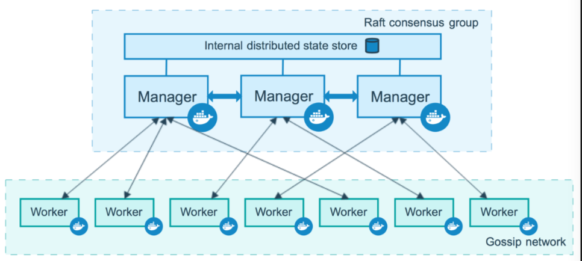
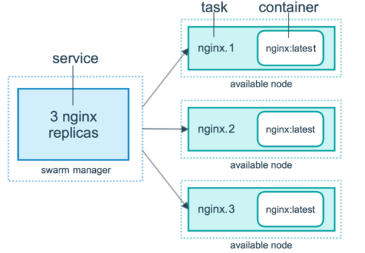
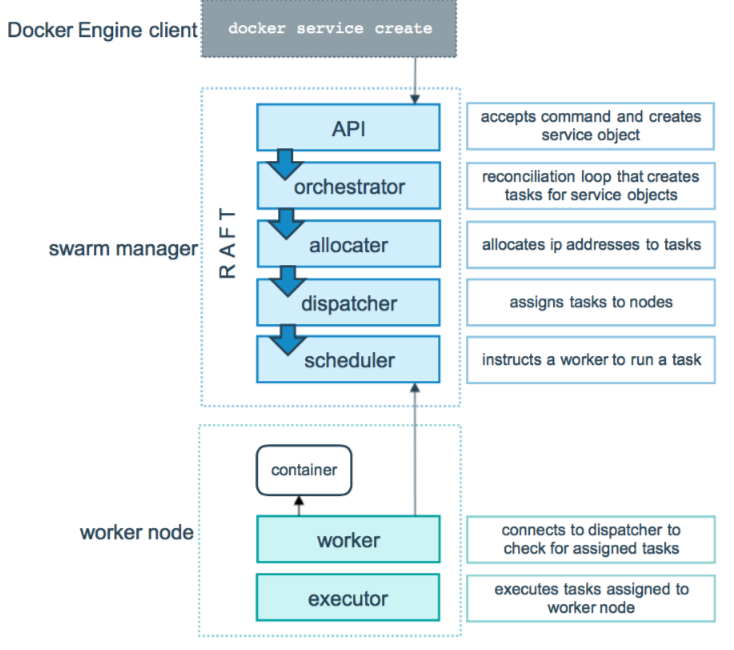
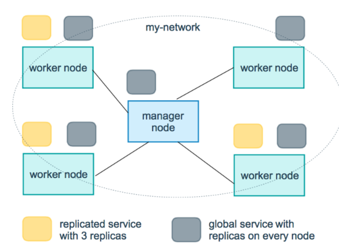
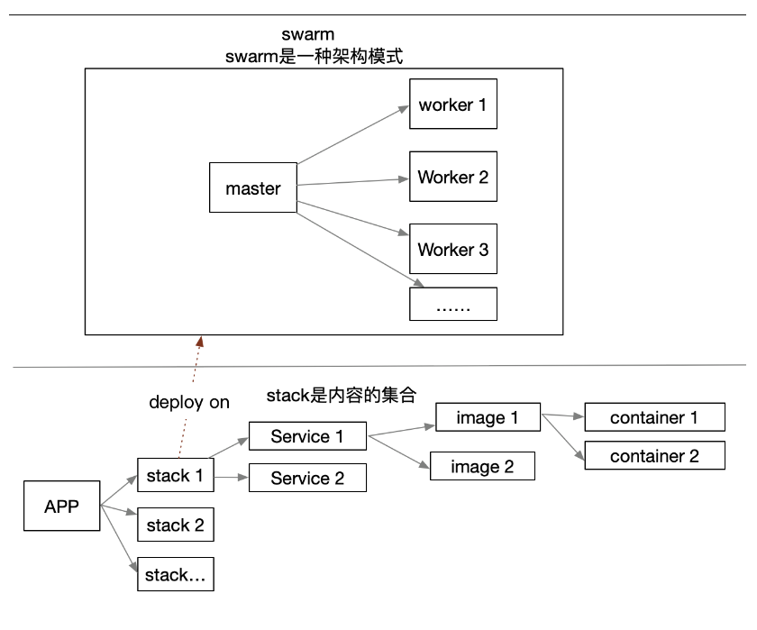
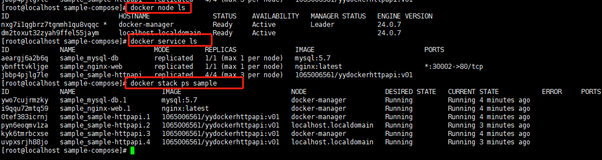
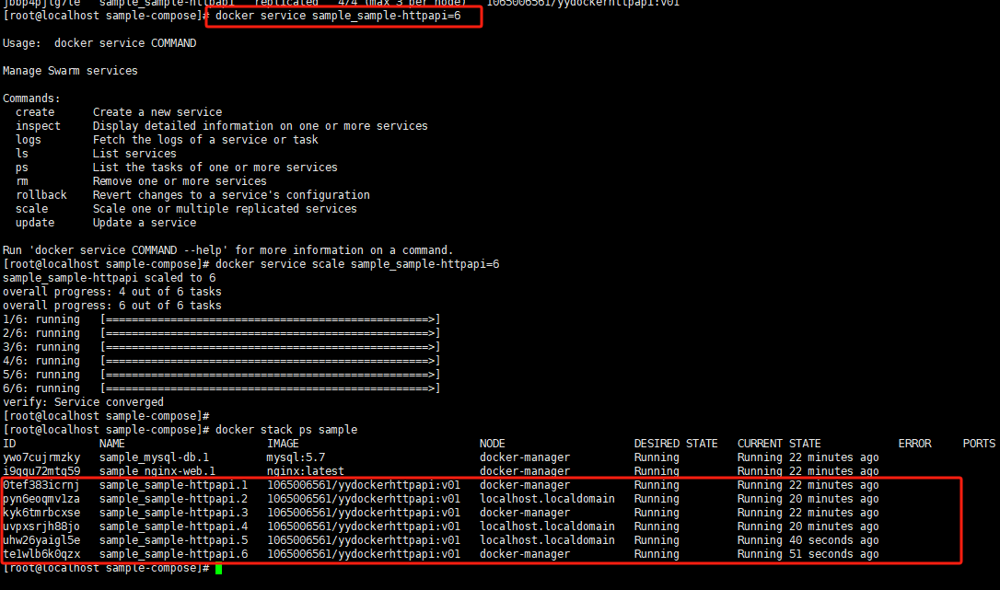

# DockerSwarm

## 概念

​     Swarm 是 Docker 公司推出的用来管理 docker 集群的平台，几乎全部用GO语言来完成的开发的， 它是将一群 Docker 宿主机变成一个单一的虚拟主机，Swarm 使用标准的 Docker API 接口作为其前端的访问入口，换言之，各种形式的DockerClient(compose, docker-py 等) 均可以直接与 Swarm 通信，甚至 Docker 本身都可以很容易的与 Swarm 集成，这大大方便了用户将原本基于单节点的系统移植到 Swarm 上，同时Swarm 内置了对 Docker 网络插件的支持，用户也很容易的部署跨主机的容器集群服务。 

  从 Docker 1.12.0 版本开始，Docker Swarm 已经包含在 Docker 引擎中（docker swarm），并且已经内置了服务发现工具，所以 swarm 我们无需手动安装。

## 与Docker Compose区别

- 异
  - Docker Compose 是一个在单个服务器或主机上创建多个容器的工具
  - Docker Swarm 则可以在多个服务器或主机上创建容器集群服务，对于微服务的部署，显然 Docker Swarm 会更加适合。
- 同
  - 都是 Docker 官方容器编排项目

## 特性

- 容器编排： Docker Swarm 可以根据用户定义的规则和策略，在多个 Docker 主机上自动部署和管理容器，实现容器的自动化编排。
- 服务发现： Docker Swarm 提供了内置的服务发现机制，允许容器之间相互通信和发现，无需手动配置 IP 地址或端口映射。
- 负载均衡： Docker Swarm 支持负载均衡功能，可以将流量均匀地分配到多个容器实例之间，提高应用程序的性能和可用性。
- 缩性： Docker Swarm 允许根据实际需求动态地扩展或缩减容器实例的数量，以应对流量的变化和负载的增减。
- 容错性： Docker Swarm 提供了容器的高可用性和容错性机制，可以自动重新启动失败的容器实例，并确保应用程序的持续可用性。

## 关键概念

- Swarm：集群管理工具。子命令有init, join, leave, update。（docker swarm --help查看帮助）

- Node：一个节点是docker引擎集群的一个实例。您还可以将其视为Docker节点。

  - manager node管理节点：执行集群的管理功能，维护集群的状态，选举一个leader节点去执行调度任务。
  - worker node工作节点：接收和执行任务。参与容器集群负载调度，仅用于承载task。

  您可以在单个物理计算机或云服务器上运行一个或多个节点，但生产群集部署通常包括分布在多个物理和云计算机上的Docker节点。

  要将应用程序部署到swarm，请将服务定义提交给 管理器节点。管理器节点将称为任务的工作单元分派 给工作节点。

  Manager节点还执行维护所需群集状态所需的编排和集群管理功能。Manager节点选择单个领导者来执行编排任务。

  工作节点接收并执行从管理器节点分派的任务。

- Service：一个服务是任务的定义，管理机或工作节点上执行。它是群体系统的中心结构，是用户与群体交互的主要根源。创建服务时，你需要指定要使用的容器镜像。

- Task：任务是在docekr容器中执行的命令，Manager节点根据指定数量的任务副本分配任务给worker节点

## 工作模式

### Node



### Service



### 任务与调度



服务副本与全局服务



服务副本是根据副本数来创建的

全局服务则在每个Docker主机上都会创建

## 理解Swarm、Stack、Service、Task

Service：一个service只能运行一个image，但是可以运行出同一个image的多个containers

Stack：一个Stack是一组相互关联的services，这组service共享依赖，可被安排在一起运行和扩展

Task：一个Task就相当于一个容器

Swarm：Stack基于Swarm管理



## 实战

1、准备两台虚拟机（一台作为管理节点，一台作为工作节点）

2、初始化一个swarm，并指定外部访问地址

```shell
[root@localhost ~]# docker swarm init --advertise-addr=192.168.1.102:2377
Swarm initialized: current node (nxg7i1qgbrz7tgnmh1qu8vqqc) is now a manager.

To add a worker to this swarm, run the following command:

    docker swarm join --token SWMTKN-1-5p6lcvz20sl95kb0fcw528a84fqub6nb3wjjrnqer0z4ffn0xu-3p7auf5t5h84bc96fyz35q1yx 192.168.1.102:2377

To add a manager to this swarm, run 'docker swarm join-token manager' and follow the instructions.
```

3、切换另一台服务器，将节点加入swarm集群，两种加入模式manager与worker。此处使用worker模式

```shell
#加入manager
docker swarm join-token manager
#加入worker，工作节点加入管理节点需要通过join-token认证
docker swarm join --token SWMTKN-1-5p6lcvz20sl95kb0fcw528a84fqub6nb3wjjrnqer0z4ffn0xu-3p7auf5t5h84bc96fyz35q1yx 192.168.1.102:2377
```

4、查看节点状态

```shell
# 此命令只能在管理节点运行
[root@localhost ~]# docker node ls
ID                            HOSTNAME                STATUS    AVAILABILITY   MANAGER STATUS   ENGINE VERSION
dm2toxut32zyah9ffel55jaym     localhost.localdomain   Ready     Active                          24.0.7
nxg7i1qgbrz7tgnmh1qu8vqqc *   localhost.localdomain   Ready     Active         Leader           24.0.7
```

5、生成项目镜像以环境准备

> 集群模式无法自动构建镜像

此处使用Demo\Docker\YY.Docker源码

```shell
#1、生成镜像
docker build -t 1065006561/yydockerhttpapi:v01  -f YY.Docker.Http.API/Dockerfile .

#2、上次镜像到docker hub
docker push 1065006561/yydockerhttpapi:v01

#3、将sample-compose文件的内容复制到manager主机
#4、修改manager主机名
hostnamectl set-hostname docker-manager
```

6、启动服务

```shell
#启动服栈
docker stack up --compose-file /test/sample-compose/docker-compose.yml sample

#查看节点
docker node ls

#查看服务
docker service ls

#列出堆栈中的任务
docker stack ps sample

#访问
#curl http://192.168.1.102:30002/swagger/index.html

#将某个服务扩充为6（这个值如果大于配置，则会失败）
docker service sample_sample-httpapi=6
docker service sample_sample-httpapi=4

#删除整个工作站
docker stack down sample
```

注意：不能缩放mysql-db和nginx-web，因为他们有约束。除此之外还因为他们的初配置文件为相对路径，只存在与管理服务器（生成环境一般建议打包到镜像里面或者存放到NFS服务器）





## 常用命令

### 管理配置文件

docker config

```shell
# 查看已创建配置文件
docker config ls

# 将已有配置文件添加到docker配置文件中
docker config create docker 配置文件名 本地配置文件
```

### 管理swarm节点

docker node

```shell
# 查看集群中的节点
docker node ls

# 将manager角色降级为worker
docker node demote 主机名

# 将worker角色升级为manager
docker node promote 主机名

# 查看节点的详细信息，默认json格式
docker node inspect 主机名

# 查看节点信息平铺格式
docker node inspect --pretty 主机名

# 查看运行的一个或多个及节点任务数，默认当前节点
docker node ps

# 从swarm中删除一个节点
docker node rm 主机名

# 更新一个节点
docker node update

# 对节点设置状态（“active”正常|“pause”暂停|“drain”排除自身work任务）
docker node update --availability
```

### 服务栈

栈的形式，一般作为编排使用，格式与docker compose相同。

docker stack

```shell
# 通过.yml文件指令部署
docker stack deploy -c 文件名.yml 编排服务名

查看编排服务
docker stack ls
```

### 集群的管理

docker swarm

```shell
# 初始化一个swarm
docker swarm init

# 指定初始化ip地址节点
docker swarm init --advertise-addr 管理端IP地址

# 去除本地之外的所有管理器身份
docker swarm init --force-new-cluster

# 将节点加入swarm集群，两种加入模式manager与worker
docker swarm join

# 工作节点加入管理节点需要通过join-token认证
docker swarm join-token

# 重新获取docker获取初始化命令
docker swarm join-token worker

# 离开swarm
docker swarm leave

# 对swarm集群更新配置
docker swarm update
```

### 服务管理

docker service

```shell
# 创建一个服务
docker service create
# 创建的副本数
docker service create --replicas 副本数
# 指定容器名称
docker service create --name 名字
# 每次容器与容器之间的更新时间间隔。
docker service create --update-delay s秒
# 更新时同时并行更新数量，默认1
docker service create --update-parallelism 个数
# 任务容器更新失败时的模式，（“pause”停止|”continue“继续），默认pause。
docker service create --update-failure-action 类型
# 每次容器与容器之间的回滚时间间隔。
docker service create --rollback-monitor 20s
# 回滚故障率如果小于百分比允许运行
docker service create --rollback-max-failure-ratio .数值（列“.2”为%20）
# 添加网络
docker service create --network 网络名
# 创建volume类型数据卷
docker service create --mount type=volume,src=volume名称,dst=容器目录
# 创建bind读写目录挂载
docker service create --mount type=bind,src=宿主目录,dst=容器目录
# 创建bind只读目录挂载
docker service create --mount type=bind,src=宿主目录,dst=容器目录,readonly
# 创建dnsrr负载均衡模式
docker service create --endpoint-mode dnsrr 服务名
# 创建docker配置文件到容器本地目录
docker service create --config source=docker配置文件,target=配置文件路径
# 创建添加端口
docker service create --publish 暴露端口:容器端口 服务名
# 查看服务详细信息，默认json格式
docker service inspect
# 查看服务信息平铺形式
docker service inspect --pretty 服务名
# 查看服务内输出
docker service logs
# 列出服务
docker service ls
# 列出服务任务信息
docker service ps　　　　
# 查看服务启动信息
docker service ps 服务名
# 过滤只运行的任务信息
docker service ps -f "desired-state=running" 服务名
# 删除服务
docker service rm
# 缩容扩容服务
docker service scale
# 扩展服务容器副本数量
docker service scale 服务名=副本数
# 更新服务相关配置
docker service update
# 容器加入指令
docker service update --args “指令” 服务名
# 更新服务容器版本
docker service update --image 更新版本 服务名 
# 回滚服务容器版本
docker service update --rollback 回滚服务名
# 添加容器网络
docker service update --network-add 网络名 服务名
# 删除容器网络
docker service update --network-rm 网络名 服务名
# 服务添加暴露端口
docker service update --publish-add 暴露端口:容器端口 服务名
# 移除暴露端口
docker service update --publish-rm 暴露端口:容器端口 服务名
# 修改负载均衡模式为dnsrr
docker service update --endpoint-mode dnsrr 服务名
# 添加新的配置文件到容器内
docker service update --config-add 配置文件名称，target=/../容器内配置文件名 服务名
```

