# Redis学习笔记

客户端工具：

- Redis Desktop Manager
- Another Redis Desktop Manager

类库：	

- ServiceStack.Redis（不支持集群、收费）
- StackExchange.Redis（支持集群）

## 一、Redis简介

### 1.1 什么是Redis

​	Redis 是完全开源免费的，遵守BSD协议，是一个高性能(NOSQL)的key-value数据库，Redis是一个开源的使用ANSI C语言编写、支持网络、可基于内存可持久化的日志型，Key-Value数据库，并提供多种语言的API。

### 1.2 NoSQL

NoSQL,泛指非关系型的数据库，NoSQL即Not-only SQL,它可以作为关系型数据库的良好补充。随着互谅网web2.0网站的兴起，非关系型的数据库现在成为了一个及其热门的新领域，非关系型数据库产品的发展非常迅速。

`传传统数据库暴露很多难以克服的问题，如下问题：`

- 对数据库高并发读写的需求
- 海量数据的高效存储和访问的需求
- 对数据库的高可扩展性和高课用性的需求。

### 1.3 NoSQL类别

- 键值存储数据库

  这一类数据库主要会使用到一个哈希表，这个表中有一个特定的键和一个指针指向特定的数据。
  key/value模型对于IT系统涞水的优势在于简单，已部署。但是如果DBA只对部分值进行查询或者更新的时候，key/value显示的效率低下。

  - 相关产品 ： Redis，Tokyo Cabinet
  - 典型应用 ： 内存缓存，主要用于处理大量数据的高访问负载。
  - 数据模型 ： 一系列键值对
  - 优势 ： 快速查询
  - 劣势 ： 存储的数据缺少结构化

- 列存储数据库

  这部分数据库通常是用来对分布式存储的海量数据。键仍然存在，但是他们的特点是指向了多个列。这些列是由列家族来安排的。

  - 相关产品 : HBase 、Riak
  - 典型应用 ： 分布式的文件系统
  - 数据模型 ： 以列簇式存储，将同一列数据存在一起
  - 优势 ： 查找速度快，可扩展性强，更容易进行分布式扩展
  - 劣势 ： 功能相对于局限

- 文档型数据库

  文档型数据库：该类型的数据库模型是版本化的文档，半结构化的文档一特定的格式存储，比如JSON。文档数据库可以看做键值数据库的升级版，允许之间嵌套键值。而且文档型数据库比键值数据库的查询效率更高。

  - 相关产品：MongoDB
  - 典型应用 ： web应用
  - 数据模型 ： 一系列键值对
  - 优势 ： 数据结构要求不严格
  - 劣势 ： 查询性能不高，而且缺乏统一的查询语言

### 1.4 Redis特点

#### 1.4.1 优点

-  **性能极高** - Redis读写的熟读110000次/s，写的速度是81000次/s。
-  **丰富的数据类型** - Redis支持的类型String， Hash 、List 、Set 及 Ordered Set数据类型操作。
-  **原子性**  - Redis的所有操作都是原子性的，意思就是要么成功，要么失败。单个操作时原子性的。多个操作也支持事务，即原子性，通过MULTI和EXEC指令包起来。
-  **丰富的特性** - Redis还支持publis/subscribe，通知，key过期等等特性。
-  **高速读写** ，redis使用自己实现的分离器，代码量很短，没有使用lock(MySQL),因此效率非常高。

#### 1.4.2 缺点

- **持久化**。 Redis直接将数据存储到内存中，要将数据保存到磁盘上，Redis可以使用两种方式实现持久化过程。定时快照(snapshot)：每个一端时间将整个数据库写到磁盘上，每次均是写全部数据，代价非常高。第二种方式基于语句追加（aof）：只追踪变化的数据，但是追加的log可能过大，同时所有的操作均重新执行一遍，**回复速度慢**。
- **耗内存** 。占用内存过高。

### 1.5 Redis的应用场景

- 缓存
     缓存现在几乎是所有大中型网站都在用的必杀技，合理利用缓存提升网站的访问速度，还能大大降低数据库的访问压力。Redis提供了键过期功能，也提供了灵活的键淘汰策略，所以，现在Redis用在缓存的场合非常多。
- 排行榜
     Redis提供的有序集合数据类结构能够实现各种复杂的排行榜应用。
- 计数器
     什么是计数器，，视频网站的播放量等等，每次浏览+1，并发量高时如果每次都请求数据库操作无疑是中挑战和压力。Redis提供的incr命令来实现计数器功能，内存操作，性能非常好，非常是用于这些技术场景。
- 分布式会话
     集群模式下，在应用不多的情况下一般使用Redis自带的session复制功能就能够满足，当应用相对复杂的系统中，一般都会搭建Redis等内存数据库为中心的session服务，session不在由容器管理，而是有session服务及内存数据管理。
- 分布式锁
     在很多互联网公司中都是用来分布式技术，分布式技术带来的技术挑战是对同一个资源的并发访问，如全局ID，减库存，秒杀等场景，并发量不大的场景可以使用数据库的悲观锁，乐观锁来实现，但是在并发高的场合中，利用数据库锁来控制资源的并发访问是不太理想的，大大影响了数据库的性能。可以利用Redis的setnx功能来编写分布式的锁，如果设置返回1，说明获取所成功，否则获取锁失败，实际应用中要考虑的细节要更多。
- 社交网络
     点赞、踩、关注/被关注，共同好友等是社交网站的基本功能，社交网站的访问量通常老说比较大，而且传统的关系数据库不适合这种类型的数据，Redis提供的哈希，集合等数据结构能很方便的实现这些功能。
- 最新列表
     Redis列表结构，LPUSH可以在列表头部插入一个内容ID作为关键字，LTRIM可以用来限制列表的数量，这样列表永远为N个ID。无需查询最新的列表，直接根据ID 去到对应的内容也即可。
- 消息系统
     消息对队列是网站比用中间件，如ActiveMQ，RabbitMQ，Kafaka等流行的消息队列中间件，主要用于业务解耦，流量削峰及异步处理试试性低的业务。Redis提供了发布/订阅及阻塞队列功能，能实现一个简单的消息队列系统。另外，这个不能和专业的消息中间件相比。

## 二、Redis内存模型

### 2.1 字符串

（1）内部编码

raw编码：如果使用raw编码，则每次开辟空间都会留一些空间，如果数据长度变了，则内存也会继续变大。

embstr 编码： 如果你使用embstr 编码，它每次最多开辟64个字节的空间，只有44个字节时存储我们数据的。

int：只是针对于写的数据是数值，切记只有整型才是int类型 

（2）编码转换

- 当int数据不再是整数，或大小超过了long的范围时，自动转化为raw。

- 如果你在操作的redis的时候，内容长度小于等于44，则会自动选择embstr编码开辟空间。

  embstr是只读的，因此再对embstr对象进行修改时，都会转化为raw再进行修改。因此，只要是**修改**embstr对象，修改后的对象一定是raw的，无论是否达到了39个字节

- 如果你操作redis的时候，内容长度大于44的，使用raw编码，浪费空间 

（3）使用场景

- session 利用redis做session共享内存

- 自增和自减法 -- 做一些网站的请求数量，或者论坛的点赞数

  评论数，不可能每次都去执行数据库。 可以直接利用redis，操作内存，只不过到最后，做个数据刷盘，把这些统计数据放到我们硬盘中。

 在功能中，除非必要的情况，除了上述这几个需求，尽量不要使用string类型，因为底层会浪费大量的内存空间。除非你不在乎那些内存。  为什么要这样设置，给你一种选择。

### 2.2 列表

​      第一个是队列（先进先出）
​      第二个是栈（先进后出）
​      第三个就是普通的集合。

（1）内部编码

- 压缩列表
- 双端链表

（2）编码转换

- 压缩列表：列表中元素数量小于512个；列表中所有字符串对象都不足64字节。
- 双端链表：如果有以上条件有一个不满足，则使用双端列表；且编码只可能由压缩列表转化为双端链表，反方向则不可能。

（3）使用场景

- 如果你要做插队，或者做队列，都可以使用list 

- 遇到分页场景也可以使用

- 消息队列： 记录日志

- 程序报错---一种是文本日志，一种是数据库日志。 可以通过底层的消息队列来实现

  如果不想用list做消息队列，也可以直接用提供的专门的消息发布来做。  特殊情况，公司不想要新的技术栈，就想用redis，  -- 提供一个扩展，不想了解也没有关系，知道这么回事就可以了 

### 2.3 哈希

​    官网推荐使用hash

（1）内部编码

- 压缩列表（ziplist）：用于元素个数少、元素长度小的场景；其优势在于集中存储，节省空间；同时，虽然对于元素的操作复杂度也由O(1)变为了O(n)，但由于哈希中元素数量较少，因此操作的时间并没有明显劣势。
- 哈希表（hashtable）

两者区别：

ziplist:压缩版的list ..(动态的数组，数组的每一个元素的空间是一样的)
第一问题：每次插入都有开辟空间，连续的
第二问题：你要查询的时候，你要从头来计算，--查询的速度变慢。
hash的数据结果，它的时间复杂度是O(1);
hash快速的查询结果，而且节省空间，一上来就是一个小量的hash。  

问题：如果hash后面链表越来越长的时候，时间复杂度是不是又变高  
不会，因为Hashtable内部做了以下处理：
扩容：是一开始的时候，redis有两个hash结构在存储数据，第一次只要一个是有长度，一个是没有长度。当数据到达一定的阈值，会进行自动扩容。（会定义没有长度的部分的长度=有长度*2，然后将有长度的数据复制过来，最后将有长度的部分变为没有长度，依次循环）
数据迁移问题来了，因为如果不小心操作的时候，刚好触发了瓶颈，要扩容。
解决迁移问题： 第一个：不是一次性迁移完成，是每一次操作只会迁移一部分。
                             第二个：是一个后台任务，后台任务给你偷偷摸摸的迁移数据。

（2）编码转换

- 压缩列表：哈希中元素数量小于512个；哈希中所有键值对的键和值字符串长度都小于64字节。
- 哈希表：如果有以上条件有一个不满足，则使用哈希表；且编码只可能由压缩列表转化为哈希表，反方向则不可能。

（3）使用场景

- 典型的应用场景，储存一个用户信息（id,name,address,email）

  如果使用string去存储，

  key=userid 
  values={id:1,name:'',address:'' ====}

  先把数据拿到代码内存，然后反序列化，然后修改值，然后序列化--存储到redis，而如果直接使用hash，则只需要制定修改具体某一个字段的值就可以了 

### 2.4 集合

​      也是一个集合，只不过是一个去重的集合。

（1）内部编码

- 整数集合
- 哈希表

（2）编码转换

- 整数集合：集合中元素数量小于512个；集合中所有元素都是整数值
- 哈希表：如何不满足以上任意一个条件，则使用哈希表；且编码只可能由整数集合转化为哈希表，反方向则不可能。

（3）使用场景

- 比如我需要做投票-- 根据ip地址来投票，每一个ip只投一票。如果用list，需要我们自己来判断。如果使用set，则系统自动会去重。
- list可以取交集和去并集，qq好友推荐里面用的比较多

### 2.5 有序集合

也是去重的集合，具有set的功能，而且在这些功能里面加了一个值---分数  
它提供了一个非常强大的功能，自动排序。

（1）内部编码

- 压缩列表（ziplist）

- 跳跃表（skiplist）

  跳跃表的数据结构底层：

  利用跳跃表，解决排序问题，把内容存在hash里面，把数值存在跳跃表里面，跳跃表里面的里面的数据是有顺序的

  跳跃表在存放数据的时候，就把顺序搞好了。。。 --
   它不是解决存放的问题，它是损失一部分写的性能，来提升查询的性能
   跳跃表就相当于我们leven树。 一层上面有一层的大纲，后面我讲性能调优模块的时候，会单独讲数据结构和算法，给你提供.net跳跃表的源码

zset默认是顺序查询，我们默认查询是先根据分数来查询我们数据，我们的业务是尽量使用分数来查询。

（2）编码转换

- 跳跃表：有序集合中元素数量小于128个；有序集合中所有成员长度都不足64字节
- 压缩列表：如何不满足以上任意一个条件，则使用压缩列表；且编码只可能由压缩列表转化为跳跃表，反方向则不可能。

（3）使用场景

- 做服务注册于发现
- 抽奖
- 限流
- 排行榜

### 2.6 HyperLogLog 

（1）定义

- Redis HyperLogLog 是用来做基数统计的算法，HyperLogLog 的优点是，在输入元素的数量或者体积非常非常大时，计算基数所需的空间总是固定 的、并且是很小的。
- 在 Redis 里面，每个 HyperLogLog 键只需要花费 12 KB 内存，就可以计算接近 2^64 个不同元素的基 数。这和计算基数时，元素越多耗费内存就越多的集合形成鲜明对比。
- 因为 HyperLogLog 只会根据输入元素来计算基数，而不会储存输入元素本身，所以 HyperLogLog 不能像集合那样，返回输入的各个元素。

（2）应用场景

- 说明：
  - 基数不大，数据量不大就用不上，会有点大材小用浪费空间
  - 有局限性，就是只能统计基数数量，而没办法去知道具体的内容是什么
  - 和bitmap相比，属于两种特定统计情况，简单来说，HyperLogLog 去重比 bitmap 方便很多
    一般可以bitmap和hyperloglog配合使用，bitmap标识哪些用户活跃，hyperloglog计数
- 一般使用：
  - 统计注册 IP 数
  - 统计每日访问 IP 数
  - 统计页面实时 UV 数
  - 统计在线用户数
  - 统计用户每天搜索不同词条的个

>*首先，我们先思考一个常见的业务问题：*
>
>*如果你负责开发维护一个大型的 网站，有一天老板找产品经理要网站每个网页每天的 UV 数据，然后让你来开发这个统计模 块，你会如何实现？*
>*如果统计 PV 那非常好办，给每个网页一个独立的 Redis 计数器就可以了，这个计数器 的 key 后缀加上当天的日期。这样来一个请求，incrby 一次，最终就可以统计出所有的 PV 数据。*
>
>*但是 UV 不一样，它要去重，同一个用户一天之内的多次访问请求只能计数一次。这就 要求每一个网页请求都需要带上用户的 ID，无论是登陆用户还是未登陆用户都需要一个唯一 ID 来标识。*
>
>*你也许已经想到了一个简单的方案，那就是为每一个页面一个独立的 set 集合来存储所 有当天访问过此页面的用户 ID。当一个请求过来时，我们使用 sadd 将用户 ID 塞进去就可以了。通过 scard 可以取出这个集合的大小，这个数字就是这个页面的 UV 数据。没错，这 是一个非常简单的方案。*
>
>*但是，如果你的页面访问量非常大，比如一个爆款页面几千万的 UV，你需要一个很大 的 set 集合来统计，这就非常浪费空间。如果这样的页面很多，那所需要的存储空间是惊人 的。为这样一个去重功能就耗费这样多的存储空间，值得么？其实老板需要的数据又不需要太精确，105w 和 106w 这两个数字对于老板们来说并没有多大区别，So，有没有更好的解 决方案呢？*
>
>*这就是本节要引入的一个解决方案，Redis 提供了 HyperLogLog 数据结构就是用来解决 这种统计问题的。HyperLogLog 提供不精确的去重计数方案，虽然不精确但是也不是非常不精确，标准误差是 0.81%，这样的精确度已经可以满足上面的 UV 统计需求了。*
>
>*HyperLogLog 数据结构是 Redis 的高级数据结构，它非常有用，但是令人感到意外的是，使用过它的人非常少。*

### 2.7 geospatial

Redis 3.2 中增加了对GEO类型的支持。GEO，Geographic，地理信息的缩写。该类型，就是元素的2维坐标，在地图上就是经纬度。redis基于该类型，提供了经纬度设置，查询，范围查询，距离查询，经纬度Hash等常见操作。

### 2.8 bitmap

### 2.9 发布订阅

## 三、Redis高效原理

- 其线程核心是基于非阻塞的IO多路复用机制

  | 系统调用                               | select（Windows）                                            | poll                                                      | epoll（Linux）                                               |
  | -------------------------------------- | ------------------------------------------------------------ | --------------------------------------------------------- | ------------------------------------------------------------ |
  | 事件集合                               | 内核会修改用户注册的文件描述符集来反馈其中的就绪事件，这使得用户每次调用select都要重置这三个文件描述符集 | 使用pollfd.events传入事件，使用pollfd.revents反馈就绪事件 | 使用内核表来管理用户事件，epoll_wait的events仅用来保存就绪事件 |
  | 应用程序索引就绪文件描述符的时间复杂度 | O(n)                                                         | O(n)                                                      | O(1)                                                         |
  | 最大支持文件描述符个数                 | 有限制，一般是1024                                           | 65535                                                     | 65535                                                        |
  | 工作模式                               | LT                                                           | LT                                                        | 支持ET高校模式                                               |

  

- 单线程模型避免了多线程的频繁上下文切换

- 纯内存操作

## 四、Redis事务+Lua脚本

### 4.1 事务

- 原子性
- 一致性
- 隔离性
- 持久性

### 4.2 Lua

Lua 是一种轻量小巧的脚本语言，用标准C语言编写并以源代码形式开放， 其设计目的是为了嵌入应用程序中，从而为应用程序提供灵活的扩展和定制功能。

## 五、Redis持久化

### 5.1 作用

- 持久化是最简单的高可用方法(有时甚至不被归为高可用的手段)，主要作用是数据备份，即将数据存储在硬盘，保证数据不会因进程退出而丢失。

### 5.2 RDB——快照

RDB持久化是将当前进程中的数据生成快照保存到硬盘(因此也称作快照持久化)，保存的文件后缀是rdb；当Redis重新启动时，可以读取快照文件恢复数据。

（1）触发条件

- 手动触发

  save命令：阻塞线程。因为执行这个指令的线程就是redis里面唯一的那个执行指令的线程。当你备份大量的数据的时候，如果耗时比较长，则当有其他客户端发送指令的时候，会卡住

  bgsave命令：单独的线程，后台专门有一个线程去实现备份。这个后台的就是专门来根据我们的配置文件里策略然后去备份数据文件。

- 自动触发

  自动触发最常见的情况是在配置文件中通过**save m n**（默认配置如下），指定当m秒内发生n次变化时，会触发bgsave

  

（2）特点：备份缓慢，但是重启加载数据性能比较快

### 5.3 AOF——文件追加

AOF持久化(即Append Only File持久化)，则是将Redis执行的每次写命令记录到单独的日志文件中，当Redis重启时再次执行AOF文件中的命令来恢复数据。

（1）触发条件

- Redis服务器默认开启RDB，关闭AOF；要开启AOF，需要在配置文件中配置：

  appendonly yes

（2）特点：文件可读行高，每次都是追加修改的东西，备份比较快，但是当服务重启的时候，加载数据的时候比较慢。

（3）AOF重写问题：当数据文件到达一个阈值的时候，我们的文件会继续重写变成一个小文件。

注意：如果rdb和aof都开启了，则默认首先加载aof文件，为了保证数据的尽可能完整性。

- 手动触发：bgrewriteaof
- 自动触发：根据auto-aof-rewrite-min-size和auto-aof-rewrite-percentage参数，以及aof_current_size和aof_base_size状态确定触发时机。（具体可参考《Redis配置文档》内容

### 5.4 混合模式

redis..4X 版本之后，支持混合模式-

（1）特点：备份快，启动快。

（2）设计：备份的时候，通过aof备份，我还原的时候根据rdb

- 架构师的思想理念：后台有一个任务，专门负责吧aof文件转化成rdb文件
- aof文件重写的问题---到数据大的时候，当我们进行aof操作的时候，把aof文件变成rdb，然后之后的操作直接取做日志追加。
- 默认的情况下，只要你开启了aof，则混合默认自动打开。  
- 混合模式的文件--包含aof和rdb;  
    如果要保证数据的完整性，要根据自己的业务来选择不同的持久化策略，一般情况都是使用混合模式。第一次配置的时候，切记aof打开（默认开启混合模式）

## 六、主从复制

### 6.1 作用

- 数据冗余：主从复制实现了数据的热备份，是持久化之外的一种数据冗余方式。

- 故障恢复：当主节点出现问题时，可以由从节点提供服务，实现快速的故障恢复；实际上是一种服务的冗余。

- 负载均衡：在主从复制的基础上，配合读写分离，可以由主节点提供写服务，由从节点提供读服务

- 高可用基础：除了上述作用以外，主从复制还是哨兵和集群能够实施的基础，因此说主从复制是Redis高可用的基础

  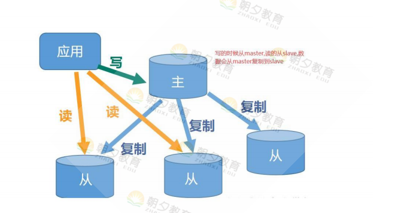

### 6.2 常见主从模式

- 一主一从
- 一主多从
- 树状主从

### 6.3 原理

- 保存主节点信息：配置slaveof之后会在从节点保存主节点的信息。  
- 主从建立socket连接：定时发现主节点以及尝试建立连接。
- 发送ping命令：从节点定时发送ping给主节点，主节点返回PONG。若主节点没有返回PONG或因阻塞无法响应导致超时，则主从断开，在下次定时任务时会重新ping主节点。
- 同步数据集：首次连接，全量同步。
- 命令持续复制：全量同步完成后，保持增量同步。

### 6.4 全面复制与部分复制

- 全量复制：用于初次复制或其他无法进行部分复制的情况，将主节点中的所有数据都发送给从节点，是一个非常重型的操作。
- 部分复制：用于网络中断等情况后的复制，只将中断期间主节点执行的写命令发送给从节点，与全量复制相比更加高效。需要注意的是，如果网络中断时间过长，导致主节点没有能够完整地保存中断期间执行的写命令，则无法进行部分复制，仍使用全量复制。

### 6.5 搭建主从复制

> 主从是实现读写分离，然后主节点会把数据同步到从节点里面
>
> - 主从复制实现了高可用，主节点宕机了，从节点可以替换主节点，但不是自动替换，需要程序员修改代码，改ip地址和端口，或者应该是用keeplive 用vip地址来搭建高可用。
> - 主从是不会自动切换，如果要自动切换要使用哨兵。
> - 一般情况下，我们使用主从的时候，防止数据不一致，主节点可读可写，但从节点只可读

#### 6.5.1 命令模式

在从服务器命令行中执行下面的命令即可成为该主服务器的从节点：

```css
#在从服务器执行下面的命令成为或取消成为某节点的从节点
#slaveof  主服务器的IP  端口号
slaveof  host port
 
#取消成为任何服务器的从服务器
slaveof no one
 
#从服务器只读(推荐配置)
config set slave-read-only yes
 
#查看主从信息
info replication
```

`slaveof命令是异步的，不会阻塞。 同时，从服务器现有的数据会先被清空，然后才会同步主服务器的数据。` 

#### 6.5.2 配置文件

在从服务器配置文件中添加下面的配置然后重启从服务器即可：

```css
#在从节点配置文件中新增下面两个配置即可指定成为某个主节点的从节点
#slaveof 主节点地址 主节点端口
slaveof  host port
 
#从服务器只读(推荐配置)
slave-read-only yes
```

#### 6.5.3 搭建一主多从

- 测试

  ```shell
  #主
  docker run -d -p 5001:6379 --name master  redis
  #从1
  docker run -d -p 5002:6379 --name slave1 redis
  #从2
  docker run -d -p 5003:6379 --name slave2 redis
  #进入主节点所在容器
  redis-cli -h 192.168.200.101 -p 5001
  #进入从1所在容器
  redis-cli -h 192.168.200.101 -p 5002
  #进入从2所在容器
  redis-cli -h 192.168.200.101 -p 5003
  #查看主从复制状态
  info replication
  ```

  主节点

  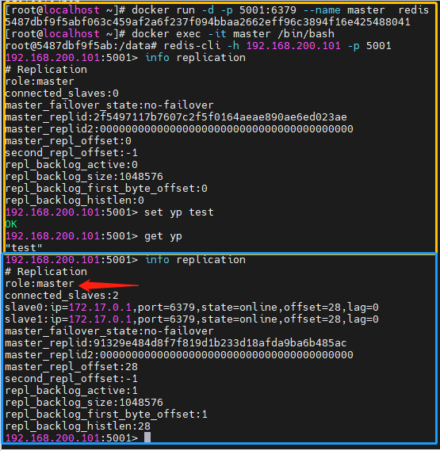

  从节点1

  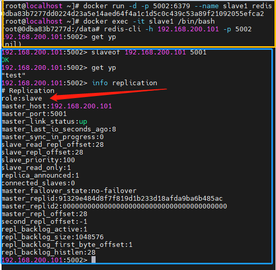

  从节点2

  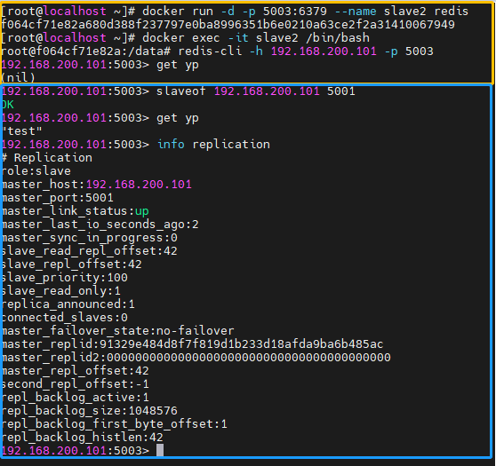

## 七、哨兵

### 7.1 作用

用于对主从结构中的每一台服务器进行监控，当主节点出现故障后通过投票机制来挑选新的主节点，并且将所有的从节点连接到新的主节点上

- 监控（Monitoring）：监控主从节点运行情况

- 通知（Notification）：哨兵可以将故障转移的结果发送给客户端。

- 自动故障转移（Automatic failover）：当监控到主节点宕机后，断开与宕机主节点连接的所有从节点，然后在从节点中选取一个作为主节点，将其他的从节点连接到这个最新的主节点。最后通知客户端最新的服务器地址。

- 配置提供者（Configuration provider）：客户端在初始化时，通过连接哨兵来获得当前Redis服务的主节点地址。

  *哨兵只是配置提供者，而不是代理。二者的区别在于：如果是配置提供者，客户端在通过哨兵获得主节点信息后，会直接建立到主节点的连接，后续的请求(如set/get)会直接发向主节点；如果是代理，客户端的每一次请求都会发向哨兵，哨兵再通过主节点处理请求。*

### 7.2 原理

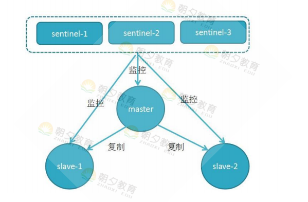

（1） 它由两部分组成，哨兵节点和数据节点：

- 哨兵节点：哨兵系统由一个或多个哨兵节点组成，哨兵节点是特殊的redis节点，不存储数据。

  *注意：哨兵，最少是三台服务器，必须是单数（投票防止平票的情况）*

- 数据节点：主节点和从节点都是数据节点。

（2）宕机情况：

- 主观宕机：单独哨兵认为主节点宕机了，发现了故障。

- 客观宕机：半数哨兵认为主节点宕机，发现了故障。

（3）选举主节点的原则：

- 健康度：从节点响应的时间 

- 完整性：根据我们从节点备份的完整性，根据数据备份偏移量

- 稳定性：根据启动时间周期，心跳检测 

- 如果上面三个条件都相等，则根据我们节点启动时分配的run id来，如果runid越小，则最有可能选择为我们主节点

### 7.3 实践建议

- 哨兵节点的数量应不止一个，一方面增加哨兵节点的冗余，避免哨兵本身成为高可用的瓶颈；另一方面减少对下线的误判。此外，这些不同的哨兵节点应部署在不同的物理机上。
- 哨兵节点的数量应该是奇数，便于哨兵通过投票做出“决策”：领导者选举的决策、客观下线的决策等。
- 各个哨兵节点的配置应一致，包括硬件、参数等；此外，所有节点都应该使用ntp或类似服务，保证时间准确、一致。
- 哨兵的配置提供者和通知客户端功能，需要客户端的支持才能实现，如前文所说的Jedis；如果开发者使用的库未提供相应支持，则可能需要开发者自己实现。
- 当哨兵系统中的节点在docker（或其他可能进行端口映射的软件）中部署时，应特别注意端口映射可能会导致哨兵系统无法正常工作，因为哨兵的工作基于与其他节点的通信，而docker的端口映射可能导致哨兵无法连接到其他节点。例如，哨兵之间互相发现，依赖于它们对外宣称的IP和port，如果某个哨兵A部署在做了端口映射的docker中，那么其他哨兵使用A宣称的port无法连接到A。

### 7.4 数据丢失问题

**哨兵或者主从里面的数据问题：**

- 脑裂问题

  出现了主节点和哨兵之间网络原因，而且有多数以上的哨兵认为主节点宕机，则再从会从节点现在一个主，这个时候客户端代码还是可以连接到之前的主节点的，可以写数据，此时哨兵选举了新的主节点，然后之前的主网络恢复了，然后之前的主节点备份现在的主节点数据，造成数据不完整。

- 异步复制数据丢失问题

  因为是异步复制数据，如果主节点和从节点直接数据复制太慢，在这之间主节点宕机，而且是真的宕机，这个时候从节点替换主节点，丢失了数据。

哨兵--不管怎么样的配置都没有办法保证数据百分之白不丢失，只能尽可能少量丢数据

**怎么解决上面这来个问题呢？**

- 至少有几个从节点。配置min-slaves-to-write=1，代表的是，当主节点和从节点之间互通的时候，发现从节点小于一个的时候，则从节点不会再继续给客户端提供服务。（解决脑裂问题）
- 偏移量配置，配置min-slaves-max-lag=1。主节点和从节点数据之前偏移量只差，如果偏移量只差比配置小，则主节点也不会提供服务。

### 7.5 搭建哨兵

> **把当前目录下《哨兵部署》文件直接复制到cd /usr/local/etc/redis/sentinel 中，执行启动命令即可**
>
> 以下为详细配置

- sentine配置

  -  Sentinel配置文件路径：

    ```shell
    mkdir /usr/local/etc/redis/sentinel/sentinel -p
    cd /usr/local/etc/redis/sentinel/sentinel
    ```

    

  - redis-sentinel-1.conf

    ```shell
    # bind 127.0.0.1
    ​
    # 哨兵的端口号
    # 因为各个哨兵节点会运行在单独的Docker容器中
    # 所以无需担心端口重复使用
    # 如果需要在单机
    port 26379
    ​
    # 设定密码认证
    requirepass 123456
    ​
    # 配置哨兵的监控参数
    # 格式：sentinel monitor <master-name> <ip> <redis-port> <quorum>
    # master-name是为这个被监控的master起的名字
    # ip是被监控的master的IP或主机名。因为Docker容器之间可以使用容器名访问，所以这里写master节点的容器名
    # redis-port是被监控节点所监听的端口号
    # quorom设定了当几个哨兵判定这个节点失效后，才认为这个节点真的失效了
    sentinel monitor local-master 127.0.0.1 6379 2
    ​
    # 连接主节点的密码
    # 格式：sentinel auth-pass <master-name> <password>
    sentinel auth-pass local-master 123456
    ​
    # master在连续多长时间无法响应PING指令后，就会主观判定节点下线，默认是30秒
    # 格式：sentinel down-after-milliseconds <master-name> <milliseconds>
    sentinel down-after-milliseconds local-master 30000
    ```

    

  - redis-sentinel-2.conf

    ```shell
    port 26380
    requirepass 123456
    sentinel monitor local-master 127.0.0.1 6379 2
    sentinel auth-pass local-master 123456
    # master在连续多长时间无法响应PING指令后，就会主观判定节点下线，默认是30秒
    # 格式：sentinel down-after-milliseconds <master-name> <milliseconds>
    sentinel down-after-milliseconds local-master 30000
    ```

    

  - redis-sentinel-3.conf

    ```shell
    port 26381
    requirepass 123456
    sentinel monitor local-master 127.0.0.1 6379 2
    sentinel auth-pass local-master 123456
    # master在连续多长时间无法响应PING指令后，就会主观判定节点下线，默认是30秒
    # 格式：sentinel down-after-milliseconds <master-name> <milliseconds>
    sentinel down-after-milliseconds local-master 30000
    ```

    

- 主从配置

  - 配置文件路径

    ```shell
    mkdir /usr/local/etc/redis/sentinel/server -p
    cd /usr/local/etc/redis/sentinel/server
    ```

    

  - redis-master.conf

    ```shell
    # 监听端口
    port 6379
    ​
    # 启动时不打印logo
    # 这个不重要，想看logo就打开它
    always-show-logo no
    ​
    # 设定密码认证
    requirepass 123456
    ​
    # 禁用KEYS命令
    # 一方面 KEYS * 命令可以列出所有的键，会影响数据安全
    # 另一方面 KEYS 命令会阻塞数据库，在数据库中存储了大量数据时，该命令会消耗很长时间
    # 期间对Redis的访问也会被阻塞，而当锁释放的一瞬间，大量请求涌入Redis，会造成Redis直接崩溃
    rename-command KEYS ""
    ```

    

  - redis-slave1.conf

    ```shell
    # bind 127.0.0.1
    ​
     
    ​
    # 监听端口
    port 6380
    always-show-logo no
    requirepass 123456
    ​
    rename-command KEYS ""
    slaveof 127.0.0.1 6379
    ​
    # 设定连接主节点所使用的密码
    masterauth "123456"
    ```

    

  - redis-slave2.conf

    ```shell
    # 监听端口
    port 6381
    always-show-logo no
    ​
    # 设定密码认证
    requirepass 123456
    rename-command KEYS ""
    ​
    slaveof 127.0.0.1 6379
    ​
    # 设定连接主节点所使用的密码
    masterauth "123456"
    
    ```

  

- SENTINEL的DOCKER-COMPOSE.YML文件

  ```yml
  version: '3'
  ​
  services:
    redis-sentinel-1:
      image: redis
      container_name: redis-sentinel-1
      restart: always
      # 为了规避Docker中端口映射可能带来的问题
      # 这里选择使用host网络
      network_mode: host
      volumes:
        - ./redis-sentinel-1.conf:/usr/local/etc/redis/redis-sentinel.conf
      # 指定时区，保证容器内时间正确
      environment:
        TZ: "Asia/Shanghai" 
      command: ["redis-sentinel", "/usr/local/etc/redis/redis-sentinel.conf"]
    redis-sentinel-2:
      image: redis
      container_name: redis-sentinel-2
      restart: always
      network_mode: host
      volumes:
        - ./redis-sentinel-2.conf:/usr/local/etc/redis/redis-sentinel.conf
      environment:
        TZ: "Asia/Shanghai" 
      command: ["redis-sentinel", "/usr/local/etc/redis/redis-sentinel.conf"]
    redis-sentinel-3:
      image: redis
      container_name: redis-sentinel-3
      restart: always
      network_mode: host
      volumes:
        - ./redis-sentinel-3.conf:/usr/local/etc/redis/redis-sentinel.conf
      environment:
        TZ: "Asia/Shanghai"
      command: ["redis-sentinel", "/usr/local/etc/redis/redis-sentinel.conf"]
  ```

  

- 主从复制的DOCKER-COMPOSE.YML文件

  ```yml
  
  version: '3'
  ​
  services:
    # 主节点的容器
    redis-server-master:
      image: redis
      container_name: redis-server-master
      restart: always
      # 为了规避Docker中端口映射可能带来的问题
      # 这里选择使用host网络
      network_mode: host
      # 指定时区，保证容器内时间正确
      environment:
        TZ: "Asia/Shanghai"
      volumes:
        # 映射配置文件和数据目录
        - ./redis-master.conf:/usr/local/etc/redis/redis.conf
        - ./data/redis-master:/data 
      command: ["redis-server", "/usr/local/etc/redis/redis.conf"]
    # 从节点1的容器
    redis-server-slave-1:
      image: redis
      container_name: redis-server-slave-1
      restart: always
      network_mode: host
      depends_on:
        - redis-server-master
      environment:
        TZ: "Asia/Shanghai"
      volumes:
        - ./redis-slave1.conf:/usr/local/etc/redis/redis.conf
        - ./data/redis-slave-1:/data 
      command: ["redis-server", "/usr/local/etc/redis/redis.conf"]
    # 从节点2的容器
    redis-server-slave-2:
      image: redis
      container_name: redis-server-slave-2
      restart: always
      network_mode: host
      depends_on:
        - redis-server-master
      environment:
        TZ: "Asia/Shanghai"
      volumes:
        - ./redis-slave2.conf:/usr/local/etc/redis/redis.conf
        - ./data/redis-slave-2:/data 
      command: ["redis-server", "/usr/local/etc/redis/redis.conf"]
  ```

  

- 启动

  ```shell
  cd /usr/local/etc/redis/sentinel/server
  docker-compose up -d
  
  cd /usr/local/etc/redis/sentinel/sentinel
  docker-compose up -d
  
  #查看主从信息
  docker exec -it redis-server-master  /bin/bash
  redis-cli -a 123456
  info replication
  
  #测试 
  #停止主节点
  docker stop redis-server-master
  
  #进入从1redis-server-slave-1查看角色是否被修过为主节点
  docker exec -it redis-server-slave-1 /bin/bash
  redis-cli -p 6380 -a 123456
  info replication
  
  #进入从1redis-server-slave-2查看角色是否被修过为主节点
  docker exec -it redis-server-slave-2 /bin/bash
  redis-cli -p 6381 -a 123456
  info replication
  ```


## 八、集群


### 8.1 作用

- 数据分区：集群将数据分散到多个节点，一方面突破了Redis单机内存大小的限制，存储容量大大增加；另一方面每个主节点都可以对外提供读服务和写服务，大大提高了集群的响应能力。
- 高可用：集群支持主从复制和主节点的自动故障转移（与哨兵类似）；当任一节点发生故障时，集群仍然可以对外提供服务。

### 8.2 集群模式

- 副本集的集群：多个节点都可以读都可以写，而且多个节点之间数据是需要一致的。有大量的数据冗余
- 分片模式：每一个节点只负责一部分的数据写（Redis采用的是该模式）

### 8.3 实践建议

- 高可用要求：根据故障转移的原理，至少需要3个主节点才能完成故障转移，且3个主节点不应在同一台物理机上；每个主节点至少需要1个从节点，且主从节点不应在一台物理机上；因此高可用集群至少包含6个节点。

- 数据量和访问量：估算应用需要的数据量和总访问量(考虑业务发展，留有冗余)，结合每个主节点的容量和能承受的访问量(可以通过benchmark得到较准确估计)，计算需要的主节点数量。
- 节点数量限制：Redis官方给出的节点数量限制为1000，主要是考虑节点间通信带来的消耗。在实际应用中应尽量避免大集群；如果节点数量不足以满足应用对Redis数据量和访问量的要求，可以考虑：(1)业务分割，大集群分为多个小集群；(2)减少不必要的数据；(3)调整数据过期策略等。
- 适度冗余：Redis可以在不影响集群服务的情况下增加节点，因此节点数量适当冗余即可，不用太大。

### 8.4 数据淘汰算法

（1）maxmemory：使用maxmemory配置是为了将Redis配置为对数据集使用指定的内存量

- 直接修改redis.conf文件：maxmemory 100mb
- config set maxmemory 100mb：直接连接redis执行（设置maxmemory为零将导致没有内存限制）

（2）过期策略：当内存使用值超过了maxmemory配置时，redis可以使用以下策略进行数据淘汰。

- noeviction：（默认策略）当达到内存限制并且客户端尝试执行可能导致使用更多内存的命令时返回错。
- volatile-lru：删除设置了过期时间的key而且最近最少使用key（LRU算法淘汰）。
- allkeys-lru：删除所有比较最近最少使用的key（LRU算法淘汰）。
- volatile-lfu：删除设置了过期时间的key而且使用频率最低key（LFU算法淘汰）。
- allkeys-lfu：删除所有使用频率最低的key（LFU算法淘汰）。
- volatile-random：设置了过期时间的key使用随机淘汰。
- allkeys-random：所有key使用随机淘汰。
- volatile-ttl：设置了过期时间的key根据过期时间淘汰，越早过期越早淘汰。

### 8.5 搭建集群

>说明：
>
>- Redis集群至少需要六个节点（3主3从），小于六个则搭建不了集群
>
>- 某个主节点和所有从节点全部挂掉，我们集群不可用。
>
>- 如果半数以上的主节点挂掉，则集群不可用
>
>- 如果集群任意master挂掉,而且没有从节点，则集群不可用
>
>- Redis集群如何保证一个用户的数据存在同一个节点上，方便下次访问
>
>  使用命令 set {yp} test 666(所有用户yp的数据都会写入同一节点)
>
>

- 把当前目录下《集群部署》文件直接复制到Linux中，执行启动命令即可

  ```shell
  mkdir /mydata/redis-cluster/config -p
  cd /mydata/redis-cluster/config
  
  赋值文件到此目录下
  ```

  

  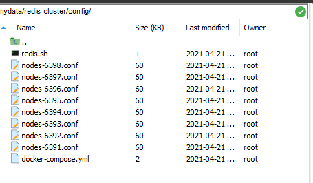

- 启动运行集群

  ```shell
  cd /mydata/redis-cluster/config/
  #启动节点
  docker-compose up -d
  
  #创建集群 
  #方案一
  docker run --rm -it zvelo/redis-trib create --replicas 1 192.168.3.202:6391 192.168.3.202:6392 192.168.3.202:6393 192.168.3.202:6394 192.168.3.202:6395 192.168.3.202:6396
  #方案二
  
  #随便进入一个redis容器
  docker exec -it 容器id /bin/bash
  
  redis-cli  --cluster create  192.168.3.202:6391 192.168.3.202:6392 192.168.3.202:6393 192.168.3.202:6394 192.168.3.202:6395 192.168.3.202:6396 --cluster-replicas 1
  
  #验证测试
  redis-cli -h 192.168.3.202 -p 6391 -c
  
  #查看集群信息
  cluster info
  
  #查看节点信息
  cluster nodes
  
  ```

  

## 九、缓存预热/雪崩/击穿/穿透

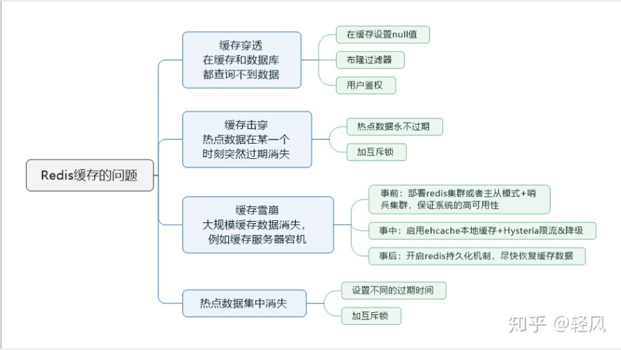


### 9.1 缓存穿透

（1）问题描述：key对应的数据在数据源并不存在，每次针对此key的请求从缓存获取不到，请求都会压到数据源，从而可能压垮数据源。比如用一个不存在的用户id获取用户信息，不论缓存还是数据库都没有，若黑客利用此漏洞进行攻击可能压垮数据库。

（2）解决方案

- 对空值缓存：如果一个查询返回的数据为空（不管是数据是否不存在），我们仍然把这个空结果（null）进行缓存，设置空结果的过期时间会很短，最长不超过五分钟

- 设置可访问的名单（白名单）：使用bitmaps类型定义一个可以访问的名单，名单id作为bitmaps的偏移量，每次访问和bitmap里面的id进行比较，如果访问id不在bitmaps里面，进行拦截，不允许访问。

- 采用布隆过滤器：(布隆过滤器（Bloom Filter）是1970年由布隆提出的。它实际上是一个很长的二进制向量(位图)和一系列随机映射函数（哈希函数）。

  >每次操作key的时候，把这个key写入到我们布隆过滤器里面去，
  >然后查询的时候，先查询布隆过滤器，如果布隆过滤器有，则继续查询redis和mysql。如果说布隆过滤器没有，则返回就行。占用少量的内存，存放了大量的key，而且能很快速的判断我们key存在不存在。
  >
  >**可能会误判**（这个数据没有，但是给的结果是有，这个概率比较小，而且就算是误判了，也不会造成我们业务问题）。前提就是我们操作业务的时候，首先需要把key写入到布隆过滤器里面。

- 进行实时监控：当发现Redis的命中率开始急速降低，需要排查访问对象和访问的数据，和运维人员配合，可以设置黑名单限制服务

### 9.2 缓存击穿

（1）问题描述：热点数据在某一时刻过期，此时若有大量并发请求过来，这些请求发现缓存过期一般都会从后端DB加载数据并回设到缓存，这个时候大并发的请求可能会瞬间把后端DB压垮。

（2）解决方案

key可能会在某些时间点被超高并发地访问，是一种非常“热点”的数据。这个时候，需要考虑一个问题：缓存被“击穿”的问题。

解决问题：

- 预先设置热门数据：在redis高峰访问之前，把一些热门数据提前存入到redis里面，加大这些热门数据key的时长

- 实时调整：现场监控哪些数据热门，实时调整key的过期时长

- 使用锁。（？？？）

  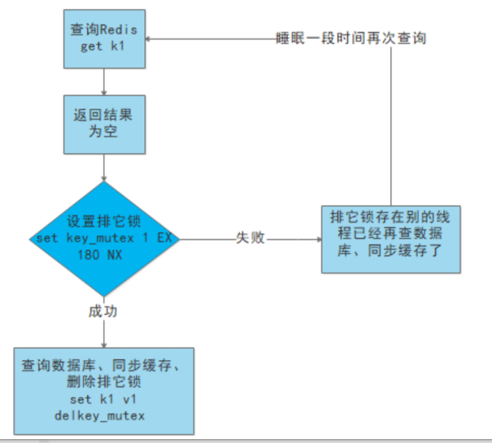

 

### 9.3 缓存雪崩

（1）问题描述：同一时间有大量的key过期了，导致我们请求数据的时候，在redis里面查询不到，这个时候直接取查询我们关系型数据库---如果并发量比较大导致我们服务不可用。

**缓存雪崩与缓存击穿的区别在于这里针对很多key缓存，前者则是某一个热点key**

（2）解决方案

- 构建多级缓存架构：nginx缓存 + redis缓存 +其他缓存（ehcache等）
- 使用锁或队列：用加锁或者队列的方式保证来保证不会有大量的线程对数据库一次性进行读写，从而避免失效时大量的并发请求落到底层存储系统上。不适用高并发情况
- 设置过期标志更新缓存：记录缓存数据是否过期（设置提前量），如果过期会触发通知另外的线程在后台去更新实际key的缓存。
- 将缓存失效时间分散开：比如我们可以在原有的失效时间基础上增加一个随机值，比如1-5分钟随机，这样每一个缓存的过期时间的重复率就会降低，就很难引发集体失效的事件。

## 十、拓展

### 10.1 跳跃表


### 10.2 布隆过滤器

（1）定义：它其实是一个很长的二进制向量和一系列随机映射函数，二进制你们应该都清楚，存储的数据不是0就是1，默认是0。算法主要用于判断一个元素是否在一个集合中，0表明`不存在`某个数据，1表明`存在`某个数据。

（2）原理

- 布隆过滤器是一个 bit 向量或者说 bit 数组，长这样：


- 如果我们要映射一个值到布隆过滤器中，我们需要使用多个不同的哈希函数生成多个哈希值，并对每个生成的哈希值指向的 bit 位置 1，例如针对值 “baidu” 和三个不同的哈希函数分别生成了哈希值 1、4、7，则上图转变为：

  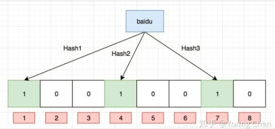

- Ok，我们现在再存一个值 “tencent”，如果哈希函数返回 3、4、8 的话，图继续变为：

  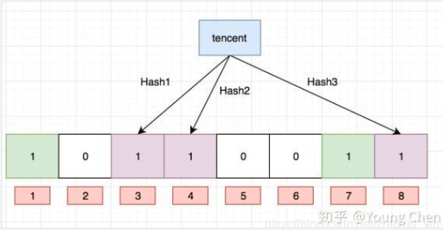

说明：值得注意的是，4 这个 bit 位由于两个值的哈希函数都返回了这个 bit 位，因此它被覆盖了。现在我们如果想查询 “dianping” 这个值是否存在，哈希函数返回了 1、5、8三个值，结果我们发现 5 这个 bit 位上的值为 0，说明没有任何一个值映射到这个 bit 位上，因此我们可以很确定地说 “dianping” 这个值不存在。而当我们需要查询 “baidu” 这个值是否存在的话，那么哈希函数必然会返回 1、4、7，然后我们检查发现这三个 bit 位上的值均为 1，那么我们可以说 “baidu” 存在了么？答案是不可以，只能是 “baidu” 这个值可能存在。

（3）优缺点

优点：

- 因为存储的是二进制数据，因此占用的空间很小
- 它的插入和查询速度是很是快的，时间复杂度是O（K），能够联想一下HashMap的过程
- 保密性很好，由于自己不存储任何原始数据，只有二进制数据

缺点：

- 存在误判
- 删除困难

（4）应用

- 解决Redis缓存穿透
- 在爬虫时，对爬虫网址进行过滤，已经存在布隆中的网址，不在爬取。
- 垃圾邮件过滤，对每个发送邮件的地址进行判断是否在布隆的黑名单中，若是在就判断为垃圾邮件。

### 10.3 分片原理

#### 10.3.1 范围分片

通过映射对象的范围到指定的 Redis 实例来完成分片

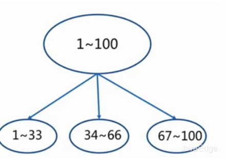

#### 10.3.2 哈希分片

如果集群中存在两台服务器，为了保证数据均匀的落在这两台服务器中，常规的解决方案：

- 拿到每条数据的key值，并对其进行哈希处理
- 拿到哈希值之后用其模上集群中机器得数量
- 将得到结果对应数据存放到对应编号的机器

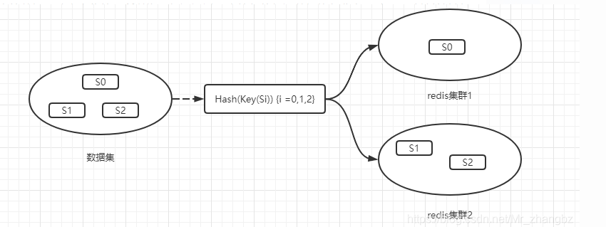

对与数据量小的业务，这种方案可以很好的保证数据可以均匀的分布在每台服务器中，但是后期随着数据量的增大，势必就要增加集群中服务器的数量，所以对所有的数据需要重新梳理找到其合适的存放位置，那么问题就随之而来，一次性对所有的重新数据梳理的工程量非常大，所以哈希一致性算法能够完美的解决该问题

#### 10.3.3 一致性哈希分片

> Redis使用的是一致性哈希分片

- 把 0 作为起点，2^32-1 作为终点，画一条直线，再把起点和终点重合，直线变成一个圆，方向是顺时针从小到大。0 的右侧第一个点是 1 ，然后是 2 ，以此类推。

- 对三台服务器的 IP 或其他关键字进行 hash 后对 2^32 取模，这样势必能落在这个圈上的某个位置，记为 Node1、Node2、Node3。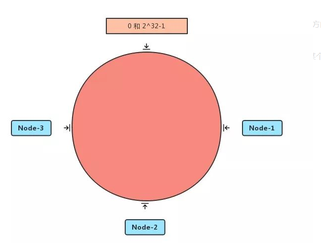

  

- 然后对数据 key 进行相同的操作，势必也会落在圈上的某个位置；然后顺时针行走，可以找到某一个 Node，这就是这个 key 要储存的服务器。

  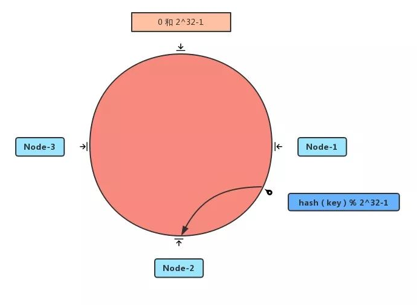

- 如果增加一台服务器或者删除一台服务器，只会影响部分数据。

  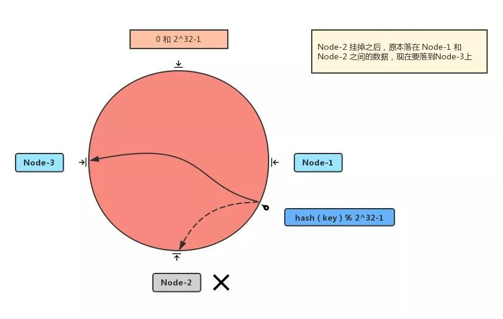

- 但如果节点太少或分布不均匀的时候，容易造成 数据倾斜，也就是大部分数据会集中在某一台服务器上。

  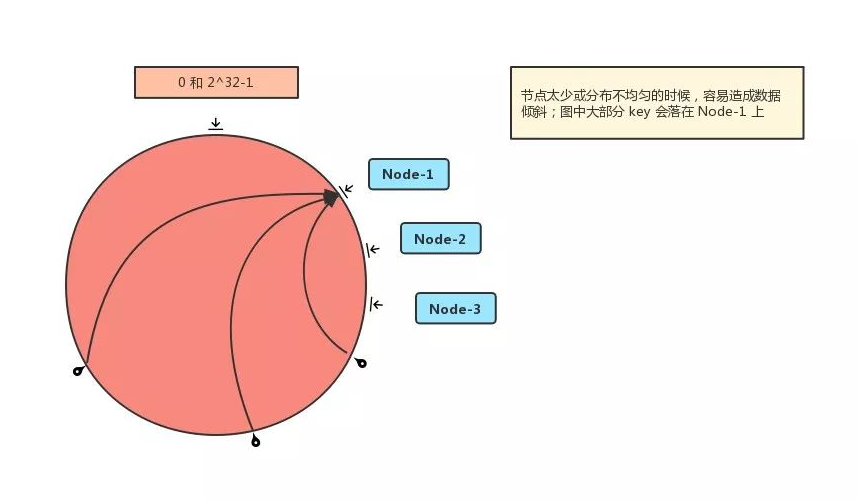

- 为了解决数据倾斜问题，一致性 Hash 算法提出了【虚拟节点】，会对每一个服务节点计算多个哈希，然后放到圈上的不同位置。

  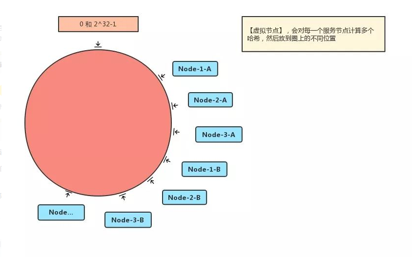

当然我们也可以发现，一致性 Hash 算法，也只是解决大部分数据的问题。

## 十一、答疑

1、Redis的作用？  
	redis 解决了两个问题：    
   （1）Redis是内存数据库，避免了直接操作硬盘的问题  
   （2）连接阻塞的问题，之前是io阻塞，系统在等待请求的时候，不能干其他的事情，而且每次只能阻塞等待请求，redis通过多路复用，由系统帮你监听多个连接，只要有事情要处理 ，系统会调用你的回调函数，把监听的事情交给了系统，释放了我们自己的代码-- 开启的是高速通道，之前一次只能处理一个请求，现在可以处理多个请求。 （不管是单线程的redis还是多线程的redis，最后执行那个指令的线程并且只要一个）

2、c# Socket.Select()Socket.Poll()的静态函数是多路复用吗？Windows平台的重叠IO概念就是多路复用吗？  
Windows使用select 模型多路复用，性能还可以，但是没有linux好,epool。生产环境中建议Redis安装在Linux系统中

3、windows上面生产环境跑5.0.10版本的redis的主要弊端是什么？  
不能利于多路复用的epool模型。 只能使用select模型，最大能并发能支持1024个请求连接。（Linux上可以使用epool模型，最大并发量可支持6万多）

4、redis 的list 和泛型list的区别？  
不一样，底层不一样，.net 泛型list是一个安全类型的动态数组，redis里面的list代表的是一个类型，而不是数据结构，数据结构底层是之前的版本是双向链表，新版本是quiltlist(链表+ziplist)

5、redis 用了好久，半年多，发现内存占用很大，该如何处理？
这说明内存没有释放   
碎片管理： 重启redis , 如果内存比较小，可以直接修改配置文件，代表我们可用内存的百分比剩下多少的时候，帮忙我们去碎片整理。如果碎片整理过于频繁会降级我们redis的性能。

## 十二、Redis配置

### 12.1 Redis命令

info memory	查看内存情况

type key1	查看对象类型

object encoding Key1	查看编码格式

object idletime key1	查看空转时间（s）

object refcount key1	查看共享对象的引用次数

save	生成RDB文件（会阻塞Redis服务进程，已基本废弃）

bgsave	生成RDB文件

info Persistence	查询持久化相关状态	

info stats	查询fork耗时情况

config get XXX	查看某个配置

bgrewriteaof	触发AOF文件重写

redis-server启动命令后加入 --slaveof <masterip> <masterport>	指定主节点

slaveof no one	断开主从复制关系

redis-server slave26379.conf		 启动从节点(slave26379.conf中需要配置主节点IP)

redis-server sentinel-26379.conf --sentinel 	启动哨兵节点(sentinel-26379.conf中需要该节点为哨兵)

info sentinel：获取监控的所有主节点的基本信息

sentinel masters：获取监控的所有主节点的详细信息

sentinel master mymaster：获取监控的主节点mymaster的详细信息

sentinel slaves mymaster：获取监控的主节点mymaster的从节点的详细信息

sentinel sentinels mymaster：获取监控的主节点mymaster的哨兵节点的详细信息

sentinel get-master-addr-by-name mymaster：获取监控的主节点mymaster的地址信息，前文已有介绍

sentinel is-master-down-by-addr：哨兵节点之间可以通过该命令询问主节点是否下线，从而对是否客观下线做出判断

sentinel monitor mymaster2 192.168.92.128 16379 2：与部署哨兵节点时配置文件中的sentinel monitor功能完全一样，不再详述

sentinel remove mymaster2：取消当前哨兵节点对主节点mymaster2的监控

sentinel failover mymaster：该命令可以强制对mymaster执行故障转移，即便当前的主节点运行完好；例如，如果当前主节点所在机器即将报废，便可以提前通过failover命令进行故障转移。

### 12.2 Redis配置

#### 12.2.1 RDB相关配置

- save m n	指定当m秒内发生n次变化时，会触发bgsave；如果没有save m n配置，相当于自动的RDB持久化关闭，不过此时仍可以通过其他方式触发

- stop-writes-on-bgsave-error yes：当bgsave出现错误时，Redis是否停止执行写命令；设置为yes，则当硬盘出现问题时，可以及时发现，避免数据的大量丢失；设置为no，则Redis无视bgsave的错误继续执行写命令，当对Redis服务器的系统(尤其是硬盘)使用了监控时，该选项考虑设置为no

- rdbcompression yes：是否开启RDB文件压缩

- rdbchecksum yes：是否开启RDB文件的校验，在写入文件和读取文件时都起作用；关闭checksum在写入文件和启动文件时大约能带来10%的性能提升，但是数据损坏时无法发现

- dbfilename dump.rdb：RDB文件名

- dir ./：RDB文件和AOF文件所在目录

#### 12.2.2 AOF相关配置

- appendonly no：是否开启AOF

- appendfilename "appendonly.aof"：AOF文件名

- dir ./：RDB文件和AOF文件所在目录

- appendfsync everysec：fsync持久化策略

- no-appendfsync-on-rewrite no：AOF重写期间是否禁止fsync；如果开启该选项，可以减轻文件重写时CPU和硬盘的负载（尤其是硬盘），但是可能会丢失AOF重写期间的数据；需要在负载和安全性之间进行平衡

- auto-aof-rewrite-percentage 100：执行AOF重写时，文件的最小体积，默认值为64MB，文件重写触发条件之一

- auto-aof-rewrite-min-size 64mb：执行AOF重写时，当前AOF大小(即aof_current_size)和上一次重写时AOF大小(aof_base_size)的比值。，文件重写触发提交之一  
  注意：只有当auto-aof-rewrite-min-size和auto-aof-rewrite-percentage两个参数同时满足时，才会自动触发AOF重写，即bgrewriteaof操作

- aof-load-truncated yes：如果AOF文件结尾损坏，Redis启动时是否仍载入AOF文件

#### 12.2.3 主从复制——主节点相关配置

- repl-diskless-sync no：作用于全量复制阶段，控制主节点是否使用diskless复制（无盘复制）。所谓diskless复制，是指在全量复制时，主节点不再先把数据写入RDB文件，而是直接写入slave的socket中，整个过程中不涉及硬盘；diskless复制在磁盘IO很慢而网速很快时更有优势。需要注意的是，截至Redis3.0，diskless复制处于实验阶段，默认是关闭的。

- repl-diskless-sync-delay 5：该配置作用于全量复制阶段，当主节点使用diskless复制时，该配置决定主节点向从节点发送之前停顿的时间，单位是秒；只有当diskless复制打开时有效，默认5s。之所以设置停顿时间，是基于以下两个考虑：(1)向slave的socket的传输一旦开始，新连接的slave只能等待当前数据传输结束，才能开始新的数据传输 (2)多个从节点有较大的概率在短时间内建立主从复制。

- client-output-buffer-limit slave 256MB 64MB 60：与全量复制阶段主节点的缓冲区大小有关  
  如果复制缓冲区大于256MB，或者连续60s大于64MB，则主节点会断开与该从节点的连接

- repl-disable-tcp-nodelay no：与命令传播阶段的延迟有关。  
      该配置作用于命令传播阶段，控制主节点是否禁止与从节点的TCP_NODELAY；默认no，即不禁止TCP_NODELAY。当设置为yes时，TCP会对包进行合并从而减少带宽，但是发送的频率会降低，从节点数据延迟增加，一致性变差；具体发送频率与Linux内核的配置有关，默认配置为40ms。当设置为no时，TCP会立马将主节点的数据发送给从节点，带宽增加但延迟变小

- masterauth <master-password>：与连接建立阶段的身份验证有关。    
  如果从节点中设置了masterauth选项，则从节点需要向主节点进行身份验证      

- repl-ping-slave-period 10：与命令传播阶段主从节点的超时判断有关。  
  心跳机制，主节点会向从节点发送PING命令

- repl-backlog-size 1mb：复制积压缓冲区的大小。

- repl-backlog-ttl 3600：当主节点没有从节点时，复制积压缓冲区保留的时间，这样当断开的从节点重新连进来时，可以进行部分复制；默认3600s。如果设置为0，则永远不会释放复制积压缓冲区。

- min-slaves-to-write 3与min-slaves-max-lag 10：规定了主节点的最小从节点数目，及对应的最大延迟。  
  保证主节点在不安全的情况下不会执行写命令；所谓不安全，是指从节点数量太少，或延迟过高

#### 12.2.4 主从复制——从节点相关配置

- slave-serve-stale-data yes：与从节点数据陈旧时是否响应客户端命令有关，见前面的介绍。

- slave-read-only yes：从节点是否只读；默认是只读的。由于从节点开启写操作容易导致主从节点的数据不一致，因此该配置尽量不要修改。

- slaveof <masterip> <masterport>	 在从服务器的配置文件中加入，指定其主节点

#### 12.2.5 哨兵

- sentinel monitor {masterName} {masterIp} {masterPort} {quorum}

  sentinel monitor是哨兵最核心的配置。其中：

  masterName指定了主节点名称

  masterIp和masterPort指定了主节点地址

  quorum是判断主节点客观下线的哨兵数量阈值：当判定主节点下线的哨兵数量达到quorum时，对主节点进行客观下线。建议取值为哨兵数量的一半加1。

- sentinel down-after-milliseconds {masterName} {time}

  **sentinel down-after-milliseconds**与主观下线的判断有关：哨兵使用ping命令对其他节点进行心跳检测，如果其他节点超过down-after-milliseconds配置的时间没有回复，哨兵就会将其进行主观下线。该配置对主节点、从节点和哨兵节点的主观下线判定都有效。

  **down-after-milliseconds**的默认值是30000，即30s；可以根据不同的网络环境和应用要求来调整：值越大，对主观下线的判定会越宽松，好处是误判的可能性小，坏处是故障发现和故障转移的时间变长，客户端等待的时间也会变长。例如，如果应用对可用性要求较高，则可以将值适当调小，当故障发生时尽快完成转移；如果网络环境相对较差，可以适当提高该阈值，避免频繁误判。

- sentinel parallel-syncs {masterName} {number}

  sentinel parallel-syncs与故障转移之后从节点的复制有关：它规定了每次向新的主节点发起复制操作的从节点个数。例如，假设主节点切换完成之后，有3个从节点要向新的主节点发起复制；如果parallel-syncs=1，则从节点会一个一个开始复制；如果parallel-syncs=3，则3个从节点会一起开始复制。

  parallel-syncs取值越大，从节点完成复制的时间越快，但是对主节点的网络负载、硬盘负载造成的压力也越大；应根据实际情况设置。例如，如果主节点的负载较低，而从节点对服务可用的要求较高，可以适量增加parallel-syncs取值。parallel-syncs的默认值是1。

- sentinel failover-timeout {masterName} {time}

  sentinel failover-timeout与故障转移超时的判断有关，但是该参数不是用来判断整个故障转移阶段的超时，而是其几个子阶段的超时，例如如果主节点晋升从节点时间超过timeout，或从节点向新的主节点发起复制操作的时间(不包括复制数据的时间)超过timeout，都会导致故障转移超时失败。

  failover-timeout的默认值是180000，即180s；如果超时，则下一次该值会变为原来的2倍。

## 十三、参考链接

[深入学习Redis（1）：Redis内存模型 - 编程迷思 - 博客园 (cnblogs.com)](https://www.cnblogs.com/kismetv/p/8654978.html)

[深入学习Redis（2）：持久化 - 编程迷思 - 博客园 (cnblogs.com)](https://www.cnblogs.com/kismetv/p/9137897.html)

[深入学习Redis（3）：主从复制 - 编程迷思 - 博客园 (cnblogs.com)](https://www.cnblogs.com/kismetv/p/9236731.html)

[深入学习Redis（4）：哨兵 - 编程迷思 - 博客园 (cnblogs.com)](https://www.cnblogs.com/kismetv/p/9609938.html)

[深入学习Redis（5）：集群 - 编程迷思 - 博客园 (cnblogs.com)](https://www.cnblogs.com/kismetv/p/9853040.html)


