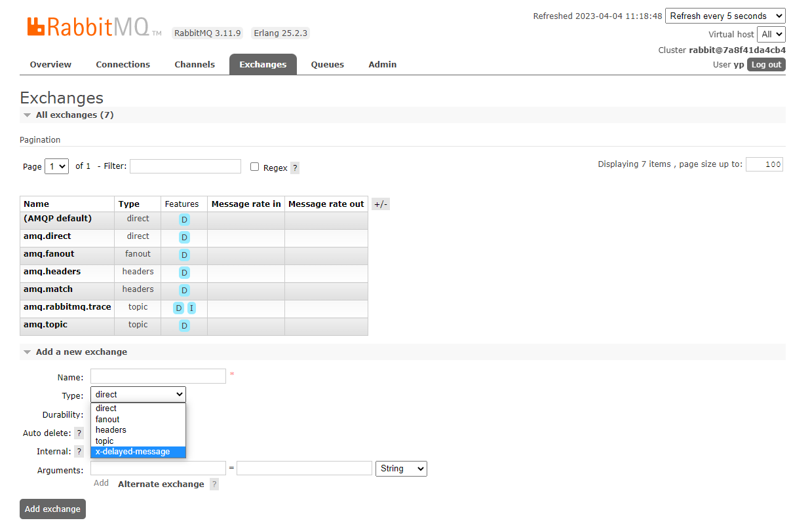

# RabbitMQ

## 1. 认识RabbitMQ

RabbitMQ是一个开源的消息代理和队列服务器，用来通过普通协议在完全不同的应用之间共享数据，RabbitMQ是使用Erlang(高并发语言)语言来编写的，并且RabbitMQ是基于AMQP协议的。

### 1.1 AMQP协议

>Advanced Message Queuing Protocol(高级消息队列协议)

定义:具有现代特征的二进制协议,是一个提供统一消息服务的应用层标准高级消息队列协议,是应用层协议的一个开放标准,为面向消息中间件设计。


### 1.2 AMQP专业术语

- Server：又称broker，接受客户端的链接，实现AMQP实体服务
- Connection：连接，应用程序与broker的网络连接
- Channel：网络信道，几乎所有的操作都在channel中进行，Channel是进行消息读写的通道。客户端可以建立多个channel，每个channel代表一个会话任务。
- Message：消息，服务器与应用程序之间传送的数据，由Properties和Body组成.Properties可以对消息进行修饰，必须消息的优先级、延迟等高级特性；Body则是消息体内容。
- virtualhost：虚拟地址，用于进行逻辑隔离，最上层的消息路由。一个virtual host里面可以有若干个Exchange和Queue，同一个Virtual Host 里面不能有相同名称的Exchange 或 Queue。
- Exchange：交换机，接收消息，根据路由键转单消息到绑定队列
- Binding： Exchange和Queue之间的虚拟链接，binding中可以包换routing key
- Routing key：一个路由规则，虚拟机可用它来确定如何路由一个特定消息。（如负载均衡）

### 1.3 RabbitMQ整体架构


Exchange和队列是多对多关系，实际操作一般为1个exchange对多个队列，为避免设计过于复杂。

## 2. Docker安装RabbitMQ

```shell
docker run -d  --name rabbitmq -e RABBITMQ_DEFAULT_USER=yp -e RABBITMQ_DEFAULT_PASS=yp -p 15672:15672 -p 5672:5672 rabbitmq

docker exec -it rabbitmq /bin/bash

rabbitmq-plugins enable rabbitmq_management
```

输入：http://172.17.6.21:15672访问验证是否OK


> RabbitMQ运行报错：RabbitMQ Management:Management API returned status code 500
>
> 解决方式：
>
> ```shell
> > 因为是使用docker 容器安装的，所有需要进入容器
> > docker exec -it rabbitmq /bin/bash
> >
> > 进入目录
> > cd /etc/rabbitmq/conf.d/
> >
> > 执行命令
> > echo management_agent.disable_metrics_collector = false > management_agent.disable_metrics_collector.conf
> >
> > 退出容器
> > exit
> >
> > 重启rabbitmq
> > docker restart rabbitmq
> ```
>
> 

## 3. 六种队列模式

`Demo：..\总结\Demo\中间件\RabbitMQ`

### 3.1  简单队列模式

最简单的工作队列，其中一个消息生产者，一个消息消费者，一个队列。也称为点对点模式

 

描述：一个生产者 P 发送消息到队列 Q，一个消费者 C 接收

### 3.2 工作队列

一个消息生产者，一个交换器，一个消息队列，多个消费者。同样也称为点对点模式


工作队列：用来将耗时的任务分发给多个消费者（工作者）

主要解决问题：处理资源密集型任务，并且还要等他完成。有了工作队列，我们就可以将具体的工作放到后面去做，将工作封装为一个消息，发送到队列中，一个工作进程就可以取出消息并完成工作。如果启动了多个工作进程，那么工作就可以在多个进程间共享。

工作队列也称为**公平性队列模式**，怎么个说法呢？

循环分发，假如我们拥有两个消费者，默认情况下，RabbitMQ 将按顺序将每条消息发送给下一个消费者，平均而言，每个消费者将获得相同数量的消息，这种分发消息的方式称为轮询。

### 3.3 发布订阅

无选择接收消息，一个消息生产者，一个交换器，多个消息队列，多个消费者，称为发布/订阅模式。

在应用中，只需要简单的将队列绑定到交换机上。一个发送到交换机的消息都会被转发到与该交换机绑定的所有队列上。很像子网广播，每台子网内的主机都获得了一份复制的消息。

可以将消息发送给不同类型的消费者。做到发布一次，多个消费者来消费。


P 表示为生产者、 X 表示交换机、C1C2 表示为消费者，红色表示队列。

### 3.4 路由模式

在发布/订阅模式的基础上，有选择的接收消息，也就是通过 routing 路由进行匹配条件是否满足接收消息。

路由模式跟发布订阅模式类似，然后在订阅模式的基础上加上了类型，订阅模式是分发到所有绑定到交换机的队列，路由模式只分发到绑定在交换机上面指定路由键的队列，我们可以看一下下面这张图：


P 表示为生产者、 X 表示交换机、C1C2 表示为消费者，红色表示队列。

上图是一个结合日志消费级别的配图，在路由模式它会把消息路由到那些 binding key 与 routing key 完全匹配的 Queue 中，此模式也就是 Exchange 模式中的`direct`模式。

> 以上图的配置为例
>
> 我们以 routingKey="error" 发送消息到 Exchange，则消息会路由到Queue1（amqp.gen-S9b…，这是由RabbitMQ自动生成的Queue名称）和Queue2（amqp.gen-Agl…）。
>
> 如果我们以 routingKey="info" 或 routingKey="warning" 来发送消息，则消息只会路由到 Queue2。如果我们以其他 routingKey 发送消息，则消息不会路由到这两个 Queue 中。

### 3.5 主题模式

同样是在发布/订阅模式的基础上，根据主题匹配进行筛选是否接收消息，比第四类更灵活。

topics 主题模式跟 routing 路由模式类似，只不过路由模式是指定固定的路由键 routingKey，而主题模式是可以模糊匹配路由键 routingKey，类似于SQL中 = 和 like 的关系。


P 表示为生产者、 X 表示交换机、C1C2 表示为消费者，红色表示队列。

topics 模式与 routing 模式比较相近，topics 模式不能具有任意的 routingKey，必须由一个英文句点号“.”分隔的字符串（我们将被句点号“.”分隔开的每一段独立的字符串称为一个单词），比如 "lazy.orange.fox"。topics routingKey 中可以存在两种特殊字符“*”与“#”，用于做模糊匹配，其中“*”用于匹配一个单词，“#”用于匹配多个单词（可以是零个）。

> 以上图中的配置为例：
>
> 如果一个消息的 routingKey 设置为 “xxx.orange.rabbit”，那么该消息会同时路由到 Q1 与 Q2，
>
> routingKey="lazy.orange.fox”的消息会路由到Q1与Q2；
>
> routingKey="lazy.brown.fox”的消息会路由到 Q2；
>
> routingKey="lazy.pink.rabbit”的消息会路由到 Q2（只会投递给Q2一次，虽然这个routingKey 与 Q2 的两个 bindingKey 都匹配）；
>
> routingKey="quick.brown.fox”、routingKey="orange”、routingKey="quick.orange.male.rabbit”的消息将会被丢弃，因为它们没有匹配任何bindingKey。

### 3.6 RPC模式

## 4. 消息应答

> 应答功能属于`消费者`，消费者在接收到消息并且处理该消息之后，告诉 rabbitmq 它已经处理了，rabbitmq 可以把该消息删除了。
>
> 消息应答有自动应答、手动应答。mq默认为自动应答，所以我们要想实现消息消费过程中不丢失，需要把自动应答改为手动应答（消息在手动应答是不丢失的，它会放回队列中重新消费）

### 4.1 概念

消费者完成一个任务可能需要一段时间，如果其中一个消费者处理一个长的任务并仅只完成了部分突然它挂掉了，会发生什么情况。RabbitMQ 一旦向消费者传递了一条消息，便立即将该消息标记为删除。在这种情况下，突然有个消费者挂掉了，我们将丢失正在处理的消息。以及后续发送给该消费这的消息，因为它无法接收到。

为了保证消息在发送过程中不丢失，rabbitmq 引入消息应答机制

**消息应答就是：**消费者在接收到消息并且处理该消息之后，告诉 rabbitmq 它已经处理了，rabbitmq 可以把该消息删除了。

### 4.2 自动应答

- 自动应答容易丢失消息。消息发送后立即被认为已经传送成功，这种模式需要在**高吞吐量和数据传输安全性方面做权衡**，因为这种模式如果消息在接收到之前，消费者那边出现连接或者 channel 关闭，那么消息就丢失了

- 自动应答可能会导致传递过载消息。没有对传递的消息数量进行限制，这样可能使得消费者这边由于接收太多还来不及处理的消息，导致这些消息的积压，最终使得内存耗尽，最终这些消费者线程被操作系统杀死，**所以自动应答这种模式仅适用在消费者可以高效并以某种速率能够处理这些消息的情况下使用**

### 4.3 手动应答

可以防止消息丢失，也可以批量应答并切减少网络拥堵。

消息确认配置：

- channel.BasicConsume(queue: _queueNormal, autoAck: false, consumer: consumer);

  **autoAck**

  - true：自动应答
  - false：手动应答

- channel..BasicAck(deliveryTag: _message.DeliveryTag, multiple: false);

  **multiple**

  - true 代表批量应答 channel 上未应答的消息。

     比如说 channel 上有传送 tag 的消息 5,6,7,8 当前 tag 是8 那么此时 5-8 的这些还未应答的消息都会被确认收到消息应答

  - false：只会应答 tag=8 的消息 5,6,7 这三个消息依然不会被确认收到消息应答。

### 4.4 手动应答效果演示 

正常情况下消息发送方发送两个消息 C1 和 C2 分别接收到消息并进行处理


在发送者发送消息 dd，发出消息之后的把 C2 消费者停掉，按理说该 C2 来处理该消息，但是由于它处理时间较长，在还未处理完，也就是说 C2 还没有执行 ack 代码的时候，C2 被停掉了，此时会看到消息被 C1 接收到了，说明消息 dd 被重新入队，然后分配给能处理消息的 C1 处理了


## 5. 发布确认

> 发布确认功能属于`生产者`，生产消息到 RabbitMQ，RabbitMQ 需要告诉生产者已经收到消息。

### 5.1 发布确认原理

生产者将信道设置成 confirm 模式，一旦信道进入 confirm 模式，所有在该信道上面发布的消
息都将会被指派一个唯一的 ID(从 1 开始)，一旦消息被投递到所有匹配的队列之后，broker 就会
发送一个确认给生产者(包含消息的唯一 ID)，这就使得生产者知道消息已经正确到达目的队列了，
如果消息和队列是可持久化的，那么确认消息会在将消息写入磁盘之后发出，broker 回传给生产
者的确认消息中 delivery-tag 域包含了确认消息的序列号，此外 broker 也可以设置basic.ack 的
multiple 域，表示到这个序列号之前的所有消息都已经得到了处理。

confirm 模式最大的好处在于他是异步的，一旦发布一条消息，生产者应用程序就可以在等信道
返回确认的同时继续发送下一条消息，当消息最终得到确认之后，生产者应用便可以通过回调方
法来处理该确认消息，如果 RabbitMQ 因为自身内部错误导致消息丢失，就会发送一条 nack 消息，生产者应用程序同样可以在回调方法中处理该 nack 消息。

### 5.2 发布确认策略

主要测试代码

```C#
public class ConfirmDemo
 {
        public static void ConfirmModel()
        {
            ConnectionFactory factory = new ConnectionFactory { HostName = "192.168.200.101", UserName = "yp", Password = "yp", VirtualHost = "/" };
            using (IConnection conn = factory.CreateConnection())
            {
                using (IModel channel = conn.CreateModel())
                {
                    channel.ExchangeDeclare("my-exchange", ExchangeType.Direct);
                    channel.QueueDeclare("my-queue", true, false, false, null);
                    channel.QueueBind("my-queue", "my-exchange", "routing.user", null);
                    var properties = channel.CreateBasicProperties();
                    properties.DeliveryMode = 2;
                    byte[] message = Encoding.UTF8.GetBytes("发送消息！");
                    //方式1：普通confirm 
                    //NormalConfirm(channel, properties, message);
                    //方式2：批量confirm
                    //BatchConfirm(channel, properties, message);
                    //方式3：异步确认Ack
                    ListenerConfirm(channel, properties, message);
                }
            }
        }
 }
```


- 单个确认发布

  这是一种简单的确认方式，它是一种**同步确认发布**的方式，也就是发布一个消息之后只有它

  被确认发布，后续的消息才能继续发布,waitForConfirmsOrDie(long)这个方法只有在消息被确认的时候才返回，如果在指定时间范围内这个消息没有被确认那么它将抛出异常。

  

  这种确认方式有一个最大的缺点就是:**发布速度特别的慢，**因为如果没有确认发布的消息就会

  阻塞所有后续消息的发布，这种方式最多提供每秒不超过数百条发布消息的吞吐量。当然对于某些应用程序来说这可能已经足够了。

  ```C#
     		/// <summary>
          /// 方式1：普通confirm模式
          /// 每发送一条消息后，调用waitForConfirms()方法，等待服务器端confirm。实际上是一种串行confirm了。
          /// </summary>
          /// <param name="channel"></param>
          /// <param name="properties"></param>
          /// <param name="message"></param>
          static void NormalConfirm(IModel channel, IBasicProperties properties, byte[] message)
          {
              //发布确认默认是没有开启的，如果要开启需要调用方法 confirmSelect，每当你要想使用发布确认，都需要在 channel 上调用该方法
              channel.ConfirmSelect();
              channel.BasicPublish("my-exchange", "routing.user", properties, message);
              if (!channel.WaitForConfirms())
              {
                  Console.WriteLine("send message failed.");
              }
              Console.WriteLine("send message success.");
          }
  ```

  

- 批量确认发布

  与单个等待确认消息相比，先发布一批消息然后一起确认可以极大地提高吞吐量，当然这种方式的缺点就是:当发生故障导致发布出现问题时，不知道是哪个消息出现问题了，我们必须将整个批处理保存在内存中，以记录重要的信息而后重新发布消息。当然这种方案仍然是同步的，也一样阻塞消息的发布。

  ```C#
   		/// <summary>
          /// 方式2：批量confirm模式
          /// 每发送一批消息后，调用waitForConfirms()方法，等待服务器端confirm。
          /// </summary>
          /// <param name="channel"></param>
          /// <param name="properties"></param>
          /// <param name="message"></param>
          static void BatchConfirm(IModel channel, IBasicProperties properties, byte[] message)
          {
              channel.ConfirmSelect();
              for (int i = 0; i < 10; i++)
              {
                  channel.BasicPublish("my-exchange", "routing.user", properties, message);
              }
              if (!channel.WaitForConfirms())
              {
                  Console.WriteLine("send message failed.");
              }
              Console.WriteLine("send message success.");
              channel.Close();
          }
  ```

  

- 异步确认发布

  异步确认虽然编程逻辑比上两个要复杂，但是性价比最高，无论是可靠性还是效率都没得说，

  他是利用回调函数来达到消息可靠性传递的，这个中间件也是通过函数回调来保证是否投递成功。

  ```C#
          /// <summary>
          /// 使用异步回调方式监听消息是否正确送达
          /// </summary>
          /// <param name="channel"></param>
          /// <param name="properties"></param>
          /// <param name="message"></param>
          static void ListenerConfirm(IModel channel, IBasicProperties properties, byte[] message)
          {
              channel.ConfirmSelect();//开启消息确认模式
              /*-------------Return机制：不可达的消息消息监听--------------*/
              //这个事件就是用来监听我们一些不可达的消息的内容的：比如某些情况下，如果我们在发送消息时，当前的exchange不存在或者指定的routingkey路由不到，这个时候如果要监听这种不可达的消息，就要使用 return
              EventHandler<BasicReturnEventArgs> evreturn = new EventHandler<BasicReturnEventArgs>((o, basic) =>
              {
                  var rc = basic.ReplyCode; //消息失败的code
                  var rt = basic.ReplyText; //描述返回原因的文本。
                  var msg = Encoding.UTF8.GetString(basic.Body.Span); //失败消息的内容
                                                                      //在这里我们可能要对这条不可达消息做处理，比如是否重发这条不可达的消息呀，或者这条消息发送到其他的路由中等等
                                                                      //System.IO.File.AppendAllText("d:/return.txt", "调用了Return;ReplyCode:" + rc + ";ReplyText:" + rt + ";Body:" + msg);
                  Console.WriteLine("send message failed,不可达的消息消息监听.");
              });
              channel.BasicReturn += evreturn;
              //消息发送成功的时候进入到这个事件：即RabbitMq服务器告诉生产者，我已经成功收到了消息
              EventHandler<BasicAckEventArgs> BasicAcks = new EventHandler<BasicAckEventArgs>((o, basic) =>
              {
                  Console.WriteLine("send message success,Acks.");
              });
              //消息发送失败的时候进入到这个事件：即RabbitMq服务器告诉生产者，你发送的这条消息我没有成功的投递到Queue中，或者说我没有收到这条消息。
              EventHandler<BasicNackEventArgs> BasicNacks = new EventHandler<BasicNackEventArgs>((o, basic) =>
              {
                  //MQ服务器出现了异常，可能会出现Nack的情况
                  Console.WriteLine("send message fail,Nacks.");
              });
              channel.BasicAcks += BasicAcks;
              channel.BasicNacks += BasicNacks;
  
              //注意：如果需要EventHandler<BasicReturnEventArgs>事件监听不可达消息的时候，一定要将mandatory设为true
              //channel.BasicPublish("my-exchange",routingKey:"routing.abc", mandatory: true,properties, message);
  
              channel.BasicPublish("my-exchange423423", "routing.user", properties, message);
          }
  ```
  
- 事务机制

  ```C#
      public class Transaction
      {
          /// <summary>
          /// 使用事务方式确保数据正确到达消息服务端
          /// </summary>
          public static void TransactionMode()
          {
              ConnectionFactory factory = new ConnectionFactory { HostName = "192.168.200.101", UserName = "yp", Password = "yp", VirtualHost = "/" };
              using (IConnection conn = factory.CreateConnection())
              {
                  using (IModel im = conn.CreateModel())
                  {
                      try
                      {
                          im.TxSelect(); //用于将当前channel设置成transaction事务模式
                          im.ExchangeDeclare("my-exchange", ExchangeType.Direct);
                          im.QueueDeclare("my-queue", true, false, false, null);
                          im.QueueBind("my-queue", "my-exchange", "", null);
                          var properties = im.CreateBasicProperties();
                          properties.DeliveryMode = 2;
                          Console.Write("输入发送的内容：");
                          var msg = Console.ReadLine();
                             
                          byte[] message = Encoding.UTF8.GetBytes("发送消息:" + msg);
                          im.BasicPublish("my-exchange", ExchangeType.Direct, properties, message);
                          im.TxCommit();//txCommit用于提交事务
                      }
                      catch (Exception ex)
                      {
                          im.TxRollback();
                      }
                  }
              }
          }
      }
  ```

- 三种发布确认速度对比

  - 单独发布消息：同步等待确认，简单，但吞吐量非常有限。
  - 批量发布消息：批量同步等待确认，简单，合理的吞吐量，一旦出现问题但很难推断出是那条消息出现了问题。
  - 异步处理：最佳性能和资源使用，在出现错误的情况下可以很好地控制，但是实现起来稍微难些

## 6. 消息持久化

> 确保消息不会丢失需要做两件事：**我们需要将队列和消息都标记为持久化**。

### 6.1 队列持久化

之前我们创建的队列都是非持久化的，rabbitmq 如果重启的化，该队列就会被删除掉，如果要队列实现持久化 需要在声明队列的时候把 durable 参数设置为持久化

```C#
//将durable设置为true
QueueDeclare(string queue, bool durable, bool exclusive, bool autoDelete, IDictionary<string, object> arguments);
//将durable设置为true
ExchangeDeclare(string exchange, string type, bool durable, bool autoDelete, IDictionary<string, object> arguments);
```


但是需要注意的就是如果之前声明的队列不是持久化的，需要把原先队列先删除，或者重新创建一个持久化的队列，不然创建队列QueueDeclare时就会报错。

以下为控制台中持久化与非持久化队列的 UI 显示区


这个时候即使重启 rabbitmq 队列也依然存在。

### 6.2 消息持久化

```C#
var properties = channel.CreateBasicProperties();
properties.DeliveryMode = 2;
.....
channel.BasicPublish("durable_exchange", "",false, properties, body);
```

将消息标记为持久化并不能完全保证不会丢失消息。尽管它告诉 RabbitMQ 将消息保存到磁盘，但是这里依然存在当消息刚准备存储在磁盘的时候 但是还没有存储完，消息还在缓存的一个间隔点。此时并没有真正写入磁盘。持久性保证并不强，但是对于我们的简单任务队列而言，这已经绰绰有余了。如果需要更强有力的持久化策略，参考`发布确认`章节。

### 6.3 不公平分发 

在最开始的时候我们学习到 RabbitMQ 分发消息采用的轮训分发，但是在某种场景下这种策略并不是很好，比方说有两个消费者在处理任务，其中有个消费者 1 处理任务的速度非常快，而另外一个消费者 2处理速度却很慢，这个时候我们还是采用轮训分发的化就会到这处理速度快的这个消费者很大一部分时间处于空闲状态，而处理慢的那个消费者一直在干活，这种分配方式在这种情况下其实就不太好，但是RabbitMQ 并不知道这种情况它依然很公平的进行分发。

为了避免这种情况，针对消费者，我们可以设置参数 channel.basicQos(1);

```C#
//设置prefetchCount : 1来告知RabbitMQ，在未收到消费端的消息确认时，不再分发消息，也就确保了当消费端处于忙碌状态时，不再分配任务。
channel.BasicQos(prefetchSize: 0, prefetchCount: 1, global: false); //能者多劳
```

意思就是如果这个任务我还没有处理完或者我还没有应答你，你先别分配给我，我目前只能处理一个任务，然后 rabbitmq 就会把该任务分配给没有那么忙的那个空闲消费者，当然如果所有的消费者都没有完成手上任务，队列还在不停的添加新任务，队列有可能就会遇到队列被撑满的情况，这个时候就只能添加新的 worker 或者改变其他存储任务的策略。

## 7. 死信队列

### 7.1 概念

死信，顾名思义就是无法被消费的消息，字面意思可以这样理解，一般来说，producer 将消息投递到 broker 或者直接到queue 里了，consumer 从 queue 取出消息进行消费，但某些时候由于特定的**原因导致** **queue** **中的某些消息无法被消费**，这样的消息如果没有后续的处理，就变成了死信，有死信自然就有了死信队列。

应用场景:为了保证订单业务的消息数据不丢失，需要使用到 RabbitMQ 的死信队列机制，当消息消费发生异常时，将消息投入死信队列中.还有比如说: 用户在商城下单成功并点击去支付后在指定时间未支付时自动失效

### 7.2 产生条件

- 消息被拒(basic.reject or basic.nack)并且没有重新入队(requeue=false)；
- 当前队列中的消息数量已经超过最大长度。
- 消息在队列中过期，即当前消息在队列中的存活时间已经超过了预先设置的TTL(Time To Live)时间；


### 7.3 实战

- 消息TTL过期/队列达到最大长度

  生产者代码

  ```C#
          public static void SendMessage()
          {
              var exchangeA = "changeA";
              var routeA = "routeA";
              var queueA = "queueA";
  
              var exchangeD = "changeD";
              var routeD = "routeD";
              var queueD = "queueD";
  
              using (var connection = RabbitMQHelper.GetConnection())
              {
                  using(var channel = connection.CreateModel())
                  {
                      channel.ExchangeDeclare(exchangeD, type: "fanout", durable: true, autoDelete: false);
                      channel.QueueDeclare(queueD, durable: true, exclusive: false, autoDelete: false);
                      channel.QueueBind(queueD, exchangeD, routeD);
  
                      channel.ExchangeDeclare(exchangeA, type: "fanout", durable: true, autoDelete: false);
                      channel.QueueDeclare(queueA, durable: true, exclusive: false, autoDelete: false, arguments: 
                                          new Dictionary<string, object> {
                                               { "x-dead-letter-exchange",exchangeD}, //设置当前队列的DLX
                                               { "x-dead-letter-routing-key",routeD}, //设置DLX的路由key，DLX会根据该值去找到死信消息存放的队列
                                               //{ "x-message-ttl",10000}, //设置消息的存活时间，即过期时间
                                               { "x-max-length", 5 }//队列最大长度为100，超出这个长度后接收的消息为dead message
                  });
                      channel.QueueBind(queueA, exchangeA, routeA);
  
  
                      var properties = channel.CreateBasicProperties();
                      properties.Persistent = true;
                      for(int i = 0; i < 10; i++)
                      {
                          //发布消息
                          channel.BasicPublish(exchange: exchangeA,
                                               routingKey: routeA,
                                               basicProperties: properties,
                                               body: Encoding.UTF8.GetBytes("message"));
                      }
                  }
              }
              
          } 
  ```

- 消息被拒

  生产者代码如上

  消费者代码

  ```C#
      public class DLXReceive
      {
          public static void ReceiveMessage()
          {
              var exchangeA = "changeA";
              var routeA = "routeA";
              var queueA = "queueA";
  
              var exchangeD = "changeD";
              var routeD = "routeD";
              var queueD = "queueD";
  
              var connection = RabbitMQHelper.GetConnection();
              {
                  var channel = connection.CreateModel();
                  {
                      channel.ExchangeDeclare(exchangeD, type: "fanout", durable: true, autoDelete: false);
                      channel.QueueDeclare(queueD, durable: true, exclusive: false, autoDelete: false);
                      channel.QueueBind(queueD, exchangeD, routeD);
  
                      channel.ExchangeDeclare(exchangeA, type: "fanout", durable: true, autoDelete: false);
                      channel.QueueDeclare(queueA, durable: true, exclusive: false, autoDelete: false, arguments:
                                          new Dictionary<string, object> {
                                               { "x-dead-letter-exchange",exchangeD}, //设置当前队列的DLX
                                               { "x-dead-letter-routing-key",routeD} //设置DLX的路由key，DLX会根据该值去找到死信消息存放的队列
                                              // { "x-message-ttl",10000} //设置消息的存活时间，即过期时间
                                               //{ "x-max-length", 5 }//队列最大长度为100，超出这个长度后接收的消息为dead message
                  });
                      channel.QueueBind(queueA, exchangeA, routeA);
  
                                          //推送的消息如何进行消费的接口回调
                      var consumer = new EventingBasicConsumer(channel);
                      consumer.Received += (model, ea) =>
                      {
                          var message = Encoding.UTF8.GetString(ea.Body.ToArray());
                          if (message.StartsWith("8:"))
                          {
                              channel.BasicReject(ea.DeliveryTag, requeue: false);//拒收消息
                              Console.WriteLine(" Reject Received => {0}", message);
                          }
                          else
                          {
                              channel.BasicAck(ea.DeliveryTag, multiple: false);
                              Console.WriteLine(" Normal Received => {0}", message);
  
                          }
                      };
                      channel.BasicConsume(queueA, false, consumer);
                  }
              }
  
          }
      }
  ```
  

## 8.  延迟队列

### 8.1 概念

延迟队列，队列内部是有序的，最重要的特性就体现在它的延迟属性上，延迟队列中的元素是希望在指定时间到了以后或之前取出和处理，简单来说，演示队列就是用来存放需要在指定时间被处理的元素的队列。

### 8.2 使用场景

- 订单在十分钟之内未支付则自动取消
- 新创建的店铺，如果在十天内都没有上传过商品，则自动发送消息提醒。
- 用户注册成功后，如果三天内没有登陆则进行短信提醒。
- 用户发起退款，如果三天内没有得到处理则通知相关运营人员。
- 预定会议后，需要在预定的时间点前十分钟通知各个与会人员参加会议

> 这些场景都有一个特点，需要在某个事件发生之后或者之前的指定时间点完成某一项任务，如：
>
> 发生订单生成事件，在十分钟之后检查该订单支付状态，然后将未支付的订单进行关闭；看起来似乎使用定时任务，一直轮询数据，每秒查一次，取出需要被处理的数据，然后处理不就完事了吗？如果数据量比较少，确实可以这样做，比如：对于“如果账单一周内未支付则进行自动结算”这样的需求，如果对于时间不是严格限制，而是宽松意义上的一周，那么每天晚上跑个定时任务检查一下所有未支付的账单，确实也是一个可行的方案。但对于数据量比较大，并且时效性较强的场景，如：“订单十分钟内未支付则关闭“，短期内未支付的订单数据可能会有很多，活动期间甚至会达到百万甚至千万级别，对这么庞大的数据量仍旧使用轮询的方式显然是不可取的，很可能在一秒内无法完成所有订单的检查，同时会给数据库带来很大压力，无法满足业务要求而且性能低下。

#### 8.3 TTL

- 消息TTL

  ```C#
  string message = Console.ReadLine();
  var body = Encoding.UTF8.GetBytes(message);
  var properties = channel.CreateBasicProperties();
  properties.Persistent = true;
  properties.Expiration = "10000";//消息TTL
  //发送一条延时10秒的消息
  channel.BasicPublish(exchangedlx, routedlx, properties, body);
  ```

  

- 队列TTL

  ```C#
  //延时的交换机和队列绑定
  channel.ExchangeDeclare(exchangedlx, "direct", true, false, null);
  channel.QueueDeclare(queuedlx, true, false, false, arguments:
      /// 指定队列的x-dead-letter-exchange和x-dead-letter-routing -key
      new Dictionary<string, object>()
      {
           {"x-dead-letter-exchange",exchangetest },
           {"x-dead-letter-routing-key",routetest},   
           { "x-message-ttl",10000} //队列TTL，设置消息的存活时间，即过期时间
      }
   );
  channel.QueueBind(queuedlx, exchangedlx, routedlx);
  ```

  

- 两者区别

  如果设置了队列的 TTL 属性，那么一旦消息过期，就会被队列丢弃(如果配置了死信队列被丢到死信队列中)，而第二种方式，消息即使过期，也不一定会被马上丢弃，因为**消息是否过期是在即将投递到消费者之前判定的**，如果当前队列有严重的消息积压情况，则已过期的消息也许还能存活较长时间；另外，还需要注意的一点是，如果不设置 TTL，表示消息永远不会过期，如果将 TTL 设置为 0，则表示除非此时可以直接投递该消息到消费者，否则该消息将会被丢弃。

### 8.3 延迟队列的实现

#### 8.3.1 利用死信队列

`利用rabbitmq死信队列x-dead-letter-exchange和x-dead-letter-routing-key`

生产者代码

```C#
    public class DelayProvider
    {
        public static void SendMessage()
        {
            var exchangedlx = "exchange.business.dlx";
            var routedlx = "";
            var queuedlx = "queue.business.dlx";

            var exchangetest = "exchange.business.test";
            var routetest = "businessRoutingkey";
            var queuetest = "queue.business.test";

            //创建连接
            using (var connection = RabbitMQHelper.GetConnection())
            {
                //创建通道
                using (var channel = connection.CreateModel())
                {
                    //延时的交换机和队列绑定
                    channel.ExchangeDeclare(exchangedlx, "direct", true, false, null);
                    channel.QueueDeclare(queuedlx, true, false, false, arguments:
                        /// 指定队列的x-dead-letter-exchange和x-dead-letter-routing -key
                        new Dictionary<string, object>()
                        {
                             {"x-dead-letter-exchange",exchangetest },
                             {"x-dead-letter-routing-key",routetest},   
                             //{ "x-message-ttl",10000} //队列TTL，设置消息的存活时间，即过期时间
                        }
                     );
                    channel.QueueBind(queuedlx, exchangedlx, routedlx);

                    //业务的交换机和队列绑定
                    channel.ExchangeDeclare(exchangetest, "direct", true, false, null);
                    channel.QueueDeclare(queuetest, true, false, false, null);
                    channel.QueueBind(queuetest, exchangetest, routetest, null);

                    Console.WriteLine("生产者开始发送消息");
                    for(int i = 0; i < 10; i++)
                    {
                        //发布消息
                        var message = string.Format("{0}:message",i);
                        Console.WriteLine("Send Direct {0} message", i);
                        var body = Encoding.UTF8.GetBytes(message);
                        var properties = channel.CreateBasicProperties();
                        properties.Persistent = true;
                        properties.Expiration = "10000";//消息TTL
                        //发送一条延时10秒的消息
                        channel.BasicPublish(exchangedlx, routedlx, properties, body);

                    }
                }
            }
            Console.ReadLine();
        }
    }
```


消费者代码

```C#
    public class DelayConsumer
    {
        public static void ReceiveMessage()
        {
            var exchangetest = "exchange.business.test";
            var routetest = "businessRoutingkey";
            var queuetest = "queue.business.test";
            //创建连接
            using (var connection = RabbitMQHelper.GetConnection())
            {
                //创建通道
                using (var channel = connection.CreateModel())
                {                  //业务的交换机和队列绑定
                    channel.ExchangeDeclare(exchangetest, "direct", true, false, null);
                    channel.QueueDeclare(queuetest, true, false, false, null);
                    channel.QueueBind(queuetest, exchangetest, routetest, null);

                    //回调，当consumer收到消息后会执行该函数
                    var consumer = new EventingBasicConsumer(channel);
                    consumer.Received += (model, ea) =>
                    {
                        var message = Encoding.UTF8.GetString(ea.Body.ToArray());
                        //打印消费的消息
                        Console.WriteLine(message);
                        channel.BasicAck(ea.DeliveryTag, false);
                    };

                    //消费queue.business.test队列的消息
                    channel.BasicConsume(queuetest, false, consumer);

                    Console.ReadLine();
                }
            }

        }
    }
```

> 该方式的缺陷：
>
> 如果存在A、B消息进入了队列中，A在前，B在后，如果B消息的过期时间比A的过期时间要早，消费的时候，并不会先消费B，再消费A，而是B会等A先消费，即使A要晚过期
>
> 如果过期时间不一致，则推荐使用延迟插件，来避免这种问题。

#### 8.3.2 安装延迟插件

`使用`rabbitmq_delayed_message_exchange` 插件提供的`x-delayed-message`类型的交换机。该插件使用只需要声明交换机的时候，指定x-delayed-message类型，然后添加x-delayed-type参数即可`

**安装插件**

```shell
#安装完成后用工具将插件文件上传到服务器上
#将刚刚上传的插件拷贝到容器内plugins目录下
docker cp /root/rabbitmq_delayed_message_exchange-3.10.2.ez rabbitmq:/plugins

#进入容器
docker exec -it rabbitmq /bin/bash

#移动到plugins目录下
cd /opt/rabbitmq/plugins

#查看是否上传成功
ls

#启动插件
rabbitmq-plugins enable rabbitmq_delayed_message_exchange

#退出容器
exit

#重启容器
docker restart rabbitmq
```

容器启动成功之后，登录RabbitMQ的管理界面（ip:15672 访问web界面），找到ExchangesTab页。点击Add a new exchange，在Type里面查看是否有x-delayed-message选项，如果存在就代表插件安装成功。




生产者代码

```C#
    public class DelayPluginProvider
    {
        public static void SendMessage()
        {
            var exchangePlugin = "plug.delay.exchange";
            var routedlxPlugin = "plugdelay";
            var queuedlxPlugin = "plug.delay.queue";

            //var exchangetest = "exchange.business.test";
            //var routetest = "businessRoutingkey";
            //var queuetest = "queue.business.test";

            //创建连接
            using (var connection = RabbitMQHelper.GetConnection())
            {
                //创建通道
                using (var channel = connection.CreateModel())
                {
                    //指定x-delayed-message 类型的交换机，并且添加x-delayed-type属性
                    channel.ExchangeDeclare(exchangePlugin, "x-delayed-message", true, false, arguments: 
                                new Dictionary<string, object>()
                                {
                                    {"x-delayed-type","direct" }
                                }
                     );
                    channel.QueueDeclare(queuedlxPlugin, true, false, false, null);
                    channel.QueueBind(queuedlxPlugin, exchangePlugin, routedlxPlugin);

                    var properties = channel.CreateBasicProperties();
                    Dictionary<string, object> headers = new Dictionary<string, object>()
                    {
                        {"x-delay","10000" }
                    };
                    properties.Persistent = true;
                    properties.Headers = headers;

                    Console.WriteLine("生产者开始发送消息");
                    for(int i = 0; i < 10; i++)
                    {
                        //发布消息
                        var message = string.Format("{0}:message",i);
                        Console.WriteLine("Send Direct {0} message", i);
                        var body = Encoding.UTF8.GetBytes(message);
                        //发送一条延时10秒的消息
                        channel.BasicPublish(exchangePlugin, routedlxPlugin, properties, body);

                    }
                }
            }
            Console.ReadLine();
        }
    }
```


消费者代码

```C#
public class DelayPluginConsumer
{
    public static void ReceiveMessage()
    {
        var exchangePlugin = "plug.delay.exchange";
        var routedlxPlugin = "plugdelay";
        var queuedlxPlugin = "plug.delay.queue";
        //创建连接
        using (var connection = RabbitMQHelper.GetConnection())
        {
            //创建通道
            using (var channel = connection.CreateModel())
            {   
                //业务的交换机和队列绑定
                channel.ExchangeDeclare(exchangePlugin, "x-delayed-message", true, false, arguments:
                         new Dictionary<string, object>()
                         {
                                {"x-delayed-type","direct" }
                         }
                );
                channel.QueueDeclare(queuedlxPlugin, true, false, false, null);
                channel.QueueBind(queuedlxPlugin, exchangePlugin, routedlxPlugin);
                //回调，当consumer收到消息后会执行该函数
                var consumer = new EventingBasicConsumer(channel);
                consumer.Received += (model, ea) =>
                {
                    var message = Encoding.UTF8.GetString(ea.Body.ToArray());
                    //打印消费的消息
                    Console.WriteLine(message);
                    channel.BasicAck(ea.DeliveryTag, false);
                };

                //消费queue.business.test队列的消息
                channel.BasicConsume(queuedlxPlugin, false, consumer);

                Console.ReadLine();
            }
        }

    }
}
```

## 9. 集群（待整理）

## 10. 其他知识

### 10.1  消息可靠性分析和解决


**RabbitMQ收发消息的时候，有几个主要环节和疑问**

- 消息从生产者发送到Broker，生产者把消息发到Broker之后，怎么知道自己的消息是否被接收。
- 消息从Exchange路由到Queue，Exchange是一个绑定列表，职责是分发消息。如果找不到队列或者找不到正确的队列，怎么处理。
- 消息在Queue中存储，队列有自己的数据库Mnesia，用来存储消息，如果没有被消费会一直存在，如何保证消息在队列中稳定地存储呢？
- 消费者订阅Queue并消费消息，队列是FIFO的，被消费之后删库才投递下一条，Broker如何知道消费者已经接收了消息呢？

**（1）消息发送到Broker**

- 失败原因：例如设备故障等导致消息发送失败，生产者不能确定Broker有没有正确接收。这就需要给生产者发送消息的接口一个应答。
- 解决方案：1）事务模式； 2）Confirm模式；

**（2）消息从交换机路由到队列**

- 失败原因：队列不存在，或者routingkey错误。
- 解决方案：1）服务端重发生产者 2）交换机路由到另一个备份的交换机。

**（3）消息队列存储**

- 失败原因：重启可能导致内存消息消失，这就要把消息本身和元数据（队列，交换机，绑定）都保存到磁盘。
- 解决方案：1）队列持久化 2）交换机持久化 3）消息持久化

**（4）消息投递到消费者**

- 1) 自动Ack 2）手动Ack

**（5）消费者回调**

从生产者到Broker，交换机到队列，队列本身，队列到消费者，都有响应的方法知道msg是否正常流转。但是服务端收到ack或者nack之后，生产者知道吗？根据经验是不知道的。但是如果为了保证一致性，生产者必须知道消费者有没有成功消费，怎么办？

 这个是需要从业务层面来进行，两种方式： 

- 回调，消费者收到消息，处理完毕后，调用生产者的API。 
- 消费者发送一条响应消息给生产者。

**（6）补偿机制**

如果生产者的API没有被调用，也没有收到消费者的响应消息，该如何做？ 这时候可以稍微等一下，可能是消费者处理时间太长或者网络超时，超时之后还没有得到响应的消息才确定为失败，消费失败以后重发消息。 但是问题又来了，谁来发，多久发一次，一共发几次，发一模一样的消息吗？消费者如何进行**幂等**呢？

- **谁来发** 实际的发送方是业务人员，对于异步操作，发完工作就结束了，所以肯定不是业务发进行重发的。 此时可以创建一个定时任务，找到这些中间状态的记录，查出来之后构建为MQ，重新发送，这种方式用的最多。 其实还有一种情况就是定时执行一直不行之后还是要给上层返回错误的，例如我做的结算系统中就遇到这种情况，如果服务不可用，再重试也无用，此时就需要人员重做结算，此时将失败信息记录起来，然后重新结算。

- **多久发一次**(重复频率) 这个可以由业务根据情况灵活设置，没有固定值，可以按照恒定间隔执行，也可以设置衰减期，例如先一分钟一次，之后2分钟，再5分钟等等。这个可以在定时任务中设置

- **一共重发几次**（重试次数） 这个也可以设置，如果服务不可用而大量发送，会产生大量无效数据导致MQ消息堆积，一般设置为3~5次就够了。 这个要在消息表里记录次数来实现，发一次就加1.

- **重发什么内容**（幂等） 肯定不能发一模一样的消息，不然消费端因为无法区分而导致幂等性问题，至少应该个加个时间戳或者id之类的来区分吧。

  不过RabbitMQ除了同一批次的消息有个DeliveryTag外，没有这种完整的防重复设置，也不知道什么才是重复的消息，这需要消费端来处理（用异常队列或者死信队列来做，通常更多的是通过业务端来控制）

### 10.2 幂等性

#### 10.2.1 概念

用户对于同一操作发起的一次请求或者多次请求的结果是一致的，不会因为多次点击而产生了副作用。

举个最简单的例子，那就是支付，用户购买商品后支付，支付扣款成功，但是返回结果的时候网络异常，此时钱已经扣了，用户再次点击按钮，此时会进行第二次扣款，返回结果成功，用户查询余额发现多扣钱了，流水记录也变成了两条。在以前的单应用系统中，我们只需要把数据操作放入事务中即可，发生错误立即回滚，但是再响应客户端的时候也有可能出现网络中断或者异常等等。

#### 10.2.2 消息重复消费

**（1）重复消费产生原因：**网络延迟传输中，消费出现异常或者消息延迟消费，会造成MQ进行重试补偿，在重试过程中可能会造成重复消费，重复消费问题就是幂等性问题。

**（4）重复消费的几种业务场景**

- 业务场景1：从生产者拿到个数据后要写库，先根据主键查一下，如果这个数据有了就别插了直接update
- 业务场景2：如果是写redis的都没问题，因为每次都是set，redis天然的幂等性
- 业务场景3：需要让生产者发送每条数据的时候加上一个全局唯一的id,消费的时候先根据id去比如redis查一下判断是否消费过，若没有则处理然后这个id写redis,若消费过就不处理
- 业务场景4：如果数据库有唯一建约束了，插入只会报错，不会导致数据库出现脏数据，本身幂等了

**（5）解决重复消费的几种方法**

- 唯一ID + 指纹码机制，利用数据库主键去重

  指纹码:我们的一些规则或者时间戳加别的服务给到的唯一信息码,它并不一定是我们系统生成的，基本都是由我们的业务规则拼接而来，但是一定要保证唯一性，然后就利用查询语句进行判断这个 id 是否存在数据库中,优势就是实现简单就一个拼接，然后查询判断是否重复；劣势就是在高并发时，如果是单个数据库就会有写入性能瓶颈当然也可以采用分库分表提升性能，但也不是我们最推荐的方式

- 利用Redis的原子性去实现

  redis是单线程的，但是性能好也有很多原子性的命令，比如setnx命令，在接收到消息后将消息ID作为key去执行setnx命令，如果执行成功则表示没有执行过这条消息，可以进行消费（setnx命令特点：当且仅当key不存在，将key值设为value值；若key已存在该命令不做任何操作）

- 使用全局ID区分消息，解决幂等性（常用）

  以生产者和消费者代码举例：生产者在请求头设置消息id（messageId），可以用随机ID，也可以用业务逻辑唯一ID

### 10.3 顺序消费

**（1）为什么要保证顺序消费**

消息队列中的若干消息如果是对同一个数据进行操作，这些操作具有前后的关系，必须要按前后的顺序执行，否则就会造成数据异常。

举例： 比如通过mysql binlog进行两个数据库的数据同步，由于对数据库的数据操作是具有顺序性的，如果操作顺序搞反，就会造成不可估量的错误。比如数据库对一条数据依次进行了 插入->更新->删除操作，这个顺序必须是这样，如果在同步过程中，消息的顺序变成了 删除->插入->更新，那么原本应该被删除的数据，就没有被删除，造成数据的不一致问题。

**（2）出现顺序错乱的场景**

-  一个queue，有多个consumer去消费，这样就会造成顺序的错误，consumer从MQ里面读取数据是有序的，但是每个consumer的执行时间是不固定的，无法保证先读到消息的consumer一定先完成操作，这样就会出现消息并没有按照顺序执行，造成数据顺序错误。

  

- 一个queue对应一个consumer，但是consumer里面进行了多线程消费，这样也会造成消息消费顺序错误

  

**（3）如何保证顺序消费**

- 拆分多个queue，每个queue一个consumer，就是多一些queue而已，确实是麻烦点；这样也会造成吞吐量下降，可以在消费者内部采用多线程的方式取消费。

  

- 一个queue但是对应一个consumer，然后这个consumer内部用内存队列做排队，然后分发给底层不同的worker来处理

  

D:\架构学习\Source\Templet\资料\RabbitMQ

## 10. 学习资料

[消息队列高手课 (geekbang.org)](https://time.geekbang.org/column/intro/100032301?tab=intro)