> 关于朝夕课程的学习笔记

## Kafka基本概念

Kafka 是一个分布式的消息引擎系统，它的主要功能是提供一套完备的消息发布与订阅解决方案。

### 术语

#### Topic

在 Kafka 中，发布订阅的对象是主题（Topic），你可以为每个业务、每个应用甚至每类数据都创建专属的主题。是承载消息的逻辑容器，在实际使用中多用来区分具体的业务。

#### Producer

向主题发布消息的客户端应用程序称为生产者（Producer），生产者程序通常持续不断地向一个或者多个主题发送消息

#### Consumer

订阅主题消息的客户端应用程序被称为消费者（Consumer）。和生产者类似，消费者也能同时订阅多个主题的消息

#### Client

生产者和消费者统称为客户端（Clients），你可以同时运行多个生产者和消费者实例，这些实例会不断地向 Kafka 集群中的多个主题生产和消费消息。

#### Broker

Kafka 的服务器端由被称为 Broker 的服务进程构成，即一个 Kafka 集群由多个 Broker 组成。Broker 负责接收和处理客户端发送过来的请求，以及对消息进行持久化。虽然多个 Broker 进程能够运行在同一台机器上，但更常见的做法是将不同的 Broker 分散在不同的机器上，这样如果集群中某一台机器宕机，即使在它上面运行的所有 Broker 进程都挂掉了，其他机器上的 Broker 也依然能够对外提供服务。这其实就是 Kafka 提供高可用的手段之一。

#### Replica

实现高可用的另一个手段就是备份机制（Replication）。备份的思想很简单，就是把相同的数据拷贝到多台机器上，而这些相同的数据拷贝在 Kafka 中被称为副本（Replica）。副本的数量是可以配置的，这些副本保存着相同的数据，却有不同的角色和作用。

Kafka 定义了两类副本：领导者副本（Leader Replica）和追随者副本（Follower Replica）。前者对外与客户端交互，而后者不能对外服务。

副本的工作机制也很简单，生产者总是向领导者副本写消息，而消费者总是从领导者副本读消息。至于追随者副本，它只做一件事情：向领导者副本发送请求，请求领导者把最新生产的消息发送给它，这样它能保持与领导者的同步。

**为什么追随者副本不对外提供服务呢？**

Kafka 的分区（Partition）已经让读请求是从多个 Broker 读从而实现负载均衡
如果允许追随者对外提供服务，会存在数据一致性的问题，因为消息从主节点同步到从节点需要时间。

#### Partition

Kafka 中的分区机制指的是将每个主题划分成多个分区（Partition），每个分区是一组有序的消息日志。生产者生产的每条消息只会发送到一个分区中。

刚才提到的副本如何与这里的分区联系在一起呢？实际上，副本是在分区这个层级定义的。每个分区下可以配置若干个副本，其中只能有 1 个领导者副本和 N-1 个追随者副本。

生产者向分区写入消息，每条消息在分区中的位置信息由 一个叫位移（Offset）的数据来表征。分区位移总是从 0 开始，假设一个生产者向一个空分区写入了 10 条消息，那么这 10 条消息的位移依次是 0、1、2、…、9。

至此我们能够完整地串联起 Kafka 的三层消息架构：

- 第一层是主题层，每个主题可以配置 M 个分区，而每个分区又可以配置 N 个副本。
- 第二层是分区层，每个分区的 N 个副本中只能有一个充当领导者角色，对外提供服务； 其他 N-1 个副本是追随者副本，只是提供数据冗余之用。
- 第三层是消息层，分区中包含若干条消息，每条消息的位移从 0 开始，依次递增。最后，客户端程序只能与分区的领导者副本进行交互。

#### 持久化

Kafka 使用消息日志来保持数据，一个日志就是磁盘上一个只能追加写（Appen-only）消息的物理文件。因为只能追加写入，避免了缓慢的随机 I/O 操作，改为性能较好的顺序 I/O 写操作，这也是 Kafka 实现高吞吐量特性的一个重要手段。

不过如果不停地追加写日志，最终也会耗尽所有的磁盘空间，因此 Kafka 会定期地删除消息以回收磁盘。简单来说就是通过日志段（Log Segment）机制。在 Kafka 底层，一个日志又进一步细分为多个日志段，消息被追加写到当前日志段中，当写满了一个日志段后，Kafka 会自动切分出一个新的日志段，并将老的日志段封存起来。Kafka 在后台还有定时任务会定期地检查老的日志段是否能够删除，从而回收磁盘空间。

#### 消费者组

Kafka 支持两种消息模型：点对点模型（Peer to Peer，P2P）和发布订阅模型。

点对点模型指的是同一条消息只能被下游的一个消费者消费，其他消费者不能消费。Kafka 中实现这种 P2P 模型方法就是引入了消费者组（Consumer Group）。

所谓的消费者组，指的是多个消费者实例共同组成一个组来消费一组主题。这组主题中的每个分区都只会被组内的一个消费者实例消费，其他消费者实例不能消费它。

为什么要引入消费者组呢？主要是为了提升消费者段的吞吐量，多个消费者同时消费，加速整个消费段的吞吐量（TPS）。

消费者组里面的所有消费者不仅瓜分订阅主题的消息，而且它们还能彼此协助。假设组内的某个实例挂了，Kafka 能自动检测到，然后把这个 Failed 的实例之前负责的分区转移给其他存活的消费者，这个过程也就是 Kafka 大名鼎鼎的 “重平衡” （Rebalance）。

每个消费者在消费消息的过程中必然需要有个字段记录它当前消费到了分区的哪个位置上，这个字段就是消费者位移（Consumer Offset）。注意，这和上面所说的位移完全不是一个概念。上面的“位移”表征的是分区内的消息位置，它是不变的，即一旦消息被成功写入到一个分区上，它的位移值就是固定的了。而消费者位移则不同，它可能是随时变化的，毕竟它是消费者消费进度的指示器嘛。另外每个消费者有着自己的消费者位移，因此一定要区分这两类位移的区别。我个人把消息在分区中的位移称为分区位移，而把消费者端的位移称为消费者位移。

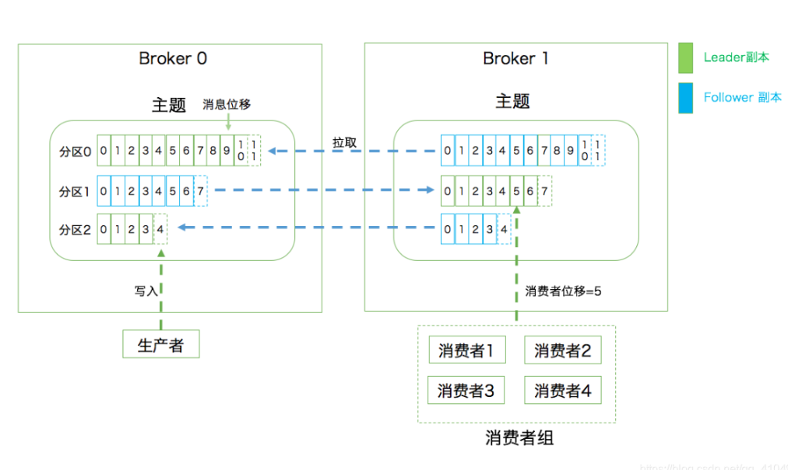

## 基本原理

### 工作流程


### 文件存储


由于生产者生产的消息会不断追加到 log 文件末尾，为防止 log 文件过大导致数据定位 效率低下，Kafka 采取了分片和索引机制，将每个 partition 分为多个 segment。每个 segment 对应两个文件——“.index”文件和“.log”文件。这些文件位于一个文件夹下，该文件夹的命名 规则为：topic 名称+分区序号。例如，first 这个 topic 有三个分区，则其对应的文件夹为 first-0，first-1,first-2


index 和 log 文件以当前 segment 的第一条消息的 offset 命名。下图为 index 文件和 log 文件的结构示意图。


“.index”文件存储大量的索引信息，“.log”文件存储大量的数据，索引文件中的元 数据指向对应数据文件中 message 的物理偏移地址。

### 分区策略（生产者）

####   分区原因

- 方便在集群中扩展，提高负载能力。因为一个topic可以有多个partition，所以我们可以通过扩展机器去轻松的应对日益增长的数据量。
- 可以提高并发，以partition为读写单位，可以多个消费者同时消费数据，提高了消息的处理效率。

#### 分区的原则

  ​ 我们向某个服务器发送请求的时候，服务端可能会对请求做一个负载，将流量分发到不同的服务器，那在kafka中，如果某个topic有多个partition，producer又怎么知道该将数据发往哪个partition呢？有以下原则：

- partition在写入的时候可以指定需要写入的partition，如果有指定，则写入对应的partition。
- 如果没有指定partition，但是设置了数据的key，则会根据key的值将其hash到同一个partition。
-  如果既没指定partition，又没有设置key，..Net中默认将消息发送到partition0，如果想要以轮询的方式将消息发送的指定分区，则需要客户端自行编码实现，java则可通过某些参数实现。

### 消费方式（消费者）

  Consumer是采用pull（拉）模式从broker中读取数据

  - push（推）模式很难适应消费速率不同的消费者，因为消息发送速率是由broker决定的。

    目标是尽可能以最夸速度传递消息，但是这样很容易造成consumer来不及处理消息。

    典型表现就是拒绝服务以及网络拥塞。而pull模式则可以根据consumer的消费能力以适当的速率消费消息

  - pull（拉）模式不足之处是，如果kafka没有数据，消费者可能会陷入循环中，一直返回空数据。

    针对这一点，Kafka的消费者在消费数据时会传入一个时长参数timeout，如果当前没有数据可供消费，consumer会等待一段时间之后再返回，这段时长即为timeout

## 部署Kafka单机伪集群

创建docker-compose.yml文件

```yml
version: '2'

services:
  zoo1:
    image: wurstmeister/zookeeper
    restart: unless-stopped
    hostname: zoo1
    ports:
      - "6181:2181"
    container_name: zookeeper_kafka

  # kafka version: 1.1.0
  # scala version: 2.12
  kafka1:
    image: wurstmeister/kafka
    ports:
      - "9092:9092"
    environment:
      KAFKA_ADVERTISED_HOST_NAME: 120.78.170.106
      KAFKA_ZOOKEEPER_CONNECT: "zoo1:2181"
      KAFKA_BROKER_ID: 1
      KAFKA_OFFSETS_TOPIC_REPLICATION_FACTOR: 1
      KAFKA_CREATE_TOPICS: "stream-in:1:1,stream-out:1:1"
    depends_on:
      - zoo1
    container_name: kafka
```

```shell
#部署 Compose 应用
docker-compose up -d
#停止 Compose 应用相关的所有容器，但不会删除它们
docker-compose stop
#用于删除已停止的 Compose 应用
docker-compose rm 
```

## 在.NET中使用Kafka

> Nuget  Confluent.Kafka

### 点对点模型

生产者代码：

```C#
    public static class HelloWorldDemo
    {
        public static async void Run(string server,string topic)
        {
            var conif = new ProducerConfig()
            {
                BootstrapServers = server,
                //None:生产者发送消息之后不需要等待任何服务端的响应
                //Leader:产者发送消息之后，只要分区的 leader 副本成功写入消息，那么它就会收到来自服务端的成功响应
                //All:生产者在消息发送之后，需要等待 ISR 中的所有副本都成功写入消息之后才能够收到来自服务端的成功响应
                Acks = Acks.All 
            };
            var message = "Hello World! Kafka!";
            var producer = new ProducerBuilder<string, string>(conif).Build();
            try
            {
                for (int i = 0; i < 10; i++)
                {
                    //如果topic不存在，则Kafka会自动创建，默认分区数为1
                    var result = await producer.ProduceAsync(topic, new Message<string, string>
                    {
                        Key = "hello",
                        Value = message
                    });
                    Console.WriteLine($"消息已发送[{result.Value}]到[{result.TopicPartitionOffset}]");
                }

            }
            catch (ProduceException<string,string> e)
            {
                Console.WriteLine($"发送失败: {e.Error.Reason}");
            }catch(Exception e)
            {

                Console.WriteLine($"发送失败: {e.InnerException}");
            }
        }
    }
```

Main函数

```C#
        static async Task Main(string[] args)
        {
            string topic = "my.topic.one";
            string server = "192.168.1.102:9192";
            HelloWorldDemo.Run(server, topic);
            Console.ReadLine();
        }
```


消费者代码：

```C#
    public static class HelloWorldDemo
    {
        public static void Run(string server,string topic)
        {
            string groupID = "consumer.group.hello";
            var conif = new ConsumerConfig()
            {
                BootstrapServers = server,
                GroupId = groupID,
                AutoOffsetReset = AutoOffsetReset.Earliest 
            };
            var consumer = new ConsumerBuilder<Ignore, string>(conif).Build();
            consumer.Subscribe(topic);
            Console.WriteLine("等待消息");
            while (true)
            {
                var consumeResult = consumer.Consume();
                Console.WriteLine($"收到消息：[{consumeResult.Message.Value}] 来自 [{consumeResult.TopicPartitionOffset}]");
            }
        }
    }
```

main函数

```C#
        static void Main(string[] args)
        {
            string topic = "my.topic.one";
            string server = "192.168.1.102:9192";
            HelloWorldDemo.Run(server,topic);
        }
```

测试结果：

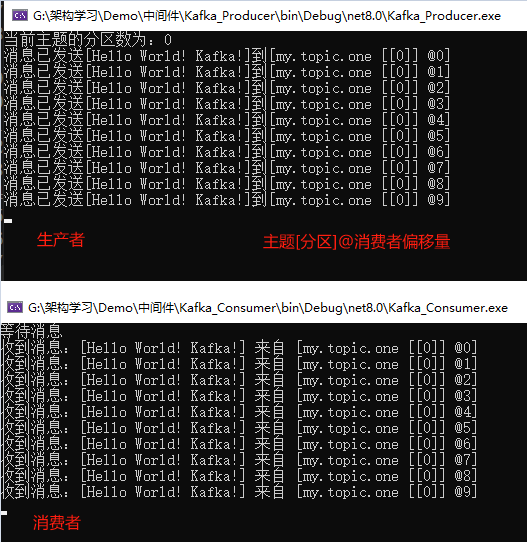

### 发布订阅模型

- 1、创建主题：此处创建了含有三个分区的主题
- 2、生产者使用将消息轮询发送到分片服务器上
- 3、启动含有多个消费者的消费者组消费消息：每个消费者组可以消费多个主题，同一主题的某个分区的消息只能被消费组中的一个消费者消费，但一个消费者可以消费多个分区的数据（一般分区数大于消费者组中的消费者个数，才会出现一个消费者消费多个分区数据的情况）。

Kafka帮助类：（仅用于测试，不可用于实际项目）

```C#
    public class KafkaHelper
    {
        private static KafkaHelper instance = null;
        private static readonly object padlock = new object();

        KafkaHelper() { }
        public static KafkaHelper Instance
        {
            get
            {
                if (instance == null)
                {
                    lock (padlock)
                    {
                        if (instance == null)
                        {
                            instance = new KafkaHelper();
                        }
                    }
                }

                return instance;
            }
        }

        /// <summary>
        /// 创建拥有指定分区的主题
        /// </summary>
        /// <param name="server"></param>
        /// <param name="topic"></param>
        /// <param name="partitions"></param>
        /// <returns></returns>

        public async Task CreateTopic(string server, string topic, int partitions)
        {
            var config = new AdminClientConfig
            {
                BootstrapServers = server
            };

            using var adminClient = new AdminClientBuilder(config).Build();


            //await RemoveExistTapic(server, topic);
            var topicSpecification = new TopicSpecification
            {
                Name = topic,
                NumPartitions = partitions
            };
            await adminClient.CreateTopicsAsync(new[] { topicSpecification });

            Console.WriteLine($"主题 [{topic}] 分区数量[{partitions}] 创建成功");
        }

        /// <summary>
        /// 删除后重新创建Topic还是会报错（需要配置kafka？？？）
        /// 实际环境中则需要考虑while循环的效率问题
        /// 如果您在删除主题后立即尝试创建相同的主题，可能会遇到错误。
        /// 这是因为在删除主题后，Kafka需要一些时间来进行清理和同步操作，以确保主题完全被删除。
        /// 在此期间，如果尝试立即创建同名的主题，可能会导致冲突和错误。
        /// 为了解决这个问题，您可以在删除主题后等待一段时间，以确保主题已完全删除
        /// </summary>
        /// <param name="server"></param>
        /// <param name="topic"></param>
        /// <returns></returns>
        public async Task RemoveExistTapic(string server, string topic)
        {
            // Kafka集群的连接配置
            var config = new AdminClientConfig
            {
                BootstrapServers = server
            };

            using (var adminClient = new AdminClientBuilder(config).Build())
            {
                bool isRemove = false;
                bool isExcute = false;
                while (!isRemove)
                {
                    var metadata = adminClient.GetMetadata(TimeSpan.FromSeconds(10));
                    var topicMetadata = metadata.Topics.FirstOrDefault(topicMetadata => topicMetadata.Topic == topic);

                    if (topicMetadata != null)
                    {
                        if(isExcute == false)
                        {

                            // 调用DeleteTopicsAsync方法删除主题
                            await adminClient.DeleteTopicsAsync(new List<string> { topic });
                            isExcute = true;
                        }
                        else
                        {
                            await Task.Delay(TimeSpan.FromSeconds(10));

                        }
                    }
                    else
                    {
                        isRemove = true;
                    }
                }
            }
        }
        /// <summary>
        /// 获取主题的分区数
        /// </summary>
        /// <param name="topic"></param>
        public int GetPartitionCount(string server, string topic)
        {
            var config = new AdminClientConfig
            {
                BootstrapServers = server
            };

            using var adminClient = new AdminClientBuilder(config).Build();

            var metadata = adminClient.GetMetadata(TimeSpan.FromSeconds(10));

            var topicMetadata = metadata.Topics.FirstOrDefault(topicMetadata => topicMetadata.Topic == topic);

            return topicMetadata == null ? 0 : topicMetadata.Partitions.Count;
        }
    }
```

生产者代码：

```C#
    public static class PartitionPolicyDemo
    {
        /// <summary>
        /// 轮询策略
        /// </summary>
        /// <param name="server"></param>
        /// <param name="topic"></param>
        /// <returns></returns>
        public static async Task RoundRobin(string server, string topic)
        {
            var config = new ProducerConfig
            {
                BootstrapServers = server
            };

            using var producer = new ProducerBuilder<Null, string>(config).Build();

            // 获取指定主题的分区数量
            var partCount = KafkaHelper.Instance.GetPartitionCount(server, topic);

            for (var i = 0; i < 10; i++)
            {
                // 使用取余操作来实现轮询分区策略
                var partNum = new Partition(i % partCount);

                var message = new Message<Null, string> { Value = $"Hello, Kafka!{i}" };
                var result = await producer.ProduceAsync(new TopicPartition(topic, new Partition(partNum)), message);

                Console.WriteLine($"消息已发送[{result.Value}]到[{result.TopicPartitionOffset}]");
            }
        }

        /// <summary>
        /// 随机策略
        /// </summary>
        /// <param name="server"></param>
        /// <param name="topic"></param>
        /// <returns></returns>
        public static async Task Random(string server, string topic)
        {
            var config = new ProducerConfig
            {
                BootstrapServers = server
            };

            using var producer = new ProducerBuilder<Null, string>(config).Build();

            // 获取指定主题的分区数量
            var partCount = KafkaHelper.Instance.GetPartitionCount(server, topic);
            // 创建随机对象
            var random = new Random();

            for (var i = 0; i < 10; i++)
            {
                // 获取随机分区
                var partNum = random.Next(0, partCount);

                var message = new Message<Null, string> { Value = $"Hello, Kafka!{i}" };
                var result = await producer.ProduceAsync(new TopicPartition(topic, new Partition(partNum)), message);

                Console.WriteLine($"消息已发送[{result.Value}]到[{result.TopicPartitionOffset}]");
            }
        }
    }
```

消费者代码：

与`点对点模型`中的示例相同

测试结果：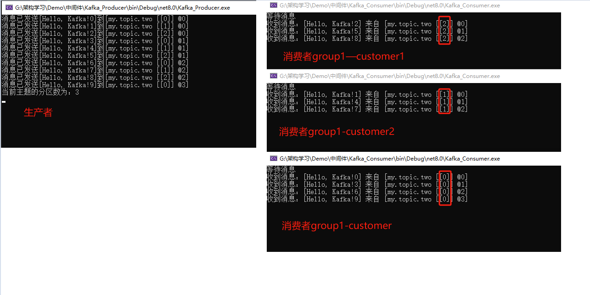

### 重要参数

#### AutoOffsetReset

在使用Kafka的过程中，消费者断掉之后，再次开始消费时，消费者会从断掉时的位置重新开始消费。

场景再现：比如昨天消费者晚上断掉了，今天上午我们会发现kafka消费的数据不是最新的，而是昨天晚上的数据，由于数据量比较多，也不会及时的消费到今天上午的数据，这个时候就需要我们对偏移量进行重置为最新的，以获取最新的数据。

前提，我们使用的AutoOffsetReset配置是Latest，即从连接到Kafka那一刻开始消费之后产生的消息，之前发布的消息不在消费，这也是默认的配置。

关于AutoOffsetReset这个枚举的配置项如下：

- `latest` ：最新(默认) ，这意味着使用者将从分区的尾部读取消息，只消费最新的信息，即自从消费者上线后才开始推送来的消息。那么会导致忽略掉之前没有处理的消息。
- `earliest` ：这意味着从分区中最早的偏移量读取；自动从消费者上次开始消费的位置开始，进行消费。
- `none`：如果没有为使用者的组找到以前的偏移量，则不会向使用者抛出异常。

#### TopicPartition

**指定消费特定分区的数据**

生产者代码：

与“发布订阅模型”中生产者代码相同

消费者代码：

```C#
    public class CustomPartitionDemo
    {
        public static void Run(string server, string topic)
        {
            string groupID = "consumer.group.tt";
            var conif = new ConsumerConfig()
            {
                BootstrapServers = server,
                GroupId = groupID,
                AutoOffsetReset = AutoOffsetReset.Earliest
            };
            var consumer = new ConsumerBuilder<Ignore, string>(conif).Build();
            //consumer.Subscribe(topic);
            // 指定要消费的分区
            var partition = new TopicPartition(topic, 1);
            consumer.Assign(new List<TopicPartitionOffset> { new TopicPartitionOffset(partition, Offset.Beginning) });
            Console.WriteLine("等待消息");
            while (true)
            {
                var consumeResult = consumer.Consume();
                Console.WriteLine($"收到消息：[{consumeResult.Message.Value}] 来自 [{consumeResult.TopicPartitionOffset}]");
            }
        }
    }
```

测试结果：


#### OffSet

关于Offset这个枚举不同配置项的说明如下：

Offset 可以被设置为 Beginning、End、Stored 和 Unset。这些值的含义如下：

- `Beginning`：从 Kafka 分区的最早消息（Offset 为 0）开始消费。如果分区中有新消息产生，消费者会继续消费这些消息。
- `End`：从 Kafka 分区的最新消息开始消费。如果消费者在启动后到达了 Kafka 分区的末尾，它将停止消费，并等待新消息的到来。
- `Stored`：从消费者存储的 Offset 开始消费。这个 Offset 通常是消费者在上次停止消费时存储的 Offset。如果存储的 Offset 失效或者已过期，消费者会从最新的消息（End）开始消费。
- `Unset`：在消费者启动时，Offset 没有被设置。在这种情况下，消费者将根据 AutoOffsetReset配置项的值来决定从哪里开始消费。如果 AutoOffsetReset的值为 latest，则从最新的消息开始消费；如果 AutoOffsetReset的值为 earliest，则从最早的消息开始消费。

#### 消费者配置参数

当使用Confluent.Kafka.ConsumerConfig配置消费者时，以下是一些常用的相关参数：

- BootstrapServers：指定Kafka集群的连接地址，多个地址用逗号分隔。
- GroupId：指定消费者所属的消费者组ID。消费者组ID用于将多个消费者组织在一起，以便实现分布式消费。
- EnableAutoCommit：指定是否启用自动提交偏移量。设置为true表示启用自动提交，设置为false表示禁用自动提交。
- AutoCommitIntervalMs：如果启用了自动提交偏移量，该参数指定自动提交的时间间隔（以毫秒为单位）。默认值为5000毫秒（5秒）。
- AutoOffsetReset：指定消费者在启动时从哪个偏移量开始消费。可选的值包括Earliest（从最早的偏移量开始消费）和Latest（从最新的偏移量开始消费）。
- FetchMaxBytes：指定每个拉取请求返回的最大字节数。较大的值可以提高吞吐量，但也会增加消费者的内存使用。
- FetchMinBytes：指定每个拉取请求返回的最小字节数。
- FetchWaitMaxMs：用于指定消费者在进行拉取请求时的最大等待时间（以毫秒为单位）。较小的值会导致消费者更频繁地向服务器发起拉取请求，从而增加了网络和服务器的负载。较大的值可能会导致消息的延迟，特别是在消息产生速率较低的情况下。
- MaxPollIntervalMs：指定消费者在两次poll调用之间的最大时间间隔（以毫秒为单位）。如果消费者在该时间间隔内没有调用poll方法，将被认为已经死亡，并且其分区将被重新分配给其他消费者。
- MaxPartitionFetchBytes：指定每个分区在单个拉取请求中返回的最大字节数。较大的值可以提高单个分区的吞吐量，但也会增加消费者的内存使用。
- IsolationLevel：指定消费者所使用的隔离级别。可选的值包括ReadUncommitted（允许读取未提交的消息）和ReadCommitted（只读取已提交的消息）。默认值为ReadUncommitted。

## 消息丢失问题

### Producer端

- 丢失原因：Kafka在Producer端的消息发送采用的是异步发送的方式(还有同步发送，但是同步发送会导致消息阻塞、需要等待)，丢失数据是因为消息没有到达Broker端，原因可能是网络波动导致没有回调和数据消息太大超出Broker承受范围，导致Broker拒收消息。

  解决方法：更换调用方式，不使用异步发送，使用带回调通知函数的方法进行发送消息，网络波动和消息过大，可以调整Producer端重试次数和消息大小。

- 丢失原因：Kafka默认ack设置为，会存在数据丢失问题。(ack为0也会存在丢数据问题)

  解决方法：修改ack设置为-1。(可以结合幂等性做到Exactly Once)

  解决方法（.Net）：可通知设置Acks来避免消息丢失

  - None:生产者发送消息之后不需要等待任何服务端的响应
  - Leader:产者发送消息之后，只要分区的 leader 副本成功写入消息，那么它就会收到来自服务端的成功响应  
  - All:生产者在消息发送之后，需要等待 ISR 中的所有副本都成功写入消息之后才能够收到来自服务端的成功响应 

### Broker端

丢失原因：数据从Producer端push过来后，Broker端需要将数据持久化存储到磁盘中，消息存储是异步存储的，即按照一定的消息数量和间隔时间进行存储，数据会先放在 PageCache 中，如果在存储的时候Broker宕机，此时选举了一个落后Leader Partition 很多的 Follower Partition 成为新的Lerder Partition，那么落后的消息就会丢失。

解决方法：修改参数，设置有资格成为Leader的Follower(落后太久的不要)，设置分区数≥3(Leader宕机后可以有Follower补上)，设置消息至少要被写入成功到ISR多少个副本才算“已提交”。

### Consumer端

丢失原因：Consumer拉取消息后最终处理完需要提交 Offset，提交Offset有以下三种方式：

- 自动提交Offset。

- 拉取消息后，先提交offset、再处理消息，如果此时处理消息的时候宕机，由于Offset已提交，Consumer重启后会从之前已提交的offset 下一个位置开始消费，之前未处理的消息不会被再次处理，对于Consumer来说消息已经丢失。
- 拉取消息后，先处理消息、再提交Offset，如果此时在提交之前宕机，由于Offset没有提交，Consumer重启后会从上次的Offset重新拉取消息，不会丢失数据，但会出现重复消费的情况，这里只能业务自己保证幂等性。

解决方法：使用先拉取消息、再处理消息、再提交offset的方法，并且设置参数 enable.auto.commit = false 使用手动提交位移的方式。

## 消息的同步发送和异步发送

### 同步发送

```C#
        public static void Run(string server, string topic)
        {
            var config = new ProducerConfig
            {
                BootstrapServers = server
            };


            using var producer = new ProducerBuilder<Null, string>(config).Build();

            var stopSatuch = Stopwatch.StartNew();
            try
            {
                //虽然此处使用ProduceAsync，其实是异步发送消息
                //因为每次发送消息后，无需等待。之后消息发送成功后会自动调用回调函数处理其他逻辑

                for (var i = 0; i < 100; i++)
                {
                    producer.Produce(topic, new Message<Null, string>
                    {
                        Value = $"Hello World! Kafka!-{i}",
                    },
                    report =>
                    {
                        Console.WriteLine($"已发送：[{report.Value}],Offset:{report.TopicPartitionOffset}");
                    });
                }
            }
            catch (ProduceException<string, string> e)
            {
                Console.WriteLine($"发送失败: {e.Error.Reason}");
            }
            //如果对性能要求不高的话，可以调用调用 producer.flush() 方法，该方法会将数据全部发送到Kafka，否则就会阻塞
            producer.Flush(CancellationToken.None);
            Console.WriteLine($"Produce 耗时：{stopSatuch.Elapsed}");
        }
```

### 异步发送

```C#
        public static async Task Run(string server, string topic)
        {
            var config = new ProducerConfig
            {
                BootstrapServers = server,
                CompressionType = CompressionType.None,
            };

            using var producer = new ProducerBuilder<Null, string>(config).Build();

            var stopSatuch = Stopwatch.StartNew();
            try
            {
                //虽然此处使用ProduceAsync，其实是同步发送消息
                //因为每次都需要等待消息成功，才发送下一条
                for (var i = 0; i < 100; i++)
                {
                    var messageValue = $"Hello World! Kafka!-{i}";

                    var result = await producer.ProduceAsync(topic, new Message<Null, string>
                    {
                        Value = messageValue
                    });
                    Console.WriteLine($"消息已发送[{result.Value}]到[{result.TopicPartitionOffset}]");
                }

            }
            catch (ProduceException<string, string> e)
            {
                Console.WriteLine($"发送失败: {e.Error.Reason}");
            }

            Console.WriteLine($"ProduceAsync 耗时：{stopSatuch.Elapsed}");
        }
```

测试结果：

**Produce的速度由于ProduceAsync**

官方文档推荐的方法是`Produce`而不是`ProduceAsync`。使用Produce方法还有几个额外的好处。

- 首先，消息传递（或失败）的通知严格按照代理确认的顺序进行。对于ProduceSync，情况并非如此，因为任务可以在任何线程池线程上完成。
- 第二，Produce更具性能，因为在更高级别的基于任务的API中存在不可避免的开销。

## Kafka如何实现高性能IO

### 顺序读写

Kafka 的 producer 生产数据，要写入到 log 文件中，写的过程是一直追加到文件末端，为顺序写。官网有数据表明，同样的磁盘，顺序写能到 600M/s，而随机写只有 100K/s。这与磁盘的机械机构有关，顺序写之所以快，是因为其省去了大量磁头寻址的时间

### 批处理

- 从生产者发送到消费者消费，整个过程中mkafka都进行了批处理操作。
- 生产者发送一条消息，无论是同步还是异步发送，kafka都不会立马把这条消息发送给服务器，而是先放到内存中，将多个单条消息组成一个批消息，发送到broker端。
- 在broker端，这条批消息不会被拆解开，而是仍作为一条批消息来读写磁盘，同步到其他副本中
- 消费者消费的也是这一个批消息，消费者读取到这个批消息后，在客户端将批消息拆解还原成单条消息，再对每条消息进行代码逻辑的处理

### 页面缓存加速读写

在 Kafka 中，它会利用 PageCache 加速消息读写。PageCache 是现代操作系统都具有的一项基本特性。通俗地说，PageCache 就是操作系统在内存中给磁盘上的文件建立的缓存。无论我们使用什么语言编写的程序，在调用系统的 API 读写文件的时候，并不会直接去读写磁盘上的文件，应用程序实际操作的都是 PageCache，也就是文件在内存中缓存的副本。

- 写数据：应用程序在写入数据的时候，先将数据写入到pagecache中然后再一批批写入磁盘中
- 读数据：如果pagecache中存在该数据则直接返回，没有数据则从磁盘读取到数据后，写入pagecache，再从pagecache读取数据
- 数据淘汰算法：采用LRU（优先淘汰最近最少使用的页）

Kafka在读写消息文件时，充分利用了pagecache的特性。一般来说， 消息刚刚写入服务都就会被消费，按照LRU策略，读取的时候，对于这种刚刚写入pagecache的数据，命中率非常高。也就是说，大部分情况下，消费读消息都会命中 PageCache，带来的好处有两个：一个是读取的速度会非常快，另外一个是，给写入消息让出磁盘的 IO 资源，间接也提升了写入的性能

### 零复制技术

操作系统进行读写数据，主要经过几次复制操作，以通过网络读取数据来举例，文件中的数据首先会被读取到内核态，内核态的数据又会被复制到用户态，用户态的数据被复制到socket的缓冲区，然后通过网络读取。

Kafka中就是通过将pagecache中的数据直接复制到socket缓冲区，减少了内核态到用户态再到socket缓冲区的复制过程。（但是如果消息不在pagecache，仍会发生多次拷贝）

## 消息压缩与解压缩

### 压缩

在 Kafka 中，压缩可能发生在两个地方：生产者端和 Broker 端。

在生产者端启用压缩是很自然的想法，那为什么我说在 Broker 端也可能进行压缩呢？其实大部分情况下 Broker 从 Producer 端接收到消息后仅仅是原封不动地保存而不会对其进行任何修改，但这里的“大部分情况”也是要满足一定条件的。有两种例外情况就可能让 Broker 重新压缩消息。

- Broker 端指定了和 Producer 端不同的压缩算法。

  Producer 说：“我要使用 GZIP 进行压缩。”

  Broker 说：“不好意思，我这边接收的消息必须使用 Snappy 算法进行压缩。”

  你看，这种情况下 Broker 接收到 GZIP 压缩消息后，只能解压缩然后使用 Snappy 重新压缩一遍。如果你翻开 Kafka 官网，你会发现 Broker 端也有一个参数叫 compression.type，和上面那个例子中的同名。但是这个参数的默认值是 producer，这表示 Broker 端会“尊重”Producer 端使用的压缩算法。可一旦你在 Broker 端设置了不同的 compression.type 值，就一定要小心了，因为可能会发生预料之外的压缩 / 解压缩操作，通常表现为 Broker 端 CPU 使用率飙升。

- Broker 端发生了消息格式转换。

  为了兼容老版本的格式，Broker 端会对新版本消息执行向老版本格式的转换。这个过程中会涉及消息的解压缩和重新压缩。一般情况下这种消息格式转换对性能是有很大影响的，除了这里的压缩之外，它还让 Kafka 丧失了引以为豪的 Zero Copy 特性
  
  > 所谓“Zero Copy”就是“零拷贝”，当数据在磁盘和网络进行传输时避免昂贵的内核态数据拷贝，从而实现快速的数据传输。因此如果 Kafka 享受不到这个特性的话，性能必然有所损失，所以尽量保证消息格式的统一吧，这样不仅可以避免不必要的解压缩 / 重新压缩，对提升其他方面的性能也大有裨益。
  >

### 解压缩

通常来说解压缩发生在消费者程序中，也就是说Produce发送压缩消息到broker后，broker会照单全收并原样保存起来。当consumer程序请求这部分消息时，broker依然原样发送出去，当消息到达consumer端后，由consumer自行解压缩还原成原来的消息

那么现在问题来了，Consumer 怎么知道这些消息是用何种压缩算法压缩的呢？其实答案就在消息中。Kafka 会将启用了哪种压缩算法封装进消息集合中，这样当 Consumer 读取到消息集合时，它自然就知道了这些消息使用的是哪种压缩算法。如果用一句话总结一下压缩和解压缩，那么我希望你记住这句话：**Producer 端压缩、Broker 端保持、Consumer 端解压缩。**

除了在 Consumer 端解压缩，Broker 端也会进行解压缩。每个压缩过的消息集合在 Broker 端写入时都要发生解压缩操作，目的就是为了对消息执行各种验证。我们必须承认这种解压缩对 Broker 端性能是有一定影响的，特别是对 CPU 的使用率而言。

### 各种压缩算法对比

那么我们来谈谈压缩算法。这可是重头戏！之前说了这么多，我们还是要比较一下各个压缩算法的优劣，这样我们才能有针对性地配置适合我们业务的压缩策略。

在 Kafka 2.1.0 版本之前，Kafka 支持 3 种压缩算法：GZIP、Snappy 和 LZ4。从 2.1.0 开始，Kafka 正式支持 Zstandard 算法（简写为 zstd）。它是 Facebook 开源的一个压缩算法，能够提供超高的压缩比（compression ratio）。

对了，看一个压缩算法的优劣，有两个重要的指标：

- 一个指标是压缩比，原先占 100 份空间的东西经压缩之后变成了占 20 份空间，那么压缩比就是 5，显然压缩比越高越好；
- 另一个指标就是压缩 / 解压缩吞吐量，比如每秒能压缩或解压缩多少 MB 的数据。同样地，吞吐量也是越高越好。

下面这张表是 Facebook Zstandard 官网提供的一份压缩算法 benchmark 比较结果：


从表中我们可以发现 zstd 算法有着最高的压缩比，而在吞吐量上的表现只能说中规中矩。反观 LZ4 算法，它在吞吐量方面则是毫无疑问的执牛耳者。当然对于表格中数据的权威性我不做过多解读，只想用它来说明一下当前各种压缩算法的大致表现。

在实际使用中，GZIP、Snappy、LZ4 甚至是 zstd 的表现各有千秋。但对于 Kafka 而言，它们的性能测试结果却出奇得一致，即在吞吐量方面：LZ4 > Snappy > zstd 和 GZIP；而在压缩比方面，zstd > LZ4 > GZIP > Snappy。具体到物理资源，使用 Snappy 算法占用的网络带宽最多，zstd 最少，这是合理的，毕竟 zstd 就是要提供超高的压缩比；在 CPU 使用率方面，各个算法表现得差不多，只是在压缩时 Snappy 算法使用的 CPU 较多一些，而在解压缩时 GZIP 算法则可能使用更多的 CPU。

### 最佳实践

Kafka提供了消息压缩的能力，生产者发送一条批消息，可以开启压缩功能。但压缩和解压缩比较耗费CPU，所以当CPU负载过高时，不建议开启Kafka的压缩。当系统带宽不足，CPU负载不高时，可以开启压缩，节省大量的带宽。需要注意的是，`当开启压缩后，要保持生成者的压缩算法与broker的压缩算法保持一致`

## 消费组与重平衡

### 消费者组

即 Consumer Group，应该算是 Kafka 比较有亮点的设计了。用一句话概括就是 Consumer Group 是 Kafka 提供的可扩展且具有容错性的消费者机制。

既然是一个组，那么组内必然可以有多个消费者或消费者实例（Consumer Instance），它们共享一个公共的 ID，这个 ID 被称为 Group ID。组内的所有消费者协调在一起来消费订阅主题（Subscribed Topics）的所有分区（Partition）。当然，每个分区只能由同一个消费者组内的一个 Consumer 实例来消费。

- Consumer Group 下可以有一个或多个 Consumer 实例。这些实例可以是一个单独的进程，也可以是同一进程下的线程。在实际场景中，使用不同进程更为常见一些。
- Group ID 是一个字符串，在一个 Kafka 集群中，它表示唯一的一个 Consumer Group。
- Consumer Group 下所有实例订阅的主题的单个分区，只能分配给组内某个 Comsumer 实例消费；这个分区当然也可以被其他的 Group 消费。

Consumer Group 之间彼此独立，互不影响，它们能够订阅相同的一组主题而不互相干涉。Kafka 仅仅使用 Consumer Group 这一种机制，却同时实现了传统消息引擎系统的两大模型：

- 如果所有实例都属于同一个 Group，那么它实现的就是消息队列模型（点对点模型）
- 如果所有实例分别属于不同的 Group，那么它实现的就是发布 / 订阅模型

在了解了 Consumer Group 以及它的设计亮点之后，你可能会有这样的疑问：在实际使用场景中，我怎么知道一个 Group 下该有多少个 Consumer 实例呢？理想情况下，Consumer 实例的数量应该等于该 Group 订阅主题的分区总数。

举个简单的例子，假设一个 Consumer Group 订阅了 3 个主题，分别是 A、B、C，它们的分区数依次是 1、2、3，那么通常情况下，为该 Group 设置 6 个 Consumer 实例是比较理想的情形，因为它能最大限度地实现高伸缩性。

你可能会问，我能设置小于或大于 6 的实例吗？当然可以！如果你有 3 个实例，那么平均下来每个实例大约消费 2 个分区（6 / 3 = 2）；如果你设置了 8 个实例，那么很遗憾，有 2 个实例（8 – 6 = 2）将不会被分配任何分区，它们永远处于空闲状态。因此，在实际使用过程中一般不推荐设置大于总分区数的 Consumer 实例。设置多余的实例只会浪费资源，而没有任何好处。

### 重平衡

Rebalance 本质上是一种协议，规定了一个 Consumer Group 下的所有 Consumer 如何达成一致，来分配订阅 Topic 的每个分区。比如某个 Group 下有 20 个 Consumer 实例，它订阅了一个具有 100 个分区的 Topic。正常情况下，Kafka 平均会为每个 Consumer 分配 5 个分区。这个分配的过程就叫 Rebalance。

那么 Consumer Group 何时进行 Rebalance 呢？Rebalance 的触发条件有 3 个。

- 组成员数发生变更。比如有新的 Consumer 实例加入组或者离开组，抑或是有 Consumer 实例崩溃被“踢出”组。
- 订阅主题数发生变更。Consumer Group 可以使用正则表达式的方式订阅主题，比如 consumer.subscribe(Pattern.compile(“t.*c”)) 就表明该 Group 订阅所有以字母 t 开头、字母 c 结尾的主题。在 Consumer Group 的运行过程中，你新创建了一个满足这样条件的主题，那么该 Group 就会发生 Rebalance。
- 订阅主题的分区数发生变更。Kafka 当前只能允许增加一个主题的分区数。当分区数增加时，就会触发订阅该主题的所有 Group 开启 Rebalance。

我们举个简单的例子来说明一下 Consumer Group 发生 Rebalance 的过程。假设目前某个 Consumer Group 下有两个 Consumer，比如 A 和 B，当第三个成员 C 加入时，Kafka 会触发 Rebalance，并根据默认的分配策略重新为 A、B 和 C 分配分区，如下图所示：

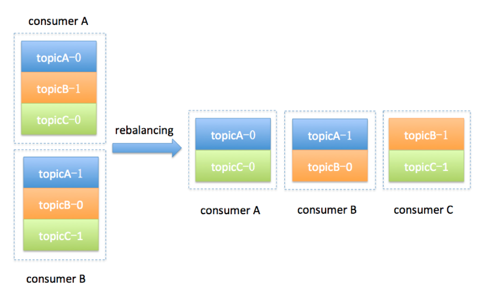

显然，Rebalance 之后的分配依然是公平的，即每个 Consumer 实例都获得了 3 个分区的消费权。这是我们希望出现的情形。

讲完了 Rebalance，现在我来说说它“遭人恨”的地方。

首先，Rebalance 过程对 Consumer Group 消费过程有极大的影响。如果你了解 JVM 的垃圾回收机制，你一定听过万物静止的收集方式，即著名的 stop the world，简称 STW。在 STW 期间，所有应用线程都会停止工作，表现为整个应用程序僵在那边一动不动。Rebalance 过程也和这个类似，在 Rebalance 过程中，所有 Consumer 实例都会停止消费，等待 Rebalance 完成。这是 Rebalance 为人诟病的一个方面。

其次，目前 Rebalance 的设计是所有 Consumer 实例共同参与，全部重新分配所有分区。其实更高效的做法是尽量减少分配方案的变动。例如实例 A 之前负责消费分区 1、2、3，那么 Rebalance 之后，如果可能的话，最好还是让实例 A 继续消费分区 1、2、3，而不是被重新分配其他的分区。这样的话，实例 A 连接这些分区所在 Broker 的 TCP 连接就可以继续用，不用重新创建连接其他 Broker 的 Socket 资源。

## 消费者位移

### 位移主题

_consumer_offsets 在 Kafka 源码中有个更为正式的名字，叫位移主题，即 Offsets Topic。

老版本 Consumer 的位移管理是依托于 Apache ZooKeeper 的，它会自动或手动地将位移数据提交到 ZooKeeper 中保存。当 Consumer 重启后，它能自动从 ZooKeeper 中读取位移数据，从而在上次消费截止的地方继续消费。这种设计使得 Kafka Broker 不需要保存位移数据，减少了 Broker 端需要持有的状态空间，因而有利于实现高伸缩性。但是，ZooKeeper 其实并不适用于这种高频的写操作，因此，Kafka 社区自 0.8.2.x 版本开始，就在酝酿修改这种设计，并最终在新版本 Consumer 中正式推出了全新的位移管理机制，自然也包括这个新的位移主题。

新版本 Consumer 的位移管理机制其实也很简单，就是**将 Consumer 的位移数据作为一条条普通的 Kafka 消息，提交到 __consumer_offsets 中。可以这么说，__consumer_offsets 的主要作用是保存 Kafka 消费者的位移信息。**它要求这个提交过程不仅要实现高持久性，还要支持高频的写操作。显然，Kafka 的主题设计天然就满足这两个条件，因此，使用 Kafka 主题来保存位移这件事情，实际上就是一个水到渠成的想法了。

和你创建的其他主题一样，位移主题就是普通的 Kafka 主题。你可以手动地创建它、修改它，甚至是删除它。只不过，它同时也是一个内部主题，大部分情况下，你其实并不需要“搭理”它，也不用花心思去管理它，把它丢给 Kafka 就完事了。虽说位移主题是一个普通的 Kafka 主题，但它的消息格式却是 Kafka 自己定义的，用户不能修改，也就是说你不能随意地向这个主题写消息，因为一旦你写入的消息不满足 Kafka 规定的格式，那么 Kafka 内部无法成功解析，就会造成 Broker 的崩溃。事实上，Kafka Consumer 有 API 帮你提交位移，也就是向位移主题写消息。你千万不要自己写个 Producer 随意向该主题发送消息。

### 消息格式

当然了，位移主题的消息格式可不是只有这一种。事实上，它有 3 种消息格式。

- 位移主题的 Key 中应该保存 3 部分内容：<Group ID，主题名，分区号 >

  消息体还保存了位移提交的一些其他元数据，诸如时间戳和用户自定义的数据等。保存这些元数据是为了帮助 Kafka 执行各种各样后续的操作，比如删除过期位移消息等。但总体来说，我们还是可以简单地认为消息体就是保存了位移值。

- 用于保存 Consumer Group 信息的消息。

  这种格式非常神秘，以至于你几乎无法在搜索引擎中搜到它的身影。不过，你只需要记住它是用来注册 Consumer Group 的就可以了。

- 用于删除 Group 过期位移甚至是删除 Group 的消息。

  这种格式相对更加有名一些。它有个专属的名字：tombstone 消息，即墓碑消息，也称 delete mark。下次你在 Google 或百度中见到这些词，不用感到惊讶，它们指的是一个东西。这些消息只出现在源码中而不暴露给你。它的主要特点是它的消息体是 null，即空消息体。

  那么，何时会写入这类消息呢？一旦某个 Consumer Group 下的所有 Consumer 实例都停止了，而且它们的位移数据都已被删除时，Kafka 会向位移主题的对应分区写入 tombstone 消息，表明要彻底删除这个 Group 的信息。

### 位移提交方式

Kafka 集群中的第一个 Consumer 程序启动时，Kafka 会自动创建位移主题。我们说过，位移主题就是普通的 Kafka 主题，那么它自然也有对应的分区数。但如果是 Kafka 自动创建的，分区数是怎么设置的呢？这就要看 Broker 端参数 offsets.topic.num.partitions 的取值了。它的默认值是 50，因此 Kafka 会自动创建一个 50 分区的位移主题。

总结一下，如果位移主题是 Kafka 自动创建的，那么该主题的分区数是 50，副本数是 3。

创建位移主题当然是为了用的，那么什么地方会用到位移主题呢？我们前面一直在说 Kafka Consumer 提交位移时会写入该主题，那 Consumer 是怎么提交位移的呢？目前 Kafka Consumer 提交位移的方式有两种：自动提交位移和手动提交位移。

- 自动提交位移（Kafka自己处理）

  Consumer 端有个参数叫 enable.auto.commit，如果值是 true，则 Consumer 在后台默默地为你定期提交位移，提交间隔由一个专属的参数 auto.commit.interval.ms 来控制。自动提交位移有一个显著的优点，就是省事，你不用操心位移提交的事情，就能保证消息消费不会丢失。但这一点同时也是缺点。因为它太省事了，以至于丧失了很大的灵活性和可控性，你完全没法把控 Consumer 端的位移管理。

- 手动提交位移（需要消费者端自行处理）

  事实上，很多与 Kafka 集成的大数据框架都是禁用自动提交位移的，如 Spark、Flink 等。这就引出了另一种位移提交方式：手动提交位移，即设置 enable.auto.commit = false。一旦设置了 false，作为 Consumer 应用开发的你就要承担起位移提交的责任。Kafka Consumer API 为你提供了位移提交的方法，如 consumer.commitSync 等。当调用这些方法时，Kafka 会向位移主题写入相应的消息。

**Kafka如何处理自动提交位移导致的重复消息**

如果你选择的是自动提交位移，那么就可能存在一个问题：只要 Consumer 一直启动着，它就会无限期地向位移主题写入消息。

我们来举个极端一点的例子。假设 Consumer 当前消费到了某个主题的最新一条消息，位移是 100，之后该主题没有任何新消息产生，故 Consumer 无消息可消费了，所以位移永远保持在 100。由于是自动提交位移，位移主题中会不停地写入位移 =100 的消息。显然 Kafka 只需要保留这类消息中的最新一条就可以了，之前的消息都是可以删除的。这就要求 Kafka 必须要有针对位移主题消息特点的消息删除策略，否则这种消息会越来越多，最终撑爆整个磁盘。

Kafka 是怎么删除位移主题中的过期消息的呢？答案就是 Compaction。国内很多文献都将其翻译成压缩，我个人是有一点保留意见的。在英语中，压缩的专有术语是 Compression，它的原理和 Compaction 很不相同，我更倾向于翻译成压实，或干脆采用 JVM 垃圾回收中的术语：整理。

不管怎么翻译，Kafka 使用Compact 策略来删除位移主题中的过期消息，避免该主题无限期膨胀。那么应该如何定义 Compact 策略中的过期呢？对于同一个 Key 的两条消息 M1 和 M2，如果 M1 的发送时间早于 M2，那么 M1 就是过期消息。Compact 的过程就是扫描日志的所有消息，剔除那些过期的消息，然后把剩下的消息整理在一起。我在这里贴一张来自官网的图片，来说明 Compact 过程。

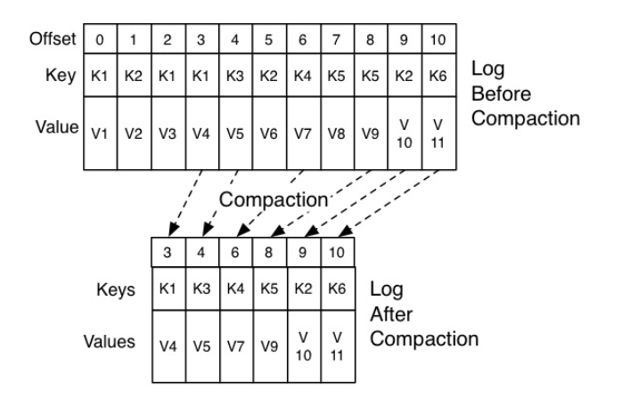

图中位移为 0、2 和 3 的消息的 Key 都是 K1。Compact 之后，分区只需要保存位移为 3 的消息，因为它是最新发送的。

Kafka 提供了专门的后台线程定期地巡检待 Compact 的主题，看看是否存在满足条件的可删除数据。这个后台线程叫 Log Cleaner。很多实际生产环境中都出现过位移主题无限膨胀占用过多磁盘空间的问题，如果你的环境中也有这个问题，我建议你去检查一下 Log Cleaner 线程的状态，通常都是这个线程挂掉了导致的。

### 位移提交

Consumer 端有个位移的概念，它和消息在分区中的位移不是一回事，虽然它们的英文都是 Offset。今天我们要聊的位移时 Consumer 的消费位移，它记录了 Consumer 要消费的下一条消息的位移，而不是目前最新消费消息的位移。

我来举个例子说明一下，假设一个分区中有 10 条消息，位移分别是 0 到 9 。某个 Consumer 应用已经消费了 5 条消息，这就说明该 Consumer 消费了位移为 0 到 4 的 5 条消息，此时 Consumer 的位移是 5 ，指向了下一条消息的位移。

Consumer 需要向 Kafka 汇报自己的位移数据，这个汇报过程被称为提交位移（Committing Offsets）。因为 Consumer 能够同时消费多个分区的数据，所以位移的提交实际上是在分区粒度上进行的，即Consumer 需要为分配给它的每个分区提交各自的位移数据。

提交位移主要是为了表征 Consumer 的消费进度，这样当 Consumer 发生故障重启之后，就能够从 Kafka 中读取之前提交的位移值，然后从相应的位移处继续消费，从而避免整个消费过程重来一遍。换句话说，位移提交是 Kafka 提供给你的一个工具或语义保障，你负责维持这个语义保障，即如果你提交了位移 X ，那么 Kafka 会认为所有位移值小于 X 的消息你都已经成功消费了。

这一点特别关键，因为位移提价非常灵活，你完全可以提交任何位移值，但由此产生的后果你也要一并承担。假设你的 Consumer 消费了 10 条消息，你提交的位移值却是 20，那么从理论上讲，位移介于 11~19 之间的消息就有可能被重复消费。所以，**位移提交的语义保障是由你来负责的，Kafka只会“无脑”地接受你提交的位移。**你对位移提交的管理直接影响了你的 Consumer 所能提供的消息语义保障。

鉴于位移提交甚至是位移管理对 Consumer 端的巨大影响，Kafka，特别是 KafkaConsumer API，提供了多种提交位移的方法。`从用户的角度来说，位移提交分为自动提交和手动提交；从 Consumer 端的角度来说，位移提交分为同步提交和异步提交。`

自动提交和手动提交
我们先来说说自动提交和手动提交。所谓自动提交，就是指 Kafka Consumer 在后台默默地为你提交位移，作为用户的你完全不必操心这些事；而手动提交，则是指你要自己提交位移，Kafka Consumer 压根不管。

#### 自动提交

开启自动提交位移的方法很简单，Consumer 端有个参数 EnableAutoCommit，把它设置为 true 或者压根不设置它就可以，因为默认值就是为 true。如果启动了自动提交，Consumer 端还有个参数就派上用场了：auto.commit.interval.ms。它的默认值是 5 秒，表示 Kafka 每 5 秒会自动为你提交一次位移。具体配置如下：

```C#
        public static void Run(string server, string topic)
        {
            string groupID = "consumer.group.hello1";
            var conif = new ConsumerConfig()
            {
                BootstrapServers = server,
                GroupId = groupID,
                AutoOffsetReset = AutoOffsetReset.Earliest,
                EnableAutoCommit = true,//是否启动自动提交
                AutoCommitIntervalMs = 1000,//自动提交的间隔时间
            };
            var consumer = new ConsumerBuilder<Ignore, string>(conif).Build();
            consumer.Subscribe(topic);
            Console.WriteLine("等待消息");
            while (true)
            {
                var consumeResult = consumer.Consume();
                Console.WriteLine($"收到消息：[{consumeResult.Message.Value}] 来自 [{consumeResult.TopicPartitionOffset}]");

            }
        }
```


#### 手动提交

和自动提交相反的，就是手动提交了。开启手动提交位移的方法就是设置 EnableAutoCommit 为 false。但是，仅仅设置它为 false 还不够，因为你只是告诉 Kafka Consumer 不要自动提交位移而已，你还需要调用相应的 API 手动提交位移。

最简单的 API 就是 KafkaConsumer#Commit()。该方法会提交 KafkaConsumer#poll()返回的最新位移。从名字上来看，它是一个同步操作，该方法会一直等待，直到位移被成功提交才返回。代码如下：

```C#
```

可见，调用 consumer.Commit() 方法的时机，是在你处理完 Consume() 方法返回的所有消息之后。如果你过早地提交了位移，就可能出现消费数据丢失的情况。

#### 数据丢失问题

那么你可能会问，自动提交位移就不会出现消费数据丢失的情况了吗？它能恰到好处地把握时机进行位移提交吗？为了搞清楚这个问题，我们必须要深入地了解一下自动提交位移的顺序。

一旦设置了EnableAutoCommit  为 true，Kafka 会保证在开始调用 Consume() 方法时，提交上一次 Consume返回的所有消息。从顺序上来说， Consume() 方法的逻辑是先提交上一批消息的位移，再处理下一批消息，因此自动提交位移能保证不出现消费丢失的情况，但有可能出现重复消费。（隔一段时间，如5s 提交一次位移，消费完消息后，宕机或其他原因导致位移没有自动提交，下次仍然会消费到这批数据）

在默认情况下，Consumer 每 5 秒自动提交一次位移。现在，我们假设自动提交位移之后的 3 秒发生了 Rebalance 操作（这3秒内还在消费消息，但没提交）。在 Rebalance 之后，所有 Consumer 从上一次提交的位移处继续消费，但该位移已经是 3 秒前的位移数据了，故在 Rebalance 发生前 3 秒消费的所有数据都要重新再消费一次。虽然你能够通过减少AutoCommitIntervalMs 的值来提高提交频率，但这么做只能缩小重复消费的时间窗口，不可能完全消除它。这是自动提交机制的一个缺陷。

反观手动提交位移，它的好处就在于更加灵活，你完全能够把控位移提交的时机和频率。但是，它也有一个缺陷，就是在调用 commit() 时，Consumer 程序会处于阻塞状态，直到远端的 Broker 返回提交结果，这个状态才会结束。在任何系统中，因为程序而非资源限制而导致的阻塞都可能是系统的瓶颈，会影响整个应用程序的 TPS。当然，你可以选择拉长提交间隔，但这样做的后果是 Consumer 的提交频率下降，在下次 Consumer 重启回来后，会有更多的消息被重新消费。

## 手动指定消费位移

手动指定消费位移可从位移和时间两个维度来配置，具体配置如下：


**相关接口**

Commited()可以获取所有分区的消费者位移

Seek（消费者的seek方法）和Assign（分区分配）是Kafka消费者的两种不同的操作。

1. Seek：Seek是消费者的方法之一，用于手动指定消费者从指定的偏移量开始消费消息。通过调用`consumer.seek()`方法，您可以指定消费者从特定的偏移量开始消费消息。这个方法通常用于重置消费者的位置，重新处理之前的消息，或从指定的位置开始消费。
2. Assign：Assign是另一种操作，用于手动分配特定的分区给消费者。通过调用`consumer.assign()`方法，您可以手动分配特定的分区给消费者。这种方式通常用于精确控制消费者消费的分区，而不是使用消费者组协调进行分区分配。

需要注意的是，使用Seek方法手动指定位移时，只有指定的分区会受到影响，其他分区的位移不会改变。而使用Assign方法手动分配特定的分区时，消费者将只消费被分配的分区，而不会考虑消费者组的协调和分区分配。

**相关示例**

```C#
    public class ResetOffset
    {
        public static void Run()
        {
            var config = new ConsumerConfig
            {
                BootstrapServers = "192.168.2.13:9092",
                GroupId = "consumer.group.hello",
                AutoOffsetReset = AutoOffsetReset.Earliest,
                PartitionAssignmentStrategy = PartitionAssignmentStrategy.CooperativeSticky
            };

            using var consumer = new ConsumerBuilder<Ignore, string>(config).Build();

            //位移维度：Assign
            // var topicPartition = new TopicPartition("sample", new Partition(0)); 
            // var tpOffset = new TopicPartitionOffset(topicPartition, new Offset(0));
            // consumer.Assign(tpOffset);

            //时间维度：DateTime
            var timestamp = new Timestamp(DateTime.Now.AddMinutes(-30));
            var dateTimeOffset = new TopicPartitionTimestamp(new TopicPartition("sample", new Partition(0)), timestamp);
            //var tpos = consumer.OffsetsForTimes(new[] { dateTimeOffset }, TimeSpan.FromSeconds(0));
            //consumer.Assign(tpos);

            //时间维度：Duration
            // var timestamp = new Timestamp(new DateTime(2023, 11, 1));
            // var dateTimeOffset = new TopicPartitionTimestamp(new TopicPartition("sample", new Partition(0)), timestamp);
            var tpos = consumer.OffsetsForTimes(new[] { dateTimeOffset }, TimeSpan.FromSeconds(5));
            consumer.Assign(tpos);

            //subscribe() 和 assign() 两个方法的使用是互斥的，只能使用其中之一
            //consumer.Subscribe("sample");

            Console.WriteLine("等待消息……");
            while (true)
            {
                var consumeResult = consumer.Consume();

                //位移维度：Seek
                // var offsets = consumer.Committed(TimeSpan.FromSeconds(5));                //
                // consumer.Seek(new TopicPartitionOffset(consumeResult.TopicPartition, new Offset(offsets[0].Offset - 2)));                //
                // consumer.Seek(new TopicPartitionOffset(consumeResult.TopicPartition, new Offset(offsets[0].Offset)));                //
                // consumer.Seek(new TopicPartitionOffset(consumeResult.TopicPartition,Offset.Beginning));

                Console.WriteLine($"收到消息：[{consumeResult.Message.Value}] 来自 [{consumeResult.TopicPartitionOffset}]");
            }
        }
    }
```

## 分区分配策略

消费者以消费者组的名义订阅主题，主题有多个分区，消费者组中有多个消费者实例，同一时刻，一条消息只能被消费者组中的某一个一个消费者实例消费。

  1）如果分区数大于或者等于组中的消费者实例数，一个消费者会负责多个分区。

  2）如果分区数小于组中的消费者实例数，有些消费者将处于空闲状态并且无法接收消息。


分区分配策略：Range 、 RoundRobin、CooperativeSticky。当以下事件发生时，Kafka 将会进行一次分区分配：

- 同一个 consumer 消费者组 group.id 中，新增了消费者进来，会执行 Rebalance 操作
- 消费者离开当期所属的 consumer group组。比如 主动停机  或者  宕机
- 分区数量发生变化时(即 topic 的分区数量发生变化时)
- 消费者主动取消订阅

将分区的所有权从一个消费者移到另一个消费者称为重新平衡（rebalance），如何rebalance就涉及到本文提到的分区分配策略。

下面我们将详细介绍 Kafka 内置的三种分区分配策略。

### 范围策略

**策略**

特点：针对一个分区做排序后计算。

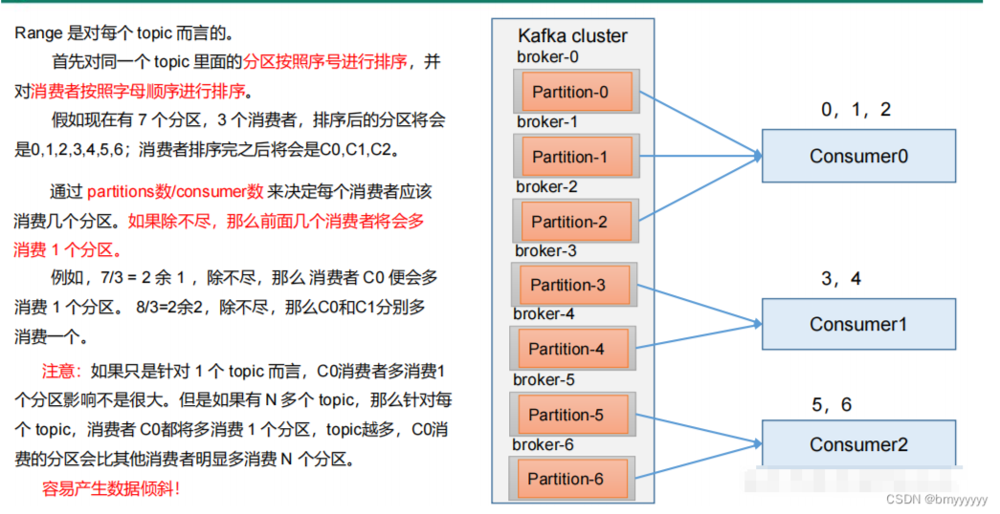

**Range 分区分配再平衡案例**

- 停止掉 0 号消费者，快速重新发送消息观看结果（45s 以内，越快越好）

  - 1 号消费者：消费到 3、4 号分区数据。
  - 2 号消费者：消费到 5、6 号分区数据。
  - 0 号消费者的任务会整体被分配到 1 号消费者或者 2 号消费者。

  说明：0 号消费者挂掉后，消费者组需要按照超时时间 45s 来判断它是否退出，所以需要等待，时间到了 45s 后，判断它真的退出就会把任务分配给其他 broker 执行。

- 再次重新发送消息观看结果（45s 以后）

  - 1 号消费者：消费到 0、1、2、3 号分区数据。
  - 2 号消费者：消费到 4、5、6 号分区数据。

  说明：消费者 0 已经被踢出消费者组，所以重新按照 range 方式分配。

**示例**

生产者代码：

```C#
        static async Task Main(string[] args)
        {
            string topic = "my.topic.range.sticky2";
            string server = "192.168.1.102:9192";
            //主题不存在时需要先创建主题
            //如果主题已存在，则注释改行即可
            //await KafkaHelper.Instance.CreateTopic(server, topic, 7);
            await PartitionPolicyDemo.RoundRobin(server, topic);
            Console.WriteLine($"当前主题的分区数为：{KafkaHelper.Instance.GetPartitionCount(server, topic)}");
            Console.ReadLine();
        }
        public static async Task CreateTopic()
        {
            var config = new AdminClientConfig
            {
                BootstrapServers = "192.168.1.102:9292"
            };

            using var adminClient = new AdminClientBuilder(config).Build();

            var topicName = "my.topic";
            var partitions = 2;

            var topicSpecification = new TopicSpecification
            {
                Name = topicName,
                NumPartitions = 2
            };

            await adminClient.CreateTopicsAsync(new[] { topicSpecification });

            Console.WriteLine($"主题 [{topicName}] 分区数量[{partitions}] 创建成功");
        }
```

> 生产者轮询生成消息RoundRobin（）参考《发布订阅模型》中的生产者代码


消费者代码：

```C#
    public class PartitionAssignmentStrategyDemo
    {
        public static void Run(string server, string topic)
        {
            string groupID = "consumer.group.sticky2";
            var conif = new ConsumerConfig()
            {
                BootstrapServers = server,
                GroupId = groupID,
                AutoOffsetReset = AutoOffsetReset.Earliest,
                PartitionAssignmentStrategy = PartitionAssignmentStrategy.CooperativeSticky//消费者分区分配策略
            };
            var consumer = new ConsumerBuilder<Ignore, string>(conif).Build();
            consumer.Subscribe(topic);
            Console.WriteLine("等待消息");
            while (true)
            {
                var consumeResult = consumer.Consume();
                Console.WriteLine($"收到消息：[{consumeResult.Message.Value}] 来自 [{consumeResult.TopicPartitionOffset}]");
            }
        }
    }
```


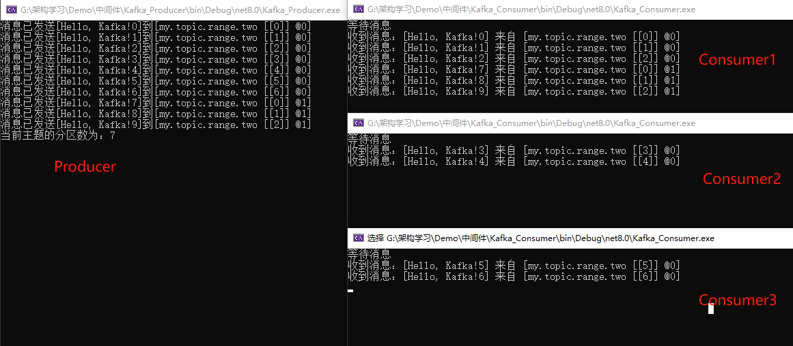

 Consuerm1下线后，再次重新发送消息观看结果（45s 以后）：

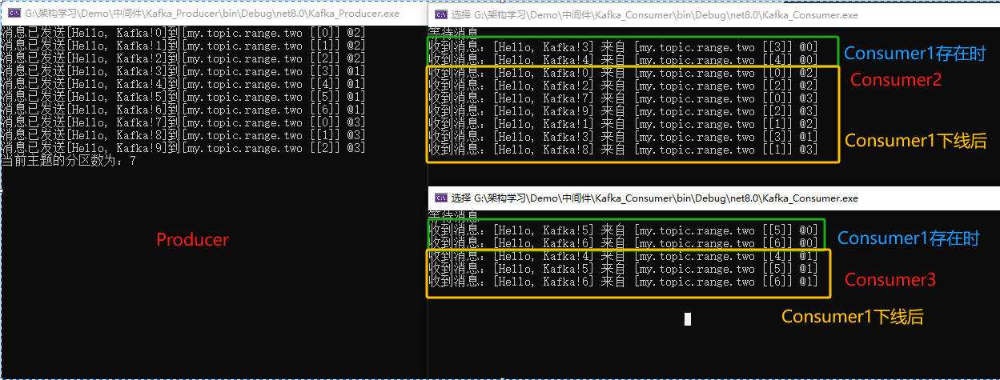

### 轮询策略

策略

特点：针对所有分区做排序后轮询。


**RoundRobin 分区分配再平衡案例**

- 停止掉 1 号消费者，快速重新发送消息观看结果（45s 以内，越快越好）

  - 3 号消费者：消费到 2、5 号分区数据
  - 2 号消费者：消费到 4、1 号分区数据
  - 1 号消费者的任务会按照 RoundRobin 的方式，把数据轮询分成 0 、6 和 3 号分区数据，分别由 2 号消费者或者 3 号消费者消费。

  说明：0 号消费者挂掉后，消费者组需要按照超时时间 45s 来判断它是否退出，所以需要等待，时间到了 45s 后，判断它真的退出就会把任务分配给其他 broker 执行。

- 再次重新发送消息观看结果（45s 以后）

  - 2 号消费者：消费到 0、2、4、6 号分区数据
  - 3 号消费者：消费到 1、3、5 号分区数据

  说明：消费者 0 已经被踢出消费者组，所以重新按照 RoundRobin 方式分配。

**示例**

代码与"范围策略"一致，只需修改消费者分区分配策略即可

```C#
PartitionAssignmentStrategy = PartitionAssignmentStrategy.RoundRobin
```

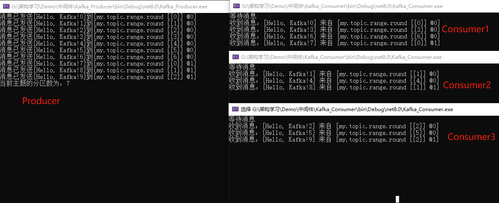

 Consuerm1下线后，再次重新发送消息观看结果（45s 以后）：

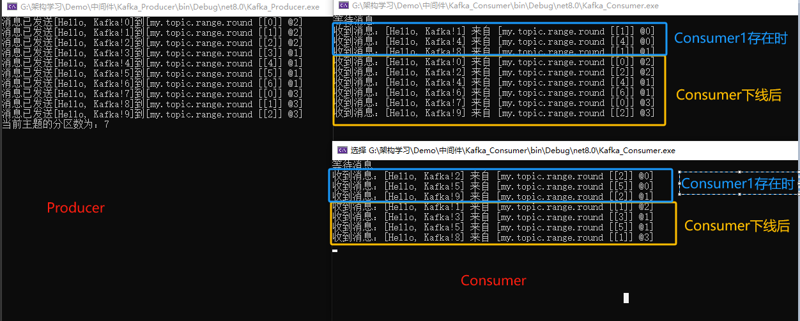

### 粘性策略

**策略**

特点：尽量均匀随机的分配。

粘性分区定义：可以理解为分配的结果带有“粘性的”。即在执行一次新的分配之前，考虑上一次分配的结果，尽量少的调整分配的变动，可以节省大量的开销。

粘性分区是 Kafka 从 0.11.x 版本开始引入这种分配策略，`首先会尽量均衡的放置分区到消费者上面，在出现同一消费者组内消费者出现问题的时候，会尽量保持原有分配的分区不变化`。

**Sticky 分区分配再平衡案例**

- 停止掉 0 号消费者，快速重新发送消息观看结果（45s 以内，越快越好）

  - 1 号消费者：消费到 2、3、5 号分区数据。
  - 2 号消费者：消费到 4、6 号分区数据。
  - 0 号消费者的任务会按照粘性规则，尽可能均衡的随机分成 0 和 1 号分区数据，分别由 1 号消费者或者 2 号消费者消费。

  说明：0 号消费者挂掉后，消费者组需要按照超时时间 45s 来判断它是否退出，所以需要等待，时间到了 45s 后，判断它真的退出就会把任务分配给其他 broker 执行。

- 再次重新发送消息观看结果（45s 以后）。

  - 1 号消费者：消费到 2、3、5 号分区数据。

  - 2 号消费者：消费到 0、1、4、6 号分区数据。
  
  说明：消费者 0 已经被踢出消费者组，所以重新按照粘性方式分配。

**示例**

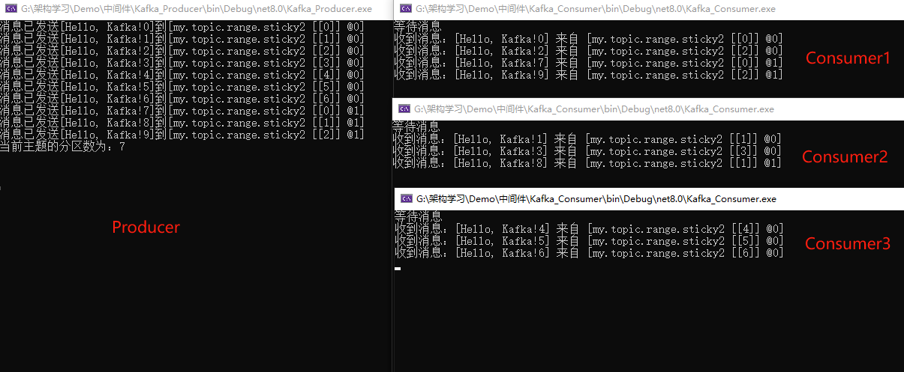

 Consuerm1下线后，再次重新发送消息观看结果（45s 以后）：

> 不太明白粘性策略一开始时如何分配分区？？，只知道当有消费者下线后，会根据**尽量少的调整分配的变动**来分配分区

## 副本备份机制

### 备份机制

备份机制，通常是指分布式系统在多台网络互联的机器上保存有相同的数据拷贝。副本机制在分布式系统下有以下好处：

- 提供数据冗余。即使系统部分组件失效，系统依然能够继续运转，因而增加了整体可用性以及数据持久性。
- 提供高伸缩性。支持横向扩展，能够通过增加机器的方式来提升读性能，进而提高读操作吞吐量。
- 改善数据局部性。允许将数据放入与用户地理位置相近的地方，从而降低系统延时。

这些优点都是在分布式系统中最常被提及的，但是有些遗憾的是，对于 Apache Kafka 而言，目前只能享受到副本机制带来的第 1 个好处，也就是提供数据冗余实现高可用性和高持久性。

不过即便如此，副本机制依然是 Kafka 设计架构的核心所在，它也是 Kafka 确保系统高可用和消息高持久性的重要基石。

### 副本定义

Kafka 是有主题概念的，而每个主题又进一步划分成若干个分区。副本的概念其实是在分区层级下定义的，每个分区配置有若干个副本。

所谓副本（Replica），本质就是一个只能追加写消息的提交日志。根据 Kafka 副本机制的定义，同一个分区下的所有副本保存有相同的消息序列，这些副本分散保存在不同的 Broker 上，从而能对抗部分 Broker 宕机带来的数据不可用。

在实际生产环境中，每台 Broker 都可能保存有各个主题下不同分区的不同副本，因此，单个 Broker 上存有成百上千个副本的现象是非常正常的。

接下来我们来看一张图，它展示的是一个有 3 台 Broker 的 Kafka 集群上的副本分布情况。从这张图中，我们可以看到，主题 1 分区 0 的 3 个副本分散在 3 台 Broker 上，其他主题分区的副本也都散落在不同的 Broker 上，从而实现数据冗余。

### 副本角色

既然分区下能够配置多个副本，而且这些副本的内容还要一致，那么很自然的一个问题就是：我们该如何确保副本中所有的数据都是一致的呢？特别是对 Kafka 而言，当生产者发送消息到某个主题后，消息是如何同步到对应的所有副本中的呢？针对这个问题，最常见的解决方案就是采用基于领导者（Leader-based）的副本机制。Apache Kafka 就是这样的设计。

基于领导者的副本机制的工作原理如下图所示，我来简单解释一下这张图里面的内容。

- 在 Kafka 中，副本分为两类：**领导者副本（Leader Replica）和 追随者副本（Follower Replica）。**每个分区在创建时都要选举一个副本成为领导者副本，其余的副本自动成为追随者副本。

- Kafka 的副本机制跟其他分布式系统不太一样。在 Kafka 中，追随者副本是不对外提供服务的。

  *也就是说，任何一个追随者副本都不能响应消费者和生产者的读写请求。所有的请求必须有领导者副本来处理，或者说，所有的读写请求都必须发往领导者副本所在的 Broker ，由该 Broker 负责处理。追随者副本不处理客户端请求，它唯一的任务就是从领导者副本异步拉取消息，并写到自己的提交日志中，从而实现与领导者副本的同步。*

- 当领导者副本挂掉或者领导者副本所在的 Broker 宕机时，Kafka 依托于 Zookeeper 提供的监控功能能够实时感知到，并开始新的一轮领导者选举，从追随者副本中选出一个新的领导者。来 Leader 副本重启回来后，只能作为追随者副本加入到集群中。

> 如果领导者宕机了，有不一部分消息还没来得及同步到追随者副本，那么这些消息将丢失，要保证这些消息不丢失，可以在生产者端配置 acks=all 来确保

### Kafka副本的设计

#### Kafka副本设计的好处

对于客户端用户而言，Kafka 的追随者副本没有任何作用，它既不能像 MySQL 那样帮助领导者副本“抗读”，也不能实现将某些副本放到离客户端近的地方来改善数据局部性。

既然如此，Kafka 为什么要这样设计呢？其实这种副本机制有两个方面的好处。

- **方便实现“Read-your-writes”**

  所谓 Read-your-writes，顾名思义就是，当你使用生产者 API 向 Kafka 成功写入消息后，马上使用消费者 API 去读取刚才生产的消息。

  举个例子，比如你平时发微博时，你发完一条微博，肯定是希望能立即看到的，这就是典型的 Read-your-writes 场景。如果允许追随者副本对外提供服务，由于副本同步是异步的，因此有可能出现追随者副本还没有从领导者副本那里拉取到最新的消息，从而使得客户端看不到最新写入的消息

- **方便实现单调读（Monotonic Reads）**
  什么是单调读呢？就是对于一个消费者用户而言，在多次消费消息时，它不会看到某条消息一会儿存在一会儿不存在。

  如果允许追随者副本提供读服务，那么假设当前有 2 个追随者副本 F1 和 F2，它们异步地拉取领导者副本数据。倘若 F1 拉取了 Leader 的最新消息而 F2 还未及时拉取，那么，此时如果有一个消费者先从 F1 读取消息之后又从 F2 拉取消息，它可能会看到这样的现象：第一次消费时看到的最新消息在第二次消费时不见了，这就不是单调读一致性。但是，如果所有的读请求都是由 Leader 来处理，那么 Kafka 就很容易实现单调读一致性。

#### ISR

In-sync Replicas（ISR）
追随者副本不提供服务，只是定期地异步拉取领导者副本中的数据而已。既然是异步的，就存在着不可能与 Leader 实时同步的风险。在探讨如何正确应对这种风险之前，我们必须要精确地知道同步的含义是什么。或者说，Kafka 要明确地告诉我们，追随者副本到底在什么条件下才算与 Leader 同步。

基于这个想法，Kafka 引入了 In-sync Replicas，也就是所谓的 ISR 副本集合。ISR 中的副本都是与 Leader 同步的副本，相反，不在 ISR 中的追随者副本就被认为是与 Leader 不同步的。那么，到底什么副本能够进入到 ISR 中呢？

我们首先要明确的是，Leader 副本天然就在 ISR 中。也就是说，ISR 不只是追随者副本集合，它必然包括 Leader 副本。甚至在某些情况下，ISR 只有 Leader 这一个副本。另外，能够进入到 ISR 的追随者副本要满足一定的条件。


图中有 3 个副本：1 个领导者副本和 2 个追随者副本。Leader 副本当前写入了 10 条消息，Follower1 副本同步了其中的 6 条消息，而 Follower2 副本只同步了其中的 3 条消息。现在，请你思考一下，对于这 2 个追随者副本，你觉得哪个追随者副本与 Leader 不同步？

答案是，要根据具体情况来定。换成英文，就是那句著名的“It depends”。看上去好像 Follower2 的消息数比 Leader 少了很多，它是最有可能与 Leader 不同步的。的确是这样的，但仅仅是可能。

事实上，这张图中的 2 个 Follower 副本都有可能与 Leader 不同步，但也都有可能与 Leader 同步。也就是说，Kafka 判断 Follower 是否与 Leader 同步的标准，不是看相差的消息数，而是另有“玄机”。

**这个标准就是 Broker 端参数 replica.lag.time.max.ms 参数值**。这个参数的含义是 Follower 副本能够落后 Leader 副本的最长时间间隔，当前默认值是 10 秒。这就是说，只要一个 Follower 副本落后 Leader 副本的时间不连续超过 10 秒，那么 Kafka 就认为该 Follower 副本与 Leader 是同步的，即使此时 Follower 副本中保存的消息明显少于 Leader 副本中的消息。

我们在前面说过，Follower 副本唯一的工作就是不断地从 Leader 副本拉取消息，然后写入到自己的提交日志中。如果这个同步过程的速度持续慢于 Leader 副本的消息写入速度，那么在 replica.lag.time.max.ms 时间后，此 Follower 副本就会被认为是与 Leader 副本不同步的，因此不能再放入 ISR 中。此时，Kafka 会自动收缩 ISR 集合，将该副本“踢出”ISR。

值得注意的是，倘若该副本后面慢慢地追上了 Leader 的进度，那么它是能够重新被加回 ISR 的。这也表明，ISR 是一个动态调整的集合，而非静态不变的。

#### Unclean 领导者选举

既然 ISR 是可以动态调整的，那么自然就可以出现这样的情形：ISR 为空。因为 Leader 副本天然就在 ISR 中，如果 ISR 为空了，就说明 Leader 副本也“挂掉”了，Kafka 需要重新选举一个新的 Leader。可是 ISR 是空，此时该怎么选举新 Leader 呢？

Kafka 把所有不在 ISR 中的存活副本都称为非同步副本。通常来说，非同步副本落后 Leader 太多，因此，如果选择这些副本作为新 Leader，就可能出现数据的丢失。毕竟，这些副本中保存的消息远远落后于老 Leader 中的消息。在 Kafka 中，选举这种副本的过程称为 Unclean 领导者选举。Broker 端参数 unclean.leader.election.enable 控制是否允许 Unclean 领导者选举。

开启 Unclean 领导者选举可能会造成数据丢失，但好处是，它使得分区 Leader 副本一直存在，不至于停止对外提供服务，因此提升了高可用性。反之，禁止 Unclean 领导者选举的好处在于维护了数据的一致性，避免了消息领导者选举丢失，但牺牲了高可用性。

如果你听说过 CAP 理论的话，你一定知道，一个分布式系统通常只能同时满足一致性（Consistency）、可用性（Availability）、分区容错性（Partition tolerance）中的两个。显然，在这个问题上，Kafka 赋予你选择 C 或 A 的权利。

## 集群架构模式

### 集群中的节点类型

一个Kafka集群是由下列几种类型的节点构成的，它们充当着不同的作用：

- Broker节点：即代理节点，是Kafka中的工作节点，充当消息队列的角色，负责储存和处理消息，每个Broker都是一个独立的Kafka服务器，可以在不同的机器上运行，除此之外Broker还负责分区（partition）的管理，将主题（topic）划分为多个分区，并分布在集群的不同Broker上
- Controller节点：即控制器节点，是集群中的特殊节点，负责储存和管理整个集群元数据和状态，它能够监控整个集群中的Broker，在需要时还能够进行平衡操作
- 混合节点：即同时担任Broker和Controller节点角色的节点

### 两种部署模式

#### 简介

Kafka有两种部署模式：Zookeeper模式集群、KRaft模式集群。

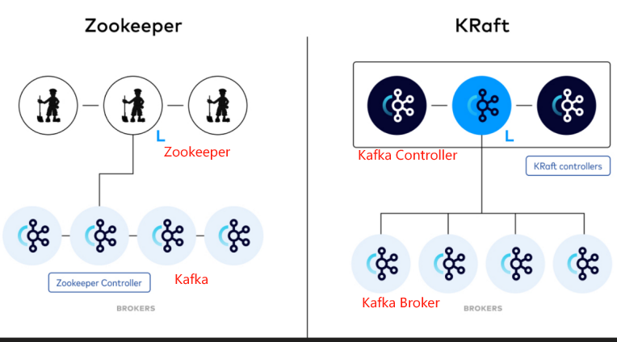

在Kafka2.8之前，Kafka强依赖zookeeper来来负责集群元数据的管理，这也导致当Zookeeper集群性能发生抖动时，Kafka的性能也会收到很大的影响。2.8版本之后，kafka3.x开始提供KRaft（Kafka Raft，依赖Java 8+ ）模式，开始去除对zookeeper的依赖。最新的3.5版本中，Kafka依然兼容zookeeper Controller，但Kafka Raft元数据模式，已经可以在不依赖zookeeper的情况下独立启动Kafka了。
**KRaft的优势**

- 更简单的部署和管理——通过只安装和管理一个应用程序，Kafka 现在的运营足迹要小得多。这也使得在边缘的小型设备中更容易利用 Kafka；
- 提高可扩展性——KRaft 的恢复时间比 ZooKeeper 快一个数量级。这使我们能够有效地扩展到单个集群中的数百万个分区。ZooKeeper 的有效限制是数万；
- 更有效的元数据传播——基于日志、事件驱动的元数据传播可以提高 Kafka 的许多核心功能的性能。另外它还支持元数据主题的快照。

#### Zookeeper模式集群

这是一种比较简单，相对“传统”的搭建方式了！在这种模式下，每个Kafka节点都是依赖于Zookeeper的，使用Zookeeper存储集群中所有节点的元数据。

只要所有的Kafka节点连接到同一个Zookeeper上面（或者同一个Zookeeper集群），这些Kafka节点就构成了一个集群。所以说就算是只有一个Kafka节点在运行，这一个节点也可以称作一个集群。

在Zookeeper模式集群中，Zookeeper节点（或者集群）就充当了Controller的角色，而所有的Kafka节点就充当着Broker的角色。

下面就来介绍一下搭建过程，这里在1台主机上分别运行Zookeeper和Kafka来模拟一个集群，一共三个个Zookeeper节点和三个Kafka节点构成，如下：

docker-compose.yml

```yml
version: "3"

services:
  zoo1:
    image: zookeeper:3.9
    restart: always
    hostname: zoo1
    container_name: zoo1
    ports:
    - 12181:2181
    volumes:
    - "/clay/volume/zkcluster/zoo1/data:/data"
    - "/clay/volume/zkcluster/zoo1/datalog:/datalog"
    environment:
      ZOO_MY_ID: 1
      ZOO_SERVERS: server.1=zoo1:2888:3888 server.2=zoo2:2888:3888 server.3=zoo3:2888:3888
      
  zoo2:
    image: zookeeper:3.9
    restart: always
    hostname: zoo2
    container_name: zoo2
    ports:
    - 22181:2181
    volumes:
    - "/clay/volume/zkcluster/zoo2/data:/data"
    - "/clay/volume/zkcluster/zoo2/datalog:/datalog"
    environment:
      ZOO_MY_ID: 1
      ZOO_SERVERS: server.1=zoo1:2888:3888 server.2=zoo2:2888:3888 server.3=zoo3:2888:3888
      
  zoo3:
    image: zookeeper:3.9
    restart: always
    hostname: zoo3
    container_name: zoo3
    ports:
    - 32181:2181
    volumes:
    - "/clay/volume/zkcluster/zoo3/data:/data"
    - "/clay/volume/zkcluster/zoo3/datalog:/datalog"
    environment:
      ZOO_MY_ID: 1
      ZOO_SERVERS: server.1=zoo1:2888:3888 server.2=zoo2:2888:3888 server.3=zoo3:2888:3888

  kafka1:
    image: bitnami/kafka:3.6
    container_name: kafka1
    ports:
      - "19092:9092"
    environment:
      - KAFKA_CFG_ZOOKEEPER_CONNECT=zoo1:2181,zoo2:2181,zoo3:2181
      - KAFKA_CFG_LISTENERS=PLAINTEXT://:9092,CONTROLLER://:9093
      - KAFKA_CFG_LISTENER_SECURITY_PROTOCOL_MAP=CONTROLLER:PLAINTEXT,PLAINTEXT:PLAINTEXT
      - KAFKA_CFG_ADVERTISED_LISTENERS=PLAINTEXT://192.168.2.13:19092
     
    restart: always
    depends_on:
      - zoo1
      - zoo2
      - zoo3
          
  kafka2:
    image: bitnami/kafka:3.6
    container_name: kafka2
    ports:
      - "29092:9092"
    environment:
      - KAFKA_CFG_ZOOKEEPER_CONNECT=zoo1:2181,zoo2:2181,zoo3:2181
      - KAFKA_CFG_LISTENERS=PLAINTEXT://:9092,CONTROLLER://:9093
      - KAFKA_CFG_LISTENER_SECURITY_PROTOCOL_MAP=CONTROLLER:PLAINTEXT,PLAINTEXT:PLAINTEXT
      - KAFKA_CFG_ADVERTISED_LISTENERS=PLAINTEXT://192.168.2.13:29092
    restart: always
    depends_on:
      - zoo1
      - zoo2
      - zoo3

  kafka3:
    image: bitnami/kafka:3.6
    container_name: kafka3
    ports:
      - "39092:9092"
    environment:
      - KAFKA_CFG_ZOOKEEPER_CONNECT=zoo1:2181,zoo2:2181,zoo3:2181
      - KAFKA_CFG_LISTENERS=PLAINTEXT://:9092,CONTROLLER://:9093
      - KAFKA_CFG_LISTENER_SECURITY_PROTOCOL_MAP=CONTROLLER:PLAINTEXT,PLAINTEXT:PLAINTEXT
      - KAFKA_CFG_ADVERTISED_LISTENERS=PLAINTEXT://192.168.2.13:39092
    restart: always
    depends_on:
      - zoo1
      - zoo2
      - zoo3

  kafka-ui:
    image: provectuslabs/kafka-ui:master
    container_name: kafka-ui
    ports:
      - "8080:8080"
    restart: always
    environment:
      - KAFKA_CLUSTERS_0_NAME=local  # kafka 集群名称
      - KAFKA_CLUSTERS_0_BOOTSTRAPSERVERS=kafka1:9092,kafka2:9092,kafka3:9092  # kafka集群地址
      - KAFKA_MANAGER_ZK_HOSTS=zoo1:2181,zoo2:2181,zoo3:2181  # zookeeper集群地址
      - DYNAMIC_CONFIG_ENABLED= 'true'  # 启动动态配置 kafka
      - AUTH_TYPE=LOGIN_FORM   # 启用登录授权
      - SPRING_SECURITY_USER_NAME=admin   # 账号
      - SPRING_SECURITY_USER_PASSWORD=admin # 密码
    depends_on:
      - kafka1
      - kafka2
      - kafka3
```

> 生产环境中Zookeeper也需要部署为集群模式

#### KRaft模式集群

在上述传统方案中，Kafka需要依赖Zookeeper完成元数据存放和共享，这样也就暴露出了一些问题：

- 搭建Kafka集群时还需要额外搭建Zookeeper，增加了运维成本
- Zookeeper是强一致性的组件（符合CP理论），如果集群中数据发生变化，那么必须要等到其它节点都同步，至少超过一半同步完成，这样节点数多性能差

KRaft模式是新版本Kafka中推出的集群模式，这种模式下就完全不需要Zookeeper了！只需要数个Kafka节点就可以直接构成集群，在这时集群中的Kafka节点既有可能是Controller节点也可能是Broker节点，在这个模式中，我们不仅可以手动配置某个节点的角色（是Controller还是Broker），还可以使其同时担任Broker和Controller角色（混合节点）。

在KRaft模式中，集群的节点会通过投票选举的方式，选择出一个主要的Controller节点，这个节点也称作领导者，它将负责维护整个集群的元数据和状态信息，那么其它的Controller节点或者混合节点就称之为追随者，它们会从领导者同步集群元数据和状态信息。如果领导者宕机了，所有的节点会重新投票选举一个新的领导者。

在选举过程中，所有的节点都会参与投票过程，而候选节点只会是Controller节点或者混合节点（即Broker节点不会被选举为领导者）。

需要注意的是，在默认情况下Kafka集群中的Broker节点和Controller节点通常会监听不同的端口：

- Broker节点是Kafka集群中的数据节点（消息队列），它们负责接收客户端的消息和传递消息给客户端，默认情况下，每个Broker节点会监听9092端口，该端口用于与客户端进行通信，客户端可以将消息发送到这个端口，或者从这个端口接收消息，这个端口可以称作客户端通信端口
- Controller节点是Kafka集群中的控制器节点，负责管理集群的状态和元数据，Controller节点监听的端口通常是9093，该端口用于集群中其他节点获取元数据或在混合节点选举新的Controller时进行通信，通过该端口，其他节点可以与Controller节点交互，获取集群的元数据信息或参与控制器的选举过程，这个端口可以称作控制器端口
- 混合节点（即同时担任Broker和Controller角色的节点）中，这两个端口都会被使用，默认情况下混合节点将监听9092端口接收和传递消息给客户端，并监听9093端口用于与其他节点进行元数据交换和控制器选举通信，可见混合节点会同时使用两个端口分别作为客户端通信端口与控制器端口

所以需要根据实际情况配置网络设置和防火墙规则，以确保Kafka集群中的节点能够在正确的端口上进行通信。上述提到的两种端口也是可以修改的，当然不建议修改。

同样地，就算是你只是搭建了一个Kafka节点，这一个节点也仍然被视为一个Kafka集群，并且KRaft模式下如果只需要建立一个节点，那么这个节点必须是混合节点。

单台主机模拟搭建三个Kafka节点构成的KRaft模式集群如下：

| 节点名     | 地址      | 节点类型 | 客户端通信端口 | 控制器端口 |
| ---------- | --------- | -------- | -------------- | ---------- |
| Kafka节点1 | localhost | 混合节点 | 9192           | 9193       |
| Kafka节点2 | localhost | 混合节点 | 9292           | 9293       |
| Kafka节点3 | localhost | 混合节点 | 9392           | 9393       |

docker-compose.yml

```yml
version: "3"

services:
  kafka1:
    image: "bitnami/kafka:3.3.1"
    networks:
      - kafka-controller
    container_name: kafka11
    user: root
    ports:
      - 9192:9092
      - 9193:9093
    environment:
      ### 通用配置
      # 允许使用kraft，即Kafka替代Zookeeper
      - KAFKA_ENABLE_KRAFT=yes
      # kafka角色，做broker，也要做controller
      - KAFKA_CFG_PROCESS_ROLES=broker,controller
      # 指定供外部使用的控制类请求信息
      - KAFKA_CFG_CONTROLLER_LISTENER_NAMES=CONTROLLER
      # 定义kafka服务端socket监听端口
      - KAFKA_CFG_LISTENERS=PLAINTEXT://:9092,CONTROLLER://:9093
      # 定义安全协议
      - KAFKA_CFG_LISTENER_SECURITY_PROTOCOL_MAP=CONTROLLER:PLAINTEXT,PLAINTEXT:PLAINTEXT
      # 使用Kafka时的集群id，集群内的Kafka都要用这个id做初始化，生成一个UUID即可
      - KAFKA_KRAFT_CLUSTER_ID=LelM2dIFQkiUFvXCEcqRWA
      # 集群地址
      - KAFKA_CFG_CONTROLLER_QUORUM_VOTERS=1@kafka11:9093,2@kafka22:9093,3@kafka33:9093
      # 允许使用PLAINTEXT监听器，默认false，不建议在生产环境使用
      - ALLOW_PLAINTEXT_LISTENER=yes
      # 设置broker最大内存，和初始内存
      - KAFKA_HEAP_OPTS=-Xmx512M -Xms256M
      # 不允许自动创建主题
      - KAFKA_CFG_AUTO_CREATE_TOPICS_ENABLE=true
      ### broker配置
      # 定义外网访问地址（宿主机ip地址和端口）
      - KAFKA_CFG_ADVERTISED_LISTENERS=PLAINTEXT://192.168.1.102:9192
      # broker.id，必须唯一
      - KAFKA_BROKER_ID=1
    volumes:
      - ./vol/kafka1/kafka/kraft:/bitnami/kafka
  kafka2:
    image: 'bitnami/kafka:3.3.1'
    networks:
      - kafka-controller
    container_name: kafka22
    user: root
    ports:
      - 9292:9092
      - 9293:9093
    environment:
      ### 通用配置
      # 允许使用kraft，即Kafka替代Zookeeper
      - KAFKA_ENABLE_KRAFT=yes
      # kafka角色，做broker，也要做controller
      - KAFKA_CFG_PROCESS_ROLES=broker,controller
      # 指定供外部使用的控制类请求信息
      - KAFKA_CFG_CONTROLLER_LISTENER_NAMES=CONTROLLER
      # 定义kafka服务端socket监听端口
      - KAFKA_CFG_LISTENERS=PLAINTEXT://:9092,CONTROLLER://:9093
      # 定义安全协议
      - KAFKA_CFG_LISTENER_SECURITY_PROTOCOL_MAP=CONTROLLER:PLAINTEXT,PLAINTEXT:PLAINTEXT
      # 使用Kafka时的集群id，集群内的Kafka都要用这个id做初始化，生成一个UUID即可
      - KAFKA_KRAFT_CLUSTER_ID=LelM2dIFQkiUFvXCEcqRWA
      # 集群地址
      - KAFKA_CFG_CONTROLLER_QUORUM_VOTERS=1@kafka11:9093,2@kafka22:9093,3@kafka33:9093
      # 允许使用PLAINTEXT监听器，默认false，不建议在生产环境使用
      - ALLOW_PLAINTEXT_LISTENER=yes
      # 设置broker最大内存，和初始内存
      - KAFKA_HEAP_OPTS=-Xmx512M -Xms256M
      # 不允许自动创建主题
      - KAFKA_CFG_AUTO_CREATE_TOPICS_ENABLE=true
      ### broker配置
      # 定义外网访问地址（宿主机ip地址和端口）
      - KAFKA_CFG_ADVERTISED_LISTENERS=PLAINTEXT://192.168.1.102:9292
      # broker.id，必须唯一
      - KAFKA_BROKER_ID=2
    volumes:
      - ./vol/kafka2/kafka/kraft:/bitnami/kafka
  kafka3:
    image: 'bitnami/kafka:3.3.1'
    networks:
      - kafka-controller
    container_name: kafka33
    user: root
    ports:
      - 9392:9092
      - 9393:9093
    environment:
      ### 通用配置
      # 允许使用kraft，即Kafka替代Zookeeper
      - KAFKA_ENABLE_KRAFT=yes
      # kafka角色，做broker，也要做controller
      - KAFKA_CFG_PROCESS_ROLES=broker,controller
      # 指定供外部使用的控制类请求信息
      - KAFKA_CFG_CONTROLLER_LISTENER_NAMES=CONTROLLER
      # 定义kafka服务端socket监听端口
      - KAFKA_CFG_LISTENERS=PLAINTEXT://:9092,CONTROLLER://:9093
      # 定义安全协议
      - KAFKA_CFG_LISTENER_SECURITY_PROTOCOL_MAP=CONTROLLER:PLAINTEXT,PLAINTEXT:PLAINTEXT
      # 使用Kafka时的集群id，集群内的Kafka都要用这个id做初始化，生成一个UUID即可
      - KAFKA_KRAFT_CLUSTER_ID=LelM2dIFQkiUFvXCEcqRWA
      # 集群地址
      - KAFKA_CFG_CONTROLLER_QUORUM_VOTERS=1@kafka11:9093,2@kafka22:9093,3@kafka33:9093
      # 允许使用PLAINTEXT监听器，默认false，不建议在生产环境使用
      - ALLOW_PLAINTEXT_LISTENER=yes
      # 设置broker最大内存，和初始内存
      - KAFKA_HEAP_OPTS=-Xmx512M -Xms256M
      # 不允许自动创建主题
      - KAFKA_CFG_AUTO_CREATE_TOPICS_ENABLE=true
      ### broker配置
      # 定义外网访问地址（宿主机ip地址和端口）
      - KAFKA_CFG_ADVERTISED_LISTENERS=PLAINTEXT://192.168.1.102:9392
      # broker.id，必须唯一
      - KAFKA_BROKER_ID=3
    volumes:
      - ./vol/kafka3/kafka/kraft:/bitnami/kafka

  kafka-ui:
    image: provectuslabs/kafka-ui:v0.7.1
    networks:
      - kafka-controller
    container_name: kafka-ui
    restart: always
    ports:
      - 9400:8080
    volumes:
      - /etc/localtime:/etc/localtime
    environment:
      # 集群名称
      - KAFKA_CLUSTERS_0_NAME=local
      # 集群地址
      - KAFKA_CLUSTERS_0_BOOTSTRAPSERVERS=kafka11:9092,kafka22:9092,kafka33:9092


networks:
  kafka-controller:
```

## 面试题

1、**Kafka 中的 ISR(InSyncRepli)、OSR(OutSyncRepli)、AR(AllRepli)代表什么？**

```shell
ISR(InSyncRepli)：内部副本同步队列
OSR(OutSyncRepli)：外部副本同步队列
AR(AllRepli)：所有副本
AR = ISR + OSR
```

**2、Kafka 中的 HW、LEO 等分别代表什么？** 

```shell
HW：所有副本的最小的LEO
LEO：每个副本的最后一个offset
```

**3、Kafka 中是怎么体现消息顺序性的？**

```shell
Kafka中的broker中的每个topic的partition的消息在写入时都是有序的。消费时，每个partition只能被每一个消费者组的一个消费者消费，保证了消费时也是有序的。但一个Topic的多个partition不能保证有序。
```

**4、Kafka 中的分区器、序列化器、拦截器是否了解？它们之间的处理顺序是什么？** 

```shell
分区器->序列化器->拦截器
```

**5、“消费组中的消费者个数如果超过 topic 的分区，那么就会有消费者消费不到数据”这句 话是否正确？**

```shell
正确。
为了保证数据消费的有序性，一个消费者实例只能消费一个Partition，所以如果消费者实例多了，那么会出现消费者空闲的情况。如果是自定义分区，可以继承AbstractPartitionAssignor实现自定义消费策略，从而实现同一消费组内的任意消费者都可以消费订阅主题的所有分区
```

**7、消费者提交消费位移时提交的是当前消费到的最新消息的 offset 还是 offset+1？**  

```shell
offset+1
```

**8、有哪些情形会造成重复消费** 

```shell
消费者消费后没有提交offset(程序崩溃/强行kill/消费耗时/自动提交偏移情况下）
```

**9、哪些情景会造成消息漏消费？** 

```shell
消费者没有处理完消息就提交offset(自动提交偏移 未处理情况下程序异常结束)
```

**10、当你使用 kafka-topics.sh 创建（删除）了一个 topic 之后，Kafka 背后会执行什么逻辑？**

```shell
	1）会在 zookeeper 中的/brokers/topics 节点下创建一个新的 topic 节点，如： /brokers/topics/first
	2）触发 Controller 的监听程序 
	3）kafka Controller 负责 topic 的创建工作，并更新 metadata cache 
```

**11、topic 的分区数可不可以增加？如果可以怎么增加？如果不可以，那又是为什么？** 

```shell
可以
```

**12、topic 的分区数可不可以减少？如果可以怎么减少？如果不可以，那又是为什么？** 

```shell
不可以
```

**13、Kafka 有内部的 topic 吗？如果有是什么？有什么所用？** 

```shell
有，__consumer_offsets，保存消费者offset
```

**14、Kafka 分区分配的概念？** 

```shell
一个topic由多个分区组成，一个消费者组有多个消费者，故需要将分区分配给消费者，即确定哪个partition由哪个consumer来消费
roundrobin、range两种分配方式。
```

**15、聊一聊 Kafka Controller 的作用？** 

```shell
负责管理集群broker的上下线，所有topic的分区副本分配和leader选举等工作
```

**16、Kafka 中有那些地方需要选举？这些地方的选举策略又有哪些？** 

```shell
partition leader（ISR），controller（先到先得）
```

**17、失效副本是指什么？有那些应对措施？** 

```shell
不能及时与leader同步，暂时踢出ISR，等其追上leader之后再重新加入
```

**18、Kafka 的哪些设计让它有如此高的性能？** 

```shell
(1)分区
(2)Cache Filesystem Cache PageCache缓存
(3)顺序写磁盘，由于现代的操作系统提供了预读和写技术，磁盘的顺序写大多数情况下比随机写内存还要快。
(4)Batching of Messages 批量量处理。合并小的请求，然后以流的方式进行交互，直顶网络上限
(5)Pull 拉模式 使用拉模式进行消息的获取消费，与消费端处理能力相符。
(6)0-copy 零拷技术减少拷贝次数

```

**19、 kafka的数据写入是有顺序的吗？**

```shell
1）如果默认一个分区，则是有顺序 
2）如果是多个分区，则不能保证数据的顺序，
```

**20、通过什么来维护ISR: 是根据心跳，还是我们备份数据量？**

```shell
可根据条数和时间

1）条数，leader和副本数据差，超过这个配置差，则就认为副本节点不行，然后从isr移除，当数据备份跟的上来，然后又纳入到我们ISR集合
2）多久的时间没有进行心跳。 超过配置时间，则认为不行，移除，当心跳跟的上，再重新进入集合。
由于 kafka是个高吞吐的消息队列， 发送数据的时候，有批量发送的功能，每次发数据的可以发送大量的数据（发送的数据量是可配的） 所以如果根据条数，则副本节点，会经常性的从ISR移除和增加。 因为这种考虑，kafka的开发者，选择使用了第二种，根据时间来判断。
```

**21、副本和leader就是两份一模一样的数据，消费后，两份数据都清空嘛，什么时候清空**

```shell
保留7天，kafka可以配置。默认7天，消息积压有处理。
```

**22、kafka与RabbitMQ的比较**

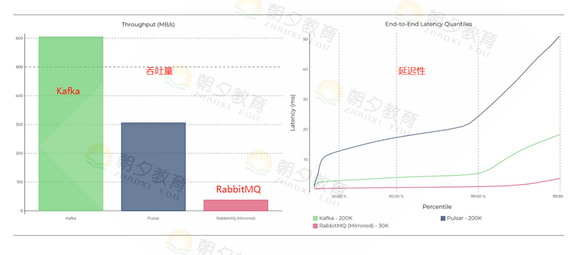

```shell
RabbitMQ：1s中的吞吐量约是36M，轻量级
Kafka：1s中的吞吐量约是610M，重量级
kafka适合数据量大的场景，rabbitmq适合可靠，对速度要求不高的场景
```


## 参考资料

- [章全蛋-CSDN博客](https://blog.csdn.net/qq_41049126?type=blog)——Kafka系列文章
- https://blog.csdn.net/weixin_53543905/article/details/135860367
- [Kafka——两种集群搭建详解_kafka集群配置-CSDN博客](https://blog.csdn.net/cold___play/article/details/132267259)
