分布式数据库——TiDB

NewSQL=OLTP+OLAP=HTAP数据库

OLTP：事务处理，数据的增删改查

OLAP：分析处理，数据的查询与分析

HTAP：混合 事务/分析处理。比如金融交易、电商、物流

兼容MySQL协议和生态

分布式数据库：扩展性、弹性伸缩、支持SQL、支持高可用、ACID事务

> 原文链接：[TIDB - 分布式数据库 - ityml - 博客园 (cnblogs.com)](https://www.cnblogs.com/ityml/p/17664987.html)
>
> 官网地址：[TiDB 产品文档 | PingCAP 文档中心](https://docs.pingcap.com/zh/tidb/stable)

## TiDB 整体架构

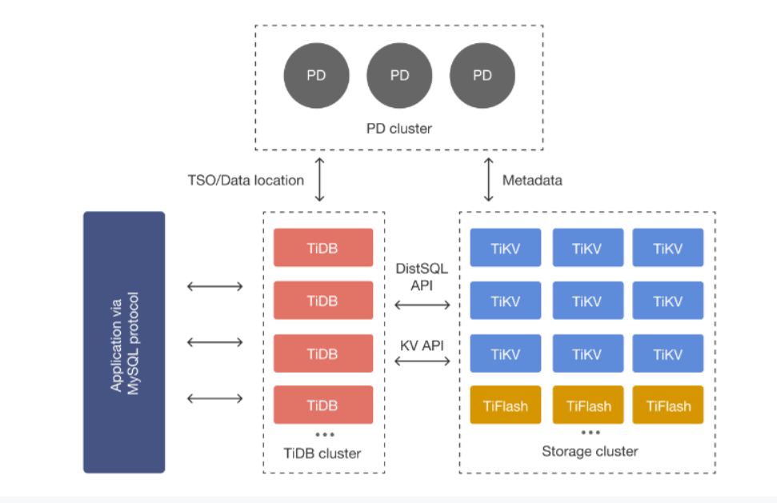

### TiDB Server

> TiDB Server 负责接受客户端的连接，执行 SQL 解析和优化，最终生成分布式执行计划，对外暴露 MySQL 协议的连接 endpoint，处理 SQL 相关的逻辑，并通过 PD 找到存储计算所需数据的 TiKV 地址，与 TiKV 交互获取数据，最终返回结果，TiDB 层本身是无状态的，实践中可以启动多个 TiDB 实例，通过负载均衡组件（如 LVS、HAProxy 或 F5）对外提供统一的接入地址，客户端的连接可以均匀地分摊在多个 TiDB 实例上以达到负载均衡的效果。TiDB Server 本身并不存储数据，只是解析 SQL，将实际的数据读取请求转发给底层的存储节点 TiKV（或 TiFlash）。

- 处理客户端连接
- SQL语句解析和编译
- 关系型数据与kv 的转化
- SQL语句的执行
- 在线DDL执行
- 垃圾回收

### PD Server

> 整个 TiDB 集群的元信息管理模块，负责存储每个 TiKV 节点实时的数据分布情况和集群的整体拓扑结构，提供 TiDB Dashboard 管控界面，并为分布式事务分配事务 ID。PD 不仅存储元信息，同时还会根据 TiKV 节点实时上报的数据分布状态，下发数据调度命令给具体的 TiKV 节点，可以说是整个集群的“大脑”。此外，PD 本身也是由至少 3 个节点构成，拥有高可用的能力。建议部署奇数个 PD 节点。其主要工作有三个：一是存储集群的元信息（某个 Key 存储在哪个 TiKV 节点）；二是对 TiKV 集群进行调度和负载均衡（如数据的迁移、Raft group leader 的迁移等）；三是分配全局唯一且递增的事务 ID。

- 整个集群TIKV的元数据存储
- 分配全局ID和事务ID
- 生成全局时间错TSO
- 收集集群信息进行调度
- 提供TIDB Dashboard 服务

### TiKV/TIFLASH Server

[show table regions](https://docs.pingcap.com/zh/tidb/stable/sql-statement-show-table-regions#show-table-regions):查看节点

> - [TiKV Server](https://docs.pingcap.com/zh/tidb/stable/tidb-storage)：负责存储数据，从外部看 TiKV 是一个分布式的提供事务的 Key-Value 存储引擎。存储数据的基本单位是 Region，每个 Region 负责存储一个 Key Range（从 StartKey 到 EndKey 的左闭右开区间）的数据，每个 TiKV 节点会负责多个 Region。TiKV 的 API 在 KV 键值对层面提供对分布式事务的原生支持，默认提供了 SI (Snapshot Isolation) 的隔离级别，这也是 TiDB 在 SQL 层面支持分布式事务的核心。TiDB 的 SQL 层做完 SQL 解析后，会将 SQL 的执行计划转换为对 TiKV API 的实际调用。所以，数据都存储在 TiKV 中。另外，TiKV 中的数据都会自动维护多副本（默认为三副本），天然支持高可用和自动故障转移。

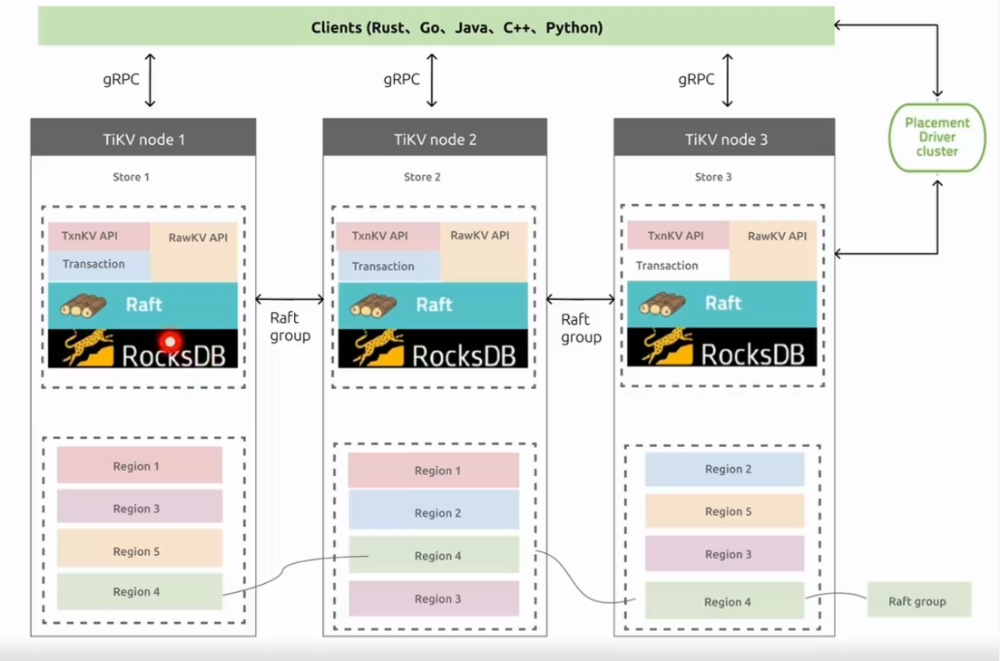

- 数据持久化
- 分布式事务支持
- 副本的强一致性和高可用性
- MVCC（多版本并发控制）
- 算子下推 Coprocessor

> - [TiFlash](https://docs.pingcap.com/zh/tidb/stable/tiflash-overview)：TiFlash 是一类特殊的存储节点。和普通 TiKV 节点不一样的是，在 TiFlash 内部，数据是以列式的形式进行存储，主要的功能是为分析型的场景加速。

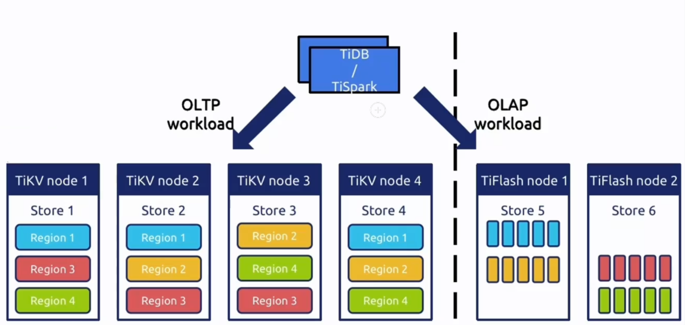

- 列式存储提高分析查询效率
- 支持强一致性和实时性
- 业务隔离
- 智能选择

## TIDB 数据库计算

**TiDB 中数据到 (Key, Value) 键值对的映射方案**

### 表数据与 Key-Value 的映射关系

> 背景：在关系型数据库中，一个表可能有很多列。要将一行中各列数据映射成一个 (Key, Value) 键值对，需要考虑如何构造 Key。首先，OLTP 场景下有大量针对单行或者多行的增、删、改、查等操作，要求数据库具备快速读取一行数据的能力。因此，对应的 Key 最好有一个唯一 ID（显示或隐式的 ID），以方便快速定位。其次，很多 OLAP 型查询需要进行全表扫描。如果能够将一个表中所有行的 Key 编码到一个区间内，就可以通过范围查询高效完成全表扫描的任务。3

基于上述考虑，TiDB 中的表数据与 Key-Value 的映射关系作了如下设计：

- 为了保证同一个表的数据放在一起，方便查找，TiDB 会为每个表分配一个表 ID，用 `TableID` 表示。表 ID 是一个整数，在整个集群内唯一。
- TiDB 会为表中每行数据分配一个行 ID，用 `RowID` 表示。行 ID 也是一个整数，在表内唯一。对于行 ID，TiDB 做了一个小优化，如果某个表有整数型的主键，TiDB 会使用主键的值当做这一行数据的行 ID。

每行数据按照如下规则编码成 (Key, Value) 键值对：

> Key: tablePrefix{TableID}_recordPrefixSep{RowID}
>
> Value: [col1, col2, col3, col4]

其中 `tablePrefix` 和 `recordPrefixSep` 都是特定的字符串常量，用于在 Key 空间内区分其他数据。其具体值在后面的小结中给出。

### 索引数据和 Key-Value 的映射关系

 TiDB 同时支持主键和二级索引（包括唯一索引和非唯一索引）。与表数据映射方案类似，TiDB 为表中每个索引分配了一个索引 ID，用 `IndexID` 表示。

> Key: tablePrefix{tableID}_indexPrefixSep{indexID}_indexedColumnsValue
>
> Value: RowID

 对于不需要满足唯一性约束的普通二级索引，一个键值可能对应多行，需要根据键值范围查询对应的 RowID。因此，按照如下规则编码成 (Key, Value) 键值对：

> Key: tablePrefix{TableID}_indexPrefixSep{IndexID}*indexedColumnsValue*
>
> Value: null

### 映射关系总结

上述所有编码规则中的 `tablePrefix`、`recordPrefixSep` 和 `indexPrefixSep` 都是字符串常量，用于在 Key 空间内区分其他数据，定义如下：

```ini
tablePrefix     = []byte{'t'}
recordPrefixSep = []byte{'r'}
indexPrefixSep  = []byte{'i'}
```

> 另外请注意，上述方案中，无论是表数据还是索引数据的 Key 编码方案，一个表内所有的行都有相同的 Key 前缀，一个索引的所有数据也都有相同的前缀。这样具有相同的前缀的数据，在 TiKV 的 Key 空间内，是排列在一起的。因此只要小心地设计后缀部分的编码方案，保证编码前和编码后的比较关系不变，就可以将表数据或者索引数据有序地保存在 TiKV 中。采用这种编码后，一个表的所有行数据会按照 `RowID` 顺序地排列在 TiKV 的 Key 空间中，某一个索引的数据也会按照索引数据的具体的值（编码方案中的 `indexedColumnsValue`）顺序地排列在 Key 空间内。

### Key-Value 映射关系示例

最后通过一个简单的例子，来理解 TiDB 的 Key-Value 映射关系。假设 TiDB 中有如下这个表：

```sql
CREATE TABLE User (
    ID int,
    Name varchar(20),
    Role varchar(20),
    Age int,
    PRIMARY KEY (ID),
    KEY idxAge (Age)
);
```

假设该表中有 3 行数据：

```apache
1, "TiDB", "SQL Layer", 10
2, "TiKV", "KV Engine", 20
3, "PD", "Manager", 30
```

首先每行数据都会映射为一个 (Key, Value) 键值对，同时该表有一个 `int` 类型的主键，所以 `RowID` 的值即为该主键的值。假设该表的 `TableID` 为 10，则其存储在 TiKV 上的表数据为：

```xl
t10_r1 --> ["TiDB", "SQL Layer", 10]
t10_r2 --> ["TiKV", "KV Engine", 20]
t10_r3 --> ["PD", "Manager", 30]
```

除了主键外，该表还有一个非唯一的普通二级索引 `idxAge`，假设这个索引的 `IndexID` 为 1，则其存储在 TiKV 上的索引数据为：

```livescript
t10_i1_10_1 --> null
t10_i1_20_2 --> null
t10_i1_30_3 --> null
```

### 元信息管理

> TiDB 中每个 `Database` 和 `Table` 都有元信息，也就是其定义以及各项属性。这些信息也需要持久化，TiDB 将这些信息也存储在了 TiKV 中。
>
> 每个 `Database`/`Table` 都被分配了一个唯一的 ID，这个 ID 作为唯一标识，并且在编码为 Key-Value 时，这个 ID 都会编码到 Key 中，再加上 `m_` 前缀。这样可以构造出一个 Key，Value 中存储的是序列化后的元信息。
>
> 除此之外，TiDB 还用一个专门的 (Key, Value) 键值对存储当前所有表结构信息的最新版本号。这个键值对是全局的，每次 DDL 操作的状态改变时其版本号都会加 1。目前，TiDB 把这个键值对持久化存储在 PD Server 中，其 Key 是 "/tidb/ddl/global_schema_version"，Value 是类型为 int64 的版本号值。TiDB 采用 Online Schema 变更算法，有一个后台线程在不断地检查 PD Server 中存储的表结构信息的版本号是否发生变化，并且保证在一定时间内一定能够获取版本的变化。

### SQL 层简介

> TiDB 的 SQL 层，即 TiDB Server，负责将 SQL 翻译成 Key-Value 操作，将其转发给共用的分布式 Key-Value 存储层 TiKV，然后组装 TiKV 返回的结果，最终将查询结果返回给客户端。

**这一层的节点都是无状态的，节点本身并不存储数据，节点之间完全对等。**

### SQL 运算

> 最简单的方案就是通过上一节所述的[表数据与 Key-Value 的映射关系](https://docs-archive.pingcap.com/zh/tidb/v6.6/tidb-computing#表数据与-key-value-的映射关系)方案，将 SQL 查询映射为对 KV 的查询，再通过 KV 接口获取对应的数据，最后执行各种计算。

> 比如 `select count(*) from user where name = "TiDB"` 这样一个 SQL 语句，它需要读取表中所有的数据，然后检查 `name` 字段是否是 `TiDB`，如果是的话，则返回这一行。具体流程如下：

1. 构造出 Key Range：一个表中所有的 `RowID` 都在 `[0, MaxInt64)` 这个范围内，使用 `0` 和 `MaxInt64` 根据行数据的 `Key` 编码规则，就能构造出一个 `[StartKey, EndKey)`的左闭右开区间。
2. 扫描 Key Range：根据上面构造出的 Key Range，读取 TiKV 中的数据。
3. 过滤数据：对于读到的每一行数据，计算 `name = "TiDB"` 这个表达式，如果为真，则向上返回这一行，否则丢弃这一行数据。
4. 计算 `Count(*)`：对符合要求的每一行，累计到 `Count(*)` 的结果上面。

**整个流程示意图如下：**

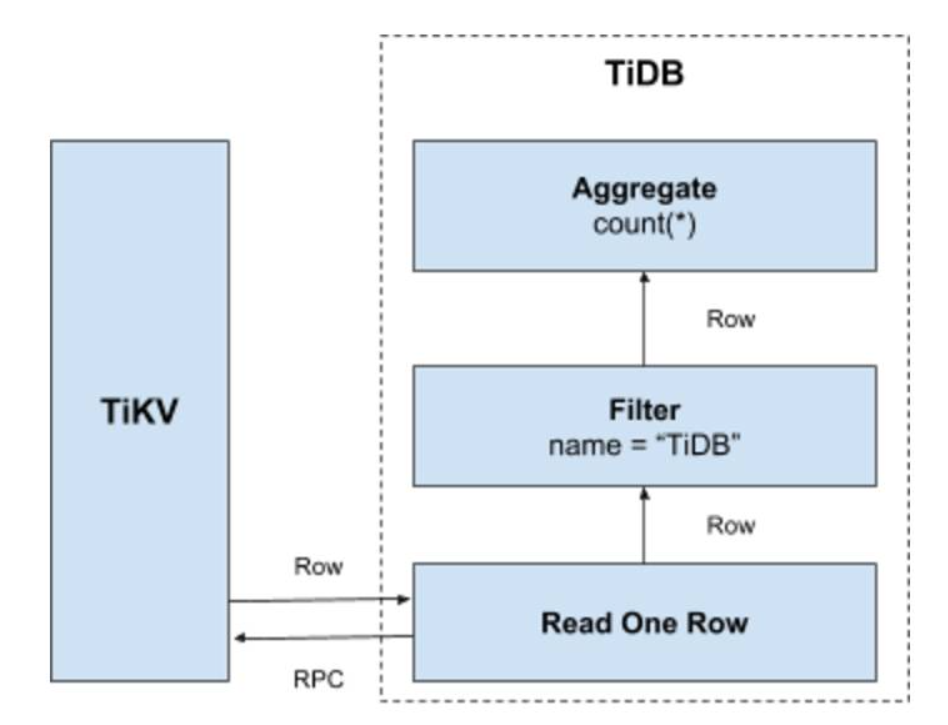

这个方案是直观且可行的，但是在分布式数据库的场景下有一些显而易见的问题：

> - 在扫描数据的时候，每一行都要通过 KV 操作从 TiKV 中读取出来，至少有一次 RPC 开销，如果需要扫描的数据很多，那么这个开销会非常大。
> - 并不是所有的行都满足过滤条件 `name = "TiDB"`，如果不满足条件，其实可以不读取出来。
> - 此查询只要求返回符合要求行的数量，不要求返回这些行的值。

### 分布式 SQL 运算

> 为了解决上述问题，计算应该需要尽量靠近存储节点，以避免大量的 RPC 调用。首先，SQL 中的谓词条件 `name = "TiDB"` 应被下推到存储节点进行计算，这样只需要返回有效的行，避免无意义的网络传输。然后，聚合函数 `Count(*)` 也可以被下推到存储节点，进行预聚合，每个节点只需要返回一个 `Count(*)` 的结果即可，再由 SQL 层将各个节点返回的 `Count(*)` 的结果累加求和。

以下是数据逐层返回的示意图：

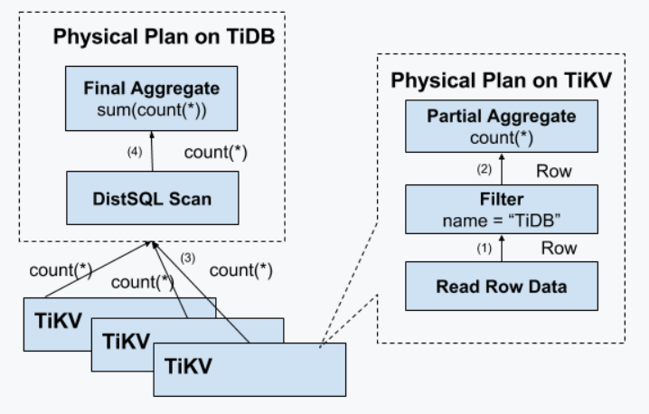

### SQL 层架构

> 通过上面的例子，希望大家对 SQL 语句的处理有一个基本的了解。实际上 TiDB 的 SQL 层要复杂得多，模块以及层次非常多，下图列出了重要的模块以及调用关系：

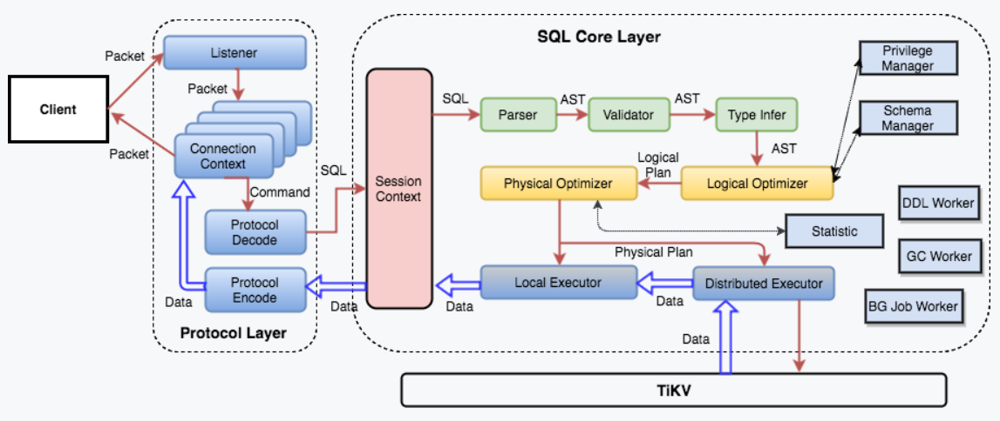

- AST 语法树 - 逻辑优化 - 逻辑执行计划 - 物理优化 - 本地执行器 - 异地执行器

> 用户的 SQL 请求会直接或者通过 `Load Balancer` 发送到 TiDB Server，TiDB Server 会解析 `MySQL Protocol Packet`，获取请求内容，对 SQL 进行语法解析和语义分析，制定和优化查询计划，执行查询计划并获取和处理数据。数据全部存储在 TiKV 集群中，所以在这个过程中 TiDB Server 需要和 TiKV 交互，获取数据。最后 TiDB Server 需要将查询结果返回给用户。

### AUTO_INCREMENT

`AUTO_INCREMENT` 是用于自动填充缺省列值的列属性。当 `INSERT` 语句没有指定 `AUTO_INCREMENT` 列的具体值时，系统会自动地为该列分配一个值。

出于性能原因，自增编号是系统批量分配给每台 TiDB 服务器的值（默认 3 万个值），因此自增编号能保证唯一性，但分配给 `INSERT` 语句的值仅在单台 TiDB 服务器上具有单调性。

#### 实现原理

TiDB 实现 `AUTO_INCREMENT` 隐式分配的原理是，对于每一个自增列，都使用一个全局可见的键值对用于记录当前已分配的最大 ID。由于分布式环境下的节点通信存在一定开销，为了避免写请求放大的问题，每个 TiDB 节点在分配 ID 时，都申请一段 ID 作为缓存，用完之后再去取下一段，而不是每次分配都向存储节点申请。例如，对于以下新建的表：

```sql
CREATE TABLE t(id int UNIQUE KEY AUTO_INCREMENT, c int);
```

假设集群中有两个 TiDB 实例 A 和 B，如果向 A 和 B 分别对 `t` 执行一条插入语句：

```sql
INSERT INTO t (c) VALUES (1)
```

实例 A 可能会缓存 `[1,30000]` 的自增 ID，而实例 B 则可能缓存 `[30001,60000]` 的自增 ID。各自实例缓存的 ID 将随着执行将来的插入语句被作为缺省值，顺序地填充到 `AUTO_INCREMENT` 列中。

#### 基本特性

##### 唯一性保证

警告

> 在集群中有多个 TiDB 实例时，如果表结构中有自增 ID，建议不要混用显式插入和隐式分配（即自增列的缺省值和自定义值），否则可能会破坏隐式分配值的唯一性。

例如在上述示例中，依次执行如下操作：

1. 客户端向实例 B 插入一条将 `id` 设置为 `2` 的语句 `INSERT INTO t VALUES (2, 1)`，并执行成功。
2. 客户端向实例 A 发送 `INSERT` 语句 `INSERT INTO t (c) (1)`，这条语句中没有指定 `id` 的值，所以会由 A 分配。当前 A 缓存了 `[1, 30000]` 这段 ID，可能会分配 `2` 为自增 ID 的值，并把本地计数器加 `1`。而此时数据库中已经存在 `id` 为 `2` 的数据，最终返回 `Duplicated Error` 错误。

##### 单调性保证

TiDB 保证 `AUTO_INCREMENT` 自增值在单台服务器上单调递增。以下示例在一台服务器上生成连续的 `AUTO_INCREMENT` 自增值 `1`-`3`：

```sql
CREATE TABLE t (a int PRIMARY KEY AUTO_INCREMENT, b timestamp NOT NULL DEFAULT NOW());
INSERT INTO t (a) VALUES (NULL), (NULL), (NULL);
SELECT * FROM t;
Query OK, 0 rows affected (0.11 sec)
Query OK, 3 rows affected (0.02 sec)
Records: 3  Duplicates: 0  Warnings: 0
+---+---------------------+
| a | b                   |
+---+---------------------+
| 1 | 2020-09-09 20:38:22 |
| 2 | 2020-09-09 20:38:22 |
| 3 | 2020-09-09 20:38:22 |
+---+---------------------+
3 rows in set (0.00 sec)
```

TiDB 能保证自增值的单调性，但并不能保证其连续性。参考以下示例：

```sql
CREATE TABLE t (id INT NOT NULL PRIMARY KEY AUTO_INCREMENT, a VARCHAR(10), cnt INT NOT NULL DEFAULT 1, UNIQUE KEY (a));
INSERT INTO t (a) VALUES ('A'), ('B');
SELECT * FROM t;
INSERT INTO t (a) VALUES ('A'), ('C') ON DUPLICATE KEY UPDATE cnt = cnt + 1;
SELECT * FROM t;
Query OK, 0 rows affected (0.00 sec)

Query OK, 2 rows affected (0.00 sec)
Records: 2  Duplicates: 0  Warnings: 0

+----+------+-----+
| id | a    | cnt |
+----+------+-----+
|  1 | A    |   1 |
|  2 | B    |   1 |
+----+------+-----+
2 rows in set (0.00 sec)

Query OK, 3 rows affected (0.00 sec)
Records: 2  Duplicates: 1  Warnings: 0

+----+------+-----+
| id | a    | cnt |
+----+------+-----+
|  1 | A    |   2 |
|  2 | B    |   1 |
|  4 | C    |   1 |
+----+------+-----+
3 rows in set (0.00 sec)
```

在以上示例 `INSERT INTO t (a) VALUES ('A'), ('C') ON DUPLICATE KEY UPDATE cnt = cnt + 1;` 语句中，自增值 `3` 被分配为 `A` 键对应的 `id` 值，但实际上 `3` 并未作为 `id` 值插入进表中。这是因为该 `INSERT` 语句包含一个重复键 `A`，使得自增序列不连续，出现了间隙。该行为尽管与 MySQL 不同，但仍是合法的。MySQL 在其他情况下也会出现自增序列不连续的情况，例如事务被中止和回滚时。

#### AUTO_ID_CACHE

如果在另一台服务器上执行插入操作，那么 `AUTO_INCREMENT` 值的顺序可能会剧烈跳跃，这是由于每台服务器都有各自缓存的 `AUTO_INCREMENT` 自增值。

```sql
CREATE TABLE t (a INT PRIMARY KEY AUTO_INCREMENT, b TIMESTAMP NOT NULL DEFAULT NOW());
INSERT INTO t (a) VALUES (NULL), (NULL), (NULL);
INSERT INTO t (a) VALUES (NULL);
SELECT * FROM t;
Query OK, 1 row affected (0.03 sec)

+---------+---------------------+
| a       | b                   |
+---------+---------------------+
|       1 | 2020-09-09 20:38:22 |
|       2 | 2020-09-09 20:38:22 |
|       3 | 2020-09-09 20:38:22 |
| 2000001 | 2020-09-09 20:43:43 |
+---------+---------------------+
4 rows in set (0.00 sec)
```

以下示例在最先的一台服务器上执行一个插入 `INSERT` 操作，生成 `AUTO_INCREMENT` 值 `4`。因为这台服务器上仍有剩余的 `AUTO_INCREMENT` 缓存值可用于分配。在该示例中，值的顺序不具有全局单调性：

```sql
INSERT INTO t (a) VALUES (NULL);
Query OK, 1 row affected (0.01 sec)

SELECT * FROM t ORDER BY b;
+---------+---------------------+
| a       | b                   |
+---------+---------------------+
|       1 | 2020-09-09 20:38:22 |
|       2 | 2020-09-09 20:38:22 |
|       3 | 2020-09-09 20:38:22 |
| 2000001 | 2020-09-09 20:43:43 |
|       4 | 2020-09-09 20:44:43 |
+---------+---------------------+
5 rows in set (0.00 sec)
```

`AUTO_INCREMENT` 缓存不会持久化，重启会导致缓存值失效。以下示例中，最先的一台服务器重启后，向该服务器执行一条插入操作：

```sql
INSERT INTO t (a) VALUES (NULL);
Query OK, 1 row affected (0.01 sec)

SELECT * FROM t ORDER BY b;
+---------+---------------------+
| a       | b                   |
+---------+---------------------+
|       1 | 2020-09-09 20:38:22 |
|       2 | 2020-09-09 20:38:22 |
|       3 | 2020-09-09 20:38:22 |
| 2000001 | 2020-09-09 20:43:43 |
|       4 | 2020-09-09 20:44:43 |
| 2030001 | 2020-09-09 20:54:11 |
+---------+---------------------+
6 rows in set (0.00 sec)
```

TiDB 服务器频繁重启可能导致 `AUTO_INCREMENT` 缓存值被快速消耗。在以上示例中，最先的一台服务器本来有可用的缓存值 `[5-3000]`。但重启后，这些值便丢失了，无法进行重新分配。

用户不应指望 `AUTO_INCREMENT` 值保持连续。在以下示例中，一台 TiDB 服务器的缓存值为 `[2000001-2030000]`。当手动插入值 `2029998` 时，TiDB 取用了一个新缓存区间的值：

```sql
INSERT INTO t (a) VALUES (2029998);
Query OK, 1 row affected (0.01 sec)

INSERT INTO t (a) VALUES (NULL);
Query OK, 1 row affected (0.01 sec)

INSERT INTO t (a) VALUES (NULL);
Query OK, 1 row affected (0.00 sec)

INSERT INTO t (a) VALUES (NULL);
Query OK, 1 row affected (0.02 sec)

INSERT INTO t (a) VALUES (NULL);
Query OK, 1 row affected (0.01 sec)

SELECT * FROM t ORDER BY b;
+---------+---------------------+
| a       | b                   |
+---------+---------------------+
|       1 | 2020-09-09 20:38:22 |
|       2 | 2020-09-09 20:38:22 |
|       3 | 2020-09-09 20:38:22 |
| 2000001 | 2020-09-09 20:43:43 |
|       4 | 2020-09-09 20:44:43 |
| 2030001 | 2020-09-09 20:54:11 |
| 2029998 | 2020-09-09 21:08:11 |
| 2029999 | 2020-09-09 21:08:11 |
| 2030000 | 2020-09-09 21:08:11 |
| 2060001 | 2020-09-09 21:08:11 |
| 2060002 | 2020-09-09 21:08:11 |
+---------+---------------------+
11 rows in set (0.00 sec)
```

以上示例插入 `2030000` 后，下一个值为 `2060001`，即顺序出现跳跃。这是因为另一台 TiDB 服务器获取了中间缓存区间 `[2030001-2060000]`。当部署有多台 TiDB 服务器时，`AUTO_INCREMENT` 值的顺序会出现跳跃，因为对缓存值的请求是交叉出现的。

#### 缓存大小控制

TiDB 自增 ID 的缓存大小在早期版本中是对用户透明的。从 v3.1.2、v3.0.14 和 v4.0.rc-2 版本开始，TiDB 引入了 `AUTO_ID_CACHE` 表选项来允许用户自主设置自增 ID 分配缓存的大小。例如：

```sql
CREATE TABLE t(a int AUTO_INCREMENT key) AUTO_ID_CACHE 100;
Query OK, 0 rows affected (0.02 sec)

INSERT INTO t VALUES();
Query OK, 1 row affected (0.00 sec)
Records: 1  Duplicates: 0  Warnings: 0

SELECT * FROM t;
+---+
| a |
+---+
| 1 |
+---+
1 row in set (0.01 sec)
```

此时如果将该列的自增缓存无效化，重新进行隐式分配：

```sql
DELETE FROM t;
Query OK, 1 row affected (0.01 sec)

RENAME TABLE t to t1;
Query OK, 0 rows affected (0.01 sec)

INSERT INTO t1 VALUES()
Query OK, 1 row affected (0.00 sec)

SELECT * FROM t;
+-----+
| a   |
+-----+
| 101 |
+-----+
1 row in set (0.00 sec)
```

可以看到再一次分配的值为 `101`，说明该表的自增 ID 分配缓存的大小为 `100`。

此外如果在批量插入的 `INSERT` 语句中所需连续 ID 长度超过 `AUTO_ID_CACHE` 的长度时，TiDB 会适当调大缓存以便能够保证该语句的正常插入。

#### 自增步长和偏移量设置

从 v3.0.9 和 v4.0.rc-1 开始，和 MySQL 的行为类似，自增列隐式分配的值遵循 session 变量 `@@auto_increment_increment` 和 `@@auto_increment_offset` 的控制，其中自增列隐式分配的值 (ID) 将满足式子 `(ID - auto_increment_offset) % auto_increment_increment == 0`。

#### MySQL 兼容模式

从 v6.4.0 开始，TiDB 实现了中心化分配自增 ID 的服务，可以支持 TiDB 实例不缓存数据，而是每次请求都访问中心化服务获取 ID。

当前中心化分配服务内置在 TiDB 进程，类似于 DDL Owner 的工作模式。有一个 TiDB 实例将充当“主”的角色提供 ID 分配服务，而其它的 TiDB 实例将充当“备”角色。当“主”节点发生故障时，会自动进行“主备切换”，从而保证中心化服务的高可用。

MySQL 兼容模式的使用方式是，建表时将 `AUTO_ID_CACHE` 设置为 `1`：

```sql
CREATE TABLE t(a int AUTO_INCREMENT key) AUTO_ID_CACHE 1;
```

> 注意:
>
> 在 TiDB 各个版本中，`AUTO_ID_CACHE` 设置为 `1` 都表明 TiDB 不再缓存 ID，但是不同版本的实现方式不一样：
>
> - 对于 TiDB v6.4.0 之前的版本，由于每次分配 ID 都需要通过一个 TiKV 事务完成 `AUTO_INCREMENT` 值的持久化修改，因此设置 `AUTO_ID_CACHE` 为 `1` 会出现性能下降。
> - 对于 v6.4.0 及以上版本，由于引入了中心化的分配服务，`AUTO_INCREMENT` 值的修改只是在 TiDB 服务进程中的一个内存操作，相较于之前版本更快。
> - 将 `AUTO_ID_CACHE` 设置为 `1` 表示 TiDB 使用默认的缓存大小 `30000`。

使用 MySQL 兼容模式后，能保证 ID **唯一**、**单调递增**，行为几乎跟 MySQL 完全一致。即使跨 TiDB 实例访问，ID 也不会出现回退。只有当中心化服务的“主” TiDB 实例异常崩溃时，才有可能造成少量 ID 不连续。这是因为主备切换时，“备” 节点需要丢弃一部分之前的“主” 节点可能已经分配的 ID，以保证 ID 不出现重复。

#### 使用限制

目前在 TiDB 中使用 `AUTO_INCREMENT` 有以下限制：

- 对于 v6.6.0 及更早的 TiDB 版本，定义的列必须为主键或者索引前缀。
- 只能定义在类型为整数、`FLOAT` 或 `DOUBLE` 的列上。
- 不支持与列的默认值 `DEFAULT` 同时指定在同一列上。
- 不支持使用 `ALTER TABLE` 来添加 `AUTO_INCREMENT` 属性。
- 支持使用 `ALTER TABLE` 来移除 `AUTO_INCREMENT` 属性。但从 TiDB 2.1.18 和 3.0.4 版本开始，TiDB 通过 session 变量 `@@tidb_allow_remove_auto_inc` 控制是否允许通过 `ALTER TABLE MODIFY` 或 `ALTER TABLE CHANGE` 来移除列的 `AUTO_INCREMENT` 属性，默认是不允许移除。
- `ALTER TABLE` 需要 `FORCE` 选项来将 `AUTO_INCREMENT` 设置为较小的值。
- 将 `AUTO_INCREMENT` 设置为小于 `MAX(<auto_increment_column>)` 的值会导致重复键，因为预先存在的值不会被跳过。

#### 热点问题

[高并发场景写入最佳实践](https://docs.pingcap.com/zh/tidb/stable/high-concurrency-best-practices#tidb-高并发写入场景最佳实践)

[热点问题处理](https://docs.pingcap.com/zh/tidb/stable/troubleshoot-hot-spot-issues#tidb-热点问题处理)

### AUTO_RANDOM

## TiDB 数据库的调度

**[PD](https://github.com/tikv/pd) (Placement Driver) 是 TiDB 集群的管理模块，同时也负责集群数据的实时调度。**

### 场景描述

> TiKV 集群是 TiDB 数据库的分布式 KV 存储引擎，数据以 Region 为单位进行复制和管理，每个 Region 会有多个副本 (Replica)，这些副本会分布在不同的 TiKV 节点上，其中 Leader 负责读/写，Follower 负责同步 Leader 发来的 Raft log。

需要考虑以下场景：

- 为了提高集群的空间利用率，需要根据 Region 的空间占用对副本进行合理的分布。
- 集群进行跨机房部署的时候，要保证一个机房掉线，不会丢失 Raft Group 的多个副本。
- 添加一个节点进入 TiKV 集群之后，需要合理地将集群中其他节点上的数据搬到新增节点。
- 当一个节点掉线时，需要考虑快速稳定地进行容灾。
  - 从节点的恢复时间来看
    - 如果节点只是短暂掉线（重启服务），是否需要进行调度。
    - 如果节点是长时间掉线（磁盘故障，数据全部丢失），如何进行调度。
  - 假设集群需要每个 Raft Group 有 N 个副本，从单个 Raft Group 的副本个数来看
    - 副本数量不够（例如节点掉线，失去副本），需要选择适当的机器的进行补充。
    - 副本数量过多（例如掉线的节点又恢复正常，自动加入集群），需要合理的删除多余的副本。
- 读/写通过 Leader 进行，Leader 的分布只集中在少量几个节点会对集群造成影响。
- 并不是所有的 Region 都被频繁的访问，可能访问热点只在少数几个 Region，需要通过调度进行负载均衡。
- 集群在做负载均衡的时候，往往需要搬迁数据，这种数据的迁移可能会占用大量的网络带宽、磁盘 IO 以及 CPU，进而影响在线服务。

**以上问题和场景如果多个同时出现，就不太容易解决，因为需要考虑全局信息。同时整个系统也是在动态变化的，因此需要一个中心节点，来对系统的整体状况进行把控和调整，所以有了 PD 这个模块。**

### 调度的需求

对以上的问题和场景进行分类和整理，可归为以下两类：

**第一类：作为一个分布式高可用存储系统，必须满足的需求，包括几种**

- 副本数量不能多也不能少
- 副本需要根据拓扑结构分布在不同属性的机器上
- 节点宕机或异常能够自动合理快速地进行容灾

**第二类：作为一个良好的分布式系统，需要考虑的地方包括**

- 维持整个集群的 Leader 分布均匀
- 维持每个节点的储存容量均匀
- 维持访问热点分布均匀
- 控制负载均衡的速度，避免影响在线服务
- 管理节点状态，包括手动上线/下线节点

> 满足第一类需求后，整个系统将具备强大的容灾功能。满足第二类需求后，可以使得系统整体的资源利用率更高且合理，具备良好的扩展性。
>
> 为了满足这些需求，首先需要收集足够的信息，比如每个节点的状态、每个 Raft Group 的信息、业务访问操作的统计等；其次需要设置一些策略，PD 根据这些信息以及调度的策略，制定出尽量满足前面所述需求的调度计划；最后需要一些基本的操作，来完成调度计划。

### 调度的基本操作

调度的基本操作指的是为了满足调度的策略。上述调度需求可整理为以下三个操作：

- 增加一个副本
- 删除一个副本
- 将 Leader 角色在一个 Raft Group 的不同副本之间 transfer（迁移）

**刚好 Raft 协议通过 `AddReplica`、`RemoveReplica`、`TransferLeader` 这三个命令，可以支撑上述三种基本操作。**

### 信息收集

> 调度依赖于整个集群信息的收集，简单来说，调度需要知道每个 TiKV 节点的状态以及每个 Region 的状态。TiKV 集群会向 PD 汇报两类消息，TiKV 节点信息和 Region 信息：

**每个 TiKV 节点会定期向 PD 汇报节点的状态信息**

> TiKV 节点 (Store) 与 PD 之间存在心跳包，一方面 PD 通过心跳包检测每个 Store 是否存活，以及是否有新加入的 Store；另一方面，心跳包中也会携带这个 [Store 的状态信息](https://github.com/pingcap/kvproto/blob/master/proto/pdpb.proto#L473)，主要包括：

- 总磁盘容量
- 可用磁盘容量
- 承载的 Region 数量
- 数据写入/读取速度
- 发送/接受的 Snapshot 数量（副本之间可能会通过 Snapshot 同步数据）
- 是否过载
- labels 标签信息（标签是具备层级关系的一系列 Tag，能够[感知拓扑信息](https://docs-archive.pingcap.com/zh/tidb/v6.6/schedule-replicas-by-topology-labels)）

> 通过使用 `pd-ctl` 可以查看到 TiKV Store 的状态信息。TiKV Store 的状态具体分为 Up，Disconnect，Offline，Down，Tombstone。各状态的关系如下：

- **Up**：表示当前的 TiKV Store 处于提供服务的状态。
- **Disconnect**：当 PD 和 TiKV Store 的心跳信息丢失超过 20 秒后，该 Store 的状态会变为 Disconnect 状态，当时间超过 `max-store-down-time` 指定的时间后，该 Store 会变为 Down 状态。
- **Down**：表示该 TiKV Store 与集群失去连接的时间已经超过了 `max-store-down-time` 指定的时间，默认 30 分钟。超过该时间后，对应的 Store 会变为 Down，并且开始在存活的 Store 上补足各个 Region 的副本。
- **Offline**：当对某个 TiKV Store 通过 PD Control 进行手动下线操作，该 Store 会变为 Offline 状态。该状态只是 Store 下线的中间状态，处于该状态的 Store 会将其上的所有 Region 搬离至其它满足搬迁条件的 Up 状态 Store。当该 Store 的 `leader_count` 和 `region_count` (在 PD Control 中获取) 均显示为 0 后，该 Store 会由 Offline 状态变为 Tombstone 状态。在 Offline 状态下，禁止关闭该 Store 服务以及其所在的物理服务器。下线过程中，如果集群里不存在满足搬迁条件的其它目标 Store（例如没有足够的 Store 能够继续满足集群的副本数量要求），该 Store 将一直处于 Offline 状态。
- **Tombstone**：表示该 TiKV Store 已处于完全下线状态，可以使用 `remove-tombstone` 接口安全地清理该状态的 TiKV。

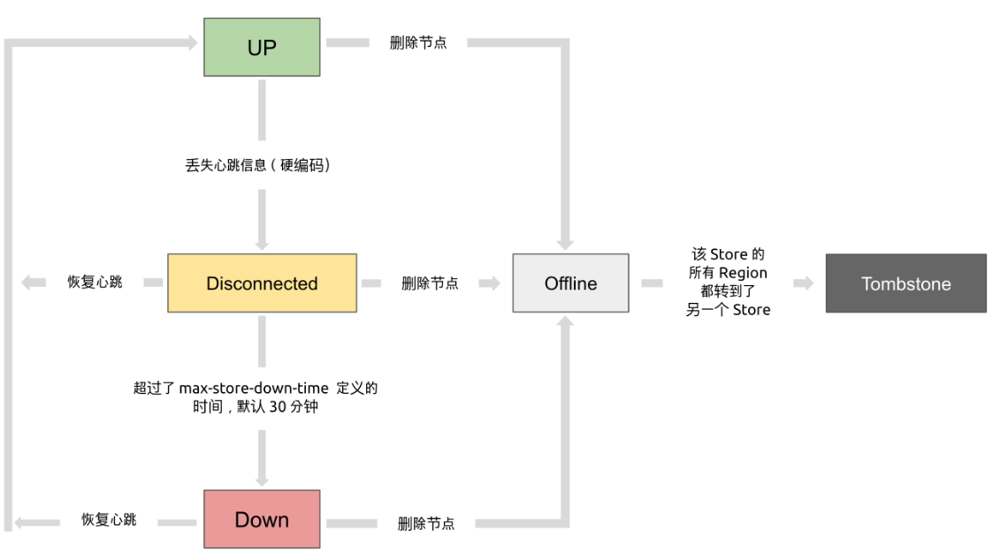

**每个 Raft Group 的 Leader 会定期向 PD 汇报 Region 的状态信息**

每个 Raft Group 的 Leader 和 PD 之间存在心跳包，用于汇报这个 [Region 的状态](https://github.com/pingcap/kvproto/blob/master/proto/pdpb.proto#L312)，主要包括下面几点信息：

- Leader 的位置
- Followers 的位置
- 掉线副本的个数
- 数据写入/读取的速度

> PD 不断的通过这两类心跳消息收集整个集群的信息，再以这些信息作为决策的依据。
>
> 除此之外，PD 还可以通过扩展的接口接受额外的信息，用来做更准确的决策。比如当某个 Store 的心跳包中断的时候，PD 并不能判断这个节点是临时失效还是永久失效，只能经过一段时间的等待（默认是 30 分钟），如果一直没有心跳包，就认为该 Store 已经下线，再决定需要将这个 Store 上面的 Region 都调度走。
>
> 但是有的时候，是运维人员主动将某台机器下线，这个时候，可以通过 PD 的管理接口通知 PD 该 Store 不可用，PD 就可以马上判断需要将这个 Store 上面的 Region 都调度走。

### 调度的策略

PD 收集了这些信息后，还需要一些策略来制定具体的调度计划。

**一个 Region 的副本数量正确**

> 当 PD 通过某个 Region Leader 的心跳包发现这个 Region 的副本数量不满足要求时，需要通过 Add/Remove Replica 操作调整副本数量。出现这种情况的可能原因是：

- 某个节点掉线，上面的数据全部丢失，导致一些 Region 的副本数量不足
- 某个掉线节点又恢复服务，自动接入集群，这样之前已经补足了副本的 Region 的副本数量过多，需要删除某个副本
- 管理员调整副本策略，修改了 [max-replicas](https://github.com/pingcap/pd/blob/v4.0.0-beta/conf/config.toml#L95) 的配置

**一个 Raft Group 中的多个副本不在同一个位置**

> 注意这里用的是『同一个位置』而不是『同一个节点』。在一般情况下，PD 只会保证多个副本不落在一个节点上，以避免单个节点失效导致多个副本丢失。在实际部署中，还可能出现下面这些需求：

- 多个节点部署在同一台物理机器上
- TiKV 节点分布在多个机架上，希望单个机架掉电时，也能保证系统可用性
- TiKV 节点分布在多个 IDC 中，希望单个机房掉电时，也能保证系统可用性

> 这些需求本质上都是某一个节点具备共同的位置属性，构成一个最小的『容错单元』，希望这个单元内部不会存在一个 Region 的多个副本。这个时候，可以给节点配置 [labels](https://github.com/tikv/tikv/blob/v4.0.0-beta/etc/config-template.toml#L140) 并且通过在 PD 上配置 [location-labels](https://github.com/pingcap/pd/blob/v4.0.0-beta/conf/config.toml#L100) 来指名哪些 label 是位置标识，需要在副本分配的时候尽量保证一个 Region 的多个副本不会分布在具有相同的位置标识的节点上。

**副本在 Store 之间的分布均匀分配**

> 由于每个 Region 的副本中存储的数据容量上限是固定的，通过维持每个节点上面副本数量的均衡，使得各节点间承载的数据更均衡。

**Leader 数量在 Store 之间均匀分配**

> Raft 协议要求读取和写入都通过 Leader 进行，所以计算的负载主要在 Leader 上面，PD 会尽可能将 Leader 在节点间分散开。

**访问热点数量在 Store 之间均匀分配**

> 每个 Store 以及 Region Leader 在上报信息时携带了当前访问负载的信息，比如 Key 的读取/写入速度。PD 会检测出访问热点，且将其在节点之间分散开。

**各个 Store 的存储空间占用大致相等**

> 每个 Store 启动的时候都会指定一个 `Capacity` 参数，表明这个 Store 的存储空间上限，PD 在做调度的时候，会考虑节点的存储空间剩余量。

**控制调度速度，避免影响在线服务**

> 调度操作需要耗费 CPU、内存、磁盘 IO 以及网络带宽，需要避免对线上服务造成太大影响。PD 会对当前正在进行的操作数量进行控制，默认的速度控制是比较保守的，如果希望加快调度（比如停服务升级或者增加新节点，希望尽快调度），那么可以通过调节 PD 参数动态加快调度速度。

### 调度的实现

> PD 不断地通过 Store 或者 Leader 的心跳包收集整个集群信息，并且根据这些信息以及调度策略生成调度操作序列。每次收到 Region Leader 发来的心跳包时，PD 都会检查这个 Region 是否有待进行的操作，然后通过心跳包的回复消息，将需要进行的操作返回给 Region Leader，并在后面的心跳包中监测执行结果。

**注意这里的操作只是给 Region Leader 的建议，并不保证一定能得到执行，具体是否会执行以及什么时候执行，由 Region Leader 根据当前自身状态来定。**

## TiDB 数据库的存储

[TiKV](https://github.com/tikv/tikv) 的一些设计思想和关键概念。

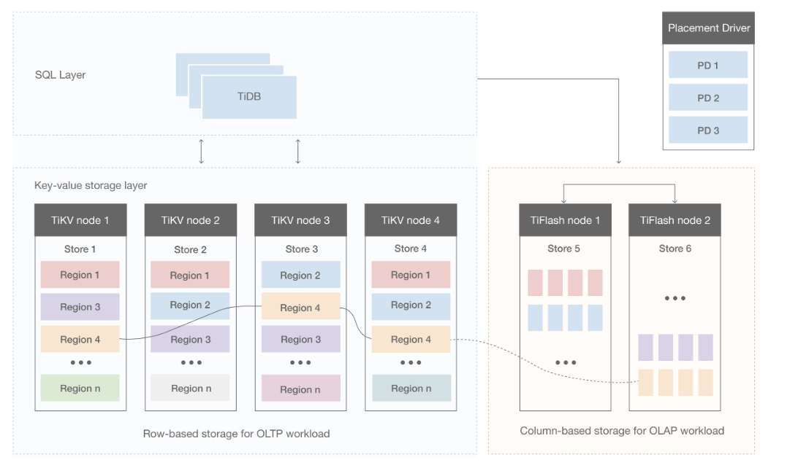

### Key-Value Pairs（键值对）

> 作为保存数据的系统，首先要决定的是数据的存储模型，也就是数据以什么样的形式保存下来。TiKV 的选择是 Key-Value 模型，并且提供有序遍历方法。

TiKV 数据存储的两个关键点：

1. 这是一个巨大的 Map（可以类比一下 C++ 的 std::map），也就是存储的是 Key-Value Pairs（键值对）
2. 这个 Map 中的 Key-Value pair 按照 Key 的二进制顺序有序，也就是可以 Seek 到某一个 Key 的位置，然后不断地调用 Next 方法以递增的顺序获取比这个 Key 大的 Key-Value。

注意， **TiKV 的 KV 存储模型和 SQL 中的 Table 无关**。

### 本地存储 (RocksDB)

> 任何持久化的存储引擎，数据终归要保存在磁盘上，TiKV 也不例外。但是 TiKV 没有选择直接向磁盘上写数据，而是把数据保存在 RocksDB 中，具体的数据落地由 RocksDB 负责。这个选择的原因是开发一个单机存储引擎工作量很大，特别是要做一个高性能的单机引擎，需要做各种细致的优化，而 RocksDB 是由 Facebook 开源的一个非常优秀的单机 KV 存储引擎，可以满足 TiKV 对单机引擎的各种要求。这里可以简单的认为 RocksDB 是一个单机的持久化 Key-Value Map。

### LSM 树

- **传统B+Tree 数据结构**

  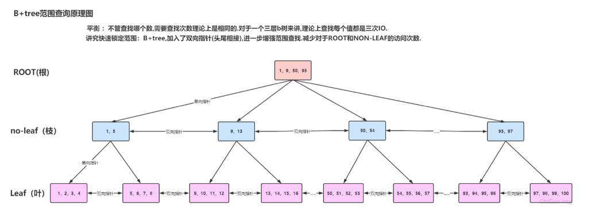

  

- **TiKV LSM Ttree数据结构**

  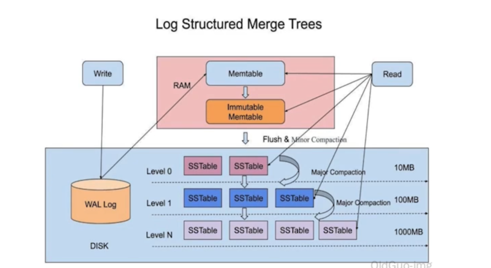

**wal log 预写日志 不经过系统缓存，直接写入磁盘**

**查找 分配key， bloom**

> LSM树和B+Tree 最大的不同在于数据更新的方式，在B+Tree 中，数据的更新是直接在原数据所在的位置进行修改，而LSM树中，数据的更新是通过追加日志形式完成的。这种追加方式使得LSM树可以顺序写，避免了频繁的随机写，从而提高了写的性能。
>
> 在LSM树中，数据被存储在不同的层次中，每个层次对应一组SSTable文件。当MemTable中的数据达到一定的大小时，会被刷写（flush）到磁盘上，生成一个新的SSTable文件。由于SSTable文件是不可变的，因此所有的更新都被追加到新的SSTable文件中，而不是在原有的文件中进行修改。
>
> 这种追加式的更新方式会导致数据冗余的问题，即某个Key在不同的SSTable文件中可能存在多个版本。这些版本中，只有最新的版本是有效的，其他的版本都是冗余的。为了解决这个问题，需要定期进行SSTable的合并（Compaction）操作，将不同的SSTable文件中相同Key的数据进行合并，并将旧版本的数据删除，从而减少冗余数据的存储空间。

**LSM树压缩策略需要围绕三个问题进行考量（读放大、写放大、空间放大）：**

> - 读放大（Read Amplification）是指在读取数据时，需要读取的数据量大于实际的数据量。在LSM树中，需要先在MemTable中查看是否存在该key，如果不存在，则需要继续在SSTable中查找，直到找到为止。如果数据被分散在多个SSTable中，则需要遍历所有的SSTable，这就导致了读放大。如果数据分布比较均匀，则读放大不会很严重，但如果数据分布不均，则可能需要遍历大量的SSTable才能找到目标数据。
> - 写放大（Write Amplification）是指在写入数据时，实际写入的数据量大于真正的数据量。在LSM树中，写入数据时可能会触发Compact操作，这会导致一些SSTable中的冗余数据被清理回收，但同时也会产生新的SSTable，因此实际写入的数据量可能远大于该key的数据量。
> - 空间放大（Space Amplification）是指数据实际占用的磁盘空间比数据的真正大小更多。在LSM树中，由于数据的更新是以日志形式进行的，因此同一个key可能在多个SSTable中都存在，而只有最新的那条记录是有效的，之前的记录都可以被清理回收。这就导致了空间的浪费，也就是空间放大。为了减少空间浪费，LSM树需要定期进行Compact操作，将多个SSTable中相同的key进行合并，去除冗余数据，减少磁盘空间的占用。

- **TiKV如何做到高并发读写**

  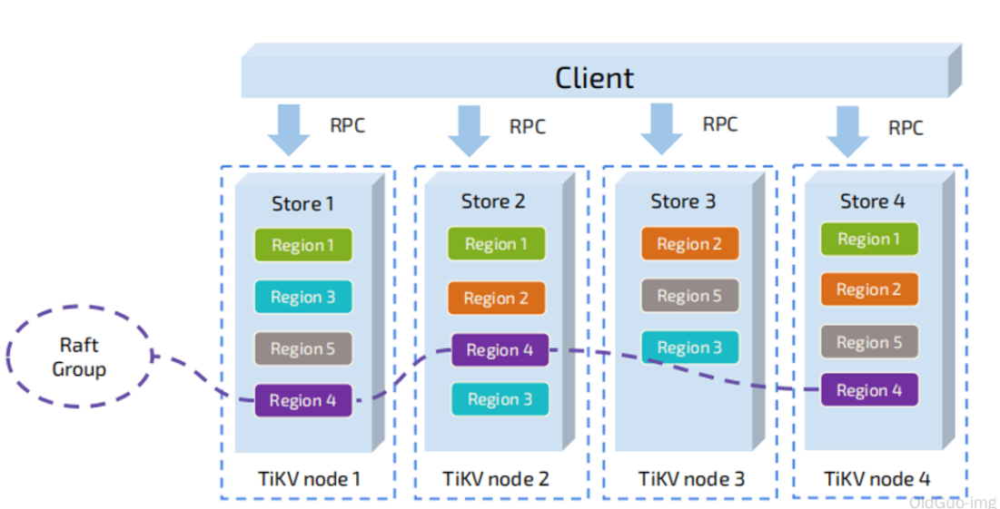

- **TIDB如何保证多副本一致性和高可用**

  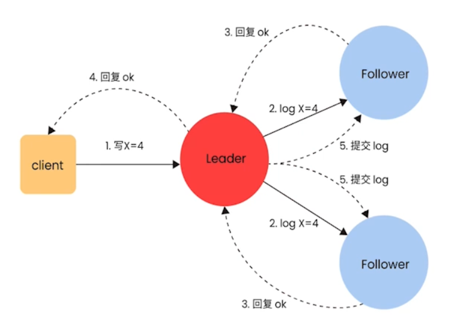

### Raft 协议

http://thesecretlivesofdata.com/raft/

**接下来 TiKV 的实现面临一件更难的事情：如何保证单机失效的情况下，数据不丢失，不出错？**

> 简单来说，需要想办法把数据复制到多台机器上，这样一台机器无法服务了，其他的机器上的副本还能提供服务；复杂来说，还需要这个数据复制方案是可靠和高效的，并且能处理副本失效的情况。TiKV 选择了 Raft 算法。Raft 是一个一致性协议，本文只会对 Raft 做一个简要的介绍，细节问题可以参考它的[论文](https://raft.github.io/raft.pdf)。Raft 提供几个重要的功能：

- Leader（主副本）选举

  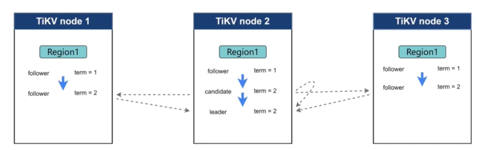

- 成员变更（如添加副本、删除副本、转移 Leader 等操作）

- 日志复制

  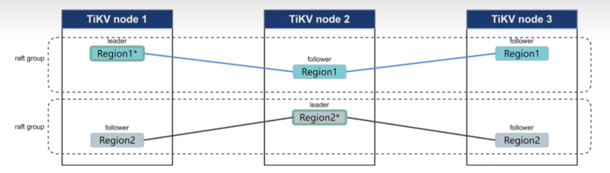

> ##### TiKV 利用 Raft 来做数据复制，每个数据变更都会落地为一条 Raft 日志，通过 Raft 的日志复制功能，将数据安全可靠地同步到复制组的每一个节点中。不过在实际写入中，根据 Raft 的协议，只需要同步复制到多数节点，即可安全地认为数据写入成功。

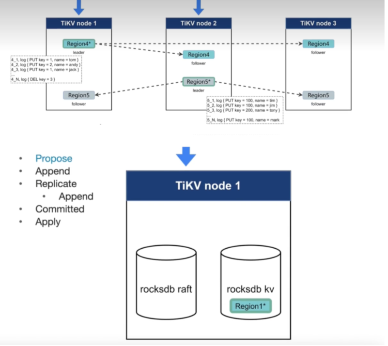

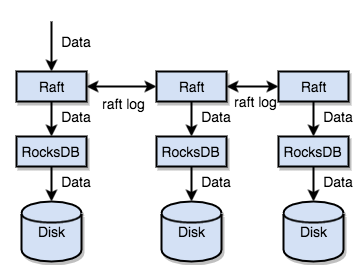

> 总结一下，通过单机的 RocksDB，TiKV 可以将数据快速地存储在磁盘上；通过 Raft，将数据复制到多台机器上，以防单机失效。数据的写入是通过 Raft 这一层的接口写入，而不是直接写 RocksDB。通过实现 Raft，TiKV 变成了一个分布式的 Key-Value 存储，少数几台机器宕机也能通过原生的 Raft 协议自动把副本补全，可以做到对业务无感知。

### Region

> 首先，假设所有的数据都只有一个副本。前面提到，TiKV 可以看做是一个巨大的有序的 KV Map，那么为了实现存储的水平扩展，数据将被分散在多台机器上。对于一个 KV 系统，将数据分散在多台机器上有两种比较典型的方案：

- Hash：按照 Key 做 Hash，根据 Hash 值选择对应的存储节点。
- Range：按照 Key 分 Range，某一段连续的 Key 都保存在一个存储节点上。

> TiKV 选择了第二种方式，将整个 Key-Value 空间分成很多段，每一段是一系列连续的 Key，将每一段叫做一个 Region，可以用 [StartKey，EndKey) 这样一个左闭右开区间来描述。每个 Region 中保存的数据量默认维持在 96 MiB 左右（可以通过配置修改）。

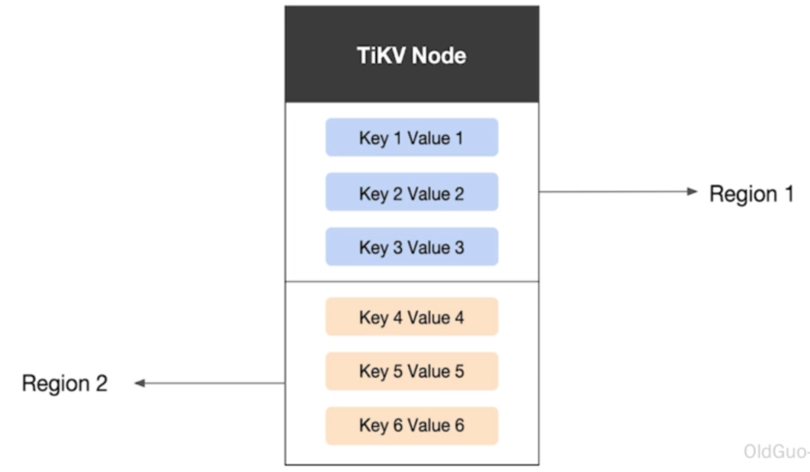


注意，这里的 Region 还是和 SQL 中的表没什么关系。 这里的讨论依然不涉及 SQL，只和 KV 有关。

> 将数据划分成 Region 后，TiKV 将会做两件重要的事情：
>
> - 以 Region 为单位，将数据分散在集群中所有的节点上，并且尽量保证每个节点上服务的 Region 数量差不多。
> - 以 Region 为单位做 Raft 的复制和成员管理。
>
> 这两点非常重要：
>
> - 先看第一点，数据按照 Key 切分成很多 Region，每个 Region 的数据只会保存在一个节点上面（暂不考虑多副本）。TiDB 系统会有一个组件 (PD) 来负责将 Region 尽可能均匀的散布在集群中所有的节点上，这样一方面实现了存储容量的水平扩展（增加新的节点后，会自动将其他节点上的 Region 调度过来），另一方面也实现了负载均衡（不会出现某个节点有很多数据，其他节点上没什么数据的情况）。同时为了保证上层客户端能够访问所需要的数据，系统中也会有一个组件 (PD) 记录 Region 在节点上面的分布情况，也就是通过任意一个 Key 就能查询到这个 Key 在哪个 Region 中，以及这个 Region 目前在哪个节点上（即 Key 的位置路由信息）。
> - 对于第二点，TiKV 是以 Region 为单位做数据的复制，也就是一个 Region 的数据会保存多个副本，TiKV 将每一个副本叫做一个 Replica。Replica 之间是通过 Raft 来保持数据的一致，一个 Region 的多个 Replica 会保存在不同的节点上，构成一个 Raft Group。其中一个 Replica 会作为这个 Group 的 Leader，其他的 Replica 作为 Follower。默认情况下，所有的读和写都是通过 Leader 进行，读操作在 Leader 上即可完成，而写操作再由 Leader 复制给 Follower。

大家理解了 Region 之后，应该可以理解下面这张图：

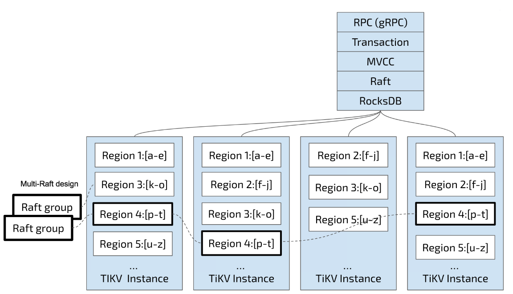

**以 Region 为单位做数据的分散和复制，TiKV 就成为了一个分布式的具备一定容灾能力的 KeyValue 系统，不用再担心数据存不下，或者是磁盘故障丢失数据的问题。**

### MVCC

> 很多数据库都会实现多版本并发控制 (MVCC)，TiKV 也不例外。设想这样的场景：两个客户端同时去修改一个 Key 的 Value，如果没有数据的多版本控制，就需要对数据上锁，在分布式场景下，可能会带来性能以及死锁问题。

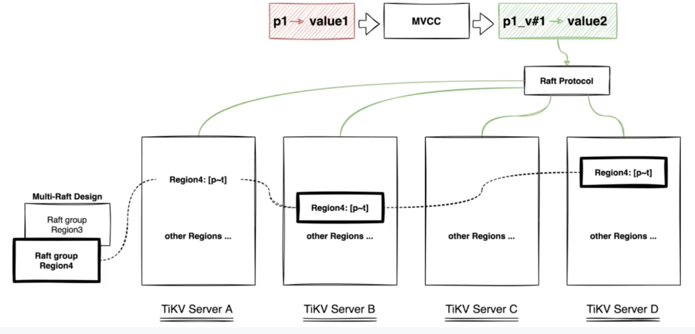

TiKV 的 MVCC 实现是通过在 Key 后面添加版本号来实现，简单来说，没有 MVCC 之前，可以把 TiKV 看做这样的：

```xml
Key1 -> Value
Key2 -> Value
……
KeyN -> Value
```

有了 MVCC 之后，TiKV 的 Key 排列是这样的：

```xl
Key1_Version3 -> Value
Key1_Version2 -> Value
Key1_Version1 -> Value
……
Key2_Version4 -> Value
Key2_Version3 -> Value
Key2_Version2 -> Value
Key2_Version1 -> Value
……
KeyN_Version2 -> Value
KeyN_Version1 -> Value
……
```

> 注意，对于同一个 Key 的多个版本，版本号较大的会被放在前面，版本号小的会被放在后面（见 [Key-Value](https://docs-archive.pingcap.com/zh/tidb/v6.6/tidb-storage#key-value-pairs键值对) 一节，Key 是有序的排列），这样当用户通过一个 Key + Version 来获取 Value 的时候，可以通过 Key 和 Version 构造出 MVCC 的 Key，也就是 Key_Version。然后可以直接通过 RocksDB 的 SeekPrefix(Key_Version) API，定位到第一个大于等于这个 Key_Version 的位置。

### 分布式 ACID 事务

TiKV 的事务采用的是 Google 在 BigTable 中使用的事务模型：[Percolator](https://research.google.com/pubs/pub36726.html)，TiKV 根据这篇论文实现，并做了大量的优化。详细介绍参见[事务概览](https://docs-archive.pingcap.com/zh/tidb/v6.6/transaction-overview)。

### TiFlash 架构特性

## TIDB可执行计划

### 算子简介

算子是为返回查询结果而执行的特定步骤。真正执行扫表（读盘或者读 TiKV Block Cache）操作的算子有如下几类：

- **TableFullScan**：全表扫描。
- **TableRangeScan**：带有范围的表数据扫描。
- **TableRowIDScan**：根据上层传递下来的 RowID 扫描表数据。时常在索引读操作后检索符合条件的行。
- **IndexFullScan**：另一种“全表扫描”，扫的是索引数据，不是表数据。
- **IndexRangeScan**：带有范围的索引数据扫描操作。

TiDB 会汇聚 TiKV/TiFlash 上扫描的数据或者计算结果，这种“数据汇聚”算子目前有如下几类：

- **TableReader**：将 TiKV 上底层扫表算子 TableFullScan 或 TableRangeScan 得到的数据进行汇总。
- **IndexReader**：将 TiKV 上底层扫表算子 IndexFullScan 或 IndexRangeScan 得到的数据进行汇总。
- **IndexLookUp**：先汇总 Build 端 TiKV 扫描上来的 RowID，再去 Probe 端上根据这些 `RowID` 精确地读取 TiKV 上的数据。Build 端是 `IndexFullScan` 或 `IndexRangeScan` 类型的算子，Probe 端是 `TableRowIDScan` 类型的算子。
- **IndexMerge**：和 `IndexLookupReader` 类似，可以看做是它的扩展，可以同时读取多个索引的数据，有多个 Build 端，一个 Probe 端。执行过程也很类似，先汇总所有 Build 端 TiKV 扫描上来的 RowID，再去 Probe 端上根据这些 RowID 精确地读取 TiKV 上的数据。Build 端是 `IndexFullScan` 或 `IndexRangeScan` 类型的算子，Probe 端是 `TableRowIDScan` 类型的算子。

#### 算子的执行顺序

算子的结构是树状的，但在查询执行过程中，并不严格要求子节点任务在父节点之前完成。TiDB 支持同一查询内的并行处理，即子节点“流入”父节点。父节点、子节点和同级节点可能并行执行查询的一部分。

在以上示例中，`├─IndexRangeScan_8(Build)` 算子为 `a(a)` 索引所匹配的行查找内部 RowID。`└─TableRowIDScan_9(Probe)` 算子随后从表中检索这些行。

Build 总是先于 Probe 执行，并且 Build 总是出现在 Probe 前面。即如果一个算子有多个子节点，子节点 ID 后面有 Build 关键字的算子总是先于有 Probe 关键字的算子执行。TiDB 在展现执行计划的时候，Build 端总是第一个出现，接着才是 Probe 端。

#### 范围查询

在 `WHERE`/`HAVING`/`ON` 条件中，TiDB 优化器会分析主键或索引键的查询返回。如数字、日期类型的比较符，如大于、小于、等于以及大于等于、小于等于，字符类型的 `LIKE` 符号等。

若要使用索引，条件必须是 "Sargable" (Search ARGument ABLE) 的。例如条件 `YEAR(date_column) < 1992` 不能使用索引，但 `date_column < '1992-01-01` 就可以使用索引。

推荐使用同一类型的数据以及同一类型的[字符串和排序规则](https://docs.pingcap.com/zh/tidb/stable/character-set-and-collation)进行比较，以避免引入额外的 `cast` 操作而导致不能利用索引。

可以在范围查询条件中使用 `AND`（求交集）和 `OR`（求并集）进行组合。对于多维组合索引，可以对多个列使用条件。例如对组合索引 `(a, b, c)`：

- 当 `a` 为等值查询时，可以继续求 `b` 的查询范围。
- 当 `b` 也为等值查询时，可以继续求 `c` 的查询范围。
- 反之，如果 `a` 为非等值查询，则只能求 `a` 的范围。

### Task 简介

目前 TiDB 的计算任务分为两种不同的 task：cop task 和 root task。Cop task 是指使用 TiKV 中的 Coprocessor 执行的计算任务，root task 是指在 TiDB 中执行的计算任务。

SQL 优化的目标之一是将计算尽可能地下推到 TiKV 中执行。TiKV 中的 Coprocessor 能支持大部分 SQL 内建函数（包括聚合函数和标量函数）、SQL `LIMIT` 操作、索引扫描和表扫描。

### `operator info` 结果

`EXPLAIN` 返回结果中 `operator info` 列可显示诸如条件下推等信息。本文以上示例中，`operator info` 结果各字段解释如下：

- `range: [1,1]` 表示查询的 `WHERE` 字句 (`a = 1`) 被下推到了 TiKV，对应的 task 为 `cop[tikv]`。
- `keep order:false` 表示该查询的语义不需要 TiKV 按顺序返回结果。如果查询指定了排序（例如 `SELECT * FROM t WHERE a = 1 ORDER BY id`），该字段的返回结果为 `keep order:true`。
- `stats:pseudo` 表示 `estRows` 显示的预估数可能不准确。TiDB 定期在后台更新统计信息。也可以通过执行 `ANALYZE TABLE t` 来手动更新统计信息。

`EXPLAIN` 执行后，不同算子返回不同的信息。你可以使用 Optimizer Hints 来控制优化器的行为，以此控制物理算子的选择。例如 `/*+ HASH_JOIN(t1, t2) */` 表示优化器将使用 Hash Join 算法。详细内容见 [Optimizer Hints](https://docs.pingcap.com/zh/tidb/stable/optimizer-hints)。

## TIDB优化器

### 索引使用

```sql
CREATE TABLE `books` (
  `id` bigint(20) AUTO_RANDOM NOT NULL,
  `title` varchar(100) NOT NULL,
  `type` enum('Magazine', 'Novel', 'Life', 'Arts', 'Comics', 'Education & Reference', 'Humanities & Social Sciences', 'Science & Technology', 'Kids', 'Sports') NOT NULL,
  `published_at` datetime NOT NULL,
  `stock` int(11) DEFAULT '0',
  `price` decimal(15,2) DEFAULT '0.0',
  PRIMARY KEY (`id`) CLUSTERED
) DEFAULT CHARSET=utf8mb4 COLLATE=utf8mb4_bin;
```

#### 创建索引的最佳实践

- 建立你需要使用的数据的所有列的组合索引，这种优化技巧被称为[覆盖索引优化 (covering index optimization)](https://docs.pingcap.com/zh/tidb/stable/explain-indexes#indexreader)。**覆盖索引优化**将使得 TiDB 可以直接在索引上得到该查询所需的所有数据，可以大幅提升性能。
- 避免创建你不需要的二级索引，有用的二级索引能加速查询，但是要注意新增一个索引是有副作用的。每增加一个索引，在插入一条数据的时候，就要额外新增一个 Key-Value，所以索引越多，写入越慢，并且空间占用越大。另外过多的索引也会影响优化器运行时间，并且不合适的索引会误导优化器。所以索引并不是越多越好。
- 根据具体的业务特点创建合适的索引。原则上需要对查询中需要用到的列创建索引，目的是提高性能。下面几种情况适合创建索引：
  - 区分度比较大的列，通过索引能显著地减少过滤后的行数。例如推荐在人的身份证号码这一列上创建索引，但不推荐在人的性别这一列上创建索引。
  - 有多个查询条件时，可以选择组合索引，注意需要把等值条件的列放在组合索引的前面。这里举一个例子，假设常用的查询是 `SELECT * FROM t where c1 = 10 and c2 = 100 and c3 > 10`，那么可以考虑建立组合索引 `Index cidx (c1, c2, c3)`，这样可以用查询条件构造出一个索引前缀进行 Scan。
- 请使用有意义的二级索引名，推荐你遵循公司或组织的表命名规范。如果你的公司或组织没有相应的命名规范，可参考[索引命名规范](https://docs.pingcap.com/zh/tidb/stable/dev-guide-object-naming-guidelines#索引命名规范)。

#### 使用索引的最佳实践

- 建立索引的目的是为了加速查询，所以请确保索引能在一些查询中被用上。如果一个索引不会被任何查询语句用到，那这个索引是没有意义的，请删除这个索引。

- 使用组合索引时，需要满足最左前缀原则。

  例如假设在列 `title, published_at` 上新建一个组合索引索引：

  ```sql
  CREATE INDEX title_published_at_idx ON books (title, published_at);
  ```

  下面这个查询依然能用上这个组合索引：

  ```sql
  SELECT * FROM books WHERE title = 'database';
  ```

  但下面这个查询由于未指定组合索引中最左边第一列的条件，所以无法使用组合索引：

  ```sql
  SELECT * FROM books WHERE published_at = '2018-08-18 21:42:08';
  ```

- 在查询条件中使用索引列作为条件时，不要在索引列上做计算，函数，或者类型转换的操作，会导致优化器无法使用该索引。

  例如假设在时间类型的列 `published_at` 上新建一个索引：

  ```sql
  CREATE INDEX published_at_idx ON books (published_at);
  ```

  但下面查询是无法使用 `published_at` 上的索引的：

  ```sql
  SELECT * FROM books WHERE YEAR(published_at)=2022;
  ```

  可以改写成下面查询，避免在索引列上做函数计算后，即可使用 `published_at` 上的索引:

  ```sql
  SELECT * FROM books WHERE published_at >= '2022-01-01' AND published_at < '2023-01-01';
  ```

  也可以使用表达式索引，例如对查询条件中的 `YEAR(published_at)` 创建一个表达式索引：

  ```sql
  CREATE INDEX published_year_idx ON books ((YEAR(published_at)));
  ```

  然后通过 `SELECT * FROM books WHERE YEAR(published_at)=2022;` 查询就能使用 `published_year_idx` 索引来加速查询了。

  注意

  表达式索引目前是 TiDB 的实验特性，需要在 TiDB 配置文件中开启表达式索引特性，详情可以参考[表达式索引文档](https://docs.pingcap.com/zh/tidb/stable/sql-statement-create-index#表达式索引)。

- 尽量使用覆盖索引，即索引列包含查询列，避免总是 `SELECT *` 查询所有列的语句。

  例如下面查询只需扫描索引 `title_published_at_idx` 数据即可获取查询列的数据：

  ```sql
  SELECT title, published_at FROM books WHERE title = 'database';
  ```

  但下面查询语句虽然能用上组合索引 `(title, published_at)`，但会多一个回表查询非索引列数据的额外开销，回表查询是指根据索引数据中存储的引用（一般是主键信息），到表中查询相应行的数据。

  ```sql
  SELECT * FROM books WHERE title = 'database';
  ```

- 查询条件使用 `!=`，`NOT IN` 时，无法使用索引。例如下面查询无法使用任何索引：

  ```sql
  SELECT * FROM books WHERE title != 'database';
  ```

- 使用 `LIKE` 时如果条件是以通配符 `%` 开头，也无法使用索引。例如下面查询无法使用任何索引：

  ```sql
  SELECT * FROM books WHERE title LIKE '%database';
  ```

- 当查询条件有多个索引可供使用，但你知道用哪一个索引是最优的时，推荐使用[优化器 Hint](https://docs.pingcap.com/zh/tidb/stable/optimizer-hints) 来强制优化器使用这个索引，这样可以避免优化器因为统计信息不准或其他问题时，选错索引。

  例如下面查询中，假设在列 `id` 和列 `title` 上都各自有索引 `id_idx` 和 `title_idx`，你知道 `id_idx` 的过滤性更好，就可以在 SQL 中使用 `USE INDEX` Hint 来强制优化器使用 `id_idx` 索引。

  ```sql
  SELECT * FROM t USE INDEX(id_idx) WHERE id = 1 and title = 'database';
  ```

- 查询条件使用 `IN` 表达式时，后面匹配的条件数量建议不要超过 300 个，否则执行效率会较差。