# Elasticsearch概述

## Elasticsearch是什么

Elasticsearch是一个分布式、RESTful风格的搜索和数据分析引擎,能够解决不断涌现的各种用例，作为Elastic Stack的核心，它集中存储您的数据，帮助您发现意料之中以及意料之外的情况。

The Elastic Stack, 包括 Elasticsearch、Kibana、Beats 和 Logstash（也称为 ELK Stack）。能够安全可靠地获取任何来源、任何格式的数据，然后实时地对数据进行搜索、分析和可视化。Elaticsearch，简称为 ES，ES 是一个`开源的高扩展的分布式全文搜索引擎`，是整个 Elastic Stack 技术栈的核心。它可以近乎实时的存储、检索数据；本身扩展性很好，可以扩展到上百台服务器，处理 PB 级别的数据

## 全文搜索引擎

Google，百度类的网站搜索，它们都是根据网页中的关键字生成索引，我们在搜索的时候输入关键字，它们会将该关键字即索引匹配到的所有网页返回；还有常见的项目中应用日志的搜索等等。对于这些非结构化的数据文本，关系型数据库搜索不是能很好的支持。一般传统数据库，全文检索都实现的很鸡肋，因为一般也没人用数据库存文本字段。进行全文检索需要扫描整个表，如果数据量大的话即使对 SQL 的语法优化，也收效甚微。建立了索引，但是维护起来也很麻烦，对于 insert 和 update 操作都会重新构建索引。基于以上原因可以分析得出，在一些生产环境中，使用常规的搜索方式，性能是非常差的：

- 搜索的数据对象是大量的非结构化的文本数据。
- 文件记录量达到数十万或数百万个甚至更多。
-  支持大量基于交互式文本的查询。
-  需求非常灵活的全文搜索查询。
-  对高度相关的搜索结果的有特殊需求，但是没有可用的关系数据库可以满足。
- 对不同记录类型、非文本数据操作或安全事务处理的需求相对较少的情况。

为了解决结构化数据搜索和非结构化数据搜索性能问题，我们就需要专业，健壮，强大的全文搜索引擎这里说到的全文搜索引擎指的是目前广泛应用的主流搜索引擎。它的工作原理是计算机索引程序通过扫描文章中的每一个词，对每一个词建立一个索引，指明该词在文章中出现的次数和位置，当用户查询时，检索程序就根据事先建立的索引进行查找，并将查找的结果反馈给用户的检索方式。这个过程类似于通过字典中的检索字表查字的过程

## Elasticsearch And Solr

Lucene 是 Apache 软件基金会 Jakarta 项目组的一个子项目，提供了一个简单却强大的应用程式接口，能够做全文索引和搜寻。在 Java 开发环境里 Lucene 是一个成熟的免费开源工具。就其本身而言，Lucene 是当前以及最近几年最受欢迎的免费 Java 信息检索程序库。但 Lucene 只是一个提供全文搜索功能类库的核心工具包，而真正使用它还需要一个完善的服务框架搭建起来进行应用。

目前市面上流行的搜索引擎软件，主流的就两款：**Elasticsearch** 和 **Solr**,这两款都是基于 Lucene 搭建的，可以独立部署启动的搜索引擎服务软件。由于内核相同，所以两者除了服务器安装、部署、管理、集群以外，对于数据的操作 修改、添加、保存、查询等等都十分类似。

在使用过程中，一般都会将 Elasticsearch 和 Solr 这两个软件对比，然后进行选型。这两个搜索引擎都是流行的，先进的的开源搜索引擎。它们都是围绕核心底层搜索库 - Lucene构建的 - 但它们又是不同的。像所有东西一样，每个都有其优点和缺点：


## Elasticsearch Or Solr

Elasticsearch 和 Solr 都是开源搜索引擎，那么我们在使用时该如何选择呢？

- Google 搜索趋势结果表明，与 Solr 相比，Elasticsearch 具有很大的吸引力，但这并不意味着 Apache Solr 已经死亡。虽然有些人可能不这么认为，但 Solr 仍然是最受欢迎的搜索引擎之一，拥有强大的社区和开源支持。

- 与 Solr 相比，Elasticsearch 易于安装且非常轻巧。此外，你可以在几分钟内安装并运行Elasticsearch。但是，如果 Elasticsearch 管理不当，这种易于部署和使用可能会成为一个问题。基于 JSON 的配置很简单，但如果要为文件中的每个配置指定注释，那么它不适
  合您。总的来说，如果你的应用使用的是 JSON，那么 Elasticsearch 是一个更好的选择。否则，请使用 Solr，因为它的 schema.xml 和 solrconfig.xml 都有很好的文档记录。

- Solr 拥有更大，更成熟的用户，开发者和贡献者社区。ES 虽拥有的规模较小但活跃的用户社区以及不断增长的贡献者社区。

  Solr 贡献者和提交者来自许多不同的组织，而 Elasticsearch 提交者来自单个公司。

- Solr 更成熟，但 ES 增长迅速，更稳定。

- Solr 是一个非常有据可查的产品，具有清晰的示例和 API 用例场景。 Elasticsearch 的文档组织良好，但它缺乏好的示例和清晰的配置说明。

那么，到底是 Solr 还是 Elasticsearch？有时很难找到明确的答案。无论您选择 Solr 还是 Elasticsearch，首先需要了解正确的用例和未来需求。总结他们的每个属性。

- 由于易于使用，Elasticsearch 在新开发者中更受欢迎。一个下载和一个命令就可以启动一切。
- 如果除了搜索文本之外还需要它来处理分析查询，Elasticsearch 是更好的选择
- 如果需要分布式索引，则需要选择 Elasticsearch。对于需要良好可伸缩性和以及性能分布式环境，Elasticsearch 是更好的选择。
- Elasticsearch 在开源日志管理用例中占据主导地位，许多组织在 Elasticsearch 中索引它们的日志以使其可搜索。
- 如果你喜欢监控和指标，那么请使用 Elasticsearch，因为相对于 Solr，Elasticsearch 暴露了更多的关键指标

### Elasticsearch 应用案例

- GitHub: 2013 年初，抛弃了 Solr，采取 Elasticsearch 来做 PB 级的搜索。“GitHub 使用
  Elasticsearch 搜索 20TB 的数据，包括 13 亿文件和 1300 亿行代码”。
- 维基百科：启动以 Elasticsearch 为基础的核心搜索架构
- SoundCloud：“SoundCloud 使用 Elasticsearch 为 1.8 亿用户提供即时而精准的音乐搜索服务”。
- 百度：目前广泛使用 Elasticsearch 作为文本数据分析，采集百度所有服务器上的各类指标数据及用户自定义数据，通过对各种数据进行多维分析展示，辅助定位分析实例异常或业务层面异常。目前覆盖百度内部 20 多个业务线（包括云分析、网盟、预测、文库、
  直达号、钱包、风控等），单集群最大 100 台机器，200 个 ES 节点，每天导入 30TB+数据。
- 新浪：使用 Elasticsearch 分析处理 32 亿条实时日志。
- 阿里：使用 Elasticsearch 构建日志采集和分析体系。
- Stack Overflow：解决 Bug 问题的网站，全英文，编程人员交流的网站。

# Elasticsearch入门

## Elasticsearch 安装

### 下载软件

Elasticsearch 的官方地址：https://www.elastic.co/cn/

Elasticsearch 最新的版本是 8.12.2 版本，下载地址：https://www.elastic.co/cn/downloads/past-releases#elasticsearch

Kibana 最新的版本是 8.12.2 版本，下载地址：[Download Kibana Free | Get Started Now | Elastic](https://link.zhihu.com/?target=https%3A//www.elastic.co/cn/downloads/kibana)

Elasticsearch 分为 Linux 和 Windows 版本，基于我们主要学习的是 Elasticsearch 的 Java客户端的使用，所以课程中使用的是安装较为简便的 Windows 版本。

### 安装软件

##### Elasticsearch

Windows 版的 Elasticsearch 的安装很简单，解压即安装完毕，解压后的 Elasticsearch 的目录结构如下：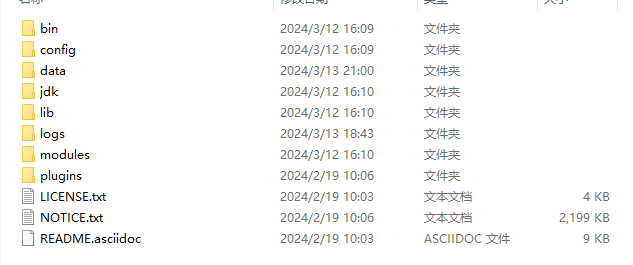


解压后，修改config/elasticsearch.yml配置，然后点击 bin/elasticsearch.bat 文件启动 ES 服务。

```yml
cluster.name: es-8.4.2
node.name: es-9201
path.data: D:\es-cluster\8.4.2\data\9201
path.logs: D:\es-cluster\8.4.2\logs\9201
network.host: 127.0.0.1
http.port: 9201
transport.port: 9301
```


控制台中会输出一段信息：

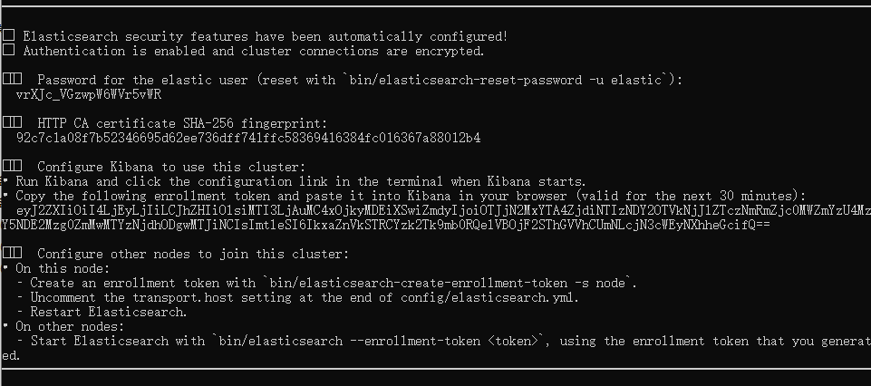

这是 es 自动为环境生产的账号和证书等信息，把它复制保存下来，稍后会用到：

```shell
✅ Elasticsearch security features have been automatically configured!
✅ Authentication is enabled and cluster connections are encrypted.

ℹ️  Password for the elastic user (reset with `bin/elasticsearch-reset-password -u elastic`):
  vrXJc_VGzwpW6WVr5vWR

ℹ️  HTTP CA certificate SHA-256 fingerprint:
  92c7c1a08f7b52346695d62ee736dff741ffc58369416384fc016367a88012b4

ℹ️  Configure Kibana to use this cluster:
• Run Kibana and click the configuration link in the terminal when Kibana starts.
• Copy the following enrollment token and paste it into Kibana in your browser (valid for the next 30 minutes):
  eyJ2ZXIiOiI4LjEyLjIiLCJhZHIiOlsiMTI3LjAuMC4xOjkyMDEiXSwiZmdyIjoiOTJjN2MxYTA4ZjdiNTIzNDY2OTVkNjJlZTczNmRmZjc0MWZmYzU4MzY5NDE2Mzg0ZmMwMTYzNjdhODgwMTJiNCIsImtleSI6IkxaZnVkSTRCYzk2Tk9mb0RQelVBOjF2SThGVVhCUmNLcjN3cWEyNXhheGcifQ==
```

**注意：**9300 端口为 Elasticsearch 集群间组件的通信端口，9200 端口为浏览器访问的 http协议 RESTful 端口。
打开浏览器（推荐使用谷歌浏览器)，输入地址：http://localhost:9201，输入控制台显示的用户名及密码，测试结果如下：

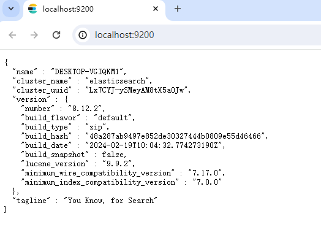

##### Kibana

解压下载的kibana 8.12.2 压缩包，先不用修改配置文件，重写开启一个命令窗口，执行命令：

使用控制台中给出的http://localhost:5601/?code=829265的地址访问 kibana：

输入token（在我们保存的信息中），*注意：token只在生成的30分钟内有效：Copy the following enrollment token and paste it into Kibana in your browser (valid for the next 30 minutes)*

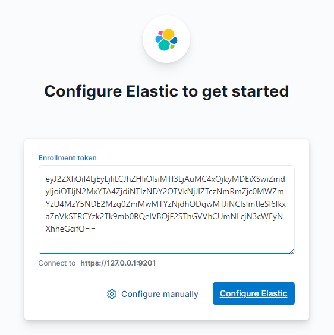

点击 Configure Elastic ，kibana 配置完成后，弹窗登录页，和上面一样，输入用户名和密码。

## Elasticsearch 基本操作

### RESTful

- REST 指的是一组架构约束条件和原则。满足这些约束条件和原则的应用程序或设计就是 RESTful。Web 应用程序最重要的 REST 原则是，客户端和服务器之间的交互在请求之间是无状态的。从客户端到服务器的每个请求都必须包含理解请求所必需的信息。如果服务器在请求之间的任何时间点重启，客户端不会得到通知。此外，无状态请求可以由任何可用服务器回答，这十分适合云计算之类的环境。客户端可以缓存数据以改进性能。
- 在服务器端，应用程序状态和功能可以分为各种资源。资源是一个有趣的概念实体，它向客户端公开。资源的例子有：应用程序对象、数据库记录、算法等等。每个资源都使用 URI(Universal Resource Identifier) 得到一个唯一的地址。所有资源都共享统一的接口，以便在客户端和服务器之间传输状态。使用的是标准的 HTTP 方法，比如 GET、PUT、POST 和DELETE。
- 在 REST 样式的 Web 服务中，每个资源都有一个地址。资源本身都是方法调用的目标，方法列表对所有资源都是一样的。这些方法都是标准方法，包括 HTTP GET、POST、PUT、DELETE，还可能包括 HEAD 和 OPTIONS。简单的理解就是，如果想要访问互联网上的资源，就必须向资源所在的服务器发出请求，请求体中必须包含资源的网络路径，以及对资源进行的操作(增删改查)

### 客户端安装

如果直接通过浏览器向 Elasticsearch 服务器发请求，那么需要在发送的请求中包含HTTP 标准的方法，而 HTTP 的大部分特性且仅支持 GET 和 POST 方法。所以为了能方便地进行客户端的访问，可以使用 Postman 软件

Postman 是一款强大的网页调试工具，提供功能强大的 Web API 和 HTTP 请求调试。软件功能强大，界面简洁明晰、操作方便快捷，设计得很人性化。Postman 中文版能够发送任何类型的 HTTP 请求 (GET, HEAD, POST, PUT..)，不仅能够表单提交，且可以附带任意类型请求体。

Postman 官网：https://www.getpostman.com

Postman 下载：https://www.getpostman.com/apps

### 数据格式

Elasticsearch 是面向文档型数据库，一条数据在这里就是一个文档。为了方便大家理解，我们将 Elasticsearch 里存储文档数据和关系型数据库 MySQL 存储数据的概念进行一个类比ES里的Index可以看做一个库，而Types相当于表，Documents则相当于表的行。

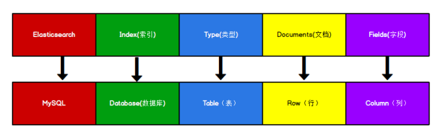

这里Types的概念已经被逐渐弱化，Elasticsearch 6.X中，一个index下已经只能包含一个type，Elasticsearch 7.X中, Type的概念已经被删除了。

### HTTP操作

#### 索引操作

##### 创建索引

对比关系型数据库，创建索引就等同于创建数据库

在 Postman 中，向 ES 服务器发 **PUT** 请求 ：http://127.0.0.1:9200/shopping

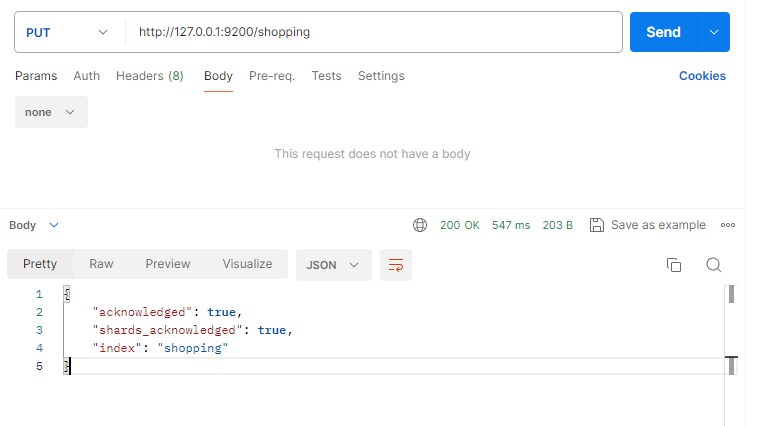

返回结果：

- acknowledged：响应结果。true，操作成功
- shards_acknowledged：分片结果。true，分片操作成功
- index：索引名

如果重复添加索引，会返回错误信息


##### 查看所有索引

在 Postman 中，向 ES 服务器发 GET 请求 ：http://127.0.0.1:9200/_cat/indices?v

这里请求路径中的_cat 表示查看的意思，indices 表示索引，所以整体含义就是查看当前 ES服务器中的所有索引，就好像 MySQL 中的 show tables 的感觉，服务器响应结果如下：


返回结果：

- health：当前服务器健康状态，green：(集群完整) yellow(单点正常、集群不完整) red(单点不正常)
- status：索引打开、关闭状态
- index：索引名
- uuid：索引统一编号
- pri： 主分片数量
- rep ：副本数量
- docs.count：可用文档数量
- docs.deleted：文档删除状态（逻辑删除）
- store.size：主分片和副分片整体占空间大小
- pri.store.size：主分片占空间大小

##### 查看单个索引

在 Postman 中，向 ES 服务器发 **GET** 请求 ：http://127.0.0.1:9200/shopping


返回结果：

- shopping：索引名
- aliases：别名
- mappings：映射
- settings：设置
- index：设置-索引
- creation_date：设置-索引-创建时间
- number_of_shards：设置-索引-主分片数量
- number_of_replicas：设置-索引-副本数量
- uuid：设置-索引-唯一标识
- version：设置-索引-版本
- provided_name：设置-索引-名称

##### 删除索引

在 Postman 中，向 ES 服务器发 DELETE 请求 ：http://127.0.0.1:9200/shopping


#### 文档操作

##### 创建文档

索引已经创建好了，接下来我们来创建文档，并添加数据。这里的文档可以类比为关系型数据库中的表数据，添加的数据格式为 JSON 格式

在 Postman 中，向 ES 服务器发 **POST** 请求 ：http://127.0.0.1:9200/shopping/_doc

请求体内容为：

```json
{
 "title":"小米手机",
 "category":"小米",
 "images":"http://www.gulixueyuan.com/xm.jpg",
 "price":3999.00
}
```

此处发送请求的方式必须为 **POST**，不能是 **PUT**，否则会发生错误


返回结果

- _id：可以类比Mysql中的主键，随机生成
- _version：版本
- _shards：分片

上面的数据创建后，由于没有指定数据唯一性标识（ID），默认情况下，ES 服务器会随机

生成一个。如果想要自定义唯一性标识，需要在创建时指定：http://127.0.0.1:9200/shopping/_doc/1

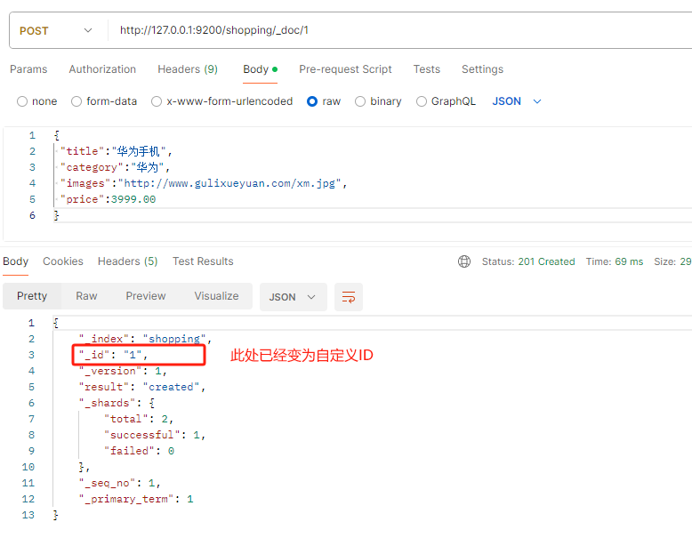

此处需要注意：如果增加数据时明确数据主键，那么请求方式也可以为 PUT

##### 查看文档

查看文档时，需要指明文档的唯一性标识，类似于 MySQL 中数据的主键查询

在 Postman 中，向 ES 服务器发 **GET** 请求 ：http://127.0.0.1:9200/shopping/_doc/1

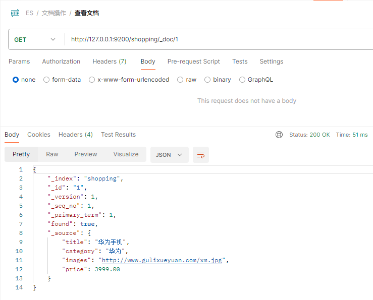

返回结果：

- found：查询结果。true，表示查找到；false表示未查找到
- _source：文档信息源

##### 修改文档

和新增文档一样，输入相同的 URL 地址请求，如果请求体变化，会将原有的数据内容覆盖

在 Postman 中，向 ES 服务器发 **POST** 请求 ：http://127.0.0.1:9200/shopping/_doc/1

```json
{
 "title":"华为手机",
 "category":"华为",
 "images":"http://www.gulixueyuan.com/hw.jpg",
 "price":4999.00
}
```

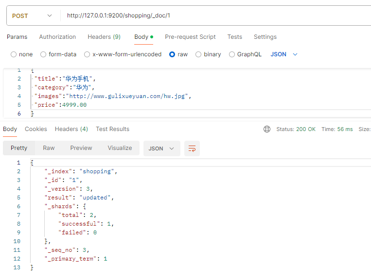

##### 修改字段

修改数据时，也可以只修改某一给条数据的局部信息

在 Postman 中，向 ES 服务器发 **POST** 请求 ：http://127.0.0.1:9200/shopping/_update/1

请求体内容为

```json
{ 
 "doc": {
 "price":3000.00
 } 
}
```


根据唯一性标识，查询文档数据，文档数据已经更新


##### 删除文档

删除一个文档不会立即从磁盘上移除，它只是被标记成已删除（逻辑删除）。

在 Postman 中，向 ES 服务器发 **DELETE** 请求 ：http://127.0.0.1:9200/shopping/_doc/1


删除后再查询当前文档信息


##### 条件删除文档

一般删除数据都是根据文档的唯一性标识进行删除，实际操作时，也可以根据条件对多条数据进行删除。

首先分别增加多条数据:

```json
{
 "title":"华为手机1",
 "category":"华为1",
 "images":"http://www.gulixueyuan.com/xm.jpg",
 "price":3999.00
}
{
 "title":"华为手机2",
 "category":"华为2",
 "images":"http://www.gulixueyuan.com/xm.jpg",
 "price":4000.00
}
{
 "title":"华为手机3",
 "category":"华为3",
 "images":"http://www.gulixueyuan.com/xm.jpg",
 "price":4000.00
}
{
 "title":"华为手机4",
 "category":"华为4",
 "images":"http://www.gulixueyuan.com/xm.jpg",
 "price":4999.00
}
```


请求体内容

```json
{
 "query":{
 "match":{
 "price":4000.00
 }
 }
}
```

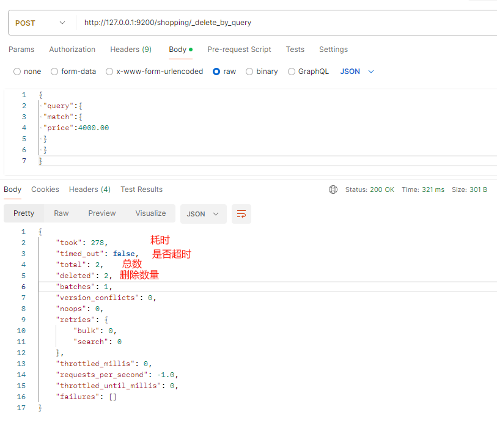

#### 映射操作

有了索引库，等于有了数据库中的 database。
接下来就需要建索引库(index)中的映射了，类似于数据库(database)中的表结构(table)。创建数据库表需要设置字段名称，类型，长度，约束等；索引库也一样，需要知道这个类型下有哪些字段，每个字段有哪些约束信息，这就叫做映射(mapping)。

如果没有显示声明映射，则ES会自动推断字段类型，即动态映射（根据字段取值推断字段类型）。

除了动态映射还有静态映射，即手段创建索引时指定字段的参数。参照`索引映射关联`例子。

##### 创建映射

在 Postman 中，向 ES 服务器发 PUT 请求 ：http://127.0.0.1:9200/student/_mapping
请求体内容为

```json
 "properties": {
 "name":{
 "type": "text",
 "index": true
 },
 "sex":{
 "type": "text",
 "index": false
 },
 "age":{
 "type": "long",
 "index": false
 }
 }
}
```

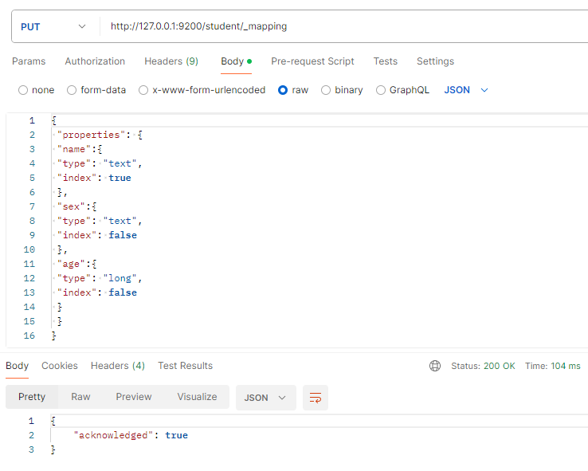

映射数据说明：

- 字段名：任意填写，下面指定许多属性，例如：title、subtitle、images、price

- type：类型，Elasticsearch 中支持的数据类型非常丰富，说几个关键的：

  - String 类型，又分两种：

    text：可分词
    keyword：不可分词，数据会作为完整字段进行匹配

  - Numerical：数值类型，分两类

    基本数据类型：long、integer、short、byte、double、float、half_float

    浮点数的高精度类型：scaled_float

  - Date：日期类型

  -  Array：数组类型

  - Object：对象

- index：是否索引，默认为 true，也就是说你不进行任何配置，所有字段都会被索引。

  true：字段会被索引，则可以用来进行搜索

  false：字段不会被索引，不能用来搜索

- store：是否将数据进行独立存储，默认为 false

  原始的文本会存储在_source 里面，默认情况下其他提取出来的字段都不是独立存储
  的，是从_source 里面提取出来的。当然你也可以独立的存储某个字段，只要设置
  "store": true 即可，获取独立存储的字段要比从_source 中解析快得多，但是也会占用
  更多的空间，所以要根据实际业务需求来设置。

- analyzer：分词器，这里的 ik_max_word 即使用 ik 分词器,后面会有专门的章节学习

##### 查看映射

在 Postman 中，向 ES 服务器发 GET 请求 ：http://127.0.0.1:9200/student/_mapping

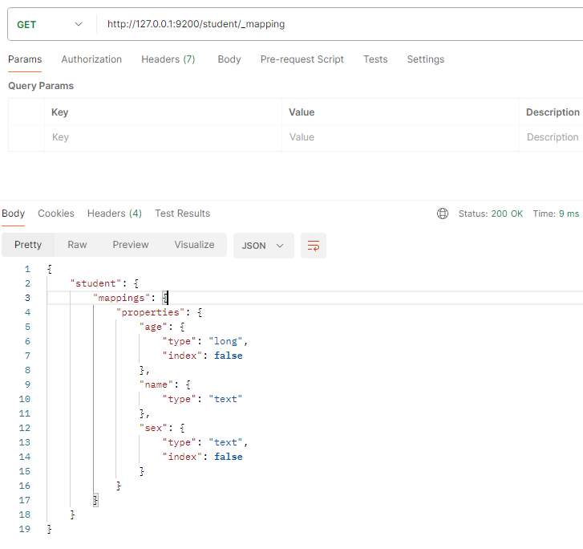

#####   索引映射关联

在 Postman 中，向 ES 服务器发 PUT 请求 ：http://127.0.0.1:9200/student1

```json
{
 "settings": {},
 "mappings": {
 "properties": {
    "name":{
     "type": "text",
     "index": true

    },
    "sex":{
     "type": "text",
     "index": false
    },
    "age":{
     "type": "long",
     "index": false
    }
 }
 }
}
```


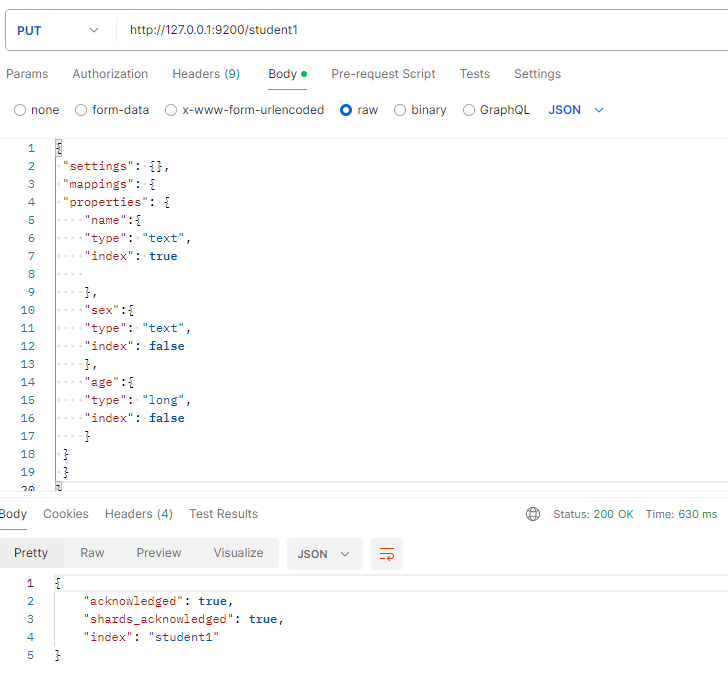

  说明：与创建映射的区别是，创建映射之前必须先创建索引，而索引映射关联不需要

建议：针对中文，索引时分词粒度越细越好，使用ik_max_word,但搜索时建议使用ik_smart.

例如：

创建索引映射：https://localhost:9200/myindex PUT

```json
{
    "settings": {},
    "mappings": {
        "properties": {
            "content": {
                "type": "text",
                "analyzer": "ik_max_word",
                "search_analyzer": "ik_smart"
            },
            "title1": {
                "type": "object",
                "enabled": false
            },
            "title2": {
                "type": "keyword"
            }
        }
    }
}
```

创建文档：https://localhost:9200/myindex/_doc/1 PUT

```json
{
    "content": "这是一个演示张三的字段",
    "title1": "张三",
    "title2": "张三"
}
```

查询文档：https://localhost:9200/myindex/_search GET

```json
//查询文档content字段
{
    "query": {
        "term":{
            "content":{
                "value":"张三"
            }
        }
    }
}
//查询文档title1字段
{
    "query": {
        "term":{
            "title1":{
                "value":"张三"
            }
        }
    }
}
//查询文档title2字段
{
    "query": {
        "term":{
            "title2":{
                "value":"张三"
            }
        }
    }
}
```

结果如下：

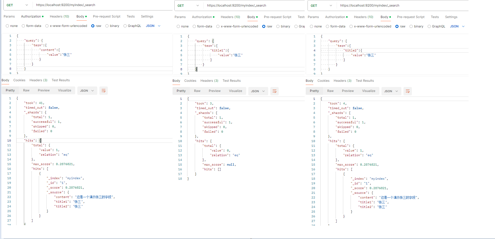

结论：

- enabled：默认为true。把es中object类型字段设置为false，es不去解析该字段，并且该字段不能被查询和store，只有在_source字段中才能被看到_
- index：默认为true。设置为false时，该字段不能被查询，如果查询会报错。但是可以被store，该字段在_source字段中可以被看到，且字段可以被排序和聚合

####   高级查询

Elasticsearch 提供了基于 JSON 提供完整的查询 DSL 来定义查询

创建映射：

```json
//http://127.0.0.1:9200/student/_mapping
{
 "properties": {
    "name":{
    "type": "text",
    "index": true
    },
    "nickname":{
    "type": "text",
    "index": true
    },
    "sex":{
    "type": "text",
    "index": false
    },
    "age":{
    "type": "long",
    "index": false
    }
 }
}
```


创建数据 :

```json
//POST /student/_doc/1001
{
"name":"zhang san",
"nickname":"zhang san",
 "sex":"男",
 "age":30
}
//POST /student/_doc/1002
{
"name":"lisi",
"nickname":"lisi",
 "sex":"男",
 "age":20
}
//POST /student/_doc/1003
{
"name":"wangwu",
 "nickname":"wangwu",
 "sex":"女",
 "age":40
}
//# POST /student/_doc/1004
{
"name":"zhangsan1",
"nickname":"zhangsan1",
 "sex":"女",
 "age":50
}
//POST /student/_doc/1005
{
"name":"zhangsan2",
"nickname":"zhangsan2",
 "sex":"女",
 "age":30
}
//POST /student/_doc/1006
{
"name":"zhang jie",
"nickname":"zhang jie",
 "sex":"女",
 "age":30
}
//POST /student/_doc/1007
{
"name":"wang san",
"nickname":"wang san",
 "sex":"女",
 "age":30
}
```

##### 查询所有文档

在 Postman 中，向 ES 服务器发 GET 请求 ：http://127.0.0.1:9200/student/_search

```json
{
 "query": {
 "match_all": {}
 }
}
//"query"：这里的 query 代表一个查询对象，里面可以有不同的查询属性
//"match_all"：查询类型，例如：match_all(代表查询所有)， match，term ， range 等等
//{查询条件}：查询条件会根据类型的不同，写法也有差异
```


  返回结果：

- took：查询花费时间，单位毫秒
- timed_out：是否超时
- _shards：分片信息
  - total：总数
  - successful：成功
  - skipped：忽略
  - failed：失败
- hits：搜索命中结果
  - total：搜索条件匹配的文档总数
    - value：总命中计数的值
    - relation：计数规则。 eq 表示计数准确， gte 表示计数不准确
  - max_score：匹配度分值
  - hits：命中结果集合

##### 匹配查询

match 匹配类型查询，会把查询条件进行分词，然后进行查询，多个词条之间是 or 的关系
在 Postman 中，向 ES 服务器发 GET 请求 ：http://127.0.0.1:9200/student/_search

```json
{
 "query":{
    "match":{ 
        "name":"zhang"
    }
 }
}
```

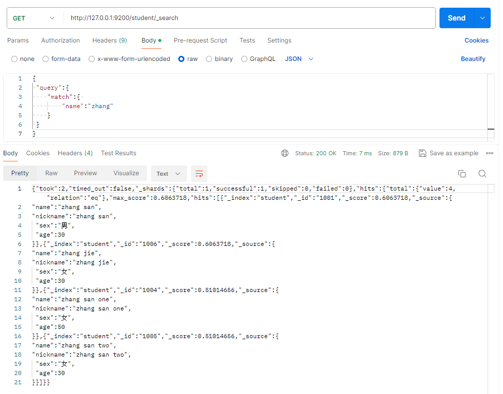

##### 字段匹配查询

multi_match 与 match 类似，不同的是它可以在多个字段中查询。
在 Postman 中，向 ES 服务器发 GET 请求 ：http://127.0.0.1:9200/student/_search

```json
{
 "query": {
    "multi_match": {
    "query": "one",
    "fields": ["name","nickname"]
    }
 }
}
```


##### 关键字精确查询

term 查询，精确的关键词匹配查询，不对查询条件进行分词。
在 Postman 中，向 ES 服务器发 GET 请求 ：http://127.0.0.1:9200/student/_search

```json
{
 "query": {
    "term": {
        "name": "zhang"
    }
 }
}
```

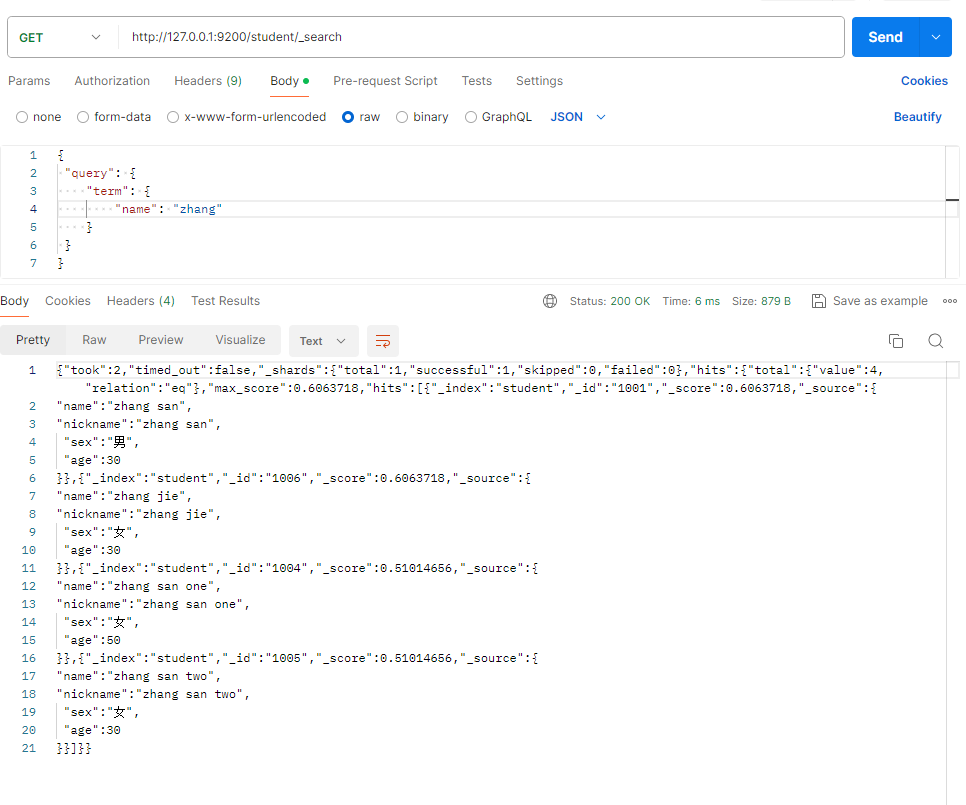

**`match与term区别`**

- term：代表完全匹配，也就是精确查询，搜索前不会再对搜索词进行分词解析，直接对搜索词进行查找；
- match：代表模糊匹配，搜索前会对搜索词进行分词解析，然后按分词匹配查找；
- term主要用于精确搜索，match则主要用于模糊搜索；
- term精确搜索相较match模糊查询而言，效率较高；

以上面数据源为例。进行演示:

- term：代表完全匹配，也就是精确查询，搜索前不会再对搜索词进行分词解析，直接对搜索词进行查找；
- match：代表模糊匹配，搜索前会对搜索词进行分词解析，然后按分词匹配查找；

```json
//term
{
 "query": {
    "term": {
        "name": "zhang san"
    }
 }
}
//match
{
 "query":{
    "match":{ 
        "name":"zhang san"
    }
 }
}
```


如果我们只想精确匹配"张三"这个词，term查询出来显示无数据，从概念上看，term属于精确匹配，只能查单个词。

**terms**

如果我们想通过term匹配多个词的话，可以使用terms来实现：

```json
{
 "query": {
    "terms": {
        "name": ["zhang","san"]
    }
 }
}
```


可以看到，与含有“zhang”和"san"数据都成功返回，**因为terms里的`[ ]` 多个搜索词之间是or（或者）关系，只要满足其中一个词即可。**

**match_phrase**

match_phrase 称为短语搜索，要求所有的分词必须同时出现在文档中，同时位置必须紧邻一致。

```json
{
 "query":{
    "match_phrase":{ 
        "name":"zhang san"
    }
 }
}
```


##### 指定查询字段

默认情况下，Elasticsearch 在搜索的结果中，会把文档中保存在_source 的所有字段都返回。

如果我们只想获取其中的部分字段，我们可以添加_source 的过滤

在 Postman 中，向 ES 服务器发 GET 请求 ：http://127.0.0.1:9200/student/_search

```json
{
 "_source": ["name","nickname"], 
 "query": {
    "terms": {
    "nickname": ["li"]
    }
 }
}
```


##### 过滤字段

我们也可以通过：

- includes：来指定想要显示的字段
- excludes：来指定不想要显示的字段

在 Postman 中，向 ES 服务器发 GET 请求 ：http://127.0.0.1:9200/student/_search

```json
{
 "_source": {
 "includes": ["name","nickname"]
 },
 "query": {
    "terms": {
    "nickname": ["li"]
    }
 }
}
```


在 Postman 中，向 ES 服务器发 **GET** 请求 ：http://127.0.0.1:9200/student/_search

```json
{
 "_source": {
 "excludes": ["name","nickname"]
 },
 "query": {
    "terms": {
    "nickname": ["li"]
    }
 }
}
```

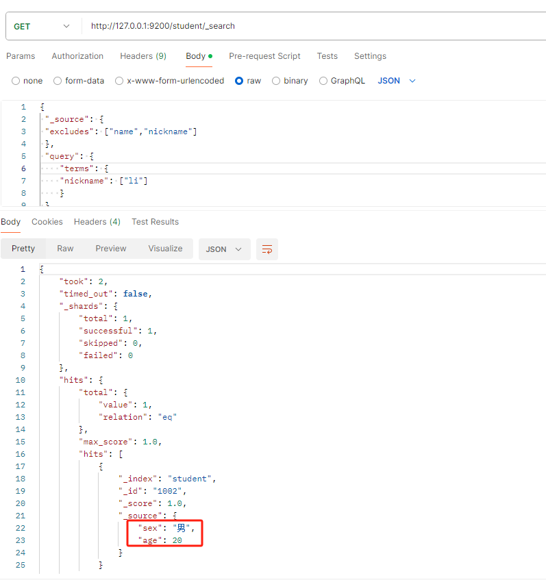

##### 范围查询

range 查询找出那些落在指定区间内的数字或者时间。range 查询允许以下字符：

| 操作符 |   说明   |
| :----: | :------: |
|   gt   |   大于   |
|  gte   | 大于等于 |
|   lt   |   小于   |
|  lte   | 小于等于 |

```json
{
    "query": {
        "range": {
            "age": {
            "gte": 50,
            "lte": 60
            }
        }
    }
}
```


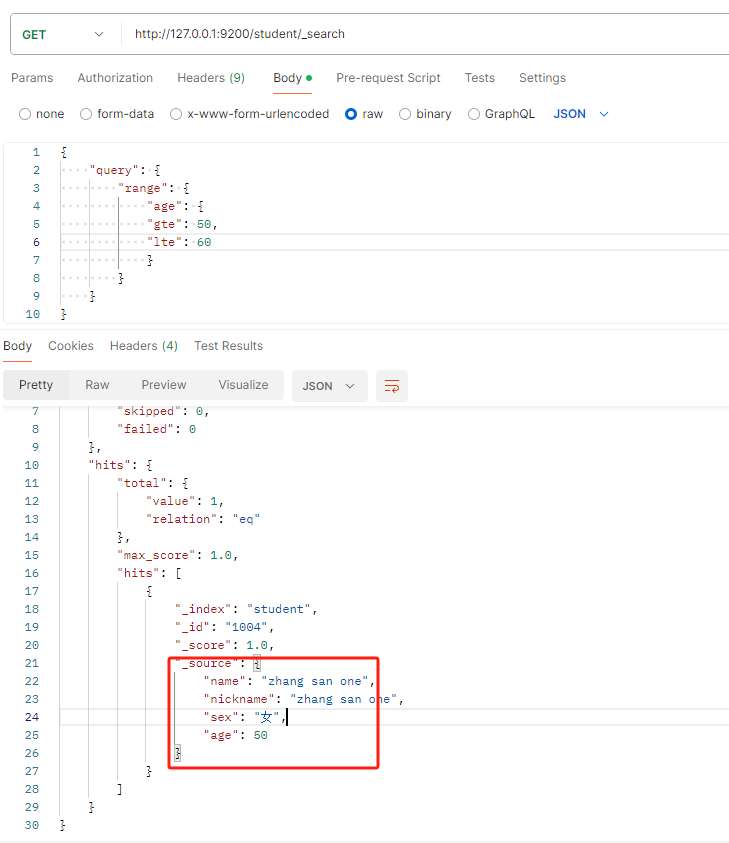

##### 模糊查询

返回包含与搜索字词相似的字词的文档。

编辑距离是将一个术语转换为另一个术语所需的一个字符更改的次数。这些更改可以包括：

- 更改字符（box → fox）
- 删除字符（black → lack）
- 插入字符（sic → sick）
- 转置两个相邻字符（act → cat）

为了找到相似的术语，fuzzy 查询会在指定的编辑距离内创建一组搜索词的所有可能的变体或扩展。然后查询返回每个扩展的完全匹配。

通过 fuzziness 修改编辑距离。一般使用默认值 AUTO，根据术语的长度生成编辑距离。

fuzziness 参数可以配置为以下值：

- 0、1、2：允许对术语进行的编辑量。( 0：编辑次数仅允许完全匹配)
- AUTO：根据输入项的大小，定义编辑次数。

在 Postman 中，向 ES 服务器发 GET 请求 ：http://127.0.0.1:9200/student/_search

```json
{
    "query": {
        "fuzzy": {
            "name": {
            "value": "lit"
            }
        }
    }
}
```

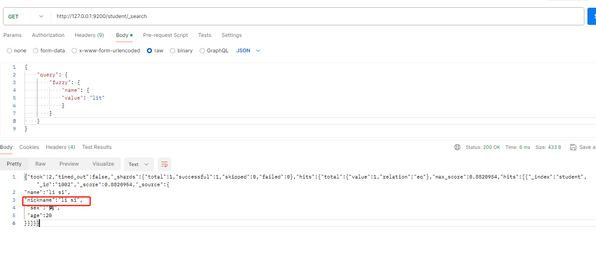

模糊性是拼写错误的简单解决方案，但具有很高的CPU开销和非常低的精度，所以需要慎重使用。

##### 布尔查询

- must：文档必须匹配选择中的查询条件  AND
- should: 文档可以匹配也可以不匹配选择中的查询条件  OR
- must_not: 和must相反
- filter：和must一样，但不是算分数，至少过滤

例如：

```json
{
    "query": {
        "bool":{
            "must":[{
                "match":{"title":".NET"}
            }],
            "must_not":[{
                "range":{"price":{"gte":70}}
            }],
            "should":[{
                "match":{"description":"程序"}
            }]
        }
    }
}
```

##### 单字段排序

搜索排序,默认按照评分降序，但分片数量会对分片造成影响。分片数量越多，文档越分散，更容易产生文档分布不均匀的情况，评分影响越大。

获取精准评分的方法(查询时使用参数_search_type=dfs_query_then_fetch)：

http://127.0.0.1:9200/student/_search?_search_type=dfs_query_then_fetch

ES默认不使用这种方式的原因是：增加了N次的额外请求，因为它需要获取所有分片的数据再进行分析。

sort 可以让我们按照不同的字段进行排序，并且通过 order 指定排序的方式。desc 降序，asc升序。
在 Postman 中，向 ES 服务器发 GET 请求 ：http://127.0.0.1:9200/student/_search

```json
{
    "query": {
        "match": {
            "sex":"男"
            }
    },
    "sort": [{
        "age": {
            "order":"desc"
        }
     }]
}
```

##### 多字段排序

假定我们想要结合使用 age 和 _score 进行查询，并且匹配的结果首先按照年龄排序，然后按照相关性得分排序

在 Postman 中，向 ES 服务器发 **GET** 请求 ：http://127.0.0.1:9200/student/_search

```json
{
    "query": {
        "match_all": {}
    },
    "sort": [{
        "age": {
            "order":"desc"
        }
     },
     {
        "_score": {
            "order":"desc"
        }
     }]
}
```

##### 高亮查询

Elasticsearch 可以对查询内容中的关键字部分，进行标签和样式(高亮)的设置。

Elasticsearch高亮分为三种方式：

- #### 传统plain高亮方式（默认）

  官网明确支持，该方式匹配慢，如果出现性能问题，请考虑其他高亮方式。

- #### postings 高亮方式

  支持postings高亮方式，需要在mapping下添加如下信息,添加完毕后，posting高亮方式将取代传统的高亮方式：

  ```json
  "type": "text",
  "index_options" : "offsets"
  ```

  posting高亮方式的特点：

  - 速度快，不需要对高亮的文档再分析。文档越大，获得越高 性能 。
  - 比fvh高亮方式需要的磁盘空间少。
  - 将text文件分割成语句并对其高亮处理。对于自然语言发挥作用明显，但对于html则不然。
  - 将文档视为整个语料库，并 使用BM25算法 为该语料库中的文档打分。
    

- #### fast-vector-highlighter 简称fvh高亮方式

  如果在mapping中的text类型字段下添加了如下信息,fvh高亮方式将取代传统的plain高亮方式:

  ```json
  "type": "text",
  "term_vector" : "with_positions_offsets"
  ```

  fvh高亮方式的特点如下：

  - 当文件>1MB(大文件）时候，尤其适合fvh高亮方式。
  - 自定义为 boundary_scanner的扫描方式。
  - 设定了 term_vector to with_positions_offsets会增加索引的大小。
  - 能联合多字段匹配返回一个结果，详见matched_fields。
  - 对于不同的匹配类型分配不同的权重，如：pharse匹配比term匹配高。

总结：速度（由快->满）:

- fvh：快速矢量，即使用词条向量，它是ES在索引文档时生成的分词信息，它是额外存储，但需要更多的空间。
- posting：不需要二次分析，但需要在倒排索引中保存偏移量信息。默认不存储偏移量，需要将mapings中的index_options参数设置为offsets，保存偏移量信息。
- plan：需要二次分析

在使用 match 查询的同时，加上一个 highlight 属性：

- pre_tags：前置标签（如果不配置该属性则使用默认标签<em>）
- post_tags：后置标签(如果不配置该属性则使用默认标签<em>）
- fields：需要高亮的字段
- title：这里声明 title 字段需要高亮，后面可以为这个字段设置特有配置，也可以空

在 Postman 中，向 ES 服务器发 GET 请求 ：http://127.0.0.1:9200/student/_search

```json
{
    "query": {
        "match": {
        "name": "li"
        }
    },
    "highlight": {
    "pre_tags": "<font color='red'>",
    "post_tags": "</font>",
        "fields": {
        "name": {}
        }
    }
}
```


##### 分页查询

from：当前页的起始索引，默认从 0 开始。 from = (pageNum - 1) * size
size：每页显示多少条
在 Postman 中，向 ES 服务器发 GET 请求 ：http://127.0.0.1:9200/student/_search

```json
{
    "query": {
    "match_all": {}
    },
    "sort": [{
        "age": {
        "order": "desc"
        }
    }],
    "from": 0,
    "size": 2
}
```


##### 聚合查询

聚合允许使用者对 es 文档进行统计分析，类似与关系型数据库中的 group by，当然还有很多其他的聚合，例如取最大值、平均值等等。

聚合字段必须是精确值，text类型默认不参与聚合，除非启动fielddata。

聚合依赖两个结构：doc_values（列式存储）,fielddata（text）

- 对某个字段取最大值 max

  在 Postman 中，向 ES 服务器发 GET 请求 ：http://127.0.0.1:9200/student/_search

  ```JSON
  {
      "aggs":{
          "max_age":{
          "max":{"field":"age"}
          }
      },
      "size":0
  }
  ```

  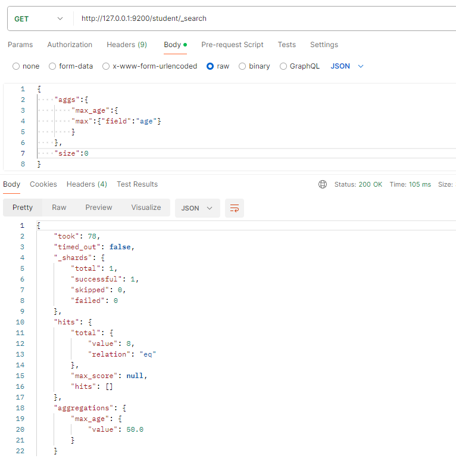

- 对某个字段取最小值 min

  在 Postman 中，向 ES 服务器发 GET 请求 ：http://127.0.0.1:9200/student/_search

  ```json
  {
      "aggs":{
          "min_age":{
          "min":{"field":"age"}
          }
      },
      "size":0
  }
  ```

  

  

- 对某个字段求和 sum

  在 Postman 中，向 ES 服务器发 GET 请求 ：http://127.0.0.1:9200/student/_search

  ```json
  {
      "aggs":{
          "sum_age":{
          "sum":{"field":"age"}
          }
      },
      "size":0
  }
  ```

  

  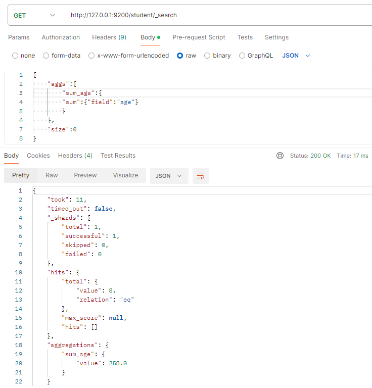

- 对某个字段取平均值 avg

  在 Postman 中，向 ES 服务器发 GET 请求 ：http://127.0.0.1:9200/student/_search

  ```json
  {
      "aggs":{
          "avg_age":{
          "avg":{"field":"age"}
          }
      },
      "size":0
  }
  ```

  

  

- 基数聚合

  对某个字段的值进行去重之后再取总数，这个结果是近视值，它使用的是HyperLoglog近似算法，在保持内存相对较小的情况下，提供近似结果

  在 Postman 中，向 ES 服务器发 GET 请求 ：http://127.0.0.1:9200/student/_search

  ```json
  {
      "aggs":{
          "distinct_age":{
          "cardinality":{"field":"age"}
          }
      },
      "size":0
  }
  ```

  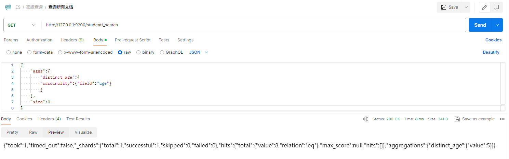

- Stats 聚合

  stats 聚合，对某个字段一次性返回 count，max，min，avg 和 sum 五个指标

  在 Postman 中，向 ES 服务器发 GET 请求 ：http://127.0.0.1:9200/student/_search

  ```json
  {
      "aggs":{
          "stats_age":{
          "stats":{"field":"age"}
          }
      },
      "size":0
  }
  ```

  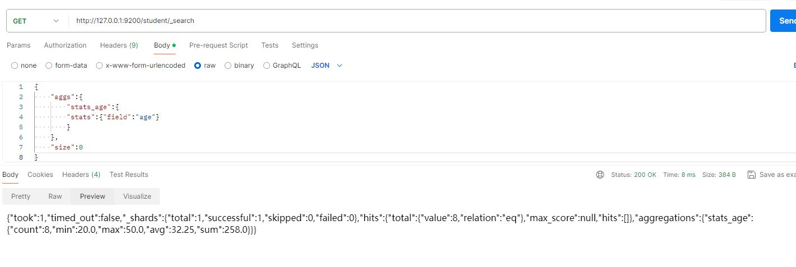

##### 桶聚合查询

桶聚和相当于 sql 中的 group by 语句

- terms 聚合，分组统计
  在 Postman 中，向 ES 服务器发 GET 请求 ：http://127.0.0.1:9200/student/_search

  ```json
  {
      "aggs":{
          "age_groupby":{
          "terms":{"field":"age"}
          }
      },
      "size":0
  }
  ```

  

- 在 terms 分组下再进行聚合

  在 Postman 中，向 ES 服务器发 GET 请求 ：http://127.0.0.1:9200/student/_search

  ```json
  {
      "aggs":{
          "age_groupby":{
              "terms":{"field":"age"},
              "aggs":{
                  "sum_age":{
                      "sum":{"field":"age"}
                  }
              }
          }
      },
      "size":0
  }
  ```

  

- 直方图聚合

##### 管道聚合

# Elasticsearch环境

## 相关概念

### 单机 & 集群

单台 Elasticsearch 服务器提供服务，往往都有最大的负载能力，超过这个阈值，服务器性能就会大大降低甚至不可用，所以生产环境中，一般都是运行在指定服务器集群中。除了负载能力，单点服务器也存在其他问题：

- 单台机器存储容量有限
- 单服务器容易出现单点故障，无法实现高可用
- 单服务的并发处理能力有限

配置服务器集群时，集群中节点数量没有限制，大于等于 2 个节点就可以看做是集群了。一般出于高性能及高可用方面来考虑集群中节点数量都是 3 个以上。

### 集群 Cluster

一个集群就是由一个或多个服务器节点组织在一起，共同持有整个的数据，并一起提供索引和搜索功能。一个 Elasticsearch 集群有一个唯一的名字标识，这个名字默认就是”elasticsearch”。这个名字是重要的，因为一个节点只能通过指定某个集群的名字，来加入这个集群。

### 节点 Node

集群中包含很多服务器，一个节点就是其中的一个服务器。作为集群的一部分，它存储数据，参与集群的索引和搜索功能。

一个节点也是由一个名字来标识的，默认情况下，这个名字是一个随机的漫威漫画角色的名字，这个名字会在启动的时候赋予节点。这个名字对于管理工作来说挺重要的，因为在这个管理过程中，你会去确定网络中的哪些服务器对应于 Elasticsearch 集群中的哪些节点。

一个节点可以通过配置集群名称的方式来加入一个指定的集群。默认情况下，每个节点都会被安排加入到一个叫做“elasticsearch”的集群中，这意味着，如果你在你的网络中启动了若干个节点，并假定它们能够相互发现彼此，它们将会自动地形成并加入到一个叫做“elasticsearch”的集群中。

在一个集群里，只要你想，可以拥有任意多个节点。而且，如果当前你的网络中没有运行任何 Elasticsearch 节点，这时启动一个节点，会默认创建并加入一个叫做“elasticsearch”的集群

## Windows集群

### 部署集群

- es-001节点

  ```yml
  cluster.name: myelastic
  node.name: es-001
  #path.data: D:\es-cluster\8.4.2\data\9201
  #path.logs: D:\es-cluster\8.4.2\logs\9201
  #ip 地址
  network.host: 127.0.0.1
  #http 端口
  http.port: 9201
  #tcp 监听端口
  transport.port: 9301
  #候选主节点的地址，在开启服务后可以被选为主节点
  discovery.seed_hosts: ["127.0.0.1:9301","127.0.0.1:9302","127.0.0.1:9303"]
  #集群内的可以被选为主节点的节点列表
  cluster.initial_master_nodes: ["es-001", "es-002", "es-003"]
  #跨域配置
  http.cors.enabled: true
  http.cors.allow-origin: "*"
  #禁用XPACK安全认证
  xpack.security.enabled: false
  xpack.security.enrollment.enabled: false
  ```
  
  

- es-002节点

  ```yml
  cluster.name: myelastic
  node.name: es-002
  #path.data: D:\es-cluster\8.4.2\data\9201
  #path.logs: D:\es-cluster\8.4.2\logs\9201
  #ip 地址
  network.host: 127.0.0.1
  #http 端口
  http.port: 9202
  #tcp 监听端口
  transport.port: 9302
  #候选主节点的地址，在开启服务后可以被选为主节点
  discovery.seed_hosts: ["127.0.0.1:9301","127.0.0.1:9302","127.0.0.1:9303"]
  #集群内的可以被选为主节点的节点列表
  cluster.initial_master_nodes: ["es-001", "es-002", "es-003"]
  #跨域配置
  http.cors.enabled: true
  http.cors.allow-origin: "*"
  #禁用XPACK安全认证
  xpack.security.enabled: false
  xpack.security.enrollment.enabled: false
  ```
  
  

- node-1003节点

  ```yml
  cluster.name: myelastic
  node.name: es-003
  #path.data: D:\es-cluster\8.4.2\data\9201
  #path.logs: D:\es-cluster\8.4.2\logs\9201
  #ip 地址
  network.host: 127.0.0.1
  #http 端口
  http.port: 9203
  #tcp 监听端口
  transport.port: 9303
  #候选主节点的地址，在开启服务后可以被选为主节点
  discovery.seed_hosts: ["127.0.0.1:9301","127.0.0.1:9302","127.0.0.1:9303"]
  #集群内的可以被选为主节点的节点列表
  cluster.initial_master_nodes: ["es-001", "es-002", "es-003"]
  #跨域配置
  http.cors.enabled: true
  http.cors.allow-origin: "*"
  #禁用XPACK安全认证
  xpack.security.enabled: false
  xpack.security.enrollment.enabled: false
  ```

### 启动集群

- 启动前先删除每个节点中的 data 目录中所有内容（如果存在）
- 分别双击执行 bin/elasticsearch.bat, 启动节点服务器，启动后，会自动加入指定名称的集群

### 测试集群

- 查看集群状态

  http://127.0.0.1:9201/_cluster/health

  http://127.0.0.1:9202/_cluster/health

  http://127.0.0.1:9203/_cluster/health

  
  
  status字段指示当前集群在总体上是否工作正常。它的三种颜色含义如下：
  
  - green：所有的主分片和副本分片都正常运行
  - yellow：所有的主分片都正常运行，但不是所有的副本分片都正常运行
  - red：有主分片没能正常运行

## Linux单机

### Docker部署

```shell
#创建elastic专用网络
docker network create elastic
#运行es容器
docker run -d --name es01 --net elastic -p9200:9200 -p9300:9300 -t docker.elastic.co/elasticsearch/elasticsearch:8.12.2
#运行kibana容器
docker run -d --name kibana --net elastic -p5601:5601 docker.elastic.co/kibana/kibana:8.12.2
#重新生成kibanaToken
#Token有效期为30min
docker exec -it es01 /usr/share/elasticsearch/bin/elasticsearch-create-enrollment-token-skibana
```

> 错误：Couldn't configure Elastic Generate an ewenrollment token or configure manually.
>
> 原因：Token过期需要重新生成

### 测试软件

访问http://192.168.1.102:9200/


Postman访问

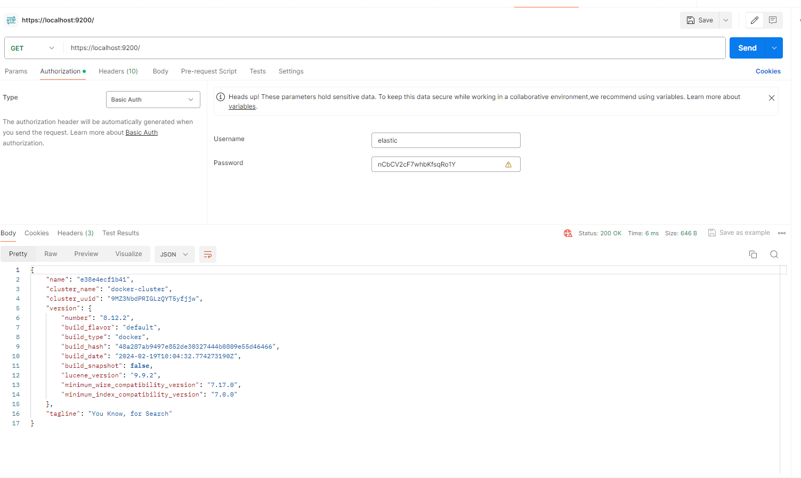

## 集群部署

```shell
#获取集群现有节点令牌
docker exec -it es01 /usr/share/elasticsearch/bin/elasticsearch-create-enrollment-token-snode

#添加ES集群节点es02
docker run -d --name es02 --net elastic -p 9201:9200 -p 9301:9300 -e ENROLLMENT_TOKEN="这里填写上一步的令牌" -t docker.elastic.co/elasticsearch/elasticsearch:8.12.2
#添加ES集群节点es02
docker run -d --name es03 --net elastic -p 9202:9200 -p 9302:9300 -e ENROLLMENT_TOKEN="这里填写上一步的令牌" -t docker.elastic.co/elasticsearch/elasticsearch:8.12.2
```

`不知道是不是因为虚拟机配置太低，总是会运行失败`

# Elasticsearch进阶

## 核心概念

#### 索引

一个索引就是一个拥有几分相似特征的文档的集合。比如说，你可以有一个客户数据的索引，另一个产品目录的索引，还有一个订单数据的索引。一个索引由一个名字来标识（必须全部是小写字母），并且当我们要对这个索引中的文档进行索引、搜索、更新和删除的时候，都要使用到这个名字。在一个集群中，可以定义任意多的索引。

能搜索的数据必须索引，这样的好处是可以提高查询速度，比如：新华字典前面的目录
就是索引的意思，目录可以提高查询速度。

Elasticsearch 索引的精髓：一切设计都是为了提高搜索的性能

#### 文档

一个文档是一个可被索引的基础信息单元，也就是一条数据

比如：你可以拥有某一个客户的文档，某一个产品的一个文档，当然，也可以拥有某个订单的一个文档。文档以 JSON（Javascript Object Notation）格式来表示，而 JSON 是一个到处存在的互联网数据交互格式。

在一个 index/type 里面，你可以存储任意多的文档。

#### 字段

相当于是数据表的字段，对文档数据根据不同属性进行的分类标识

#### 映射

mapping 是处理数据的方式和规则方面做一些限制，如：某个字段的数据类型、默认值、分析器、是否被索引等等。这些都是映射里面可以设置的，其它就是处理 ES 里面数据的一些使用规则设置也叫做映射，按着最优规则处理数据对性能提高很大，因此才需要建立映射，并且需要思考如何建立映射才能对性能更好。

#### 分片

一个索引可以存储超出单个节点硬件限制的大量数据。比如，一个具有 10 亿文档数据的索引占据 1TB 的磁盘空间，而任一节点都可能没有这样大的磁盘空间。或者单个节点处理搜索请求，响应太慢。为了解决这个问题，Elasticsearch 提供了将索引划分成多份的能力，每一份就称之为分片。当你创建一个索引的时候，你可以指定你想要的分片的数量。每个分片本身也是一个功能完善并且独立的“索引”，这个“索引”可以被放置到集群中的任何节点上。

分片很重要，主要有两方面的原因：

- 允许你水平分割 / 扩展你的内容容量。
- 允许你在分片之上进行分布式的、并行的操作，进而提高性能/吞吐量。

至于一个分片怎样分布，它的文档怎样聚合和搜索请求，是完全由 Elasticsearch 管理的，
对于作为用户的你来说，这些都是透明的，无需过分关心。

被混淆的概念是，一个 Lucene 索引 我们在 Elasticsearch 称作 分片 。 一个Elasticsearch 索引 是分片的集合。 当 Elasticsearch 在索引中搜索的时候， 他发送查询到每一个属于索引的分片(Lucene 索引)，然后合并每个分片的结果到一个全局的结果集。

#### 副本

在一个网络/云的环境里，失败随时都可能发生，在某个分片/节点不知怎么的就处于离线状态，或者由于任何原因消失了，这种情况下，有一个故障转移机制是非常有用并且是强烈推荐的。为此目的，Elasticsearch 允许你创建分片的一份或多份拷贝，这些拷贝叫做复制分片(副本)。

复制分片之所以重要，有两个主要原因：

- 在分片/节点失败的情况下，提供了高可用性。因为这个原因，注意到复制分片从不与原/主要（original/primary）分片置于同一节点上是非常重要的。
- 扩展你的搜索量/吞吐量，因为搜索可以在所有的副本上并行运行。

总之，每个索引可以被分成多个分片。一个索引也可以被复制 0 次（意思是没有复制）或多次。一旦复制了，每个索引就有了主分片（作为复制源的原来的分片）和复制分片（主分片的拷贝）之别。分片和复制的数量可以在索引创建的时候指定。在索引创建之后，你可以在任何时候动态地改变复制的数量，但是你事后不能改变分片的数量。默认情况下，Elasticsearch 中的每个索引被分片 1 个主分片和 1 个复制，这意味着，如果你的集群中至少有两个节点，你的索引将会有 1 个主分片和另外 1 个复制分片（1 个完全拷贝），这样的话每个索引总共就有 2 个分片，我们需要根据索引需要确定分片个数。

#### 分配

将分片分配给某个节点的过程，包括分配主分片或者副本。如果是副本，还包含从主分片复制数据的过程。这个过程是由master节点完成的

## 系统架构

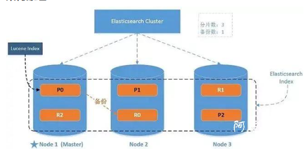

一个运行中的 Elasticsearch 实例称为一个节点，而集群是由一个或者多个拥有相同cluster.name 配置的节点组成，它们共同承担数据和负载的压力。当有节点加入集群中或者从集群中移除节点时，集群将会重新平均分布所有的数据。当一个节点被选举成为主节点时， 它将负责管理集群范围内的所有变更，例如增加、删除索引，或者增加、删除节点等。 而主节点并不需要涉及到文档级别的变更和搜索等操作，所以当集群只拥有一个主节点的情况下，即使流量的增加它也不会成为瓶颈。 任何节点都可以成为主节点。我们的示例集群就只有一个节点，所以它同时也成为了主节点。作为用户，我们可以将请求发送到集群中的任何节点 ，包括主节点。 每个节点都知道任意文档所处的位置，并且能够将我们的请求直接转发到存储我们所需文档的节点。 无论我们将请求发送到哪个节点，它都能负责从各个包含我们所需文档的节点收集回数据，并将最终结果返回給客户端。 Elasticsearch 对这一切的管理都是透明的

## 分布式集群（参考PDF）

## 分片控制

我们假设有一个集群由三个节点组成。 它包含一个叫 emps 的索引，有两个主分片，每个主分片有两个副本分片。相同分片的副本不会放在同一节点。

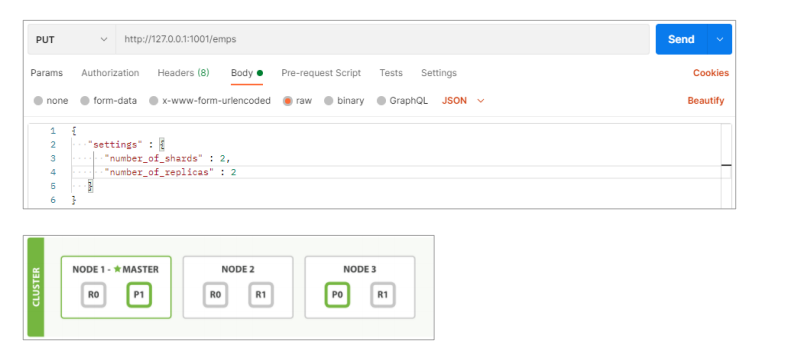

我们可以发送请求到集群中的任一节点。 每个节点都有能力处理任意请求。 每个节点都知道集群中任一文档位置，所以可以直接将请求转发到需要的节点上。 在下面的例子中，将所有的请求发送到 Node 1，我们将其称为 **协调节点**(coordinating node) 

**当发送请求的时候， 为了扩展负载，更好的做法是轮询集群中所有的节点**

#### 写流程

新建、索引和删除 请求都是 写 操作， 必须在主分片上面完成之后才能被复制到相关的副本分片

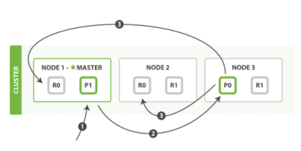

新建，索引和删除文档所需要的步骤顺序：

- 客户端向 Node 1 发送新建、索引或者删除请求。
- 节点使用文档的 _id 确定文档属于分片 0 。请求会被转发到 Node 3，因为分片 0 的主分片目前被分配在 Node 3 上。
- Node 3 在主分片上面执行请求。如果成功了，它将请求并行转发到 Node 1 和 Node 2 的副本分片上。一旦所有的副本分片都报告成功, Node 3 将向协调节点报告成功，协调节点向客户端报告成功。

在客户端收到成功响应时，文档变更已经在主分片和所有副本分片执行完成，变更是安全的。有一些可选的请求参数允许您影响这个过程，可能以数据安全为代价提升性能。这些选项很少使用，因为 Elasticsearch 已经很快，但是为了完整起见，请参考下面表格：

| 参数        | 含义                                                         |
| ----------- | ------------------------------------------------------------ |
| consistency | consistency，即一致性。在默认设置下，即使仅仅是在试图执行一个_写_操作之前，主分片都会要求 必须要有 规定数量(quorum)（或者换种说法，也即必须要有大多数）的分片副本处于活跃可用状态，才会去执行_写_操作(其中分片副本可以是主分片或者副本分片)。这是为了避免在发生网络分区故障（network partition）的时候进行_写_操作，进而导致数据不一致。_规定数量_即：<br/>int( (primary + number_of_replicas) / 2 ) + 1<br/>consistency 参数的值可以设为 one （只要主分片状态 ok 就允许执行_写_操作）,all（必须要主分片和所有副本分片的状态没问题才允许执行_写_操作）, 或quorum 。默认值为 quorum , 即大多数的分片副本状态没问题就允许执行写操作。<br/>注意，规定数量 的计算公式中 number_of_replicas 指的是在索引设置中的设定副本分片数，而不是指当前处理活动状态的副本分片数。如果你的索引设置中指定了当前索引拥有三个副本分片，那规定数量的计算结果即：<br/>int( (primary + 3 replicas) / 2 ) + 1 = 3<br/>如果此时你只启动两个节点，那么处于活跃状态的分片副本数量就达不到规定数量，也因此您将无法索引和删除任何文档 |
| timeout     | 如果没有足够的副本分片会发生什么？ Elasticsearch 会等待，希望更多的分片出现。默认情况下，它最多等待 1 分钟。 如果你需要，你可以使用 timeout 参数使它更早终止： 100 100 毫秒，30s 是 30 秒。 |

注意：新索引默认有 1 个副本分片，这意味着为满足规定数量应该需要两个活动的分片副本。 但是，这些默认的设置会阻止我们在单一节点上做任何事情。为了避免这个问题，要求只有当 number_of_replicas 大于 1 的时候，规定数量才会执行

### 读流程

我们可以从主分片或者从其它任意副本分片检索文档

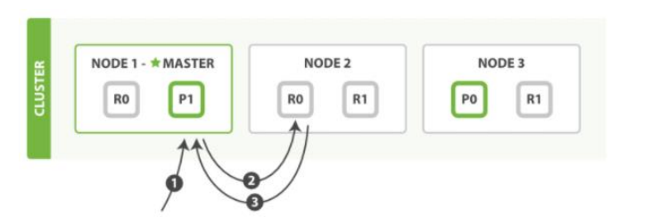

从主分片或者副本分片检索文档的步骤顺序：
- 客户端向 Node 1 发送获取请求。
- 节点使用文档的 _id 来确定文档属于分片 0 。分片 0 的副本分片存在于所有的三个节点上。 在这种情况下，它将请求转发到 Node 2 。
- Node 2 将文档返回给 Node 1 ，然后将文档返回给客户端。

在处理读取请求时，协调结点在每次请求的时候都会通过轮询所有的副本分片来达到负载均衡。在文档被检索时，已经被索引的文档可能已经存在于主分片上但是还没有复制到副本分片。 在这种情况下，副本分片可能会报告文档不存在，但是主分片可能成功返回文档。 

一旦索引请求成功返回给用户，文档在主分片和副本分片都是可用的。

### 更新流程

部分更新一个文档结合了先前说明的读取和写入流程：

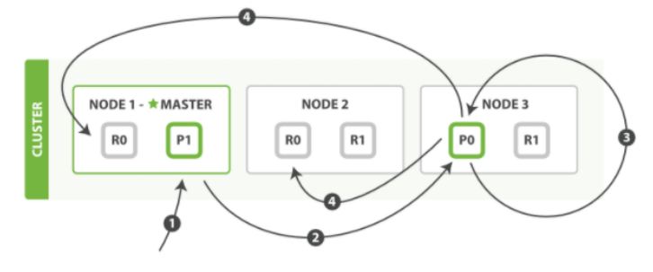

- 客户端向 Node 1 发送更新请求。
- 它将请求转发到主分片所在的 Node 3 。
- Node 3 从主分片检索文档，修改 _source 字段中的 JSON ，并且尝试重新索引主分片的文档。如果文档已经被另一个进程修改，它会重试步骤 3 ，超过 retry_on_conflict 次后放弃。
- 如果 Node 3 成功地更新文档，它将新版本的文档并行转发到 Node 1 和 Node 2 上的副本分片，重新建立索引。一旦所有副本分片都返回成功， Node 3 向协调节点也返回成功，协调节点向客户端返回成功。

注意：当主分片把更改转发到副本分片时， 它不会转发更新请求。 相反，它转发完整文档的新版本。请记住，这些更改将会异步转发到副本分片，并且不能保证它们以发送它们相同的顺序到达。 如果 Elasticsearch 仅转发更改请求，则可能以错误的顺序应用更改，导致得到损坏的文档。

### 多文档操作流程

mget 和 bulk API 的模式类似于单文档模式。区别在于协调节点知道每个文档存在于哪个分片中。它将整个多文档请求分解成 每个分片 的多文档请求，并且将这些请求并行转发到每个参与节点。
协调节点一旦收到来自每个节点的应答，就将每个节点的响应收集整理成单个响应，返回给客户端

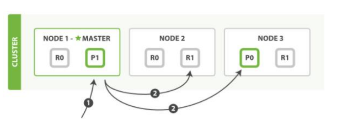

**用单个mget请求取回多个文档所需的步骤顺序**:

- 客户端向 Node 1 发送 mget 请求。
- Node 1 为每个分片构建多文档获取请求，然后并行转发这些请求到托管在每个所需的主分片或者副本分片的节点上。一旦收到所有答复， Node 1 构建响应并将其返回给客户端。

可以对 docs 数组中每个文档设置 routing 参数。

**bulk API** 

允许在单个批量请求中执行多个创建、索引、删除和更新请求。

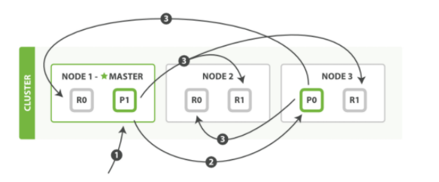

bulk API 按如下步骤顺序执行：

- 客户端向 Node 1 发送 bulk 请求。
- Node 1 为每个节点创建一个批量请求，并将这些请求并行转发到每个包含主分片的节点主机。
- 主分片一个接一个按顺序执行每个操作。当每个操作成功时，主分片并行转发新文档（或删除）到副本分片，然后执行下一个操作。 一旦所有的副本分片报告所有操作成功，该节点将向协调节点报告成功，协调节点将这些响应收集整理并返回给客户端

## 分片原理

分片是Elasticsearch最小的工作单元。但是究竟什么是一个分片，它是如何工作的？

传统的数据库每个字段存储单个值，但这对全文检索并不够。文本字段中的每个单词需要被搜索，对数据库意味着需要单个字段有索引多值的能力。最好的支持是一个字段多个值需求的数据结构是**倒排索引**。

### 倒排索引

Elasticsearch使用一种称为**倒排索引**的结构，它适用于快速的全文搜索。

见其名，知其意，有倒排索引，肯定会对应有正向索引。正向索引（forwardindex），反向索引（invertedindex）更熟悉的名字是倒排索引。

所谓的正向索引，就是搜索引擎会将待搜索的文件都对应一个文件ID，搜索时将这个ID和搜索关键字进行对应，形成K-V对，然后对关键字进行统计计数。

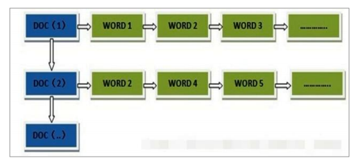

但是互联网上收录在搜索引擎中的文档的数目是个天文数字，这样的索引结构根本无法满足实时返回排名结果的要求。所以，搜索引擎会将正向索引重新构建为倒排索引，即把文件ID对应到关键词的映射转换为关键词到文件ID的映射，每个关键词都对应着一系列的文件，这些文件中都出现这个关键词。

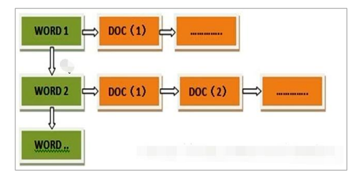

一个倒排索引由文档中所有不重复词的列表构成，对于其中每个词，有一个包含它的文档列表。例如，假设我们有两个文档，每个文档的content域包含如下内容：

- The quick brown fox jumped over the lazy dog
- Quick brown foxes leap over lazy dogs in summer

为了创建倒排索引，我们首先将每个文档的content域拆分成单独的词（我们称它为词条或tokens），创建一个包含所有不重复词条的排序列表，然后列出每个词条出现在哪个文档。结果如下所示
现在，如果我们想搜索quick brown，我们只需要查找包含每个词条的文档。

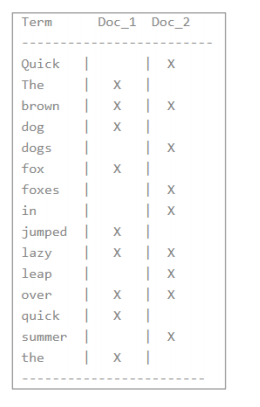

现在，如果我们想搜索quick brown，我们只需要查找包含每个词条的文档：

两个文档都匹配，但是第一个文档比第二个匹配度更高。如果我们使用仅计算匹配词条数量

的简单相似性算法，那么我们可以说，对于我们查询的相关性来讲，第一个文档比第二个文

档更佳。

但是，我们目前的倒排索引有一些问题：

- Quick和quick以独立的词条出现，然而用户可能认为它们是相同的词。
- fox和foxes非常相似,就像dog和dogs；他们有相同的词根。
- jumped和leap,尽管没有相同的词根，但他们的意思很相近。他们是同义词。

使用前面的索引搜索+Quick+fox不会得到任何匹配文档。（记住，+前缀表明这个词必须存在。）只有同时出现Quick和fox的文档才满足这个查询条件，但是第一个文档包含quick fox，第二个文档包含Quick foxes

我们的用户可以合理的期望两个文档与查询匹配。我们可以做的更好。

如果我们将词条规范为标准模式，那么我们可以找到与用户搜索的词条不完全一致，但具有足够相关性的文档。例如：

- Quick可以小写化为quick。
- foxes可以词干提取--变为词根的格式--为fox。类似的，dogs可以为提取为dog。
- jumped和leap是同义词，可以索引为相同的单词jump。

现在索引看上去像这样

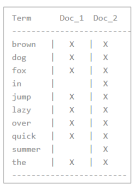

这还远远不够。我们搜索+Quick+fox仍然会失败，因为在我们的索引中，已经没有Quick了。但是，如果我们对搜索的字符串使用与content域相同的标准化规则，会变成查询+quick+fox，这样两个文档都会匹配！分词和标准化的过程称为**分析**

这非常重要。你只能搜索在索引中出现的词条，所以索引文本和查询字符串必须标准化为相同的格式

### 文档搜索

早期的全文检索会为整个文档集合建立一个很大的倒排索引并将其写入到磁盘。一旦新的索引就绪，旧的就会被其替换，这样最近的变化便可以被检索到。

倒排索引被写入磁盘后是不可改变的:它永远不会修改。

不变性有重要的价值：

- 不需要锁。如果你从来不更新索引，你就不需要担心多进程同时修改数据的问题。
- 一旦索引被读入内核的文件系统缓存，便会留在哪里，由于其不变性。只要文件系统缓存中还有足够的空间，那么大部分读请求会直接请求内存，而不会命中磁盘。这提供了很大的性能提升。
- 其它缓存(像filter缓存)，在索引的生命周期内始终有效。它们不需要在每次数据改变时被重建，因为数据不会变化。
- 写入单个大的倒排索引允许数据被压缩，减少磁盘I/O和需要被缓存到内存的索引的使用量。

当然，一个不变的索引也有不好的地方。主要事实是它是不可变的!你不能修改它。如果你需要让一个新的文档可被搜索，你需要重建整个索引。这要么对一个索引所能包含的数据量造成了很大的限制，要么对索引可被更新的频率造成了很大的限制。

### 动态更新索引

如何在保留不变性的前提下实现倒排索引的更新？
答案是:用更多的索引。通过增加新的补充索引来反映新近的修改，而不是直接重写整个倒排索引。每一个倒排索引都会被轮流查询到，从最早的开始查询完后再对结果进行合并。
Elasticsearch基于Lucene,这个java库引入了按段搜索的概念。每一段本身都是一个倒排索引，但索引在Lucene中除表示所有段的集合外，还增加了提交点的概念(一个列出了所有已知段的文件)

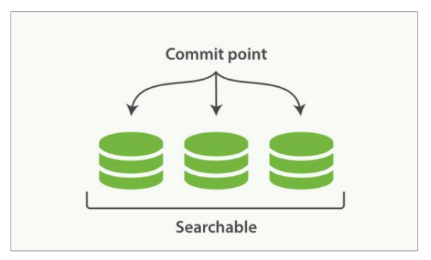

按段搜索会以如下流程执行：

- 新文档被收集到内存索引缓存

- 不时地,缓存被提交
  (1)一个新的段—一个追加的倒排索引—被写入磁盘。
  (2)一个新的包含新段名字的提交点被写入磁盘
  (3)磁盘进行同步—所有在文件系统缓存中等待的写入都刷新到磁盘，以确保它们
  被写入物理文件

  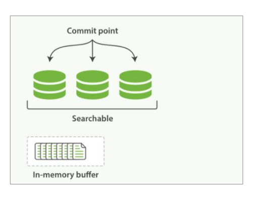

- 新的段被开启，让它包含的文档可见以被搜索

- 内存缓存被清空，等待接收新的文档

  

当一个查询被触发，所有已知的段按顺序被查询。词项统计会对所有段的结果进行聚合，以保证每个词和每个文档的关联都被准确计算。这种方式可以用相对较低的成本将新文档添加到索引。

段是不可改变的，所以既不能从把文档从旧的段中移除，也不能修改旧的段来进行反映文档的更新。取而代之的是，每个提交点会包含一个.del文件，文件中会列出这些被删除文档的段信息。

当一个文档被“删除”时，它实际上只是在.del文件中被标记删除。一个被标记删除的文档仍然可以被查询匹配到，但它会在最终结果被返回前从结果集中移除。

文档更新也是类似的操作方式：当一个文档被更新时，旧版本文档被标记删除，文档的新版本被索引到一个新的段中。可能两个版本的文档都会被一个查询匹配到，但被删除的那个旧版本文档在结果集返回前就已经被移除。

### 近实时搜索

随着按段（per-segment）搜索的发展，一个新的文档从索引到可被搜索的延迟显著降低了。新文档在几分钟之内即可被检索，但这样还是不够快。磁盘在这里成为了瓶颈。提交（Commiting）一个新的段到磁盘需要一个fsync来确保段被物理性地写入磁盘，这样在断电的时候就不会丢失数据。但是fsync操作代价很大;如果每次索引一个文档都去执行一次的话会造成很大的性能问题。

我们需要的是一个更轻量的方式来使一个文档可被搜索，这意味着fsync要从整个过程中被移除。在Elasticsearch和磁盘之间是文件系统缓存。像之前描述的一样，在内存索引缓冲区中的文档会被写入到一个新的段中。但是这里新段会被先写入到文件系统缓存—这一步代价会比较低，稍后再被刷新到磁盘—这一步代价比较高。不过只要文件已经在缓存中，就可以像其它文件一样被打开和读取了

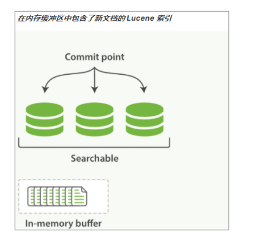

Lucene允许新段被写入和打开—使其包含的文档在未进行一次完整提交时便对搜索可见。这种方式比进行一次提交代价要小得多，并且在不影响性能的前提下可以被频繁地执行。

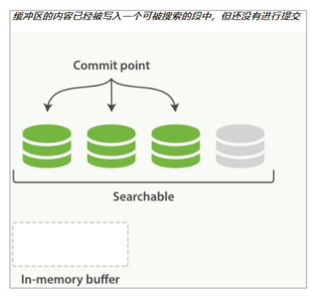

在Elasticsearch中，写入和打开一个新段的轻量的过程叫做refresh。默认情况下每个分片会每秒自动刷新一次。这就是为什么我们说lasticsearch是近实时搜索:文档的变化并不是立即对搜索可见，但会在一秒之内变为可见。这些行为可能会对新用户造成困惑:他们索引了一个文档然后尝试搜索它，但却没有搜到。

这个问题的解决办法是用refreshAPI执行一次手动刷新:/users/_refresh

尽管刷新是比提交轻量很多的操作，它还是会有性能开销。当写测试的时候，手动刷新很有用，但是不要在生产环境下每次索引一个文档都去手动刷新。相反，你的应用需要意识到Elasticsearch的近实时的性质，并接受它的不足。

并不是所有的情况都需要每秒刷新。可能你正在使用Elasticsearch索引大量的日志文件，你可能想优化索引速度而不是近实时搜索，可以通过设置refresh_interval，降低每个索引的刷新频率

```shell
{
"settings":{
"refresh_interval":"30s"
}
}
```

refresh_interval可以在既存索引上进行动态更新。在生产环境中，当你正在建立一个大的新索引时，可以先关闭自动刷新，待开始使用该索引时，再把它们调回来

```shell
#关闭自动刷新
PUT/users/_settings
{"refresh_interval":-1}
#每一秒刷新
PUT/users/_settings
{"refresh_interval":"1s"}
```

### 持久化变更

如果没有用fsync把数据从文件系统缓存刷（flush）到硬盘，我们不能保证数据在断电甚至是程序正常退出之后依然存在。为了保证Elasticsearch的可靠性，需要确保数据变化被持久化到磁盘。在动态更新索引，我们说一次完整的提交会将段刷到磁盘，并写入一个包含所有段列表的提交点。Elasticsearch在启动或重新打开一个索引的过程中使用这个提交点来判断哪些段隶属于当前分片。

即使通过每秒刷新（refresh）实现了近实时搜索，我们仍然需要经常进行完整提交来确保能从失败中恢复。但在两次提交之间发生变化的文档怎么办？我们也不希望丢失掉这些数据。Elasticsearch增加了一个translog，或者叫事务日志，在每一次对Elasticsearch进行操作时均进行了日志记录

整个流程如下：

- 一个文档被索引之后，就会被添加到内存缓冲区，并且追加到了translog

  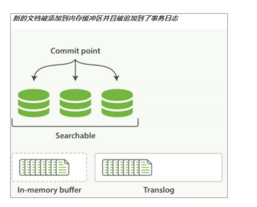

- 刷新（refresh）使分片每秒被刷新（refresh）一次：

  - 这些在内存缓冲区的文档被写入到一个新的段中，且没有进行fsync操作。
  - 这个段被打开，使其可被搜索

  - 内存缓冲区被清空

  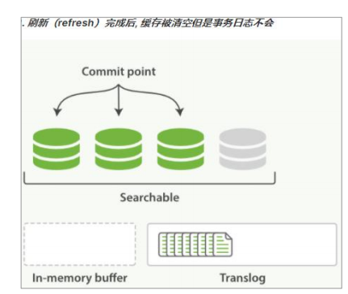

- 这个进程继续工作，更多的文档被添加到内存缓冲区和追加到事务日志

  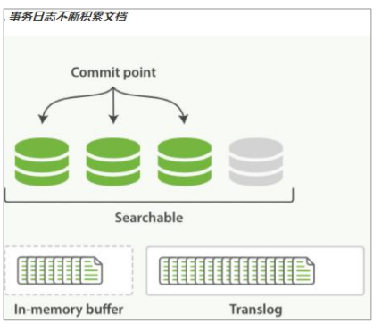

- 每隔一段时间—例如translog变得越来越大—索引被刷新（flush）；一个新的translog被创建，并且一个全量提交被执行

  - 所有在内存缓冲区的文档都被写入一个新的段。
  - 缓冲区被清空。
  - 一个提交点被写入硬盘。
  - 文件系统缓存通过fsync被刷新（flush）。
  - 老的translog被删除。

translog提供所有还没有被刷到磁盘的操作的一个持久化纪录。当Elasticsearch启动的时候，它会从磁盘中使用最后一个提交点去恢复已知的段，并且会重放translog中所有在最后一次提交后发生的变更操作。translog也被用来提供实时CRUD。当你试着通过ID查询、更新、删除一个文档，它会在尝试从相应的段中检索之前，首先检查translog任何最近的变更。这意味着它总是能够实时地获取到文档的最新版本

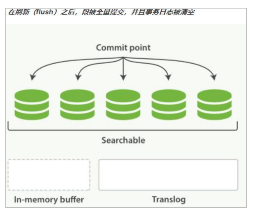

1执行一个提交并且截断translog的行为在Elasticsearch被称作一次flush分片每30分钟被自动刷新（flush），或者在translog太大的时候也会刷新你很少需要自己手动执行flush操作；通常情况下，自动刷新就足够了。这就是说，在重启节点或关闭索引之前执行flush有益于你的索引。当Elasticsearch尝试恢复或重新打开一个索引，它需要重放translog中所有的操作，所以如果日志越短，恢复越快。

translog的目的是保证操作不会丢失，在文件被fsync到磁盘前，被写入的文件在重启之后就会丢失。默认translog是每5秒被fsync刷新到硬盘，或者在每次写请求完成之后执行(e.g.index,delete,update,bulk)。这个过程在主分片和复制分片都会发生。最终，基本上，这意味着在整个请求被fsync到主分片和复制分片的translog之前，你的客户端不会得到一个200OK响应。

在每次请求后都执行一个fsync会带来一些性能损失，尽管实践表明这种损失相对较小（特别是bulk导入，它在一次请求中平摊了大量文档的开销）。但是对于一些大容量的偶尔丢失几秒数据问题也并不严重的集群，使用异步的fsync还是比较有益的。比如，写入的数据被缓存到内存中，再每5秒执行一次fsync。如果你决定使用异步translog的话，你需要保证在发生crash时，丢失掉sync_interval时间段的数据也无所谓。请在决定前知晓这个特性。如果你不确定这个行为的后果，最好是使用默认的参数（"index.translog.durability":"request"）来避免数据丢失

### 段合并

由于自动刷新流程每秒会创建一个新的段，这样会导致短时间内的段数量暴增。而段数目太多会带来较大的麻烦。每一个段都会消耗文件句柄、内存和cpu运行周期。更重要的是，每个搜索请求都必须轮流检查每个段；所以段越多，搜索也就越慢。
Elasticsearch通过在后台进行段合并来解决这个问题。小的段被合并到大的段，然后这些大的段再被合并到更大的段。
段合并的时候会将那些旧的已删除文档从文件系统中清除。被删除的文档（或被更新文档的旧版本）不会被拷贝到新的大段中。
启动段合并不需要你做任何事。进行索引和搜索时会自动进行。

- 当索引的时候，刷新（refresh）操作会创建新的段并将段打开以供搜索使用

- 合并进程选择一小部分大小相似的段，并且在后台将它们合并到更大的段中。这并不会
  中断索引和搜索

  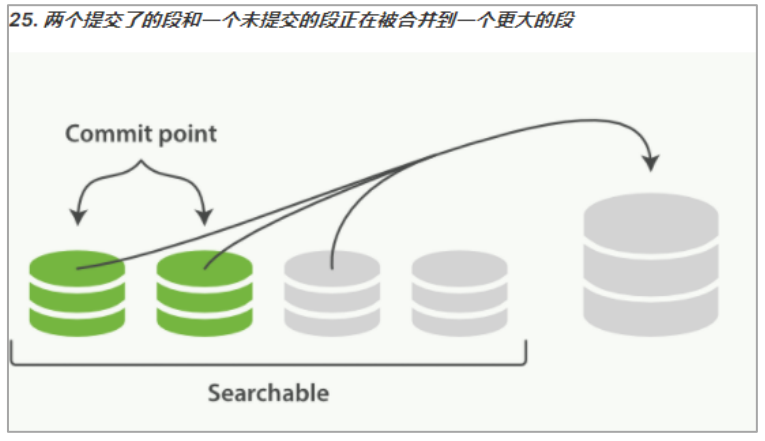

- 一旦合并结束，老的段被删除

  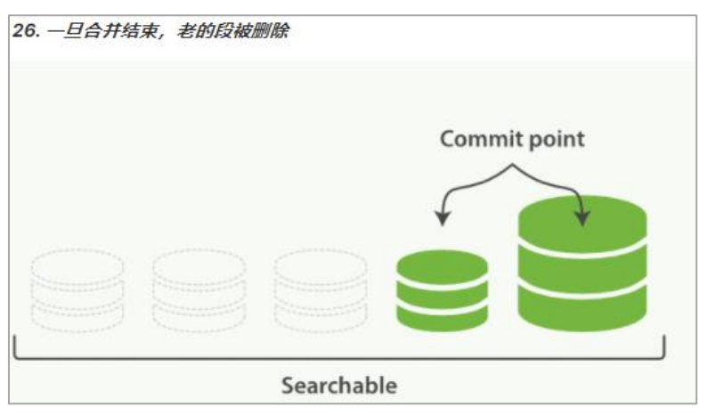

合并大的段需要消耗大量的I/O和CPU资源，如果任其发展会影响搜索性能。Elasticsearch
在默认情况下会对合并流程进行资源限制，所以搜索仍然有足够的资源很好地执行。

### 文档分析

分析包含下面的过程：

- 将一块文本分成适合于倒排索引的独立的词条

- 将这些词条统一化为标准格式以提高它们的“可搜索性”，或者recall分析器执行上面的工作。分析器实际上是将三个功能封装到了一个包里：

  - 字符过滤器

    首先，字符串按顺序通过每个字符过滤器。他们的任务是在分词前整理字符串。一个字符过滤器可以用来去掉HTML，或者将&转化成and。

  - 分词器

    其次，字符串被分词器分为单个的词条。一个简单的分词器遇到空格和标点的时候，可能会将文本拆分成词条

  - Token过滤器

    最后，词条按顺序通过每个token过滤器。这个过程可能会改变词条（例如，小写化Quick），删除词条（例如，像a，and，the等无用词），或者增加词条（例如，像jump和leap这种同义词）。

#### 内置分析器

Elasticsearch还附带了可以直接使用的预包装的分析器。接下来我们会列出最重要的分析器。为了证明它们的差异，我们看看每个分析器会从下面的字符串得到哪些词条："Set the shape to semi-transparent by calling set_trans(5)"

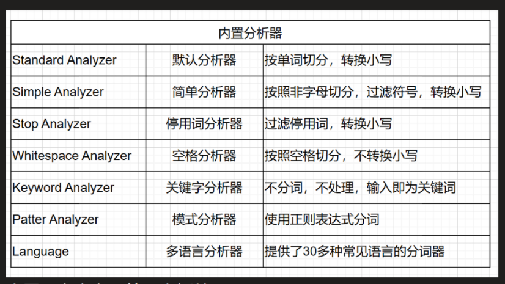

- 标准分析器

  标准分析器是Elasticsearch默认使用的分析器。它是分析各种语言文本最常用的选择。

  它根据Unicode联盟定义的单词边界划分文本。删除绝大部分标点。最后，将词条小写。

  它会产生：

  set,the,shape,to,semi,transparent,by,calling,set_trans,5

- 简单分析器

  简单分析器在任何不是字母的地方分隔文本，将词条小写。它会产生：

  set,the,shape,to,semi,transparent,by,calling,set,trans

- 空格分析器

  空格分析器在空格的地方划分文本。它会产生：

  Set,the,shape,to,semi-transparent,by,calling,set_trans(5)

- 语言分析器

  特定语言分析器可用于很多语言。它们可以考虑指定语言的特点。例如，英语分析器附带了一组英语无用词（常用单词，例如and或者the，它们对相关性没有多少影响），它们会被删除。由于理解英语语法的规则，这个分词器可以提取英语单词的词干。

  英语分词器会产生下面的词条：

  set,shape,semi,transpar,call,set_tran,5

  注意看transparent、calling和set_trans已经变为词根格式

#### 分词器使用场景

当我们索引一个文档，它的全文域被分析成词条以用来创建倒排索引。但是，当我们在全文域搜索的时候，我们需要将查询字符串通过相同的分析过程，以保证我们搜索的词条格式与索引中的词条格式一致。

全文查询，理解每个域是如何定义的，因此它们可以做正确的事：

- 当你查询一个全文域时，会对查询字符串应用相同的分析器，以产生正确的搜索词条列表。
- 当你查询一个精确值域时，不会分析查询字符串，而是搜索你指定的精确值。

#### 测试分析器

有些时候很难理解分词的过程和实际被存储到索引中的词条，特别是你刚接触Elasticsearch。为了理解发生了什么，你可以使用analyzeAPI来看文本是如何被分析的。

在消息体里，指定分析器和要分析的文本

https://localhost:9200/_analyze

```json
{
    "analyzer": "standard",
    "text": "Texttoanalyze"
}
```

结果中每个元素代表一个单独的词条：

````json
{
    "tokens": [
        {
            "token": "text",
            "start_offset": 0,
            "end_offset": 4,
            "type": "<ALPHANUM>",
            "position": 0
        },
        {
            "token": "to",
            "start_offset": 5,
            "end_offset": 7,
            "type": "<ALPHANUM>",
            "position": 1
        },
        {
            "token": "analyze",
            "start_offset": 8,
            "end_offset": 15,
            "type": "<ALPHANUM>",
            "position": 2
        }
    ]
}
````

token是实际存储到索引中的词条。

position指明词条在原始文本中出现的位置。

start_offset和end_offset指明字符在原始字符串中的位置

#### 指定分析器

当Elasticsearch在你的文档中检测到一个新的字符串域，它会自动设置其为一个全文字符串域，使用标准分析器对它进行分析。你不希望总是这样。可能你想使用一个不同的分析器，适用于你的数据使用的语言。有时候你想要一个字符串域就是一个字符串域—不使用分析，直接索引你传入的精确值，例如用户ID或者一个内部的状态域或标签。要做到这一点，我们必须手动指定这些域的映射。

例如：

https://localhost:9200/my_index

```json
{
    "settings": {},
    "mappings": {
        "properties": {
            "name": {
                "type": "text",
                "analyzer": "standard",
                "index": true
            },
            "age": {
                "type": "long",
                "index": false
            }
        }
    }
}
```


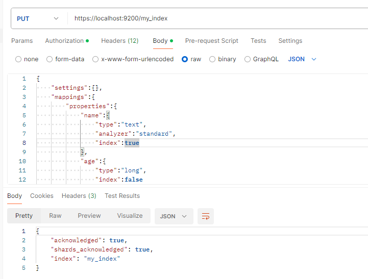

查看映射：

https://localhost:9200/my_index/_mapping

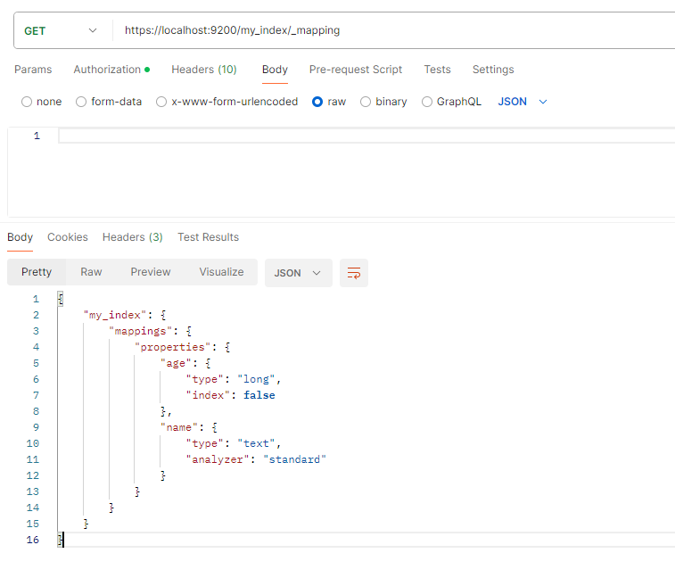

#### IK分词器

首先我们通过Postman发送**GET**请求查询分词效果

https://localhost:9200/_analyze

```json
{
    "text": "测试单词"
}
```

ES的默认分词器无法识别中文中测试、单词这样的词汇，而是简单的将每个字拆完分为一个词

```json
{
    "tokens": [
        {
            "token": "测",
            "start_offset": 0,
            "end_offset": 1,
            "type": "<IDEOGRAPHIC>",
            "position": 0
        },
        {
            "token": "试",
            "start_offset": 1,
            "end_offset": 2,
            "type": "<IDEOGRAPHIC>",
            "position": 1
        },
        {
            "token": "单",
            "start_offset": 2,
            "end_offset": 3,
            "type": "<IDEOGRAPHIC>",
            "position": 2
        },
        {
            "token": "词",
            "start_offset": 3,
            "end_offset": 4,
            "type": "<IDEOGRAPHIC>",
            "position": 3
        }
    ]
}
```

这样的结果显然不符合我们的使用要求，所以我们需要下载ES对应版本的中文分词器

我们这里采用IK中文分词器，下载地址为:

https://github.com/infinilabs/analysis-ik/releases/tag/v8.12.2

将解压后的后的文件夹放入ES根目录下的plugins目录下，重启ES即可使用。

我们这次加入新的查询参数"analyzer":"ik_max_word

- ik_max_word：会将文本做最细粒度的拆分
- ik_smart：会将文本做最粗粒度的拆分

https://localhost:9200/_analyze

```json
{
    "text":"测试单词",
    "analyzer":"ik_max_word"
}
```

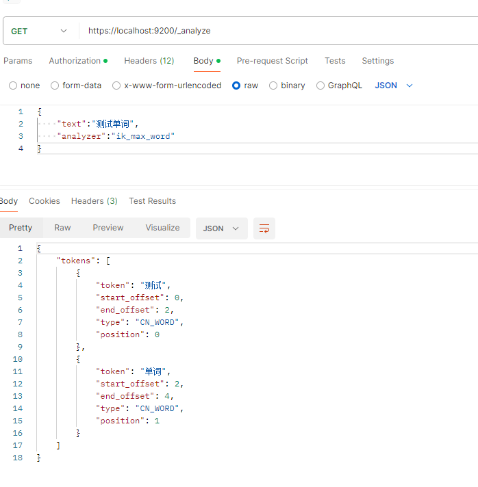

ES中也可以进行扩展词汇，首先查询:

```json
{
    "text":"弗雷尔卓德",
    "analyzer":"ik_max_word"
}
```

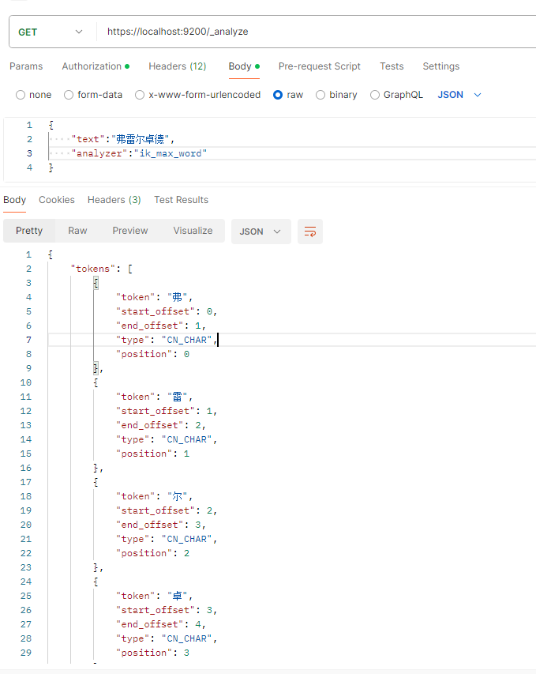

仅仅可以得到每个字的分词结果，我们需要做的就是使分词器识别到弗雷尔卓德也是一个词语

首先进入ES根目录中的plugins文件夹下的ik文件夹，进入config目录，创建custom.dic文件，写入弗雷尔卓德。同时打开IKAnalyzer.cfg.xml文件，将新建的custom.dic配置其中，重启ES服务器。

```xml
<?xml version="1.0" encoding="UTF-8"?>
<!DOCTYPE properties SYSTEM "http://java.sun.com/dtd/properties.dtd">
<properties>
	<comment>IK Analyzer 扩展配置</comment>
	<!--用户可以在这里配置自己的扩展字典 -->
	<entry key="ext_dict">custom.dic</entry> 
	 <!--用户可以在这里配置自己的扩展停止词字典-->
	<entry key="ext_stopwords"></entry>
	<!--用户可以在这里配置远程扩展字典 -->
	<!-- <entry key="remote_ext_dict">words_location</entry> -->
	<!--用户可以在这里配置远程扩展停止词字典-->
	<!-- <entry key="remote_ext_stopwords">words_location</entry> -->
</properties>

```

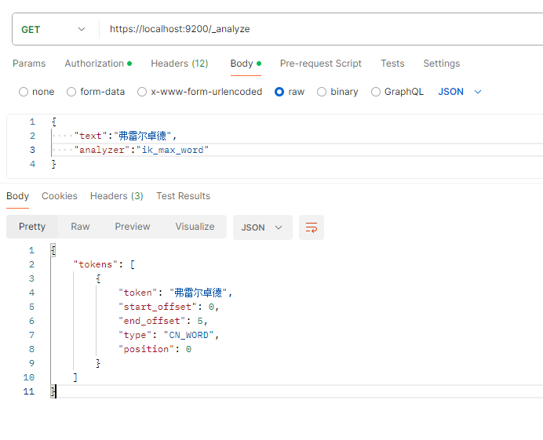

#### 自定义分析器

虽然Elasticsearch带有一些现成的分析器，然而在分析器上Elasticsearch真正的强大之处在于，你可以通过在一个适合你的特定数据的设置之中组合字符过滤器、分词器、词汇单元过滤器来创建自定义的分析器。在分析与分析器我们说过，一个分析器就是在一个包里面组合了三种函数的一个包装器，三种函数按照顺序被执行:

- **字符过滤器**

  字符过滤器用来整理一个尚未被分词的字符串。例如，如果我们的文本是HTML格式的，它会包含像<p>或者<div>这样的HTML标签，这些标签是我们不想索引的。我们可以使用html清除字符过滤器来移除掉所有的HTML标签，并且像把Á转换为相对应的Unicode字符Á这样，转换HTML实体。一个分析器可能有0个或者多个字符过滤器。

- **分词器**

  一个分析器必须有一个唯一的分词器。分词器把字符串分解成单个词条或者词汇单元。标准分析器里使用的标准分词器把一个字符串根据单词边界分解成单个词条，并且移除掉大部分的标点符号，然而还有其他不同行为的分词器存在。例如，关键词分词器完整地输出接收到的同样的字符串，并不做任何分词。空格分词器只根据空格分割文本。正则分词器根据匹配正则表达式来分割文本。

- **词单元过滤器**

  经过分词，作为结果的词单元流会按照指定的顺序通过指定的词单元过滤器。词单元过滤器可以修改、添加或者移除词单元。我们已经提到过lowercase和stop词过滤器，但是在Elasticsearch里面还有很多可供选择的词单元过滤器。词干过滤器把单词遏制为词干。ascii_folding过滤器移除变音符，把一个像"très"这样的词转换为"tres"。ngram和edge_ngram词单元过滤器可以产生适合用于部分匹配或者自动补全的词单元。

接下来，我们看看如何创建自定义的分析器：

http://localhost:9200/my_index

```json
{
    "settings": {
         "analysis": {
            "char_filter": {
                "&_to_and": {
                    "type": "mapping",
                    "mappings": [ "&=> and "]
                }
            },
            "filter": {
                "my_stopwords": {
                    "type": "stop",
                    "stopwords": [ "the", "a" ]
                }
            },
            "analyzer": {
                "my_analyzer": {
                    "type": "custom",
                    "char_filter": [ "html_strip", "&_to_and" ],
                    "tokenizer": "standard",
                    "filter": [ "lowercase", "my_stopwords" ]
                }
            }
        }
    }
}
```

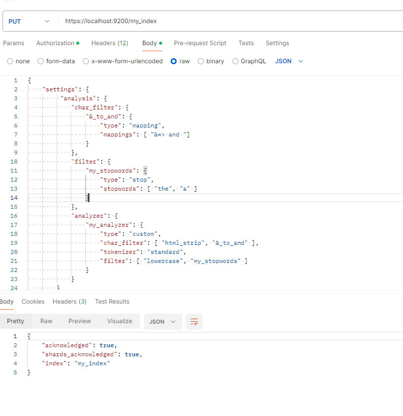

索引被创建以后，使用analyzeAPI来测试这个新的分析器

https://localhost:9200/my_index/_analyze

```json
{
    "text":"The quick & brown fox",
    "analyzer": "my_analyzer"
}
```

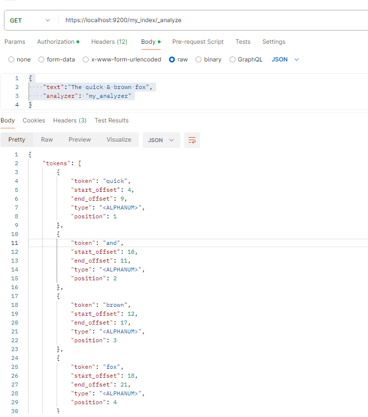

### 文档处理

#### 文档冲突

当我们使用indexAPI更新文档，可以一次性读取原始文档，做我们的修改，然后重新索引整个文档。最近的索引请求将获胜：无论最后哪一个文档被索引，都将被唯一存储在Elasticsearch中。如果其他人同时更改这个文档，他们的更改将丢失。很多时候这是没有问题的。也许我们的主数据存储是一个关系型数据库，我们只是将数据复制到Elasticsearch中并使其可被搜索。也许两个人同时更改相同的文档的几率很小。或者对于我们的业务来说偶尔丢失更改并不是很严重的问题。
但有时丢失了一个变更就是非常严重的。试想我们使用Elasticsearch存储我们网上商城商品库存的数量，每次我们卖一个商品的时候，我们在Elasticsearch中将库存数量减少。有一天，管理层决定做一次促销。突然地，我们一秒要卖好几个商品。假设有两个web程序并行运行，每一个都同时处理所有商品的销售

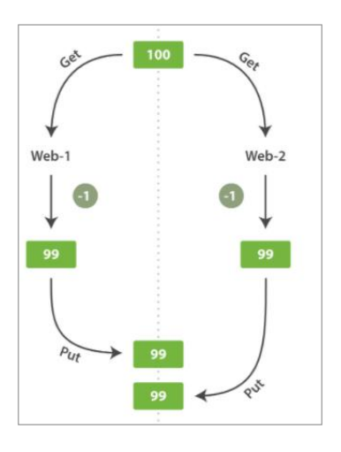

web_1对stock_count所做的更改已经丢失，因为web_2不知道它的stock_count的拷贝已经过期。结果我们会认为有超过商品的实际数量的库存，因为卖给顾客的库存商品并不存在，我们将让他们非常失望。
变更越频繁，读数据和更新数据的间隙越长，也就越可能丢失变更。
在数据库领域中，有两种方法通常被用来确保并发更新时变更不会丢失：

- 悲观并发控制

  这种方法被关系型数据库广泛使用，它假定有变更冲突可能发生，因此阻塞访问资源以防止冲突。一个典型的例子是读取一行数据之前先将其锁住，确保只有放置锁的线程能够对这行数据进行修改。

- 乐观并发控制

  Elasticsearch中使用的这种方法假定冲突是不可能发生的，并且不会阻塞正在尝试的操作。然而，如果源数据在读写当中被修改，更新将会失败。应用程序接下来将决定该如何解决冲突。例如，可以重试更新、使用新的数据、或者将相关情况报告给用户。
  Elasticsearch是分布式的。当文档创建、更新或删除时，新版本的文档必须复制到集群中的其他节点。Elasticsearch也是异步和并发的，这意味着这些复制请求被并行发送，并且到达目的地时也许顺序是乱的。Elasticsearch需要一种方法确保文档的旧版本不会覆盖新的版本。
  当我们之前讨论index，GET和delete请求时，我们指出每个文档都有一个_version（版本）号，当文档被修改时版本号递增。Elasticsearch使用这个version号来确保变更以正确顺序得到执行。如果旧版本的文档在新版本之后到达，它可以被简单的忽略。我们可以利用version号来确保应用中相互冲突的变更不会导致数据丢失。我们通过指定想要修改文档的version号来达到这个目的。如果该版本不是当前版本号，我们的请求将会失败。
  老的版本es使用version，但是新版本不支持了，会报下面的错误，提示我们用if_seq_no和if_primary_term

#### 外部版本控制系统

一个常见的设置是使用其它数据库作为主要的数据存储，使用 Elasticsearch 做数据检索， 这意味着主数据库的所有更改发生时都需要被复制到 Elasticsearch ，如果多个进程负责这一数据同步，你可能遇到类似于之前描述的并发问题。

如果你的主数据库已经有了版本号 — 或一个能作为版本号的字段值比如 timestamp —那么你就可以在 Elasticsearch 中通过增加 version_type=external 到查询字符串的方式重用这些相同的版本号， 版本号必须是大于零的整数， 且小于 9.2E+18 — 一个 Java 中 long 类型的正值。

外部版本号的处理方式和我们之前讨论的内部版本号的处理方式有些不同，Elasticsearch 不是检查当前 _version 和请求中指定的版本号是否相同， 而是检查当前

_version 是否 小于 指定的版本号。 如果请求成功，外部的版本号作为文档的新 _version 进行存储

https://localhost:9200/my_index/_doc/1001

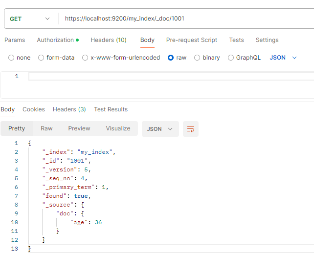


https://localhost:9200/my_index/_doc/1001?version=1&version_type=external

```json
{
    "doc": {
        "age": 36
    }
}
```

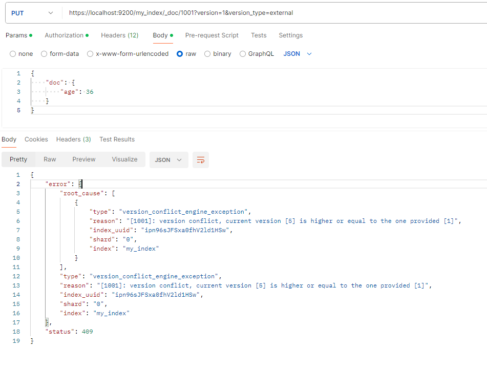

外部版本号不仅在索引和删除请求是可以指定，而且在创建新文档时也可以指定。

# Elasticsearch优化

## 硬件选择

Elasticsearch的基础是Lucene，所有的索引和文档数据是存储在本地的磁盘中，具体的路径可在ES的配置文件../config/elasticsearch.yml中配置。

磁盘在现代服务器上通常都是瓶颈。Elasticsearch重度使用磁盘，你的磁盘能处理的吞吐量越大，你的节点就越稳定。这里有一些优化磁盘I/O的技巧：

- 使用SSD。就像其他地方提过的，他们比机械磁盘优秀多了。
- 使用RAID0。条带化RAID会提高磁盘I/O，代价显然就是当一块硬盘故障时整个就故障了。不要使用镜像或者奇偶校验RAID因为副本已经提供了这个功能。
- 另外，使用多块硬盘，并允许Elasticsearch通过多个path.data目录配置把数据条带化分配到它们上面。
- 不要使用远程挂载的存储，比如NFS或者SMB/CIFS。这个引入的延迟对性能来说完全是背道而驰的

## 分片策略

### 合理设置分片数

分片和副本的设计为ES提供了支持分布式和故障转移的特性，但并不意味着分片和副本是可以无限分配的。而且索引的分片完成分配后由于索引的路由机制，我们是不能重新修改分片数的。可能有人会说，我不知道这个索引将来会变得多大，并且过后我也不能更改索引的大小，所以为了保险起见，还是给它设为1000个分片吧。但是需要知道的是，一个分片并不是没有代价的。需要了解：

- 一个分片的底层即为一个Lucene索引，会消耗一定文件句柄、内存、以及CPU运转。
- 每一个搜索请求都需要命中索引中的每一个分片，如果每一个分片都处于不同的节点还好，但如果多个分片都需要在同一个节点上竞争使用相同的资源就有些糟糕了。
- 用于计算相关度的词项统计信息是基于分片的。如果有许多分片，每一个都只有很少的数据会导致很低的相关度。

一个业务索引具体需要分配多少分片可能需要架构师和技术人员对业务的增长有个预先的判断，横向扩展应当分阶段进行。为下一阶段准备好足够的资源。只有当你进入到下一个阶段，你才有时间思考需要作出哪些改变来达到这个阶段。一般来说，我们遵循一些原则：

- 控制每个分片占用的硬盘容量不超过ES的最大JVM的堆空间设置（一般设置不超过32G，参考下文的JVM设置原则），因此，如果索引的总容量在500G左右，那分片大小在16个左右即可；当然，最好同时考虑原则2。
- 考虑一下node数量，一般一个节点有时候就是一台物理机，如果分片数过多，大大超过了节点数，很可能会导致一个节点上存在多个分片，一旦该节点故障，即使保持了1个以上的副本，同样有可能会导致数据丢失，集群无法恢复。所以，一般都设置分片数不超过节点数的3倍。
- 主分片，副本和节点最大数之间数量，我们分配的时候可以参考以下关系：
  节点数<=主分片数*（副本数+1）

### 推迟分片分配

对于节点瞬时中断的问题，默认情况，集群会等待一分钟来查看节点是否会重新加入，如果这个节点在此期间重新加入，重新加入的节点会保持其现有的分片数据，不会触发新的分片分配。这样就可以减少ES在自动再平衡可用分片时所带来的极大开销。

通过修改参数delayed_timeout，可以延长再均衡的时间，可以全局设置也可以在索引级别进行修改：

```shell
PUT/_all/_settings
{
    "settings": {
        "index.unassigned.node_left.delayed_timeout": "5m"
    }
}
```

### 路由选择

当我们查询文档的时候，Elasticsearch如何知道一个文档应该存放到哪个分片中呢？它其实是通过下面这个公式来计算出来:

shard=hash(routing)%number_of_primary_shards

routing默认值是文档的id，也可以采用自定义值，比如用户id。

**不带routing查询**

在查询的时候因为不知道要查询的数据具体在哪个分片上，所以整个过程分为2个步骤

- 分发：请求到达协调节点后，协调节点将查询请求分发到每个分片上。
- 聚合:协调节点搜集到每个分片上查询结果，在将查询的结果进行排序，之后给用户返回结果。

**带routing查询**

查询的时候，可以直接根据routing信息定位到某个分配查询，不需要查询所有的分配，经过协调节点排序。

向上面自定义的用户查询，如果routing设置为userid的话，就可以直接查询出数据来，效率提升很多

### 写入速度优化

ES的默认配置，是综合了数据可靠性、写入速度、搜索实时性等因素。实际使用时，我们需要根据公司要求，进行偏向性的优化。

针对于搜索性能要求不高，但是对写入要求较高的场景，我们需要尽可能的选择恰当写优化策略。综合来说，可以考虑以下几个方面来提升写索引的性能：

- 加大TranslogFlush，目的是降低Iops、Writeblock。
- 增加Index Refresh间隔，目的是减少Segment Merge的次数。
- 调整Bulk线程池和队列。
- 优化节点间的任务分布。
- 优化Lucene层的索引建立，目的是降低CPU及IO

### 批量数据提交

ES提供了BulkAPI支持批量操作，当我们有大量的写任务时，可以使用Bulk来进行批量写入。

通用的策略如下：

Bulk默认设置批量提交的数据量不能超过100M。数据条数一般是根据文档的大小和服务器性能而定的，但是单次批处理的数据大小应从5MB～15MB逐渐增加，当性能没有提升时，把这个数据量作为最大值。

### 优化存储设备

ES是一种密集使用磁盘的应用，在段合并的时候会频繁操作磁盘，所以对磁盘要求较高，当磁盘速度提升之后，集群的整体性能会大幅度提高。

### 合理使用合并

Lucene以段的形式存储数据。当有新的数据写入索引时，Lucene就会自动创建一个新的段。随着数据量的变化，段的数量会越来越多，消耗的多文件句柄数及CPU就越多，查询效率就会下降。由于Lucene段合并的计算量庞大，会消耗大量的I/O，所以ES默认采用较保守的策略，让后台定期进行段合并

### 减少refresh的次数

Lucene在新增数据时，采用了延迟写入的策略，默认情况下索引的refresh_interval为1秒。Lucene将待写入的数据先写到内存中，超过1秒（默认）时就会触发一次Refresh，然后Refresh会把内存中的的数据刷新到操作系统的文件缓存系统中。

如果我们对搜索的实效性要求不高，可以将Refresh周期延长，例如30秒。

这样还可以有效地减少段刷新次数，但这同时意味着需要消耗更多的Heap内存。

### 加大Flush设置

Flush的主要目的是把文件缓存系统中的段持久化到硬盘，当Translog的数据量达到512MB或者30分钟时，会触发一次Flush。

index.translog.flush_threshold_size参数的默认值是512MB，我们进行修改。

增加参数值意味着文件缓存系统中可能需要存储更多的数据，所以我们需要为操作系统的文件缓存系统留下足够的空间

### 减少副本的数量

ES为了保证集群的可用性，提供了Replicas（副本）支持，然而每个副本也会执行分析、索引及可能的合并过程，所以Replicas的数量会严重影响写索引的效率。

当写索引时，需要把写入的数据都同步到副本节点，副本节点越多，写索引的效率就越慢。

如果我们需要大批量进行写入操作，可以先禁止Replica复制，设置index.number_of_replicas:0关闭副本。在写入完成后，Replica修改回正常的状态

### 内存设置

ES默认安装后设置的内存是1GB，对于任何一个现实业务来说，这个设置都太小了。如果是通过解压安装的ES，则在ES安装文件中包含一个jvm.option文件，添加如下命令来设置ES的堆大小，Xms表示堆的初始大小，Xmx表示可分配的最大内存，都是1GB。

确保Xmx和Xms的大小是相同的，其目的是为了能够在Java垃圾回收机制清理完堆区后不需要重新分隔计算堆区的大小而浪费资源，可以减轻伸缩堆大小带来的压力。

假设你有一个64G内存的机器，按照正常思维思考，你可能会认为把64G内存都给ES比较好，但现实是这样吗，越大越好？虽然内存对ES来说是非常重要的，但是答案是否定的！
因为ES堆内存的分配需要满足以下两个原则：

- 不要超过物理内存的50%：Lucene的设计目的是把底层OS里的数据缓存到内存中。

  Lucene的段是分别存储到单个文件中的，这些文件都是不会变化的，所以很利于缓存，同时操作系统也会把这些段文件缓存起来，以便更快的访问。
  如果我们设置的堆内存过大，Lucene可用的内存将会减少，就会严重影响降低Lucene的全文本查询性能

- 堆内存的大小最好不要超过32GB：在Java中，所有对象都分配在堆上，然后有一个KlassPointer指针指向它的类元数据。这个指针在64位的操作系统上为64位，64位的操作系统可以使用更多的内存（2^64）。在32位的系统上为32位，32位的操作系统的最大寻址空间为4GB（2^32）。但是64位的指针意味着更大的浪费，因为你的指针本身大了。浪费内存不算，更糟糕的是，更大的指针在主内存和缓存器（例如LLC,L1等）之间移动数据的时候，会占用更多的带宽。

最终我们都会采用31G设置
-Xms31g
-Xmx31g
假设你有个机器有128GB的内存，你可以创建两个节点，每个节点内存分配不超过32GB。也就是说不超过64GB内存给ES的堆内存，剩下的超过64GB的内存给Lucene

