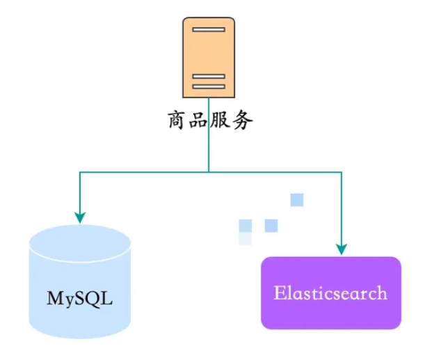
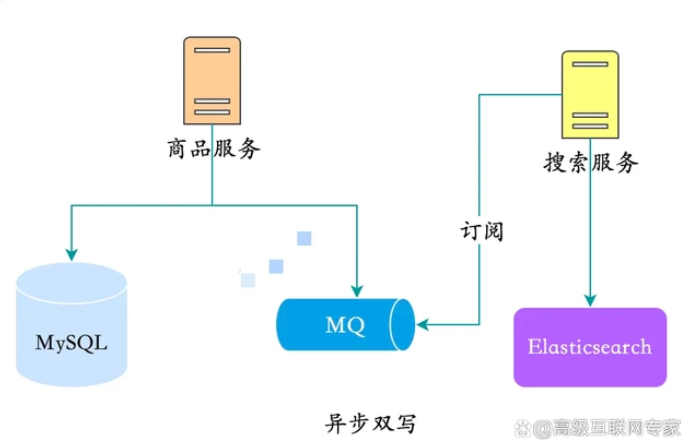
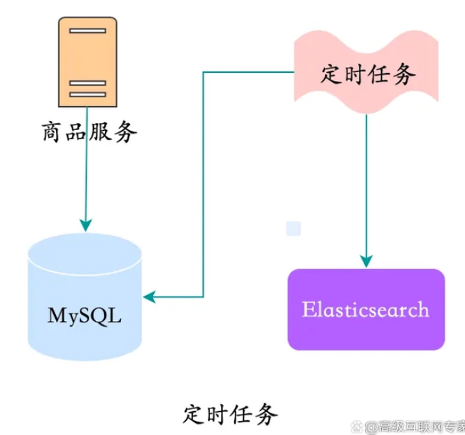
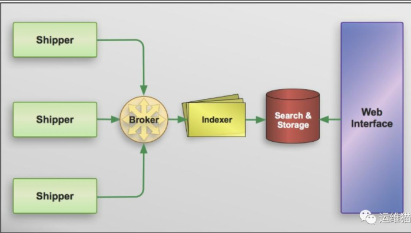
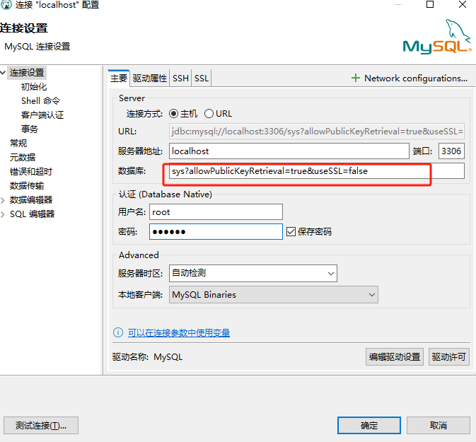
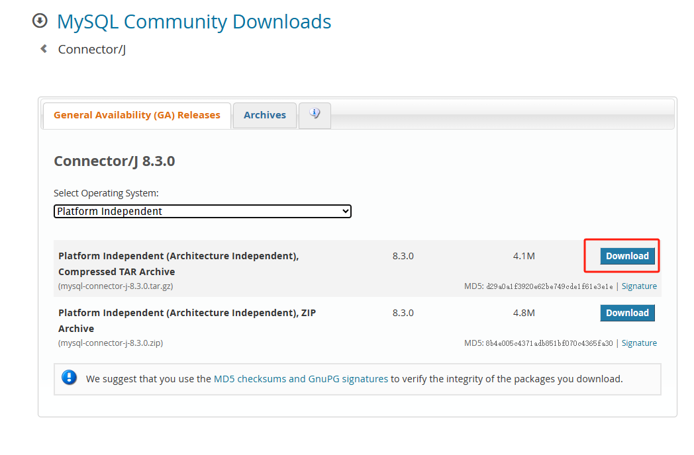
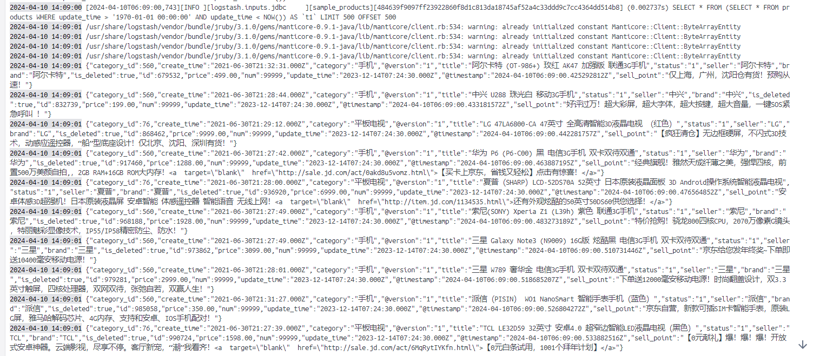
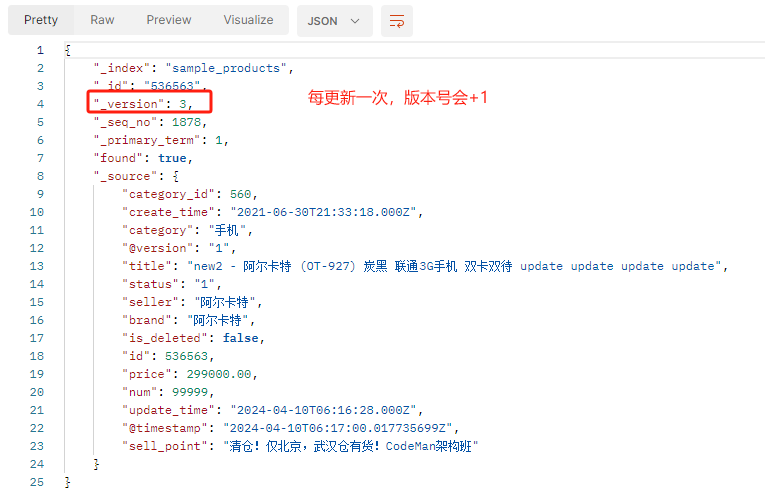

# ELK

## MySQL同步ES方案

在实际项目开发中，我们经常将 MySQL 作为业务数据库，ES 作为查询数据库，用来实现读写分离，缓解 MySQL 数据库的查询压力，应对海量数据的复杂查询。
这其中有一个很重要的问题，就是如何实现 MySQL 数据库和 ES 的数据同步，今天和大家聊聊 MySQL 和 ES 数据同步的各种方案。
我们先看看下面 4 种常用的数据同步方案。

### 同步双写

同步双写是指在主库上进行数据修改操作时，同步将数据写入到备库中。这种方式保证了主库与备库中的数据一致性，但会增加主库的写入延迟，并且备库出现问题时会影响主库的性能



优点：

- 业务逻辑简单；
- 实时性高。

缺点：

- 硬编码，有需要写入 MySQL 的地方都需要添加写入 ES 的代码；
- 业务强耦合；
- 存在双写失败丢数据风险；
- 性能较差，本来 MySQL 的性能不是很高，再加一个 ES，系统的性能必然会下降

### 异步双写

异步双写是指在主库上进行数据修改操作时，异步将数据写入到MQ中。这种方式可以降低主库的写入延迟，并且备库出现问题时不会影响主库的性能，但是可能会存在主备数据不一致的情况。

优点：

- 性能高；
- 不易出现数据丢失问题，主要基于 MQ 消息的消费保障机制，比如 ES 宕机或者写入失败，还能重新消费 MQ 消息；
- 多源写入之间相互隔离，便于扩展更多的数据源写入。

缺点：

- 硬编码问题，接入新的数据源需要实现新的消费者代码；
- 系统复杂度增加，引入了消息中间件；
- MQ是异步消费模型，用户写入的数据不一定可以马上看到，造成延时。

### 定时拉取

上面两种方案中都存在硬编码问题，代码的侵入性太强，如果对实时性要求不高的情况下，可以考虑用定时器来处理：

1. 数据库的相关表中增加一个字段为 timestamp 的字段，任何 CURD 操作都会导致该字段的时间发生变化；
2. 原来程序中的 CURD 操作不做任何变化；
3. 增加一个定时器程序，让该程序按一定的时间周期扫描指定的表，把该时间段内发生变化的数据提取出来；
4. 逐条写入到 ES 中。



优点：

- 不改变原来代码，没有侵入性、没有硬编码；
- 没有业务强耦合，不改变原来程序的性能；
- Worker 代码编写简单不需要考虑增删改查。

缺点：

- 时效性较差，由于是采用定时器根据固定频率查询表来同步数据，尽管将同步周期设置到秒级，也还是会存在一定时间的延迟；
- 对数据库有一定的轮询压力，一种改进方法是将轮询放到压力不大的从库上。

**经典方案：**借助 Logstash 实现数据同步，其底层实现原理就是根据配置定期使用 SQL 查询新增的数据写入 ES 中，实现数据的增量同步。

### 基于binlog实现同步

上面三种方案要么有代码侵入，要么有硬编码，要么有延迟，那么有没有一种方案既能保证数据同步的实时性又没有代入侵入呢？

当然有，可以利用 MySQL 的 Binlog 来进行同步。

具体步骤如下：

- 读取 MySQL 的 Binlog 日志，获取指定表的日志信息；
- 将读取的信息转为 MQ；
- 编写一个 MQ 消费程序；
- 不断消费 MQ，每消费完一条消息，将消息写入到 ES 中。

优点：

- 没有代码侵入、没有硬编码；
- 原有系统不需要任何变化，没有感知；
- 性能高；
- 业务解耦，不需要关注原来系统的业务逻辑。

缺点：

- 构建 Binlog 系统复杂；
- 如果采用 MQ 消费解析的 Binlog 信息，也会像方案二一样存在 MQ 延时的风险。
- 需要增加同步器组件模拟从节点
- 通用性不好（只适合MySQL）
- 依赖第三方

**经典方案：**使用canal监听binlog同步数据到es

### 建议

一般不考虑同步和异步双写，只考虑定时拉取和利用MySQL binglog实现实时同步，因为后两种方式没有代码侵入。定时拉取的通用性更高，实现简单，兼容性好。而利用MySQL binglog，通用性不好（只适合MySQL），依赖第三方

## Logstash

### 简介

Elasticsearch是当前主流的分布式大数据存储和搜索引擎，可以为用户提供强大的全文本检索能力，广泛应用于日志检索，全站搜索等领域。Logstash作为Elasicsearch常用的实时数据采集引擎，可以采集来自不同数据源的数据，并对数据进行处理后输出到多种输出源，是Elastic Stack 的重要组成部分。

### 架构

基于 Logstash 构建的日志收集处理体系是基于消息的，整个系统分别由四个组件组成。

- Shipper 搬运者，将事件发送到 Logstash 。一般来说在应用服务所在的机器上只需要部署该组件。
- Broker and Indexer 收集事件并进行处理，完成如数据过滤，数据格式化等，然后传输到指定存储系统或是进行在本地数据持久化等。
- Search and Storage 用于存储和搜索事件。
- Web Interface 网络接口。简单来说就是通过 Web 向用户展示数据并提供检索服务等。



Broker and Indexer 一般均由 Logstash 担当，除此之外，logstash 也可以同时作为 Shipper ，可以理解为一种自收自发的模式。不过 Logstash 同时作为 Shipper 的话，就表示每台应用服务器的机器都需要部署 Logstash 实例，比起 filebeat 这种专门用于收集发送的应用资源消耗更大（filebeat 也可以跳过 Logstash ，直接将事件传输到如 Elasticsearch 的存储服务，但是 filebeat 在数据处理方面过于薄弱）

> [Flume、Logstash、Filebeat对比 - jason47 - 博客园 (cnblogs.com)](https://www.cnblogs.com/anenyang/p/16458639.html)

### 工作原理

**处理过程**

如上图，Logstash的数据处理过程主要包括：Inputs, Filters, Outputs 三部分， 另外在Inputs和Outputs中可以使用Codecs对数据格式进行处理。这四个部分均以插件形式存在，用户通过定义pipeline配置文件，设置需要使用的input，filter，output, codec插件，以实现特定的数据采集，数据处理，数据输出等功能  

- Inputs：用于从数据源获取数据，常见的插件如file, syslog, redis, beats 等
- Filters：用于处理数据如格式转换，数据派生等，常见的插件如grok, mutate, drop,  clone, geoip等
- Outputs：用于数据输出，常见的插件如elastcisearch，file, graphite, statsd等
- Codecs：Codecs不是一个单独的流程，而是在输入和输出等插件中用于数据转换的模块，用于对数据进行编码处理，常见的插件如json，multiline

可以点击每个模块后面的详细参考链接了解该模块的插件列表及对应功能 

**执行模型**

- 每个Input启动一个线程，从对应数据源获取数据  
- Input会将数据写入一个队列：默认为内存中的有界队列（意外停止会导致数据丢失）。为了防止数丢失Logstash提供了两个特性：
  - Persistent Queues：通过磁盘上的queue来防止数据丢失
  - Dead Letter Queues：保存无法处理的event（仅支持Elasticsearch作为输出源）  
- Logstash会有多个pipeline worker, 每一个pipeline worker会从队列中取一批数据，然后执行filter和output（worker数目及每次处理的数据量均由配置确定）

### 配置文件详解

### 实战

1、下载ik分词器

https://github.com/infinilabs/analysis-ik/releases/tag/v8.12.2

将解压后的后的文件夹挂载到ES根目录下的plugins目录下

2、启动ES

```shell
#创建elastic专用网络
docker network create elastic
# 部署禁用安全设置的es单节点集群
docker run -d --name es01 --net elastic -p9200:9200 -p9300:9300 -e discovery.type=single-node -e xpack.security.enabled=false -v D:\es\plugins\:/usr/share/elasticsearch/plugins/ -t docker.elastic.co/elasticsearch/elasticsearch:8.12.2 
```

验证es是否启动成功：http://127.0.0.1:9200/

创建MySQL数据同步的索引映射：

http://127.0.0.1:9200/sample_products PUT

```json
{
    "mappings": {
        "properties": {
            "title": {
                "type": "text",
                "analyzer": "ik_max_word",
                "search_analyzer": "ik_smart"
            },
            "sell_point": {
                "type": "text",
                "analyzer": "ik_max_word",
                "search_analyzer": "ik_smart"
            },
            "category": {
                "type": "keyword"
            },
            "brand": {
                "type": "keyword"
            },
            "seller": {
                "type": "keyword"
            },
            "is_deleted": {
                "type": "boolean"
            }
        }
    }
}
```

3、启动MySQL

```shell
docker run -d -p 3306:3306 --name mysql --net elastic -e MYSQL_ROOT_PASSWORD=123456  -e BINGLOG_FORMAT=ROW --privileged=true mysql
```

①使用第三方客户端连接MYSQL

> 问题：连接MYSQL报错“Public Key Retrieval is not allowed”
>
> 原因：mysql账号的密码是用的sha256方式加密，而客户端连接mysql的时候并非使用TLS协议传输参数，那么需要客户端使用RSA算法公钥加密传输参数，而服务端默认是不允许客户端获取公钥，需要开启这个开关。
>
> 解决办法1： 客户端的驱动连接参数中增加：allowPublicKeyRetrieval=true&useSSL=false
>
> 
>
> 解决办法2：
>
> - #### 从服务器获取 CA 公钥：首先，需要从 MySQL 服务器上获取 CA（证书颁发机构）的公钥文件（通常是 `ca.pem`）。
>
> - #### 安全地复制公钥文件：使用安全的文件传输方法（如 SCP）将公钥文件从服务器复制到本地客户端。或者使用`cat /var/lib/mysql/ca.pem`读取证书，保存到本地
>
> - #### 配置 JDBC 连接：在 JDBC URL 中配置 SSL 连接，指定 CA 公钥文件的路径。例如：jdbc:mysql://hostname:port/dbname?useSSL=true&trustCertificateKeyStoreUrl=file:/path/to/ca.pem
>
>   这告诉 JDBC 驱动在建立 SSL 连接时使用这个公钥文件来验证服务器。

②创建sample库

③执行sql脚本，导入测试数据“配置文件\MySQL同步-示例商品数据.sql”

4、logstash配置文件

①打开驱动jar包下载地址：https://dev.mysql.com/downloads/connector/j/

选择平台无关的版本



②config/pipelines.yml

```yml
- pipeline.id: sample_products
  path.config: "/usr/share/logstash/pipeline/sample_products.conf"
  #可以添加多个管道
  #path.config: "/usr/share/logstash/pipeline/sample_products1.conf"
```

③pipeline/sample_products.conf

pipeline文件夹中可以定义多个数据源配置文件

```xml
input {
   jdbc {
      # 指定JDBC连接MySQL驱动程序库
      jdbc_driver_library => "/opt/jdbc/mysql-connector-j-8.3.0.jar"
      # MySQL驱动类
      jdbc_driver_class => "com.mysql.cj.jdbc.Driver"
      # 数据库连接字符串
      jdbc_connection_string => "jdbc:mysql://mysql:3306/sample?allowPublicKeyRetrieval=true&useSSL=false"
      # 数据库用户名
      jdbc_user => "root"
      # 数据库密码
      jdbc_password => "123456"
      # 是否启用分页，建议启用，配合分页大小限制每次查询数据量，避免数据量过大引起超时
      jdbc_paging_enabled => "true"
      # 分页大小，根据时间间隔设置一个合理的值
      jdbc_page_size => "500"
      # 指定跟踪列，会根据这个列来查询最新数据
      tracking_column => "update_time"
      # 跟踪列类型，默认是numeric。
      tracking_column_type => "timestamp"
      # 是否需要持久化跟踪列的值。当参数设置成true时，会持久化tracking_column参数所指定的列的最新的值，并在下一次管道执行时通过该列的值来判断需要更新的记录。
      use_column_value => "true"
      # 指定要运行的SQL语句，查询出来的数据会更新到es，:sql_last_value 表示记录的上次运行时跟踪列的最新值，筛选的数据区间为 update_time 大于上次时间，小于最新时间
      statement => "SELECT * FROM products WHERE update_time > :sql_last_value AND update_time < NOW()"
      # 定时运行SQL语句的时间表，采用 Cron 时间格式，这里设置为每分钟运行一次
      schedule => "* * * * *"
  }
}

output {
    elasticsearch {
        # 配置ES集群地址，logstash 同样可以运行在docker中，所以这里可以通过容器名称连接es
        hosts => ["es01:9200"]
        # 索引名称（必须小写）
        index => "sample_products"
        # 用户名
        # user => ""
        # 密码
        # password => ""
        # 数据唯一索引，一般使用主键 id
        document_id => "%{id}"
    }
   stdout {
      codec => json_lines
   }
}
```

5、启动logstash

```shell
# 部署 logstash 容器，注意修改本地挂载目录
docker run -d --name logstash --net elastic -v D:\logstash\jdbc\:/opt/jdbc/ -v D:\logstash\config\pipelines.yml:/usr/share/logstash/config/pipelines.yml -v D:\logstash\pipeline\:/usr/share/logstash/pipeline/ -t docker.elastic.co/logstash/logstash:8.12.2
```

> mysql、es、logstash必须再同一网络内（使用--net配置网络），否则互相不能通信

6、测试

查询是否同步成功：

①postman：http://127.0.0.1:9200/sample_products/_search  GET

```json
{
    "size":20,
    "query":{
        "bool":{
            "must":[
                {"term":{"brand":"华为"}},
                {"match":{"title":"4G手机"}},
                {"match":{"sell_point":"四核"}},
                {"term":{"is_deleted":false}}
            ],
            "should":[
                {"match":{"title":"白色"}}
            ]
        }
    }
}
```

②stdout：logstash的log日志



修改某条记录

①postman：http://127.0.0.1:9200/sample_products/_doc/536563  GET



②stdout：logstash的log日志

## NFS

[【运维知识进阶篇】集群架构-NFS网络文件系统_nfs取消挂载-CSDN博客](https://blog.csdn.net/qq_37510195/article/details/130001332)