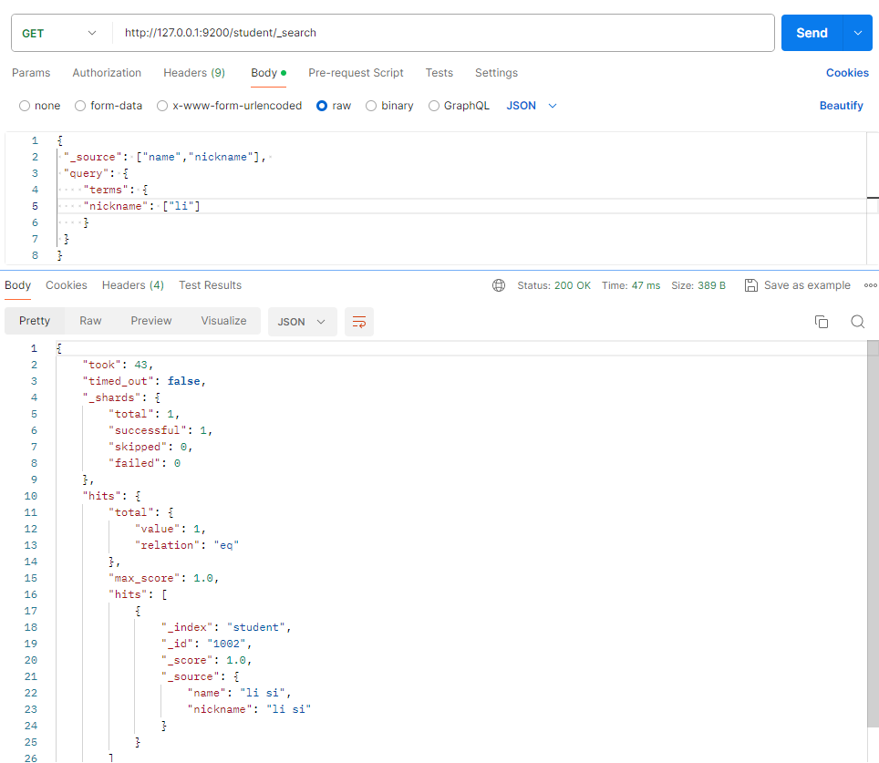

# Elasticsearch概述

## Elasticsearch是什么

Elasticsearch是一个分布式、RESTful风格的搜索和数据分析引擎,能够解决不断涌现的各种用例，作为Elastic Stack的核心，它集中存储您的数据，帮助您发现意料之中以及意料之外的情况。

The Elastic Stack, 包括 Elasticsearch、Kibana、Beats 和 Logstash（也称为 ELK Stack）。能够安全可靠地获取任何来源、任何格式的数据，然后实时地对数据进行搜索、分析和可视化。Elaticsearch，简称为 ES，ES 是一个`开源的高扩展的分布式全文搜索引擎`，是整个 Elastic Stack 技术栈的核心。它可以近乎实时的存储、检索数据；本身扩展性很好，可以扩展到上百台服务器，处理 PB 级别的数据

## 全文搜索引擎

Google，百度类的网站搜索，它们都是根据网页中的关键字生成索引，我们在搜索的时候输入关键字，它们会将该关键字即索引匹配到的所有网页返回；还有常见的项目中应用日志的搜索等等。对于这些非结构化的数据文本，关系型数据库搜索不是能很好的支持。一般传统数据库，全文检索都实现的很鸡肋，因为一般也没人用数据库存文本字段。进行全文检索需要扫描整个表，如果数据量大的话即使对 SQL 的语法优化，也收效甚微。建立了索引，但是维护起来也很麻烦，对于 insert 和 update 操作都会重新构建索引。基于以上原因可以分析得出，在一些生产环境中，使用常规的搜索方式，性能是非常差的：

- 搜索的数据对象是大量的非结构化的文本数据。
- 文件记录量达到数十万或数百万个甚至更多。
-  支持大量基于交互式文本的查询。
-  需求非常灵活的全文搜索查询。
-  对高度相关的搜索结果的有特殊需求，但是没有可用的关系数据库可以满足。
- 对不同记录类型、非文本数据操作或安全事务处理的需求相对较少的情况。

为了解决结构化数据搜索和非结构化数据搜索性能问题，我们就需要专业，健壮，强大的全文搜索引擎这里说到的全文搜索引擎指的是目前广泛应用的主流搜索引擎。它的工作原理是计算机索引程序通过扫描文章中的每一个词，对每一个词建立一个索引，指明该词在文章中出现的次数和位置，当用户查询时，检索程序就根据事先建立的索引进行查找，并将查找的结果反馈给用户的检索方式。这个过程类似于通过字典中的检索字表查字的过程

## Elasticsearch And Solr

Lucene 是 Apache 软件基金会 Jakarta 项目组的一个子项目，提供了一个简单却强大的应用程式接口，能够做全文索引和搜寻。在 Java 开发环境里 Lucene 是一个成熟的免费开源工具。就其本身而言，Lucene 是当前以及最近几年最受欢迎的免费 Java 信息检索程序库。但 Lucene 只是一个提供全文搜索功能类库的核心工具包，而真正使用它还需要一个完善的服务框架搭建起来进行应用。

目前市面上流行的搜索引擎软件，主流的就两款：**Elasticsearch** 和 **Solr**,这两款都是基于 Lucene 搭建的，可以独立部署启动的搜索引擎服务软件。由于内核相同，所以两者除了服务器安装、部署、管理、集群以外，对于数据的操作 修改、添加、保存、查询等等都十分类似。

在使用过程中，一般都会将 Elasticsearch 和 Solr 这两个软件对比，然后进行选型。这两个搜索引擎都是流行的，先进的的开源搜索引擎。它们都是围绕核心底层搜索库 - Lucene构建的 - 但它们又是不同的。像所有东西一样，每个都有其优点和缺点：


## Elasticsearch Or Solr

Elasticsearch 和 Solr 都是开源搜索引擎，那么我们在使用时该如何选择呢？

- Google 搜索趋势结果表明，与 Solr 相比，Elasticsearch 具有很大的吸引力，但这并不意味着 Apache Solr 已经死亡。虽然有些人可能不这么认为，但 Solr 仍然是最受欢迎的搜索引擎之一，拥有强大的社区和开源支持。

- 与 Solr 相比，Elasticsearch 易于安装且非常轻巧。此外，你可以在几分钟内安装并运行Elasticsearch。但是，如果 Elasticsearch 管理不当，这种易于部署和使用可能会成为一个问题。基于 JSON 的配置很简单，但如果要为文件中的每个配置指定注释，那么它不适
  合您。总的来说，如果你的应用使用的是 JSON，那么 Elasticsearch 是一个更好的选择。否则，请使用 Solr，因为它的 schema.xml 和 solrconfig.xml 都有很好的文档记录。

- Solr 拥有更大，更成熟的用户，开发者和贡献者社区。ES 虽拥有的规模较小但活跃的用户社区以及不断增长的贡献者社区。

  Solr 贡献者和提交者来自许多不同的组织，而 Elasticsearch 提交者来自单个公司。

- Solr 更成熟，但 ES 增长迅速，更稳定。

- Solr 是一个非常有据可查的产品，具有清晰的示例和 API 用例场景。 Elasticsearch 的文档组织良好，但它缺乏好的示例和清晰的配置说明。

那么，到底是 Solr 还是 Elasticsearch？有时很难找到明确的答案。无论您选择 Solr 还是 Elasticsearch，首先需要了解正确的用例和未来需求。总结他们的每个属性。

- 由于易于使用，Elasticsearch 在新开发者中更受欢迎。一个下载和一个命令就可以启动一切。
- 如果除了搜索文本之外还需要它来处理分析查询，Elasticsearch 是更好的选择
- 如果需要分布式索引，则需要选择 Elasticsearch。对于需要良好可伸缩性和以及性能分布式环境，Elasticsearch 是更好的选择。
- Elasticsearch 在开源日志管理用例中占据主导地位，许多组织在 Elasticsearch 中索引它们的日志以使其可搜索。
- 如果你喜欢监控和指标，那么请使用 Elasticsearch，因为相对于 Solr，Elasticsearch 暴露了更多的关键指标

### Elasticsearch 应用案例

- GitHub: 2013 年初，抛弃了 Solr，采取 Elasticsearch 来做 PB 级的搜索。“GitHub 使用
  Elasticsearch 搜索 20TB 的数据，包括 13 亿文件和 1300 亿行代码”。
- 维基百科：启动以 Elasticsearch 为基础的核心搜索架构
- SoundCloud：“SoundCloud 使用 Elasticsearch 为 1.8 亿用户提供即时而精准的音乐搜索服务”。
- 百度：目前广泛使用 Elasticsearch 作为文本数据分析，采集百度所有服务器上的各类指标数据及用户自定义数据，通过对各种数据进行多维分析展示，辅助定位分析实例异常或业务层面异常。目前覆盖百度内部 20 多个业务线（包括云分析、网盟、预测、文库、
  直达号、钱包、风控等），单集群最大 100 台机器，200 个 ES 节点，每天导入 30TB+数据。
- 新浪：使用 Elasticsearch 分析处理 32 亿条实时日志。
- 阿里：使用 Elasticsearch 构建日志采集和分析体系。
- Stack Overflow：解决 Bug 问题的网站，全英文，编程人员交流的网站。

# Elasticsearch入门

## Elasticsearch 安装

### 下载软件

Elasticsearch 的官方地址：https://www.elastic.co/cn/

Elasticsearch 最新的版本是 8.12.2 版本，下载地址：https://www.elastic.co/cn/downloads/past-releases#elasticsearch

Kibana 最新的版本是 8.12.2 版本，下载地址：[Download Kibana Free | Get Started Now | Elastic](https://link.zhihu.com/?target=https%3A//www.elastic.co/cn/downloads/kibana)

Elasticsearch 分为 Linux 和 Windows 版本，基于我们主要学习的是 Elasticsearch 的 Java客户端的使用，所以课程中使用的是安装较为简便的 Windows 版本。

### 安装软件

##### Elasticsearch

Windows 版的 Elasticsearch 的安装很简单，解压即安装完毕，解压后的 Elasticsearch 的目录结构如下：


解压后，修改config/elasticsearch.yml配置，然后点击 bin/elasticsearch.bat 文件启动 ES 服务。

```yml
cluster.name: es-8.4.2
node.name: es-9201
path.data: D:\es-cluster\8.4.2\data\9201
path.logs: D:\es-cluster\8.4.2\logs\9201
network.host: 127.0.0.1
http.port: 9201
transport.port: 9301
```


控制台中会输出一段信息：


这是 es 自动为环境生产的账号和证书等信息，把它复制保存下来，稍后会用到：

```shell
✅ Elasticsearch security features have been automatically configured!
✅ Authentication is enabled and cluster connections are encrypted.

ℹ️  Password for the elastic user (reset with `bin/elasticsearch-reset-password -u elastic`):
  vrXJc_VGzwpW6WVr5vWR

ℹ️  HTTP CA certificate SHA-256 fingerprint:
  92c7c1a08f7b52346695d62ee736dff741ffc58369416384fc016367a88012b4

ℹ️  Configure Kibana to use this cluster:
• Run Kibana and click the configuration link in the terminal when Kibana starts.
• Copy the following enrollment token and paste it into Kibana in your browser (valid for the next 30 minutes):
  eyJ2ZXIiOiI4LjEyLjIiLCJhZHIiOlsiMTI3LjAuMC4xOjkyMDEiXSwiZmdyIjoiOTJjN2MxYTA4ZjdiNTIzNDY2OTVkNjJlZTczNmRmZjc0MWZmYzU4MzY5NDE2Mzg0ZmMwMTYzNjdhODgwMTJiNCIsImtleSI6IkxaZnVkSTRCYzk2Tk9mb0RQelVBOjF2SThGVVhCUmNLcjN3cWEyNXhheGcifQ==
```

**注意：**9300 端口为 Elasticsearch 集群间组件的通信端口，9200 端口为浏览器访问的 http协议 RESTful 端口。
打开浏览器（推荐使用谷歌浏览器)，输入地址：http://localhost:9201，输入控制台显示的用户名及密码，测试结果如下：


##### Kibana

解压下载的kibana 8.12.2 压缩包，先不用修改配置文件，重写开启一个命令窗口，执行命令：

使用控制台中给出的http://localhost:5601/?code=829265的地址访问 kibana：

输入token（在我们保存的信息中），*注意：token只在生成的30分钟内有效：Copy the following enrollment token and paste it into Kibana in your browser (valid for the next 30 minutes)*


点击 Configure Elastic ，kibana 配置完成后，弹窗登录页，和上面一样，输入用户名和密码。

## Elasticsearch 基本操作

### RESTful

- REST 指的是一组架构约束条件和原则。满足这些约束条件和原则的应用程序或设计就是 RESTful。Web 应用程序最重要的 REST 原则是，客户端和服务器之间的交互在请求之间是无状态的。从客户端到服务器的每个请求都必须包含理解请求所必需的信息。如果服务器在请求之间的任何时间点重启，客户端不会得到通知。此外，无状态请求可以由任何可用服务器回答，这十分适合云计算之类的环境。客户端可以缓存数据以改进性能。
- 在服务器端，应用程序状态和功能可以分为各种资源。资源是一个有趣的概念实体，它向客户端公开。资源的例子有：应用程序对象、数据库记录、算法等等。每个资源都使用 URI(Universal Resource Identifier) 得到一个唯一的地址。所有资源都共享统一的接口，以便在客户端和服务器之间传输状态。使用的是标准的 HTTP 方法，比如 GET、PUT、POST 和DELETE。
- 在 REST 样式的 Web 服务中，每个资源都有一个地址。资源本身都是方法调用的目标，方法列表对所有资源都是一样的。这些方法都是标准方法，包括 HTTP GET、POST、PUT、DELETE，还可能包括 HEAD 和 OPTIONS。简单的理解就是，如果想要访问互联网上的资源，就必须向资源所在的服务器发出请求，请求体中必须包含资源的网络路径，以及对资源进行的操作(增删改查)

### 客户端安装

如果直接通过浏览器向 Elasticsearch 服务器发请求，那么需要在发送的请求中包含HTTP 标准的方法，而 HTTP 的大部分特性且仅支持 GET 和 POST 方法。所以为了能方便地进行客户端的访问，可以使用 Postman 软件

Postman 是一款强大的网页调试工具，提供功能强大的 Web API 和 HTTP 请求调试。软件功能强大，界面简洁明晰、操作方便快捷，设计得很人性化。Postman 中文版能够发送任何类型的 HTTP 请求 (GET, HEAD, POST, PUT..)，不仅能够表单提交，且可以附带任意类型请求体。

Postman 官网：https://www.getpostman.com

Postman 下载：https://www.getpostman.com/apps

### 数据格式

Elasticsearch 是面向文档型数据库，一条数据在这里就是一个文档。为了方便大家理解，我们将 Elasticsearch 里存储文档数据和关系型数据库 MySQL 存储数据的概念进行一个类比ES里的Index可以看做一个库，而Types相当于表，Documents则相当于表的行。


这里Types的概念已经被逐渐弱化，Elasticsearch 6.X中，一个index下已经只能包含一个type，Elasticsearch 7.X中, Type的概念已经被删除了。

### HTTP操作

#### 索引操作

##### 创建索引

对比关系型数据库，创建索引就等同于创建数据库

在 Postman 中，向 ES 服务器发 **PUT** 请求 ：http://127.0.0.1:9200/shopping


返回结果：

- acknowledged：响应结果。true，操作成功
- shards_acknowledged：分片结果。true，分片操作成功
- index：索引名

如果重复添加索引，会返回错误信息


##### 查看所有索引

在 Postman 中，向 ES 服务器发 GET 请求 ：http://127.0.0.1:9200/_cat/indices?v

这里请求路径中的_cat 表示查看的意思，indices 表示索引，所以整体含义就是查看当前 ES服务器中的所有索引，就好像 MySQL 中的 show tables 的感觉，服务器响应结果如下：


返回结果：

- health：当前服务器健康状态，green：(集群完整) yellow(单点正常、集群不完整) red(单点不正常)
- status：索引打开、关闭状态
- index：索引名
- uuid：索引统一编号
- pri： 主分片数量
- rep ：副本数量
- docs.count：可用文档数量
- docs.deleted：文档删除状态（逻辑删除）
- store.size：主分片和副分片整体占空间大小
- pri.store.size：主分片占空间大小

##### 查看单个索引

在 Postman 中，向 ES 服务器发 **GET** 请求 ：http://127.0.0.1:9200/shopping


返回结果：

- shopping：索引名
- aliases：别名
- mappings：映射
- settings：设置
- index：设置-索引
- creation_date：设置-索引-创建时间
- number_of_shards：设置-索引-主分片数量
- number_of_replicas：设置-索引-副本数量
- uuid：设置-索引-唯一标识
- version：设置-索引-版本
- provided_name：设置-索引-名称

##### 删除索引

在 Postman 中，向 ES 服务器发 DELETE 请求 ：http://127.0.0.1:9200/shopping


#### 文档操作

##### 创建文档

索引已经创建好了，接下来我们来创建文档，并添加数据。这里的文档可以类比为关系型数据库中的表数据，添加的数据格式为 JSON 格式

在 Postman 中，向 ES 服务器发 **POST** 请求 ：http://127.0.0.1:9200/shopping/_doc

请求体内容为：

```json
{
 "title":"小米手机",
 "category":"小米",
 "images":"http://www.gulixueyuan.com/xm.jpg",
 "price":3999.00
}
```

此处发送请求的方式必须为 **POST**，不能是 **PUT**，否则会发生错误


返回结果

- _id：可以类比Mysql中的主键，随机生成
- _version：版本
- _shards：分片

上面的数据创建后，由于没有指定数据唯一性标识（ID），默认情况下，ES 服务器会随机

生成一个。如果想要自定义唯一性标识，需要在创建时指定：http://127.0.0.1:9200/shopping/_doc/1


此处需要注意：如果增加数据时明确数据主键，那么请求方式也可以为 PUT

##### 查看文档

查看文档时，需要指明文档的唯一性标识，类似于 MySQL 中数据的主键查询

在 Postman 中，向 ES 服务器发 **GET** 请求 ：http://127.0.0.1:9200/shopping/_doc/1


返回结果：

- found：查询结果。true，表示查找到；false表示未查找到
- _source：文档信息源

##### 修改文档

和新增文档一样，输入相同的 URL 地址请求，如果请求体变化，会将原有的数据内容覆盖

在 Postman 中，向 ES 服务器发 **POST** 请求 ：http://127.0.0.1:9200/shopping/_doc/1

```json
{
 "title":"华为手机",
 "category":"华为",
 "images":"http://www.gulixueyuan.com/hw.jpg",
 "price":4999.00
}
```


##### 修改字段

修改数据时，也可以只修改某一给条数据的局部信息

在 Postman 中，向 ES 服务器发 **POST** 请求 ：http://127.0.0.1:9200/shopping/_update/1

请求体内容为

```json
{ 
 "doc": {
 "price":3000.00
 } 
}
```


根据唯一性标识，查询文档数据，文档数据已经更新


##### 删除文档

删除一个文档不会立即从磁盘上移除，它只是被标记成已删除（逻辑删除）。

在 Postman 中，向 ES 服务器发 **DELETE** 请求 ：http://127.0.0.1:9200/shopping/_doc/1


删除后再查询当前文档信息


##### 条件删除文档

一般删除数据都是根据文档的唯一性标识进行删除，实际操作时，也可以根据条件对多条数据进行删除。

首先分别增加多条数据:

```json
{
 "title":"华为手机1",
 "category":"华为1",
 "images":"http://www.gulixueyuan.com/xm.jpg",
 "price":3999.00
}
{
 "title":"华为手机2",
 "category":"华为2",
 "images":"http://www.gulixueyuan.com/xm.jpg",
 "price":4000.00
}
{
 "title":"华为手机3",
 "category":"华为3",
 "images":"http://www.gulixueyuan.com/xm.jpg",
 "price":4000.00
}
{
 "title":"华为手机4",
 "category":"华为4",
 "images":"http://www.gulixueyuan.com/xm.jpg",
 "price":4999.00
}
```


请求体内容

```json
{
 "query":{
 "match":{
 "price":4000.00
 }
 }
}
```


#### 映射操作

有了索引库，等于有了数据库中的 database。
接下来就需要建索引库(index)中的映射了，类似于数据库(database)中的表结构(table)。创建数据库表需要设置字段名称，类型，长度，约束等；索引库也一样，需要知道这个类型下有哪些字段，每个字段有哪些约束信息，这就叫做映射(mapping)

##### 创建映射

在 Postman 中，向 ES 服务器发 PUT 请求 ：http://127.0.0.1:9200/student/_mapping
请求体内容为

```json
 "properties": {
 "name":{
 "type": "text",
 "index": true
 },
 "sex":{
 "type": "text",
 "index": false
 },
 "age":{
 "type": "long",
 "index": false
 }
 }
}
```


映射数据说明：

- 字段名：任意填写，下面指定许多属性，例如：title、subtitle、images、price

- type：类型，Elasticsearch 中支持的数据类型非常丰富，说几个关键的：

  - String 类型，又分两种：

    text：可分词
    keyword：不可分词，数据会作为完整字段进行匹配

  - Numerical：数值类型，分两类

    基本数据类型：long、integer、short、byte、double、float、half_float

    浮点数的高精度类型：scaled_float

  - Date：日期类型

  -  Array：数组类型

  - Object：对象

- index：是否索引，默认为 true，也就是说你不进行任何配置，所有字段都会被索引。

  true：字段会被索引，则可以用来进行搜索

  false：字段不会被索引，不能用来搜索

- store：是否将数据进行独立存储，默认为 false

  原始的文本会存储在_source 里面，默认情况下其他提取出来的字段都不是独立存储
  的，是从_source 里面提取出来的。当然你也可以独立的存储某个字段，只要设置
  "store": true 即可，获取独立存储的字段要比从_source 中解析快得多，但是也会占用
  更多的空间，所以要根据实际业务需求来设置。

- analyzer：分词器，这里的 ik_max_word 即使用 ik 分词器,后面会有专门的章节学习

##### 查看映射

在 Postman 中，向 ES 服务器发 GET 请求 ：http://127.0.0.1:9200/student/_mapping


#####   索引映射关联

在 Postman 中，向 ES 服务器发 PUT 请求 ：http://127.0.0.1:9200/student1

```json
{
 "settings": {},
 "mappings": {
 "properties": {
    "name":{
     "type": "text",
     "index": true

    },
    "sex":{
     "type": "text",
     "index": false
    },
    "age":{
     "type": "long",
     "index": false
    }
 }
 }
}
```


  说明：与创建映射的区别是，创建映射之前必须先创建索引，而索引映射关联不需要

####   高级查询

Elasticsearch 提供了基于 JSON 提供完整的查询 DSL 来定义查询

创建映射：

```json
//http://127.0.0.1:9200/student/_mapping
{
 "properties": {
    "name":{
    "type": "text",
    "index": true
    },
    "nickname":{
    "type": "text",
    "index": true
    },
    "sex":{
    "type": "text",
    "index": false
    },
    "age":{
    "type": "long",
    "index": false
    }
 }
}
```


创建数据 :

```json
//POST /student/_doc/1001
{
"name":"zhang san",
"nickname":"zhang san",
 "sex":"男",
 "age":30
}
//POST /student/_doc/1002
{
"name":"lisi",
"nickname":"lisi",
 "sex":"男",
 "age":20
}
//POST /student/_doc/1003
{
"name":"wangwu",
 "nickname":"wangwu",
 "sex":"女",
 "age":40
}
//# POST /student/_doc/1004
{
"name":"zhangsan1",
"nickname":"zhangsan1",
 "sex":"女",
 "age":50
}
//POST /student/_doc/1005
{
"name":"zhangsan2",
"nickname":"zhangsan2",
 "sex":"女",
 "age":30
}
//POST /student/_doc/1006
{
"name":"zhang jie",
"nickname":"zhang jie",
 "sex":"女",
 "age":30
}
//POST /student/_doc/1007
{
"name":"wang san",
"nickname":"wang san",
 "sex":"女",
 "age":30
}
```

##### 查询所有文档

在 Postman 中，向 ES 服务器发 GET 请求 ：http://127.0.0.1:9200/student/_search

```json
{
 "query": {
 "match_all": {}
 }
}
//"query"：这里的 query 代表一个查询对象，里面可以有不同的查询属性
//"match_all"：查询类型，例如：match_all(代表查询所有)， match，term ， range 等等
//{查询条件}：查询条件会根据类型的不同，写法也有差异
```


  返回结果：

- took：查询花费时间，单位毫秒
- timed_out：是否超时
- _shards：分片信息
  - total：总数
  - successful：成功
  - skipped：忽略
  - failed：失败
- hits：搜索命中结果
  - total：搜索条件匹配的文档总数
    - value：总命中计数的值
    - relation：计数规则。 eq 表示计数准确， gte 表示计数不准确
  - max_score：匹配度分值
  - hits：命中结果集合

##### 匹配查询

match 匹配类型查询，会把查询条件进行分词，然后进行查询，多个词条之间是 or 的关系
在 Postman 中，向 ES 服务器发 GET 请求 ：http://127.0.0.1:9200/student/_search

```json
{
 "query":{
    "match":{ 
        "name":"zhang"
    }
 }
}
```


##### 字段匹配查询

multi_match 与 match 类似，不同的是它可以在多个字段中查询。
在 Postman 中，向 ES 服务器发 GET 请求 ：http://127.0.0.1:9200/student/_search

```json
{
 "query": {
    "multi_match": {
    "query": "one",
    "fields": ["name","nickname"]
    }
 }
}
```


##### 关键字精确查询

term 查询，精确的关键词匹配查询，不对查询条件进行分词。
在 Postman 中，向 ES 服务器发 GET 请求 ：http://127.0.0.1:9200/student/_search

```json
{
 "query": {
    "term": {
        "name": "zhang"
    }
 }
}
```


**`match与term区别`**

- term：代表完全匹配，也就是精确查询，搜索前不会再对搜索词进行分词解析，直接对搜索词进行查找；
- match：代表模糊匹配，搜索前会对搜索词进行分词解析，然后按分词匹配查找；
- term主要用于精确搜索，match则主要用于模糊搜索；
- term精确搜索相较match模糊查询而言，效率较高；

以上面数据源为例。进行演示:

- term：代表完全匹配，也就是精确查询，搜索前不会再对搜索词进行分词解析，直接对搜索词进行查找；
- match：代表模糊匹配，搜索前会对搜索词进行分词解析，然后按分词匹配查找；

```json
//term
{
 "query": {
    "term": {
        "name": "zhang san"
    }
 }
}
//match
{
 "query":{
    "match":{ 
        "name":"zhang san"
    }
 }
}
```


如果我们只想精确匹配"张三"这个词，term查询出来显示无数据，从概念上看，term属于精确匹配，只能查单个词。

**terms**

如果我们想通过term匹配多个词的话，可以使用terms来实现：

```json
{
 "query": {
    "terms": {
        "name": ["zhang","san"]
    }
 }
}
```


可以看到，与含有“zhang”和"san"数据都成功返回，**因为terms里的`[ ]` 多个搜索词之间是or（或者）关系，只要满足其中一个词即可。**

**match_phrase**

match_phrase 称为短语搜索，要求所有的分词必须同时出现在文档中，同时位置必须紧邻一致。

```json
{
 "query":{
    "match_phrase":{ 
        "name":"zhang san"
    }
 }
}
```


##### 指定查询字段

默认情况下，Elasticsearch 在搜索的结果中，会把文档中保存在_source 的所有字段都返回。

如果我们只想获取其中的部分字段，我们可以添加_source 的过滤

在 Postman 中，向 ES 服务器发 GET 请求 ：http://127.0.0.1:9200/student/_search

```json
{
 "_source": ["name","nickname"], 
 "query": {
    "terms": {
    "nickname": ["li"]
    }
 }
}
```




##### 过滤字段

我们也可以通过：

- includes：来指定想要显示的字段
- excludes：来指定不想要显示的字段

在 Postman 中，向 ES 服务器发 GET 请求 ：http://127.0.0.1:9200/student/_search

```json
{
 "_source": {
 "includes": ["name","nickname"]
 },
 "query": {
    "terms": {
    "nickname": ["li"]
    }
 }
}
```


在 Postman 中，向 ES 服务器发 **GET** 请求 ：http://127.0.0.1:9200/student/_search

```json
{
 "_source": {
 "excludes": ["name","nickname"]
 },
 "query": {
    "terms": {
    "nickname": ["li"]
    }
 }
}
```


##### 范围查询

range 查询找出那些落在指定区间内的数字或者时间。range 查询允许以下字符：

| 操作符 |   说明   |
| :----: | :------: |
|   gt   |   大于   |
|  gte   | 大于等于 |
|   lt   |   小于   |
|  lte   | 小于等于 |

```json
{
    "query": {
        "range": {
            "age": {
            "gte": 50,
            "lte": 60
            }
        }
    }
}
```


##### 模糊查询

返回包含与搜索字词相似的字词的文档。

编辑距离是将一个术语转换为另一个术语所需的一个字符更改的次数。这些更改可以包括：

- 更改字符（box → fox）
- 删除字符（black → lack）
- 插入字符（sic → sick）
- 转置两个相邻字符（act → cat）

为了找到相似的术语，fuzzy 查询会在指定的编辑距离内创建一组搜索词的所有可能的变体或扩展。然后查询返回每个扩展的完全匹配。

通过 fuzziness 修改编辑距离。一般使用默认值 AUTO，根据术语的长度生成编辑距离。

fuzziness 参数可以配置为以下值：

- 0、1、2：允许对术语进行的编辑量。( 0：编辑次数仅允许完全匹配)
- AUTO：根据输入项的大小，定义编辑次数。

在 Postman 中，向 ES 服务器发 GET 请求 ：http://127.0.0.1:9200/student/_search

```json
{
    "query": {
        "fuzzy": {
            "name": {
            "value": "lit"
            }
        }
    }
}
```


模糊性是拼写错误的简单解决方案，但具有很高的CPU开销和非常低的精度，所以需要慎重使用。

##### 单字段排序

sort 可以让我们按照不同的字段进行排序，并且通过 order 指定排序的方式。desc 降序，asc升序。
在 Postman 中，向 ES 服务器发 GET 请求 ：http://127.0.0.1:9200/student/_search

```json
{
    "query": {
        "match": {
            "sex":"男"
            }
    },
    "sort": [{
        "age": {
            "order":"desc"
        }
     }]
}
```

##### 多字段排序

假定我们想要结合使用 age 和 _score 进行查询，并且匹配的结果首先按照年龄排序，然后按照相关性得分排序

在 Postman 中，向 ES 服务器发 **GET** 请求 ：http://127.0.0.1:9200/student/_search

```json
{
    "query": {
        "match_all": {}
    },
    "sort": [{
        "age": {
            "order":"desc"
        }
     },
     {
        "_score": {
            "order":"desc"
        }
     }]
}
```

##### 高亮查询

Elasticsearch 可以对查询内容中的关键字部分，进行标签和样式(高亮)的设置。

在使用 match 查询的同时，加上一个 highlight 属性：

- pre_tags：前置标签
- post_tags：后置标签
- fields：需要高亮的字段
- title：这里声明 title 字段需要高亮，后面可以为这个字段设置特有配置，也可以空

在 Postman 中，向 ES 服务器发 GET 请求 ：http://127.0.0.1:9200/student/_search

```json
{
    "query": {
        "match": {
        "name": "li"
        }
    },
    "highlight": {
    "pre_tags": "<font color='red'>",
    "post_tags": "</font>",
        "fields": {
        "name": {}
        }
    }
}
```


##### 分页查询

from：当前页的起始索引，默认从 0 开始。 from = (pageNum - 1) * size
size：每页显示多少条
在 Postman 中，向 ES 服务器发 GET 请求 ：http://127.0.0.1:9200/student/_search

```json
{
    "query": {
    "match_all": {}
    },
    "sort": [{
        "age": {
        "order": "desc"
        }
    }],
    "from": 0,
    "size": 2
}
```


##### 聚合查询

聚合允许使用者对 es 文档进行统计分析，类似与关系型数据库中的 group by，当然还有很多其他的聚合，例如取最大值、平均值等等。

- 对某个字段取最大值 max

  在 Postman 中，向 ES 服务器发 GET 请求 ：http://127.0.0.1:9200/student/_search

  ```JSON
  {
      "aggs":{
          "max_age":{
          "max":{"field":"age"}
          }
      },
      "size":0
  }
  ```

  

- 对某个字段取最小值 min

  在 Postman 中，向 ES 服务器发 GET 请求 ：http://127.0.0.1:9200/student/_search

  ```json
  {
      "aggs":{
          "min_age":{
          "min":{"field":"age"}
          }
      },
      "size":0
  }
  ```

  

  

- 对某个字段求和 sum

  在 Postman 中，向 ES 服务器发 GET 请求 ：http://127.0.0.1:9200/student/_search

  ```json
  {
      "aggs":{
          "sum_age":{
          "sum":{"field":"age"}
          }
      },
      "size":0
  }
  ```

  

  

- 对某个字段取平均值 avg

  在 Postman 中，向 ES 服务器发 GET 请求 ：http://127.0.0.1:9200/student/_search

  ```json
  {
      "aggs":{
          "avg_age":{
          "avg":{"field":"age"}
          }
      },
      "size":0
  }
  ```

  

  

- 对某个字段的值进行去重之后再取总数

  在 Postman 中，向 ES 服务器发 GET 请求 ：http://127.0.0.1:9200/student/_search

  ```json
  {
      "aggs":{
          "distinct_age":{
          "cardinality":{"field":"age"}
          }
      },
      "size":0
  }
  ```

  

- State 聚合

  stats 聚合，对某个字段一次性返回 count，max，min，avg 和 sum 五个指标

  在 Postman 中，向 ES 服务器发 GET 请求 ：http://127.0.0.1:9200/student/_search

  ```json
  {
      "aggs":{
          "stats_age":{
          "stats":{"field":"age"}
          }
      },
      "size":0
  }
  ```

  

##### 桶聚合查询

桶聚和相当于 sql 中的 group by 语句

- terms 聚合，分组统计
  在 Postman 中，向 ES 服务器发 GET 请求 ：http://127.0.0.1:9200/student/_search

  ```json
  {
      "aggs":{
          "age_groupby":{
          "terms":{"field":"age"}
          }
      },
      "size":0
  }
  ```

  

- 在 terms 分组下再进行聚合

  在 Postman 中，向 ES 服务器发 GET 请求 ：http://127.0.0.1:9200/student/_search

  ```json
  {
      "aggs":{
          "age_groupby":{
              "terms":{"field":"age"},
              "aggs":{
                  "sum_age":{
                      "sum":{"field":"age"}
                  }
              }
          }
      },
      "size":0
  }
  ```

  

  

# Elasticsearch环境

## 相关概念

### 单机 & 集群

单台 Elasticsearch 服务器提供服务，往往都有最大的负载能力，超过这个阈值，服务器性能就会大大降低甚至不可用，所以生产环境中，一般都是运行在指定服务器集群中。除了负载能力，单点服务器也存在其他问题：

- 单台机器存储容量有限
- 单服务器容易出现单点故障，无法实现高可用
- 单服务的并发处理能力有限

配置服务器集群时，集群中节点数量没有限制，大于等于 2 个节点就可以看做是集群了。一般出于高性能及高可用方面来考虑集群中节点数量都是 3 个以上。

### 集群 Cluster

一个集群就是由一个或多个服务器节点组织在一起，共同持有整个的数据，并一起提供索引和搜索功能。一个 Elasticsearch 集群有一个唯一的名字标识，这个名字默认就是”elasticsearch”。这个名字是重要的，因为一个节点只能通过指定某个集群的名字，来加入这个集群。

### 节点 Node

集群中包含很多服务器，一个节点就是其中的一个服务器。作为集群的一部分，它存储数据，参与集群的索引和搜索功能。

一个节点也是由一个名字来标识的，默认情况下，这个名字是一个随机的漫威漫画角色的名字，这个名字会在启动的时候赋予节点。这个名字对于管理工作来说挺重要的，因为在这个管理过程中，你会去确定网络中的哪些服务器对应于 Elasticsearch 集群中的哪些节点。

一个节点可以通过配置集群名称的方式来加入一个指定的集群。默认情况下，每个节点都会被安排加入到一个叫做“elasticsearch”的集群中，这意味着，如果你在你的网络中启动了若干个节点，并假定它们能够相互发现彼此，它们将会自动地形成并加入到一个叫做“elasticsearch”的集群中。

在一个集群里，只要你想，可以拥有任意多个节点。而且，如果当前你的网络中没有运行任何 Elasticsearch 节点，这时启动一个节点，会默认创建并加入一个叫做“elasticsearch”的集群

## Windows集群

### 部署集群

- es-001节点

  ```yml
  cluster.name: myelastic
  node.name: es-001
  #path.data: D:\es-cluster\8.4.2\data\9201
  #path.logs: D:\es-cluster\8.4.2\logs\9201
  #ip 地址
  network.host: 127.0.0.1
  #http 端口
  http.port: 9201
  #tcp 监听端口
  transport.port: 9301
  #候选主节点的地址，在开启服务后可以被选为主节点
  discovery.seed_hosts: ["127.0.0.1:9301","127.0.0.1:9302","127.0.0.1:9303"]
  #集群内的可以被选为主节点的节点列表
  cluster.initial_master_nodes: ["es-001", "es-002", "es-003"]
  #跨域配置
  http.cors.enabled: true
  http.cors.allow-origin: "*"
  #禁用XPACK安全认证
  xpack.security.enabled: false
  xpack.security.enrollment.enabled: false
  ```
  
  

- es-002节点

  ```yml
  cluster.name: myelastic
  node.name: es-002
  #path.data: D:\es-cluster\8.4.2\data\9201
  #path.logs: D:\es-cluster\8.4.2\logs\9201
  #ip 地址
  network.host: 127.0.0.1
  #http 端口
  http.port: 9202
  #tcp 监听端口
  transport.port: 9302
  #候选主节点的地址，在开启服务后可以被选为主节点
  discovery.seed_hosts: ["127.0.0.1:9301","127.0.0.1:9302","127.0.0.1:9303"]
  #集群内的可以被选为主节点的节点列表
  cluster.initial_master_nodes: ["es-001", "es-002", "es-003"]
  #跨域配置
  http.cors.enabled: true
  http.cors.allow-origin: "*"
  #禁用XPACK安全认证
  xpack.security.enabled: false
  xpack.security.enrollment.enabled: false
  ```
  
  

- node-1003节点

  ```yml
  cluster.name: myelastic
  node.name: es-003
  #path.data: D:\es-cluster\8.4.2\data\9201
  #path.logs: D:\es-cluster\8.4.2\logs\9201
  #ip 地址
  network.host: 127.0.0.1
  #http 端口
  http.port: 9203
  #tcp 监听端口
  transport.port: 9303
  #候选主节点的地址，在开启服务后可以被选为主节点
  discovery.seed_hosts: ["127.0.0.1:9301","127.0.0.1:9302","127.0.0.1:9303"]
  #集群内的可以被选为主节点的节点列表
  cluster.initial_master_nodes: ["es-001", "es-002", "es-003"]
  #跨域配置
  http.cors.enabled: true
  http.cors.allow-origin: "*"
  #禁用XPACK安全认证
  xpack.security.enabled: false
  xpack.security.enrollment.enabled: false
  ```

### 启动集群

- 启动前先删除每个节点中的 data 目录中所有内容（如果存在）
- 分别双击执行 bin/elasticsearch.bat, 启动节点服务器，启动后，会自动加入指定名称的集群

### 测试集群

- 查看集群状态

  http://127.0.0.1:9201/_cluster/health

  http://127.0.0.1:9202/_cluster/health

  http://127.0.0.1:9203/_cluster/health

  
  
  status字段指示当前集群在总体上是否工作正常。它的三种颜色含义如下：
  
  - green：所有的主分片和副本分片都正常运行
  - yellow：所有的主分片都正常运行，但不是所有的副本分片都正常运行
  - red：有主分片没能正常运行

## Linux单机

### Docker部署

```shell
#docker部署es
docker run -d --name elasticsearch -p 9200:9200 -p 9300:9300 -e "discovery.type=single-node" -e ES_JAVA_OPTS="-Xms100m -Xmx200m"   elasticsearch:7.8.0

#docker部署kibana
docker run -p 5601:5601 -d -e ELASTICSEARCH_URL=http://192.168.1.102:9200   -e ELASTICSEARCH_HOSTS=http://192.168.1.102:9200 kibana:7.8.0

```

### 测试软件

访问http://192.168.1.102:9200/


## Elasticsearch进阶

