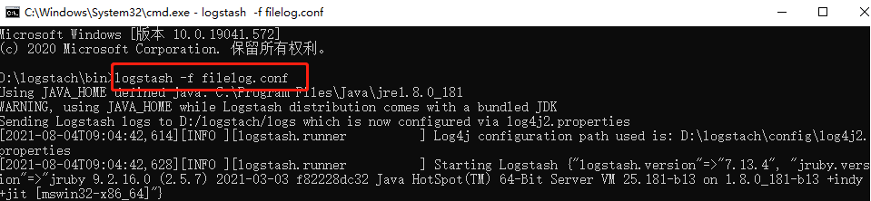

# ElasticSearch

## 算法&数据结构

>1、索引压缩发--->压缩Key
>
>2、索引压缩发--->压缩Value

## LogStach

**启动方式**

启动logstach\bin\logstash.bat

如果有自定义配置文件，则使用如下命令启动：



>`1、日志拉取`
>
>用于不是我们自己开发的服务，直接配置文件路径--logstach收集。
>
>配置文件（filelogs.conf）：
>
>```shell
># Sample Logstash configuration for creating a simple
># Beats -> Logstash -> Elasticsearch pipeline.
>
>input {
>file {
>path => "D:/Courseware/ElasticSearch/Zhaoxi.MicroService.LessonService/log/*.txt"
>start_position => beginning
>}
>file {
>path => "D:/Courseware/ElasticSearch/Zhaoxi.MicroService.ClientDemo/log/*.txt"
>start_position => beginning
>}
>file {
>path => "D:/Courseware/ElasticSearch/Zhaoxi.MicroService.Service/log/*.txt"
>start_position => beginning
>}
>}
>output {
>elasticsearch {
>hosts => ["120.78.170.106:9200"]
>index => "filelog"
>#user => "elastic"
>#password => "changeme"
>}
>}
>```
>
>配置文件（nlog.config）：
>
>```shell
><?xml version="1.0" encoding="utf-8" ?>
><nlog xmlns="http://www.nlog-project.org/schemas/NLog.xsd"
> xmlns:xsi="http://www.w3.org/2001/XMLSchema-instance"
> autoReload="true"
> internalLogLevel="Info"
> internalLogFile="c:/temp/${shortdate}.log">
>
><!-- enable asp.net core layout renderers -->
><extensions>
><add assembly="NLog.Web.AspNetCore"/>
></extensions>
>
><!-- the targets to write to -->
><targets>
><!-- write logs to file  -->
><target xsi:type="File" name="allfile" fileName="D:/Log/Application/${shortdate}log.log"
>       layout="${longdate}|${event-properties:item=EventId_Id}|${uppercase:${level}}|${logger}|${message} ${exception:format=tostring}" />
>
><!-- another file log, only own logs. Uses some ASP.NET core renderers -->
><target xsi:type="File" name="ownFile-web" fileName="D:/Log/Application/${shortdate}log.log"
>       layout="${longdate}|${event-properties:item=EventId_Id}|${uppercase:${level}}|${logger}|${message} ${exception:format=tostring}|url: ${aspnet-request-url}|action: ${aspnet-mvc-action}" />
></targets>
>
><!-- rules to map from logger name to target -->
><rules>
><!--All logs, including from Microsoft-->
><logger name="*" minlevel="Trace" writeTo="allfile" />
>
><!--Skip non-critical Microsoft logs and so log only own logs-->
><logger name="Microsoft.*" minlevel="Info"  writeTo="blackhole" final="true" />
><!-- BlackHole without writeTo -->
></rules>
></nlog>
>
>
><!--Trace - very detailed logs，包含大量的信息，例如 protocol payloads。该级别一般仅在开发环境中启用。
>Debug - debugging information, 比 Trance 级别稍微粗略，一般在生产环境中不启用。
>Info - information messages，一般在生产环境中启用。
>Warn - warning messages，一般用于可恢复或临时性错误的非关键问题。
>Error - error messages，一般是异常信息。
>Fatal - 非常严重的错误！-->
>```
>
>`2、TCP方式`
>
>通过程序推送，尽量少用这种方式，对logstach压力比较大，尤其是高并发的时候，可能就会导致logstach宕机。
>
>配置文件（tcplog.conf）如下：
>
>```shell
>input {
>
>tcp{
>
>port => 8010
>
>type => "TcpLog"
>
>}
>}
>output {
>elasticsearch {
>hosts => ["120.78.170.106:9200"]
>index => "filelogtcp"
>#user => "elastic"
>#password => "changeme"
>}
>}
>```
>
>配置文件（nlog.config）：
>
>```shell
><?xml version="1.0" encoding="utf-8" ?>
><nlog xmlns="http://www.nlog-project.org/schemas/NLog.xsd"
>xmlns:xsi="http://www.w3.org/2001/XMLSchema-instance"
>autoReload="true">
>	<!-- the targets to write to -->
>	<targets>
>		<!--<target xsi:type="Network" name="logError"  address="tcp://127.0.0.1:8001" layout="${longdate} ${uppercase:${level}} ${message}"/>-->
>
>		<target xsi:type="Network" name="logInfo" address="tcp://127.0.0.1:8010" layout="${longdate} ${uppercase:${level}} ${message}"/>
>
>	</targets>
>	<!-- rules to map from logger name to target -->
>	<rules>
>		<!--All logs, including from Microsoft-->
>		<!--<logger name="*" minlevel="Trace" writeTo="allfile" />-->
>		<!--<logger name="*" minlevel="Error" writeTo="logError" />-->
>		<logger name="*" minlevel="Info"  writeTo="logInfo" />
>		<logger name="Microsoft.*" maxLevel="Info" final="true" />
>
>	</rules>
></nlog>
>```
>
>`3、Redis`
>
>Redis只是做了一个缓冲，将日志先保存到redis，logstach根据配置将Redis的日志保存到ES，并删除Redis的数据
>
>配置文件（tcplog.conf）如下：
>
>```shell
>input {
>	redis {
>		codec => plain
>		host => "127.0.0.1"
>		port => 6379
>		data_type => list
>		key => "listlog"
>		db => 0
>	}
>}
>output {
>elasticsearch {
>hosts => ["127.0.0.1:9200"]
>index => "fileloglist"
>#user => "elastic"
>#password => "changeme"
>}
>}
>```
>
>`4、Kafka`
>
>配置文件（kafkalog.conf）如下：
>
>```shell
>input {
>     kafka {
>      topics => "kafkalog"
>      bootstrap_servers => "120.78.170.106:9092"  # 从kafka的leader主机上提取缓存
>      codec => "json"  # 在提取kafka主机的日志时，需要写成json格式
>            }
>}
>output {
>  elasticsearch {
>    hosts => ["127.0.0.1:9200"]
>    index => "filelogkafka"
>    #user => "elastic"
>    #password => "changeme"
>  }
>}
>```
>
>

