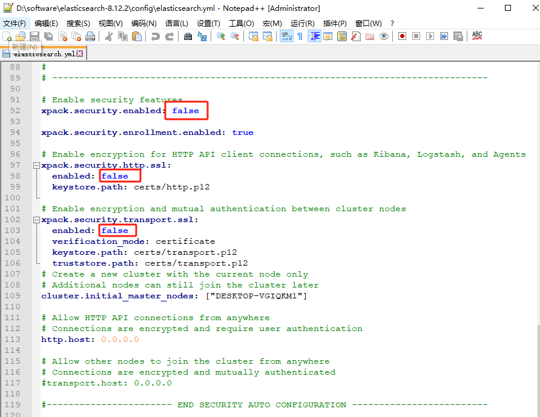

HTTP请求ES报错

错误：当启动Elasticsearch后，在浏览器输入地址 http://localhost:9200/后，报错 received plaintext http traffic on an https channel, closing connection ...

原因：Elasticsearch在Windows下开启了安全认证，虽然started成功，但访问http://localhost:9200/失败

解决方法：找到config/目录下面的elasticsearch.yml配置文件，把安全认证开关从原先的true都改成false，实现免密登录访问即可：

