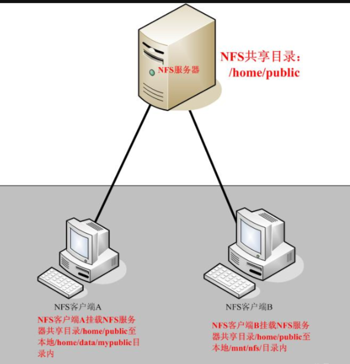
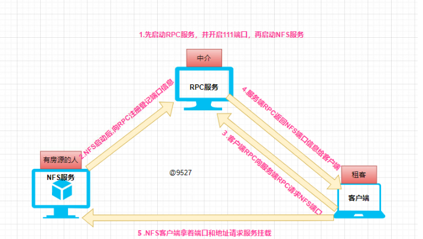

## NFS

## 使用场景

NFS实现了多台服务器之间的数据共享，遵循了数据一致性。

例如A用户上传图片，通过负载均衡将请求发送到了Web01服务器，如果集群中没有NFS，图片就上传到了Web01服务器，B用户想要查看A用户上传的图片，如果负载均衡将请求发送到Web01上，就可以查看到，但是如果发送到其他Web服务器，例如Web02上，就无法查到A用户上传的图片。

但是如果有NFS，则A用户的请求不管发送到哪个服务器，图片都会保存到NFS中，那么B用户访问的时候，请求不管发送到哪个服务器，都可以看到这个图片。

## 概念

NFS，全称Network File System，即网络文件系统。最大的功能是通过网络，让不同的机器、不同的操作系统可以共享彼此的文件。

更直白的说就是：

让PC将网络中的NFS服务器共享的目录挂载到本地的文件系统中，这样在本地端访问挂载点就等于访问共享目录，NFS服务器共享的目录就像是自己的一个磁盘分区一样。



如图，在NFS服务器设置了一个共享目录/home/public，有权访问的客户端A就可以将这个共享目录挂载到自己文件系统的某个点，如/home/data/mypublic，如此，就可以在本地访问远程共享目录。

```shell
# 挂载后，可以看客户端磁盘的具体信息：

df -h /home/data/mypublic

# 这里指定了挂载点是/home/data/mypublic
```


NFS是通过网络来进行服务器端和客户端之间的数据传输，那么两者之间要传输数据就要有相对应的网络端口。NFS服务器的端口开在2049，此外，由于文件系统非常复杂。因此NFS还有其他的程序去启动额外的端口，这些额外的用来传输数据的端口是随机选择的，是小于1024的端口。既然是随机选择，那客户端如何知道NFS服务器使用的是哪个端口呢？

答案是`通过远程过程调用协议，即RPC服务（Remote Procedure Call）`

## 工作原理



RPC( Remote Procedure Call )协议的主要目的是做到：**不同服务间调用方法像同一服务间调用本地方法一样。**

具体步骤：

- 首先服务器端启动RPC服务，并开启111端口
- 服务器端启动NFS服务，并向RPC注册登记端口信息
- 客户端启动RPC，向服务端的RPC服务请求服务端的NFS端口
- 服务端的RPC服务反馈NFS端口信息给客户端
- 客户端通过获取的NFS端口来建立和服务端的NFS连接并进行数据的传输

## 优缺点

**优点：**

- 节省本地存储空间，将一些常用的数据存放在一台服务器通过网络访问
- 对于大多数负载均衡群集来说，使用NFS协议来共享数据存储是比较常见的方法

**缺点：**

- 局限性：容易发生单点故障，即server服务器宕机所有的客户端都不能访问
- 性能瓶颈：网站高并发的情况下，NFS性能有限
- 安全性：客户端的数据都是通过明文传送，客户端没有用户认证机制，安全性一般，建议在局域网内使用
- 数据完整性：NFS服务器传输数据都是采用明文的方式进行传输，对数据没有什么验证机制，对数据完整性较高的业务不建议使用
- 维护繁琐：NFS服务器都是多台客户端挂载在一台server端，对于共享服务器的连接管理维护都是一项比较繁琐的事情

## 部署与配置

### 服务端

服务端IP地址为192.168.1.102

- 查看是否安装nfs-utils和rpcbind程序，如未安装可用yum或者rpm安装

  ```shell
  [root@localhost ~]# rpm -q rpcbind nfs-utils
  rpcbind-0.2.0-49.el7.x86_64
  nfs-utils-1.3.0-0.68.el7.2.x86_64
  ```

- 新建共享目录并修改权限

  ```shell
  [root@localhost ~]# mkdir /opt/share
  [root@localhost ~]# cd /opt
  [root@localhost opt]# ll
  total 0
  drwx--x--x. 4 root root 28 Dec 20 19:01 containerd
  drwxr-xr-x. 2 root root  6 Oct 30  2018 rh
  drwxr-xr-x. 2 root root  6 Apr 15 22:38 share
  [root@localhost opt]# chmod 777 /opt/share/
  [root@localhost opt]# ll
  total 0
  drwx--x--x. 4 root root 28 Dec 20 19:01 containerd
  drwxr-xr-x. 2 root root  6 Oct 30  2018 rh
  drwxrwxrwx. 2 root root  6 Apr 15 22:38 share
  ```

- 编辑NFS的配置文件（新增配置，格式为共享目录的名称  客户机地址（权限选择））

  ```shell
  [root@localhost opt]# vim /etc/exports
  /opt/share *(rw,sync,insecure,no_subtree_check,no_root_squash)
  ```

  NFS参数选项及作用

  | NFS共享参数      | 参数作用                                                     |
  | ---------------- | ------------------------------------------------------------ |
  | rw               | 所有的客户端主机都有读写权限                                 |
  | ro               | 所有的客户端主机都有只读权限                                 |
  | root_squash      | 当NFS客户端以root管理员访问时，映射为NFS服务器的匿名用户(不常用) |
  | no_root_squash   | 当NFS客户端以root管理员访问时，映射为NFS服务器的root管理员(不常用)<br/>防止ROOT用户创建的文件，其他用户访问不了。 |
  | all_squash       | 无论NFS客户端使用什么账户访问，均映射为NFS服务器的匿名用户(常用) |
  | no_all_squash    | 无论NFS客户端使用什么账户访问，都不进行压缩                  |
  | sync             | 同时将数据写入到内存与硬盘中，保证不丢失数据                 |
  | async            | 优先将数据保存到内存，然后再写入硬盘；这样效率更高，但可能会丢失数据 |
  | anonuid          | 配置all_squash使用，指定NFS的用户UID，必须存在系统           |
  | Anongid          | 将客户机上的用户映射成属于指定的本地用户组ID                 |
  | insecure         | NFS通过1024以上的端口发送                                    |
  | secure           | NFS通过1024以下的安全TCP/IP端口发送                          |
  | subtree_check    | 如果共享/usr/bin之类的子目录时，强制NFS检查父目录的权限（默认） |
  | no_subtree_check | 和上面相对，不检查父目录权限                                 |

- 关闭防火墙，启动NFS服务，并查看rpcbind端口是否开启

  ```shell
  [root@localhost opt]# systemctl stop firewalld
  [root@localhost opt]# systemctl status firewalld
  [root@localhost opt]# systemctl start rpcbind
  [root@localhost opt]# systemctl start nfs
  [root@localhost opt]# systemctl enable rpcbind
  [root@localhost opt]# systemctl enable nfs
  Created symlink from /etc/systemd/system/multi-user.target.wants/nfs-server.service to /usr/lib/systemd/system/nfs-server.service.
  [root@localhost opt]# netstat -natp | grep 111
  tcp        0      0 0.0.0.0:111             0.0.0.0:*               LISTEN      573/rpcbind
  tcp6       0      0 :::111                  :::*                    LISTEN      573/rpcbind
  ```

- 发布NFS共享目录并查看

  ```shell
  [root@localhost opt]# exportfs -rv
  exporting *:/opt/share
  [root@localhost opt]# showmount -e
  Export list for localhost.localdomain:
  /opt/share *
  ```

  exportfs -rv：发布NFS共享

  shownount -e：查看发布状态

### 客户端

客户端IP地址为192.168.1.103

- 查看是否安装nfs-utils和rpcbind程序，如未安装可用yum或者rpm安装

  ```shell
  [root@localhost ~]# rpm -q rpcbind nfs-utils
  rpcbind-0.2.0-49.el7.x86_64
  nfs-utils-1.3.0-0.68.el7.2.x86_64
  ```

- 查看服务器端共享的目录，然后进行挂载

  ```shell
  [root@localhost ~]# showmount -e 192.168.1.102
  Export list for 192.168.1.102:
  /opt/share *
  [root@localhost ~]# mkdir /data
  [root@localhost ~]# mount 192.168.1.102:/opt/share /data
  [root@localhost ~]# df -HT
  Filesystem               Type      Size  Used Avail Use% Mounted on
  devtmpfs                 devtmpfs  494M     0  494M   0% /dev
  tmpfs                    tmpfs     510M     0  510M   0% /dev/shm
  tmpfs                    tmpfs     510M  9.0M  501M   2% /run
  tmpfs                    tmpfs     510M     0  510M   0% /sys/fs/cgroup
  /dev/sda3                xfs        20G  6.0G   14G  32% /
  /dev/sda1                xfs       312M  200M  112M  65% /boot
  tmpfs                    tmpfs     102M   25k  102M   1% /run/user/1000
  tmpfs                    tmpfs     102M     0  102M   0% /run/user/0
  192.168.1.102:/opt/share nfs4       20G   19G  499M  98% /data
  ```

  df HT：192.168.1.102:/opt/share表示挂在成功	

  问题：mount挂载是临时的，重启客户端，挂载会失效

  解决：可通过配置fstab（定义文件系统挂在信息表），使系统重启时自动挂载NFS远程的文件系统

  ```shell
  [root@localhost ~]# vim /etc/fstab
  192.168.1.102:/opt/share /data  nfs timeo=14,hard,bg,intr 0 0
  ```

  在 `/etc/fstab` 文件中，您可以使用以下格式来写入 NFS 挂载：

  ```shell
  <服务器地址>:<远程共享目录>  <本地挂载目录>  nfs  <挂载选项>  0  0
  ```

  以下是每个字段的解释：

  - <服务器地址>：NFS 服务器的 IP 地址或主机名。
  - <远程共享目录>：NFS 服务器上要共享的目录路径。
  - <本地挂载目录>：您要将远程共享目录挂载到的本地目录路径。
  - nfs：指定文件系统类型为 NFS。
  - <挂载选项>：您可以指定一些挂载选项，例如 `rw` (读写访问权限)、`noauto` (不自动挂载)、`noatime` (不更新访问时间) 等。您可以根据需要添加适当的选项。
  - 0：指定备份选项。对于 NFS 挂载，这通常设置为 0。
  - 0：指定文件系统检查顺序。对于 NFS 挂载，这通常设置为 0。

  挂载选项：

  - timeo:挂载超时。当数据传输出现问题，会根据此参数重新传输
  - hard：客户端会不断的与NFS服务器进行连接，直到挂载成功
  - bg：如果无法顺利挂载，那麽系统会把挂载操作转移到后台
  - intr：允许中断挂载操作
  - 0 0：不进行备份和检查

### 测试

在客户端创建文件，在服务端查看

```shell
客户端
[root@localhost ~]# echo "Hello NFS" > /data/hello.txt

服务端
[root@localhost share]# cat /opt/share/hello.txt
Hello NFS
```

## 参考资料

[NFS详解——局域网中的共享存储技术 - 笑洋仟 - 博客园 (cnblogs.com)](https://www.cnblogs.com/weq0805/p/14965685.html)

[【运维知识进阶篇】集群架构-NFS网络文件系统_nfs取消挂载-CSDN博客](https://blog.csdn.net/qq_37510195/article/details/130001332)


- 