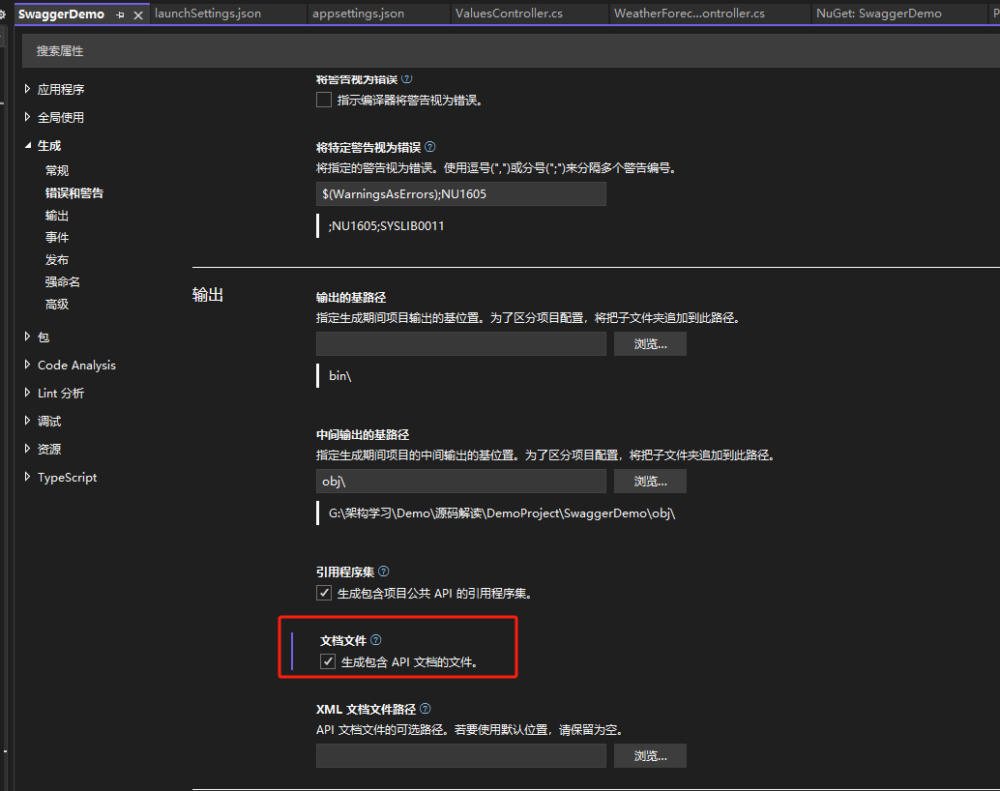
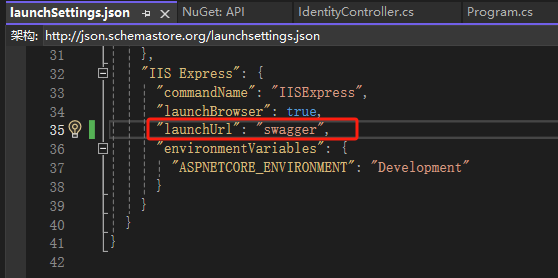

# ASP.NET Core Swagger使用

## 添加Swagger

Nuget安装`Swashbuckle.AspNetCore`包，添加`Swagger`

基本使用

```C#
     //需要引入Swashbuckle.AspNetCore
     builder.Services.AddSwaggerGen();
```

```C#
      //追加Swagger中间件
      app.UseSwagger();
      app.UseSwaggerUI();
```

**注意：**

- 必须为每个方法添加[HTTPGET]/[HTTPPUT]/[HTTPPOST]/...属性

## 隐藏API

`Swagger`中不显示某一个API，在**方法/类**添加以下属性。但是实际上Api还是可以调用

```C#
[ApiExplorerSettings(IgnoreApi = true)]
```

## 显示注释

如果需要显示注释，则必须生成包含API文档的文件

```C#
 #region 接口注释
 //文档UI界面添加接口注释
 var xmlFile = $"{Assembly.GetExecutingAssembly().GetName().Name}.xml";
 var xmlPath = Path.Combine(AppContext.BaseDirectory, xmlFile);
 options.IncludeXmlComments(xmlPath, true);
 #endregion
```

在控制台方法中添加`/// <summary>`注释，`Swagger`就会显示注释。

## 添加JWT配置

```C#
#region Swagger配置支持Token参数传递 
options.AddSecurityDefinition("Bearer", new OpenApiSecurityScheme
{
    Description = "请输入token,格式为 Bearer jwtToken(注意中间必须有空格)",
    Name = "Authorization",
    In = ParameterLocation.Header,
    Type = SecuritySchemeType.ApiKey,
    BearerFormat = "JWT",
    Scheme = JwtBearerDefaults.AuthenticationScheme
});//添加安全定义

options.AddSecurityRequirement(new OpenApiSecurityRequirement {
    {   //添加安全要求
        new OpenApiSecurityScheme
        {
            Reference =new OpenApiReference()
            {
                Type = ReferenceType.SecurityScheme,
                Id ="Bearer"
            }
        },
        new string[]{ }
    }
});
#endregion
```

## 多版本

ApiVersionInfo版本类

```C#
    /// <summary>
    /// 该类型定义了 WebAPI 版本的信息。
    /// </summary>
    public static class ApiVersionInfo
    {
        /// <summary>
        /// 初始化默认值。
        /// </summary>
        static ApiVersionInfo()
        {
            V1 = string.Empty;
            V2 = string.Empty;
            V3 = string.Empty;
            V4 = string.Empty;
        }
        /// <summary>
        /// 获取或者设置 V1 版本。
        /// </summary>
        public static string V1;
        /// <summary>
        /// 获取或者设置 V2 版本。
        /// </summary>
        public static string V2;
        /// <summary>
        /// 获取或者设置 V3 版本。
        /// </summary>
        public static string V3;
        /// <summary>
        /// 获取或者设置 V4 版本。
        /// </summary>
        public static string V4;
    }
```

Program.cs

```C#
 #region 多版本
//需要引入Swashbuckle.AspNetCore
builder.Services.AddSwaggerGen(options =>
{

    #region 多版本
    foreach (FieldInfo field in typeof(ApiVersionInfo).GetFields())
    {
        options.SwaggerDoc(field.Name, new Microsoft.OpenApi.Models.OpenApiInfo()
        {
            Title = $"API-{field.Name}",
            Version = field.Name,
            Description = $"当前的 ASP.Net Core Web API {field.Name} 版本"
        });
    }
    #endregion

});
 #endregion

//追加Swagger中间件
app.UseSwagger();
app.UseSwaggerUI(c =>
{
    foreach (FieldInfo field in typeof(ApiVersionInfo).GetFields())
    {
        c.SwaggerEndpoint($"/swagger/{field.Name}/swagger.json", $"{field.Name}");
    }
    //设置为None可折叠所有方法
    c.DocExpansion(Swashbuckle.AspNetCore.SwaggerUI.DocExpansion.None);
    //-1 可不显示Models
    c.DefaultModelsExpandDepth(-1);
});  
```

然后在Action/Controller使用 [ApiExplorerSettings(GroupName = nameof(ApiVersionInfo.V1))]属性设置接口版本

## 设置WebAPI启动页为Swagger

## 

具体代码可参考`XXX\Demo\源码解读\DemoProject`