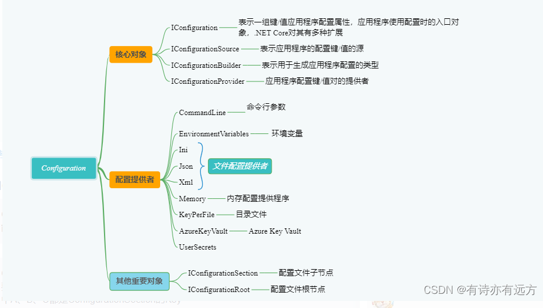
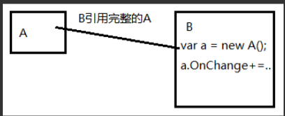

### HostingStartup扩展

#### 项目内扩展

- 创建CustomHostingStartupIn类，继承IHostingStartup
- 添加[assembly: HostingStartup(typeof(CustomHostingStartupIn))]

说明：

- 项目启动时额外处理逻辑---由于该接口类Configure方法包含IWebHostBuilder类，所以可以像主程序一样，追加任何处理逻辑（比如文件配置、IOC、中间级），可实现`无侵入式扩展`
- 在项目构建初期时，不建议使用此方式。后期进行项目维护扩展，为减少程序修改可使用该方式（例如：请求技术统计；SkyAPM链路追踪），方便随时可以追加/剔除该功能。
- 如需提出IHostingStartup扩展功能，秩序注释[assembly: HostingStartup(typeof(CustomHostingStartupIn))]即可

#### 项目外扩展

- 在项目外新建类库程序，追加CustomHostingStartupOut类，继承IHostingStartup

- 添加[assembly: HostingStartup(typeof(CustomHostingStartupOut))]

- 向launchSettings.json配置文件追加以下配置：

  "ASPNETCORE_HOSTINGSTARTUPASSEMBLIES": "Microsoft.AspNetCore.Mvc.Razor.RuntimeCompilation;WebCoreExtend"

说明：虽然可以放在项目外，但一般不建议使用，会破坏原程序处理流程，默认不允许。

### Options模式

#### 注册方式

- ① Configure默认名称

  ```C#
  builder.Services.Configure<EmailOptions>(op =>
  {
      op.Title = "Title--DefaultName";
      op.From = "From---DefaultName";
  });
  ```

- ② Configure指定名称

  ```C#
  //当配置名为null时，会更新所有存在EmailOptions配置
  builder.Services.Configure<EmailOptions>("FromMemory", op =>
  {
  	op.Title = "Title---FromMemory";
  	op.From = "From---FromMemory";
  });
  ```

- ③ Configure从配置文件读取

  ```C#
   builder.Services.Configure<EmailOptions>("FromConfiguration", builder.Configuration.GetSection("Email"));
  ```

- ④ AddOptions

  ```C#
  //等价于②
  builder.Services.AddOptions<EmailOptions>("AddOption").Configure(op => 
  {
  	op.Title = "Title---AddOption";
  	op.From = "From---AddOption";
  });
  ```

- ⑤ ConfigureAll

  ```C#
  //会更新所有EmailOptions配置
  builder.Services.ConfigureAll<EmailOptions>(op => op.From = "ConfigureAll");
  ```

- ⑥ PostConfiger

  ```C#
  //等价于⑤，PostConfiger可在Configer基础上继续配置
  builder.Services.PostConfigure<EmailOptions>(null, op =>
  {
  	op.Title = "Title---PostConfigure--null";
  	op.From = "From---PostConfigure--null";
  });
  //builder.Services.PostConfigureAll<EmailOptions>(op => op.Body = "services.PostConfigure<EmailOption>--Name null--Same With PostConfigureAll");
  ```

#### 获取方式

通过构造函数依赖注入即使用

- IOptions

  - 只能获取默认名称配置
  - IOptions生命周期为Singleton

  ```C#
  this._optionsDefault.Value
  ```

- IOptionsMonitor

  - 可根据配置名称读取配置项，未指定名称读取第一个注入的配置
  - IOptionsMonitor生命周期为Singleton
  - IOptionsMonitor可监听到配置文件变动去动态更新配置项

  ```C#
  //默认名称
  this._optionsMonitor.CurrentValue;
  //指定名称
  this._optionsMonitor.Get("FromMemory")
  ```

- IOptionsSnapshot

  - 可根据配置名称读取配置项，未指定名称读取第一个注入的配置
  - IOptionsSnapshot生命周期为Scope（一次请求内数据是缓存不变的，但是不同请求每次都会重新初始化配置）

  ```C#
  //默认名称
  this._optionsSnapshot.Value
  //指定名称
  this._optionsSnapshot.Get("FromMemory")
  ```

#### 使用建议

-  简单粗暴不更新，就IOptions----其实用的最多
- 需要更新IOptionsMonitor-------实时支持更新
- IOptionsSnapshot(除非单次请求内要求保证不变，新的请求用新的数据)--请求处理过程中，可以去Configure配置，新的请求就能用上最新的

### 日志Logger


### 标准组件封装

以自定义Logger组件为例

- CustomConsoleLoggerOptions

  ```C#
      public class CustomConsoleLoggerOptions
      {
          public LogLevel MinLogLevel { get; set; } = LogLevel.Information;
  
          public ConsoleColor ConsoleColor { get; set; } = ConsoleColor.Black;
  
          public int EventId { get; set; } = 0;
  
          public void Init(string message)
          {
  
          }
      }
  ```

- CustomConsoleLogger

  ```C#
      public class CustomConsoleLogger : ILogger
      {
          private readonly CustomConsoleLoggerOptions _CustomConsoleLoggerOptions;
          public CustomConsoleLogger(CustomConsoleLoggerOptions options)
          {
              this._CustomConsoleLoggerOptions = options;
          }
  
          public IDisposable BeginScope<TState>(TState state)
          {
              return null;//没有啥需要释放
          }
  
          public bool IsEnabled(LogLevel logLevel)
          {
              return logLevel >= this._CustomConsoleLoggerOptions.MinLogLevel;
              //让上端注册的地方，最终可以影响到组件的行为
          }
  
          public void Log<TState>(LogLevel logLevel, EventId eventId, TState state, Exception exception, Func<TState, Exception, string> formatter)
          {
              if (!this.IsEnabled(logLevel))
                  return;
  
              //日志输出到控制台
              Console.BackgroundColor = this._CustomConsoleLoggerOptions.ConsoleColor;
  
              Console.WriteLine($"Eleven Custom Log: {logLevel} - {eventId.Id} - {formatter(state, exception)}");
  
          }
      }
  ```

- CustomConsoleLoggerProvider

  ```C#
   	public class CustomConsoleLoggerProvider : ILoggerProvider
      {
          private CustomConsoleLoggerOptions _CustomConsoleLoggerOptions = null;
          public CustomConsoleLoggerProvider(CustomConsoleLoggerOptions options)
          {
              this._CustomConsoleLoggerOptions = options;
          }
  
  
          public ILogger CreateLogger(string categoryName)
          {
              this._CustomConsoleLoggerOptions.Init("12345");
  
              return new CustomConsoleLogger(this._CustomConsoleLoggerOptions);
          }
  
          public void Dispose()
          {
  
          }
      }
  ```

  

- CustomConsoleLoggerExtensions

  ```C#
  
      public static class CustomConsoleLoggerExtensions
      {
          public static ILoggingBuilder AddCustomLogger(this ILoggingBuilder builder)
          {
              //还可能有其他的IOC注册
  
              CustomConsoleLoggerOptions options = new CustomConsoleLoggerOptions()
              {
                  MinLogLevel = LogLevel.Warning,
                  ConsoleColor = ConsoleColor.Green,
              };
              return builder.AddCustomLogger(options);
          }
  
          public static ILoggingBuilder AddCustomLogger(this ILoggingBuilder builder, CustomConsoleLoggerOptions options)
          {
              builder.AddProvider(new CustomConsoleLoggerProvider(options));
              return builder;
          }
  
          public static ILoggingBuilder AddCustomLogger(this ILoggingBuilder builder, Action<CustomConsoleLoggerOptions> configure)
          {
              CustomConsoleLoggerOptions options = new CustomConsoleLoggerOptions()
              {
                  MinLogLevel = LogLevel.Warning,
                  ConsoleColor = ConsoleColor.Green,
              };
              configure.Invoke(options);
  
              return builder.AddCustomLogger(options);
          }
      }
  ```

- Program调用

  ```C#
              builder.Logging.AddCustomLogger(options =>
              {
                  options.MinLogLevel = LogLevel.Debug;
                  options.ConsoleColor = ConsoleColor.Yellow;
  
              });
  ```


### Configuration



#### 源码探究

- 提供一个实现了 IConfigurationProvider 接口的配置提供类，它需要提供配置的读取以及更新等操作
- 提供一个 IConfigurationSource 接口实现类，它负责创建 IConfigurationProvider 。
- 创建一个 IConfigurationBuilder 配置建造者对象，然后将 IConfigurationSource 添加进配置构造者中，这里我们一般都采用 IConfigurationBuilder 的拓展方法来实现。
- 使用 IConfigurationBuilder 构造一个 IConfigurationRoot ，然后使用这个 IConfigurationRoot 去操作配置。

#### 配置方式

- Josn文件

  ```C#
  //json文件
  {
    "TodayJson": "JSON配置文件",
    "JsonOptions": {
      "HostName": "192.168.200.101",
      "UserName": "customjson",
      "Password": "json8888",
      "ArrayTest": [
        "customjson",
        "customxml",
        "customini"
      ]
    }
  }
  
  
  //配置
  builder.Configuration.AddJsonFile("customjson.json", true, true);
  
  //获取
  string TodayJson = this._iConfiguration["TodayJson"];
  string HostName = this._iConfiguration["JsonOptions:HostName"];
  string UserName = this._iConfiguration.GetValue<string>("JsonOptions:UserName");
  string array = this._iConfiguration["JsonOptions:ArrayTest:0"];
  Console.WriteLine($"TodayJson={TodayJson}");
  Console.WriteLine($"HostName={HostName}");
  Console.WriteLine($"UserName={UserName}");
  Console.WriteLine($"Array[0]={array}");
  
  JsonOptions testOption = new JsonOptions();
  this._iConfiguration.GetSection("JsonOptions").Bind(testOption);
  Console.WriteLine($"HostName={testOption.HostName}");
  Console.WriteLine($"Array[1]={testOption.ArrayTest[1]}");
  
  JsonOptions testOption2 = this._iConfiguration.GetSection("JsonOptions").Get<JsonOptions>();
  Console.WriteLine($"HostName2={testOption2.HostName}");
  Console.WriteLine($"Array[2]={testOption.ArrayTest[2]}");
  ```

  

- xml文件

  ```C#
  //xml文件
  <?xml version="1.0" encoding="utf-8" ?>
  <configuration>
  	<TodayXML>XML配置文件</TodayXML>
  	<XMLOptions>
  		<HostName>192.168.200.102</HostName>
  		<UserName>customxml</UserName>
  		<Password>xml8888</Password>
  	</XMLOptions>
  </configuration>
  
  //配置
  builder.Configuration.AddXmlFile("customxml.xml", true, true);
  
  //获取
  string TodayXML = this._iConfiguration["TodayXML"];
  string HostName = this._iConfiguration["XMLOptions:HostName"];
  string UserName = this._iConfiguration.GetValue<string>("XMLOptions:UserName");
  Console.WriteLine($"TodayXML={TodayXML}");
  Console.WriteLine($"HostName={HostName}");
  Console.WriteLine($"UserName={UserName}");
  
  TestOptions testOption = new TestOptions();
  this._iConfiguration.GetSection("XMLOptions").Bind(testOption);
  Console.WriteLine($"HostName={testOption.HostName}");
  
  TestOptions testOption2 = this._iConfiguration.GetSection("XMLOptions").Get<TestOptions>();
  Console.WriteLine($"HostName2={testOption2.HostName}");
  ```

  

- ini文件

  ```C#
  //ini文件
  [TodayINI]
  IniName=INI配置文件
  [INIOptions]
  HostName=192.168.200.103
  UserName=customini
  Password=ini8888
      
  //配置
  builder.Configuration.AddIniFile("customini.ini", true, true);
  
  //获取
  string TodayXML = this._iConfiguration["TodayINI:IniName"];
  string HostName = this._iConfiguration["INIOptions:HostName"];
  string UserName = this._iConfiguration.GetValue<string>("INIOptions:UserName");
  Console.WriteLine($"TodayINI={TodayXML}");
  Console.WriteLine($"HostName={HostName}");
  Console.WriteLine($"UserName={UserName}");
  
  TestOptions testOption = new TestOptions();
  this._iConfiguration.GetSection("INIOptions").Bind(testOption);
  Console.WriteLine($"HostName={testOption.HostName}");
  
  TestOptions testOption2 = this._iConfiguration.GetSection("INIOptions").Get<TestOptions>();
  Console.WriteLine($"HostName2={testOption2.HostName}");
  ```

  

- Memory

  ```C#
  //配置
  var memoryConfig = new Dictionary<string, string>
   {
   	{"TodayMemory", "0114-Memory"},
   	{"MemoryOptions:HostName", "192.168.3.254-Memory"},
   	{"MemoryOptions:UserName", "guest-Memory"},
   	{"MemoryOptions:Password", "guest-Memory"}
   };
   builder.Configuration.AddInMemoryCollection(memoryConfig);
  
  //获取
  string HostName = this._iConfiguration["MemoryOptions:HostName"];
  string UserName = this._iConfiguration.GetValue<string>("MemoryOptions:UserName");
  string TodayMemory = this._iConfiguration["TodayMemory"];
  Console.WriteLine($"HostName={HostName}");
  Console.WriteLine($"TodayMemory={TodayMemory}");
  Console.WriteLine($"UserName={UserName}");
  
  TestOptions testOption = new TestOptions();
  this._iConfiguration.GetSection("MemoryOptions").Bind(testOption);
  Console.WriteLine($"HostName={testOption.HostName}");
  
  TestOptions testOption2 = this._iConfiguration.GetSection("MemoryOptions").Get<TestOptions>();
  Console.WriteLine($"HostName2={testOption2.HostName}");
  ```

#### 自定义扩展

- CustomConfigurationProvider--------------------提供数据增删改查的

  ```C#
      public class CustomConfigurationProvider : ConfigurationProvider
      {
          private CustomConfigurationOptions _CustomConfigurationOption = null;
          public CustomConfigurationProvider(CustomConfigurationOptions customConfigurationOption)
          {
              this._CustomConfigurationOption = customConfigurationOption;
          }
  
          /// <summary>
          /// 数据加载方法
          /// </summary>
          public override void Load()
          {
              Console.WriteLine($"CustomConfigurationProvider load data");
              //当然也可以从数据库读取
              //var result = this._CustomConfigurationOption.DataInitFunc.Invoke();
              //this._CustomConfigurationOption.DataChangeAction()
              
              base.Data.Add("TodayCustom", "0117-Custom");
              base.Data.Add("CustomOptions:HostName", "192.168.3.254-Custom");
              base.Data.Add("CustomOptions:UserName", "guest-Custom");
              base.Data.Add("CustomOptions:Password", "guest-Custom");
          }
  
          public override bool TryGet(string key, out string? value)
          {
              return base.TryGet(key, out value);
          }
  
          public override void Set(string key, string? value)
          {
              base.Set(key, value);
          }
      }
  ```

  

- CustomConfigurationSource--------------------生成CustomConfigurationProvider的

  ```C#
      public class CustomConfigurationSource : IConfigurationSource
      {
          private readonly Action<CustomConfigurationOptions> _optionsAction;
          public CustomConfigurationSource(Action<CustomConfigurationOptions> optionsAction)
          {
              _optionsAction = optionsAction;
          }
  
  
          public IConfigurationProvider Build(IConfigurationBuilder builder)
          {
              CustomConfigurationOptions customConfigurationOptions = new CustomConfigurationOptions();
              this._optionsAction.Invoke(customConfigurationOptions);
  
              return new CustomConfigurationProvider(customConfigurationOptions);
          }
      }
  ```

- CustomConfigurationExtensions--------------------方便注册

  ```C#
      public static class CustomConfigurationExtensions
      {
          public static void AddCustomConfiguration(
            this IConfigurationBuilder builder, Action<CustomConfigurationOptions> optionsAction)
          {
              builder.Add(new CustomConfigurationSource(optionsAction));
          }
  
          public static void AddCustomConfiguration(
           this IConfigurationBuilder builder)
          {
              builder.AddCustomConfiguration(options => { });
          }
      }
  ```

- CustomConfigurationOptions--------------------额外增加的方便配置

  ```C#
      public class CustomConfigurationOptions
      {
          public string LogTag { get; set; }
  
          /// <summary>
          /// 数据获取方式
          /// </summary>
          public Func<IDictionary<string, string>> DataInitFunc { get; set; }
  
          /// <summary>
          /// 数据更新方式
          /// </summary>
          public Action<string, string> DataChangeAction { get; set; }
      }
  ```

  

### IChangeToken 接口

#### 场景

一个对象A，希望它的某些状态在发生改变时通知到B（或C、D），常见的做法是在A中定义一个事件（或直接用委托），当状态改变时A去触发这个事件。而B直接订阅这个事件



这种设计有点问题，B由于要订阅A的事件，所以B得完全引用A，其实有时候没必要，因为我只关心A的状态变化而已，状态变更通知这种场景很多，有没有更通用的方式呢？

#### 解决思路

尝试加个中间层解决问题


A和B都引用ChangeToken，B向ChangeToken注册一个委托说：将来你有变化时回调我这个委托
当A的状态变化时会调用ChangeToken的一个方法，这个方法内部就会去触发执行B之前塞进去的委托
此时比如有组件C、D、E..都关心A的状态变化，也可以引用ChangeToken，并向其注册自己的委托
这样ChangeToken可以作为一个通用组件，在很多需要更改通知是场景中使用，如：asp.net core的配置系统、终结点路由、 ....

#### IChangeToke

IChangeToken 传播已发生更改的通知。 `IChangeToken` 驻留在 Microsoft.Extensions.Primitives 命名空间中。

常用方法：`IChangeToken` 接口具有 RegisterChangeCallback(Action<Object>, Object) 方法，用于注册在令牌更改时调用的回调。

```json
{
  "Email": {
    "Title": "FromConfiguration--Cofigure888",
    "Body": "Configu",
    "From": "Configure"
  }
}

```

```C#
PhysicalFileProvider phyFileProvider = new PhysicalFileProvider(AppContext.BaseDirectory);
var changeToken = phyFileProvider.Watch("changetoken.json");//监听，返回的就是IChangeToken
changeToken.RegisterChangeCallback(state =>
{
	Console.WriteLine("文件被更新！！！");
}, new object());

```

当我们修改Json文件时，回调函数将会被调用。

但此回调仅仅会被执行一次，如果继续改变Json文件配置的值，回调函数也不会在触发了。所以我们如果想做到长时间的监控可以用ChangeToken类中的OnChange拓展方法。

#### ChangeToken静态类

ChangeToken 是静态类，用于传播已发生更改的通知。 `ChangeToken` 驻留在 Microsoft.Extensions.Primitives 命名空间中。

ChangeToken.OnChange(Func<IChangeToken>, Action) 方法注册令牌更改时要调用的 `Action`：

- `Func<IChangeToken>` 生成令牌。
- 令牌更改时，调用 `Action`。

ChangeToken.OnChange<TState>(Func<IChangeToken>, Action<TState>, TState) 重载还具有一个 `TState` 参数，该参数传递给令牌使用者 `Action`。

`OnChange` 返回 IDisposable。 调用 Dispose 将使令牌停止侦听更多更改并释放令牌的资源。

这里注意第一个入参是一个泛型委托

```C#
PhysicalFileProvider phyFileProvider = new PhysicalFileProvider(AppContext.BaseDirectory);
ChangeToken.OnChange(() => phyFileProvider.Watch("changetoken.json"), () =>
{
	Console.WriteLine("文件被更新！！！");
});
 Console.ReadKey();
```

`测试问题：当文件被修改后，会调用两次回调幻术，原因不明`


拓展资料：

[【5min+】 一个令牌走天下！.Net Core中的ChangeToken - 句幽 - 博客园 (cnblogs.com)](https://www.cnblogs.com/uoyo/p/12509871.html)

### 中间件

#### 定义

**应用程序管道中用来处理请求和响应的组件。**

中间件是一个请求委托(public [delegate](https://so.csdn.net/so/search?q=delegate&spm=1001.2101.3001.7020) Task RequestDelegate(HttpContext context))的实例,所以中间件的本质是一个方法，参数是HttpContext,返回参数是一个task,每个中间件根据不同的方法，可以决定是否将请求传递给管道中的下个组件，也可以在执行管道中下个请求的前后都处理业务逻辑。


### IStartFilter