### HostingStartup扩展

#### 项目内扩展

- 创建CustomHostingStartupIn类，继承IHostingStartup
- 添加[assembly: HostingStartup(typeof(CustomHostingStartupIn))]

说明：

- 项目启动时额外处理逻辑---由于该接口类Configure方法包含IWebHostBuilder类，所以可以像主程序一样，追加任何处理逻辑（比如文件配置、IOC、中间级），可实现`无侵入式扩展`
- 在项目构建初期时，不建议使用此方式。后期进行项目维护扩展，为减少程序修改可使用该方式（例如：请求技术统计；SkyAPM链路追踪），方便随时可以追加/剔除该功能。
- 如需提出IHostingStartup扩展功能，秩序注释[assembly: HostingStartup(typeof(CustomHostingStartupIn))]即可

#### 项目外扩展

- 在项目外新建类库程序，追加CustomHostingStartupOut类，继承IHostingStartup

- 添加[assembly: HostingStartup(typeof(CustomHostingStartupOut))]

- 向launchSettings.json配置文件追加以下配置：

  "ASPNETCORE_HOSTINGSTARTUPASSEMBLIES": "Microsoft.AspNetCore.Mvc.Razor.RuntimeCompilation;WebCoreExtend"

说明：虽然可以放在项目外，但一般不建议使用，会破坏原程序处理流程，默认不允许。

**拓展资料：**

[ASP.NET Core使用HostingStartup增强启动操作 - yi念之间 - 博客园 (cnblogs.com)](https://www.cnblogs.com/wucy/p/14013622.html)

### Options模式

#### 注册方式

- ① Configure默认名称

  ```C#
  builder.Services.Configure<EmailOptions>(op =>
  {
      op.Title = "Title--DefaultName";
      op.From = "From---DefaultName";
  });
  ```

- ② Configure指定名称

  ```C#
  //当配置名为null时，会更新所有存在EmailOptions配置
  builder.Services.Configure<EmailOptions>("FromMemory", op =>
  {
  	op.Title = "Title---FromMemory";
  	op.From = "From---FromMemory";
  });
  ```

- ③ Configure从配置文件读取

  ```C#
   builder.Services.Configure<EmailOptions>("FromConfiguration", builder.Configuration.GetSection("Email"));
  ```

- ④ AddOptions

  ```C#
  //等价于②
  builder.Services.AddOptions<EmailOptions>("AddOption").Configure(op => 
  {
  	op.Title = "Title---AddOption";
  	op.From = "From---AddOption";
  });
  ```

- ⑤ ConfigureAll

  ```C#
  //会更新所有EmailOptions配置
  builder.Services.ConfigureAll<EmailOptions>(op => op.From = "ConfigureAll");
  ```

- ⑥ PostConfiger

  ```C#
  //等价于⑤，PostConfiger可在Configer基础上继续配置
  builder.Services.PostConfigure<EmailOptions>(null, op =>
  {
  	op.Title = "Title---PostConfigure--null";
  	op.From = "From---PostConfigure--null";
  });
  //builder.Services.PostConfigureAll<EmailOptions>(op => op.Body = "services.PostConfigure<EmailOption>--Name null--Same With PostConfigureAll");
  ```

#### 获取方式

通过构造函数依赖注入即使用

- IOptions

  - 只能获取默认名称配置
  - IOptions生命周期为Singleton

  ```C#
  this._optionsDefault.Value
  ```

- IOptionsMonitor

  - 可根据配置名称读取配置项，未指定名称读取第一个注入的配置
  - IOptionsMonitor生命周期为Singleton
  - IOptionsMonitor可监听到配置文件变动去动态更新配置项

  ```C#
  //默认名称
  this._optionsMonitor.CurrentValue;
  //指定名称
  this._optionsMonitor.Get("FromMemory")
  ```

- IOptionsSnapshot

  - 可根据配置名称读取配置项，未指定名称读取第一个注入的配置
  - IOptionsSnapshot生命周期为Scope（一次请求内数据是缓存不变的，但是不同请求每次都会重新初始化配置）

  ```C#
  //默认名称
  this._optionsSnapshot.Value
  //指定名称
  this._optionsSnapshot.Get("FromMemory")
  ```

#### 使用建议

-  简单粗暴不更新，就IOptions----其实用的最多
- 需要更新IOptionsMonitor-------实时支持更新
- IOptionsSnapshot(除非单次请求内要求保证不变，新的请求用新的数据)--请求处理过程中，可以去Configure配置，新的请求就能用上最新的

### 日志Logger

#### 标准组件封装

以自定义Logger组件为例

- CustomConsoleLoggerOptions

  ```C#
      public class CustomConsoleLoggerOptions
      {
          public LogLevel MinLogLevel { get; set; } = LogLevel.Information;
  
          public ConsoleColor ConsoleColor { get; set; } = ConsoleColor.Black;
  
          public int EventId { get; set; } = 0;
  
          public void Init(string message)
          {
  
          }
      }
  ```

- CustomConsoleLogger

  ```C#
      public class CustomConsoleLogger : ILogger
      {
          private readonly CustomConsoleLoggerOptions _CustomConsoleLoggerOptions;
          public CustomConsoleLogger(CustomConsoleLoggerOptions options)
          {
              this._CustomConsoleLoggerOptions = options;
          }
  
          public IDisposable BeginScope<TState>(TState state)
          {
              return null;//没有啥需要释放
          }
  
          public bool IsEnabled(LogLevel logLevel)
          {
              return logLevel >= this._CustomConsoleLoggerOptions.MinLogLevel;
              //让上端注册的地方，最终可以影响到组件的行为
          }
  
          public void Log<TState>(LogLevel logLevel, EventId eventId, TState state, Exception exception, Func<TState, Exception, string> formatter)
          {
              if (!this.IsEnabled(logLevel))
                  return;
  
              //日志输出到控制台
              Console.BackgroundColor = this._CustomConsoleLoggerOptions.ConsoleColor;
  
              Console.WriteLine($"Eleven Custom Log: {logLevel} - {eventId.Id} - {formatter(state, exception)}");
  
          }
      }
  ```

- CustomConsoleLoggerProvider

  ```C#
   	public class CustomConsoleLoggerProvider : ILoggerProvider
      {
          private CustomConsoleLoggerOptions _CustomConsoleLoggerOptions = null;
          public CustomConsoleLoggerProvider(CustomConsoleLoggerOptions options)
          {
              this._CustomConsoleLoggerOptions = options;
          }
  
  
          public ILogger CreateLogger(string categoryName)
          {
              this._CustomConsoleLoggerOptions.Init("12345");
  
              return new CustomConsoleLogger(this._CustomConsoleLoggerOptions);
          }
  
          public void Dispose()
          {
  
          }
      }
  ```

  

- CustomConsoleLoggerExtensions

  ```C#
  
      public static class CustomConsoleLoggerExtensions
      {
          public static ILoggingBuilder AddCustomLogger(this ILoggingBuilder builder)
          {
              //还可能有其他的IOC注册
  
              CustomConsoleLoggerOptions options = new CustomConsoleLoggerOptions()
              {
                  MinLogLevel = LogLevel.Warning,
                  ConsoleColor = ConsoleColor.Green,
              };
              return builder.AddCustomLogger(options);
          }
  
          public static ILoggingBuilder AddCustomLogger(this ILoggingBuilder builder, CustomConsoleLoggerOptions options)
          {
              builder.AddProvider(new CustomConsoleLoggerProvider(options));
              return builder;
          }
  
          public static ILoggingBuilder AddCustomLogger(this ILoggingBuilder builder, Action<CustomConsoleLoggerOptions> configure)
          {
              CustomConsoleLoggerOptions options = new CustomConsoleLoggerOptions()
              {
                  MinLogLevel = LogLevel.Warning,
                  ConsoleColor = ConsoleColor.Green,
              };
              configure.Invoke(options);
  
              return builder.AddCustomLogger(options);
          }
      }
  ```

- Program调用

  ```C#
              builder.Logging.AddCustomLogger(options =>
              {
                  options.MinLogLevel = LogLevel.Debug;
                  options.ConsoleColor = ConsoleColor.Yellow;
  
              });
  ```


### Configuration


#### 源码探究

- 提供一个实现了 IConfigurationProvider 接口的配置提供类，它需要提供配置的读取以及更新等操作
- 提供一个 IConfigurationSource 接口实现类，它负责创建 IConfigurationProvider 。
- 创建一个 IConfigurationBuilder 配置建造者对象，然后将 IConfigurationSource 添加进配置构造者中，这里我们一般都采用 IConfigurationBuilder 的拓展方法来实现。
- 使用 IConfigurationBuilder 构造一个 IConfigurationRoot ，然后使用这个 IConfigurationRoot 去操作配置。

#### 配置方式

- Josn文件

  ```C#
  //json文件
  {
    "TodayJson": "JSON配置文件",
    "JsonOptions": {
      "HostName": "192.168.200.101",
      "UserName": "customjson",
      "Password": "json8888",
      "ArrayTest": [
        "customjson",
        "customxml",
        "customini"
      ]
    }
  }
  
  
  //配置
  builder.Configuration.AddJsonFile("customjson.json", true, true);
  
  //获取
  string TodayJson = this._iConfiguration["TodayJson"];
  string HostName = this._iConfiguration["JsonOptions:HostName"];
  string UserName = this._iConfiguration.GetValue<string>("JsonOptions:UserName");
  string array = this._iConfiguration["JsonOptions:ArrayTest:0"];
  Console.WriteLine($"TodayJson={TodayJson}");
  Console.WriteLine($"HostName={HostName}");
  Console.WriteLine($"UserName={UserName}");
  Console.WriteLine($"Array[0]={array}");
  
  JsonOptions testOption = new JsonOptions();
  this._iConfiguration.GetSection("JsonOptions").Bind(testOption);
  Console.WriteLine($"HostName={testOption.HostName}");
  Console.WriteLine($"Array[1]={testOption.ArrayTest[1]}");
  
  JsonOptions testOption2 = this._iConfiguration.GetSection("JsonOptions").Get<JsonOptions>();
  Console.WriteLine($"HostName2={testOption2.HostName}");
  Console.WriteLine($"Array[2]={testOption.ArrayTest[2]}");
  ```

  

- xml文件

  ```C#
  //xml文件
  <?xml version="1.0" encoding="utf-8" ?>
  <configuration>
  	<TodayXML>XML配置文件</TodayXML>
  	<XMLOptions>
  		<HostName>192.168.200.102</HostName>
  		<UserName>customxml</UserName>
  		<Password>xml8888</Password>
  	</XMLOptions>
  </configuration>
  
  //配置
  builder.Configuration.AddXmlFile("customxml.xml", true, true);
  
  //获取
  string TodayXML = this._iConfiguration["TodayXML"];
  string HostName = this._iConfiguration["XMLOptions:HostName"];
  string UserName = this._iConfiguration.GetValue<string>("XMLOptions:UserName");
  Console.WriteLine($"TodayXML={TodayXML}");
  Console.WriteLine($"HostName={HostName}");
  Console.WriteLine($"UserName={UserName}");
  
  TestOptions testOption = new TestOptions();
  this._iConfiguration.GetSection("XMLOptions").Bind(testOption);
  Console.WriteLine($"HostName={testOption.HostName}");
  
  TestOptions testOption2 = this._iConfiguration.GetSection("XMLOptions").Get<TestOptions>();
  Console.WriteLine($"HostName2={testOption2.HostName}");
  ```

  

- ini文件

  ```C#
  //ini文件
  [TodayINI]
  IniName=INI配置文件
  [INIOptions]
  HostName=192.168.200.103
  UserName=customini
  Password=ini8888
      
  //配置
  builder.Configuration.AddIniFile("customini.ini", true, true);
  
  //获取
  string TodayXML = this._iConfiguration["TodayINI:IniName"];
  string HostName = this._iConfiguration["INIOptions:HostName"];
  string UserName = this._iConfiguration.GetValue<string>("INIOptions:UserName");
  Console.WriteLine($"TodayINI={TodayXML}");
  Console.WriteLine($"HostName={HostName}");
  Console.WriteLine($"UserName={UserName}");
  
  TestOptions testOption = new TestOptions();
  this._iConfiguration.GetSection("INIOptions").Bind(testOption);
  Console.WriteLine($"HostName={testOption.HostName}");
  
  TestOptions testOption2 = this._iConfiguration.GetSection("INIOptions").Get<TestOptions>();
  Console.WriteLine($"HostName2={testOption2.HostName}");
  ```

  

- Memory

  ```C#
  //配置
  var memoryConfig = new Dictionary<string, string>
   {
   	{"TodayMemory", "0114-Memory"},
   	{"MemoryOptions:HostName", "192.168.3.254-Memory"},
   	{"MemoryOptions:UserName", "guest-Memory"},
   	{"MemoryOptions:Password", "guest-Memory"}
   };
   builder.Configuration.AddInMemoryCollection(memoryConfig);
  
  //获取
  string HostName = this._iConfiguration["MemoryOptions:HostName"];
  string UserName = this._iConfiguration.GetValue<string>("MemoryOptions:UserName");
  string TodayMemory = this._iConfiguration["TodayMemory"];
  Console.WriteLine($"HostName={HostName}");
  Console.WriteLine($"TodayMemory={TodayMemory}");
  Console.WriteLine($"UserName={UserName}");
  
  TestOptions testOption = new TestOptions();
  this._iConfiguration.GetSection("MemoryOptions").Bind(testOption);
  Console.WriteLine($"HostName={testOption.HostName}");
  
  TestOptions testOption2 = this._iConfiguration.GetSection("MemoryOptions").Get<TestOptions>();
  Console.WriteLine($"HostName2={testOption2.HostName}");
  ```

#### 自定义扩展

- CustomConfigurationProvider--------------------提供数据增删改查的

  ```C#
      public class CustomConfigurationProvider : ConfigurationProvider
      {
          private CustomConfigurationOptions _CustomConfigurationOption = null;
          public CustomConfigurationProvider(CustomConfigurationOptions customConfigurationOption)
          {
              this._CustomConfigurationOption = customConfigurationOption;
          }
  
          /// <summary>
          /// 数据加载方法
          /// </summary>
          public override void Load()
          {
              Console.WriteLine($"CustomConfigurationProvider load data");
              //当然也可以从数据库读取
              //var result = this._CustomConfigurationOption.DataInitFunc.Invoke();
              //this._CustomConfigurationOption.DataChangeAction()
              
              base.Data.Add("TodayCustom", "0117-Custom");
              base.Data.Add("CustomOptions:HostName", "192.168.3.254-Custom");
              base.Data.Add("CustomOptions:UserName", "guest-Custom");
              base.Data.Add("CustomOptions:Password", "guest-Custom");
          }
  
          public override bool TryGet(string key, out string? value)
          {
              return base.TryGet(key, out value);
          }
  
          public override void Set(string key, string? value)
          {
              base.Set(key, value);
          }
      }
  ```

  

- CustomConfigurationSource--------------------生成CustomConfigurationProvider的

  ```C#
      public class CustomConfigurationSource : IConfigurationSource
      {
          private readonly Action<CustomConfigurationOptions> _optionsAction;
          public CustomConfigurationSource(Action<CustomConfigurationOptions> optionsAction)
          {
              _optionsAction = optionsAction;
          }
  
  
          public IConfigurationProvider Build(IConfigurationBuilder builder)
          {
              CustomConfigurationOptions customConfigurationOptions = new CustomConfigurationOptions();
              this._optionsAction.Invoke(customConfigurationOptions);
  
              return new CustomConfigurationProvider(customConfigurationOptions);
          }
      }
  ```

- CustomConfigurationExtensions--------------------方便注册

  ```C#
      public static class CustomConfigurationExtensions
      {
          public static void AddCustomConfiguration(
            this IConfigurationBuilder builder, Action<CustomConfigurationOptions> optionsAction)
          {
              builder.Add(new CustomConfigurationSource(optionsAction));
          }
  
          public static void AddCustomConfiguration(
           this IConfigurationBuilder builder)
          {
              builder.AddCustomConfiguration(options => { });
          }
      }
  ```

- CustomConfigurationOptions--------------------额外增加的方便配置

  ```C#
      public class CustomConfigurationOptions
      {
          public string LogTag { get; set; }
  
          /// <summary>
          /// 数据获取方式
          /// </summary>
          public Func<IDictionary<string, string>> DataInitFunc { get; set; }
  
          /// <summary>
          /// 数据更新方式
          /// </summary>
          public Action<string, string> DataChangeAction { get; set; }
      }
  ```

  

### IChangeToken 接口

#### 场景

一个对象A，希望它的某些状态在发生改变时通知到B（或C、D），常见的做法是在A中定义一个事件（或直接用委托），当状态改变时A去触发这个事件。而B直接订阅这个事件


这种设计有点问题，B由于要订阅A的事件，所以B得完全引用A，其实有时候没必要，因为我只关心A的状态变化而已，状态变更通知这种场景很多，有没有更通用的方式呢？

#### 解决思路

尝试加个中间层解决问题


A和B都引用ChangeToken，B向ChangeToken注册一个委托说：将来你有变化时回调我这个委托
当A的状态变化时会调用ChangeToken的一个方法，这个方法内部就会去触发执行B之前塞进去的委托
此时比如有组件C、D、E..都关心A的状态变化，也可以引用ChangeToken，并向其注册自己的委托
这样ChangeToken可以作为一个通用组件，在很多需要更改通知是场景中使用，如：asp.net core的配置系统、终结点路由、 ....

#### IChangeToke

IChangeToken 传播已发生更改的通知。 `IChangeToken` 驻留在 Microsoft.Extensions.Primitives 命名空间中。

常用方法：`IChangeToken` 接口具有 RegisterChangeCallback(Action<Object>, Object) 方法，用于注册在令牌更改时调用的回调。

```json
{
  "Email": {
    "Title": "FromConfiguration--Cofigure888",
    "Body": "Configu",
    "From": "Configure"
  }
}

```

```C#
PhysicalFileProvider phyFileProvider = new PhysicalFileProvider(AppContext.BaseDirectory);
var changeToken = phyFileProvider.Watch("changetoken.json");//监听，返回的就是IChangeToken
changeToken.RegisterChangeCallback(state =>
{
	Console.WriteLine("文件被更新！！！");
}, new object());

```

当我们修改Json文件时，回调函数将会被调用。

但此回调仅仅会被执行一次，如果继续改变Json文件配置的值，回调函数也不会在触发了。所以我们如果想做到长时间的监控可以用ChangeToken类中的OnChange拓展方法。

#### ChangeToken静态类

ChangeToken 是静态类，用于传播已发生更改的通知。 `ChangeToken` 驻留在 Microsoft.Extensions.Primitives 命名空间中。

ChangeToken.OnChange(Func<IChangeToken>, Action) 方法注册令牌更改时要调用的 `Action`：

- `Func<IChangeToken>` 生成令牌。
- 令牌更改时，调用 `Action`。

ChangeToken.OnChange<TState>(Func<IChangeToken>, Action<TState>, TState) 重载还具有一个 `TState` 参数，该参数传递给令牌使用者 `Action`。

`OnChange` 返回 IDisposable。 调用 Dispose 将使令牌停止侦听更多更改并释放令牌的资源。

这里注意第一个入参是一个泛型委托

```C#
PhysicalFileProvider phyFileProvider = new PhysicalFileProvider(AppContext.BaseDirectory);
ChangeToken.OnChange(() => phyFileProvider.Watch("changetoken.json"), () =>
{
	Console.WriteLine("文件被更新！！！");
});
 Console.ReadKey();
```

`测试问题：当文件被修改后，会调用两次回调函数，原因不明`

**拓展资料：**

[【5min+】 一个令牌走天下！.Net Core中的ChangeToken - 句幽 - 博客园 (cnblogs.com)](https://www.cnblogs.com/uoyo/p/12509871.html)

### IStartFilter

> 在请求管道处理之前执行，即允许在应用程序中创建Configure方法的管道

- 可继承IStartupFilter，配置中间件管道
- IOC注册：builder.Services.AddTransient<IStartupFilter, CustomStartupFilter>();

```C#
    public class CustomStartupFilter : IStartupFilter
    {
        /// <summary>
        /// 
        /// </summary>
        /// <param name="nextBuild">其实就是后面的默认中间件组装</param>
        /// <returns></returns>
        public Action<IApplicationBuilder> Configure(Action<IApplicationBuilder> nextBuild)
        {
            return new Action<IApplicationBuilder>(
            app =>
            {
                app.Use(next =>
                {
                    Console.WriteLine($"This is {nameof(CustomStartupFilter)} middleware xxxxx");
                    return new RequestDelegate(
                        async context =>
                        {
                            context.Response.ContentType = "text/html";                            
                            await context.Response.WriteAsync($"This is {nameof(CustomStartupFilter)} Hello World xxxxx start </br>");
                            await next.Invoke(context);
                            await context.Response.WriteAsync($"This is {nameof(CustomStartupFilter)} Hello World xxxxx   end </br>");
                        });
                });
                nextBuild.Invoke(app);
            }
           );
        }
    }
```

多个StartupFilter执行顺序如下：

通过循环遍历每个`IStartupFilter`（以相反的顺序），传入`Startup.Configure`方法，然后更新局部变量`configure`来创建Configure方法的管道。这种方式实现了一种嵌套管道的效果。例如，如果我们有三个`IStartupFilter`实例，你最终会得到类似这样的东西，其中内部`Configure`方法在参数中传递给外部方法：

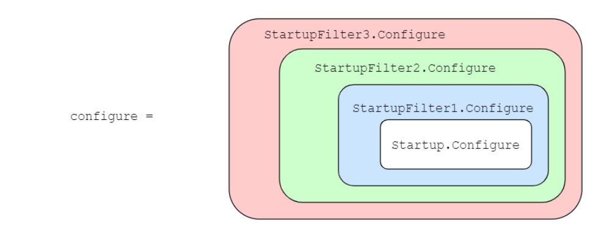

**拓展资料：**

[探索ASP.NET Core中的IStartupFilter - LamondLu - 博客园 (cnblogs.com)](https://www.cnblogs.com/lwqlun/p/10279874.html)

### 中间件

#### 定义

**应用程序管道中用来处理请求和响应的组件。**

中间件是一个请求委托(public [delegate](https://so.csdn.net/so/search?q=delegate&spm=1001.2101.3001.7020) Task RequestDelegate(HttpContext context))的实例,所以中间件的本质是一个方法，参数是HttpContext,返回参数是一个task,每个中间件根据不同的方法，可以决定是否将请求传递给管道中的下个组件，也可以在执行管道中下个请求的前后都处理业务逻辑。

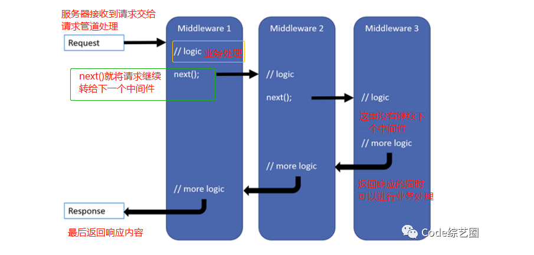

##### 原始中间件

> Use方法最明显的特征是：传入的委托中含有一个委托参数，我们一般用next来接收这个委托参数，通过调用next.Invode()方法来调用下一个中间件，这样Use之后的中间件才能够被执行

```C#
app.Use(next =>
{
    Console.WriteLine("This is middleware 1");
    return new RequestDelegate(
       async context =>
       {
           context.Response.ContentType = "text/html";
           await context.Response.WriteAsync("This is Hello World 1 start </br>");
           await next.Invoke(context);
           await context.Response.WriteAsync("This is Hello World 1 end </br>");
       });
});
app.Use(next =>
{
    Console.WriteLine("This is middleware 2");
    return new RequestDelegate(
       async context =>
       {
           await context.Response.WriteAsync("This is Hello World 2 start </br>");
           await next.Invoke(context);
           await context.Response.WriteAsync("This is Hello World 2 end </br>");
       });
});
app.Use(next =>
{
    Console.WriteLine("This is middleware 3");
    return new RequestDelegate(
       async context =>
       {
           await context.Response.WriteAsync("This is Hello World 3 start </br>");
           //await next.Invoke(context);//没有下个中间件
           await context.Response.WriteAsync("This is The Chooen One! </br>");
           await context.Response.WriteAsync("This is Hello World 3 end </br>");
       });
});
```

请求处理结果如下：

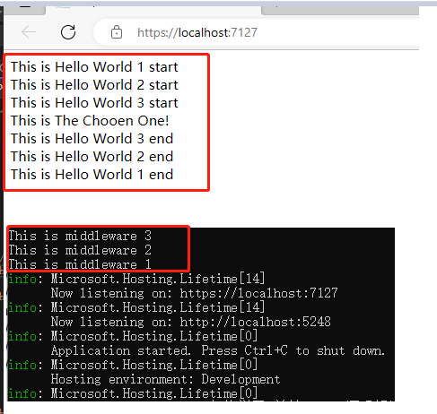

中心源码：

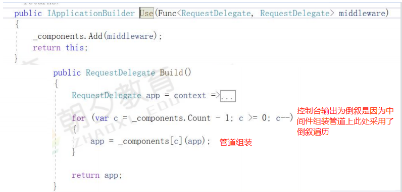

#### 内置中间件

##### app.Use

> //传入的委托中含有一个委托参数，我们一般用next来接收这个委托参数，通过调用next.Invode()方法来调用下一个中间件，这样Use之后的中间件才能够被执行

```C#
            app.Use(async (context, next) =>
            {
                Console.WriteLine("use1 start");
                await next.Invoke();
                Console.WriteLine("use1 end");
            });
```


##### app.Run

> Run相当于一个终结点，Run之后的中间件不会被执行，因为它不像Use一样可以调用next.Invoke();

```C#
            app.Run(context =>
            {
                Console.WriteLine("run");
                return context.Response.WriteAsync("Run,Hello World!");
            });
```

##### app.Map

> 只有访问特定的路径才会执行

```C#
            app.Map("/map", app =>
            {
                app.Run(context =>
                {
                    Console.WriteLine("map");
                    return context.Response.WriteAsync("Map,Hello World!");
                });
            });
```

##### app.MapWhen

> 当条件成立时，中间件才会被执行，并且MapWhen创建了一个新的管道，当满足条件时，新的管道会代替主管道，这意味着主管道的中间件不会被执行

```C#
            app.MapWhen(context =>
            {
                return context.Request.Query.ContainsKey("Name");
                //拒绝非chorme浏览器的请求  		
                //多语言		
                //把ajax统一处理		
            }, app =>
            {
                app.Use(async (context, next) =>
                {
                    Console.WriteLine("mapwhen1 start ");
                    await next.Invoke();
                    Console.WriteLine("mapwhen1 end");
                    await context.Response.WriteAsync("Url is " + context.Request.QueryString.ToString());
                });
            });

            app.Use(async (context, next) =>
            {
                Console.WriteLine("use2 start ");
                await next.Invoke();
                Console.WriteLine("use2 end ");
            });

```

测试结果：

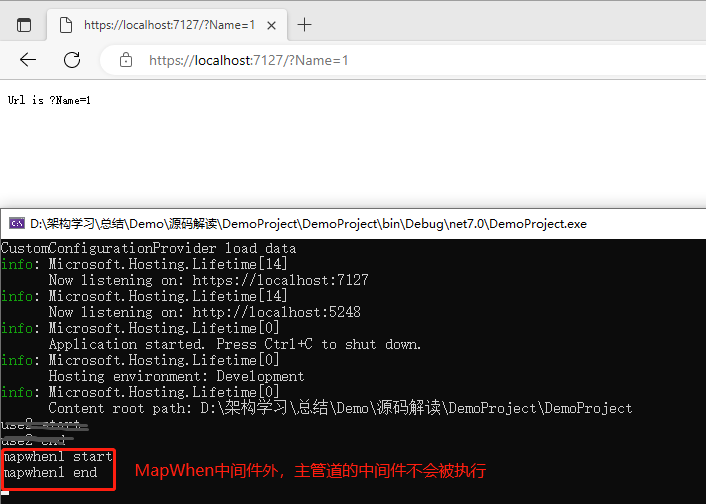

##### app.UseWhen

> UseWhen和MapWhen类似，也是当条件成立时，中间件才会被执行，区别是UseWhen不会代替主管道

```C#
            app.UseWhen(context =>
            {
                return context.Request.Query.ContainsKey("Name");
                //拒绝非chorme浏览器的请求  		
                //多语言		
                //把ajax统一处理		
            }, app =>
            {
                app.Use(async (context, next) =>
                {
                    Console.WriteLine("usewhen1 start");
                    await next.Invoke();
                    Console.WriteLine("usewhen1 end");
                });
            });


            app.Use(async (context, next) =>
            {
                Console.WriteLine("use2 start ");
                await next.Invoke();
                Console.WriteLine("use2 end ");
            });
```

测试结果

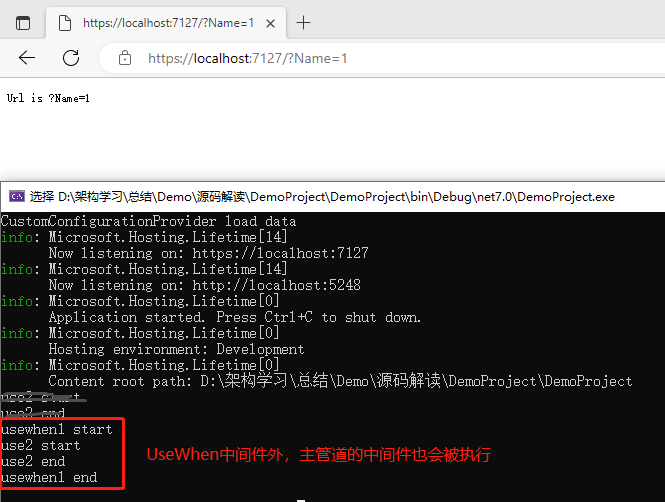

#### UseMiddleware

与app.use的区别：可以新建类，自定义中间件，微软已经封装好了，最终还是调用的app.Use

##### 自定义类

> 构造函数中注入RequestDelegate，且实现Invoke/InvokeAsync（其中一个）接口

- 不带参数

  ```C#
      public class FirstMiddleware//不实现接口
      {
          private readonly RequestDelegate _next;
          /// <summary>
          /// 一定有个构造函数，传递RequestDelegate
          /// </summary>
          /// <param name="next"></param>
          public FirstMiddleware(RequestDelegate next)
          {
              _next = next;
          }
  
          /// <summary>
          /// 方法名字叫 InvokeAsync 或者Invoke
          /// </summary>
          /// <param name="context"></param>
          /// <returns></returns>
          public async Task InvokeAsync(HttpContext context)
          {
              context.Response.ContentType = "text/html";
              await context.Response.WriteAsync($"{nameof(FirstMiddleware)},Hello World1 Start!<br/>");
              await _next(context);
              await context.Response.WriteAsync($"{nameof(FirstMiddleware)},Hello World1  End!<br/>");
  
          }
      }
  
  	//引入中间件
  	app.UseMiddleware<FirstMiddleware>();
  ```

  

- 带参数

  ```C#
      public class ThirdMiddleware
      {
          private readonly RequestDelegate _next;
          private readonly ILogger _logger;
          private readonly string _Message;
  
          //源码在解析时，第一个参数会固定为next，然后再匹配自定义参数，最后再进行IOC相关依赖注入
          public ThirdMiddleware(RequestDelegate next, ILogger<ThirdMiddleware> logger, string message)
          {
              this._next = next;
              this._logger = logger;
              this._Message = message;
          }
          /// <summary>
          /// 1 方法名字Invoke或者InvokeAsync
          /// 2 返回类型必须是Task
          /// </summary>
          /// <param name="context"></param>
          /// <returns></returns>
          public async Task Invoke(HttpContext context)
          {
              Console.WriteLine($"{nameof(ThirdMiddleware)}---{this._Message}");
              //context.Response.ContentType = "text/html";
  
              if (!context.Request.Path.Value.Contains("Eleven"))
              {
                  await context.Response.WriteAsync($"{nameof(ThirdMiddleware)}This is Hello World 3 End<br/>");
              }
              else
              {
                  await context.Response.WriteAsync($"{nameof(ThirdMiddleware)},Hello World ThreeMiddleWare!<br/>");
                  //await _next(context);
                  await context.Response.WriteAsync($"{nameof(ThirdMiddleware)},Hello World ThreeMiddleWare!<br/>");
              }
          }
      }
  
  
  	//引入中间件
   	app.UseMiddleware<ThirdMiddleware>("DemoProject");
  ```

  

##### 实现IMiddlerWare

> 在请求到来时，会从IMiddlewareFactory中获取中间件实例
>   （1）实现IMiddleware，就不能有参数--而且还得IOC注册
>   （2）SecondMiddleWare类型的初始化是请求来了之后才发生，跟FirstMiddleware不一样
>   （3）如果响应请求时，才实例化，用完立即释放---这种就应该实现IMiddleware

```C#
    public class SecondMiddleware : IMiddleware
    {
        private readonly ILogger _logger;

        public SecondMiddleware(ILogger<SecondMiddleware> logger)
        {
            this._logger = logger;
        }

        public async Task InvokeAsync(HttpContext context, RequestDelegate next)
        {
            this._logger.LogWarning($"{nameof(SecondMiddleware)},Hello World1=2!<br/>");
            context.Response.ContentType = "text/html";
            await context.Response.WriteAsync($"{nameof(SecondMiddleware)},Hello World2 Start!<br/>");
            await next(context);
            await context.Response.WriteAsync($"{nameof(SecondMiddleware)},Hello World2 End!<br/>");
        }
    }


	//IOC注册
	builder.Services.AddSingleton<SecondMiddleware>();

	//引入中间件
	app.UseMiddleware<SecondMiddleware>();
```

- 普通Middleware类是启动时，在组装管道模型时实例化，嵌套委托常驻内存，`初始化支持传参数`
- 接口实现Middleware类是响应请求的时候才实例化，每次请求来了才实例化，支持主动释放，默认实例化不能传参数

更多时候，只要中间件自身不考虑资源释放，都会使用第一种方式。

##### 实现IMiddleWareFactory

> 继承IMiddlewareFactory，可用于替换默认的IMiddlewareFactory处理

```C#
    /// <summary>
    /// 替换默认的middleware工厂
    /// </summary>
    public class SecondNewMiddlewareFactory : IMiddlewareFactory
    {
        private readonly IServiceProvider _iServiceProvider;
        private readonly ILogger _logger;
        public SecondNewMiddlewareFactory(IServiceProvider serviceProvider, ILogger<SecondNewMiddlewareFactory> logger)
        {
            this._iServiceProvider = serviceProvider;
            this._logger = logger;
        }

        public IMiddleware Create(Type middlewareType)
        {
            Console.WriteLine("替换默认Middleware工厂");
            return (IMiddleware)this._iServiceProvider.GetService(middlewareType)!;
        }

        /// <summary>
        /// middleware响应时才生成，尽快释放
        /// </summary>
        /// <param name="middleware"></param>
        public void Release(IMiddleware middleware)
        {
            if (middleware != null)
            {
                (middleware as IDisposable)?.Dispose();
            }
        }
    }


   //IOC依赖注入，替换默认工常
	builder.Services.Replace(ServiceDescriptor.Singleton<IMiddlewareFactory, SecondNewMiddlewareFactory>());

	//引入中间件
	app.UseMiddleware<SecondMiddleware>();
```

#### 标准扩展

> 标准扩展：AddMiddleware + UseMiddleware + Options
> Add：集中扩展
> Use：扩展类
> Options：传值

需求：写一个浏览器过滤中间件----如果是Chrome就正常响应，否则返回Refuse

- IBrowserCheck

  ```C#
      public interface IBrowserCheck
      {
          Tuple<bool, string> CheckBrowser(HttpContext httpContext);
      }
  ```

  

- BrowserCheck

  ```C#
      public class BrowserCheckService : IBrowserCheck
      {
          private readonly BrowserFilterOptions _BrowserFilterOptions;
          private readonly ILogger _logger;
          public BrowserCheckService(ILogger<BrowserCheckService> logger, IOptions<BrowserFilterOptions> options)
          {
              this._logger = logger;
              this._BrowserFilterOptions = options.Value;
          }
  
          public Tuple<bool, string> CheckBrowser(HttpContext httpContext)
          {
              Console.WriteLine($"EnableChorme={this._BrowserFilterOptions.EnableChorme}");
              Console.WriteLine($"EnableEdge={this._BrowserFilterOptions.EnableEdge}");
              Console.WriteLine($"EnableFirefox={this._BrowserFilterOptions.EnableFirefox}");
              Console.WriteLine($"EnableIE={this._BrowserFilterOptions.EnableIE}");
              
              if (httpContext.Request.Headers["User-Agent"].ToString().Contains("Edg/") && !this._BrowserFilterOptions.EnableEdge)
              {
                  Console.WriteLine($"{nameof(BrowserFilterMiddleware)} Refuse Edge,Choose other one<br/>");
                  return Tuple.Create(false, $"{nameof(BrowserFilterMiddleware)} Refuse Edge,Choose other one<br/>");
              }
              else
              {
                  return Tuple.Create(true, $"{nameof(BrowserFilterMiddleware)} ok");
              }
          }
          //User-Agent: Mozilla/5.0 (Windows NT 10.0; Win64; x64) AppleWebKit/537.36 (KHTML, like Gecko) Chrome/91.0.4472.124 Safari/537.36
          //User-Agent: Mozilla/5.0 (Windows NT 10.0; Win64; x64) AppleWebKit/537.36 (KHTML, like Gecko) Chrome/91.0.4472.124 Safari/537.36 Edg/91.0.864.64
      }
  ```

  

- BrowserFilterOptions

  ```C#
      public class BrowserFilterOptions
      {
          public bool EnableIE { get; set; } = false;
          public bool EnableEdge { get; set; } = false;
          public bool EnableChorme { get; set; } = false;
          public bool EnableFirefox { get; set; } = false;
  
  
          internal List<Func<HttpContext, Tuple<bool, string>>> DisableList = new List<Func<HttpContext, Tuple<bool, string>>>();
  
          public void InitDisableList(Func<HttpContext, Tuple<bool, string>> func)
          {
              this.DisableList.Add(func);
          }
  
      }
  ```

  

- BrowserFilterMiddleware

  ```C#
      public class BrowserFilterMiddleware
      {
          #region Identity
          private readonly RequestDelegate _next;
          private readonly ILogger _logger;
          private readonly IBrowserCheck _iBrowserCheck;
  
          /// <summary>
          /// IOptions<BrowserFilterOptions> options 有2个来源
          /// 既可以Use的时候去直接传递
          /// 也可以Add是Configure,这里再获取
          /// </summary>
          /// <param name="next"></param>
          /// <param name="logger"></param>
          /// <param name="browserCheck"></param>
          /// <param name="options"></param>
          public BrowserFilterMiddleware(RequestDelegate next, ILogger<BrowserFilterMiddleware> logger, IBrowserCheck browserCheck)
          {
              this._next = next;
              this._logger = logger;
              this._iBrowserCheck = browserCheck;
          }
          #endregion
  
          public async Task InvokeAsync(HttpContext context)
          {
              var result = this._iBrowserCheck.CheckBrowser(context);
              if (!result.Item1)//检查失败
              {
                  Console.WriteLine($"{nameof(BrowserFilterMiddleware)} {result.Item2}");
                  await context.Response.WriteAsync($"{nameof(BrowserFilterMiddleware)} {result.Item2}");
              }
              else
              {
                  //检查通过，就走默认流程
                  Console.WriteLine($"{nameof(BrowserFilterMiddleware)} ok");
                  await _next(context);
              }
          }
      }
  ```

  

- BrowserFilterServiceExtensions

  ```C#
          /// <summary>
          /// IOC注册
          /// </summary>
          /// <param name="services"></param>
          /// <returns></returns>
          public static IServiceCollection AddBrowserFilter(this IServiceCollection services)
          {
              return services.AddSingleton<IBrowserCheck, BrowserCheckService>();
              //没有option---就用默认的
          }
  
          public static IServiceCollection AddBrowserFilter(this IServiceCollection services, Action<BrowserFilterOptions> configure)
          {
              services.Configure(configure);//这个是之前讲的Options,只是配置，但是生效是在访问Value属性时
              return services.AddBrowserFilter();
          }
  ```

  

- BrowserFilterMiddlewareExtensions

  ```C#
          public static IApplicationBuilder UseBrowserFilter(this IApplicationBuilder app)
          {
              if (app == null)
              {
                  throw new ArgumentNullException(nameof(app));
              }
              return app.UseMiddleware<BrowserFilterMiddleware>();//这里可以给Middleware做些信息信息传递
          }
  ```

- 依赖注入、引入中间件

  ``` C#
  	builder.Services.AddBrowserFilter(options =>
  	{
  		options.EnableEdge = false;
  	});
  
  
    app.UseBrowserFilter();
  ```

#### 应用场景

- 全部请求都要执行的-----日志/性能监控/跨域/压缩/前端缓存---为所有的请求添加通用操作
- 包裹在外层做请求拦截---黑白名单/反爬虫/限流/链路追踪---可装配可拆卸的这种操作
- 应对特殊条件的请求-----UseWhen/MapWhen---Robot/RSS/防盗链/静态文件中间件----只针对某种请求

#### 中间件扩展

##### 防盗链

- 原理

  ​		实现防盗链，我们就必须先理解盗链的实现原理，提到防盗链的实现原理就不得不从HTTP协议说起，在HTTP协议中，有一个表头字段叫**referer**，采用URL的格式来表示从哪儿链接到当前的网页或文件。换句话说，通过referer，网站可以检测目标网页访问的来源网页，如果是资源文件，则可以跟踪到显示它的网页地址。有了referer跟踪来源就好办了，这时就可以通过技术手段来进行处理，一旦检测到来源不是本站即进行阻止或者返回指定的页面。如果想对自己的网站进行防盗链保护，则需要针对不同的情况进行区别对待。
  　　如果网站服务器用的是apache，那么使用apache自带的Url Rewrite功能可以很轻松地防止各种盗链，其原理也是检查refer，如果refer的信息来自其他网站则重定向到指定图片或网页上。
  　　如果服务器使用的是IIS的话，则需要通过第三方插件来实现防盗链功能了，现在比较常用的一款产品叫做ISAPI_Rewrite，可以实现类似于apache的防盗链功能。另外对于论坛来说还可以使用“登录验证”的方法进行防盗链。

- 实现防盗链

  ```C#
      public class HotlinkingPreventionMiddleware
      {
          private readonly string _wwwrootFolder;
          private readonly RequestDelegate _next;
  
          public HotlinkingPreventionMiddleware(RequestDelegate next, IHostingEnvironment env)
          {
              _wwwrootFolder = env.WebRootPath;
              _next = next;
          }
  
          public async Task Invoke(HttpContext context)
          {
              var applicationUrl = $"{context.Request.Scheme}://{context.Request.Host.Value}";
              var headersDictionary = context.Request.Headers;
              var urlReferrer = headersDictionary[HeaderNames.Referer].ToString();
              string url = context.Request.Path.Value;
              if (!url.Contains(".jpg"))
              {
                  await _next(context);//走正常流程，啥事儿不干
              }
              else
              {
                  if (string.IsNullOrEmpty(urlReferrer))  //直接访问
                  {
                      await this.SetForbiddenImage(context);
                  }
                  else if (!urlReferrer.StartsWith(applicationUrl)) //非当前域名
                  {
                      await this.SetForbiddenImage(context);
                  }
                  else
                  {
                      await _next(context);
                  }
              }
  
          }
  
          private async Task SetForbiddenImage(HttpContext context)
          {
              var unauthorizedImagePath = Path.Combine(_wwwrootFolder, "Images/Forbidden.jpg");
  
              await context.Response.SendFileAsync(unauthorizedImagePath);
          }
  
      }
  
      public static class HotlinkingPreventionExtensions
      {
          public static IApplicationBuilder UseHotlinkingPreventionMiddleware(this IApplicationBuilder app)
          {
              return app.UseMiddleware<HotlinkingPreventionMiddleware>();
          }
      }
  
  
  	app.UseHotlinkingPreventionMiddleware();
  ```

  

- 总结

  突破防盗链？

  针对检查refer的方式，可以在页面中间件里面先进入目的地址的另外一个页面在转到目的页面即可，这样页面的refer就是目的站点自己的，如此，即做到突破。这方面可以使用的工具很多，尤其是成熟的web项目测试包，如HtmlUnit，直接在请求中设置refer都是可以的。 

  如果盗用网站是 https 的 protocol，而图片链接是 http 的话，则从 https 向 http 发起的请求会因为安全性的规定，而不带 referer，从而实现防盗链的绕过。

  最后，我只能说这种方式，只能在一定程度上进行防御，不可能杜绝所有的攻击，还是建议使用成熟服务器应用的方案，比如Nginx

#### 框架默认中间件

处理顺序

- UseExceptionHandler：必须在最外层，全局异常处理
- UseStaticFiles：先处理静态，再处理动态
- UseSession：动态数据才需要session
- UseRouting：得先路由匹配(endpoint初始化)
- UseAuthentication：路由匹配后，才知道需要鉴权
- UseAuthorization：路由匹配后，才知道需要授权，必须鉴权后才能授权
- MapControllerRoute：然后才能完成MVC处理---鉴权授权都通过了，才有意义

### UseExceptionHandler

#### 框架自带异常中间件

```C#
            // Configure the HTTP request pipeline.
            if (!app.Environment.IsDevelopment())
            {
                app.UseExceptionHandler("/Home/Error");
                // The default HSTS value is 30 days. You may want to change this for production scenarios, see https://aka.ms/aspnetcore-hsts.
                app.UseHsts();
            }
            else
            {
                app.UseDeveloperExceptionPage();
            }
```

UseDeveloperExceptionPage：对于开发模式，一旦报错就跳转到错误堆栈页面。

UseExceptionHandler：从它的名字中我们大致可以猜出它肯定是个错误拦截程序。

`UseExceptionHandler`其实就是默认的错误处理。

它其实也是一个中间件，它的原名叫做ExceptionHandlerMiddleware。在使用UseExceptionHandler方法时，我们可以选填各种参数。比如上面的第二段代码，填入了“/Error”参数，表示当产生异常的时候，将定位到对应的路径，这里定位的页面就是“http://localhost:5001/Home/Error”。这是MVC中自带的一个错误页面，当然，你也可以指定自己定义的一个页面。

UseExceptionHandler还有一个指定ExceptionHandlerOptions参数的扩展方法，该参数是ExceptionHandlerMiddleware中间件的重要参数：

- ExceptionHandlingPath：重定向的路径，比如刚才的 ""/Error"" 实际上就是指定的该参数

  ```C#
              // Configure the HTTP request pipeline.
              if (!app.Environment.IsDevelopment())
              {
                  //生产环境下发生异常，则会进入自定义错误页http://localhost:500/Home/CustomError
                  //app.UseExceptionHandler("/Home/Error");
                  app.UseExceptionHandler("/Home/CustomError");
                  // The default HSTS value is 30 days. You may want to change this for production scenarios, see https://aka.ms/aspnetcore-hsts.
                  app.UseHsts();
              }
              else
              {
                  app.UseDeveloperExceptionPage();
              }
  ```

  

- ExceptionHandler：错误拦截处理程序。允许我们在ExceptionHandlerMiddleware内部指定咱们自己的异常处理逻辑。而该参数的类型为RequestDelegate类型的委托。

  ```C#
    			// Configure the HTTP request pipeline.
              if (!app.Environment.IsDevelopment())
              {
                  //app.UseExceptionHandler("/Home/Error");
                  app.UseExceptionHandler(build=> build.Use(ExceptionHandlerDemo));
                  // The default HSTS value is 30 days. You may want to change this for production scenarios, see https://aka.ms/aspnetcore-hsts.
                  app.UseHsts();
              }
              else
              {
                  app.UseDeveloperExceptionPage();
              }
  
              async Task ExceptionHandlerDemo(HttpContext httpContext, Func<Task> next)
              {
                  //该信息由ExceptionHandlerMiddleware中间件提供，里面包含了ExceptionHandlerMiddleware中间件捕获到的异常信息。
                  var exceptionDetails = httpContext.Features.Get<IExceptionHandlerFeature>();
                  var ex = exceptionDetails?.Error;
  
                  if (ex != null)
                  {
                      httpContext.Response.ContentType = "application/problem+json";
  
                      var title = "An error occured: " + ex.Message;
                      var details = ex.ToString();
  
                      var problem = new ProblemDetails
                      {
                          Status = 500,
                          Title = title,
                          Detail = details
                      };
  
                      var stream = httpContext.Response.Body;
                      await JsonSerializer.SerializeAsync(stream, problem);
                  }
              }
  ```

#### 自定义异常处理中间件

```C#
    /// <summary>
    /// 自定义异常中间件
    /// </summary>
    public class CustomerExceptionMiddleware
    {
        /// <summary>
        /// 委托
        /// </summary>
        private readonly RequestDelegate _next;

        public CustomerExceptionMiddleware(RequestDelegate next)
        {
            _next = next;
        }

        public async Task Invoke(HttpContext context)
        {
            try
            {
                await _next(context);
            }
            catch (Exception ex)
            {

                context.Response.ContentType = "text/html";
                await context.Response.WriteAsync("Exception:" + ex.Message);
            }
        }
    }
    public static class ExceptionMiddlewareExtension
    {
        public static IApplicationBuilder UseCustomException(this IApplicationBuilder app)
        {
            if (app == null)
            {
                throw new ArgumentNullException(nameof(app));
            }
            return app.UseMiddleware<CustomerExceptionMiddleware>();
        }
    }


	//Program.cs
	//app.UseExceptionHandler("/Home/Error");
	app.UseCustomException();//替换原有异常处理中间件
```

### UseHsts/UseHttpsRedirection

- UseHsts：HTTP严格传输安全协议（HSTS），会添加一个header--- Strict-Transport-Security= max-age=
- UseHttpsRedirection：检查当前项目启动后，监听的是否是多个端口，其中如果有协议是Https—我们在访问Http的默认会转发到Https中。

### UseStaticFiles

- FileProvider：配置静态文件存放目录

  未指定时，默认使用默认文件夹wwwroot

- RequestPath：配置静态文件访问路径(虚拟路径)

- ServeUnknownFileTypes/DefaultContentType：当ServeUnknownFileTypes为true时，可针对未知MIME类型以DefaultContentType格式显示；当为false，则不能访问该文件。

- ContentTypeProvider：追加未知类型到MIME映射

- OnPrepareResponse：在访问静态文件前，做一些自定义处理

  ```C#
              //配置静态文件中间件
              var provider = new FileExtensionContentTypeProvider();
              //追加未知类型到MIME映射
              //provider.Mappings.Add(".ini", "text/plain");
              app.UseStaticFiles(new StaticFileOptions()
              {
                  FileProvider = new PhysicalFileProvider(Path.Combine(AppDomain.CurrentDomain.BaseDirectory, "StaticFiles")),
                  RequestPath = new PathString("/StaticFiles"),
                  ServeUnknownFileTypes = true,
                  DefaultContentType = "image/jpeg", 
                  //ContentTypeProvider = provider, //如果不配置该项则.ini文件将不能被访问，仅支持访问部分类型的文件，具体参考FileExtensionContentTypeProvider类
                  OnPrepareResponse = (context) =>
                  {
                      //响应请求之前，才可以修改header
                      //context.Context.Response.Headers.Add("Access-Control-Allow-Origin", "*");//配置可跨域访问
                  }
              }); 
  ```

### UseDirectoryBrowser

提供目录浏览权限

```C#
           
			builder.Services.AddDirectoryBrowser();

			app.UseDirectoryBrowser(new DirectoryBrowserOptions
            {
                FileProvider = new PhysicalFileProvider(Directory.GetCurrentDirectory()),
                RequestPath = "/StaticDirectory"
            });
```

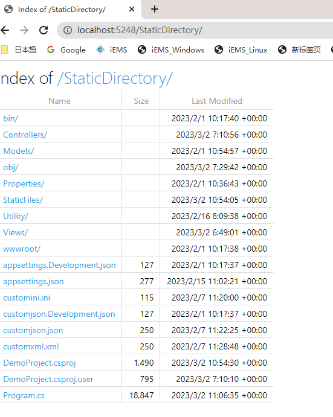

### UseSession

#### UseSession

```C#
//IOC注册
builder.Services.AddSession();

//引入中间件
app.UseSession();

//控制器代码
 public IActionResult Session()
 {
     string sessionUser = base.HttpContext.Session.GetString("CurrentUser")!;

     if (sessionUser == null)
     {
         base.HttpContext.Session.SetString("CurrentUser", $"{this._iConfiguration["ip"]}:{this._iConfiguration["port"]} Eleven");
         base.ViewBag.Info = $"{this._iConfiguration["ip"]}:{this._iConfiguration["port"]} 头一次进入，初始化Session";
     }
     else
     {
         base.ViewBag.Info = $"{this._iConfiguration["ip"]}:{this._iConfiguration["port"]} 后续进入，从Session读取数据CurrentUser={sessionUser}";
     }
     return View();
}
```

#### Redis-分布式Session

可以解决网站集群--用户持久化问题

- Nuget Microsoft.Extensions.Caching.Redis
- 注册服务+注入
- 启用Redis-配置连接
- Session共享-分布式缓存

```C#
	此示例只实现了Session持久化功能，并未实现Session共享功能    

	builder.Services.AddSession();

     builder.Services.AddDistributedRedisCache(options =>
     {
     	 options.Configuration = "127.0.0.1:6379";
     	 options.InstanceName = "RedisDistributedCache123";
      });

	//引入中间件
	app.UseSession();
```

> Session与Cookie的区别
>
> Administrator:
> 关于Session：
>
> 1. 由于HTTP协议是无状态的协议，所以服务端需要记录用户的状态时，就需要用某种机制来识具体的用户，这个机制就是Session.典型的场景比如购物车，当你点击下单按钮时，由于HTTP协议无状态，所以并不知道是哪个用户操作的，所以服务端要为特定的用户创建了特定的Session，用用于标识这个用户，并且跟踪用户，这样才知道购物车里面有几本书。这个Session是保存在服务端的，有一个唯一标识。在服务端保存Session的方法很多，内存、数据库、文件都有。集群的时候也要考虑Session的转移，在大型的网站，一般会有专门的Session服务器集群，用来保存用户会话，这个时候 Session 信息都是放在内存的，使用一些缓存服务比如Memcached之类的来放 Session。
> 2. 思考一下服务端如何识别特定的客户？这个时候Cookie就登场了。每次HTTP请求的时候，客户端都会发送相应的Cookie信息到服务端。实际上大多数的应用都是用 Cookie 来实现Session跟踪的，第一次创建Session的时候，服务端会在HTTP协议中告诉客户端，需要在 Cookie 里面记录一个Session ID，以后每次请求把这个会话ID发送到服务器，我就知道你是谁了。有人问，如果客户端的浏览器禁用了 Cookie 怎么办？一般这种情况下，会使用一种叫做URL重写的技术来进行会话跟踪，即每次HTTP交互，URL后面都会被附加上一个诸如 sid=xxxxx 这样的参数，服务端据此来识别用户。
> 3. Cookie其实还可以用在一些方便用户的场景下，设想你某次登陆过一个网站，下次登录的时候不想再次输入账号了，怎么办？这个信息可以写到Cookie里面，访问网站的时候，网站页面的脚本可以读取这个信息，就自动帮你把用户名给填了，能够方便一下用户。这也是Cookie名称的由来，给用户的一点甜头。
>    总结一下：Session是在服务端保存的一个数据结构，用来跟踪用户的状态，这个数据可以保存在集群、数据库、文件中；Cookie是客户端保存用户信息的一种机制，用来记录用户的一些信息，也是实现Session的一种方式。

参考资料：[详解Session分布式共享（.NET CORE版） - 傲翼飞寒 - 博客园 (cnblogs.com)](https://www.cnblogs.com/newP/p/6689863.html)

### 路由匹配

`UseRouting/MapControllerRoute`

#### 源码解读

#### Control规则

-  必须是类
- 不能是抽象的
- 必须是public的
- 不能包含泛型参数
- 不能具有[NonController]特性
- 名字以“Controller”结尾或者具有[Controller]特性

#### Action规则

- 不能是特殊的方法(运算符重载，属性的set/get方法)
- 不能是[NonAction]
- 不能是object继承下来的
- 不能是dispose方法
- 不能是静态方法
- 不能是抽象方法
- 不能是构造函数
- 不能是泛型方法
- 必须是public方法

#### ModelConventions模型约定

ModelConvention定义了操作模型的入口，又或者说是一种契约，通过它我们可以对模型进行修改，常用的Convention包括：

- IApplicationModelConvention
- IControllerModelConvention
- IActionModelConvention
- IParameterModelConvention
- IPageRouteModelConvention

以IControllerModelConvention进行扩展说明。

需求：针对满足某些特殊条件（比如ControllerName=Home）的Controller添加ActionFilter

方法一：继承IControllerModelConvention类

CustomControllerModelConvention.cs

```C#
    public class CustomControllerModelConvention : IControllerModelConvention
    {
        public void Apply(ControllerModel controller)
        {
            if (controller.ControllerName.Equals("Home"))
            {
                Console.WriteLine("This is CustomControllerModelConvention Apply");
                controller.Filters.Add(new CustomInnerActionFilterAttribute() { Remark= "CustomControllerModelConvention----1" });
                //等同于在控制器上面标记Filter---
            }
        }
    }

    internal class CustomInnerActionFilterAttribute : ActionFilterAttribute
    {
        public string Remark = null;
        /// <summary>
        /// Action执行后
        /// </summary>
        /// <param name="context"></param>
        public override void OnActionExecuted(ActionExecutedContext context)
        {
            Console.WriteLine($"This {nameof(CustomInnerActionFilterAttribute)} OnActionExecuted {this.Order}---{Remark}");
        }
        /// <summary>
        /// Action执行前
        /// </summary>
        /// <param name="context"></param>
        public override void OnActionExecuting(ActionExecutingContext context)
        {
            Console.WriteLine($"This {nameof(CustomInnerActionFilterAttribute)} OnActionExecuting{this.Order}---{Remark}");
        }

        /// <summary>
        /// Result执行前
        /// </summary>
        /// <param name="context"></param>
        public override void OnResultExecuting(ResultExecutingContext context)
        {
            Console.WriteLine($"This {nameof(CustomInnerActionFilterAttribute)} OnResultExecuting{this.Order}---{Remark}");
        }

        /// <summary>
        /// Result执行后
        /// </summary>
        /// <param name="context"></param>
        public override void OnResultExecuted(ResultExecutedContext context)
        {
            Console.WriteLine($"This {nameof(CustomInnerActionFilterAttribute)} OnResultExecuted{this.Order}---{Remark}");
            Console.WriteLine("");
        }
    }
```


Program.cs

```C#
            builder.Services.AddControllersWithViews(services =>
            {
                #region Conventions
                services.Conventions.Add(new CustomControllerModelConvention());//全局式注册Conventions
                #endregion
            });
```


方法二：使用特性，继承IControllerModelConvention

CustomControllerModelConventionAttribute.cs

```C#
    [AttributeUsage(AttributeTargets.Class, AllowMultiple = true, Inherited = true)]
    public class CustomControllerModelConventionAttribute : Attribute, IControllerModelConvention
    {
        public void Apply(ControllerModel controller)
        {
            if (controller.ControllerName.Equals("Home"))
            {
                Console.WriteLine("This is CustomControllerModelConventionAttribute Apply");
                controller.Filters.Add(new CustomInnerActionFilterAttribute() { Remark = "CustomControllerModelConventionAttribute----2" });
                //等同于在控制器上面标记Filter---
            }
        }
    }
```

参考资料：[ 在Asp.Net Core中使用ModelConvention实现全局过滤器隔离_balalalalalala的博客-CSDN博客](https://blog.csdn.net/u012407128/article/details/106294543)

#### Route匹配

##### 默认路由

```C#
           app.MapControllerRoute(
                name: "default",//路由的key---支持多个路由，key-value存储，所以不要重复key
                pattern: "{controller=Home}/{action=Index}/{id?}");//路由规则：
```


##### 基础路由

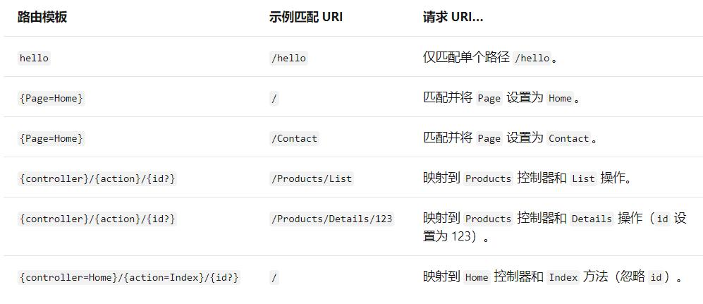

```C#
//Program.cs

//指向路由：http://localhost:5726/about
//默认路由：http://localhost:5726/route/about
app.MapControllerRoute(
  name: "about-route",
  pattern: "about",
  defaults: new { controller = "Route", action = "About" }
  );
```

##### 特性路由

```C#
//RouteController.cs

/// <summary>
/// http://localhost:5726/Item2/133.html      可以
/// http://localhost:5726/Item1/133.html   	  可以
/// http://localhost:5726/Item2/13s.html      不可以
/// http://localhost:5726/Route/PageInfo/133  不可以
/// </summary>
/// <param name="id"></param>
/// <returns></returns>
[Route("/Item1/{id:int}.html")]
[Route("/Item2/{id:int}.html")]
public IActionResult PageInfo(int id)
{
    this._logger.LogWarning("This is RouteController-PageInfo LogWarning");
    string des = $"controller={this.HttpContext.Request.RouteValues["controller"]}&action={this.HttpContext.Request.RouteValues["action"]}&Id={this.HttpContext.Request.RouteValues["id"]}";
    base.ViewBag.Des = des;
    return View();
}
```

说明：

- 支持多个特性路由
- http://localhost:5726/Route/PageInfo/133 是404，说明有特性路由等同于是路由约束了，不会在匹配默认路由

##### 路由约束

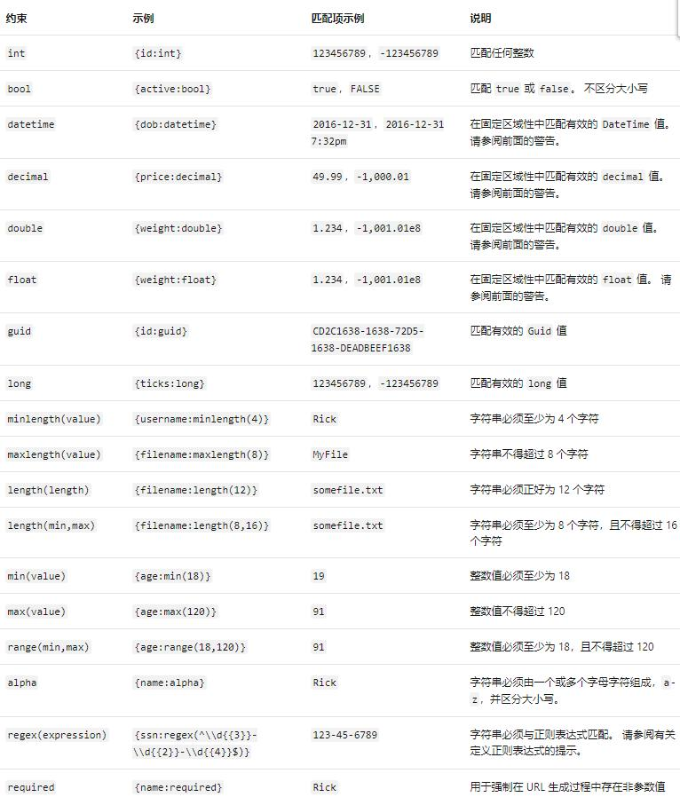

```C#
//变量类型约束，会采用精准匹配

//Program.cs

//http://localhost:5726/hello/11e  
//http://localhost:5726/hello/11
//http://localhost:5726/hello/eleven
app.MapGet("/hello/{name}", async context =>
{
    var name = context.Request.RouteValues["name"];
    await context.Response.WriteAsync($"Hello {name} no constraint !");
});  //处理动作   http://localhost:5726/hello/11e

app.MapGet("/hello/{name:alpha}", async context =>
{
    var name = context.Request.RouteValues["name"];
    await context.Response.WriteAsync($"Hello {name} alpha!");
}); //处理动作   http://localhost:5726/hello/eleven  

app.MapGet("/hello/{name:int}", async context =>
{
    var name = context.Request.RouteValues["name"];
    await context.Response.WriteAsync($"Hello {name} int!");
}); //处理动作   http://localhost:5726/hello/11

```

```C#
//正则约束，会采用精准匹配

//Program.cs

// http://localhost:5726/Route/Data/2019-11  三个都满足，但是找最精准的rang
// http://localhost:5726/Route/Data/2019-13  满足2个，找更精准的
// http://localhost:5726/Route/Data/2018-09  满足2个，找更精准的
// http://localhost:5726/Route/Data/2018-9   只满足默认路由
// http://localhost:5726/Route/Data?year=2019&month=11  默认路由
app.MapControllerRoute(
   name: "range",
   pattern: "{controller=Home}/{action=Index}/{year:range(2019,2021)}-{month:range(1,12)}");

app.MapControllerRoute(
    name: "regular",
    pattern: "{controller}/{action}/{year}-{month}",
    constraints: new { year = "^\\d{4}$", month = "^\\d{2}$" },
    defaults: new { controller = "Home", action = "Index", });

//默认路由
app.MapControllerRoute(
    name: "default",
    pattern: "{controller=Home}/{action=Index}/{id?}");


//RoutController.cs
public IActionResult Data(int year, int month)
{
    this._logger.LogWarning("This is RouteController-Data LogWarning");
                
    string des = $"controller={this.HttpContext.Request.RouteValues["controller"]}&action={this.HttpContext.Request.RouteValues["action"]}&路由Id={this.HttpContext.Request.RouteValues["id"]}&路由year={this.HttpContext.Request.RouteValues["year"]}&路由month={this.HttpContext.Request.RouteValues["month"]}&参数year={year}&参数month={month}";
    base.ViewBag.Des = des;
    return View();
}
```

##### Host约束

```C#
/// <summary>
/// http://localhost:5726/Route/HostInfo/123
/// http://localhost:5727/Route/HostInfo/123  不行
/// </summary>
/// <param name="id"></param>
/// <returns></returns>
[Host("*:5726")]
public IActionResult HostInfo(int id)
{
    this._logger.LogWarning("This is RouteController-HostInfo LogWarning");
    string des = $"controller={this.HttpContext.Request.RouteValues["controller"]}&action={this.HttpContext.Request.RouteValues["action"]}&Id={this.HttpContext.Request.RouteValues["id"]}";
    base.ViewBag.Des = des;
    return View();
}
```

##### 自定义路由规则约束

以下只是提供了扩展思路，不太推荐，除非有特殊需求。

此扩展不好理解，还不如匹配成功了去Action里面检测参数再报错，优势是不进MVC流程，但是信息有点缺失

```C#
    //CustomGenderRouteConstraint.cs，需要继承IRouteConstraint接口

	/// <summary>
    /// 约束
    /// </summary>
    public class CustomGenderRouteConstraint : IRouteConstraint
    {
        /// <summary>
        /// 校验数据的---返回true就通过，false就失败
        /// 只支持0或者1
        /// </summary>
        /// <param name="httpContext"></param>
        /// <param name="route"></param>
        /// <param name="routeKey"></param>
        /// <param name="values"></param>
        /// <param name="routeDirection"></param>
        /// <returns></returns>
        public bool Match(HttpContext httpContext, IRouter route, string routeKey, RouteValueDictionary values, RouteDirection routeDirection)
        {
            Console.WriteLine($"This is {nameof(CustomGenderRouteConstraint)}.Match...");
            if (values.TryGetValue(routeKey, out object value))//拿到值
            {
                var parameterValueString = Convert.ToString(value, CultureInfo.InvariantCulture);
                if (parameterValueString == null)
                {
                    return false;
                }
                else
                {
                    return parameterValueString.Equals("0") || parameterValueString.Equals("1");
                }
            }

            return false;
        }
    }
```

```C#
//Program.cs
builder.Services.AddRouting(options => {
	options.ConstraintMap.Add("GenderConstraint", typeof(CustomGenderRouteConstraint));
});
```

```C#
//RouteConrtroller.cs

/// http://localhost:5726/Gender/1.html
/// http://localhost:5726/Gender/2.html   不行
/// </summary>
/// <param name="id"></param>
/// <returns></returns>
[Route("/Gender/{id:GenderConstraint}.html")]
public IActionResult GenderInfo(int id)
{
    this._logger.LogWarning("This is RouteController-GenderInfo LogWarning");
    string des = $"controller={this.HttpContext.Request.RouteValues["controller"]}&action={this.HttpContext.Request.RouteValues["action"]}&Id={this.HttpContext.Request.RouteValues["id"]}";
    base.ViewBag.Des = des;
    return View();
}
```

##### 动态路由

截止目前，路由都是静态写死的---能否去数据库/Redis去校验？--同样请求，能随着数据库信息而变化。

- app.UseDynamicRouteDefault();

- services.AddDynamicRoute();

- 全套TranslationTransformer实现，能做到自定义动态规则匹配路由，写在CustomTranslationSource

  测试：

  http://localhost:5726/en/route/info

  http://localhost:5726/ch/route1/info1

  http://localhost:5726/hk/route2/info2

具体代码如下：

```C#
    public static class CustomRouteExtensions
    {
        #region DynamicRoute  
        /// <summary>
        /// 需要提供数据获取
        /// </summary>
        /// <param name="services"></param>
        public static void AddDynamicRoute(this IServiceCollection services)
        {
            services.AddSingleton<TranslationTransformer>();
            services.AddSingleton<CustomTranslationSource>();
        }
        /// <summary>
        /// 需要配置路由
        /// 满足这个规则，触发动态路由--再把值做映射
        /// </summary>
        /// <param name="endpoints"></param>
        public static void UseDynamicRouteDefault(this IEndpointRouteBuilder endpoints)
        {
            endpoints.MapDynamicControllerRoute<TranslationTransformer>("{language}/{controller}/{action}");
        }
        #endregion


    }
```

```C#
    /// <summary>
    /// 做映射---数据源（实际项目中可以从数据库/Redis等获取）
    /// </summary>
    public class CustomTranslationSource
    {
        /// <summary>
        /// 映射规则，可以是任意数据源和任意配置
        /// </summary>
        private static Dictionary<string, Dictionary<string, string>> MappingRuleDictionary
            = new Dictionary<string, Dictionary<string, string>>
        {
            {
                "en", new Dictionary<string, string>
                {
                    { "route", "Route" },
                    { "info", "info" }
                }
            },
            {
                "ch", new Dictionary<string, string>
                {
                    { "route1", "Route" },
                    { "info1", "info" }
                }
            },
            {
                "hk", new Dictionary<string, string>
                {
                    { "route2", "Route" },
                    { "info2", "info" }
                }
            },
        };
        /// <summary>
        /// 根据区域，将控制器和Action，做个映射
        /// </summary>
        /// <param name="lang"></param>
        /// <param name="value"></param>
        /// <returns></returns>
        public async Task<string> Mapping(string lang, string value)
        {
            await Task.CompletedTask;
            var area = lang.ToLowerInvariant();
            var mapValue = value.ToLowerInvariant();
            if (MappingRuleDictionary.ContainsKey(area) && MappingRuleDictionary[area].ContainsKey(mapValue))
            {
                return MappingRuleDictionary[area][mapValue];
            }
            else
            {
                return null;
            }
        }
    }
```

```C#
    //动态路由:需要继承DynamicRouteValueTransformer类

	//DynamicRouteValueTransformer (Nuget:Microsoft.AspNetCore.Mvc.Razor.RuntimeCompilation)
	public class TranslationTransformer : DynamicRouteValueTransformer
    {
        private readonly CustomTranslationSource _CustomTranslationSource;
        public TranslationTransformer(CustomTranslationSource translationSource)
        {
            this._CustomTranslationSource = translationSource;
        }
        /// <summary>
        /// 数据转换
        /// </summary>
        /// <param name="httpContext"></param>
        /// <param name="values"></param>
        /// <returns></returns>
        public override async ValueTask<RouteValueDictionary> TransformAsync(HttpContext httpContext
       , RouteValueDictionary values)
        {
            if (!values.ContainsKey("language")
                || !values.ContainsKey("controller")
                || !values.ContainsKey("action"))
            {
                return values;
            }

            var language = values["language"]?.ToString();

            var controller = await this._CustomTranslationSource.Mapping(language,
                values["controller"]?.ToString());
            if (controller == null) return values;
            values["controller"] = controller;


            var action = await this._CustomTranslationSource.Mapping(language,
                values["action"]?.ToString());
            if (action == null) return values;
            values["action"] = action;

            return values;
        }
    }
```

```C#
//Program.cs

builder.Services.AddDynamicRoute();

app.UseDynamicRouteDefault();
```


>MapGet与默认路由的区别：
>
>- 直接指定的规则和RequetDelegate---类似的还有MapPost
>- MapGet在默认路由后，但是会被匹配上---优先级问题
>- 匹配路由后，直接指定RequetDelegate，不走Filter流


### 鉴权授权

#### 名词解释

- Claim：信息
- ClaimsIdentity：身份。后端读取暴露给客户端的信息，是个对象集合。

- ClaimsPrincipal：一个人可以有多个身份

- Scheme：鉴权方案

- Policy：政策：规则，必须满足某一个规则，比如必须使用qq邮箱或者手机号登录

- Role：角色:其实就是一种Policy，是一种封装好的Policy，两者都是规则

- AuthenticationSchemes：鉴权：读取用户身份信息，不同位置，不同解析方式，例如从URL,Session等读取，不同的位置读取就是不同的Schemes。指定用户信息的来源，可能多个来源的合集里面去筛选（JWT的角色+Cokkie里面的Age）。

- AuthenticationTicket：用户票据

- UseAuthentication/UserAuthorization：UseRouting与UseEndPoint之间

- UseAuthentication:认证---鉴权，就是解析请求携带的信息

- UserAuthorization：授权--权限检查，就是看看有没有权限

- Authentication：鉴权：鉴定身份，有没有登录，你是谁。默认没有，必须添加，否则鉴权无效。必须指定默认方案，否则会出错。

  ```C#
  //services.AddAuthentication();//没有任何Scheme不行，程序要求有DefaultScheme
  services.AddAuthentication(CookieAuthenticationDefaults.AuthenticationScheme)//必须指定默认方案
          .AddCookie();//使用Cookie的方式
  ```

- Authorization：授权：判定有没有权限。默认就有（在AddControllerWithView中被添加）

#### 基于Cookie的基本鉴权

- UseAuthentication + AddAuthentication + Cookie

  ```C#
  builder.Services.AddAuthentication(CookieAuthenticationDefaults.AuthenticationScheme)
       .AddCookie(CookieAuthenticationDefaults.AuthenticationScheme, options =>
       {
           //options.ExpireTimeSpan//过期时间
           options.LoginPath = "/Home/Index";//未登录，则跳转至/Home/Index页面
           options.AccessDeniedPath = "/Home/Privacy";//有登陆，但未授权，则跳转至/Home/Privacy页面
       });//使用Cookie的方式
  ```

- UseAuthorization + AddAuthorization(可不写)

- 添加相关控制器，Cookie式登陆方法

- 标记[Authorize] 

  AuthenticationController.cs

  ```C#
          #region 基于Cookie基本鉴权-授权基本流程
          /// <summary>
          /// http://localhost:5726/Authentication/Login?name=Eleven&password=123456
          /// </summary>
          /// <param name="name"></param>
          /// <param name="password"></param>
          /// <returns></returns>
          public async Task<IActionResult> Login(string name, string password)
          {
              if ("Eleven".Equals(name, StringComparison.CurrentCultureIgnoreCase)
                  && password.Equals("123456"))
              {
                  var claimIdentity = new ClaimsIdentity("Custom");
                  claimIdentity.AddClaim(new Claim(ClaimTypes.Name, name));
                  claimIdentity.AddClaim(new Claim(ClaimTypes.Email, "57265177@qq.com"));
                  claimIdentity.AddClaim(new Claim("Email", "12345678@163.com"));
                  claimIdentity.AddClaim(new Claim(ClaimTypes.Role, "Admin"));
                  //claimIdentity.AddClaim(new Claim(ClaimTypes.Role, "User"));
                  claimIdentity.AddClaim(new Claim(ClaimTypes.Country, "Chinese"));
                  claimIdentity.AddClaim(new Claim(ClaimTypes.DateOfBirth, "1986"));
  
                  //把用户信息装到ClaimsPrincipal
                  var claimsPrincipal = new ClaimsPrincipal(claimIdentity);
                  //登录，把用户信息写入到cookie
                  await base.HttpContext.SignInAsync(CookieAuthenticationDefaults.AuthenticationScheme, claimsPrincipal, new AuthenticationProperties
                  {
                      ExpiresUtc = DateTime.UtcNow.AddMinutes(30),
                  });//登陆默认Scheme，写入Cookie
                  return new JsonResult(new
                  {
                      Result = true,
                      Message = "登录成功"
                  });
              }
              else
              {
                  await Task.CompletedTask;
                  return new JsonResult(new
                  {
                      Result = false,
                      Message = "登录失败"
                  });
              }
          }
  
          /// <summary>
          /// 需要授权的页面
          /// http://localhost:5726/Authentication/InfoWithAuthorize
          /// </summary>
          /// <returns></returns>
          [Authorize]//需要鉴权+授权
          public IActionResult InfoWithAuthorize()
          {
              this._logger.LogWarning("This is Authentication-InfoWithAuthorize 1");
              return View();
          }
  
          /// <summary>
          /// 无需权限验证
          /// http://localhost:5726/Authentication/InfoWithAllowAnonymous
          /// </summary>
          /// <returns></returns>
          [AllowAnonymous]
          public IActionResult InfoWithAllowAnonymous()
          {
              this._logger.LogWarning("This is Authentication-InfoWithAllowAnonymous 1");
              return View();
          }
  
          /// <summary>
          /// 退出登陆
          /// http://localhost:5726/Authentication/Logout
          /// </summary>
          /// <returns></returns>
          public async Task<IActionResult> Logout()
          {
              await base.HttpContext.SignOutAsync(CookieAuthenticationDefaults.AuthenticationScheme);//cookie退出，其实就是清除cookie
              return new JsonResult(new
              {
                  Result = true,
                  Message = "退出成功"
              });
          }
  
  		#endregion
  ```

- 校验流程
  - 未登陆，直接访问，跳转登录页
  - AllowAnonymous可直接访问 
  - 登陆后跳转，正常访问 
  - 退出后访问，跳转登陆页

#### 鉴权扩展

##### 自定义鉴权

自定义鉴权处理方法（实现IAuthenticationHandler接口）

接口方法如下：

AuthenticationAsync解析用户信息
ChallengeAsync未登录（授权时才会调用）
ForbidAsync无权限（授权时才会调用）
IntializeAsync初始化（类似于方法注入，传递信息）


IAuthenticationSignInHandler接口
SignInAsync登录（附加的，设计为独立的）
IAuthenticationSignOutHandler接口
SignOutAsyn退出（附加的，设计为独立的）
说明:
SignInAsync和SignOutAsync使用了独立的定义接口，
因为在现代架构中，通常会提供一个统一的认证中心，负责证书的颁发及销毁（登入和登出），
而其它服务只用来验证证书，并用不到SingIn/SingOut。

参考示例：

UrlTokenAuthenticationHandler.cs

```C#
    /// <summary>
    /// 完全自定义的凭证格式和解析方式
    /// </summary>
    public class UrlTokenAuthenticationHandler : IAuthenticationHandler, IAuthenticationSignInHandler, IAuthenticationSignOutHandler
    {
        private AuthenticationScheme _AuthenticationScheme = null;
        private HttpContext _HttpContext = null;

        /// <summary>
        /// 初始化，Provider传递进来的
        /// 像方法注入
        /// </summary>
        /// <param name="scheme"></param>
        /// <param name="context"></param>
        /// <returns></returns>
        public Task InitializeAsync(AuthenticationScheme scheme, HttpContext context)
        {
            Console.WriteLine($"This is {nameof(UrlTokenAuthenticationHandler)}.InitializeAsync");
            this._AuthenticationScheme = scheme;
            this._HttpContext = context;
            return Task.CompletedTask;
        }

        /// <summary>
        /// 核心鉴权处理方法,解析用户信息
        /// </summary>
        /// <returns></returns>
        /// <exception cref="NotImplementedException"></exception>
        public Task<AuthenticateResult> AuthenticateAsync()
        {
            Console.WriteLine($"This is {nameof(UrlTokenAuthenticationHandler)}.AuthenticateAsync");
            string userInfo = this._HttpContext.Request.Query["UrlToken"];//信息从哪里读
            Console.WriteLine($"获取token：{userInfo}");

            if (string.IsNullOrWhiteSpace(userInfo))
            {
                return Task.FromResult<AuthenticateResult>(AuthenticateResult.NoResult());//跳转登陆-ChallengeAsync
            }
            else if ("eleven-123456".Equals(userInfo))//信息是否可靠？  校验规则可以传递到Option的
            {
                var claimIdentity = new ClaimsIdentity("Custom");
                claimIdentity.AddClaim(new Claim(ClaimTypes.Name, userInfo));
                claimIdentity.AddClaim(new Claim(ClaimTypes.Role, "User"));
                claimIdentity.AddClaim(new Claim(ClaimTypes.Email, "xuyang@ZhaoxiEdu.Net"));
                claimIdentity.AddClaim(new Claim(ClaimTypes.Country, "China"));
                claimIdentity.AddClaim(new Claim(ClaimTypes.DateOfBirth, "1986"));
                ClaimsPrincipal claimsPrincipal = new ClaimsPrincipal(claimIdentity);//信息拼装和传递

                return Task.FromResult<AuthenticateResult>(AuthenticateResult.Success(new AuthenticationTicket(claimsPrincipal, null, _AuthenticationScheme.Name)));//往后传递？这里封装了的
            }
            else
            {
                return Task.FromResult<AuthenticateResult>(AuthenticateResult.Fail($"UrlToken is wrong: {userInfo}"));//ForbidAsync
            }
        }

        /// <summary>
        /// 未登录
        /// </summary>
        /// <param name="properties"></param>
        /// <returns></returns>
        public Task ChallengeAsync(AuthenticationProperties properties)
        {
            Console.WriteLine($"This is {nameof(UrlTokenAuthenticationHandler)}.ChallengeAsync");
            string redirectUri = "/Home/Index";
            this._HttpContext.Response.Redirect(redirectUri);
            return Task.CompletedTask;
        }

        /// <summary>
        /// 未授权，无权限
        /// </summary>
        /// <param name="properties"></param>
        /// <returns></returns>
        public Task ForbidAsync(AuthenticationProperties properties)
        {
            Console.WriteLine($"This is {nameof(UrlTokenAuthenticationHandler)}.ForbidAsync");
            this._HttpContext.Response.StatusCode = 403;
            return Task.CompletedTask;
        }


        /// <summary>
        /// SignInAsync和SignOutAsync使用了独立的定义接口，
        /// 因为在现代架构中，通常会提供一个统一的认证中心，负责证书的颁发及销毁（登入和登出），
        /// 而其它服务只用来验证证书，并用不到SingIn/SingOut。
        /// </summary>
        /// <param name="user"></param>
        /// <param name="properties"></param>
        /// <returns></returns>
        public Task SignInAsync(ClaimsPrincipal user, AuthenticationProperties properties)
        {
            var ticket = new AuthenticationTicket(user, properties, this._AuthenticationScheme.Name);
            this._HttpContext.Response.Cookies.Append("UrlTokenCookie", Newtonsoft.Json.JsonConvert.SerializeObject(ticket.Principal.Claims));
            //把一些信息再写入到前端cookie，客户端请求时，从coookie读取UrlTokenCookie信息，放到url上
            return Task.CompletedTask;
        }

        /// <summary>
        /// 退出
        /// </summary>
        /// <param name="properties"></param>
        /// <returns></returns>
        public Task SignOutAsync(AuthenticationProperties properties)
        {
            this._HttpContext.Response.Cookies.Delete("UrlTokenCookie");
            return Task.CompletedTask;
        }

    }

    /// <summary>
    /// 提供个固定值
    /// </summary>
    public class UrlTokenAuthenticationDefaults
    {
        /// <summary>
        /// 提供固定名称
        /// </summary>
        public const string AuthenticationScheme = "UrlTokenScheme";
    }
```


Program.cs

```C#
            builder.Services.AddAuthentication(options =>
            {
                options.AddScheme<UrlTokenAuthenticationHandler>(UrlTokenAuthenticationDefaults.AuthenticationScheme, "UrlTokenScheme-Demo");
                //其实会保存成key-value     也就是name不能重复  value就是UrlTokenAuthenticationHandler
                options.DefaultAuthenticateScheme = UrlTokenAuthenticationDefaults.AuthenticationScheme;
                options.DefaultChallengeScheme = UrlTokenAuthenticationDefaults.AuthenticationScheme;
                options.DefaultSignInScheme = UrlTokenAuthenticationDefaults.AuthenticationScheme;
                options.DefaultForbidScheme = UrlTokenAuthenticationDefaults.AuthenticationScheme;
                options.DefaultSignOutScheme = UrlTokenAuthenticationDefaults.AuthenticationScheme;
            })
```


##### IClaimsTransformation

`IClaimsTransFormation接口可以用来在全局将ClaimsPrincipal添加一些新的Claims`

```C#
    //CustomClaimsTransformation.cs

	/// <summary>
    /// 需要注册到AddAuthentication之后
    /// </summary>
    public class CustomClaimsTransformation : IClaimsTransformation
    {
        /// <summary>
        /// 如果是中国，添加个language为cn
        /// </summary>
        /// <param name="principal">The user.</param>
        /// <returns>The principal unchanged.</returns>
        public virtual Task<ClaimsPrincipal> TransformAsync(ClaimsPrincipal principal)
        {
            Console.WriteLine(principal.Claims.FirstOrDefault().Value);

            if (principal.Claims.FirstOrDefault(c => c.Type.Equals(ClaimTypes.Country))?.Value.Equals("China") ?? false)
            {
                //principal.Claims.Append(new Claim("language", "cn"));//这种方式无效
                ClaimsIdentity? identity = principal.Identity as ClaimsIdentity;
                identity?.AddClaim(new Claim("language", "cn"));
            }

            return Task.FromResult(principal);
        }
    }
```

```C#

	//Program.cs
     builder.Services.Replace(ServiceDescriptor.Scoped<IClaimsTransformation, CustomClaimsTransformation>());
```


##### 多Scheme扩展

> 一个站点支持多个渠道的鉴权，比如APP、H5、微信端、PC----Cookie+JWT+Ids4+UrlToken.
>
> 此处以自定义鉴权方式与Cookie鉴权方式来进行说明

- Program.cs

  ```C#
  
              //默认scheme是UrlTokenScheme
              builder.Services.AddAuthentication(options =>
              {
                  options.AddScheme<UrlTokenAuthenticationHandler>(UrlTokenAuthenticationDefaults.AuthenticationScheme, "UrlTokenScheme-Demo");
                  //其实会保存成key-value     也就是name不能重复  value就是UrlTokenAuthenticationHandler
                  options.DefaultAuthenticateScheme = UrlTokenAuthenticationDefaults.AuthenticationScheme;
                  options.DefaultChallengeScheme = UrlTokenAuthenticationDefaults.AuthenticationScheme;
                  options.DefaultSignInScheme = UrlTokenAuthenticationDefaults.AuthenticationScheme;
                  options.DefaultForbidScheme = UrlTokenAuthenticationDefaults.AuthenticationScheme;
                  options.DefaultSignOutScheme = UrlTokenAuthenticationDefaults.AuthenticationScheme;
              })
              .AddCookie(CookieAuthenticationDefaults.AuthenticationScheme, options =>
              {
                  //options.ExpireTimeSpan//过期时间
                  options.LoginPath = "/Home/Index";
                  options.AccessDeniedPath = "/Home/Privacy";//有登陆，鉴权成功--没有授权
              })//使用Cookie的方式
              //.AddJWT
              ;
  
  ```

  

- Controller.cs

  ```C#
          #region 多Scheme：UrlToken+Cookie
          /// <summary>
          /// http://localhost:5726/Authentication/UrlCookieByDefault
          /// http://localhost:5726/Authentication/UrlCookieByDefault?UrlToken=eleven-123456
          /// </summary>
          /// <returns></returns>
          [Authorize()]//为空，则是默认(UrlToken)--甚至可以不要
          public async Task<IActionResult> UrlCookieByDefault()
          {
              Console.WriteLine($"主动鉴权之前：base.HttpContext.User?.Claims?.First()?.Value == null?{base.HttpContext.User?.Claims?.First()?.Value == null}");
              Console.WriteLine($"主动鉴权之前：base.HttpContext.User?.Identities?.Count() ={base.HttpContext.User?.Identities?.Count()}");
  
  
              var urlToken = await base.HttpContext.AuthenticateAsync(UrlTokenAuthenticationDefaults.AuthenticationScheme);
              Console.WriteLine($"urlToken?.Principal == null ={urlToken?.Principal == null}");
  
  
              var cookie = await base.HttpContext.AuthenticateAsync(CookieAuthenticationDefaults.AuthenticationScheme);
              Console.WriteLine($"urlToken?.Principal == null ={cookie?.Principal == null}");
  
              return new JsonResult(new
              {
                  Result = true,
                  Message = $"认证成功，有用户信息"
              });
          }
  
          /// <summary>
          /// http://localhost:5726/Authentication/UrlCookieByUrlToken
          /// http://localhost:5726/Authentication/UrlCookieByUrlToken?UrlToken=eleven-123456
          /// </summary>
          /// <returns></returns>
          [Authorize(AuthenticationSchemes = UrlTokenAuthenticationDefaults.AuthenticationScheme)]
          public async Task<IActionResult> UrlCookieByUrlToken()
          {
              Console.WriteLine($"主动鉴权之前：base.HttpContext.User?.Claims?.First()?.Value == null?{base.HttpContext.User?.Claims?.First()?.Value == null}");
              Console.WriteLine($"主动鉴权之前：base.HttpContext.User?.Identities?.Count() ={base.HttpContext.User?.Identities?.Count()}");
  
  
              var urlToken = await base.HttpContext.AuthenticateAsync(UrlTokenAuthenticationDefaults.AuthenticationScheme);
              Console.WriteLine($"urlToken?.Principal == null ={urlToken?.Principal == null}");
  
  
              var cookie = await base.HttpContext.AuthenticateAsync(CookieAuthenticationDefaults.AuthenticationScheme);
              Console.WriteLine($"urlToken?.Principal == null ={cookie?.Principal == null}");
  
              return new JsonResult(new
              {
                  Result = true,
                  Message = $"认证成功，有用户信息"
              });
          }
  
          /// <summary>
          /// http://localhost:5726/Authentication/Login?name=Eleven&password=123456
          /// </summary>
          /// <param name="name"></param>
          /// <param name="password"></param>
          /// <returns></returns>
          public async Task<IActionResult> Login(string name, string password)
          {
              if ("Eleven".Equals(name, StringComparison.CurrentCultureIgnoreCase)
                  && password.Equals("123456"))
              {
                  var claimIdentity = new ClaimsIdentity("Custom");
                  claimIdentity.AddClaim(new Claim(ClaimTypes.Name, name));
                  claimIdentity.AddClaim(new Claim(ClaimTypes.Email, "57265177@qq.com"));
                  claimIdentity.AddClaim(new Claim("Email", "12345678@163.com"));
                  //claimIdentity.AddClaim(new Claim(ClaimTypes.Role, "Admin"));
                  claimIdentity.AddClaim(new Claim(ClaimTypes.Role, "User"));
                  claimIdentity.AddClaim(new Claim(ClaimTypes.Country, "Chinese"));
                  claimIdentity.AddClaim(new Claim(ClaimTypes.DateOfBirth, "1986"));
  
                  //把用户信息装到ClaimsPrincipal
                  var claimsPrincipal = new ClaimsPrincipal(claimIdentity);
                  //登录，把用户信息写入到cookie
                  await base.HttpContext.SignInAsync(CookieAuthenticationDefaults.AuthenticationScheme, claimsPrincipal, new AuthenticationProperties
                  {
                      ExpiresUtc = DateTime.UtcNow.AddMinutes(30),
                  });//登陆默认Scheme，写入Cookie
                  return new JsonResult(new
                  {
                      Result = true,
                      Message = "登录成功"
                  });
              }
              else
              {
                  await Task.CompletedTask;
                  return new JsonResult(new
                  {
                      Result = false,
                      Message = "登录失败"
                  });
              }
          }
  
          /// <summary>
          /// http://localhost:5726/Authentication/UrlCookieByCookie
          /// http://localhost:5726/Authentication/UrlCookieByCookie?UrlToken=eleven-123456
          /// </summary>
          /// <returns></returns>
          [Authorize(AuthenticationSchemes = CookieAuthenticationDefaults.AuthenticationScheme)]
          public async Task<IActionResult> UrlCookieByCookie()
          {
              Console.WriteLine($"主动鉴权之前：base.HttpContext.User?.Claims?.First()?.Value == null?{base.HttpContext.User?.Claims?.First()?.Value == null}");
              Console.WriteLine($"主动鉴权之前：base.HttpContext.User?.Identities?.Count() ={base.HttpContext.User?.Identities?.Count()}");
  
  
              var urlToken = await base.HttpContext.AuthenticateAsync(UrlTokenAuthenticationDefaults.AuthenticationScheme);
              Console.WriteLine($"urlToken?.Principal == null ={urlToken?.Principal == null}");
  
  
              var cookie = await base.HttpContext.AuthenticateAsync(CookieAuthenticationDefaults.AuthenticationScheme);
              Console.WriteLine($"urlToken?.Principal == null ={cookie?.Principal == null}");
  
              return new JsonResult(new
              {
                  Result = true,
                  Message = $"认证成功，有用户信息"
              });
          }
  
  
          /// <summary>
          /// http://localhost:5726/Authentication/UrlCookieByDouble
          /// http://localhost:5726/Authentication/UrlCookieByDouble?UrlToken=eleven-123456
          /// </summary>
          /// <returns></returns>
          [Authorize(AuthenticationSchemes = $"{CookieAuthenticationDefaults.AuthenticationScheme},{UrlTokenAuthenticationDefaults.AuthenticationScheme}")]//多个Scheme 其实授权时信息可以共享
          public async Task<IActionResult> UrlCookieByDouble()
          {
              Console.WriteLine($"主动鉴权之前：base.HttpContext.User?.Claims?.First()?.Value == null?{base.HttpContext.User?.Claims?.First()?.Value == null}");
              Console.WriteLine($"主动鉴权之前：base.HttpContext.User?.Identities?.Count() ={base.HttpContext.User?.Identities?.Count()}");
  
  
              var urlToken = await base.HttpContext.AuthenticateAsync(UrlTokenAuthenticationDefaults.AuthenticationScheme);
              Console.WriteLine($"urlToken?.Principal == null ={urlToken?.Principal == null}");
  
  
              var cookie = await base.HttpContext.AuthenticateAsync(CookieAuthenticationDefaults.AuthenticationScheme);
              Console.WriteLine($"urlToken?.Principal == null ={cookie?.Principal == null}");
  
              return new JsonResult(new
              {
                  Result = true,
                  Message = $"认证成功，有用户信息"
              });
          }
          #endregion
  ```

- 测试

  - [Authorize()]：则使用默认鉴权方式，此处默认鉴权方式为自定义鉴权方式UrlToken
    http://localhost:5726/Authentication/UrlCookieByDefault（默认鉴权失败，不会触发Cookie鉴权）
    http://localhost:5726/Authentication/UrlCookieByDefault?UrlToken=eleven-123456（默认鉴权成功，不会触发Cookie鉴权）

  - 指定鉴权方式UrlToken
    [Authorize(AuthenticationSchemes = UrlTokenAuthenticationDefaults.AuthenticationScheme)]
    http://localhost:5726/Authentication/UrlCookieByUrlToken（默认鉴权失败，不会触发Cookie鉴权）
    http://localhost:5726/Authentication/UrlCookieByUrlToken?UrlToken=eleven-123456（默认鉴权成功，不会触发Cookie鉴权）

  - 指定鉴权方式Cookie

    [Authorize(AuthenticationSchemes = CookieAuthenticationDefaults.AuthenticationScheme)]

    http://localhost:5726/Authentication/Login?name=Eleven&password=123456（需登录后才可鉴权成功，否则失败）
    http://localhost:5726/Authentication/UrlCookieByCookie（默认鉴权失败，Cookie鉴权成功）
    http://localhost:5726/Authentication/UrlCookieByCookie?UrlToken=eleven-123456（默认鉴成功，Cookie鉴权成功）

  - 指定双鉴权方式UrlToken，Cookie：多个Scheme 其实授权时信息可以共享
     [Authorize(AuthenticationSchemes = $"{CookieAuthenticationDefaults.AuthenticationScheme},{UrlTokenAuthenticationDefaults.AuthenticationScheme}")]

    http://localhost:5726/Authentication/Login?name=Eleven&password=123456（Cookie鉴权需登录后才可鉴权成功，否则失败）

    http://localhost:5726/Authentication/UrlCookieByDouble（默认鉴权失败，Cookie鉴权成功）
    http://localhost:5726/Authentication/UrlCookieByDouble?UrlToken=eleven-123456（默认鉴成功，Cookie鉴权成功）

- 多Schema鉴权结论

  - 程序支持多套Scheme解析，是可以共存的
  - 不标记Scheme等同于是标记默认Scheme
  - 无论是否标记，或标记其他Scheme，默认鉴权都会走一遍
  - 可以通过标记来指定Scheme去鉴权
  - 声明多个Scheme信息都保存context.User---标记的Scheme，解析后的信息是存入到context.User
  - 如果标记的是其他Scheme---然后默认Scheme也传值了也解析了，但不会保存到context.User

#### 授权方式

##### 角色授权Roles

该方式就说一个框架已经封装好的Policy授权

```C#

/// <summary>
/// 角色授权
/// http://localhost:5726/Authentication/InfoWithRolesAdmin
/// </summary>
/// <returns></returns>
[Authorize(Roles = "Admin")]//要求Roles必须是Admin
//[Authorize(Roles = "Admin,User")]//满足一个就行
public IActionResult InfoWithRolesAdmin()
{
    this._logger.LogWarning("This is Authentication-InfoWithRolesAdmin 1");
    return View();
}
```

该Roles是指在登陆时用户角色信息

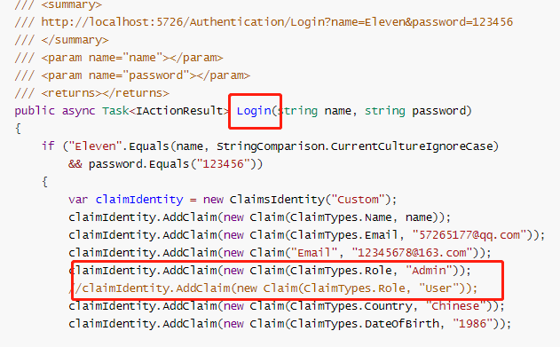

##### 方案授权Policy

PolicyBuilder多API

- RequireRole
- RequireUserName
- RequireClaim
- RequireAssertion
- AddRequirements
- Requirements.Add
- Combine

代码示例：

Program.cs

```C#
        builder.Services.AddAuthorization(options =>
        {
            //自定义Policy规则：AdminPolicy
            options.AddPolicy("AdminPolicy", policyBuilder =>
            {
                policyBuilder.RequireRole("Admin");
            });//等价于  Roles=Admin
            
            
            //自定义Policy规则：MutiPolicy
            options.AddPolicy("MutiPolicy", policyBuilder =>
            {
                policyBuilder.RequireRole("Admin")//都属于框架封装好的
                .RequireUserName("Eleven")//Role  UserName都是最常用的
                .RequireClaim(ClaimTypes.Country)//只要求有Country属性
                .RequireAssertion(context =>//可以灵活的扩展规则--cliam之外其他信息也可以IP等
                {
                    return context.User.HasClaim(c => c.Type == ClaimTypes.Email)
                    && context.User.Claims.First(c => c.Type == ClaimTypes.Email).Value.Equals("57265177@qq.com");
                })
                .RequireAssertion(context =>//ClaimTypes和字符串的区别
                {
                    return context.User.HasClaim(c => c.Type == "Email")
                    && context.User.Claims.First(c => c.Type == "Email").Value.Equals("12345678@163.com");
                })
                .AddRequirements(new SingleEmailRequirement("@qq.com"));
                //policyBuilder.Requirements.Add(new SingleEmailRequirement("@qq.com"));
                //policyBuilder.Combine(new AuthorizationPolicyBuilder().AddRequirements(new SingleEmailRequirement("@qq.com")).Build());
            });
        });
```

Controller.cs

```C#
  		/// <summary>
        /// 方案授权
        /// http://localhost:5726/Authentication/InfoWithPolicy
        /// </summary>
        /// <returns></returns>
        //[Authorize(Policy = "AdminPolicy", AuthenticationSchemes = CookieAuthenticationDefaults.AuthenticationScheme)]//等价于Roles = "Admin"
        [Authorize(Policy = "MutiPolicy", AuthenticationSchemes = CookieAuthenticationDefaults.AuthenticationScheme)]
        public IActionResult InfoWithPolicy()
        {
            this._logger.LogWarning("This is Authentication-InfoWithPolicy 1");
            return View();
        }

```

##### 动态检测授权

Requirement扩展

- 同时实现接口+继承父类： AuthorizationHandler<T>, IAuthorizationRequirement。

  SingleEmailRequirement.cs

  ```C#
      public class SingleEmailRequirement : AuthorizationHandler<SingleEmailRequirement>, IAuthorizationRequirement
      {
          public SingleEmailRequirement(string requiredName)
          {
              if (requiredName == null)
              {
                  throw new ArgumentNullException(nameof(requiredName));
              }
  
              RequiredName = requiredName ?? "@qq.com";
          }
          /// <summary>
          /// 邮件域名，默认@qq.com
          /// </summary>
          public string RequiredName { get; }
  
          protected override Task HandleRequirementAsync(AuthorizationHandlerContext context, SingleEmailRequirement requirement)
          {
              if (context.User != null && context.User.HasClaim(c => c.Type == ClaimTypes.Email))
              {
                  var emailCliamList = context.User.FindAll(c => c.Type == ClaimTypes.Email);//支持多Scheme
                  if (emailCliamList.Any(c => c.Value.EndsWith(RequiredName, StringComparison.OrdinalIgnoreCase)))//数据库校验--Redis校验
                  {
                      context.Succeed(requirement);
                  }
                  else
                  {
                      //context.Fail();//失败不管
                  }
              }
              return Task.CompletedTask;
          }
  
          public override string ToString()
          {
              return $"{nameof(SingleEmailRequirement)}:Requires a user email end with {RequiredName}";
          }
      }
  ```

  Program.cs

  ```C#
  //可直接使用，无需IOC注册
  builder.Services.AddAuthorization(options =>
  {
      options.AddPolicy("MutiPolicy", policyBuilder =>
      {
          policyBuilder.Requirements.Add(new SingleEmailRequirement("@qq.com"));
      });
  });
  ```

  

- 先实现接口IAuthorizationRequirement，然后继承父类AuthorizationHandler<T>

  DateOfBirthRequirement.cs

  ```C#
      public class DateOfBirthRequirement : IAuthorizationRequirement
      {
      }
  
      public class DateOfBirthRequirementHandler : AuthorizationHandler<DateOfBirthRequirement>
      {
          //支持IOC注入
  
          protected override Task HandleRequirementAsync(AuthorizationHandlerContext context, DateOfBirthRequirement requirement)
          {
              if (context.User != null && context.User.HasClaim(c => c.Type == ClaimTypes.DateOfBirth))
              {
                  context.Succeed(requirement);//也可以比较具体规则
              }
              else
              {
                  //context.Fail();
              }
              return Task.CompletedTask;
          }
      }
  ```

  Program.cs

  ```C#
  //接口和父类分开，就得IOC注入
  builder.Services.AddSingleton<IAuthorizationHandler, CountryRequirementHandler>();
  builder.Services.AddAuthorization(options =>
  {
      options.AddPolicy("MutiPolicy", policyBuilder =>
      {
          policyBuilder.Requirements.Add(new DateOfBirthRequirement());
      });
  });
  ```

  

- 或条件

  DoubleEmailRequirement.cs

  ```C#
      /// <summary>
      /// 两种邮箱都可以,二选一
      /// </summary>
      public class DoubleEmailRequirement : IAuthorizationRequirement
      {
      }
  
      public class QQMailHandler : AuthorizationHandler<DoubleEmailRequirement>
      {
          protected override Task HandleRequirementAsync(AuthorizationHandlerContext context, DoubleEmailRequirement requirement)
          {
              if (context.User != null && context.User.HasClaim(c => c.Type == ClaimTypes.Email))
              {
                  var emailCliamList = context.User.FindAll(c => c.Type == ClaimTypes.Email);//支持多Scheme
                  if (emailCliamList.Any(c => c.Value.EndsWith("@qq.com", StringComparison.OrdinalIgnoreCase)))
                  {
                      context.Succeed(requirement);
                  }
                  else
                  {
                      //context.Fail();//不设置失败 交给其他处理
                  }
              }
              return Task.CompletedTask;
          }
      }
  
      public class ZhaoxiMailHandler : AuthorizationHandler<DoubleEmailRequirement>
      {
          protected override Task HandleRequirementAsync(AuthorizationHandlerContext context, DoubleEmailRequirement requirement)
          {
              if (context.User != null && context.User.HasClaim(c => c.Type == ClaimTypes.Email))
              {
                  var emailCliamList = context.User.FindAll(c => c.Type == ClaimTypes.Email);//支持多Scheme
                  if (emailCliamList.Any(c => c.Value.EndsWith("@ZhaoxiEdu.Net", StringComparison.OrdinalIgnoreCase)))
                  {
                      context.Succeed(requirement);
                  }
                  else
                  {
                      //context.Fail();//不设置失败 交给其他处理
                  }
              }
              return Task.CompletedTask;
          }
      }
  ```

  Program.cs

  ```C#
  //接口和父类分开，就得IOC注入
  builder.Services.AddSingleton<IAuthorizationHandler, ZhaoxiMailHandler>();
  builder.Services.AddSingleton<IAuthorizationHandler, QQMailHandler>();
  builder.Services.AddAuthorization(options =>
  {
      options.AddPolicy("MutiPolicy", policyBuilder =>
      {
          policyBuilder.Requirements.Add(new DoubleEmailRequirement());
      });
  });
  ```

##### 多Scheme授权

- 多个Role是并列关系，多个Policy会报错
- 单个的Authorize声明，Policy和Role需要同时满足
- 多Scheme时，信息合集满足约束就行
- 多Policy同时满足---标记多个Authorize特性
- 多Policy的或关系？---只能多Requirement

>例如：
>
>- 指定鉴权策略为Cookie
>  [Authorize(AuthenticationSchemes = "Cookies")]  
>
>- 指定鉴权策略为Cookie，且满足角色授权Roles为"Admin"
>  [Authorize(AuthenticationSchemes = "Cookies", Roles = "Admin")]
>
>- 指定鉴权策略为Cookie，且满足角色授权Roles为"Admin" 或者 "User"
>  [Authorize(AuthenticationSchemes = "Cookies", Roles = "Admin,User")]
>
>- 指定鉴权策略为Cookie，且满足授权策略"AdminPolicy"
>  [Authorize(AuthenticationSchemes = "Cookies", Policy = "AdminPolicy")]
>
>- 错误，不能指定多个授权策略
>  [Authorize(AuthenticationSchemes = "Cookies", Policy = "AdminPolicy,UserPolicy")]
>
>- 指定鉴权策略为Cookie，且满足角色授权Roles为"Admin"，且满足授权策略"AdminPolicy"
>  [Authorize(AuthenticationSchemes = "Cookies", Roles = "Admin", Policy = "AdminPolicy")]
>
>- 指定鉴权策略为Cookie,UrlTokenScheme,信息合集满足约束条件
>  [Authorize(AuthenticationSchemes = "Cookies,UrlTokenScheme", Roles = "User", Policy = "QQEmail")]
>
>- 多Policy同时满足---标记多个Authorize特性
>  即鉴权策略为Cookie需要满足角色授权Roles为"Admin" 或者 "User"，且满足授权策略"AdminPolicy"
>   同时
>   鉴权策略为UrlTokenScheme需要满足角色授权Roles为"Admin" 或者 "User"，且满足授权策略"UserPolicy"
>   [Authorize(AuthenticationSchemes = "Cookies", Policy = "MutiPolicy", Roles = "Admin,User")]
>   [Authorize(AuthenticationSchemes = "UrlTokenScheme", Policy = "UserPolicy", Roles = "Admin,User")]

参考资料：

- [ASP.NET Core 之 Identity 入门（一）](https://www.cnblogs.com/savorboard/p/aspnetcore-identity.html)
- [ASP.NET Core 之 Identity 入门（二）](https://www.cnblogs.com/savorboard/p/aspnetcore-identity2.html)

#### JWT鉴权授权

##### Token起源

- **Cookie/Session阶段**

  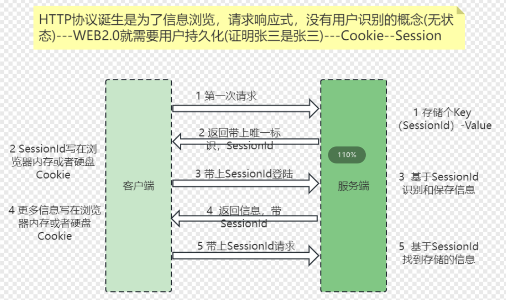

- **Session共享阶段---Redis**

  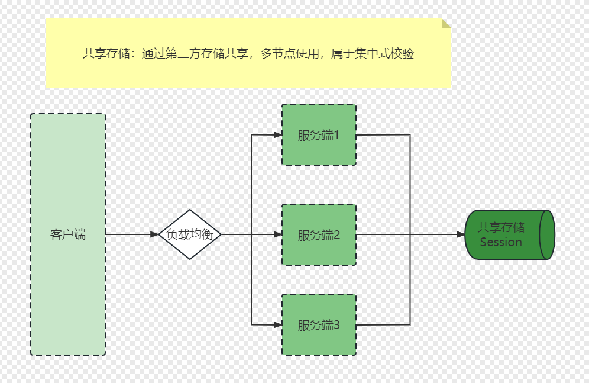

- **分布式的去中心化阶段---Token**

  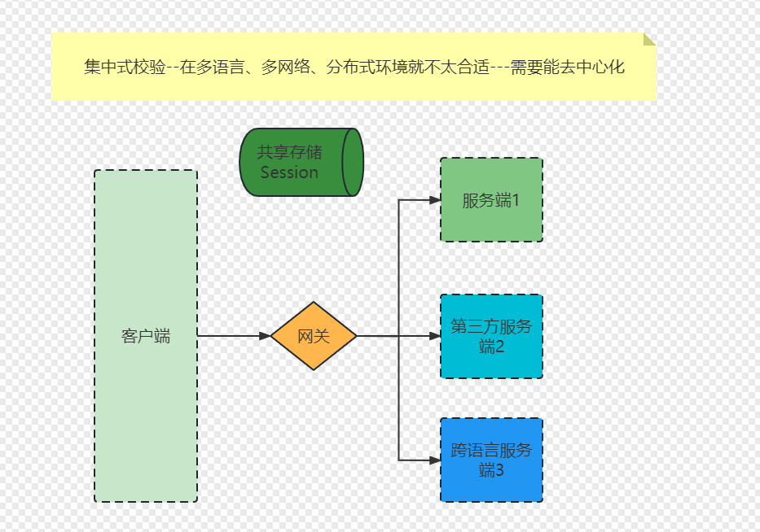

  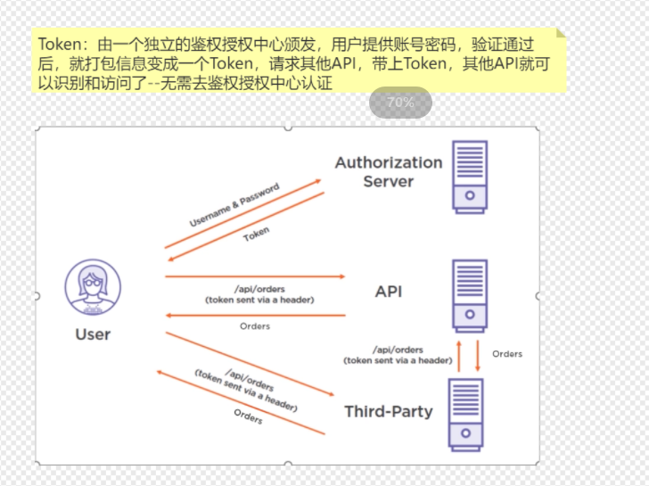

##### 加密算法

- HS256对称可逆加密算法：双方之间仅共享一个 密钥。由于使用相同的密钥生成签名和验证签名, 因此必须注意确保密钥不被泄密---加密速度快，字符串短点，性能高。
- RS256非对称可逆加密算法：使用公共/私钥对。标识提供方采用私钥生成签名, 使用方获取公钥以验证签名。公钥通常通过一个元数据URL提供----安全性好，但性能低。
- HMACSHA256不可逆加密算法：将不同长度字符串转成固定长度且唯一的字符串，不可逆向解密---通常用来做签名防篡改

##### JWT令牌结构

> - Header头--{ “alg”: “HS256”, “typ”: “JWT”}—描述下使用的加密算法
> - Payload有效载荷---没加密，只是序列化，任何人都可以轻松读取(前端轻松可用)
> - Signature签名---防止抵赖，防止篡改

签名原理：

- 颁发时：账号密码验证通过后，获取用户信息---然后先base64UrlEncode(header) +“.”+ base64UrlEncode(payload), 得到一个字符串xx.yyyyy
- 用HMACSHA256不可逆算法对xx.yyyyy加密，(还有个key参数，就用是公开的解密钥)，得到固定长度字符串b---(目的是把内容变短)
- 然后用加密钥把字符串b加密，得到字符串zzzz，然后JWT就是xx.yyyyy.zzzz
- 客户端验证时：先拿到公钥，对zzzz进行解密得到字符串c---能解开证明秘钥是对的，zzzz来自服务器
- 然后对xx.yyyyy进行HMACSHA256加密，得到字符串d，比对字符串c和d---相同则证明Token信息没有被篡改
- 至于有效期啥的，解析后再根据业务要求进阶检测：有效期、其他信息等等

##### JWT鉴权

##### Swagger扩展—支持Token参数传递

### Stream读写问题

> Http的响应应该是先Header然后再Body，写完之后不能随意改动（这是框架限制的）。
>
> 因为请求响应已完成，里面的Content-Length已固定，所以不能改。
>
> 故，中间件的扩展其实是有限制的，不能随意读取和修改请求内容，也不能随意读取和修改响应内容。如果想修改则需进行特殊处理（参考如下代码）

#### Stream读取问题

```C#
public class StreamReadMiddleware
{
    private readonly RequestDelegate _next;
    private readonly ILogger<StreamReadMiddleware> _logger;

    public StreamReadMiddleware(RequestDelegate next, ILogger<StreamReadMiddleware> logger)
    {
        this._next = next;
        this._logger = logger;
    }

    public async Task InvokeAsync(HttpContext context)
    {
        #region 简单版本--错误的
        //#region Request
        //var requestReader = new StreamReader(context.Request.Body);
        //var requestContent = requestReader.ReadToEnd();
        //Console.WriteLine($"Request Body: {requestContent}");
        //#endregion

        //await _next(context);

        //#region Response
        //var responseReader = new StreamReader(context.Response.Body);
        //var responseContent = responseReader.ReadToEnd();
        //#endregion
        #endregion

        #region 正确的
        {
            //Request读取
            context.Request.EnableBuffering();//允许重复读取
            var reader = new StreamReader(context.Request.Body);
            var content = await reader.ReadToEndAsync();//异步
            Console.WriteLine($"StreamRead Request Body: {content}");
            context.Request.Body.Position = 0;//重置，后续才能正确读取
        }

        {
            //Response读取
            var responseStream = context.Response.Body;
            using (var newStream = new MemoryStream())
            {
                context.Response.Body = newStream;//将Body换成新的流，空的，，前面的是responseStream
                await _next(context);

                newStream.Position = 0;
                var responseReader = new StreamReader(newStream);
                var responseContent = await responseReader.ReadToEndAsync();
                Console.WriteLine($"Response Body: {responseContent}");

                newStream.Position = 0;
                await newStream.CopyToAsync(responseStream);
                context.Response.Body = responseStream;
            }
        }
        #endregion
    }
}
```

#### Stream写入问题

```C#
    public class StreamWriteMiddleware
    {
        private readonly RequestDelegate _next;
        private readonly ILogger<StreamWriteMiddleware> _logger;

        public StreamWriteMiddleware(RequestDelegate next, ILogger<StreamWriteMiddleware> logger)
        {
            this._next = next;
            this._logger = logger;
        }
        /// <summary>
        /// http://localhost:5726/Home/Info?name=Eleven
        /// 请求的值改不了，除非用postman请求，body里面传值才行
        /// </summary>
        /// <param name="context"></param>
        /// <returns></returns>
        public async Task InvokeAsync(HttpContext context)
        {
            this._logger.LogWarning($"StreamWriteMiddleware Handle Request: " + context.Request.Path);

            context.Request.EnableBuffering();
            var requestStream = context.Request.Body;
            var responseStream = context.Response.Body;
            try
            {
                using (var newRequest = new MemoryStream())
                {
                    context.Request.Body = newRequest; //替换request流
                    using (var newResponse = new MemoryStream())
                    {
                        context.Response.Body = newResponse;//替换response流
                        using (var reader = new StreamReader(requestStream))
                        {
                            string requestBody = await reader.ReadToEndAsync();//读取原始请求流的内容
                            if (string.IsNullOrEmpty(requestBody))//为空直接走下一环节
                            {
                                await _next.Invoke(context);
                            }
                            else
                            {
                                using (var writer = new StreamWriter(newRequest))
                                {
                                    await writer.WriteAsync(requestBody.ToUpper());//直接改成大写
                                    await writer.FlushAsync();
                                    newRequest.Position = 0;
                                    context.Request.Body = newRequest;
                                    await _next(context);
                                }
                            }
                        }

                        //获取和修改响应
                        string responseBody = null;
                        using (var reader = new StreamReader(newResponse))
                        {
                            newResponse.Position = 0;
                            responseBody = await reader.ReadToEndAsync();
                        }
                        using (var writer = new StreamWriter(responseStream))
                        {
                            await writer.WriteAsync(responseBody.ToLower());//响应全部小写
                            await writer.FlushAsync();
                        }
                    }
                }
            }
            catch (Exception ex)
            {
                this._logger.LogError($" http中间件发生错误: " + ex.ToString());
            }
            finally
            {
                context.Request.Body = requestStream;
                context.Response.Body = responseStream;
            }
        }
    }
```

#### Header读写

```C#
    public class HeaderReadWriteMiddleware
    {
        private readonly RequestDelegate _next;
        private readonly ILogger<HeaderReadWriteMiddleware> _logger;

        public HeaderReadWriteMiddleware(RequestDelegate next, ILogger<HeaderReadWriteMiddleware> logger)
        {
            this._next = next;
            this._logger = logger;
        }

        public async Task InvokeAsync(HttpContext context)
        {
            //await context.Response.WriteAsync("This is Hello World 1 start");
            //context.Response.OnStarting(state =>
            //{
            //    var httpContext = (HttpContext)state;
            //    httpContext.Response.Headers.Add("middleware", "HeaderReadMiddleware12345");
            //    Console.WriteLine(httpContext.Response.StatusCode);
            //    return Task.CompletedTask;
            //}, context);

            context.Response.OnStarting(async state =>
            {
                var httpContext = (HttpContext)state;
                httpContext.Response.Headers.Add("middlewareStarting", "HeaderReadWriteMiddleware12345");
                //await httpContext.Response.WriteAsync("This is Eleven"); //写不进去，带上中间件，写入时才发生的
                await Task.CompletedTask;
            }, context);

            context.Response.OnCompleted(async state =>
            {
                var httpContext = (HttpContext)state;
                Console.WriteLine($"请求结果StatusCode={httpContext.Response.StatusCode}");
                httpContext.Response.Headers.Add("middlewareComplated", "HeaderReadWriteMiddleware12345222");//写不进去了，不生效
                //主要是用来做资源释放，或者通知
                await Task.CompletedTask;
            }, context);

            await this._next.Invoke(context);
            //await context.Response.WriteAsync("This is Hello World 1   end");

        }
    }
```

##### 典型应用

> 页面静态化架构： 
>
> - 可以在请求处理过程中，通过中间件扩展，能读取到请求的响应
> - 那就可以把响应的html文件保存在本地硬盘---就等同于缓存
> - 下次请求时，可以直接读取这个文件，不用去访问程序+数据库 

```C#
    /// <summary>
    /// 支持在返回HTML时，将返回的Stream保存到指定目录
    /// </summary>
    public class StaticPageMiddleware
    {
        private readonly RequestDelegate _next;
        private string _directoryPath = null;
        private bool _supportDelete = false;
        private bool _supportWarmup = false;

        public StaticPageMiddleware(RequestDelegate next, string directoryPath, bool supportDelete, bool supportWarmup)
        {
            this._next = next;
            this._directoryPath = directoryPath;
            this._supportDelete = supportDelete;
            this._supportWarmup = supportWarmup;
        }
        /// <summary>
        /// 任意HTTP请求，都要经过这个方法
        /// 
        /// 如何抓到响应，并保存成HTML静态页
        /// </summary>
        /// <param name="context"></param>
        /// <returns></returns>
        public async Task InvokeAsync(HttpContext context)
        {
            #region Delete &Clear
            if (context.Request.IsAjaxRequest())
            {
                await _next(context);
            }
            else if (this._supportDelete && "Delete".Equals(context.Request.Query["ActionHeader"]))
            {
                this.DeleteHmtl(context.Request.Path.Value);
                context.Response.StatusCode = 200;
            }
            else if (this._supportWarmup && "ClearAll".Equals(context.Request.Query["ActionHeader"]))
            {
                this.ClearDirectory(10);//考虑数据量
                context.Response.StatusCode = 200;
            }
            #endregion

            else if (context.Request.Path.Value.StartsWith("/item/"))//规则支持自定义
            {
                Console.WriteLine($"This is StaticPageMiddleware InvokeAsync {context.Request.Path.Value}");

                #region context.Response.Body
                var originalStream = context.Response.Body;
                using (var copyStream = new MemoryStream())
                {
                    context.Response.Body = copyStream;
                    await _next(context);//后续的常规流程，正常请求响应

                    copyStream.Position = 0;
                    var reader = new StreamReader(copyStream);
                    var content = await reader.ReadToEndAsync();
                    string url = context.Request.Path.Value;

                    this.SaveHtml(url, content);

                    copyStream.Position = 0;
                    await copyStream.CopyToAsync(originalStream);
                    context.Response.Body = originalStream;
                }
                #endregion
            }
            else
            {
                await _next(context);
            }
        }

        private void SaveHtml(string url, string html)
        {
            try
            {
                if (string.IsNullOrWhiteSpace(html))
                    return;
                if (!url.EndsWith(".html"))
                    return;

                if (Directory.Exists(_directoryPath) == false)
                    Directory.CreateDirectory(_directoryPath);

                var totalPath = Path.Combine(_directoryPath, url.Split("/").Last());
                File.WriteAllText(totalPath, html);//直接覆盖
            }
            catch (Exception ex)
            {
                Console.WriteLine(ex.Message);
            }
        }

        /// <summary>
        /// 删除某个页面
        /// </summary>
        /// <param name="url"></param>
        /// <param name="index"></param>
        private void DeleteHmtl(string url)
        {
            try
            {
                if (!url.EndsWith(".html"))
                    return;
                var totalPath = Path.Combine(_directoryPath, url.Split("/").Last());
                File.Delete(totalPath);//直接删除
            }
            catch (Exception ex)
            {
                Console.WriteLine($"Delete {url} 异常，{ex.Message}");
            }
        }

        /// <summary>
        /// 清理文件，支持重试
        /// </summary>
        /// <param name="index">最多重试次数</param>
        private void ClearDirectory(int index)
        {
            if (index > 0)
            {
                try
                {
                    var files = Directory.GetFiles(_directoryPath);
                    foreach (var file in files)
                    {
                        File.Delete(file);
                    }
                }
                catch (Exception ex)
                {
                    Console.WriteLine($"ClearDirectory failed {ex.Message}");
                    ClearDirectory(index--);
                }
            }
        }
    }

    /// <summary>
    /// 扩展中间件
    /// </summary>
    public static class StaticPageMiddlewareExtensions
    {
        /// <summary>
        /// 
        /// </summary>
        /// <param name="app"></param>
        /// <param name="directoryPath">文件写入地址,文件夹目录</param>
        /// <param name="supportDelete">是否支持删除</param>
        /// <param name="supportClear">是否支持全量删除</param>
        /// <returns></returns>
        public static IApplicationBuilder UseStaticPage(this IApplicationBuilder app, string directoryPath, bool supportDelete, bool supportClear)
        {
            return app.UseMiddleware<StaticPageMiddleware>(directoryPath, supportDelete, supportClear);
        }
    }
```

### Kestrel服务

#### http响应流程

- 浏览器输入地址---DNS解析---IP:Port---发送请求报文，其实就是固定格式的字符串
- Nginx/IIS/Kestrel监听端口---解析Http请求报文，得到HttpContext
- 将HttpContext交给HttpPipeline执行，把各种信息写入response对象---服务器再把内容转成响应报文，回发浏览器
- 浏览器接受响应报文，解析，渲染

#### kestrel使用建议

如果服务只针对系统内部，不针对外开放，直接使用kestrel服务，足够快。

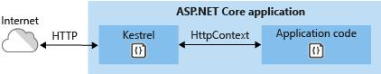

如果服务对外开放，针对Windows系统建议使用IIS+Kestrel；针对Linux系统，建议使用Nginx+Kestrel。

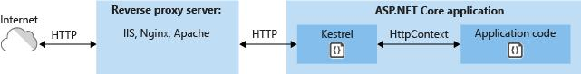


*Kestrel不是功能齐全的Web服务器。 但这就是使它快速的原因。建议不要在生产环境中将Kestrel作为独立的Web服务器运行。 建议在IIS，Nginx，Apache等功能齐全的Web服务器之后运行它。在这种情况下，Web服务器充当反向代理服务器。反向代理服务器从Internet获取HTTP请求，并将其以接收方式直接传递给Kestrel服务器。例如：IIS可以在将请求传递给Kestrel之前接受HTTP请求并执行一些有用的处理，例如日志记录，请求过滤，URL重写。*

#### Kestrel监听配置

- UseUrls
- 环境变量
- 命令行启动
- launchSettings.json-->applicationUrl项
- UseKestrel(除了多端口配置外，还可以配置其他Kestrel属性)

参考资料：

[ASP.NET Core中配置监听URLs的五种方式](https://www.cnblogs.com/lwqlun/p/12727098.html)

[为 ASP.NET Core Kestrel Web 服务器配置选项 | Microsoft Learn](https://learn.microsoft.com/zh-cn/aspnet/core/fundamentals/servers/kestrel/options?view=aspnetcore-7.0)


[.NET Core：处理全局异常 - .NET开发菜鸟 - 博客园 (cnblogs.com)](https://www.cnblogs.com/dotnet261010/p/13193124.html)


