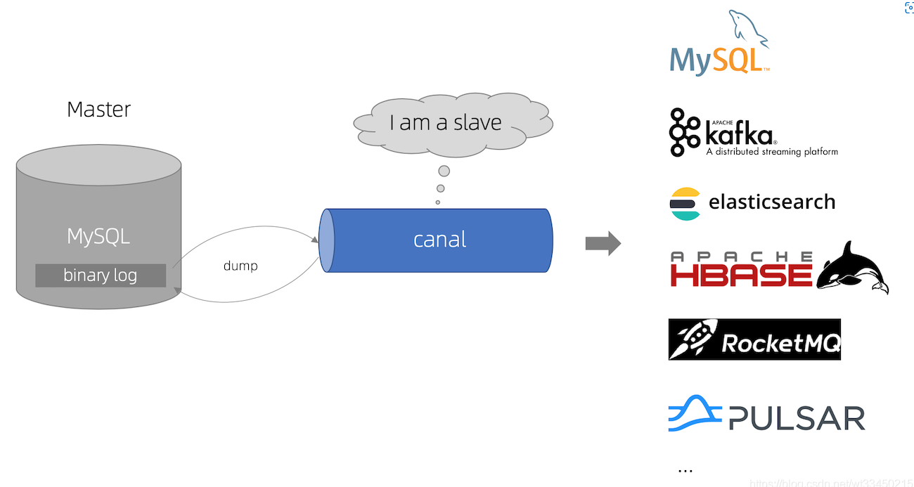
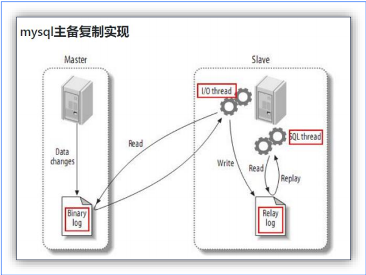
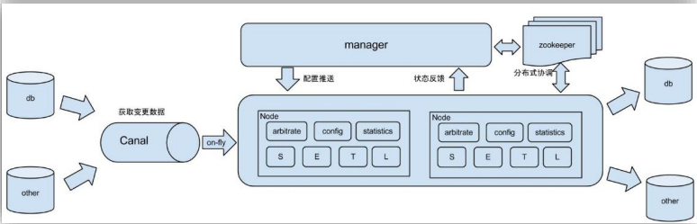
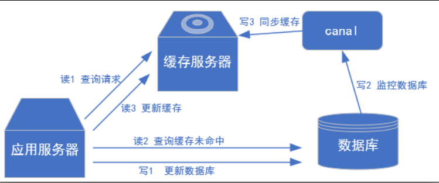
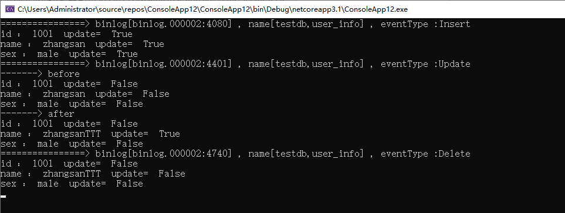

### 1. Canal入门

#### 1.1 什么是 Canal

​	阿里巴巴 B2B 公司，因为业务的特性，卖家主要集中在国内，买家主要集中在国外，所以衍生出了同步杭州和美国异地机房的需求，从 2010 年开始，阿里系公司开始逐步的尝试基于数据库的日志解析，获取增量变更进行同步，由此衍生出了增量订阅&消费的业务。Canal 是用 Java 开发的基于数据库增量日志解析，提供增量数据订阅&消费的中间件。

​	目前。Canal 主要支持了 MySQL 的 Binlog 解析，解析完成后才利用 Canal Client 来处理获得的相关数据。（数据库同步需要阿里的 Otter 中间件，基于 Canal）。

这里我们可以简单地把canal理解为一个用来同步增量数据的一个工具：



#### 1.2 MySQL的Binlog

##### 1.2.1 什么是 Binlog

​	MySQL 的二进制日志可以说 MySQL 最重要的日志了，它记录了所有的 DDL 和 DML(除了数据查询语句)语句，以事件形式记录，还包含语句所执行的消耗的时间，MySQL 的二进制日志是事务安全型的。

一般来说开启二进制日志大概会有 1%的性能损耗。二进制有两个最重要的使用场景: 

- MySQL Replication 在 Master 端开启 Binlog，Master 把它的二进制日志传递给 Slaves来达到 Master-Slave 数据一致的目的。
- 自然就是数据恢复了，通过使用 MySQL Binlog 工具来使恢复数据。

二进制日志包括两类文件：

- 二进制日志索引文件（文件名后缀为.index）用于记录所有的二进制文件
- 二进制日志文件（文件名后缀为.00000）记录数据库所有的 DDL 和 DML(除了数据查询语句)语句事件。

##### 1.2.2 Binlog 的分类

MySQL Binlog 的格式有三种，分别是 STATEMENT,MIXED,ROW。在配置文件中可以选择配置 binlog_format= statement/mixed/row。三种格式的区别：

- statement：语句级，binlog 会记录每次一执行写操作的语句。相对 row 模式节省空间，但是可能产生不一致性，比如“update tt set create_date=now()”，如果用 binlog 日志进行恢复，由于执行时间不同可能产生的数据就不同。

  优点：节省空间。

  缺点：有可能造成数据不一致。

- row：行级， binlog 会记录每次操作后每行记录的变化。

  优点：保持数据的绝对一致性。因为不管 sql 是什么，引用了什么函数，他只记录执行后的效果。

  缺点：占用较大空间。

- mixed：statement 的升级版，一定程度上解决了，因为一些情况而造成的 statement模式不一致问题，默认还是 statement，在某些情况下譬如：

  - 当函数中包含 UUID() 时；

  - 包含AUTO_INCREMENT 字段的表被更新时；

  - 执行 INSERT DELAYED 语句时；

  - 用 UDF 时；会按照ROW 的方式进行处理

  优点：节省空间，同时兼顾了一定的一致性。

  缺点：还有些极个别情况依旧会造成不一致，另外 statement 和 mixed 对于需要对binlog 的监控的情况都不方便。

综合上面对比，Canal 想做监控分析，选择 row 格式比较合适。

#### 1.3 Canal 的工作原理

##### 1.3.1 MySQL 主从复制过程

1）Master 主库将改变记录，写到二进制日志(Binary Log)中； 

2）Slave 从库向 MySQL Master 发送 dump 协议，将 Master 主库的 binary log events 拷贝到它的中继日志(relay log)； 

3）Slave 从库读取并重做中继日志中的事件，将改变的数据同步到自己的数据库。



##### 1.3.2 Canal 的工作原理

很简单，就是把自己伪装成 Slave，假装从 Master 复制数据。

##### 1.4 使用场景

- 原始场景： 阿里 Otter 中间件的一部分，Otter 是阿里用于进行异地数据库之间的同步框架，Canal 是其中一部分



- 常见场景 1：更新缓存



- 常见场景 2：抓取业务表的新增变化数据，用于制作实时统计（例如：将数据同步到ES）

### 2. Canal安装

MySQL数据准备

```sql
#创建表
CREATE TABLE user_info(
`id` VARCHAR(255),
`name` VARCHAR(255),
`sex` VARCHAR(255)
);
#创建同步账号
create user canal@'%' IDENTIFIED by 'canal';
GRANT SELECT, REPLICATION SLAVE, REPLICATION CLIENT,SUPER ON *.* TO 'canal'@'%';
FLUSH PRIVILEGES;
```

运行Canal

```shell
#拉取镜像
docker pull canal/canal-server:latest
#运行Canal
docker run -d --name=canal-server \
-p 11110:11110 -p 11111:11111 -p 11112:11112 -p 9100:9100 -m 1024m \
-e canal.instance.master.address=192.168.200.104:3306 \
-e canal.instance.dbUsername=canal \
-e canal.instance.dbPassword=canal \
-e canal.instance.connectionCharset=UTF-8 \
-e canal.instance.tsdb.enable=true \
-e canal.instance.gtidon=false \
-e canal.instance.filter.regex=.*\\\..* \
canal/canal-server
```

### 3. 接入.NetCore

引入依赖`CanalSharp.Client`

- 建立连接

  ```C#
          /// <summary>
          /// 获取canal连接
          /// </summary>
          /// <returns></returns>
          private static ICanalConnector GetCanalConnector()
          {
              //canal 配置的 destination，默认为 example
              var destination = "example";
              //创建一个简单CanalClient连接对象（此对象不支持集群）传入参数分别为 canal地址、端口、destination、用户名、密码
              var connector = CanalConnectors.NewSingleConnector("192.168.200.104", 11111, destination, "canal", "canal");
              //连接 Canal
              connector.Connect();
              //订阅，同时传入 Filter。Filter是一种过滤规则，通过该规则的表数据变更才会传递过来
              //允许所有数据 .*\\..*
              //允许某个库数据 库名\\..*
              //允许某些表 库名.表名,库名.表名
              connector.Subscribe(".*\\..*");
  
              return connector;
          }
  ```

- 获取数据

  ```C#
          /// <summary>
          /// 获取数据
          /// </summary>
          public static void ProcessTask()
          {
              var connector = GetCanalConnector();
  
              while (true)
              {
                  //获取数据 1024表示数据大小 单位为字节
                  var message = connector.Get(1024);
                  //批次id 可用于回滚
                  var batchId = message.Id;
                  if (batchId == -1 || message.Entries.Count <= 0)
                  {
                      Thread.Sleep(300);
                      continue;
                  }
  
                  PrintEntry(message.Entries);
              }
          }
  ```

- 输出数据

  ```C#
          /// <summary>
          /// 输出数据
          /// </summary>
          /// <param name="entrys">一个entry表示一个数据库变更</param>
          private static void PrintEntry(List<Entry> entrys)
          {
              foreach (var entry in entrys)
              {
                  if (entry.EntryType == EntryType.Transactionbegin || entry.EntryType == EntryType.Transactionend)
                  {
                      continue;
                  }
  
                  RowChange rowChange = null;
  
                  try
                  {
                      //获取行变更
                      rowChange = RowChange.Parser.ParseFrom(entry.StoreValue);
                  }
                  catch (Exception)
                  {
  
                  }
  
                  if (rowChange != null)
                  {
                      //变更类型 insert/update/delete 等等
                      EventType eventType = rowChange.EventType;
                      //输出binlog信息 表名 数据库名 变更类型
                      Console.WriteLine(
                          $"================> binlog[{entry.Header.LogfileName}:{entry.Header.LogfileOffset}] , name[{entry.Header.SchemaName},{entry.Header.TableName}] , eventType :{eventType}");
  
                      //输出 insert/update/delete 变更类型列数据
                      foreach (var rowData in rowChange.RowDatas)
                      {
                          if (eventType == EventType.Delete)
                          {
                              PrintColumn(rowData.BeforeColumns.ToList());
                          }
                          else if (eventType == EventType.Insert)
                          {
                              PrintColumn(rowData.AfterColumns.ToList());
                          }
                          else
                          {
                              Console.WriteLine("-------> before");
                              PrintColumn(rowData.BeforeColumns.ToList());
                              Console.WriteLine("-------> after");
                              PrintColumn(rowData.AfterColumns.ToList());
                          }
                      }
                  }
  
              }
          }
  
          /// <summary>
          /// 输出每个列的详细数据
          /// </summary>
          /// <param name="columns"></param>
          private static void PrintColumn(List<Column> columns)
          {
              foreach (var column in columns)
              {
                  // 把数据
                  //输出列名 列值 是否变更
                  Console.WriteLine($"{column.Name} ： {column.Value}  update=  {column.Updated}");
              }
          }
  ```

- 运行测试

  执行以下SQL，观察控制台输出

  ```sql
  INSERT INTO user_info VALUES('1001','zhangsan','male');
  update user_info set name='zhangsanTTT' where id='1001';
  delete from user_info where id='1001';
  ```

  


