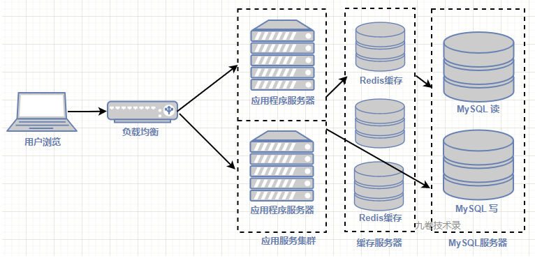
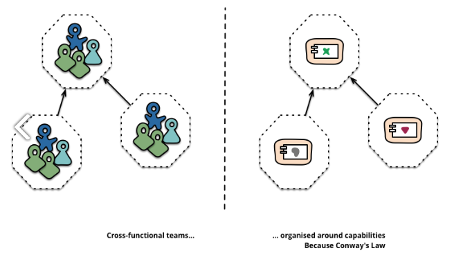
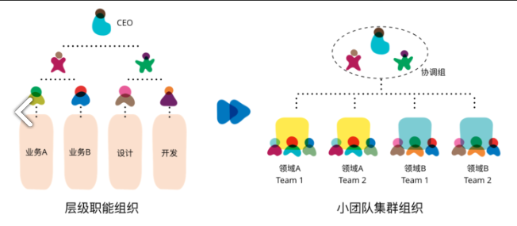

> 原文连接：微服务架构思考系列：https://www.cnblogs.com/jiujuan/p/17307285.html

# 从单体架构到微服务架构的演进历程

## 单体架构

### 什么时候用单体架构

在创业初期或项目开始时，项目整体功能比较少，开发人员也少，且项目需要用最少时间开发出来，用 MVP 方式快速进行市场验证是否可行，这时候就可以用单体架构进行快速开发。

###  单体架构设计举例-电商应用

**功能分析：**

拿淘宝网举例的话，当然是最早期的淘宝网 - -！，它最简单的 3 个功能：商品展示，用户下单，订单中心。这三个功能构成一个最简单的电商业务流程。

展示给用户看的商品页面以及用户购买商品的操作功能。那我们需要对用户和订单进行管理，怎么办？

就需要一个管理后台来对用户订单进行管理。如此简单分析过后，就知道了电商网站应用功能。

#### 应用功能架构图：

#### 程序架构设计：

这时候我们开发的单体应用程序，部署在应用服务器上。程序架构可能采用 MVC 这种程序架构模式。

> 当然也有可能什么架构都不用，直接撸代码了，所有的程序都混合在一起，这就是所谓的“大泥球”单体，这是一种糟糕的开发方式。

NET里最常用的 MVC 框架

- 划分模块

  比如根据上面电商功能架构图，在程序里可以把电商功能划分为相对应的模块，如用户模块，订单模块，商品模块。

  这时程序里不管是前台功能，后台功能都有这些模块。

  

  （应用程序模块)

  这时候应用程序模块都在一个大的单体项目里，前台功能和管理后台共用一套代码。

- 模块块里的功能：比如前台商品模块，就有商品列表，商品详情页等页面功能。
- 程序开发：编写程序时可能应用 MVC 这种程序设计模式来进行程序代码开发。

**程序部署架构图：**

编写的程序代码部署到应用服务器上，用户的所有数据存储到 MySQL 数据库里。

程序和 MySQL 都部署在同一台服务器上。

## 单体架构程序演进

### MySQL 性能瓶颈-缓存

随着项目上线，公司对项目加大力度推广和运营，用户数越来越多。

有一天，用户投诉说，商品详情页面浏览好慢。如是你一番操作猛如虎，发现详情页显示慢，性能瓶颈出现在数据库 MySQL 上，

MySQL 在用户访问高峰时，扛不住那么大的访问量。这时你想到的解决方法，可以用缓存来缓存一部分数据，不必每次都到 MySQL 取数据，

可以用 Redis 来缓存部分商品信息数据。如是，增加一个 Redis 缓存，架构图如下：

### MySQL读写分离

这时候，你也可能想到另外的一种方法：数据的读写分离，减轻对 MySQL 访问压力。

经过上面 2 种措施改进后，商品详情页访问速度开始变快，访问正常了。

但是这种舒服日子没过几个月，又有用户开始反馈页面访问比较慢。

你又一番埋头辛苦分析，发现是单台服务器负载高，单台服务器的性能已经到了极限，它已经承载不了那么多用户的访问。

如是你想，把数据存储和应用程序部署到 2 台服务器上，减轻服务器的负载压力。

### 数据存储和应用程序服务器分离

于是你申请买了一台服务器，把 MySQL 和 Redis 都部署在这台新买的服务器上，让原来那台服务器负载得到缓解。

### 集群-分布式

#### 负载均衡

部署多台应用服务器形成一个应用服务器集群，前面用户通过负载均衡器来进行服务的访问。

比较常用的负载均衡软件有 Nginx、LVS、KeepAlived 等等。

还有硬件负载均衡，比如 F5 等。

部署后，页面访问又恢复了正常。

过了几个月，数据服务器也出现负载过高情况，这时候可以把 Redis 缓存和 MySQL 分离，部署到不同服务器上。

随着数据量增加，把 Redis 部署为分布式缓存。

#### 数据库分离和 Redis 分布式缓存

把 MySQL 和缓存 Redis 部署到不同的服务器上。

随着缓存数据的增多，Redis 也部署为主从模式，然后到 Redis Cluster 集群模式，也就是 Redis 的分布式缓存。

此时数据存储服务器负载得到缓解，访问恢复正常。

由于业务发展太快，用户变得更多，数据库又出现了性能瓶颈，这时可以对数据库进行分库分表

#### 分库分表

为了进一步的降低数据库由于数据量太多，访问太大而造成的瓶颈，可以对数据库进行分库分表，减轻数据库的访问压力。

### 搜索分离

把搜索独立出来，用 Elasticsearch 进行全局搜索处理。

### 分布式文件存储

使用 HDFS 进行分布式文件存储。
对象存储、块存储、文件存储 Ceph。

## 应用程序发展演进

### 应用程序功能变化-硬件发展

上面画的架构图都是后端技术部分，服务端架构从单体到集群再到分布式的演进。

那么前面给用户使用的应用程序呢？也是在变化之中。

比如在《淘宝技术这十年》里的淘宝网的发展变化，刚开始时是一个很简单的 PC 端页面，到后来随着手机普及，移动互联网发展起来，

手机应用就出现了。淘宝 APP 也随之出现。随着国民应用微信逐渐发展壮大，小程序也成为第三种互联网程序应用形式。当然，还有其它终端，比如平板 ipad，自动售货机等等各种终端。

上面是不同硬件出现，程序应用承载出现不同形式。

（多终端用户出现后的架构图）

那么淘宝网的功能呢？当然增加了很多。

还孵化出了多种不同的业务应用，比如天猫，1688，支付宝，聚划算，淘宝旺旺等等很多应用。

在今年 2013.1 再去打开淘宝 APP 看看，里面的功能多到眼花缭乱。

现在的电商系统有哪些子系统，系统里都有啥功能，可以看看我之前发布的[这篇文章](https://www.cnblogs.com/jiujuan/p/14452748.html)。

### 多端程序单体架构

多种终端的出现，当然不是一下子就出来的，都有一个发展过程，只不过到写这篇文章为止，出现了上面说的PC，手机 APP、小程序，平板等多个终端，最常用的还是前面 3 种。

最开始开发程序时，应用程序要适应多个终端，最简单的方式就是拷贝 PC 端的代码到多个终端程序里。按照上面电商最简单业务功能模块实现，多终端应用程序功能架构如下：

（后端功能模块架构图）

上面的三种终端程序应用，还是使用同一个 MySQL 数据库，也及是说订单数据、用户数据等都存储在一个库中。

可能会问，怎么区分订单来自哪一个终端？

可以给订单数据一个类型标识来进行区分，订单是从哪一个终端过来的。

那管理后台呢？

多终端程序可以共用一个管理后台。

> 多终端的后台功能模块都搞起来了，但是这种程序模块架构有什么弊端缺点呢？
>
> 1. 代码重复
> 2. 增加/修改功能复杂：比如说要修改一个订单模块的功能，需要修改 3 个终端的后台代码
> 3. 代码维护复杂：每次维护代码都需要动 3 个后端的代码
>
> 那有没有办法可以改进上面所说的情况？
>
> 能不能把 3 个后端重复模块代码合并为一个，统一向前端提供服务，当然是可以的。怎么做？
>
> 1. 前后端分离 - 把前后端代码进行分离，前端展示操作页面和后端功能模块分离
> 2. 抽象公共模块 - 把多个后端公共模块进行抽象为一个模块，为前端提供统一服务

### 前后端分离，抽象公共模块

页面前后端分离，其实在上面 1.1 小节的单体架构中也可以这样实施前后端分离。

多个终端当然也可以进行前后端分离，这样不用开发多个终端的页面，程序代码进行适配就可以了。前端现在有很多种多终端适配的技术。

后端的多个相同功能模块进行抽象，变成一个共用模块，对外提供服务。

这种方式提供功能服务我想到的有 3 种方式：

页面前后端分离，其实在上面 1.1 小节的单体架构中也可以这样实施前后端分离。

多个终端当然也可以进行前后端分离，这样不用开发多个终端的页面，程序代码进行适配就可以了。前端现在有很多种多终端适配的技术。

后端的多个相同功能模块进行抽象，变成一个共用模块，对外提供服务。

这种方式提供功能服务我想到的有 3 种方式：

#### 第一种：单体结构-函数提供接口

后端还是在一个单体工程下面，但是公共功能抽象为一个函数或对象接口，对外提供服务。

后端其他模块引入这个模块然后调用函数或者对象，完成程序功能开发。

应用程序结构图如下：

#### 第二种：用 Maven 当作一个远程包引入

在 java 里，用 maven 可以引入一个远程包进行使用。我们可以用这种方式引入公共功能包。

在 Go 里，用 module 模块方法引入远程包使用

在NET里，用 Nuget方法引入远程包使用

#### 第三种：RPC 方式调用

这种方式是把应用程序里的公共模块功能变成一个独立的服务，对外提供服务。这个”外“是公司内部的业务可以调用这个服务。公司以外的应用就不可以调用这个服务。

这里也有2种方式，

第一种：只是公共模块独立提供服务，数据库还是共用。

第二种：数据库随着公共模块一起，独立对外提供服务。

我们来讨论第二种情况，既然要作为一个独立的服务存在，它就是自适应自维护的，此时数据库变成独立数据库，跟着它的服务模块一起独立。

此时不仅应用模块进行分离，应用服务器也进行了分离。

这时候就有点微服务的味道了。

## 微服务架构演进

>  单体->SOA->微服务

# 什么是微服务？微服务的优势和劣势

## 什么单体应用

在软件开发早期阶段，大家都在一个应用系统上开发。各个业务模块之间耦合也比较紧密。软件发布也是整体发布，或者对软件进行打包发布和部署，比如java可以打包成war部署。测试也很容易，因为代码都在一起，基本不需要引用外部的关联服务。

在软件开发早期，这种软件开发模式能适应业务的发展，软件应用也可以正常运行。

如果你的业务发展良好，客户需求会变得越来越多，软件功能数也会随着客户的需求变多而变多。为了实现这些功能，你必须添加很多代码。而随着业务进一步发展，代码量势必也会越增越多。有可能 2 到 3年后，软件代码量会变得非常巨大。那时软件就会变成一个非常庞大且复杂的单体应用。软件里面的功能多，代码错综复杂。

**此时可能出现的问题：**

- 打包编译会耗时很久，导致发布也很耗时。
- 代码可维护性变差，因为代码量大，逻辑复杂，只有少数老员工能全部理解。代码腐化严重。
- 修改bug和增加新功能会变得困难，可能牵一发而动全身。
- 由于上面的原因，软件扩展变得困难
- 软件可用性风险增加。可能一个bug导致整个软件不可用。

为了解决上面的这些问题，怎么办？ 俗话说：“大事化小”，一个字，拆！

## 应用拆分

第一步可能想到的就是拆分应用。

把一个像“大泥球 ”一样的单体应用可以按照业务功能进行拆分。比如电商应用，可能拆分为商品应用，订单应用，用户应用，商铺应用等等相对比较小的应用功能。

业务规模进一步发展，你可能把上面的应用做进一步拆分，变成更小的应用，以服务的形式对外提供应用服务。应用慢慢的拆分为了比较小的服务 - 微服务。

随着软件架构的调整，能解决上面遇到的所有问题吗？大部分可以解决。
服务稳定的运行了一段时间，你也过了一段舒服的日子。但是在使用微服务的过程中，问题也逐渐暴露出来，微服务会带来什么问题呢？下面对微服务进行一些思考。

## 微服务的思考

### 什么是微服务

维基百科定义：

> 微服务 (Microservices) 是一种软件架构风格，它是以专注于单一责任与功能的小型功能区块 (Small Building Blocks) 为基础，利用模块化的方式组合出复杂的大型应用程序，各功能区块使用与语言无关 (Language-Independent/Language agnostic) 的 API 集相互通信。

AWS 的定义：

> 微服务是一种开发软件的架构和组织方法，其中软件由通过明确定义的API 进行通信的小型独立服务组成。 这些服务由各个小型独立团队负责。 微服务架构使应用程序更易于扩展和更快地开发，从而加速创新并缩短新功能的上市时间

thoughtworks 首席科学家 马丁.福勒（Martin Fowler）的定义：

> 微服务架构是一种架构模式，它提倡将单一应用程序划分为一组小的服务，服务之间互相协调、互相配合，为用户提供最终价值。每个服务运行在其独立进程中，服务与服务之间通常采用轻量级的通信机制相互沟通。每个服务都围绕具体的业务进行构建，并且能独立部署到生产环境中。

### 微服务有哪些优势与劣势（问题）

- **优势：**
  - 应用小，可快速编译部署
  - 单个微服务维护性变高，修改容易，因为每个团队独立负责一块功能。新功能交付变快，可以快速开发交付
  - 扩展性变高，根据业务规模可以随时缩减/增加服务器规模
  - 可靠性变强，可以部署很多独立的服务
  - 业务解耦，按照业务边界拆分为多个独立的服务模块
  - 提升研发效率，业务拆分后，服务模块变小，在一个团队内就可以独立编写、测试、发布，加快研发效率。

拆分后，单个微服务比较小，它只专注于做好一件事情。
拆分的指导原则：**高内聚，低耦合**。

单一微服务有点像软件设计中的单一职责原则：

> Martin 对单一职责有一个论述：
> 把因相同原因而变化的东西聚合到一起，而把因不同原因而变化的东西分离开来。

这个论述也强调了内聚性。

微服务有这么多优势，那微服务是“银弹”吗？微服务不是银弹，它带来了很多优势，同时也带来了很多劣势（问题）。

- **劣势（问题）：**
  - 整体复杂度变高，从哪些方面来管理这种复杂度？
  - 运维变得复杂：微服务变多，怎么监控所有微服务，保证服务稳定？出了问题，怎么定位问题？
  - 服务管理：微服务变多，管理复杂度变高，治理变得复杂
  - 测试方面的挑战：你需要结合其他的微服务来进行集成测试
  - 分布式问题：分布式数据一致性、分布式事务
  - 服务可用性保障：一个服务出了问题，如何才能不影响其他服务？

根据上面微服务定义，这些服务都是由小型独立团队负责，那团队怎么划分？公司组织架构如何调整才能适应微服务的架构发展？这也给组织管理带来了变革的挑战。

还有微服务的“微”，多“微”才是好的“微”？也就是微服务怎么划分，如何确定边界？
等等这些都是微服务面临的问题和挑战。

# 微服务实施前有哪些问题需要思考？

## 企业什么时候引入微服务

**引入原因**：

> 单体应用无法满足业务增长的需求，业务的交付、业务的可靠性、稳定性要求，随着时间推移问题会越来越多。-- 也就是前面遇到的一些问题

> 不过也有人，不是从本公司业务发展，开发成本，开发效率来考虑问题，而是什么开发大会上看到很多公司微服务的演讲，或者听说很多公司在用微服务，从这些方面来考虑，也就是随大流，这种思考方式显然不是正确思考方式。不要为了微服务而微服务。采用微服务收益一定要大于单体应用，要能解决遇到的问题。

从单体架构升级到微服务架构，肯定希望提高研发效率，缩短工期，加快产品交付速度。

**那他们在具体生产效率上有什么区别？**

根据马丁·福勒（Martin Fowler）的这篇[文章](https://martinfowler.com/bliki/MicroservicePremium.html)，揭示了生产率和复杂度的关系。 在复杂度较小时，单体应用的生产率更高，微服务架构反而降低了生产率。但是，当复杂度到了一定规模，无论采用单体应用还是微服务架构，都会降低系统的生产率。区别是：单体应用生产率开始急剧下降，而微服务架构则能缓解生产率下降的程度。如下图：

x 轴是系统复杂度，y 轴是开发的生产力

- 绿色表示单体应用
- 蓝色表示微服务架构

单体应用和微服务有一个相交的点，这个点是单体应用生产率急剧下降，微服务平缓下降的交叉点，他们的生产效率开始出现不同。

这个点就是把单体应用切换到微服务的时间点。

但问题是，这个时间点，文章并没有具体说明什么时候会出现，怎么衡量这个时间点。 所以只能各个公司具体问题具体分析，技术领导者要考虑判断这个时间点。这也是考虑技术领导力的时候。不过有些要素可以参考：

- 业务角度
  - 业务需求开发是否经常延迟
  - 产品交付是否能跟上业务发展
- 研发质量
  - 代码是否因为修改而经常出现bug
  - 代码臃肿庞大
- 技术人员
  - 有技术，有意愿
  - 团队人数

等等一些考虑因素，在加上前一篇单体应用出现的一些问题。

在考虑清楚之后，决定引入微服务，那么，又会遇到什么问题？

## 组织架构如何变化

### 康威定律

> 康威定律 (康威法则 , Conway's Law) 是马尔文·康威1967年提出的： **设计系统的架构受制于产生这些设计的组织的沟通结构。**

康威定律告诉我们，如果我们实施了微服务，那么组织架构的变动也要跟着实施微服务架构而做出相应的调整。这样才有可能适应微服务的发展。

### 单体架构和微服务架构

先看看传统单体架构和微服务架构，如下图：

左半部分的**单体架构**图： 单体应用将所有功能放到一个进程中扩展：通过将整个应用复制到多态服务器实现扩展

右半部分的**微服务架构**图： 微服务架构将功能分离，放到多个不同的进程中 扩展：通过将不同的服务分布于不同的服务器上，并按需要复制方式进行扩展

### 组织架构

- **单体应用的组织架构**：

  

  它是一个整体式的应用团队，每个团队按照职能来进行划分（图片左半部分），比如：UI团队，中间件团队，DBA团队。

  不同职能的人属于不同的团队。做项目的时候就从不同职能部门选出一些人来负责项目。这样的组织架构有一个问题就是：跨职能部门沟通协调问题。这种团队组织形式不能适应微服务架构的特点。

- 微服务应用组织架构

  

  微服务架构特点：每个微服务是独立的，团队可以独立开发，独立测试，独立部署，服务是自治的。相应的团队组成人员也有产品，技术，测试，团队成员在自己内部就可以完整的进行微服务各种功能开发。

  **这就要打破原先传统的那种按职能划分的组织团队形式，而要把不同职能的人组织在一个团队内，组成一个跨职能的产品组织架构。这样才能把一个微服务功能架构、设计、开发、测试、部署、上线运行，在一个组织内部完成，从而形成完整的业务、开发、交付闭环。**

### 团队组织的变化

原先那种职能型的团队，变成了跨职能的小团队，这种团队和微服务架构对齐。

**每个团队组织成员多少合适呢？** 亚马逊的“两个披萨团队”，6-10人的规模。这个只是一种参考，毕竟每个公司规模、业务、行业、成员等不一样，找到适合自己的团队构成，就是最好的团队组织。

## 四、基础设施建设

这里的基础设施建设，指的是以 CI/CD 为基础的自动化交付流水线，到最后建设成从开发、测试、预发布、上线、运维等整个研发流程自动化的 DevOps 为目标。

因为随着微服务的逐步建设，服务数量增多，上线服务次数必然增多，交付频繁会带来故障次数增多，所以我们必须建设自动化的工具链，来帮助我们快速无误的交付服务，实施好微服务项目。

## 五、怎么构建第一个微服务项目

  - 第一种：有新项目，可以从0开始设计微服务架构。

  - 第二种：改造旧有的老项目 这种也可以划分2类：

    1. 从项目小范围开始试水，进行改造。
    2. 完全重构项目 - 一般**不推荐这种方式**。因为不仅老项目需要维护，而且来了新需求咋办？是老项目停止需求开发，还是新旧一起加，一起加又浪费人力，不加技术跟不上业务发展。这些风险都是需要思考衡量。

  - 第三种：从边缘不重要的小项目开始。

    这种项目需求开发一般不紧迫，项目又小，相对独立，与现有系统耦合较小，可以完全重构。从这种小项目开始实施微服务，一步一步来构建，降低风险。

    经验丰富后，在逐步将其他项目进行改造。 这种是折中的办法，不是那种“休克疗法”。

# 微服务总体架构图解

## 进行服务分层

分层：是一种很常见的架构方法。比如我们常见的网络协议TCP/IP的分层。分层之后，各层各司其职，相互隔离开来。

**最简单的服务分层**：

**第一层：接入层**

外部设备访问的统一接入层。

**第二层：聚合服务层**

对下层的基础服务做一些聚合，剪裁的工作，适配上层不同设备的数据输出。

**第三层：基础服务层**

比较细粒度的微服务层，提供基础的核心服务，公共服务。

有了下面的基础服务层，还有上面的聚合层干什么呢？

比如：有时候PC端和APP端的数据显示不一样，手机屏幕比较小，可能显示的数据少些，而PC端显示的数据多些，这样就需要对不同的接入层设备的数据做一些裁剪的工作。

比如：下面的基础服务层，分的服务粒度可能比较细，接入层APP需要一个功能时，有时需要访问几个基础服务，之后APP在聚合这些服务数据，这样效率就很差，不如我们在服务端直接聚合服务，然后把聚合好的数据直接发给APP，这样访问效率就可以提升，从而提升用户体验。

## 微服务总体架构图

上面的总体技术架构图一共分了6层

- **1.接入层**

  也可以叫负载均衡层，把外部的流量引入到系统中来。一般负载均衡软件有nginx，lvs，还有各大云服务厂商自己的负载均衡服务。

- **2.网关层**
  内部接口的一些认证、安全、鉴权、过滤、限流等服务，一般处于这一层。这一层把内部的服务接口做一层安全隔离，保护内部服务，同时也可以实现一些其他需求，比如前面讲的鉴权、黑名单过滤等等需求。所以这一层在微服务架构中是很重要的一层。

- **3.业务服务层**

  基础服务和聚合服务

  - 基础服务：根据业务特点又可以分为核心基础服务、公共服务、中间层服务等。
  - 聚合服务：把下面细粒度的基础服务再进一步封装、关联，组合成新的服务，供上层调用。这一层可以实现多变的需求。
    上面的这种划分是根据逻辑来划分，各个公司可以根据自己实际的业务需求来进行划分。

- **4.支撑服务层**

  微服务能够成功实施落地，这一层与下一层CI/CD的配套设施是非常重要。微服务不是把上面的业务服务写完就完事了，在服务治理的过程中需要很多配套设置支持。
  这一层包括注册服务中心，配置中心，监控报警服务，日志聚合服务，调用链监控几大服务，后台服务涉及的服务有消息队列，定时任务，数据访问等内容。

- **5.平台服务层**

  这一层是实施业务弹性治理的关键。集群的资源调度：扩展和减少。业务量上来时，可以弹性增加资源。
  在微服务建设过程中，可能会遇到一些突发事件。比如微博明星热点事件，会导致访问量暴增，这就需要能实时增加服务资源应对这种突发情况，热点过后，又要减少资源。
  镜像管理和发布系统配合使用可以应对出现的这种情况。所以很多团队后面会引入docker+k8s，容器，镜像管理，容器服务编排。此外，基于CI/CD的DevOps也是构建在这一层能力。

- **6.基础设施层**

  这个是最底层的基础设施，网络，存储，硬盘，IDC的部分。
  laas 这个概念就是针对这一层。

上面的这个架构图，还可以有其他的表现形式，比如把支撑系统服务画在2侧面，只要能正确表达出架构思想。

## 微服务应用技术架构简图

# 微服务技术体系以及.NET微服务技术栈

## 微服务技术体系

## NET微服务技术栈

# 微服务适用场景分析

## 简述

在实际开发中，需要考虑多种因素，来决定采取哪种架构模式才适合当前业务发展情况。

毕竟微服务也不能“包治百病”，不要把它当做万能药。企业研发哪里得病了，觉得只要把“微服务”这服药给用上，就药到病除。哪有这么简单的事情。
微服务有它自身的特点，优点和缺点，有其适用范围，微服务并不能解决所有问题。

你需要综合考虑一些情况：

比如 业务所处发展阶段：

- 刚开始探索
- 高速发展期
- 还是成熟期

业务的复杂度：

- 业务访问量是多还是少
- 用户量是多还是少

开发人员：

- 开发人员素质，是初级还是高级
- 开发人员的数量

产品的形态：

- APP
- web
- 小程序

是否3者都有

等等都是需要综合考虑的因素。

## 微服务和单体优缺点对比分析

下面内容是对比微服务架构和单体架构的优缺点：

> 说明：√ - 优 ， × - 劣

| 序号 | 对比项            | 微服务架构                                                   | 单体架构                                                     | 优劣评比                                                     |
| ---- | ----------------- | ------------------------------------------------------------ | ------------------------------------------------------------ | ------------------------------------------------------------ |
| 1    | 调用难度          | API 接口调用                                                 | 数据库共享或本地程序调用                                     | API都是远程调用，出问题情况更多，微服务：× 单体：√           |
| 2    | 系统设计-可扩展性 | 每个业务可以独立一个微服务，用api进行通信，可扩展性强        | 由于是一个单体应用，整个应用都在一起，耦合度高，可扩展性下降 | 微服务：√ 单体：×                                            |
| 3    | 系统设计-可维护性 | 每个团队独立负责一个或者几个微服务，业务复杂度降低，可维护性高 | 所有开发人员都在一个单体上进行开发，所以业务整合在一起，可维护性差 | 微服务：√ 单体：×                                            |
| 4    | 系统设计-高性能   | 一个微服务可能调用几个其他的微服务，网络通信变多，性能下降   | 在单体内进行通信，性能高                                     | 微服务：× 单体：√                                            |
| 5    | 业务开发复杂度    | 由于把单体拆分成多个微服务，业务复杂度也随着分解到多个服务中 | 在一个单体里，业务都糅合在一起，容易牵一发而动全身           | 微服务：√ 单体：×                                            |
| 6    | 开发效率          | 早期设计和沟通的工作量加大，随着项目规模和时间的推移，效率变化不大 | 早期工作量小，随着项目规模和时间的推移，效率大幅度下降       | 随着时间复杂度上升：微服务 √，简单项目：单体 √ ， 复杂项目：微服务 √ |
| 7    | 需求变更响应速度  | 各个微服务只负责自己的业务部分，独立变更，敏捷开发更好       | 单体变更，有可能牵一发而动全身，导致其他模块出事故           | 微服务：√ 单体：×                                            |
| 8    | 运维难度          | 大系统拆分成多个小系统，导致系统变多，服务一多，部署和运维难度就加大，所以需要DevOps | 由于是单体，运维相对来说简单                                 | 微服务：× 单体：√                                            |
| 9    | 交付效率          | 拆分成多个小系统，小系统打包编译快，交付也随之变快。配合DevOps会更快 | 大单体比较大，编译打包慢，导致交付也慢                       | 微服务：√ 单体：×                                            |
| 10   | 服务治理          | 服务变多，治理复杂                                           | 单体应用治理简单                                             | 微服务：× 单体：√                                            |
| 11   | 业务复用性        | 微服务更好                                                   | 单体复用性差                                                 | 微服务：√ 单体：×                                            |
| 12   | 代码复用性        | 可以用组件形式复用，微服务形式复用                           | 一般是共享库形式复用                                         | 微服务：√ 单体：×                                            |
| 13   | 开发成本          | 前后期开发成本一样                                           | 前期开发成本低，后期业务复杂度上来成本变高                   | 一个变化的过程，前期：单体 √ 后期：微服务 √                  |
| 14   | 职责划分          | 由于每个微服务由独立团队负责，职责划分明确                   | 开发人员都在一个单体上开发，功能交叉，职责模糊，容易产生丢锅行为 | 微服务：√ 单体：×                                            |
| 15   | 开发人数          | 由于划分为多个微服务，1个或几个微服务由独立团队负责，开发人数会上升 | 人数增加没有微服务那么明显                                   | 微服务：× 单体：√                                            |
| 16   | 风险              | 由于划分为多个独立的微服务，风险被分担给各个服务，控制在各个小系统内 | 单体系统是一个整体，一个小错误可能导致整个系统不可用，牵一发而费全身 | 微服务：√ 单体：×                                            |
| 17   | 分布式开发情况    | 困难增加，比如分布式事务，分布式一致性，数据库拆分之后的联合查询 | 数据库拆分后的联合查询                                       | 微服务：× 单体：√                                            |
| 18   | 系统整体复杂度    | 整体复杂度变高，因为拆分微服务比较多                         | 整体复杂度稍低                                               | 微服务：× 单体：√                                            |

从上面各项分析，可以看出，对于微服务和单体，各有优缺点。
业务简单项目：单体优势为开发效率、调用难度、服务治理、运维难度、开发成本。 比如刚开始展开业务，还不知道业务是否可行，需要验证业务模型时候，可以用单体快速简单开发验证业务模型，跑通业务模型。

业务复杂项目：微服务的优势就开始上升了。优势明显增多。但是治理复杂度也随着上升。

所以微服务也不是银弹，它也有很多缺点，所以它也有不适用的场景。

## 微服务适用场景

从上面的单体和微服务对比的优缺点分析来看，微服务架构也不是“包治百病”，它也有适用的场景。怎么判断这个适用场景？对着上面的项目对比来看，就可以判断当前项目是否适合微服务架构。这也是架构选型所要考虑的情况。

### 微服务适用场景也可以简化为下面：

- 响应需求变慢，需求开发时间变长。
- 交付的效率变差，bug数越来越多。
- 业务复杂度变高，应用达到3个或3个以上，或者模块达到5个或以上。
- 团队人数变多，开发至少有5人以上，运维至少2人。
- 项目需要长期迭代维护，至少一年以上。

上面只是为了判断简化对比项目，是一个简单模型，但请务必参考上面详细的对比项目来认真思考。

### 什么时候适合引入微服务的考量因素：

- 业务角度
  - 业务需求开发是否经常延迟
  - 产品交付是否能跟上业务发展
  - 业务维护周期长
  - 业务复杂度
  - 业务量有多少
- 研发质量
  - 代码是否因为修改而经常出现bug
  - 代码臃肿庞大，变得越来越臃肿
  - 响应需求变化时间变长
  - 交付时间变长
- 技术人员
  - 有技术，有意愿
  - 团队人数足够
- 业务发展期
  - 刚创立公司初期
  - 高速发展期
  - 成熟期

