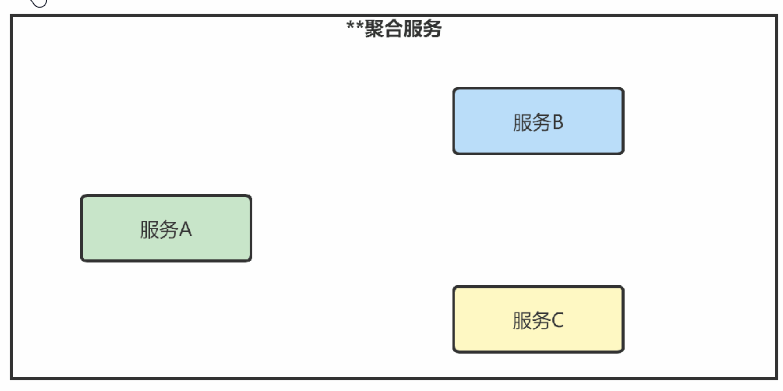
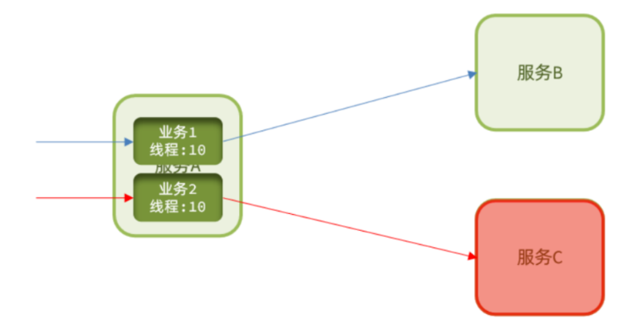
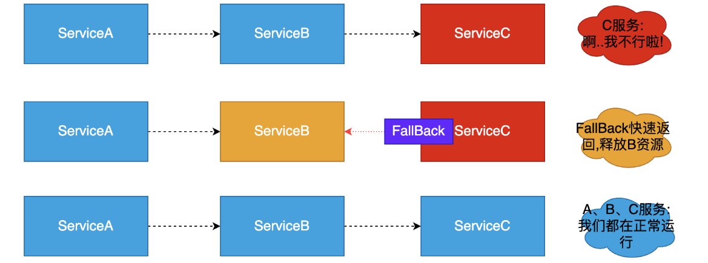
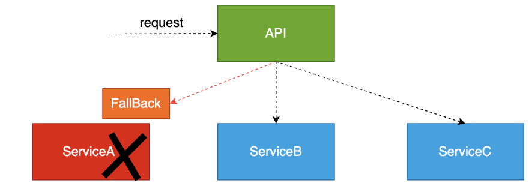

# 微服务组件之Polly

## 服务雪崩

### 定义

​	在微服务架构中，当中间某一层的服务故障，则会导致上层服务的请求堆积，系统硬盘/CPU资源耗尽，从而会导致上游一连串的服务故障，而导致服务雪崩。即一个服务失败，导致整条链路的服务都失败。

### 产生原因

- 依赖关系复杂性： 在微服务架构中，各个服务之间存在复杂的依赖关系。如果一个服务出现故障，它可能会导致依赖于它的其他服务也无法正常工作。
- 大规模部署： 大规模部署意味着有大量的服务实例在运行，当其中一部分实例出现问题时，整个系统可能受到影响。
- 同时故障： 有时，多个服务可能因相同的原因（如硬件故障、网络问题或配置错误）而同时故障，导致雪崩效应。
- 超时和重试： 如果某个服务在请求时长时间未响应，其他服务可能会发起重试请求，导致更多的负载，最终导致系统崩溃。
- 资源耗尽： 当某个服务的资源（如数据库连接、线程池）被过度消耗时，它可能会无法响应请求，从而引发雪崩。

### 解决方案

雪崩解决常见解决方案有以下几种:

- 超时处理：对于每个微服务的请求，应该设置合理的超时时间。超时时间应该充分考虑服务的响应时间和业务需求，以避免等待时间过长导致的问题
- 舱壁模式（Bulkhead Pattern for Avalanche）:系统遇到雪崩风险时，通过隔离不同服务或组件，以防止一个故障或高负载情况影响整个系统的稳定性。是一种应对潜在雪崩的设计模式
- 限流（Rate Limiting）: 限流可以控制对服务的请求速率，确保不会超出服务的处理能力。这可以防止流量过多而导致系统崩溃
- 熔断器模式（Circuit Breaker Pattern）：熔断器模式是一种容错模式，用于避免雪崩效应。熔断器会监控服务的健康状态，当服务连续出现故障或响应时间超过阈值时，熔断器会打开，阻止进一步的请求流量流向该服务，从而保护系统的稳定性
- 降级策略（Fallback）： 降级是一种处理服务不可用或性能下降的策略，它允许系统在出现问题时提供有限但稳定的功能，而不是完全失败。当服务出现问题时，降级策略可以返回默认值、缓存数据、执行备用操作或者提供一个基本的响应，以确保用户仍然能够访问系统的一部分功能

#### 超时处理

针对服务调用增加超时机制(一般dubbo默认30s)，一旦超时自动释放资源，因释放资源较快一定程度可抑制资源耗尽问题。但如果在超时释放的时间内陡增大量请求，依然会导致服务宕机不可用。



#### 舱壁模式

仓壁模式来源于船舱的设计：船舱都会被隔板分离为多个独立空间，当船体破损时，只会导致部分空间进入，将故障控制在一定范围内，避免整个船体都被淹没。于此类似，我们可以限定每个业务能使用的线程数，避免耗尽整个服务器的资源，因此也叫线程隔离。



#### 限流

限流：限制业务访问的QPS，避免服务因流量的突增而故障。


> 限流与舱壁隔离区别：
>
> 限流：控制时间窗口内的请求次数来管理负载（防止系统过载）
>
> 舱壁隔离：控制请求并发数量来管理资源消耗（防止故障蔓延）

#### 服务熔断

“熔断器”本身是一种开关装置，当某个服务单元发生故障之后，通过断路器(hystrix)的故障监控，某个异常条件被触发，直接熔断整个服务。向调用方法返回一个符合预期的、可处理的备选响应(FallBack),而不是长时间的等待或者抛出调用方法无法处理的异常，就保证了服务调用方的线程不会被长时间占用，避免故障在分布式系统中蔓延，乃至雪崩。如果目标服务情况好转则恢复调用。服务熔断是解决服务雪崩的重要手段。

如下图：



#### 服务降级

- 当下游的服务因为某种原因**响应过慢**，下游服务主动停掉一些不太重要的业务，释放出服务器资源，增加响应速度！
- 当下游的服务因为某种原因**不可用**，上游主动调用本地的一些降级逻辑，避免卡顿，迅速返回给用户

如下图：



> ### 降级和熔断比较
>
> #### 共同点
>
> - 目的很一致，都是从可用性可靠性着想，为防止系统的整体缓慢甚至崩溃，采用的技术手段；
> - 最终表现类似，对于两者来说，最终让用户体验到的是某些功能暂时不可达或不可用；
> - 粒度一般都是服务级别，当然，业界也有不少更细粒度的做法，比如做到数据持久层（允许查询，不允许增删改）；
> - 自治性要求很高，熔断模式一般都是服务基于策略的自动触发，降级虽说可人工干预，但在微服务架构下，完全靠人显然不可能，开关预置、配置中心都是必要手段；sentinel（阿里巴巴的组件）
>
> #### 异同点
>
> - 触发原因不太一样，服务熔断一般是某个服务（下游服务）故障引起，而服务降级一般是从整体负荷考虑；
> - 管理目标的层次不太一样，熔断其实是一个框架级的处理，每个微服务都需要（无层级之分），而降级一般需要对业务有层级之分（比如降级一般是从最外围服务边缘服务开始）
>
> > 熔断必会触发降级,所以熔断也是降级一种,区别在于熔断是对调用链路的保护,而降级是对系统过载的一种保护处理

##  Polly组件

### 简介

Polly是一个开源的弹性瞬态故障处理库、它可以在程序出现故障、超时，或者返回值达到某种条件的时候进行多种策略处理。比如重试、超时、降级、熔断等等。

Polly可以通过不同策略处理和应对故障场景，主要分为两大类：**被动策略和主动策略**，各自包含如下功能：

#### 被动策略

主要针对故障的处理，避免如下：

- **重试(Retry)**：在实际应用场景中往往有些失败只是瞬时的，经过短暂的延时就可恢复，这种情况就可以采用重试策略；
- **熔断（Circuit Breaker)**：比如在调用接口发生异常时，当多次都返回异常，建议先熔断一段时间，即不再处理业务接口，直接报错；待熔断时间过了之后可以重新处理请求，即快速响应失败比让用户一直等待要合理；
- **回退(Fallback)**：如果失败之后怎么处理？即在发生故障的时候找一个替代逻辑进行处理， 比如返回指定的结果或是进行下一步操作；

#### 主动策略

主要是进行弹性扩展，而不是针对故障处理，关键点是改变原有业务逻辑的执行行为，比如原业务逻辑超时了，就会执行指定的超时处理行为；

- **超时(Timeout )**：确保调用者永远不需要等待超过配置的超时时间，不然就会触发超时异常；主要就是为了提升用户体验；
- **舱壁隔离(Bulkhead Isolation)**：即一个服务的故障不应该影响到整个系统(隔离)；通过控制资源消耗，避免一个故障导致级联服务也故障，最终影响整个系统；目的就是进行并发控制（限流），避免故障带来的大范围影响。
- **缓存(Cache)**：将数据存入缓存中，后续的响应可以从缓存中获取; 目的就是为了提升性能；
- **策略包装( PolicyWrap)**：策略可以组合进行使用；目的就是为了方便各种策略组合进行业务故障处理；

### 基本用法

```C#

        /// <summary>
        /// Polly基本使用
        /// </summary>
        static void BasicUse()
        {
            #region 定义故障的多种方式
            Policy
                .Handle<ArgumentException>(ex => ex.Message == "Error");

            Policy
                .Handle<HttpRequestException>()
                .Or<ArgumentException>();

            Policy
                .Handle<HttpRequestException>(ex => ex.Message == "Http Error")
                .Or<ArgumentException>(ex => ex.ParamName == "example");

            #endregion

            #region 降级策略
            Policy.HandleResult<HttpResponseMessage>(r => r.StatusCode == HttpStatusCode.NotFound)
                .Fallback(() =>
                {
                    Console.WriteLine("未找到");
                    return new HttpResponseMessage(HttpStatusCode.OK);
                })
                .Execute(() => new HttpResponseMessage(HttpStatusCode.NotFound));

            Policy
                .Handle<HttpRequestException>()
                .OrResult<HttpResponseMessage>(r => r.StatusCode == HttpStatusCode.NotFound);

            #endregion

            #region 重试策略
            Policy
                .Handle<ArgumentException>()
                .Retry();
            //指定重试次数
            Policy
                .Handle<ArgumentException>()
                .Retry(3);
            //一直重试
            Policy
                .Handle<ArgumentException>()
                .RetryForever();

            //重试三次，等待时间分别为1、2、3
            Policy
                .Handle<ArgumentException>()
                .WaitAndRetry(new[]
                {
                TimeSpan.FromSeconds(1),
                TimeSpan.FromSeconds(2),
                TimeSpan.FromSeconds(3)
                });

            //重试5次，等待时间分别为2的n次方
            Policy
                .Handle<ArgumentException>()
                .WaitAndRetry(5, retryAttempt => TimeSpan.FromSeconds(Math.Pow(2, retryAttempt)));

            //一直重试，等待时间分别为2的n次方
            Policy
                .Handle<Exception>()
                .WaitAndRetryForever(retryAttempt => TimeSpan.FromSeconds(Math.Pow(2, retryAttempt)));
            #endregion


            #region 断路器策略
            Policy
                .Handle<Exception>()
                .CircuitBreaker(2, TimeSpan.FromMinutes(1));

            Policy
                .Handle<Exception>()
                .AdvancedCircuitBreaker(
                    failureThreshold: 0.5,
                    samplingDuration: TimeSpan.FromSeconds(10),
                    minimumThroughput: 8,
                    durationOfBreak: TimeSpan.FromSeconds(30)
                );
            #endregion

            #region 超时策略
            Policy.Timeout(3);
            #endregion

            #region 限流策略
            //该策略将允许在1分钟窗口内最多执行100次请求
            Policy.RateLimit(100, TimeSpan.FromMinutes(1));
            #endregion

            #region 舱壁隔离策略
            //用来限制并发请求的数量。
            //该方法允许用户指定最大并发请求数，超过这个数量的请求将被拒绝或排队等待。
            Policy.Bulkhead(12);
            Policy.Bulkhead(12, 2);
            #endregion

        }
```

### 多策略组合

场景：服务A（集群、多个实例）=》请求发生异常或者超时=》重新再次请求=》重试3次仍然失败=》切断对A的访问，响应1个替代结果，过一段时间尝试访问A=》是否恢复正常

```c#
        /// <summary>
        /// 多策略组合包装
        /// </summary>
        /// <returns></returns>
        public static ISyncPolicy CreatePolicy()
        {
            // 定义故障
            var builder = Policy.Handle<Exception>();

            // 等待并重试
            var retryPolicy = builder.WaitAndRetry(2,
                retryAttempt => TimeSpan.FromSeconds(Math.Pow(2, retryAttempt)),
                (_, _, retryCount, _) =>
                {
                    Console.WriteLine($"{DateTime.Now} - 重试 {retryCount} 次");
                });

            // 断路器
            var circuitPolicy = builder.CircuitBreaker(2, TimeSpan.FromSeconds(5),
                onBreak: (_, _) =>
                {
                    Console.WriteLine($"{DateTime.Now} - 断路器：开启状态（熔断时触发）");
                },
                onReset: () =>
                {
                    Console.WriteLine($"{DateTime.Now} - 断路器：关闭状态（恢复时触发）");
                },
                onHalfOpen: () =>
                {
                    Console.WriteLine($"{DateTime.Now} - 断路器：半开启状态");
                });

            // 降级回退
            var fallbackPolicy = builder.Fallback(() =>
            {
                Console.WriteLine("这是一个降级操作");
            });

            // 超时
            var timeoutPolicy = Policy.Timeout(1, (_, _, _) =>
            {
                Console.WriteLine("执行超时");
            });

            // 策略包装：从左到右
            return Policy.Wrap(fallbackPolicy, circuitPolicy, retryPolicy, timeoutPolicy);

        }
```

```C#
       /// <summary>
       /// 多策略组合包装测试
       /// </summary>
        static async void MultiPolicyCombine()
        {
            var serviceName = "YY.MyBService.HttpApi";

            var services = new ServiceCollection()
                .AddConsul()
                .AddConsulClient();

            services.AddHttpClient(serviceName);
            
            var serviceProvider = services.BuildServiceProvider();

            var serviceClient = serviceProvider.GetRequiredService<IServiceClient>();
            var loadBalancer = new LoadBalancer.LoadBalancer(LoadBalancingStrategy.RoundRobin);

            // 创建策略器
            var policy = PolicyFactory.CreatePolicy();

            var httpClientFactory = serviceProvider.GetRequiredService<IHttpClientFactory>();

            for (var i = 0; i < 1000; i++)
            {
                Console.WriteLine($"----------------第{i}次请求---YY.MyBService.HttpApi-------------");
                try
                {
                    var serviceList = await serviceClient.GetServicesAsync(serviceName);

                    // 策略器执行业务逻辑
                    policy.Execute(() =>
                    {
                        var serviceAddress = loadBalancer.GetNode(serviceList);
                        Console.WriteLine($"{DateTime.Now} - 正在调用:{serviceAddress}");
                        var httpClient = httpClientFactory.CreateClient(serviceName);
                        httpClient.BaseAddress = new Uri($"http://{serviceAddress}");
                        var result = httpClient.GetStringAsync("api/Hello").Result;
                        Console.WriteLine($"调用结果:{result}");
                    });
                }
                catch (Exception e)
                {
                    Console.WriteLine(e);
                }

                Thread.Sleep(1000);
            }
        }
```


## Polly弹性管道模式

1、Nuget包引入

```C#
Microsoft.Extensions.Http.Resilience    
```

说明：
  Microsoft.Extensions.Http.Polly库是早些年就存在的产物了,针对Polly V8及后续的版本增加了 Microsoft.Extensions.Http.Resilience库作为替代方案。基于 Polly v8 构建的Microsoft.Extensions.Http.Resilience速度较快的同时，使用的内存也减少了4倍之多。所以至NET8+以后推荐使用Microsoft.Extensions.Http.Resilience替代Microsoft.Extensions.Http.Polly库

2、扩展类

```C#
    public static class ResiliencePipelineExtension
    {
        public static IHttpClientBuilder AddCustomResiliencePipeline(this IHttpClientBuilder builder)
        {
            builder.AddResilienceHandler("common", pipelineBuilder =>
            {
                pipelineBuilder.AddFallback(new FallbackStrategyOptions<HttpResponseMessage>
                {
                    FallbackAction = _ =>
                    {
                        Console.WriteLine("降级操作");
                        return Outcome.FromResultAsValueTask(new HttpResponseMessage
                        {
                            Content = new StringContent("Hello 我是降级操作"),
                            StatusCode = HttpStatusCode.OK,
                        });
                    }
                });

                pipelineBuilder.AddCircuitBreaker(new HttpCircuitBreakerStrategyOptions
                {
                    FailureRatio = 0.5,
                    SamplingDuration = TimeSpan.FromSeconds(60),
                    MinimumThroughput = 2,
                    BreakDuration = TimeSpan.FromSeconds(60),
                    OnOpened = _ =>
                    {
                        Console.WriteLine($"{DateTime.Now} - 断路器：开启状态（熔断时触发）");
                        return default;
                    },
                    OnClosed = _ =>
                    {
                        Console.WriteLine($"{DateTime.Now} - 断路器：关闭状态（恢复时触发）");
                        return default;
                    },
                    OnHalfOpened = _ =>
                    {
                        Console.WriteLine($"{DateTime.Now} - 断路器：半开启状态");
                        return default;
                    }
                });

                pipelineBuilder.AddRetry(new HttpRetryStrategyOptions
                {
                    MaxRetryAttempts = 2,
                    Delay = TimeSpan.FromSeconds(1),
                    OnRetry = arg =>
                    {
                        Console.WriteLine($"{DateTime.Now} - 重试 {arg.AttemptNumber} 次");
                        return default;
                    }
                });

                pipelineBuilder.AddTimeout(new TimeoutStrategyOptions
                {
                    Timeout = TimeSpan.FromSeconds(1),
                    OnTimeout = arg =>
                    {
                        Console.WriteLine($"{DateTime.Now} - 请求超时");
                        return default;
                    }
                });
            });
            return builder;
        }
    }
```

