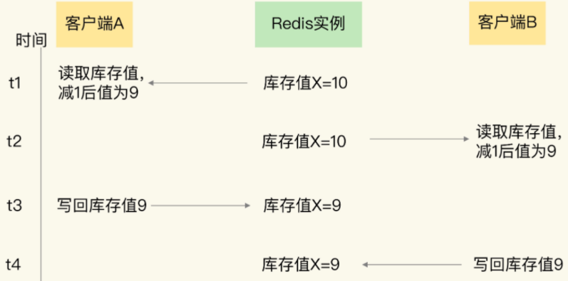

# 什么是分布式锁

控制分布式架构中多个模块访问的优先级

要介绍分布式锁，首先要提到与分布式锁相对应的是线程锁、进程锁。

- 线程锁：主要用来给方法、代码块加锁。当某个方法或代码使用锁，在同一时刻仅有一个线程执行该方法或该代码段。线程锁只在同一JVM中有效果，因为线程锁的实现在根本上是依靠线程之间共享内存实现的，比如synchronized是共享对象头，显示锁Lock是共享某个变量（state）。
- 进程锁：为了控制同一操作系统中多个进程访问某个共享资源，因为进程具有独立性，各个进程无法访问其他进程的资源，因此无法通过synchronized等线程锁实现进程锁。
- 分布式锁：当多个进程不在同一个系统中，用分布式锁控制多个进程对资源的访问。

**通常来说，分布式锁要保证互斥性、不死锁、可重入、高可用，高性能、安全性的特点。**

- 互斥性：指的是对于同一个资源，任意时刻，都只有一个客户端能持有锁。
- 不死锁：指的是必须要有锁超时这种机制，保证在出现问题的时候释放锁，不会出现死锁的问题。
- 可重入：指的是对于同一个线程，可以多次重复加锁。
- 高性能和高可用：加锁和解锁需要开销尽可能低，同时也要保证高可用，避免分布式锁失效。
- 安全性：锁只能被持有的客户端删除，不能被其他客户端删除。

# 应用场景

- 资源竞争：多个客户端，访问共享资源，比如：数据库记录、文件、缓存
- 避免重复执行：确保某个操作只执行一次
- 限制并发：限制某个操作的并发执行数量

# 实现方式

 对于一个单机的系统，我们可以通过lock、Mutex等这些常规的加锁方式来实现，然而对于一个分布式集群的系统而言，单纯的本地锁已经无法解决问题，所以就需要用到分布式锁了，通常我们都会引入三方组件或者服务来解决这个问题，目前分布式锁的实现方案主要包括三种：

- 基于数据库（唯一索引）
- 基于缓存（Redis，memcached，tair）
- 基于Zookeeper

## 基于数据库

### 基于数据库表

​       要实现分布式锁，最简单的方式可能就是直接创建一张锁表，然后通过操作该表中的数据来实现了。当我们要锁住某个方法或资源的时候，我们就在该表中增加一条记录，想要释放锁的时候就删除这条记录。

（1）创建一张数据表：

```sql
CREATE TABLE `database_lock` (
	`id` BIGINT NOT NULL AUTO_INCREMENT,
	`resource` int NOT NULL COMMENT '锁定的资源',
	`description` varchar(1024) NOT NULL DEFAULT "" COMMENT '描述',
	PRIMARY KEY (`id`),
	UNIQUE KEY `uiq_idx_resource` (`resource`) 
) ENGINE=InnoDB DEFAULT CHARSET=utf8mb4 COMMENT='数据库分布式锁表';
```

（2）当我们要锁住某个方法时，执行以下SQL：

```sql
INSERT INTO database_lock(resource, description) VALUES (1, 'lock');
```

（3）因为我们对method_name做了唯一性约束，这里如果有多个请求同时提交到数据库的话，数据库会保证只有一个操作可以成功，那么我们可以认为操作成功的那个线程获得了该方法的锁，可以执行具体内容。当方法执行完毕之后，想要释放锁的话，需要执行以下sql：

```sql
DELETE FROM database_lock WHERE resource=1;
```

上面这种简单的实现有以下几个问题：

- 这把锁依赖数据库的可用性，数据库是一个单点，一旦数据库挂掉，会导致业务系统不可用。 
- 这把锁没有失效时间，一旦解决操作失败，就会导致记录一直在数据库中，其他线程无法在获得锁。
- 这把锁只能是非阻塞的，因为数据的insert操作，一旦插入失败就会直接报错。没有获得锁的线程并不会进入排队队列，要想再次获得锁就要再次触发获得锁的操作。 
- 这把锁是非重入的，同一个线程在没有释放锁之前无法再次获得该锁。因为数据库表中数据已经存在了。

当然，我们也可以有其它方式解决上面的问题：

- 数据库是单点？那就搞两个数据库，数据库之间双向同步，一旦挂掉快速切换到备库上。 
- 没有失效时间？可以做一个定时任务，每隔一定时间把数据库中的超时数据清理一遍。 
- 非阻塞？可以写一个while循环，直到insert成功再返回成功。 
- 非重入？可以在数据库表中加一个字段，记录当前获得锁的机器的主机信息和线程信息，那么下次再获取锁的时候先查询数据库，如果当前机器的主机信息和线程信息在数据库中可以查到的话，就直接把锁分配给它即可。

### 基于数据库表做乐观锁

　　顾名思义，系统认为数据的更新在大多数情况下是不会产生冲突的，只在数据库更新操作提交的时候才对数据作冲突检测。如果检测的结果出现了与预期数据不一致的情况，则返回失败信息。

　　乐观锁大多数是基于数据版本(version)的记录机制实现的。何谓数据版本号？即为数据增加一个版本标识，在基于数据库表的版本解决方案中，一般是通过为数据库表添加一个 “version”字段来实现读取出数据时，将此版本号一同读出，之后更新时，对此版本号加1。在更新过程中，会对版本号进行比较，如果是一致的，没有发生改变，则会成功执行本次操作；如果版本号不一致，则会更新失败。

　　为了更好的理解数据库乐观锁在实际项目中的使用，这里就列举一个典型的电商库存的例子。一个电商平台都会存在商品的库存，当用户进行购买的时候就会对库存进行操作（库存减1代表已经卖出了一件）。我们将这个库存模型用下面的一张表optimistic_lock来表述，参考如下：

```sql
CREATE TABLE `optimistic_lock` (
    `id` BIGINT NOT NULL AUTO_INCREMENT,
    `resource` int NOT NULL COMMENT '锁定的资源',
    `version` int NOT NULL COMMENT '版本信息',
    `created_at` datetime COMMENT '创建时间',
    `updated_at` datetime COMMENT '更新时间',
    `deleted_at` datetime COMMENT '删除时间', 
    PRIMARY KEY (`id`),
    UNIQUE KEY `uiq_idx_resource` (`resource`) 
) ENGINE=InnoDB DEFAULT CHARSET=utf8mb4 COMMENT='数据库分布式锁表';
```

其中：id表示主键；resource表示具体操作的资源，在这里也就是特指库存；version表示版本号。

在使用乐观锁之前要确保表中有相应的数据，比如：

```sql
INSERT INTO optimistic_lock(resource, version, created_at, updated_at) VALUES(20, 1, CURTIME(), CURTIME());
```

如果只是一个线程进行操作，数据库本身就能保证操作的正确性。主要步骤如下：

- STEP1 获取资源：SELECT resource FROM optimistic_lock WHERE id = 1
- STEP2 执行业务逻辑
- STEP3 更新资源：UPDATE optimistic_lock SET resource = resource -1 WHERE id = 1

​    然而在并发的情况下就会产生一些意想不到的问题：比如两个线程同时购买一件商品，在数据库层面实际操作应该是库存（resource）减2，但是由于是高并发的情况，第一个线程执行之后（执行了STEP1、STEP2但是还没有完成STEP3），第二个线程在购买相同的商品（执行STEP1），此时查询出的库存并没有完成减1的动作，那么最终会导致2个线程购买的商品却出现库存只减1的情况。

在引入了version字段之后，那么具体的操作就会演变成下面的内容：

- STEP1 获取资源： SELECT resource, version FROM optimistic_lock WHERE id = 1
- STEP2 执行业务逻辑
- STEP3 更新资源：UPDATE optimistic_lock SET resource = resource -1, version = version + 1 WHERE id = 1 AND version = oldVersion

其实，借助更新时间戳（updated_at）也可以实现乐观锁，和采用version字段的方式相似：更新操作执行前线获取记录当前的更新时间，在提交更新时，检测当前更新时间是否与更新开始时获取的更新时间戳相等。

**优点：**由于在检测数据冲突时并不依赖数据库本身的锁机制，不会影响请求的性能，当产生并发且并发量较小的时候只有少部分请求会失败。

**缺点：**是需要对表的设计增加额外的字段，增加了数据库的冗余，另外，当应用并发量高的时候，version值在频繁变化，则会导致大量请求失败，影响系统的可用性。我们通过上述sql语句还可以看到，数据库锁都是作用于同一行数据记录上，这就导致一个明显的缺点，在一些特殊场景，如大促、秒杀等活动开展的时候，大量的请求同时请求同一条记录的行锁，会对数据库产生很大的写压力。所以综合数据库乐观锁的优缺点，乐观锁比较适合并发量不高，并且写操作不频繁的场景。

### 基于数据库表做悲观锁（排它锁）

除了可以通过增删操作数据库表中的记录以外，我们还可以借助数据库中自带的锁来实现分布式锁。在查询语句后面增加FOR UPDATE，数据库会在查询过程中给数据库表增加悲观锁，也称排他锁。当某条记录被加上悲观锁之后，其它线程也就无法再改行上增加悲观锁。

　　悲观锁，与乐观锁相反，总是假设最坏的情况，它认为数据的更新在大多数情况下是会产生冲突的。

　　在使用悲观锁的同时，我们需要注意一下锁的级别。MySQL InnoDB引起在加锁的时候，只有明确地指定主键(或索引)的才会执行行锁 (只锁住被选取的数据)，否则MySQL 将会执行表锁(将整个数据表单给锁住)。

　　在使用悲观锁时，我们必须关闭MySQL数据库的自动提交属性（参考下面的示例），因为MySQL默认使用autocommit模式，也就是说，当你执行一个更新操作后，MySQL会立刻将结果进行提交。

```sql
mysql> SET AUTOCOMMIT = 0;
Query OK, 0 rows affected (0.00 sec)
```

　　这样在使用FOR UPDATE获得锁之后可以执行相应的业务逻辑，执行完之后再使用COMMIT来释放锁。

　　我们不妨沿用前面的database_lock表来具体表述一下用法。假设有一线程A需要获得锁并执行相应的操作，那么它的具体步骤如下：

- STEP1 获取锁：SELECT * FROM database_lock WHERE id = 1 FOR UPDATE;。
- STEP2 执行业务逻辑。
- STEP3 释放锁：COMMIT。

如果另一个线程B在线程A释放锁之前执行STEP1，那么它会被阻塞，直至线程A释放锁之后才能继续。注意，如果线程A长时间未释放锁，那么线程B会报错，参考如下（lock wait time可以通过innodb_lock_wait_timeout来进行配置）：

```
ERROR 1205 (HY000): Lock wait timeout exceeded; try restarting transaction
```

　上面的示例中演示了指定主键并且能查询到数据的过程（触发行锁），如果查不到数据那么也就无从“锁”起了。

　如果未指定主键（或者索引）且能查询到数据，那么就会触发表锁，比如STEP1改为执行（这里的version只是当做一个普通的字段来使用，与上面的乐观锁无关）：

```sql
SELECT * FROM database_lock WHERE description='lock' FOR UPDATE;
```

　或者主键不明确也会触发表锁，又比如STEP1改为执行：

```sql
SELECT * FROM database_lock WHERE id>0 FOR UPDATE;
```

　　注意，虽然我们可以显示使用行级锁（指定可查询的主键或索引），但是MySQL会对查询进行优化，即便在条件中使用了索引字段，但是否真的使用索引来检索数据是由MySQL通过判断不同执行计划的代价来决定的，如果MySQL认为全表扫描效率更高，比如对一些很小的表，它有可能不会使用索引，在这种情况下InnoDB将使用表锁，而不是行锁。

　　在悲观锁中，每一次行数据的访问都是独占的，只有当正在访问该行数据的请求事务提交以后，其他请求才能依次访问该数据，否则将阻塞等待锁的获取。悲观锁可以严格保证数据访问的安全。但是缺点也明显，即每次请求都会额外产生加锁的开销且未获取到锁的请求将会阻塞等待锁的获取，在高并发环境下，容易造成大量请求阻塞，影响系统可用性。另外，悲观锁使用不当还可能产生死锁的情况。

　**还有一个问题，就是我们要使用排他锁来进行分布式锁的lock，那么一个排他锁长时间不提交，就会占用数据库连接。一旦类似的连接变得多了，就可能把数据库连接池撑爆**

#### 优缺点

优点：直接借助数据库，容易理解。

缺点：

- 会有各种各样的问题，在解决问题的过程中会使整个方案变得越来越复杂。
- 操作数据库需要一定的开销，性能问题需要考虑。
- 使用数据库的行级锁并不一定靠谱，尤其是当我们的锁表并不大的时候

## 基于Redis

### 并发访问控制

​	实际应用中不可避免的存在并发场景，Redis也不例外，也会存在并发操作，比如用户下单时，有两个用户先从Redis查询到库存，然后同时下单，并发写操作，如果我们没做好控制，就可能导致数据被修改错，影响业务。为了保证并发访问的正确性，Redis提供了两种方法，分别是加锁和原子操作。

  加锁是一种常用的方法，在读取数据前，客户端需要先获取锁，获取不到的话就无法操作。等一个客户端获得锁后，就会一直持有这把锁，直到客户端完成更新，才会释放锁。

加锁会有两个问题：

- 如果加锁操作多，会降低系统并发访问性能；

- Redis客户端加锁时，需要用到分布式锁，而分布式锁实现复杂，需要额外的存储系统来提供加锁操作。

原子操作是另一种提供并发访问控制的方法。原子操作是指执行过程中保持原子性的操作，而且原子操作执行时不需要再加锁，实现无锁操作。既能保证并发控制，还能减少系统对并发访问性能的影响

**并发控制**

指多个客户端访问操作同一份数据的过程进行控制，以保证任何一个客户端发送的操作在Redis上执行具有互斥性。   并发访问控制对应的操作主要是修改操作。当客户端需要修改数据时，基本流程分成两步：

- 客户端先把数据读取到本地，在本地进行修改；
- 客户端修改完成后，再写回Redis

 这个过程可以定义为：读取-修改-写回。当有多个客户端对同一份数据执行相同的操作时，就需要让该流程原子性的执行，这一执行过程的代码叫临界区代码。如下为伪代码       

```lua
current=GET(id)
current--
SET(id,current)
```

首先是读取数据，然后进行修改，最后在写回修改后的数据。如果我们对临界区的代码没有进行控制，就会出现错误的数据。



如图所示，如果按照正确的逻辑处理，实际上的库存应该是8，如果没有并发控制，此时库存为9，库存会出现了错误。

 出现这个现象的原因是，临界区代码中的客户端读取数据、更新数据、再写回数据涉及了三个操作，而这三个操作在执行时并不具有互斥性，多个客户端基于相同的初始值进行修改，而不是基于前一个客户端修改后的值再修改。

### 加锁

 为了保证并发操作的正确性，可以通过加锁或原子操作来保证。

```lua
lock()
current=GET(id)
current--
SET(id,current)
unlock()
```

### 原子操作

Redis是对命令的操作时单线程的，所以Redis在执行单个命令时相当于是原子的，与其他命名互斥的，这是Redis的特点。

虽然 Redis 的单个命令操作可以原子性地执行，但是在实际应用中，数据修改时可能包含多个操作，至少包括读数据、数据增减、写回数据三个操作，这显然就不是单个命令操作了，那该怎么办呢？
    
Redis 提供了 INCR/DECR 命令，把这三个操作转变为一个原子操作了。INCR/DECR 命令可以对数据进行增值 / 减值操作，而且它们本身就是单个命令操作，Redis 在执行它们时，本身就具有互斥性。
    
但是，如果我们要执行的操作不是简单地增减数据，而是有更加复杂的判断逻辑或者是其他操作，那么，Redis 的单命令操作已经无法保证多个操作的互斥执行了。所以，这个时候，我们需要使用第二个方法，也就是 Lua 脚本。

### Lua脚本

Redis会把整个lua脚本当成一个整体来执行，在执行过程中不会被打断，从而保证了执行过程的原子性。如果有多个操作要执行，但又无法用 INCR/DECR 这种命令操作来实现，就可以把这些要执行的操作编写到一个 Lua 脚本中。然后，可以使用 Redis 的 EVAL 命令来执行脚本。这样一来，这些操作在执行时就具有了互斥性。

#### EVA命令

- EVA命令基本使用

  ```cmd
  # 例1：numkeys=1，keys数组只有1个元素key1，arg数组无元素
  127.0.0.1:6379> EVAL "return KEYS[1]" 1 key
  "key"
  
  # 例2：numkeys=0，keys数组无元素，arg数组元素中有1个元素value1
  127.0.0.1:6379> EVAL "return ARGV[1]" 0 value
  "value"
  
  # 例3：numkeys=2，keys数组有两个元素key1和key2，arg数组元素中有两个元素first和second 
  #      其实{KEYS[1],KEYS[2],ARGV[1],ARGV[2]}表示的是Lua语法中“使用默认索引”的table表[数组]，
  #      相当于java中的map中存放四条数据。Key分别为：1、2、3、4，而对应的value才是：KEYS[1]、KEYS[2]、ARGV[1]、ARGV[2]
  #      举此例子仅为说明eval命令中参数的如何使用。项目中编写Lua脚本最好遵从key、arg的规范。
  127.0.0.1:6379> eval "return {KEYS[1],KEYS[2],ARGV[1],ARGV[2]}" 2 key1 key2 first second 
  1) "key1"
  2) "key2"
  3) "first"
  4) "second"
  
  # 例4：使用了redis为lua内置的redis.call函数
  #      脚本内容为：先执行SET命令，在执行EXPIRE命令(相当于执行SETEX key1 60 10)
  #      numkeys=1，keys数组有一个元素userAge（代表redis的key）
  #      arg数组元素中有两个元素：10（代表userAge对应的value）和60（代表redis的存活时间）
  127.0.0.1:6379> EVAL "redis.call('SET', KEYS[1], ARGV[1]);redis.call('EXPIRE', KEYS[1], ARGV[2]); return 1;" 1 userAge 10 60
  (integer) 1
  127.0.0.1:6379> get userAge
  "10"
  127.0.0.1:6379> ttl userAge
  (integer) 50
  ```

  

- Lua脚本文件的基本使用

  sample1.lua脚本文件

  ```shell
  redis.call('set',KEYS[1],ARGV[1])
  redis.call('set',KEYS[2],ARGV[2])
  local n1 = tonumber(redis.call('get',KEYS[1]))
  local n2 = tonumber(redis.call('get',KEYS[2]))
  if n1 > n2 then
      return 1
  end
  if n1 == n2 then
      return 0
  end
  if n1 < n2 then
      return 2
  end
  ```

  执行lua脚本

  ```cmd
  # eval Lua脚本路径 key [key …] ,  arg [arg …]
  # “–eval"而不是命令模式中的"eval”，一定要有前端的两个-
  C:\Program Files\Redis>redis-cli --eval "G:\sample1.lua" k1 k2 , 1 5
  (integer) 2
  
  C:\Program Files\Redis>redis-cli --eval "G:\sample1.lua" k1 k2 , 5 1
  (integer) 1
  
  C:\Program Files\Redis>redis-cli --eval "G:\sample1.lua" k1 k2 , 5 5
  (integer) 0
  redis-cli --eval "G:\sample1.lua" k1 k2 , 0 8
  ```

  使用lua脚本的注意事项        

  - 在使用lua脚本时是有时间限制的，执行时间默认是5s，可通过配置修改，如果超过这个时间，Redis会终止这个操作以防止主线程阻塞，影响其他客户端。
  - 如果lua脚本中有语法错误或执行过程中发生错误，整个脚本都会失败，并返回一个错误，所以执行前要对lua脚本进行检查
  - 由于lua脚本时考Redis的单线程模型保证原子性的，所以势必会影响其他客户端的操作，如果执行耗时的lua脚本多的话，就会影响其他客户端，所以第一条中设置的执行时间要经过认真的分析才能设置。

#### SCRIPT 命令

- SCRIPT LOAD命令 和 EVALSHA命令

  > SCRIPT LOAD命令格式：`SCRIPT LOAD script`
  > EVALSHA命令格式：`EVALSHA sha1 numkeys key [key …] arg [arg …]`

  两个命令放在一起讲的原因是：EVALSHA 命令中的sha1参数，就是SCRIPT LOAD 命令执行的结果。

  SCRIPT LOAD 将脚本 script 添加到Redis服务器的脚本缓存中，并不立即执行这个脚本，而是会立即对输入的脚本进行求值。并返回给定脚本的 SHA1 校验和。如果给定的脚本已经在缓存里面了，那么不执行任何操作。

  在脚本被加入到缓存之后，在任何客户端通过EVALSHA命令，可以使用脚本的 SHA1 校验和来调用这个脚本。脚本可以在缓存中保留无限长的时间，直到执行SCRIPT FLUSH为止。

  ```cmd
  ## SCRIPT LOAD加载脚本，并得到sha1值
  127.0.0.1:6379> SCRIPT LOAD "redis.call('SET', KEYS[1], ARGV[1]);redis.call('EXPIRE', KEYS[1], ARGV[2]); return 1;"
  "6aeea4b3e96171ef835a78178fceadf1a5dbe345"
  ## EVALSHA使用sha1值，并拼装和EVAL类似的numkeys和key数组、arg数组，调用脚本。
  127.0.0.1:6379> EVALSHA 6aeea4b3e96171ef835a78178fceadf1a5dbe345 1 userAge 10 60
  (integer) 1
  ## 获取Key的值
  127.0.0.1:6379> get userAge
  "10"
  ## 获取key 的剩余过期时间
  127.0.0.1:6379> ttl userAge
  (integer) 33
  ```

- #### SCRIPT EXISTS 命令

  > 命令格式：`SCRIPT EXISTS sha1 [sha1 …]`
  > 作用：给定一个或多个脚本的 SHA1 校验和，返回一个包含 0 和 1 的列表，表示校验和所指定的脚本是否已经被保存在缓存当中

  ```cmd
  127.0.0.1:6379> SCRIPT EXISTS 6aeea4b3e96171ef835a78178fceadf1a5dbe345
  1) (integer) 1
  127.0.0.1:6379> SCRIPT EXISTS 6aeea4b3e96171ef835a78178fceadf1a5dbe346
  1) (integer) 0
  127.0.0.1:6379> SCRIPT EXISTS 6aeea4b3e96171ef835a78178fceadf1a5dbe345 6aeea4b3e96171ef835a78178fceadf1a5dbe346 6aeea4b3e96171ef835a78178fceadf1a5dbe347
  1) (integer) 1
  2) (integer) 0
  3) (integer) 0
  ```

- #### SCRIPT FLUSH 命令

  > 命令格式：`SCRIPT FLUSH`
  > 作用：清除Redis服务端所有 Lua 脚本缓存

  ```cmd
  127.0.0.1:6379> SCRIPT EXISTS 6aeea4b3e96171ef835a78178fceadf1a5dbe345
  1) (integer) 1
  127.0.0.1:6379> SCRIPT FLUSH
  OK
  127.0.0.1:6379> SCRIPT EXISTS 6aeea4b3e96171ef835a78178fceadf1a5dbe345
  1) (integer) 0
  ```

- #### SCRIPT KILL 命令

  > 命令格式：`SCRIPT FLUSH`
  > 作用：杀死当前正在运行的 Lua 脚本，当且仅当这个脚本没有执行过任何写操作时，这个命令才生效。 这个命令主要用于终止运行时间过长的脚本，比如一个因为 BUG 而发生无限 loop 的脚本，诸如此类。

  假如当前正在运行的脚本已经执行过写操作，那么即使执行SCRIPT KILL，也无法将它杀死，因为这是违反 Lua 脚本的原子性执行原则的。在这种情况下，唯一可行的办法是使用SHUTDOWN NOSAVE命令，通过停止整个 Redis 进程来停止脚本的运行，并防止不完整(half-written)的信息被写入数据库中。

#### 实战

需求：实现一个访问频率控制，某个IP在短时间内频繁访问页面，需要记录并检测出来，就可以通过Lua脚本高效的实现。

说明：本实例针对固定窗口的访问频率，而动态的非滑动窗口。即：如果规定一分钟内访问10次，记为超限。在本实例中前一分钟的最后一秒访问9次，下一分钟的第1秒又访问9次，不计为超限。
脚本如下

```lua
local visitNum = redis.call('incr', KEYS[1])
if visitNum == 1 then
	redis.call('expire', KEYS[1], ARGV[1])
end
if visitNum > tonumber(ARGV[2]) then
	return 0
end
return 1;
```

测试结果

```cmd
## 10s内访问超过3次返回1，否则返回0
C:\Users\Administrator>redis-cli --eval "G:\test.lua" limitIP:127.0.0.1 , 10 3
(integer) 1

C:\Users\Administrator>redis-cli --eval "G:\test.lua" limitIP:127.0.0.1 , 10 3
(integer) 1

C:\Users\Administrator>redis-cli --eval "G:\test.lua" limitIP:127.0.0.1 , 10 3
(integer) 1

C:\Users\Administrator>redis-cli --eval "G:\test.lua" limitIP:127.0.0.1 , 10 3
(integer) 0

C:\Users\Administrator>redis-cli --eval "G:\test.lua" limitIP:127.0.0.1 , 10 3
(integer) 1
```

#### .NET中如何使用Redis Lua脚本

### 分布式锁

Redis加锁可以应对并发问题，来控制并发写操作对共享数据的修改，从而保证数据的正确性需要注意：

- Redis属于分布式系统，当有多个客户端需要争抢锁时，必须要保证，这把锁不能是某个客户端本地的锁。否则的话，其它客户端是无法访问这把锁的，当然也就不能获取这把锁了
- 在分布式系统中，当有多个客户端需要获取锁时，需要分布式锁。此时，锁是保存在一个共享存储系统中的,可以被多个客户端共享访问和获取。
- Redis本身可以被多个客户端共享访问，正好就是一个共享存储系统，可以用来保存分布式锁。而且Redis的读写性能高，可以应对高并发的锁操作场景。

日常在写程序的时候，经常会用到单机上的锁。而分布式锁和单机上的锁既有相似性，但也因为分布式锁是用在分布式场景中，所以又具有一些特殊的要求。

#### 单机上的锁和分布式锁的联系与区别

**单机上的锁**

对于在单机上运行的多线程程序来说,锁本身可以用一个变量表示。

- 变量值为0时,表示没有线程获取锁;
- 变量值为1时,表示已经有线程获取到锁了。

线程调用加锁和释放锁的操作说明

- 加锁

  实际上，一个线程调用加锁操作，其实就是检查锁变量值是否为0。

  如果是0，就把锁的变量值设置为1，表示获取到锁。

  如果不是0,就返回错误信息，表示加锁失败，已经有别的线程获取到锁了。

- 放锁

  一个线程调用释放锁操作，其实就是将锁变量的值置为0，以便其它线程可以来获取锁。

加锁和释放锁的操作,其中，lock为锁变量。

```C#
acquire__lock(){
  if lock ==0
     lock = 1
  	 return 1
	else
     return 0
}
release__lock(){
if lock = 0
  	return 1
}
```

**单机锁与分布式锁的相同点**

和单机上的锁类似，分布式锁也可以用一个变量来实现。客户端加锁和释放锁的操作逻辑，也和单机上的加锁和释放锁操作逻辑一致∶加锁时同祥需要判断锁变量的值，根据锁变量值来判断能否加锁成功;释放锁时需要把锁变量值设置为0,表明客户端不再持有锁。

**单机锁与分布式锁不同点**

和线程在单机上操作锁不同的是，在分布式场景下，锁变量需要由一个共享存储系统来维护，多个客户端才可以通过访问共享存储系统来访问锁变量。加锁和释放锁的操作就变成了读取、判断和设置共享存储系统中的锁变量值。

实现分布式锁的两个要求。

- 分布式锁的加锁和释放锁的过程，涉及多个操作。所以，在实现分布式锁时，需要保证这些锁操作的原子性;
- 共享存储系统保存了锁变量,如果共享存储系统发生故障或宕机，那么客户端也就无法进行锁操作了。在实现分布式锁时,需要考虑保证共享存储系统的可靠性，进而保证锁的可靠性。

既可以基于单个Redis节点来实现，也可以使用多个Redis节点实现。在这两种情况下，锁的可靠一性是不一样的

#### 基于单个Redis节点实现分布式锁

**概要**

- Redis使用键值对来保存锁变量
- 赋予锁变量一个变量名，把这个变量名作为键值对的键，而锁变量的值则是键值对的值
-  Redis使用一个键值对lock_key:0来保存变量
- 键是lock_key也就是锁变量的名称，锁变量的初始值是0

（1）加锁操作

- 客户端A和B同时请求法索，因为Redis使用单线程处理请求，所以即使客户端A和B同时把加锁请求发送给Redis，Redis也会串行处理他们。
- 假设Redis先处理客户端A的请求，读取lock_ley的值发现lock_key为0；
- Redis将lock_key的value值设置为1，表示已经加锁了。
- Redis处理客户端B的请求，此时，Redis会发现lock_key的值已经为1，所以就返回加锁失败。

（2）释放锁：释放锁就是直接把锁变量值设置为0；

（3）加锁的原子性： 加锁包含三个操作（读取锁变量，判断锁变量值和把锁变量值设置为1），这三个步骤必须保证原子性。要想保证操作的原子性，有两种通用的方法，分别是使用Redis的单命令操作和使用Lua脚本。

**在分布式加锁场景下，该怎么应用这两个方法呢?**

首先是SETNX命令，用于设置键值对的值（命令执行时候会判断键值对是否存在，不存在就设置，存在就不设置）

```C#
//加锁
SETNX lock_key 1
//业务逻辑
DO THINGS
//释放锁
DEL lock_key
```

`使用SETNX和DEL命令组合实现分布式锁,存在两个风险`

- 风险1：假如某个客户端执行了SETNX命令，加锁紧接着就在操作共享数据时候发生异常，结果一直没有执行最后的DEL命令释放锁，锁一直被这个客户端持有，其他客户端无法拿到锁，也无法访问共享数据和执行后续操作。

  解决方案： 给锁变量设置一个过期时间。这样一来，即使持有锁的客户端发生了异常，无法主动地释放锁，Redis 也会根据锁变量的过期时间，在锁变量过期后，把它删除。其它客户端在锁变量过期后，就可以重新请求加锁，这就不会出现无法加锁的问题了

- 风险2：误释放锁。比如：

  - 如果客户端A执行SETNX命令加锁，假设客户端B执行了DEL命令释放锁，此时，客户端A的锁被误释放。如果客户端C正好也在申请加锁 ，就可以成功获得的锁，进而开始操作共享数据，这样客户端A和C都获取锁，现在出现异常

  解决方案： 区分来自不同客户端的锁操作 。在使用SETNX命令进行加锁的方法中，我们通过锁变量值设置为1或0，表示是否加锁成功。1和0只有两种状态，无法表示究竟是哪个客户端进行锁操作。我们在加锁操作时，可以让每个客户端给锁变量设置一个唯一值，这里的唯一值就可以用来表示当前操作的客户端。在释放锁操作时，客户端需要判断，当前锁变量的值是否和自己的唯一标识相等，只有在相等情况，才能释放锁，这样一来就不会出现误释放锁的问题。

**实践**
SETNX命令，对于不存在的键值对，它会先创建再设置值（也就是“不存在即设置”)，为了能达到和SETNX命令一样的效果，Redis给SET命令提供了类似的选项NX，用来实现“不存在即设置”。如果使用了NX选项，SET命令只有在键值对不存在时，才会进行设置，否则不做赋值操作。此外，SET命令在执行时还可以带上EX或PX选项，用来设置键值对的过期时间。

- 加锁代码实现

  ```lua
  //加锁,unique_value作为客户端唯一性的标识
  SET lock_key unique_value NX PX 1000a
  ```

  - unique_value是客户端的唯一标识，可以用一个随机生成的字符串来表示
  - PX 10000则表示lock_key会在10s后过期，以免客户端在这期间发生异常而无法释放锁。

- 释放锁代码实现

  因为在加锁操作中，每个客户端都使用了一个唯一标识，所以在释放锁操作时，需要判断锁变量的值，是否等于执行释放锁操作的客户端的唯一标识，如下所示:

  ```lua
  //释放锁比较unique_value是否相等
  if redis.call("get",KEYS[1]==ARGV[1] then)
  	return redis.call("del",keys[1])
  else
  	return 0
  end
  ```

  这是使用Lua脚本(unlock.script)实现的释放锁操作的伪代码，其中，KEYS[1]表示lock_key，ARGV[1]是当前客户端的唯一标识，这两个值都是在执行Lua脚本时作为参数传入的。

  最后执行下面的命令，完成锁释放操作。

  ```lua
  redis -cil --eval unlock.script lock_key,unique_value
  ```

  在释放锁操作中使用Lua脚本—>这是因为，释放锁操作的逻辑也包含了读取锁变量、判断值、删除锁变量的多个操作，而Redis在执行Lua脚本时，可以以原子性的方式执行，从而保证了锁释放操作的原子性。

**缺点**

使用SET命令和Lua脚本在Redis单节点上实现分布式锁。用一个Redis实例来保存锁变量，如果这个Redis实例发生故障宕机,锁变量就没有了。此时，客户端也无法进行锁操作了，这就会影响到业务的正常执行,在实现分布式锁时，还需要保证锁的可靠性

#### 基于多个Redis节点实现分布式锁

实现高可靠的分布式锁时，不能只依赖单个的命令操作，需要按照分布式锁的算法进行加解锁操作，否则，就可能会出现锁无法工作的情况。

**分布式锁算法Redlock**

目的：为了避免Redis实例故障而导致的锁无法工作的问题，

基本思路：让客户端和多个独立的Redis实例依次请求加锁，如果客户端能够和半数以上的实例成功地完成加锁操作，客户端就成功地获得分布式锁了，否则加锁失败。这样一来,即使有单个Redis实例发生故障，因为锁变量在其它实例上也有保存，所以，客户端仍然可以正常地进行锁操作,锁变量并不会丢失。

Redlock算法的执行步骤

Redlock算法的实现需要有N个独立的Redis实例。接下来，分成3步来完成加锁操作。

- 客户端获取当前时间。

- 客户端按顺序依次向N个Redis实例执行加锁操作。

- 这里的加锁操作和在单实例上执行的加锁操作一样，使用SET命令，带上NX，EX/PX选项，以及带上客户端的唯一标识。

- 当然，如果某个Redis实例发生故障了，为了保证在这种情况下，Redlock算法能够继续运行，需要给加锁操作设置一个超时时间。

  如果客户端在和一个Redis实例请求加锁时，一直到超时都没有成功，那么此时，客户端会和下一个Redis实例继续请求加锁。加锁操作的超时时间需要远远地小于锁的有效时间，一般也就是设置为几十毫秒。

- 一旦客户端完成了和所有Redis实例的加锁操作，客户端就要计算整个加锁过程的总耗时。

客户端只有在满足下面的这两个条件时,才能认为是加锁成功。

- 条件一:客户端从超过半数(大于等于N/2+1)的Redis实例上成功获取到了锁;
-  条件二:客户端获取锁的总耗时没有超过锁的有效时间。

在满足了这两个条件后，重新计算这把锁的有效时间，计算的结果:锁的最初有效时间-客户端为获取锁的总耗时。

如果锁的有效时间已经来不及完成共享数据的操作–>释放锁，以免出现还没完成数据操作,锁就过期了的情况。

当然，如果客户端在和所有实例执行完加锁操作后，没能同时满足这两个条件，那么，客户端向所有Redis节点发起释放锁的操作。

在Redlock算法中，释放锁的操作和在单实例上释放锁的操作一样，只要执行释放锁的Lua脚本就可以了。这样一来，只要N个Redis实例中的半数以上实例能正常工作，就能保证分布式锁的正常工作了。

所以，在实际的业务应用中，提升分布式锁的可靠性，通过Redlock算法来实现。

说明：红锁，使用的是3个Redis实例，而不是主从集群（主从集群其实采用的就算单节点分布式锁），红锁一般专门用来提供分布式锁，不会存数据。


### 基于Zookeeper


# 参考资料

[分布式锁原理及实现（转） - myseries - 博客园 (cnblogs.com)](https://www.cnblogs.com/myseries/p/10784410.html)


