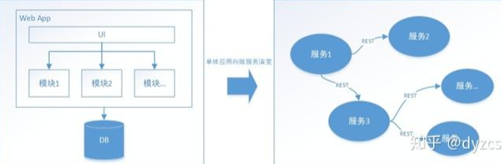

# 基础概念

## 什么是事务

事务可以看做是一次大的活动，它由不同的小活动组成，这些活动要么全部成功，要么全部失败

## 本地事务

在计算机系统中，更多的是通过关系型数据库来控制事务，这是利用数据库本身的事务特性来实现的，因此叫数据库事务，由于应用主要靠关系数据库来控制事务，而数据库通常和应用在同一个服务器，所以基于关系型数据库的事务又被称为本地事务。

数据库事务的四大特性：ACID

- A（Atomic）：原子性，构成事务的所有操作，要么都执行完成，要么全部不执行，不可能出现部分成功部分失败的情况。
- C（Consistency）：一致性，在事务执行前后，数据库的一致性约束没有被破坏。比如：张三向李四转 100 元，转账前和转账后的数据是正确状态这叫一致性，如果出现张三转出 100 元，李四账户没有增加 100 元这就出现了数 据错误，就没有达到一致性。
- I（Isolation）：隔离性，数据库中的事务一般都是并发的，隔离性是指并发的两个事务的执行互不干扰，一个事务不能看到其他事务的运行过程的中间状态。通过配置事务隔离级别可以比避免脏读、重复读问题。
- D（Durability）：持久性，事务完成之后，该事务对数据的更改会持久到数据库，且不会被回滚。

> **刚性事务**：遵循ACID原则，强一致性；(eg：2PC、3PC)
>
> **柔性事务**：遵循BASE理论，最终一致性；(eg：TCC)

数据库事务在实现时会将一次事务的所有操作全部纳入到一个不可分割的执行单元，该执行单元的所有操作要么都成功，要么都失败，只要其中任一操作执行失败，都将导致整个事务的回滚。

## 分布式事务

随着互联网的快速发展，软件系统由原来的单体应用转变为分布式应用，下图描述了单体应用向微服务的演变：



 分布式系统会把一个应用系统拆分为可独立部署的多个服务，因此需要服务与服务之间远程协作才能完成事务操作，这种分布式系统环境下由不同的服务之间通过网络远程协作完成事务称之为**分布式事务**，例如用户注册送积分事务、创建订单减库存事务，银行转账事务等都是分布式事务。

 我们知道本地事务依赖数据库本身提供的事务特性来实现，因此以下逻辑可以控制本地事务：

```mysql
begin transaction；
    //1.本地数据库操作：张三减少金额
    //2.本地数据库操作：李四增加金额
commit transation;
```

 但是在分布式环境下，会变成下边这样：

```mysql
begin transaction；
    //1.本地数据库操作：张三减少金额
    //2.远程调用：让李四增加金额
commit transation;
```

 可以设想，当远程调用让李四增加金额成功了，由于网络问题远程调用并没有返回，此时本地事务提交失败就回滚了张三减少金额的操作，此时张三和李四的数据就不一致了。

 因此在分布式架构的基础上，传统数据库事务就无法使用了，张三和李四的账户不在一个数据库中甚至不在一个应用系统里，实现转账事务需要通过远程调用，由于网络问题就会导致分布式事务问题。

# 分布式事务基础理论

CAP理论

### 概念

CAP理论：一个分布式系统最多只能同时满足一致性（Consistency）、可用性（Availability）和 分区容错性（Partition tolerance）这三项中的两项。

- 一致性（Consistency）：指写操作后的读操作可以读取到最新的数据状态，当数据分布在多个节点上，从任意结点读取到的数据都是最新的状态。

  分布式系统一致性的特点：

  - 由于存在数据同步的过程，写操作的响应会有一定的延迟。
  - 为了保证数据一致性会对资源暂时锁定，待数据同步完成释放锁定资源。
  - 如果请求数据同步失败的结点则会返回错误信息，一定不会返回旧数据

- 可用性（Availability）：指任何事务操作都可以得到响应结果，且不会出现响应超时或响应错误。

  分布式系统可用性的特点：所有请求都有响应，且不会出现响应超时或响应错误

- 分区容错性（Partition tolerance）：分布式系统在遇到某节点或网络分区故障的时候，仍然能够对外 提供满足一致性和可用性的服务。

  分布式分区容忍性的特点：分区容忍性分是布式系统具备的基本能力


### CAP权衡

- CA：放弃分区容错性，加强一致性和可用性，其实就是传统的单机数据库的选择
- AP：放弃一致性（这里说的一致性是强一致性），追求分区容错性和可用性，这是很多分布式系统设计时的选择，例如很多NoSQL系统就是如此
- CP：放弃可用性，追求一致性和分区容错性，基本不会选择，网络问题会直接让整个系统不可用

### CAP潜在的约束

- CAP有适用范围

  正如定义中所说，CAP是有适用范围的，乱套用CAP往往谬以千里。

  这里以一个电商网站订单模块的下单、付款、扣减库存操作为例说明。在超时的情况下，订单数据和库存数据状态会不一致，这属不属于CAP理论的适用范围呢？答案是不适用。

  大家不要一看到不一致就认为适用CAP理论。前面已经讲过，CAP的适用范围只是针对共享、互联的数据，订单和库存系统虽然是互联的，但没有共享的数据，超时情况下产生的不一致只能靠对账和人工修复等方式解决。但如果针对的是各节点的库存数据的一致性，则适用CAP理论，比如当用户下单支付后，各节点的库存数据需要立即更新，以保证所有查看该商品的用户都能看到最新的库存信息。

- CAP理论中，P是必选项

  虽然 CAP 理论定义是三个要素中只能取两个，但放到分布式环境下来思考，我们会发现必须选择 p (分区容忍)要素，因为网络本身无法做到 100%可靠，有可能出故障，所以分区是一个必然的现象。如果我们选择了 CA 而放弃了 P，那么当发生分区现象时，为了保证 C，系统需要禁止写入，当有写入请求时，系统返回 error (例如，当前系统不允许写入)，这又和 A 冲突了 ，因为 A 要求返回 no error 和 no timeout。因此，分布式系统理论上不可能选择 CA 架构 ，只能选择 CP 或 AP 架构。

- CAP关注的粒度是数据， 而不是整个系统

  CAP 理论的定义和解释中，用的都是 system、 node 这类系统级的概念，这就给很多人造成了很大的误导，认为我们在进行架构设计时，整个系统要么选择 CP，要么选择 AP。但在实际设计过程中，每个系统不可能只处理一种数据，而是包含多种类型的数据，有的数据必须选择CP，有的数据必须选择 AP。而如果我们做设计时，从整个系统的角度去选择CP还是AP，就会发现顾此失彼，无论怎么做都是有问题的。

  一个电商网站核心模块包括会员，订单，商品，支付，促销管理等等，不同的模块数据特点不同，因此适用不同的CAP架构。

  会员模块包括登录，个人设置，个人订单，购物车，收藏夹等功能，这些模块只要保证AP，即对用户的及时响应，数据短时间不一致不大会影响使用。订单模块的下单付款扣减库存操作是整个系统的核心，CA都需要保证，在极端情况下牺牲P是可以的。商品模块的商品上下架保证CP即可，因为后端操作可以允许一定的时延；促销模块短时间的数据不一致，结果就是优惠信息看不到，但是已有的优惠保证可用，所以保证AP也可以。

  现在大部分电商网站对于支付是独立的系统，C是必须要保证的，AP中A相对更重要，不能因为分区导致所有人都不能支付。

- CAP是忽略网络延迟的

  这是一个非常隐含的假设，布鲁尔在定义一致性时，并没有将延迟考虑进去。也就是说，当事务提交时，数据能够瞬间复制到所有节点。但实际情况下，从节点 A 复制数据到节点 B,总是需要花费一定时间的。这就意味着， CAP理论中的 C 在实践中是不可能完美实现的，在数据复制的过程中，节点 A 和节点 B 的数据并不一致。对于严苛的业务场景。

  例如和金钱相关的用户余额、和抢购相关的商品库存，技术上是无法做到分布式场景下完美的一致性的。而业务上必须要求一致性，因此单个用户的余额、单个商品的库存，理论上要求选择 CP 而实际上 CP都做不到，只能选择 CA。也就是说，只能单点写入，其他节点做备份，无法做到分布式情况下多点写入，这是符合实际情况的。

- CAP的AP和CP不是绝对的

  CAP理论告诉我们三者只能取两个，需要牺牲另外一个，这里的牺牲有一定误导作用，因为牺牲让很多人理解成什么都不做，实际上，CAP理论的牺牲只是说分区过程无法保证C或者A，但不意味着什么都不做，因为在系统整个运行周期中，大部分时间都是正常的，发生分区现象的时间并不长，分区期间放弃C或A，并不意味着永远放弃，可以在分区期间进行一些操作，比如记录日志，从而让分区故障解决后，系统能够重新达到CA的状态。

  比如用户账号数据，假设选择了CP，则分区发生后，节点1可以继续注册新用户，节点2无法注册新用户，此时节点1可以记录新增日志，当分区恢复后，节点2读取节点1的日志就可以让节点1和节点2同时满足CA的状态。

- CAP的可用性与高可用有区别

  HBASE、MongoDB属于CP架构，Cassandra、CounchDB属于AP系统，但我们能说后者比前者更高可用么？应该不是。CAP中的高可用，是指在某一次读操作中，即使发现不一致，也要返回响应，即在合理时间返回合理响应。我们常说的高可用，是指部分实例挂了，能自动摘除，并由其它实例继续提供服务，关键是冗余。

- CAP的网络分区有明确定义

  网络故障、节点应用出现问题导致超时，属于网络分区，节点宕机或硬件故障，则不属于。因此如果有人说机器挂了怎么样，这种情况不属于CAP理论适用的范围，CAP关注的是分区时的可用性和一致性，不是说保证整个集群不挂。

BASE理论

BASE理论是对CAP理论的延伸，核心思想是即使无法 做到强一致性（Strong Consistency，CAP的一致性就是强一致性），但应用可以采用适合的方式达到最终一致性（Eventual Consitency）。

BASE是指基本可用（Basically Available）、软状态（ Soft State）、最终一致性（ Eventual Consistency）。

### 概念

- 基本可用（Basically Available）

  基本可用是指分布式系统在出现故障的时候，允许损失部分可用性，即保证核心可用。
  电商大促时，为了应对访问量激增，部分用户可能会被引导到降级页面，服务层也可能只提供降级服务。这就是损失部分可用性的体现。

- 软状态（ Soft State）

  软状态是指允许系统存在中间状态，而该中间状态不会影响系统整体可用性。分布式存储中一般一份数据至少会有三个副本，允许不同节点间副本同步的延时，就是软状态的体现。mysql replication的异步复制也是一种体现。

- 最终一致性（ Eventual Consistency）
  最终一致性是指系统中的所有数据副本经过一定时间后，最终能够达到一致的状态。弱一致性和强一致性相反，最终一致性是弱一致性的一种特殊情况。

### 强一致性和最终一致性

CAP 理论告诉我们一个分布式系统最多只能同时满足一致性（Consistency）、可用性（Availability）和分区容忍性（Partition tolerance）这三项中的两项，其中AP在实际应用中较多，AP 即舍弃一致性，保证可用性和分区容忍性，但是在实际生产中很多场景都要实现一致性，比如前边我们举的例子主数据库向从数据库同步数据，即使不要一致性，但是最终也要将数据同步成功来保证数据一致，这种一致性和 CAP 中的一致性不同，CAP 中的一致性要求 在任何时间查询每个结点数据都必须一致，它强调的是强一致性，但是最终一致性是允许可以在一段时间内每个结点的数据不一致，但是经过一段时间每个结点的数据必须一致，它强调的是最终数据的一致性。

### Base与ACID

总的来说，BASE理论面向的是大型高可用可扩展的分布式系统，和传统的事物ACID特性是相反的，它完全不同于ACID的强一致性模型，而是通过牺牲强一致性来获得可用性，并允许数据在一段时间内是不一致的，但最终达到一致状态。但同时，在实际的分布式场景中，不同业务单元和组件对数据一致性的要求是不同
的，因此在具体的分布式系统架构设计过程中，ACID特性和BASE理论往往又会结合在一起。

# 分布式事务解决方案

## 刚性事务

`刚性事务遵循ACID原则，满足强一致性`，接下来讲解刚性事务的标准实现2PC（二阶段提交）和3PC（三阶段提交）。

### 2PC

#### 概念

XA协议是X/Open CAE Specification定义的一套DTP（Distributed Transaction Processing）分布式事务处理模型，主要包含四个部分：

- 应用程序（AP）：应用程序
- 事务管理器（TM）：交易中间件
- 资源管理器（RM）：数据库
- 通信资源管理器（CRM）：消息中间件


事务管理器作为一个全局的调度者，负责通知各个资源管理器事务的开始、结束、提交、回滚，把多个本地事务协调为全局统一的分布式事务。两阶段提交（2PC）和三阶段提交（3PC）就是基于此协议衍生出来的。Oracle、Mysql等数据库均已实现了XA接口。

二阶段提交又称2PC（two-phase commit protocol）,2pc是一个非常经典的强一致、中心化的原子提交协议。这里所说的中心化是指协议中有两 类节点：一个是中心化**协调者节点（coordinator）和N个参与者节点（partcipant）**，事务的提交过程分成了两个阶段来进行处理。

#### 基本流程

**2pc执行成功，参与者全部同意**

**2pc执行失败，参与者任意一个不同意都会失败**

2PC分为两个阶段

- 阶段一:提交事务请求

  事务管理器给每个参与者发送Prepare消息，每个数据库参与者在本地执行事务，并写本地的Undo/Redo日志，此时事务没有提交。（Undo日志是记录修改前的数据，用于数据库回滚，Redo日志是记录修改后的数据，用于提交事务后写入数据文件）

- 阶段二：事务执行
  如果事务管理器收到了参与者的执行失败或者超时消息时，直接给每个参与者发送回滚(Rollback)消息；否则，发送提交(Commit)消息；
  参与者根据事务管理器的指令执行提交或者回滚操作，并释放事务处理过程中使用的锁资源。

  注意:必须在最后阶段释放锁资源。

#### 优缺点

优点：原理简单，实现方便

缺点：

- 单点服务: 若协调者突然崩溃则事务流程无法继续进行或者造成状态不一致
- 无法保证一致性: 若协调者第二阶段发送提交请求时崩溃，可能部分参与者受到COMMIT请求提交了事务，而另一部分参与者未受到请求而放弃事 务造成不一致现象。
- 阻塞: 为了保证事务完成提交，各参与者在完成第一阶段事务执行后必须锁定相关资源直到正式提交，影响系统的吞吐量。

### 3PC

#### 概念

3PC，全称 “three phase commit”，是 2PC 的改进版，将 2PC 的 “提交事务请求Prepare” 过程一分为二（CanCommit、PreCommit），共形成了由CanCommit、PreCommit和doCommit三个阶段组成的事务处理协议。

#### 基本流程


执行步骤：

**CanCommit**

- 协调者进行事务询问：协调者向所有的参与者发送一个包含事务内容的CanCommit请求，询问是否可以执行事务提交操作，并开始等待各参与者的响应。
- 参与者向协调者反馈事务询问：参与者在接收到来自协调者的包含了事务内容的CanCommit请求后，正常情况下，如果自身认为可以顺利执行事 务，则反馈Yes响应，并进入预备状态，否则反馈No响应。

**PreCommit**

协调者在得到所有参与者的响应之后，参与者在CanCommit反馈的是Yes，执行事务预提交：

- 协调者发送预提交请求（发出preCommit请求，并进入prepared阶段）
- 参与者进行事务预提交（参与者接收到preCommit请求后，会执行事务操作，并将Undo和Redo信息记录到事务日志中。）
- 各参与者向协调者反馈事务执行的结果（若参与者成功执行了事务操作，那么反馈Ack）

协调者在得到所有参与者的响应之后，参与者在CanCommit反馈的是No，中断事务：

- 协调者发送中断请求：（协调者向所有参与者发出abort请求。）
- 中断事务（无论是收到来自协调者的abort请求或者等待协调者请求过程中超时，参与者都会中断事务）

**DoCommit**

DoCommit阶段完成真正的事务提交或者完成事务回滚。

在第二阶段PreCommit阶段收到ACK确认消息，则完成事务提交：

- 协调者发送提交DoCommit请求（协调者将从预提交状态转化为提交状态，并向所有的参与者发送doCommit请求）
- 参与者进行事务提交（参与者接收到DoCommit请求后，会正式执行事务提交操作，并在完成提交之后释放整个事务执行过程中占用的事务资源。）
- 各参与者向协调者反馈事务提交的结果（若参与者成功完成事务提交，那么反馈Ack响应）
- 完成事务（协调者接收到所有参与者反馈的Ack消息后，完成事务。）

在第二阶段PreCommit阶段超时中断没有收到ACK确认消息，则完成事务中断：

- 协调者发送中断请求（协调者向所有的参与者节点发送abort请求）
- 参与者进行事务回滚（根据记录的Undo信息来执行事务回滚，并在完成回滚之后释放整个事务执行期间占用的资源）
- 各参与者向协调者反馈事务回滚的结果（参与者在完成事务回滚后，向协调者发送Ack消息。）
- 中断事务（协调者接收到所有参与者反馈的Ack消息后，中断事务。）

**注意：**在DoCommit阶段可能出现协调者宕机、协调者与参与者出现网络故障，导致参与者接收不到协调者的DoCommit请求或Abort请求，参与者会在请求超时后，继续进行事务提交。

#### 优缺点

优点：

- 降低了阻塞

  参与者返回 CanCommit 请求的响应后，等待第二阶段指令，若等待超时，则自动 abort，降低了阻塞；

  参与者返回 PreCommit 请求的响应后，等待第三阶段指令，若等待超时，则自动 commit 事务，也降低了阻塞；

- 解决单点故障问题

  参与者返回 CanCommit 请求的响应后，等待第二阶段指令，若协调者宕机，等待超时后自动abort；
  参与者返回 PreCommit 请求的响应后，等待第三阶段指令，若协调者宕机，等待超时后自动 commit 事务；

缺点：数据不一致问题仍然是存在的。比如第三阶段协调者发出了 abort 请求，然后有些参与者没有收到 abort，那么就会自动 commit，造成数据不一致。

## 柔性事务

`柔性事务遵循BASE理论，满足最终一致性`，柔性事务主要分为**补偿型**和**通知型**。补偿型事务又分TCC、Saga，通知型事务分事务消息、最大努力通知型。补偿型事务都是同步的，通知型事务都是异步的。接下来介绍柔性事务的这几种实现方案：TCC、Saga、事务消息、本地消息表、最大努力通知。

柔性事务优点：

- 性能比较高，不会因为长时间持有事务占用资源。
- 具备可用性。
- 适合高并发场景。

柔性事务缺点：

- 因为数据的短暂不一致，所以会出现某一时刻数据的不一致。对于一致性特别高的场景不适用。

我们实现最终一致性方案时，需要注意几个操作：

- 可查询操作：业务方需要提供可查询接口，来查询数据信息和状态，供其他服务知道数据状态。
- 幂等操作：同样的参数执行同一个方法，返回的结果都一样。在分布式环境，难免会出现数据的不一致，很多时候为了保证数据的一致，我们都会进行重试。如果不保证幂等，即使重试成功了，也无法保证数据的一致性。我们可以通过业务本身实现实现幂等，比如数据库的唯一索引来约束；也可以缓存（记录）请求和操作结果，当检测到一样的请求时，返回之前的结果。
- 补偿操作：某些数据存在不正常的状态，需要通过额外的方式使数据达到最终一致性的操作。

### TCC

#### 概念

TCC（Try-Confirm-Cancel）采用补偿机制，其核心思想是：针对每个操作，都要注册一个与其对应的确认和补偿（撤销）操作。TCC模型通过对业务逻辑的分解来实现分布式事务：

Try：尝试执行业务，完成所有业务检查(一致性)，预留必要的业务资源(准隔离性)。
Confirm：确认执行业务，不再做业务检查。只使用Try阶段预留的业务资源，Confirm操作满足幂等性。
Cancel： 若业务执行失败，则取消执行业务并释放Try阶段预留的业务资源。
TCC分布式事务模型如下，包括三部分：


主业务服务：负责发起并完成整个业务活动。
从业务服务：是整个业务活动的参与方，实现 Try、Confirm、Cancel 操作，供主业务服务调用。
事务管理器：管理整个业务活动，包括记录事务状态，调用从业务服务的 Confirm/Cancel 操作等。

#### TCC与2PC的对比

可以看出，TCC也是把事务分成了两个阶段，Try是阶段一，Confirm 和 Cancel 是阶段二的两个分支。这有点像2PC（二阶段提交），但其实他们是不一样的，下面是他们的区别：

- 2PC和3PC都是数据库层面的操作，对于开发人员无感知；而TCC是业务层的操作，对开发人员来说具有较高的开发成本。
- 2PC是一个整体的长事务，是刚性事务；而TCC是一组本地短事务，是柔性事务；
- 2PC是全局锁定资源，所有参与者阻塞等待事务管理器的通知；而TCC的资源锁定在于Try操作，业务方可以灵活选择业务资源的锁定粒度。

#### 优缺点

优点：

- 应用可以自定义数据操作的粒度，降低了锁冲突，提升吞吐量。

缺点：

- 应用侵入性强， Try、Confirm、Cancel 三个阶段都需要业务逻辑实现。
- 需要根据网络、系统故障等不同失败原因实现不同的回滚策略， 实现难度大，一般借助 TCC 开源框架，ByteTCC，TCC-transaction，Himly。

### 通知型事务

通知型事务的主流实现是通过MQ（消息队列）来通知其他事务参与者自己事务的执行状态，MQ组件的引入有效的将事务参与者进行解耦，各参与者都可以异步执行，所以通知型事务又被称为异步事务。通知型事务主要适用于那些需要异步更新数据，并且对数据的实时性要求较低的场景，主要包含事务消息和最大努力通知事务两种。

- 事务消息：主要适用于内部系统的数据最终一致性保障，因为内部相对比较可控，如订单和购物车、收货与清算、支付与结算等等场景；
- 最大努力通知：主要用于外部系统，因为外部的网络环境更加复杂和不可信，所以只能尽最大努力去通知实现数据最终一致性，比如充值平台与运营商、支付对接等等跨网络系统级别对接；

普通消息是无法解决本地事务执行和消息发送的一致性问题的。因为消息发送是一个网络通信的过程，发送消息的过程就有可能出现发送失败、或者超时的情况。超时有可能发送成功了，有可能发送失败了，消息的发送方是无法确定的，所以此时消息发送方无论是提交事务还是回滚事务，都有可能不一致性出现。因此通知型事务的难点在于投递消息和参与者自身本地事务的一致性保障。目前业界解决这个一致性的方案有两个分支：

- 基于DB的本地消息表方案 

- 基于MQ自身的事务消息方案

#### 本地消息表

**原理**

本地消息表最初由eBay 提出来解决分布式事务的问题。是目前业界使用的比较多的方案之一，它的核心思想就是将分布式事务拆分成本地事务进行处理。


发送消息方：

- 需要有一个消息表，记录着消息状态相关信息。
- 业务数据和消息表在同一个数据库，要保证它俩在同一个本地事务。
- 在本地事务中处理完业务数据和写消息表操作后，通过写消息到 MQ 消息队列。
- 消息会发到消息消费方，如果发送失败，即进行重试。

消息消费方：

- 处理消息队列中的消息，完成自己的业务逻辑。
- 如果本地事务处理成功，则表明已经处理成功了。
- 如果本地事务处理失败，那么就会重试执行。
- 如果是业务层面的失败，给消息生产方发送一个业务补偿消息，通知进行回滚等操作。

生产方和消费方定时扫描本地消息表，把还没处理完成的消息或者失败的消息再发送一遍。如果有靠谱的自动对账补账逻辑，这种方案还是非常实用的。

**优缺点**

优点：

- 本地消息表建设成本比较低，实现了可靠消息的传递确保了分布式事务的最终一致性。

缺点：

- 本地消息表与业务耦合在一起，难于做成通用性，不可独立伸缩。
- 本地消息表是基于数据库来做的，而数据库是要读写磁盘IO的，因此在高并发下是有性能瓶颈的

#### MQ事务消息

**原理**

基于MQ的事务消息方案主要依靠MQ的半消息机制来实现投递消息和参与者自身本地事务的一致性保障。半消息机制实现原理其实借鉴的2PC的思路，是二阶段提交的广义拓展。

> 半消息：在原有队列消息执行后的逻辑，如果后面的本地逻辑出错，则不发送该消息，如果通过则告知MQ发送；


发送消息方：

- 事务发起方首先发送半消息到MQ；
- MQ通知发送方消息发送成功；
- 在发送半消息成功后执行本地事务；
- 根据本地事务执行结果返回commit或者是rollback；
- 如果消息是rollback, MQ将丢弃该消息不投递；如果是commit，MQ将会消息发送给消息订阅方；

消息消费方：

- 订阅方根据消息执行本地事务；
- 订阅方执行本地事务成功后再从MQ中将该消息标记为已消费；
- 如果执行本地事务过程中，执行端挂掉，或者超时，MQ服务器端将不停的询问producer来获取事务状态；
- Consumer端的消费成功机制有MQ保证；

**MQ事务消息对比本地消息表**

MQ事务消息：

- 需要MQ支持半消息机制或者类似特性（Kafka、RocketMQ支持半消息，但RabbitMQ不支持），在重复投递上具有比较好的去重处理；
- 具有比较大的业务侵入性，需要业务方进行改造，提供对应的本地操作成功的回查功能；

DB本地消息表：

- 使用了数据库来存储事务消息，降低了对MQ的要求，但是增加了存储成本；
- 事务消息使用了异步投递，增大了消息重复投递的可能性；

#### 最大努力通知

最大努力通知方案的目标，就是发起通知方通过一定的机制，最大努力将业务处理结果通知到接收方。本质是通过引入定期校验机制实现最终一致性，对业务的侵入性较低，适合于对最终一致性敏感度比较低、业务链路较短的场景。

最大努力通知解决方案：要实现最大努力通知，可以采用 MQ 的 ACK 机制。


说明：

- 业务活动的主动方，在完成业务处理之后，向业务活动的被动方发送消息，允许消息丢失。
- 主动方可以设置时间阶梯型通知规则，在通知失败后按规则重复通知，直到通知N次后不再通知。
- 主动方提供校对查询接口给被动方按需校对查询，用于恢复丢失的业务消息。
- 业务活动的被动方如果正常接收了数据，就正常返回响应，并结束事务。
- 如果被动方没有正常接收，根据定时策略，向业务活动主动方查询，恢复丢失的业务消息。

特点

- 用到的服务模式：可查询操作、幂等操作；
- 被动方的处理结果不影响主动方的处理结果；
- 适用于对业务最终一致性的时间敏感度低的系统；
- 适合跨企业的系统间的操作，或者企业内部比较独立的系统间的操作，比如银行通知、商户通知等；

### 总结

方案对比：


# DotNet.CAP

官网：[CAP (dotnetcore.xyz)](https://cap.dotnetcore.xyz/)

代码参考`Demo\微服务\YY.DistributedTransaction`

具体步骤：

- 追加CAP相关类库

- 执行“分布式事务实战SQL”

- 启动RabbitMQ

  ```shell
  docker run -d  --name rabbitmq -e RABBITMQ_DEFAULT_USER=yp -e RABBITMQ_DEFAULT_PASS=yp -p 15672:15672 -p 5672:5672 rabbitmq
   
  docker exec -it rabbitmq /bin/bash
  
  rabbitmq-plugins enable rabbitmq_management
  ```

- 服务链路：UserService→OrderService→StorageService→LogisticsService

# 参考资料

[【理论篇】浅析分布式中的 CAP、BASE、2PC、3PC、Paxos、Raft、ZAB - 掘金 (juejin.cn)](https://juejin.cn/post/6908889730843148295)

[分布式事务（三）、柔性事务之 TCC、Saga、本地消息表、事务消息、最大努力通知_tcc和saga的区别-CSDN博客](https://blog.csdn.net/wsdc0521/article/details/108223310)