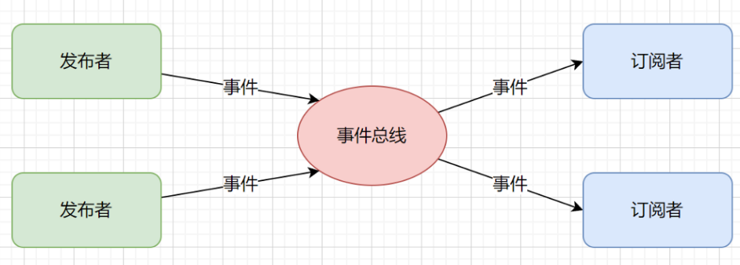
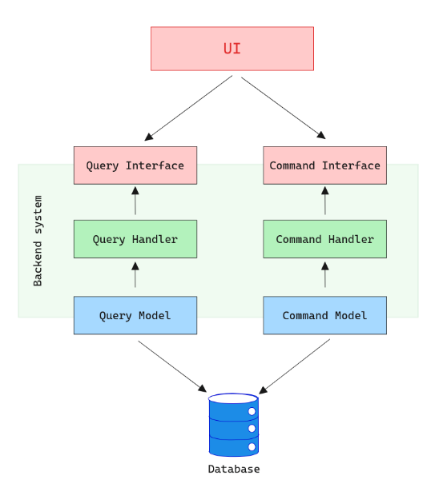
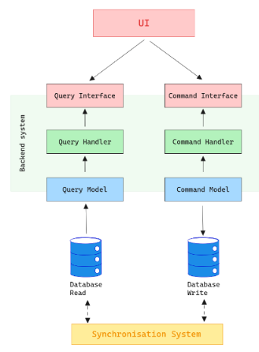
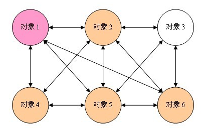
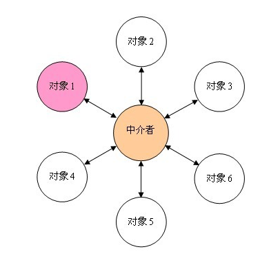

## 概念

事件总线是对发布-订阅模式的一种实现，是一种集中式事件处理机制，允许不同的组件之间进行彼此通信而又不需要相互依赖，达到一种解耦的目的。

什么是“总线”：一个集中式的事件处理机制。同时服务多个事件和多个观察者。相当于一个介于Publisher和Subscriber中间的桥梁。它隔离了Publlisher和Subscriber之间的直接依赖，接管了所有事件的发布和订阅逻辑，并负责事件的中转。



- 事件（Event）：事件是系统中某种状态的变化或者动作的抽象表示，它可以是任何需要通知其他组件的动作或变化。比如，用户点击了某个按钮、数据加载完成、系统启动等都可以是事件。
- 事件发布者（Event Publisher）：也称为事件发送者或者生产者，负责发出（发布）特定类型的事件。当某个组件的状态发生变化时，事件发布者就会生成相应的事件并将其发送到事件总线上。
- 事件订阅者（Event Subscriber）：也称为事件消费者，订阅者会监听事件总线上特定类型的事件，并在事件发生时执行相应的操作。订阅者可以选择订阅它感兴趣的事件，而忽略其他事件。
- 事件总线（Event Bus）：事件总线是事件发布者和事件订阅者之间的中介，它负责接收和分发事件。当事件发布者发布一个事件时，事件总线会将该事件传递给所有订阅了该事件类型的订阅者。

## 优缺点

- 解耦性：事件总线可以帮助组件之间实现解耦，因为它们不需要直接引用彼此来通信，而是通过发布和订阅事件来进行通信。
- 简化通信：组件之间的通信通过事件总线可以更加简单和直观。组件只需关注自己感兴趣的事件，而不需要了解其他组件的实现细节。
- 扩展性：使用事件总线可以更容易地扩展应用程序，因为新的组件可以通过订阅现有的事件来集成到系统中，而不需要修改现有的代码。

## 常见模式

命令模式（Command Pattern）：

- 在命令模式中，事件总线负责接收和调度命令对象，这些命令对象封装了要执行的操作及其参数。
- 订阅者订阅特定类型的命令，并在收到命令时执行相应的操作。
- 该模式适用于需要对操作进行封装和延迟执行的情况，例如实现撤销/重做功能。

请求-响应模式（Request-Response Pattern）

- 在请求-响应模式中，事件总线充当请求和响应之间的中介。
- 发送请求的组件发布请求事件，而处理请求的组件监听并响应该事件。
- 该模式适用于需要请求和响应之间有明确关联的情况，例如前端页面向后端服务发送请求并接收响应。

消息队列模式（Message Queue Pattern）：

- 在消息队列模式中，事件总线作为消息队列的一部分，用于在不同的组件之间传递消息。
- 发送者将消息发布到队列，而接收者则监听队列以接收消息。
- 该模式适用于需要异步处理消息、支持消息持久化和重试的情况，例如分布式系统中的任务调度和消息传递。

中介者模式（Mediator Pattern）：

- 在中介者模式中，事件总线充当中介，协调组件之间的通信，并封装组件之间的交互。
- 组件不直接通信，而是通过事件总线进行通信，使得组件之间的耦合度降低。
- 该模式适用于需要将复杂系统分解为多个独立的组件，并通过中介者来协调它们之间的交互的情况。

## 请求响应模式

## 命令查询职责分离模式（CQRS）

### 最初需求

多年来，传统的 CRUD（创建、读取、更新、删除）模式一直是系统架构的支柱。在 CRUD 中，读取和写入操作通常由相同的数据模型和相同的数据库模式处理。虽然这种方法简单直观，但随着系统规模的扩大和需求变得更加复杂，它的效率就会降低。

例如，考虑一个拥有数百万用户的大型电子商务应用程序。该系统可能面临相互冲突的需求：它需要快速读取产品详细信息、评论和用户配置文件，但它还必须有效处理数千笔交易、库存更新和订单下达。随着读取和写入操作的增长，对两者使用单一模型可能会导致瓶颈，影响性能和用户体验。

### 基础知识

CQRS 的引入是为了解决这些扩展挑战。该模式的本质就在于它的名字——命令查询职责分离。在这里，命令负责系统状态的任何更改（例如下订单或更新用户配置文件），而查询则处理数据检索，没有任何副作用。

在 CQRS 系统中，这两个操作被视为完全不同的职责，通常具有单独的数据模型、数据库，甚至单独的服务器或服务。这使得每个操作都可以独立于另一个进行调整、缩放和维护，并与每个操作的特定需求保持一致。

### 组件

- 命令

  命令是在系统内执行操作或更改的指令组件。它们的命名应反映意图和上下文，例如PlaceOrder或UpdateUserProfile。重要的是，命令应该负责更改，因此不应返回数据。进一步探索命令如何处理验证、授权和业务逻辑将阐明它们在 CQRS 模式中的角色。

- 查询
  另一方面，查询处理所有数据请求操作。重点可能在于如何构建这些来提供针对特定用例定制的优化的、非规范化的数据视图。您可以深入研究构建和优化查询服务的不同策略，以处理潜在的复杂读取模型。

处理程序充当促进命令和查询执行的代理。命令处理程序负责执行与数据突变相关的逻辑，同时确保遵守验证和业务规则。查询处理程序管理数据的检索，可能涉及复杂的聚合或连接以形成请求的读取模型。

### 单数据库和双数据库

**单数据库**

在此模型中，命令和查询操作都在单个数据库上执行，但具有不同的模型或模式。即使这两个操作共享相同的物理存储，它们也可能使用针对其特定要求而优化的不同表、视图或索引。

它可以表示如下：



优点

- 简化基础设施并减少开销
- 立即一致性，因为写入和读取操作之间没有延迟

#### 缺点

- 在大量并发操作期间，共享资源仍然可能成为瓶颈。
- 独立调整和缩放操作的灵活性较低

**双数据库**

在这里，命令和查询操作完全分开，使用两个不同的数据库或存储系统。写数据库专用于处理命令，而读数据库则服务于查询操作。必须添加手柄同步系统。

它可以表示如下：



优点
每个操作的单独调整、缩放和优化

每个数据库有可能托管在不同的服务器或服务上，分配负载；数据库解决方案也可能有所不同，以便为特定需求提供更多的模块化。

缺点
为确保两个数据库之间的数据一致性带来了复杂性

需要同步机制来桥接写入和读取数据库之间潜在的错位或延迟：例如，写入操作可能会更新命令数据库，但读取数据库可能不会立即反映这些更改。为了解决这个问题，同步技术的范围可以从简单的轮询到更复杂的方法，例如事件源，其中修改被捕获为一系列事件并重放以更新读取的数据库。

### 优缺点

优点

- 性能优化：通过分离读写逻辑，可以独立扩展和优化各个方面。例如，如果系统读取量很大，您可以分配更多资源来处理查询，而不会因写入操作的需求而陷入困境。
- 灵活性和可扩展性：通过单独的读取和写入模型，可以更轻松地在一个模型中引入更改，而不会影响另一个模型。这种隔离不仅可以实现更敏捷的开发和更轻松的可扩展性，还可以针对与急切实体加载相关的常见问题提供保护。通过明确地处理读取和写入，可以优化系统以避免不必要的数据加载，从而提高性能并减少资源消耗。
- 简化的代码库：分离命令和查询逻辑可以使代码库更易于维护且不易出错。每个模型都有明确的职责，减少了由于相互交织的逻辑而引入错误的可能性。

权衡

- 数据一致性：由于读写模型可能不同，实现数据一致性可能具有挑战性。CQRS 通常与“最终一致性”模型齐头并进，这可能并不适合所有应用程序。
- 复杂性开销：引入 CQRS 会增加复杂性，尤其是与事件溯源等其他模式配合使用时。评估所获得的好处是否超过增加的复杂性至关重要。
- 增加开发工作量：拥有独立的读写模型本质上意味着维护系统的两个不同部分。这会增加初始开发工作量以及持续的维护开销。

## 实战

代码参考：

CQRS文件夹：按照CQRS模式编码，该方式表示层与业务层会有强耦合性

CQRS_MediatR文件夹：使用MediatR框架实现CQRS（CQRS实际使用的是事件总线的发布订阅模式，一对多）

Request_Response文件夹：使用MediatR框架实现请求响应模式（一对一）

EventBus_DotNETCAP文件夹：使用MediatR和CAP框架实现CQRS模式

## 相关框架

### Mediat

#### 什么是MediatR

MediatR是一款基于中介者模式的思想而实现的.NET库，支持.NET Framework和跨平台 的.NET Core。主要是为了解决进程内消息发送与消息处理过程之间的耦合问题。MediatR的作者是Jimmy Bogard，如果你不知道这个人，想必你也用过他开发的AutoMapper吧。

它通过一种进程内消息传递机制（无其他外部依赖），进行请求/响应、命令、查询、通知和事件的消息传递，并通过泛型来支持消息的智能调度。

MediatR有两种消息处理模式：

- Request/Response模式：请求响应模式，一对一，消息（Message）将被单个处理者（Handler）处理，可以有返回值
- Notifictaion模式：发布订阅模式，一对多，Message可以被多个Handler处理，无返回值

#### 为什么使用中介者模式？

在现实生活中，中介者的存在是不可缺少的，比如房屋中介、招聘平台等；网络世界中有很多中介者模式的身影，例如QQ游戏平台，聊天室、QQ群和短信平台。

在软件设计领域，为什么要使用中介者模式呢？如果不使用中介者模式的话，各个同事对象将会相互进行引用，如果每个对象都与多个对象进行交互时，将会形成如下图所示的网状结构。



从上图可以发现，如果不使用中介者模式的话，每个对象之间过度耦合，这样的既不利于类的复用也不利于扩展。如果引入了中介者模式，那么对象之间的关系将变成星型结构，采用中介者模式之后会形成如下图所示的结构：



中介者模式使之前的网状结构，现在变成了以中介者为中心的星星结构。这样的设计大大减少了系统的耦合度。

中介者就像一个容器的，它自己把控着整个流程，和每一个对象都有或多或少，或近或远的联系，多个对象之间不用理睬其他对象发生了什么，只是负责自己的模块就好，然后把消息发给中介者，让中介者再分发给其他的具体对象，从而实现通讯 —— 这个思想就是中介者的核心思想，而且也是DDD领域驱动设计的核心思想之一。

#### MediatR的应用场景

以下是 MediatR 的一些适用场景：

- CQRS（Command and Query Responsibility Segregation，命令查询责任分离）：MediatR 可以用于实现 CQRS 架构的命令与查询分离。通过将命令和查询封装为不同的请求对象，并使用中介者模式来处理这些请求，可以更好地组织和管理复杂的业务逻辑。
- 事件驱动架构（Event-Driven Architecture）：MediatR 可以用于实现事件的发布和订阅模式。通过定义和处理事件通知，可以实现松耦合的组件间通信，以及更灵活的系统扩展和异步处理。
- 插件化和扩展性：MediatR 可以用于实现插件化和可扩展的应用程序架构。通过定义通用的请求和处理逻辑，并利用中介者模式将请求和处理解耦，可以方便地添加、移除和替换各种功能模块。
- 视图模型更新（View Model Updates）：MediatR 可以用于处理视图模型的更新操作。通过定义更新请求和相应的处理器，可以实现对视图模型的增、删、改等操作，并在更新完成后及时通知相关组件进行界面更新。
- 领域事件和领域命令：MediatR 可以用于处理领域事件和领域命令。通过定义相应的事件和命令，并使用中介者模式进行处理，可以有效地组织和管理领域逻辑，并实现解耦、可测试和可扩展的领域模型。
  总体而言，MediatR适用于需要解耦请求和处理逻辑的场景，能够提高代码的可读性、可维护性和可扩展性。它可以与其他架构模式（如CQRS、事件驱动架构等）结合使用，以满足不同的业务需求和系统设计要求

### 使用

> 开发环境：
>
> 平台版本是：.NET8
> 开发框架：ASP.NET Core WebApi
> 开发工具：Visual Studio 2022

**请求响应模式**

此案例，演示一个游戏管理模块的“添加游戏”这个功能。

- 创建一个“添加游戏”请求消息类，需要实现IRequest,或IRequest< T > 接口

  ```C#
      //Request类，string是处理者响应的数据类型
      public class AddGameRequest : IRequest<string>
      {
          public int GameId { get; set; }
          public string GameName { get; set; }
          public string GameType { get; set; }
      }
  ```

  

- 创建一个消息处理器对象，需实现 IRequestHandler<AddGameRequest , string>接口

  ```C#
      //Handler类型，PingRequest是其处理的请求类型，string是处理者响应的数据类型
      public class AddGameRequestHandler : IRequestHandler<AddGameRequest, string>
      {
          /// <summary>
          /// 处理AddGameRequest请求，返回string类型的响应
          /// </summary>
          /// <param name="request">请求对象</param>
          /// <param name="cancellationToken">取消令牌</param>
          /// <returns></returns>
          public Task<string> Handle(AddGameRequest request, CancellationToken cancellationToken)
          {
              //做如下的一些处理：（代码略）
              //验证输入的参数是否正确
              //可能还要做名称的唯一性判断
              //根据Request来创建一个实体对象
              //用仓储把他保存到数据库中
  
              return Task.FromResult("添加游戏成功！");
          }
      }
  ```

  

- 在服务容器中注册AddGameRequestHandler

  ```C#
              //在Program.cs 注册AddGameRequestHandler 
              builder.Services.AddMediatR(configuration =>
              {
                 //Handle所在程序集名称 configuration.RegisterServicesFromAssembly(Assembly.Load("WebApplication5"));
              });
  ```

  

- 在控制器方法中用Mediator的Send方法发送请求，对应的Request请求将由注册过的Handler来处理。

  ```C#
      [Route("api/[controller]")]
      [ApiController]
      public class GameController : ControllerBase
      {
          //构造函数注入Mediator
          private readonly IMediator _mediator;
  
          //构造方法
          public GameController(IMediator mediator)
          {
              _mediator = mediator;
          }
  
          /// <summary>
          /// 添加游戏的接口方法
          /// </summary>
          /// <returns></returns>
          [HttpPost]
          public async Task<IActionResult> Add()
          {
              AddGameRequest request = new AddGameRequest()
              {
                  GameName = "DNF",
                  GameType = "角色扮演"
              };
              var response = await _mediator.Send(request);
              return Ok(response);
          }
      }
  ```

  > 问题：Swagger可以正常运行，但是通过url：https://localhost:7064/api/Game则返回405（HttpPost修改未HttpGet则可以正常运行）
  >
  > 原因：url只能访问Get请求，Post请求则需要使用Postman

 **发布/订阅模式**

- 创建一个通知对象，必须继承INotification接口

  ```C#
      public class DomainNotification : INotification
      {
          public DomainNotification(string message)
          {
              Message = message;
          }
  
          public string Message { get; set; }  //通知的消息
      }
  ```

  

- 创建两个消息处理器

  ```C#
      //步骤二：创建一个消息处理器
      public class DomainNotificationHandler : INotificationHandler<DomainNotification>
      {
          /// <summary>
          /// 处理消息
          /// </summary>
          /// <param name="notification"></param>
          /// <param name="cancellationToken"></param>
          /// <returns></returns>
          public Task Handle(DomainNotification notification, CancellationToken cancellationToken)
          {
              Console.WriteLine("{0} 被消息处理器DomainNotificationHandler处理了！！", notification.Message);
              return Task.CompletedTask;
          }
      }
  
      //步骤二：创建另一个消息处理器
      public class AnotherNotificationHandler : INotificationHandler<DomainNotification>
      {
          /// <summary>
          /// 处理消息
          /// </summary>
          /// <param name="notification"></param>
          /// <param name="cancellationToken"></param>
          /// <returns></returns>
          public Task Handle(DomainNotification notification, CancellationToken cancellationToken)
          {
              Console.WriteLine("{0} 被消息处理器AnotherNotificationHandler处理了！！", notification.Message);
              return Task.CompletedTask;
          }
      }
  ```

  

- 通过 中介者对象 发布通知消息（发布订阅模式）

  ```C#
      [Route("api/[controller]")]
      [ApiController]
      public class PingController : ControllerBase
      {
          private readonly IMediator _mediator;
  
          //构造方法
          public PingController(IMediator mediator)
          {
              _mediator = mediator;
          }
  
          /// <summary>
          ///  测试方法
          /// </summary>
          /// <returns></returns>
          [HttpPost]
          public async Task<IActionResult> TestNotification()
          {
              ////发送请求消息 AddGameRequest
              //AddGameRequest request = new AddGameRequest()
              //{
              //    GameName = "DNF",
              //    GameType = "角色扮演"
              //};
              //var response = await _mediator.Send(new AddGameRequest());
              //return Ok(response);
  
              //将通知消息广播出去，订阅了DomainNotification的Handler都能够响应
              await _mediator.Publish(new DomainNotification("添加成功"));
              return Ok();
          }
      }
  ```

  

其他框架：

[NServiceBus](https://particular.net/nservicebus), [Brighter](https://www.goparamore.io/), [MassTransit](https://masstransit-project.com/), [Rebus](https://github.com/rebus-org/Rebus)。

