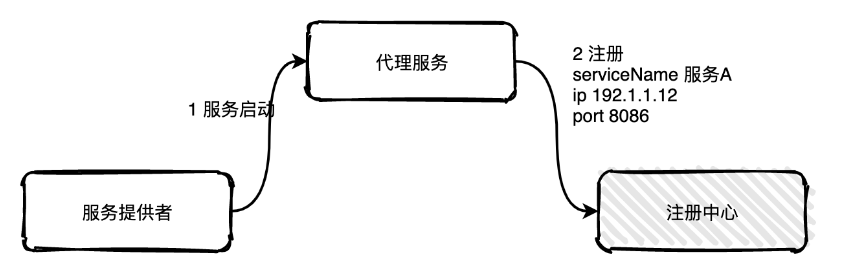
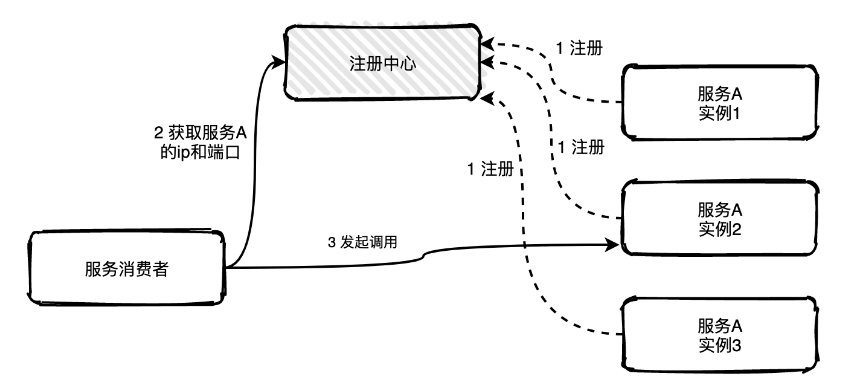
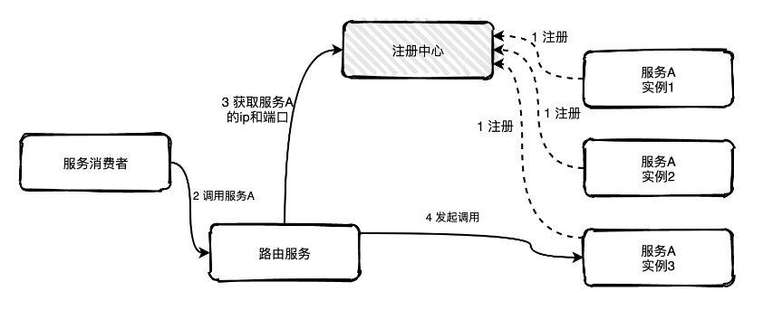
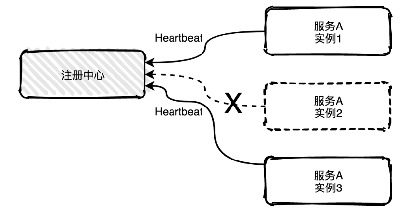
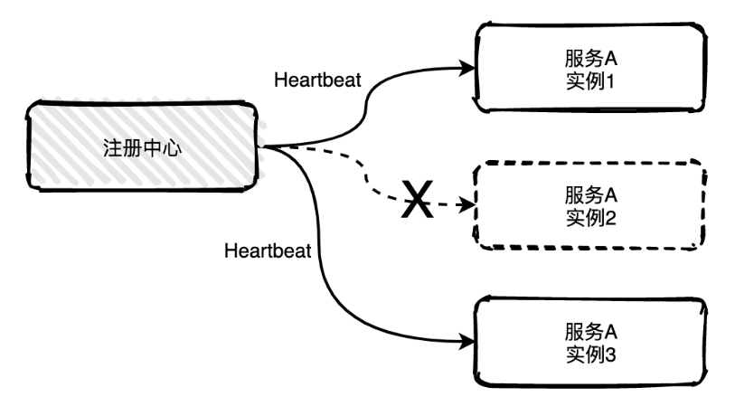
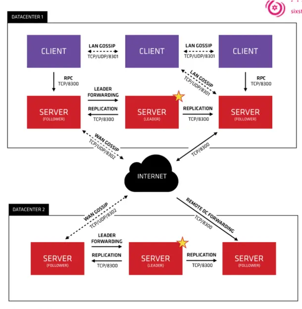

# 服务注册与发现

## 为什么使用服务发现

- 防止硬编码、容灾、水平扩缩容、提高运维效率等等，只要你想使用服务发现总能找到合适的理由。
- 一般的说法是因为使用微服务架构。传统的单体架构不够灵活不能很好的适应变化，从而向微服务架构 进行转换。
- 而伴随着大量服务的出现，管理运维十分不便，于是开始搞一些自动化的策略，服务发现应运而生。所 以如果需要使用服务发现，你应该有一些对服务治理的痛点。
- 但是引入服务发现就可能引入一些技术栈，增加系统总体的复杂度，如果你只有很少的几个服务，比如 10 个以下，并且业务不怎么变化，吞吐量预计也很稳定，可能就没有必要使用服务发现。

## 核心机制

两种形式：客户端发现、服务端发现（适合大型项目或异构项目）

## 基本原理

服务注册与发现是分为注册和发现两个关键的步骤。

**服务注册**：服务进程在注册中心注册自己的元数据信息。通常包括主机和端口号，有时还有身份验证信息，协议，版本号，以及运行环境的信息。

**服务发现**：客户端服务进程向注册中心发起查询，来获取服务的信息。服务发现的一个重要作用就是提供给客户端一个可用的服务列表。

## 服务注册

服务注册有两种形式：客户端注册和代理注册。

### 客户端注册

客户端注册是服务自己要负责注册与注销的工作。当服务启动后注册线程向注册中心注册，当服务下线时注销自己。


这种方式的缺点是注册注销逻辑与服务的业务逻辑耦合在一起，如果服务使用不同语言开发，那需要适配多套服务注册逻辑。

### 代理注册

代理注册由一个单独的代理服务负责注册与注销。当服务提供者启动后以某种方式通知代理服务，然后代理服务负责向注册中心发起注册工作。



这种方式的缺点是多引用了一个代理服务，并且代理服务要保持高可用状态。

## 服务发现

服务发现也分为客户端发现和代理发现。

### 客户端发现

客户端发现是指客户端负责向注册中心查询可用服务地址，获取到所有的可用实例地址列表后客户端根据负载均衡算法选择一个实例发起请求调用。



这种方式非常直接，客户端可以控制负载均衡算法。但是缺点也很明显，获取实例地址、负载均衡等逻辑与服务的业务逻辑耦合在一起，如果服务发现或者负载平衡有变化，那么所有的服务都要修改重新上线。

### 代理发现

代理发现是指新增一个路由服务负责服务发现获取可用的实例列表，服务消费者如果需要调用服务A的一个实例可以直接将请求发往路由服务，路由服务根据配置好的负载均衡算法从可用的实例列表中选择一个实例将请求转发过去即可，如果发现实例不可用，路由服务还可以自行重试，服务消费者完全不用感知。



## 心跳机制

如果服务有多个实例，其中一个实例出现宕机，注册中心是可以实时感知到，并且将该实例信息从列表中移出，也称为摘机。

如何实现摘机？业界比较常用的方式是通过心跳检测的方式实现，心跳检测有**主动**和**被动**两种方式。

### 被动检测

指服务主动向注册中心发送心跳消息，时间间隔可自定义，比如配置5秒发送一次，注册中心如果在三个周期内比如说15秒内没有收到实例的心跳消息，就会将该实例从列表中移除。



图中服务A的实例2已经宕机不能主动给注册中心发送心跳消息，15秒之后注册就会将实例2移除掉。

### 主动检测

注册中心主动发起，每隔几秒中会给所有列表中的服务实例发送心跳检测消息，如果多个周期内未发送成功或未收到回复就会主动移除该实例。



## 常用组件对比

我们对业内几种比较常见的注册中心做了介绍：Eureka、Zookeeper、Consul、Etcd。

并且在各个指标上做了对比：注册方式（watch\polling）、健康检查、雪崩保护、安全与权限，以及在Spring Cloud、Dubbo、Kubernets上的支持程度。方便我们在不同的场景下做正确的技术选型。

| **指标**           | **Eureka**        | **Zookeeper**           | **Consul**          | **Etcd**            |
| ------------------ | ----------------- | ----------------------- | ------------------- | ------------------- |
| 一致性协议         | AP                | CP（Paxos算法）         | CP（Raft算法）      | CP（Raft算法）      |
| 健康检查           | TTL(Time To Live) | TCP Keep Alive          | TTL\HTTP\TCP\Script | Lease TTL KeepAlive |
| watch/long polling | 不支持            | watch                   | long polling        | watch               |
| 雪崩保护           | 支持              | 不支持                  | 不支持              | 不支持              |
| 安全与权限         | 不支持            | ACL                     | ACL                 | RBAC                |
| 是否支持多数据中心 | 是                | 否                      | 是                  | 否                  |
| 是否有管理界面     | 是                | 否（可用第三方ZkTools） | 是                  | 否                  |
| Spring Cloud 集成  | 支持              | 支持                    | 支持                | 支持                |
| Dubbo 集成         | 不支持            | 支持                    | 支持                | 不支持              |
| K8S 集成           | 不支持            | 不支持                  | 支持                | 支持                |

## Consul

### 初识consul

Consul 是 HashiCorp 公司推出的开源工具，由 go 语言开发，部署起来非常容易，只需要极少的可执行程序和配置文件，非常轻量，用于**实现分布式系统的服务发现与配置的解决方案**

常用的服务发现框架有：zookeeper、 etcd、Consul 

consul 的一些特性：

- 服务发现
  - Consul 提供了通过 DNS 或者 HTTP 接口的方式来注册服务和发现服务
  - 一些外部的服务通过 Consul 找到它所依赖的服务
- 健康检查
  - Consul 的 Client 可以提供任意数量的健康检查，既可以与业务相关联（是否返回200 状态码）也可以与本地节点相关联（cpu 使用率等）
- KV 存储
  - Consul 提供了简单的http接口，可以实现动态配置、功能标记、领袖选举等功能
- 安全服务通信
  - 可以为服务生成和分发 TLS 证书，以便建立 TLS 连接
- 多数据中心
  - consul 集群由多个 server 和 client 组成，所有的服务都可以注册到这些节点上

### 架构



- 首先Consul支持多数据中心，在上图中有两个DataCenter，他们通过Internet互联，同时请注意为了提高通信效率，只有Server节点才加入跨数据中心的通信。
- 在单个数据中心中，Consul分为Client和Server两种节点（所有的节点也被称为Agent），Server节点保存数据，Client负责健康检查及转发数据请求到Server；Server节点有一个Leader和多个Follower，Leader节点会将数据同步到Follower，Server的数量推荐是3个或者5个，在Leader挂掉的时候会启动选举机制产生一个新的Leader。
- 集群内的Consul节点通过gossip协议（流言协议）维护成员关系，也就是说某个节点了解集群内现在还有哪些节点，这些节点是Client还是Server。单个数据中心的流言协议同时使用TCP和UDP通信，并且都使用8301端口。跨数据中心的流言协议也同时使用TCP和UDP通信，端口使用8302。
- 集群内数据的读写请求既可以直接发到Server，也可以通过Client使用RPC转发到Server，请求最终会到达Leader节点，在允许数据轻微陈旧的情况下，读请求也可以在普通的Server节点完成，集群内数据的读写和复制都是通过TCP的8300端口完成。

### 原理

- 首先需要有一个正常的Consul集群，有Server，有Leader。这里在服务器Server1、Server2、Server3上分别部署了Consul Server，假设他们选举了Server2上的Consul Server节点为Leader。这些服务器上最好只部署Consul程序，以尽量维护Consul Server的稳定。
- 然后在服务器Server4和Server5上通过Consul Client分别注册Service A、B、C，这里每个Service分别部署在了两个服务器上，这样可以避免Service的单点问题。服务注册到Consul可以通过HTTP API（8500端口）的方式，也可以通过Consul配置文件的方式。Consul Client可以认为是无状态的，它将注册信息通过RPC转发到Consul Server，服务信息保存在Server的各个节点中，并且通过Raft实现了强一致性。
- 最后在服务器Server6中Program D需要访问Service B，这时候Program D首先访问本机Consul Client提供的HTTP API，本机Client会将请求转发到Consul Server，Consul Server查询到Service B当前的信息返回，最终Program D拿到了Service B的所有部署的IP和端口，然后就可以选择Service B的其中一个部署并向其发起请求了。如果服务发现采用的是DNS方式，则Program D中直接使用Service B的服务发现域名，域名解析请求首先到达本机DNS代理，然后转发到本机Consul Client，本机Client会将请求转发到Consul Server，Consul Server查询到Service B当前的信息返回，最终Program D拿到了Service B的某个部署的IP和端口。


### 服务注册

consul支持两种方式实现服务注册，一种是通过consul的服务注册http API，由服务自己调用API实现注册，另一种方式是通过json个是的配置文件实现注册，将需要注册的服务以json格式的配置文件给出。consul官方建议使用第二种方式。

使用Consul命令注册服务如下:

环境准备：

三台测试机：196.168.1.101、196.168.1.102、196.168.1.103

在196.168.1.101启动Consul、在每台主机上启动测试服务

```shell
#启动Consul服务
#说明：consul agent -dev  只能本地可以访问
#要想通过ip可以访问，使用下面的使用即可
consul agent -dev -client 0.0.0.0 -ui

#在196.168.1.101、196.168.1.102、196.168.1.103启动服务
#注意：引入测试服务必须引入健康检查中间件
dotnet YY.Sample.HttpApi.dll --urls=http://192.168.1.101
dotnet YY.Sample.HttpApi.dll --urls=http://192.168.1.102
dotnet YY.Sample.HttpApi.dll --urls=http://192.168.1.103

#注册服务
#sample-service.json为配置文件
consul services register sample-service.json
```

通过http://192.168.1.102:8500/查看服务是否注册成功

```json
//sample-service.json
{
  "services": [
    {
      "ID": "sample-service-1",
      "Name": "sample-service",
      "Address": "192.168.1.101",
      "Port": 80,
      "Check": {
        "DeregisterCriticalServiceAfter": "20s",
        "HTTP": "http://192.168.1.101/health",
        "Interval": "5s"
      }
    },
    {
      "ID": "sample-service-2",
      "Name": "sample-service",
      "Address": "192.168.1.102",
      "Port": 80,
      "Check": {
        "DeregisterCriticalServiceAfter": "20s",
        "HTTP": "http://192.168.1.102/health",
        "Interval": "5s"
      }
    },
    {
      "ID": "sample-service-3",
      "Name": "sample-service",
      "Address": "192.168.1.103",
      "Port": 80,
      "Check": {
        "DeregisterCriticalServiceAfter": "20s",
        "HTTP": "http://192.168.1.103/health",
        "Interval": "5s"
      }
    }
  ]
}
```


### 服务发现

consul支持两种方式实现服务发现，一种是通过http API来查询有哪些服务，另外一种是通过consul agent 自带的DNS（8600端口），域名是以NAME.service.consul的形式给出，NAME即在定义的服务配置文件中，服务的名称。DNS方式可以通过check的方式检查服务。

#### HTTP API方式

> 程序一般都是使用这种方式

查询服务常用的接口地址如下：

查询所有服务：
http://localhost:8500/v1/catalog/services

根据服务名称查询服务，服务名称就是在注册服务时指定的名称：
http://localhost:8500/v1/catalog/service/服务名称

当同名称的服务有多个时，可以根据Tag过滤：
http://localhost:8500/v1/catalog/service/服务名称?tag=test6688

#### DNS方式


### 服务间的通信协议

Consul使用gossip协议管理成员关系、广播消息到整个集群，他有两个gossip  pool（LAN pool和WAN pool），LAN pool是同一个数据中心内部通信的，WAN pool是多个数据中心通信的，LAN pool有多个，WAN pool只有一个。

> gossip协议原理可参照扩展资料

### ASP.NET集成负载均衡

> 参照YY.MicroService代码


#### 使用Consul命令注册服务

DNS服务发现

DNS服务默认端口53端口

Consul DNS服务默认通过8600端口提供服务

相关命令

consul members：查看Consul集群状态

consul catalog services：查看Consul集群服务

consul catalog nodes：查看Consul集群节点

consul catalog datacenters

consul services register  ***.json：通过配置文件注册服务

### DNS服务发现与负载均衡

dig命令专门用于查询DNS信息

dig @127.0.0.1 -p 8600 sample-service.service.consul  

service.service.consul 为域名

在Consul DNS服务器上安装DNS转发器，此处使用dnsmasq

dnsmasq在此处的作用是：53是默认的DNS端口，通过dnsmasq将53端口的请求转发给Consul的8600端口

配置如下：

apt install dnsmasq

//停止本地DNS解析服务，systemd-resolved只能解析本地，需要使用dnsmasq代替原有服务

system stop systemd-resolved

system disable systemd-resolved

//DNS客户端配置文件，系统在DNS解析使用的服务

unlink /etc.resolv.conf 


vim  /etc.resolv.conf 

nameserver 127.0.0.1

nameserver 114.114.114.114


vim  /etc/dnsmasq.conf 

cache-size=0

listen-address=外部ID（例如：局域网IP）；127.0.0.1


//配置上游DNS服务

vim  /etc/dnsmasq.d/10-consul

server=/consul/127.0.0.1#8600 #匹配所有以consul结尾的请求转发到8600端口


//重启服务

system restart dnsmasq


//在本地网络中查询域名

nslookup sample-service.service.consul

> DNS可以实现服务发现，但是它不稳定，实际生成环境不会使用
>
> DNS服务发现+Caddy负载均衡：类似于Nginx，服务器端的负载均衡

# 扩展

## Gossip协议

### 简介

Gossip是一种p2p的分布式协议。它的核心是在去中心化结构下，通过将信息部分传递，达到全集群的状态信息传播，传播的时间收敛在O（Log（N））以内，其中N是节点的数量。基于gossip协议，可以构建出状态一致的各种解决方案。
 一些常见的分布式协议如二阶段提交协议和 Raft 算法，你发现它们都需要全部节点或者大多数节点正常运行，才能稳定运行。而Gossip即使只有一个节点可用也能提供服务。

#### 优势

- 学习成本：实现简单
- 扩展性：允许节点的任意增加和减少，新增节点的状态最终会与其他节点一致。
- 容错：任意节点的宕机和重启都不会影响 Gossip 消息的传播，具有天然的分布式系统容错特性。可以在一定程度上避免网络分割带来的问题。
- 去中心化：无需中心节点，所有节点都是对等的，任意节点无需知道整个网络状况，只要网络连通，任意节点可把消息散播到全网。
- 性能：指数级一致性收敛。消息会以“一传十的指数级速度”在网络中传播，因此系统状态的不一致可以在很快的时间内收敛到一致。消息传播速度达到了 logN。

 Gossip协议的最大的好处是，即使集群节点的数量增加，每个节点的负载也不会增加很多，几乎是恒定的。如Consul管理的集群规模能横向扩展到数千个节点。

#### 劣势

- 消息延迟：节点随机向少数几个节点发送消息，消息最终是通过多个轮次的散播而到达全网；不可避免的造成消息延迟。
- 消息冗余：节点定期随机选择周围节点发送消息，而收到消息的节点也会重复该步骤；不可避免的引起同一节点消息多次接收，增加消息处理压力。

### 传播方式

Gossip 协议的消息传播方式主要有两种：Anti-Entropy(反熵传播)和 Rumor-Mongering(谣言传播)

#### 反熵传播

- 定义：反熵（指消除不同节点中数据的差异，提升节点间数据的相似度，降低熵值）。反熵传播：以固定的概率传播所有的数据，可用来避免因为UDP数据包丢失或者新节点的加入而导致的集群元数据不一致问题。
- 过程：集群中的节点，每隔段时间就随机选择某个其他节点，然后通过互相交换自己的所有数据来消除两者之间的差异，实现数据的最终一致性。
- 适用场景：执行反熵时，相关的节点都是已知的，而且节点数量不能太多，如果是一个动态变化或节点数比较多的分布式环境（比如在 DevOps 环境中检测节点故障，并动态维护集群节点状态），这时反熵就不适用了。
- 缺点：消息数量非常庞大，且无限制；通常只用于新加入节点的数据初始化。可以通过引入校验和（Checksum）等机制，降低需要对比的数据量和通讯消息等。

#### 谣言传播

- 定义：当一个节点有了新数据后，这个节点变成活跃状态，并周期性地联系其他节点向其发送新数据，直到所有的节点都存储了该新数据。

- 过程：

  消息只包含最新 update，谣言消息在某个时间点之后会被标记为removed，并且不再被传播。

  当一个新节点A连接到Gossip集群内的某个节点B时，A节点会将自己的信息发送给B节点，然后B节点会在集群中随机选取几个未被传染的节点，向他们广播A节点的信息（首次传染），集群中的其他节点收到A节点的信息后，又会像B节点那样广播A节点的信息给其他未被传染的节点（二次传染）。直至多次传染后，集群所有节点都收到了A节点的信息，同步完成。

- 适用场景：适合动态变化的分布式系统。

- 缺点：系统有一定的概率会不一致，通常用于节点间数据增量同步。

### 通信方式

Gossip 协议最终目的是将数据分发到网络中的每一个节点。根据不同的具体应用场景，网络中两个节点之间存在三种通信方式：推送模式、拉取模式、Push/Pull。

- Push: 节点 A 将数据 (key,value,version) 及对应的版本号推送给 B 节点，B 节点更新 A 中比自己新的数据
- Pull：A 仅将数据 key, version 推送给 B，B 将本地比 A 新的数据（Key, value, version）推送给 A，A 更新本地
- Push/Pull：与 Pull 类似，只是多了一步，A 再将本地比 B 新的数据推送给 B，B 则更新本地

如果把两个节点数据同步一次定义为一个周期，则在一个周期内，Push 需通信 1 次，Pull 需 2 次，Push/Pull 则需 3 次。虽然消息数增加了，但从效果上来讲，Push/Pull 最好，理论上一个周期内可以使两个节点完全一致。直观上，Push/Pull 的收敛速度也是最快的。

# 参考资料

使用Consul做服务发现的若干姿势：https://blog.didispace.com/consul-service-discovery-exp/

利用Dnsmasq搭建本地自有DNS服务器：https://linuxgeeks.github.io/2016/04/07/214147-%E5%88%A9%E7%94%A8Dnsmasq%E6%90%AD%E5%BB%BA%E6%9C%AC%E5%9C%B0%E8%87%AA%E6%9C%89DNS%E6%9C%8D%E5%8A%A1%E5%99%A8/

