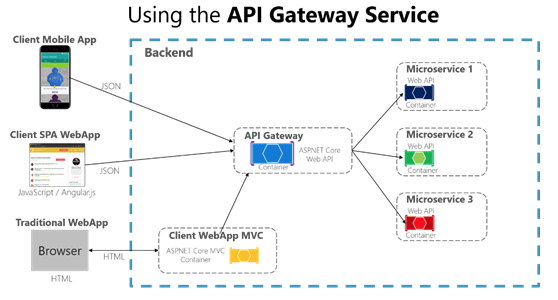
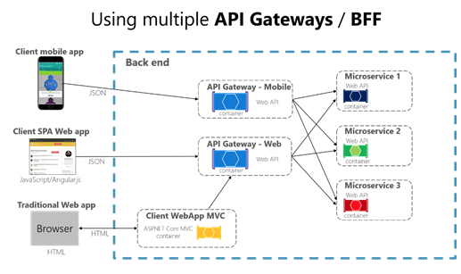
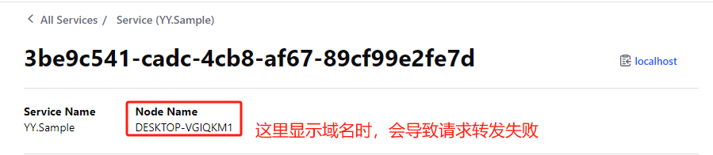

## 网关(Gateway)

在微服务架构中至关重要，可以将其理解为是外部客户端(前端、MVC后台等调用方)与后台服务的连接点，通过这层可以做统一的处理，比如路由、身份认证和授权、服务治理等；

### API之间为什么需要网关

 试想一下我们在实现一个非常庞大的业务系统，分为不同的业务domain和子系统，各个domain和子系统提供处理业务的API，不同系统之间以API的方式进行数据交互。通常情况下我们可能会将所有实现业务功能的API集成到一起（API Center）给不同的Channel的Portal提供数据处理的能力。当有一天我们的系统需要与第三方发生交互，我们既需要暴露给外部系统调用的公开API，同时也需要调用外部的API实现自身的业务需求。此时我们将会考虑很多的问题，比如：服务之间访问的授权和认证，安全和性能的监控，缓存和日志的处理，超时的Retry，负载和熔断的处理，查询请求的聚合等等一系列的问题。此时你需要一个可以集中处理所有可能在服务调用之间需要处理的一切事情，就像是小区的物业和安保一样，需要对小区所有的业主处理职责范围内的一切事情。

  这是通常情况下API网关需要帮我们处理的事情，随着系统业务的不断复杂化，我们的系统越越庞大，API的交互越来越错综复杂。此时我们可能会考虑将这个庞大的系统拆分成多个细小的domain，分别提供各自domain的API。这便是时下最流行的话题：`微服务`。当我们的系统演进到微服务的架构时，API网关将是系统必不可少的关键部分。在微服务体系结构中，客户端应用程序通常需要使用多个微服务的功能。客户端如果直接消费某服务，那通常情况下将需要处理和协调用多个微服务endpoint。当应用程序引入新的微服务或更新现有微服务时会发生什么?试想一下如果你的应用程序有许多微服务，那么处理和协调来自客户端如此多的endpoint的请求，那对系统来说是一场噩梦，而且由于客户端应用程序将与这些endpoint产生耦合，这将会使我们的系统边的混乱不堪。

  因此，我们需要一个中间层或间接层(Gateway)来处理不同client对API的请求，这将会使得我们的应用程序处理起来非常方便。如果没有API网关，客户端应用程序必须直接向微服务发送请求，这就会产生很多混乱的问题，比如：

- **耦合:** 如果没有API网关，客户端的应用程序将与内部微服务间耦合。客户端序需要知道实现业务需求的API分散在服务中的哪些部分，当我们开发和重构内部服务时，将会影响到客户端应用程序，并且很难维护，因为客户端应用程序需要跟踪多个服务的endpoint
- **多次请求:**客户端应用程序中的一个页面可能需要多次调用多个服务来完成某个功能，这可能导致客户端和服务器之间的多次往返请求，增加了显著的延迟。我们知道在中间级别处理的聚合可以提高客户端应用程序的性能和用户体验。
- **安全问题**:如果没有网关，所有的服务都必须公开给“外部世界”，这使得攻击面比隐藏内部服务更大，而这些服务不是客户端应用程序直接使用的。攻击面越小应用程序就越安全。
- **横切关注点:**每个公开发布的服务都必须处理诸如授权、SSL等问题。在许多情况下这些关注点可以在一个层中处理，这样内部服务就可以简化，类似于面向切面的编程（AOP）

### 网关模式

我们在使用多个客户端应用程序设计和构建大型或复杂的基于微服务的应用程序时，可以考虑使用API网关，这是为某些微服务组提供单一入口点的服务，它类似于面向对象设计的Facade（外观类）模式，但在微服务中它是系统的一部分。API网关模式的一个变体也称为“Backend for front-end”(BFF)，因为你可能会根据每个客户端应用程序的不同需求创建多个API网关。因此API网关位于客户端应用程序和微服务之间，它充当反向代理将请求从客户端路由到服务，它还可以提供额外的横切特性，如身份验证、SSL终止和缓存。

下面的图显示了自定义API网关如何适合于基于微服务的体系结构。



在上面的示例中，API网关将作为自定义Web API或ASP.NET WebHost服务的一个容器运行

  在该图中需要强调的是我们将使用一个面向多个不同客户端的自定义API网关服务。这可能是一个重要的风险，因为你的API网关服务将根据客户端需求的不断增长和发展，最终由于这些不同的需求，它将变得臃肿不堪，实际上它可能非常类似于单片应用程序或单片服务。这就是为什么我们非常推荐将API网关拆分为多个服务或多个更小的API网关。

  在使用API网关模式时我们也要非常小心，通常使用单个API网关聚合应用程序的所有内部微服务不是一个好的实践，因为一旦这样做了它就充当一个整体聚合器或协调器并通过耦合所有微服务来违反微服务自治。因此**API网关应该基于业务边界和客户端应用程序进行隔离，而不是作为所有内部微服务的单一聚合器**。当把API网关层分解为多个API网关时, 如果你的应用程序有多个客户端, 这可以是一个主要的枢纽来识别多个API的网关类型，这样你就可以有不同的外观类来应对每个客户端的需求。这是我们称之为“Backend for front-end”的模式(BFF)，其中每个API网关可以为每个客户端提供不同的API，甚至可能基于客户端的特定需求实现特定的适配器代码，该代码在下面调用多个内部微服务，如下图所示：



### 网关的好处

- 统一入口，调用方(客户端)不在为调哪个服务而头大，统一入口即可，由网关路由到对应后台服务；
- 统一处理公共逻辑，比如认证和授权，避免相同逻辑多处实现，易于维护；
- 对后台服务可以做负载均衡，根据指定的负载算法找到合适的后台服务调用，而这些细节调用方都不用理会，只管调就行啦；
- 初步过滤非法请求，可以根据配置的请求规则过滤掉非法请求
- 屏蔽各服务真实地址，间接保证各服务的安全；

### 网关带来的问题

- 在请求过程中，多增加了一层（网关）对请求进行处理，会消耗一些性能；
- 高并发场景，对网关性能要求高，需要开发人员要有足够的能力处理；

整体来看，在微服务架构中，网关带来的便捷和好处肯定大于自身带来的问题，所以不必纠结于此。

目前常用的网关有Kong、Tyk、Zuul、Ambassador、Ocelot等，而在.Net中比较火的是Ocelot和Kong，接下来就以Ocelot为主展开来聊聊

> Trafik：Go语言开发，使用简单，具有反向代理和负载均衡功能；可以各种基础设施集成（docker、k8s等）。内网关，内部服务的服务发现与负载均衡组件
>
> Kong：专业API网关、功能更丰富，基于Nginx+LUA开发。专注于API的管理、认证、限流
>
> Apisix：国产，基于OpenResty开发
>
> Ocelot：Net的扩展库。前三个与语言无关，不是独立的API网关组件

## Ocelot

Ocelot是一个用.NET Core实现并且开源的API网关，它功能强大，除了路由、请求聚合、负载均衡等功能外，还可以集成Consul做服务发现，集成Polly做服务治理等；相关功能只需简单的配置即可实现

### 路由

> 注意：开启VPN（Veee+）会导致请求失败

**路由**是指网关根据原始请求，匹配对应的路由配置规则，将其转发到真正的后台服务接口；这是网关的核心功能。

通过配置，实现统一入口(网关)，访问后台两个不同的服务接口，如下配置：

```json
{
  "Routes": [
    {
      "UpstreamPathTemplate": "/sample1/{url}",
      "UpstreamHttpMethod": [ "Get" ],
      "DownstreamPathTemplate": "/api/ocelota/{url}",
      "DownstreamScheme": "http",
      "Priority": 0,
      "DownstreamHostAndPorts": [
        {
          "Host": "localhost",
          "Port": 7001
        }
      ]
    },
    {
      "UpstreamPathTemplate": "/sample1/test/{url}",
      "UpstreamHttpMethod": [ "Get" ],
      "DownstreamPathTemplate": "/api/ocelotb/test/{url}",
      "DownstreamScheme": "http",
      "Priority": 1,
      "DownstreamHostAndPorts": [
        {
          "Host": "localhost",
          "Port": 7002
        }
      ]
    }
  ]
}
```

配置项解析：

- **Routes**：这是个数组，将所有请求处理都配置在里面，每一个请求处理是一个对象；

- **UpstreamPathTemplate**：上游请求路径模板；即对应调用方发出的请求，如不符合这个规则，就会被过滤掉；

- **UpstreamHttpMethod**：上游请求的方式，可以传递多个，比如["Get","Post"]；

- **DownstreamPathTemplate**：下游请求的路径模板；对应真实API的请求地址，只有符合规则，才会正常转发到服务接口上；

- **DownstreamScheme**：指定下游是http还是https；

- **DownstreamHostAndPorts**：指定下游的Host和端口，这里可以写多个，多个时可以配置负载均衡；

- **Priority：**配置优先级(Priority)，配置的值越大就越优先匹配，默认所有配置的路由优先级的值为0

  如上配置，当请求http://localhost:5230/sample1/test/say时会优先调用Priority=1的接口。

  除了设置优先级，也可以通过请求配置的顺序来决定优先调用哪个接口

- **RouteIsCaseSensitive：**是否区分匹配路由大小写

> 在配置文件中可以配置万能模板，即所有请求都会匹配到该路由模板，**但其优先级为最低，如果能匹配到其他模板，优先走其他路由**，万能模板配置如下：
>
> ```json
> 	{
>       "UpstreamPathTemplate": "/",
>       "UpstreamHttpMethod": [ "Get" ],
>       "DownstreamPathTemplate": "/",
>       "DownstreamScheme": "http",
>       "DownstreamHostAndPorts": [
>         {
>           "Host": "localhost",
>           "Port": 7001
>         }
>       ]
>     }
> ```
>
> 

### 路由聚合

#### 简单聚合

**路由聚合**就是可以将多个一般的路由(上面配置的路由就是)聚合在一起，然后将多个路由响应的结果统一返回给调用方；如下配置

```json
{
  "Routes": [
    {
      "UpstreamPathTemplate": "/sample1/{url}",
      "UpstreamHttpMethod": [ "Get" ],
      "DownstreamPathTemplate": "/api/ocelotb/{url}",
      "DownstreamScheme": "http",
      "Key": "SampleService1",
      "DownstreamHostAndPorts": [
        {
          "Host": "localhost",
          "Port": 7001
        }
      ]
    },
    {
      "UpstreamPathTemplate": "/sample2/{url}",
      "UpstreamHttpMethod": [ "Get" ],
      "DownstreamPathTemplate": "/api/ocelotb/test/{url}",
      "DownstreamScheme": "http",
      "Key": "SampleService2",
      "DownstreamHostAndPorts": [
        {
          "Host": "localhost",
          "Port": 7001
        }
      ]
    }
  ],
  "GlobalConfiguration": {
    "RouteIsCaseSensitive": false
  },
  "Aggregates": [
    {
      "RouteKeys": [
        "SampleService1",
        "SampleService2"
      ],
      "UpstreamPathTemplate": "/sample/{url}"
       //"Aggregator": "SampleAggregator" //自定义聚合方式
    }
  ]
}
```

配置说明：

- 路由配置中增加了**Key**，给需要聚合的路由分别配置一个不重复的Key值；
- 在配置文件中增加**Aggregates**节点，这个节点和Routes节点是同级的；然后在里面的**RouteKeys**中配置需要聚合的路由Key，然后再配置一个上游模板路径，配置上游模板路径时同样可以传递参数，如上图所示；

#### 自定义聚合

- 追加如下配置：

  ```json
  "Aggregator": "SampleAggregator" //自定义聚合方式
  ```

- 追加自定义聚合处理中间件SampleAggregator

  ```C#
      public class SampleAggregator : IDefinedAggregator
      {
          public async Task<DownstreamResponse> Aggregate(List<HttpContext> responseHttpContexts)
          {
              var responses = responseHttpContexts.Select(x => x.Items.DownstreamResponse()).ToArray();
              var contentList = new List<string>();
  
              foreach (var response in responses)
              {
                  var content = await response.Content.ReadAsStringAsync();
                  contentList.Add(content);
              }
  
              return new DownstreamResponse(
                  new StringContent(JsonConvert.SerializeObject(contentList)),
                  HttpStatusCode.OK,
                  responses.SelectMany(x => x.Headers).ToList(),
                  "reason");
          }
      }
  ```

- 注册对应的服务；

  ```C#
  builder.Services
      .AddOcelot()
      .AddConsul()
      .AddPolly()
      //自定义聚合方式
      .AddSingletonDefinedAggregator<SampleAggregator>()
  ```

### 负载均衡

### 集成Consul做服务发现

- 先把Consul集成到网关项目中

  引入Ocelot.Provider.Consul，并在ConfigureServices中注册相关服务组件；

- 在配置文件中增加Consul相关配置

  ```json
  {
    "Routes": [
      {
        "DownstreamPathTemplate": "/api/{url}", //下游（转发的服务地址模板）
        "DownstreamScheme": "http",
        "UpstreamPathTemplate": "/sample1/{url}", //上游（请求路径模板）
        "UpstreamHttpMethod": [ "Get", "Post" ],
        "ServiceName": "YY.Sample",
        "LoadBalancerOptions": {
          "Type": "RoundRobin" //轮询
        }
      }
    ],
    "GlobalConfiguration": {
      "BaseUrl": "http://localhost:5230",
      "ServiceDiscoveryProvider": { //consul 配置信息
        "Host": "localhost",
        "Port": 8500,
        "Type": "Consul"
      }
    }
  }
  ```

  - **GlobalConfiguration**：全局配置，其实可以理解为所有路由共用的配置放在这；
  - **ServiceDiscoveryProvider**：服务发现的相关配置，**Scheme**代表用的是http还是https；**Host**代表的是Consul启动的主机；**Port**代表Consul启动的Http端口；**Type**这里使用的是Consul这种服务发现，可以指定其他服务发现框架；
  - **BaseUrl**：这个配置主要网关对外暴露的地址，也就是调用者使用的地址；

  Routes中多了两个和一般路由不同的配置，如下：

  - **ServiceName**：指定服务名，这里是Consul注册服务时指定的服务名，根据这个名字内部可以获取到对应的Host和端口；所以有了ServiceName，就可以不用手动配置Host和端口啦；
  - **LoadBalancerOptions**：指定负载均衡算法，图中指定的是轮询，通常有以下几种：
    - **LeastConnection** 把新请求转发到请求最少的后台服务上；
    - **RoundRobin** 将请求轮询轮询转发都配置的后台服务上；
    - **NoLoadBalancer** 不负载均衡；
    - **CookieStickySessions** 使用cookie关联相关的请求到指定的服务；

  > 注意：
  >
  > consul注册的时候，Node Name为计算机名称，consul访问直接的计算机名称，而并非127.0.0.1或者localhost，导致报错，提示目标计算机积极拒绝。**同时注意你的访问协议是https还是http，本文用的全是http**
  >
  > 问题：Ocelot以主机名去访问服务，导致失败。
  >
  > 
  >
  > 解决方法：
  >
  > **第一种:**在启动consul的时候,node参数可以写成 -node=127.0.0.1
  > 如:consul agent -server -ui -bootstrap-expect=1 -data-dir=D:\Tools\consul_1.14.2_windows_386 -node=127.0.0.1 -client=0.0.0.0 -bind=127.0.0.1 -datacenter=dc1 -join 127.0.0.1
  >
  > **第二种:**在启动consul的时候,node参数可写成"hostname",在Hosts文件中对,node参数添加dns解析.
  > consul agent -server -ui -bootstrap-expect=1 -data-dir=D:\Tools\consul_1.14.2_windows_386 -node=hostname -client=0.0.0.0 -bind=127.0.0.1 -datacenter=dc1 -join 127.0.0.1
  > win7 hosts文件位置:C:\Windows\System32\drivers\etc
  >
  > 在hosts文件中添加一行"127.0.0.1 hostname",即可

### 使用缓存

#### 默认缓存

```json
{
  "Routes": [
    {
      "UpstreamPathTemplate": "/sample1/{url}",
      "UpstreamHttpMethod": [ "Get" ],
      "DownstreamPathTemplate": "/api/{url}",
      "DownstreamScheme": "http",
      "DownstreamHostAndPorts": [
        {
          "Host": "localhost",
          "Port": 7001
        }
      ],
      "FileCacheOptions": {
        "TtlSeconds": 30, //缓存有效期为30s
        "Region": "CacheRegion"//缓存区域名
      }
    }
  ]
}
```

配置说明：

- TtlSeconds：配置有效期的时间，单位为秒；
- Region：区域名，即分区缓存数据；Oeclot可以提供缓存管理接口，然后指定区域清除缓存；其实就是在Ocelot那里增加相关接口管理缓存；

#### CacheManager做缓存

CacheManager除了缓存管理外，还封装了很多功能，如事件、性能计数器、并发更新等，让开发人员更容易处理和配置缓存。这里主要演示如何集成到Ocelot使用，就不详细展开说明啦，详解请查阅官网：https://cachemanager.michaco.net/documentation。

- 引入**Ocelot.Cache.CacheManager**包；

- 注册对应的服务；

  ```C#
  builder.Services
      .AddOcelot()
      .AddConsul()    
      .AddCacheManager(x =>
      {
          //使用Dictionary方式处理
          x.WithDictionaryHandle();
      });
  ```

  

- 添加配置文件，其实就是配置**FileCacheOptions**，上一小节已经使用啦；

#### CacheManager配合Redis做分布式缓存

- 引入nuget包:

  ```json
  Ocelot.Cache.CacheManager
  CacheManager.Serialization.Json
  CacheManager.StackExchange.Redis
  ```

- 注册对应的服务；

  ```C#
  builder.Services
      .AddOcelot()
      .AddConsul()
      //注册相关服务
      .AddCacheManager(x =>
      {
          //配置Redis相关信息
          x.WithRedisConfiguration("redis", cofig =>
          {
              cofig.WithAllowAdmin()//运行管理员相关操作
              //.WithPassword("")//如果redis需要密码则配置
              .WithDatabase(10)//指定数据库索引（Redis默认有16个）
              .WithEndpoint("127.0.0.1", 6379);//指定IP+端口
          }).WithRedisCacheHandle("redis",true);//指定配置
          x.WithJsonSerializer();//指定数据序列化形式
      });
  ```

- 添加配置文件，其实就是配置**FileCacheOptions**，上一小节已经使用啦；

运行网关和服务接口，访问，同样也是每隔10秒才能获取新值，不过这次不一样的是数据在Redis中存储

#### 自定义缓存

- 自定义缓存通过继承接口**IOcelotCache**

  下面程序只是提供思路，不能直接用于项目

  ```C#
      public class CustomCacheModel
      {
  
          public string Region { get; set; }
          public TimeSpan Ttl { get; set; }
  
          public CachedResponse Response { get; set; }
      }
      public class CustomCache : IOcelotCache<CachedResponse>
      {
          /// <summary>
          /// 存储缓存的地方，可根据需求自定义
          /// </summary>
  
          private static Dictionary<string, CustomCacheModel> customCacheDic = new Dictionary<string, CustomCacheModel>();
          public void Add(string key, CachedResponse value, TimeSpan ttl, string region)
          {            
              customCacheDic[key] = new CustomCacheModel() { Region = region, Ttl = ttl, Response = value };
              Console.WriteLine("自定义缓存+Add");
          }
  
          public void AddAndDelete(string key, CachedResponse value, TimeSpan ttl, string region)
          {
              customCacheDic[key] = new CustomCacheModel() { Region = region, Ttl = ttl, Response = value };
              Console.WriteLine("自定义缓存+AddAndDelete");
          }
  
          public void ClearRegion(string region)
          {
              foreach(var cache in customCacheDic)
              {
                  if (cache.Value.Region == region)
                      customCacheDic.Remove(cache.Key);
              }
              Console.WriteLine("自定义缓存+ClearRegion");
          }
  
          public CachedResponse Get(string key, string region)
          {
              Console.WriteLine("自定义缓存+Get");
              if (customCacheDic.ContainsKey(key) && customCacheDic[key].Region == region)
                  return customCacheDic[key].Response;
              else
                  return null;
          }
      }
  ```

- 注册到容器

  ```C#
  //自定义缓存
  builder.Services
      .AddOcelot()
      .AddConsul();
  
  //注册自己的缓存类
  builder.Services.AddSingleton<IOcelotCache<CachedResponse>, CustomCache>();
  ```

- 添加配置文件，其实就是配置**FileCacheOptions**，上一小节已经使用啦；

### Polly集成

- 引入包，注册服务

  ```C#
  Ocelot.Provider.Polly
  ```

- 注册Apolly

  ```C#
  builder.Services
      .AddOcelot()
      .AddConsul()
      .AddPolly();
  ```

- 超时熔断配置

  ```json
  {
    "Routes": [
      {
        "UpstreamPathTemplate": "/sample1/{url}",
        "UpstreamHttpMethod": [ "Get" ],
        "DownstreamPathTemplate": "/api/{url}",
        "DownstreamScheme": "http",
        "DownstreamHostAndPorts": [
          {
            "Host": "localhost",
            "Port": 7001
          }
        ],
        //超时熔断配置
        "QoSOptions": {
          //允许异常次数
          "ExceptionsAllowedBeforeBreaking": 3,
          //熔断时间，这里代表3秒
          "DurationOfBreak": 5000,
          //超时时间，超过2s算超时
          "TimeoutValue": 2000
        }
      }
    ]
  }
  ```

  通过上面演示，如果超时，不让请求一直处于等待，及时反馈信息；Ocelot默认超时时间为90s。同时上面还配置了熔断机制，如果出现3次异常，就会熔断3秒。

- 限流配置

  ```json
  {
    "Routes": [
      {
        "UpstreamPathTemplate": "/sample1/{url}",
        "UpstreamHttpMethod": [ "Get" ],
        "DownstreamPathTemplate": "/api/{url}",
        "DownstreamScheme": "http",
        "DownstreamHostAndPorts": [
          {
            "Host": "localhost",
            "Port": 7001
          }
        ],
        "RateLimitOptions": {
          //白名单列表，不限制白名单客户端请求，在请求头中带上，默认名称ClientId
          "ClientWhitelist": [ "client1" ],
          //是否开启限流
          "EnableRateLimiting": true,
          //设置采样时间，这里设置的是3秒，分钟用m表示，小时用h，天用d表示
          "Period": "10s",
          //限流之后多长时间可以重试，单位为秒
          "PeriodTimespan": 10,
          //允许指定时间内可以处理的最大请求数
          "Limit": 1
        }
      }
    ],
    "GlobalConfiguration": {
      "RateLimitOptions": {
        // Http头  X-Rate-Limit 和 Retry-After 是否禁用
        "DisableRateLimitHeaders": false,
        //指定超出最大请求数时返回的消息
        "QuotaExceededMessage": "Request Limit 5",
        //指定超出最大请求时返回的Http状态码
        "HttpStatusCode": 429,
        //允许您指定应用于标识客户端的标头。默认情况下为“ClientId”
        "ClientIdHeader": "ClientId"
      }
    }
  }
  ```

### Ids4集成

**认证授权**在API项目中是不可缺少的，而对于微服务项目，每一个服务都做一次验证，显得冗余，而且后期代码维护性也不好，所以找一个公共的入口统一做认证是很不错的解决方案，而在网关上集成认证授权功能完全符合条件

- 准备一个IdentitiServer4的项目

  参考《09 框架\IdentityServer》文档

- Ocelot项目中增加认证逻辑

  ```C#
  
  // 将身份认证服务添加到DI，并将“Bearer”配置为默认方案
  // AddJwtBearer 将 JWT 认证处理程序添加到DI中以供身份认证服务使用
  builder.Services.AddAuthentication("Bearer")
      .AddJwtBearer("ApiGateway", options =>
      {
          options.Authority = "http://localhost:7010";//配置IdentityServer的授权地址
          options.RequireHttpsMetadata = false;//不需要https
          options.Audience = "YY";//api的name,需要与config的名称相同
          options.TokenValidationParameters = new TokenValidationParameters()
          {
              ValidateAudience = true
          };
      });
  ```

- 配置认证信息

  ```json
  {
    "Routes": [
      {
        "UpstreamPathTemplate": "/sample1/{url}",
        "UpstreamHttpMethod": [ "Get" ],
        "DownstreamPathTemplate": "/api/{url}",
        "DownstreamScheme": "http",
        "DownstreamHostAndPorts": [
          {
            "Host": "localhost",
            "Port": 7001
          }
        ],
        "AddHeadersToRequest": {
          "UserId": "Claims[UserId] > value",
          "UserRole": "Claims[UserRole] > value"
        },
        //声明转换
        "AddQueriesToRequest": {
          "UserId": "Claims[UserId] > value",
          "UserRole": "Claims[UserRole] > value"
        },
        //配置认证信息
        "AuthenticationOptions": {
          //对应的值与网关项目中注册服务定义的authenticationProviderKey值一致。
          //如果配置了认证信息，就会经过授权服务器进行认证校验，否则不进行验证。
          "AuthenticationProviderKey": "ApiGateway",
          "AllowedScopes": ["YY"]
        }
      }
    ]
  }
  ```

### 管理模块

Ocelot.Administration是实现管理网关自己的登录验证，主要是配置文件读取、修改、以及缓存管理

- 引用Nuget包 `install-package Ocelot.Administration`

- 在 `Program.cs` 中添加注册

  ```c#
  builder.Services
      .AddOcelot()
      .AddConsul()
      .AddPolly()
       ////参数默认为false，用来表示是否作用于全局。
       ////如果使用的是默认的false的话，那么这个DelegatingHandler是专门针对ocelot.json里面指定的一个ReRoute的    
       //.AddDelegatingHandler<AddHeaderHandler>(true);
       //Administration模块
       .AddAdministration("/admin", options =>
        {
            options.Authority = "https://localhost:7010";//认证中心的地址，Ocelot已经集成了Ids4，如果不配置则使用默认认证中心
            options.Audience = "Ocelot";
            options.TokenValidationParameters.ValidTypes = new[] { "at+jwt" };
        });
  ```

- 测试

  - 访问 `http://localhost:5230/admin/connect/token` 获取token
  - 获取配置：带着获取的Token通过GET访问 `http://localhost:5230/admin/configuration`
  - 修改配置：带着获取的Token通过POST修改 `http://localhost:5230/admin/configuration`
  - 缓存清理：带着获取的Token通过DELETE删除 `http://localhost:5230/admin/outputcache/{region}`

> 注意：
>
> Ocelot管理模块中的认证API、路由规则提供的认证API如果使用相同的认证中心，在没有配置好Ids4作用域的情况下，有可能导致访问令牌的混淆
>
> 比如：用户通过了认证中心的认证，获取了访问令牌，携带令牌请求API网关路由。这些请求首先会经过路由规则的授权，然后在经过后端，后端服务也可以进行进一步的业务授权。也就是说访问令牌只代表了用户经过了认证中心的认证，是否有权限访问还要经过授权
>
> 但是Ocelot 管理API没有提供授权，只要通过认证中心认证的合法令牌就可以访问所有Ocelot管理API
>
> 利用现有认证中心对APIScope合理规划，就可以实现隔离两种不同系统（Ocelot管理API、微服务API）
>
> APIScope：授权策略
>
> APIResouce：一个实际的API服务，包含了N个ApiScope
>
> Aud声明：表示访问令牌的受众，即这些令牌是为那些API资源准备
>
> Aud值===资源名称
>
> Ocelot管理API==一个API资源
>
> 后端微服务系统API==一个API资源
>
> 此时，认证就分为了两步：
>
> 1、进入IDS认证
>
> 2、API资源服务认证（OCelot/微服务API）再次认证

### 路由管道

- 追加自定义管道

  ```C#
      public class AddHeaderHandler : DelegatingHandler
      {
          protected override async Task<HttpResponseMessage> SendAsync(HttpRequestMessage request, CancellationToken token)
          {
              // 添加自定义头信息
              request.Headers.Add("X-Custom-Header", "HeaderValue");
  
              var response = await base.SendAsync(request, token);
  
              // 记录响应日志
              Console.WriteLine($"Response: {response.StatusCode}");
  
              return response;
          }
      }
  ```

- 依赖注入

  ```C#
  //管道配置
  builder.Services
      .AddOcelot()
      .AddConsul()
      .AddPolly()
      //参数默认为false，用来表示是否作用于全局。
      //如果是false，那么这个DelegatingHandler是专门针对ocelot.json里面指定的一个oute的   
      //如果是true，则作用于全局，无需配置ocelot.json
      .AddDelegatingHandler<AddHeaderHandler>(true);
  ```

- 配置

  ```json
  {
    "Routes": [
      {
        "UpstreamPathTemplate": "/sample1/{url}",
        "UpstreamHttpMethod": [ "Get" ],
        "DownstreamPathTemplate": "/api/{url}",
        "DownstreamScheme": "http",
        "DownstreamHostAndPorts": [
          {
            "Host": "localhost",
            "Port": 7001
          }
        ],
        //配置Ocelor自定义管道
        "DelegatingHandlers": [
          "AddHeaderHandler"
        ]
      },
      {
        "UpstreamPathTemplate": "/sample2/{url}",
        "UpstreamHttpMethod": [ "Get" ],
        "DownstreamPathTemplate": "/api/{url}",
        "DownstreamScheme": "http",
        "DownstreamHostAndPorts": [
          {
            "Host": "localhost",
            "Port": 7002
          }
        ]
      }
    ]
  }
  ```


## 参考资料

https://www.cnblogs.com/xiandnc/p/9270365.html

https://www.cnblogs.com/zoe-zyq/p/14620174.html


