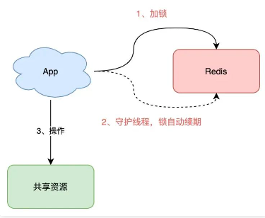
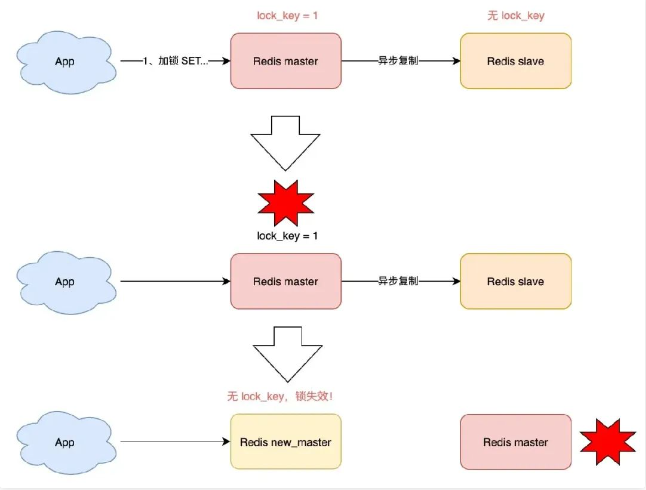
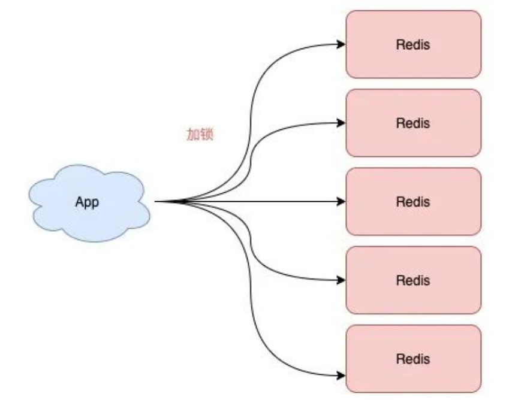
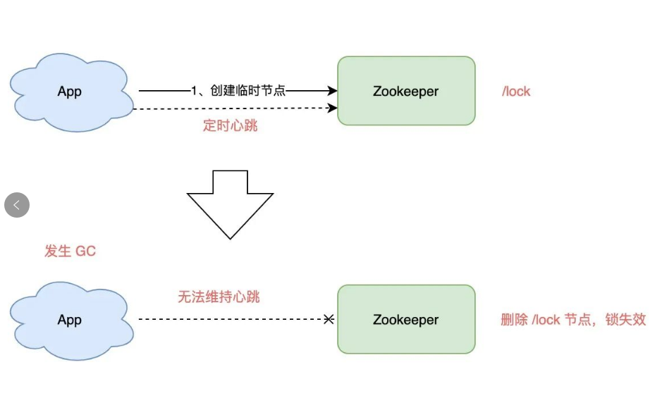

> 原文链接：[微信公众平台 (qq.com)](https://mp.weixin.qq.com/s/yZC6VJGxt1ANZkn0SljZBg)

# 分布式锁

高并发业务场景下，部署在不同机器上的业务进程，如果需要同时操作共享资源，为了避免「时序性」问题，通常会借助 Redis 的分布式锁来做互斥，以保证业务的正确性。


基于 Redis 实现的分布式锁虽然足够简单，但这把小小的分布锁究竟安全吗？有没有可能会失效？我想很少人去思考这个问题。

- 基于 Redis 如何实现一个分布式锁？它足够安全吗？
- 一个严谨的分布式锁模型如何实现，应该考虑什么？
- 我们经常听到的 Redlock 有什么问题？
- 业界争论 Redlock，到底在争论什么？哪种观点是对的？
- 分布式锁到底用 Redis 还是 ZooKeeper、Etcd？


这些问题你能清晰回答上来吗？


看过大量分布锁的文章，如果你依旧云里雾里，那么这篇文章，我来彻底给你讲清楚。


读完这篇文章，你不仅可以彻底了解分布式锁，还会对「分布式系统」有更加深刻的理解。

## 为什么需要分布式锁？

在开始讲分布式锁之前，有必要简单介绍一下，为什么需要分布式锁？

与分布式锁相对应的是「单机锁」，当我们在写多线程程序时，为了避免同时操作进程中的全局变量，通常会使用一把锁来「互斥」，以保证全局变量的正确性。

又或者，当我们在同一台机器的不同进程，想要同时操作一个共享资源（例如修改同一个文件），我们可以使用操作系统提供的「文件锁」或「信号量」来做互斥。

你可以看到，这些互斥操作，都仅限于线程、进程处于同一台机器上，如果是分布在「不同机器」上的不同进程，要同时操作一个共享资源（例如修改数据库的某一行），如何互斥呢？

此时，我们就需要引入「分布式锁」来解决这个问题了。

想要实现分布式锁，必须借助一个外部系统，所有进程都去这个系统上申请「加锁」。

而这个外部系统，必须要实现「互斥」的能力，即两个请求同时进来，只会给一个进程返回成功，另一个返回失败（或等待）。

这个外部系统，可以是 MySQL，也可以是 Redis、ZooKeeper、Etcd。但在高并发业务场景下，为了追求更好的性能，我们通常会选择使用 Redis。


下面我就以 Redis 为主线，由浅入深，带你深度剖析一下，分布式锁的各种「安全性」问题，帮你彻底理解分布式锁。

在问题分析的过程中，你还会看到分布锁在「分布式系统」下可能会遇到的疑难问题，感受分布式系统的复杂性。

## 基于Redis分布式锁如何实现

我们从最简单的开始讲起。


想要实现分布式锁，我们依赖 Redis 的「互斥」的能力，我们可以使用 SETNX 命令，这个命令表示SET if Not eXists，即如果 key 不存在，才会设置它的值，否则什么也不做。


两个客户端进程可以执行这个命令，达到互斥，就可以实现一个分布式锁。


客户端 1 申请加锁，加锁成功：

```shell
127.0.0.1:6379> SETNX lock 1
(integer) 1     // 客户端1，加锁成功
```


客户端 2 申请加锁，因为后到达，加锁失败：

```shell
127.0.0.1:6379> SETNX lock 1
(integer) 0     // 客户端2，加锁失败
```

此时，加锁成功的客户端，就可以去操作「共享资源」，例如，修改 MySQL 的某一行数据，或者调用一个 API 请求。


操作完成后，还要及时释放锁，给后来者让出操作共享资源的机会。如何释放锁呢？


也很简单，直接使用 DEL 命令删除这个 key 即可：

```shell

127.0.0.1:6379> DEL lock
 // 释放锁(integer) 1
```

这个逻辑非常简单，整体的路程就是这样：


但是，它存在一个很大的问题，当客户端 1 拿到锁后，如果发生下面的场景，就会造成「死锁」：

1. 程序处理业务逻辑异常，没及时释放锁；
2. 进程挂了，没机会释放锁。


这时，这个客户端就会一直占用这个锁，而其它客户端就「永远」拿不到这把锁了（锁饥饿）。


怎么解决这个问题呢？

## Redis分布式锁存在的问题

### 死锁问题

对于第 1 种情况，程序在处理业务逻辑时发生异常，没及时释放锁，通常我们需要对这块业务代码加上异常处理，保证无论业务逻辑是否异常，都可以把锁释放掉，例如在 Go 的 defer、Java/Python 的 finally 中及时释放锁：

- Go：defer redis.del(key)
- Java：try ... catch ... fianlly: redis.del(key)
- Python：try ... except ... fianlly: redis.del(key)


这个取决于你的业务代码的「健壮性」，比较容易解决。


对于第 2 种情况（进程挂了没机会释放锁），我们很容易想到的方案是，在申请锁时，给这把锁设置一个「租期」。


在 Redis 中实现时，就是给这个 key 设置一个「过期时间」。


这里我们假设，操作共享资源的时间不会超过 10s，那么在加锁时，给这个 key 设置 10s 过期即可：

```shell
127.0.0.1:6379> SETNX lock 1    // 加锁
(integer) 1
127.0.0.1:6379> EXPIRE lock 10  // 10s后自动过期
(integer) 1
```

还是有问题。现在的操作，加锁、设置过期是 2 条命令，有没有可能只执行了第一条，第二条却「来不及」执行的情况发生呢？例如：

1. SETNX 执行成功，执行 EXPIRE 时由于网络问题，执行失败；
2. SETNX 执行成功，Redis 异常宕机，EXPIRE 没有机会执行；
3. SETNX 执行成功，客户端异常崩溃，EXPIRE 也没有机会执行。


总之，这两条命令不能保证是原子操作（一起成功），就有潜在的风险导致过期时间设置失败，依旧发生「死锁」问题。


怎么办？在 Redis 2.6.12 版本之前，我们需要想尽办法，保证 SETNX 和 EXPIRE 原子性执行，还要考虑各种异常情况如何处理。


但在 Redis 2.6.12 之后，Redis 扩展了 SET 命令的参数，把 NX/EX 集成到了 SET 命令中，用这一条命令就可以了：

```shell
// 一条命令保证原子性执行
127.0.0.1:6379> SET lock 1 EX 10 NX
OK
```

这样就解决了原则性问题。我们再来看分析下，它还有什么问题？


试想这样一种场景：

1. 客户端 1 加锁成功，开始操作共享资源；
2. 客户端 1 操作共享资源的时间，「超过」了锁的过期时间，锁被「自动释放」；
3. 客户端 2 加锁成功，开始操作共享资源；
4. 客户端 1 操作共享资源完成，释放锁（但释放的是客户端 2 的锁）。

看到了么，这里存在两个严重的问题：

1. 锁过期：客户端 1 操作共享资源耗时太久，导致锁被自动释放，之后被客户端 2 持有；
2. 释放别人的锁：客户端 1 操作共享资源完成后，却又释放了客户端 2 的锁。


导致这两个问题的原因是什么？我们一个个来看。

### 锁过期时间问题

**第一个问题，可能是我们评估操作共享资源的时间不准确导致的。**

**
**

例如，操作共享资源的时间「最慢」可能需要 15s，而我们却只设置了 10s 过期，那这就存在锁提前过期的风险。


过期时间太短，那增大冗余时间，例如设置过期时间为 20s，这样总可以了吧？


这样确实可以「缓解」这个问题，降低出问题的概率，但依旧无法「彻底解决」问题。


为什么？原因在于，客户端在拿到锁之后，在操作共享资源时，遇到的场景有可能是很复杂的，例如，程序内部发生异常、网络请求超时等等。


既然是「预估」时间，也只能是大致计算，除非你能预料并覆盖到所有导致耗时变长的场景，但这其实很难，很多时候我们都是凭「感觉」设置过期时间，不太靠谱。


有什么更好的解决方案吗？我们可以考虑设计这样的方案：加锁时，先设置一个过期时间，然后我们开启一个「守护线程」，定时去检测这个锁的失效时间，如果锁快要过期了，操作共享资源还未完成，那么就自动对锁进行「续期」，重新设置过期时间。


担心锁过期，我们主动启动一个线程，定时给锁续期，避免还未操作完共享资源锁就自动过期被释放。


这确实是一个比较好的思路。如果你是 Java 技术栈，幸运的是，已经有一个库把这些工作都封装好了：Redisson。


Redisson 是一个 Java 语言实现的 Redis SDK 客户端，在使用分布式锁时，它就采用了「自动续期」的方案来避免锁过期，这个守护线程我们一般也把它叫做「看门狗」线程。



除此之外，这个 SDK 还封装了很多易用的功能：

- 可重入锁；
- 乐观锁；
- 公平锁；
- 读写锁；
- Redlock（红锁，下面会详细讲）。


这个 SDK 提供的 API 非常友好，它可以像操作本地锁的方式，操作分布式锁。如果你是 Java 技术栈，可以直接把它用起来。

> 这里不重点介绍 Redisson 的使用，你可以看官方 Github 学习如何使用，比较简单。

### 锁被别人释放问题

我们再来看上面提到的第二个问题，这个问题在于，**一个客户端释放了其它客户端持有的锁。**

**
**

想一下，导致这个问题的关键点在哪？


重点在于，每个客户端在释放锁时，都是「无脑」操作，并没有检查这把锁是否还「归自己持有」，所以就会发生释放别人锁的风险，这样的解锁流程，很不「严谨」！


如何解决这个问题呢？解决办法是：客户端在加锁时，设置一个只有自己知道的「唯一标识」进去。


例如，可以是自己的线程 ID，也可以是一个 UUID（随机且唯一），这里我们以 UUID 举例：

```shell
// 锁的VALUE设置为UUID
127.0.0.1:6379> SET lock $uuid EX 20 NX
OK
```

之后，在释放锁时，要先判断这把锁是否还归自己持有，伪代码可以这么写：

```shell

// 锁是自己的，才释放
if redis.get("lock") == $uuid:
    redis.del("lock")
```

这里释放锁使用的是 GET + DEL 两条命令，这时，又会遇到我们前面讲的原子性问题了。

1. 客户端 1 执行 GET，判断锁是自己的；
2. 客户端 1 执行 GET 结束后，这个锁刚好超时自动释放；
3. 此时，恰好客户端 2 又获取到了这个锁；
4. 之后，客户端 1 在执行 DEL 时，释放的却是客户端 2 的锁（冲突）。


由此可见，这两个命令还是必须要原子执行才行。怎样原子执行呢？


Lua 脚本。我们可以把这个逻辑，写成 Lua 脚本，让 Redis 来执行。因为 Redis 处理每一个请求是「单线程」执行的，在执行一个 Lua 脚本时，其它请求必须等待，直到这个 Lua 脚本处理完成，这样一来，GET + DEL 之间就不会插入其它命令了。

安全释放锁的 Lua 脚本如下：

```shell

// 判断锁是自己的，才释放
if redis.call("GET",KEYS[1]) == ARGV[1]
then
    return redis.call("DEL",KEYS[1])
else
    return 0
end
```

## Redis分布式锁小结

好，这样一路优化，整个的加锁、解锁的流程就更「严谨」了。

这里我们先小结一下，基于 Redis 实现的分布式锁，一个严谨的的流程如下：

1. 加锁：SET $lock_key $unique_id EX $expire_time NX；
2. 操作共享资源：没操作完之前，开启守护线程，定期给锁续期；
3. 释放锁：Lua 脚本，先 GET 判断锁是否归属自己，再 DEL 释放锁。


每个问题的解决方案：

- 死锁：给锁设置租期（过期时间）；
- 过期时间评估不好，锁提前过期：守护线程，定时续期；
- 锁被别人释放：锁写入唯一标识，释放锁先检查标识，再释放。


还有哪些问题场景，会危害 Redis 锁的安全性呢？

## Redis 主从同步对分布式锁的影响

我们之前分析的场景都是，锁在「单个」Redis 实例中可能产生的问题，并没有涉及到 Redis 的部署架构细节。


而我们在使用 Redis 时，一般会采用主从集群 + 哨兵的模式部署，这样做的好处在于，当主库异常宕机时，哨兵可以实现「故障自动切换」，把从库提升为主库，继续提供服务，以此保证可用性。


那当「主从发生切换」时，这个分布锁会依旧安全吗？


试想这样的场景：

1. 客户端 1 在主库上执行 SET 命令，加锁成功；
2. 此时，主库异常宕机，SET 命令还未同步到从库上（主从复制是异步的）；
3. 从库被哨兵提升为新主库，这个锁在新的主库上，丢失了！



可见，当引入 Redis 副本后，分布锁还是可能会受到影响。怎么解决这个问题？


为此，Redis 的作者提出一种解决方案，就是我们经常听到的 Redlock（红锁）。它真的可以解决上面这个问题吗？

### Redlock方案

好，终于到了这篇文章的重头戏。啊？上面讲的那么多问题，难道只是基础？

是的，那些只是开胃菜，真正的硬菜，从这里刚刚开始。如果上面讲的内容，你还没有理解，我建议你重新阅读一遍，先理清整个加锁、解锁的基本流程。


如果你已经对 Redlock 有所了解，这里可以跟着我再复习一遍，如果你不了解 Redlock，没关系，我会带你重新认识它。


值得注意的是，后面我不仅会讲 Redlock 的原理，还会引出有关「分布式系统」中的很多问题，你最好跟紧我的思路，在脑中一起分析问题的答案。

现在我们来看，Redis 作者提出的 Redlock 方案，是如何解决主从切换后，锁失效问题的。


Redlock 的方案基于 2 个前提：

1. 不再需要部署从库和哨兵实例，只部署主库
2. 但主库要部署多个，官方推荐至少 5 个实例


也就是说，想用使用 Redlock，你至少要部署 5 个 Redis 实例，而且都是主库，它们之间没有任何关系，都是一个个孤立的实例。


> 注意：不是部署 Redis Cluster，就是部署 5 个简单的 Redis 实例。



Redlock 具体如何使用呢？


整体的流程是这样的，一共分为 5 步：

1. 客户端先获取「当前时间戳T1」；
2. 客户端依次向这 5 个 Redis 实例发起加锁请求（用前面讲到的 SET 命令），且每个请求会设置超时时间（毫秒级，要远小于锁的有效时间），如果某一个实例加锁失败（包括网络超时、锁被其它人持有等各种异常情况），就立即向下一个 Redis 实例申请加锁；
3. 如果客户端从 >=3 个（大多数）以上 Redis 实例加锁成功，则再次获取「当前时间戳T2」，如果 T2 - T1 < 锁的过期时间，此时，认为客户端加锁成功，否则认为加锁失败；
4. 加锁成功，去操作共享资源（例如修改 MySQL 某一行，或发起一个 API 请求）；
5. 加锁失败，向「全部节点」发起释放锁请求（前面讲到的 Lua 脚本释放锁）。


我简单帮你总结一下，有 4 个重点：

1. 客户端在多个 Redis 实例上申请加锁；
2. 必须保证大多数节点加锁成功；
3. 大多数节点加锁的总耗时，要小于锁设置的过期时间；
4. 释放锁，要向全部节点发起释放锁请求。


> 第一次看可能不太容易理解，建议你把上面的文字多看几遍，加深记忆。
>
> 然后，记住这 5 步，非常重要，下面会根据这个流程，剖析各种可能导致锁失效的问题假设。

好，明白了 Redlock 的流程，我们来看 Redlock 为什么要这么做。

1) 为什么要在多个实例上加锁？

本质上是为了「容错」，部分实例异常宕机，剩余的实例加锁成功，整个锁服务依旧可用。

2) 为什么大多数加锁成功，才算成功？

多个 Redis 实例一起来用，其实就组成了一个「分布式系统」。

在分布式系统中，总会出现「异常节点」，所以，在谈论分布式系统问题时，需要考虑异常节点达到多少个，也依旧不会影响整个系统的「正确性」。

这是一个分布式系统「容错」问题，这个问题的结论是：如果只存在「故障」节点，只要大多数节点正常，那么整个系统依旧是可以提供正确服务的。


> 这个问题的模型，就是我们经常听到的「拜占庭将军」问题，感兴趣可以去看算法的推演过程。


3) 为什么步骤 3 加锁成功后，还要计算加锁的累计耗时？

因为操作的是多个节点，所以耗时肯定会比操作单个实例耗时更久，而且，因为是网络请求，网络情况是复杂的，有可能存在延迟、丢包、超时等情况发生，网络请求越多，异常发生的概率就越大。

所以，即使大多数节点加锁成功，但如果加锁的累计耗时已经「超过」了锁的过期时间，那此时有些实例上的锁可能已经失效了，这个锁就没有意义了。

4) 为什么释放锁，要操作所有节点？

在某一个 Redis 节点加锁时，可能因为「网络原因」导致加锁失败。

例如，客户端在一个 Redis 实例上加锁成功，但在读取响应结果时，网络问题导致读取失败，那这把锁其实已经在 Redis 上加锁成功了。

所以，释放锁时，不管之前有没有加锁成功，需要释放「所有节点」的锁，以保证清理节点上「残留」的锁。


好了，明白了 Redlock 的流程和相关问题，看似 Redlock 确实解决了 Redis 节点异常宕机锁失效的问题，保证了锁的「安全性」。但事实真的如此吗？

## Redlock的争论

Redis 作者把这个方案一经提出，就马上受到业界著名的分布式系统专家的**质疑！**

这个专家叫 Martin，是英国剑桥大学的一名分布式系统研究员。在此之前他曾是软件工程师和企业家，从事大规模数据基础设施相关的工作。他还经常在大会做演讲，写博客、写书、也是开源贡献者。


他写的这本分布式系统领域的书《数据密集型应用系统设计》，豆瓣评分高达 9.7，好评如潮。

他马上写了篇文章，质疑这个 Redlock 的算法模型是有问题的，并对分布式锁的设计，提出了自己的看法。


之后，Redis 作者 Antirez 面对质疑，不甘示弱，也写了一篇文章，反驳了对方的观点，并详细剖析了 Redlock 算法模型的更多设计细节。


而且，关于这个问题的争论，在当时互联网上也引起了非常激烈的讨论。


**二人思路清晰，论据充分，这是一场高手过招，也是分布式系统领域非常好的一次思想的碰撞！双方都是分布式系统领域的专家，却对同一个问题提出很多相反的论断，究竟是怎么回事？**


下面我会从他们的争论文章中，提取重要的观点和精华，整理呈现给你。


> 提醒：后面的信息量极大，可能不宜理解，最好放慢速度阅读。

#### 分布式专家 Martin 对于 Redlock 的质疑

在他的文章中，主要阐述了 4 个论点：


**1) 分布式锁的目的是什么？**

Martin 表示，你必须先清楚你在使用分布式锁的目的是什么？他认为有两个目的。


**第一，效率。**

使用分布式锁的互斥能力，是避免不必要地做同样的两次工作（例如一些昂贵的计算任务）。如果锁失效，并不会带来「恶性」的后果，例如发了 2 次邮件等，无伤大雅。


**第二，正确性。**

使用锁用来防止并发进程互相干扰。如果锁失效，会造成多个进程同时操作同一条数据，产生的后果是**数据严重错误、永久性不一致、数据丢失**等恶性问题，就像给患者服用重复剂量的药物一样，后果严重。


他认为，如果你是为了前者——效率，那么使用单机版 Redis 就可以了，即使偶尔发生锁失效（宕机、主从切换），都不会产生严重的后果。而使用 Redlock 太重了，没必要。


**而如果是为了正确性，Martin 认为 Redlock 根本达不到安全性的要求，也依旧存在锁失效的问题！**

**
**

**2) 锁在分布式系统中会遇到的问题**

Martin 表示，一个分布式系统，更像一个复杂的「野兽」，存在着你想不到的各种异常情况。

这些异常场景主要包括三大块，这也是分布式系统会遇到的三座大山：**NPC**。

- N：Network Delay，网络延迟；
- P：Process Pause，进程暂停（GC）；
- C：Clock Drift，时钟漂移。


Martin 用一个进程暂停（GC）的例子，指出了 Redlock 安全性问题：

1. 客户端 1 请求锁定节点 A、B、C、D、E；
2. 客户端 1 的拿到锁后，进入 GC（时间比较久）；
3. 所有 Redis 节点上的锁都过期了；
4. 客户端 2 获取到了 A、B、C、D、E 上的锁；
5. 客户端 1 GC 结束，认为成功获取锁；
6. 客户端 2 也认为获取到了锁，发生「冲突」。

Martin 认为，GC 可能发生在程序的任意时刻，而且执行时间是不可控的。


> 注：当然，即使是使用没有 GC 的编程语言，在发生网络延迟时，也都有可能导致 Redlock 出现问题，这里 Martin 只是拿 GC 举例。


**3) 假设时钟正确的是不合理的**

又或者，当多个 Redis 节点「时钟」发生问题时，也会导致 Redlock **锁失效**。

1. 客户端 1 获取节点 A、B、C 上的锁，但由于网络问题，无法访问 D 和 E；
2. 节点 C 上的时钟「向前跳跃」，导致锁到期；
3. 客户端 2 获取节点 C、D、E 上的锁，由于网络问题，无法访问 A 和 B
4. 客户端 1 和 2 现在都相信它们持有了锁（冲突）；

Martin 觉得，Redlock 必须「强依赖」多个节点的时钟是保持同步的，一旦有节点时钟发生错误，那这个算法模型就失效了。


> 即使 C 不是时钟跳跃，而是「崩溃后立即重启」，也会发生类似的问题。


Martin 继续阐述，机器的时钟发生错误，是很有可能发生的：

- 系统管理员「手动修改」了机器时钟
- 机器时钟在同步 NTP 时间时，发生了大的「跳跃」

总之，Martin 认为，Redlock 的算法是建立在「同步模型」基础上的，有大量资料研究表明，同步模型的假设，在分布式系统中是有问题的。

在混乱的分布式系统的中，你不能假设系统时钟就是对的，所以，你必须非常小心你的假设。


**4) 提出 fencing token 的方案，保证正确性**

相对应的，Martin 提出一种被叫作 fencing token 的方案，保证分布式锁的正确性。

这个模型流程如下：

1. 客户端在获取锁时，锁服务可以提供一个「递增」的 token
2. 客户端拿着这个 token 去操作共享资源
3. 共享资源可以根据 token 拒绝「后来者」的请求

这样一来，无论 NPC 哪种异常情况发生，都可以保证分布式锁的安全性，因为它是建立在「异步模型」上的。


而 Redlock 无法提供类似 fencing token 的方案，所以它无法保证安全性。


他还表示，**一个好的分布式锁，无论 NPC 怎么发生，可以不在规定时间内给出结果，但并不会给出一个错误的结果。也就是只会影响到锁的「性能」（或称之为活性），而不会影响它的「正确性」。**

**
**

Martin 的结论：

**1、Redlock 不伦不类：**它对于效率来讲，Redlock 比较重，没必要这么做，而对于正确性来说，Redlock 是不够安全的。

**2、时钟假设不合理：**该算法对系统时钟做出了危险的假设（假设多个节点机器时钟都是一致的），如果不满足这些假设，锁就会失效。

**3、无法保证正确性：**Redlock 不能提供类似 fencing token 的方案，所以解决不了正确性的问题。为了正确性，请使用有「共识系统」的软件，例如 ZooKeeper。


好了，以上就是 Martin 反对使用 Redlock 的观点，看起来有理有据。


下面我们来看 Redis 作者 Antirez 是如何反驳的。

#### Redis 作者 Antirez 的反驳

在 Redis 作者的文章中，重点有 3 个：

**1) 解释时钟问题**

首先，Redis 作者一眼就看穿了对方提出的最为核心的问题：**时钟问题。**

Redis 作者表示，Redlock 并不需要完全一致的时钟，只需要大体一致就可以了，允许有「误差」。

例如要计时 5s，但实际可能记了 4.5s，之后又记了 5.5s，有一定误差，但只要不超过「误差范围」锁失效时间即可，这种对于时钟的精度的要求并不是很高，而且这也符合现实环境。

对于对方提到的「时钟修改」问题，Redis 作者反驳到：

1. **手动修改时钟：**不要这么做就好了，否则你直接修改 Raft 日志，那 Raft 也会无法工作...
2. **时钟跳跃：**通过「恰当的运维」，保证机器时钟不会大幅度跳跃（每次通过微小的调整来完成），实际上这是可以做到的


> 为什么 Redis 作者优先解释时钟问题？因为在后面的反驳过程中，需要依赖这个基础做进一步解释。


**2) 解释网络延迟、GC 问题**

之后，Redis 作者对于对方提出的，网络延迟wan、进程 GC 可能导致 Redlock 失效的问题，也做了反驳：

我们重新回顾一下，Martin 提出的问题假设：

1. 客户端 1 请求锁定节点 A、B、C、D、E；
2. 客户端 1 的拿到锁后，进入 GC；
3. 所有 Redis 节点上的锁都过期了；
4. 客户端 2 获取节点 A、B、C、D、E 上的锁；
5. 客户端 1 GC 结束，认为成功获取锁；
6. 客户端 2 也认为获取到锁，发生「冲突」。

Redis 作者反驳到，这个假设其实是有问题的，Redlock 是可以保证锁安全的。这是怎么回事呢？


还记得前面介绍 Redlock 流程的那 5 步吗？这里我再拿过来让你复习一下。

1. 客户端先获取「当前时间戳T1」
2. 客户端依次向这 5 个 Redis 实例发起加锁请求（用前面讲到的 SET 命令），且每个请求会设置超时时间（毫秒级，要远小于锁的有效时间），如果某一个实例加锁失败（包括网络超时、锁被其它人持有等各种异常情况），就立即向下一个 Redis 实例申请加锁；
3. 如果客户端从 3 个（大多数）以上 Redis 实例加锁成功，则再次获取「当前时间戳T2」，如果 T2 - T1 < 锁的过期时间，此时，认为客户端加锁成功，否则认为加锁失败；
4. 加锁成功，去操作共享资源（例如修改 MySQL 某一行，或发起一个 API 请求）；
5. 加锁失败，向「全部节点」发起释放锁请求（前面讲到的 Lua 脚本释放锁）。


**注意，重点是 1-3，在步骤 3，加锁成功后为什么要重新获取「当前时间戳T2」？还用 T2 - T1 的时间，与锁的过期时间做比较？**

**
**

Redis 作者强调：如果在 1-3 发生了网络延迟、进程 GC 等耗时长的异常情况，那在第 3 步 T2 - T1，是可以检测出来的，如果超出了锁设置的过期时间，那这时就认为加锁会失败，之后释放所有节点的锁就好了！


Redis 作者继续论述，如果对方认为，发生网络延迟、进程 GC 是在步骤 3 之后，也就是客户端确认拿到了锁，去操作共享资源的途中发生了问题，导致锁失效，那这**不止是 Redlock 的问题，任何其它锁服务例如 ZooKeeper，都有类似的问题，这不在讨论范畴内。**

**
**

这里我举个例子解释一下这个问题：

1. 客户端通过 Redlock 成功获取到锁（通过了大多数节点加锁成功、加锁耗时检查逻辑）；
2. 客户端开始操作共享资源，此时发生网络延迟、进程 GC 等耗时很长的情况；
3. 此时，锁过期自动释放；
4. 客户端开始操作 MySQL（此时的锁可能会被别人拿到，锁失效）。


Redis 作者这里的结论就是：

- 客户端在拿到锁之前，无论经历什么耗时长问题，Redlock 都能够在第 3 步检测出来
- 客户端在拿到锁之后，发生 NPC，那 Redlock、ZooKeeper 都无能为力


所以，Redis 作者认为 Redlock 在保证时钟正确的基础上，是可以保证正确性的。


**3) 质疑 fencing token 机制**

Redis 作者对于对方提出的 fencing token 机制，也提出了质疑，主要分为 2 个问题，这里最不宜理解，请跟紧我的思路。


**第一**，这个方案必须要求要操作的「共享资源服务器」有拒绝「旧 token」的能力。


例如，要操作 MySQL，从锁服务拿到一个递增数字的 token，然后客户端要带着这个 token 去改 MySQL 的某一行，这就需要利用 MySQL 的「事务隔离性」来做。

```shell

// 两个客户端必须利用事务和隔离性达到目的
// 注意 token 的判断条件
UPDATE 
    table T 
SET 
    val = $new_val, current_token = $token 
WHERE 
    id = $id AND current_token < $toke
```

但如果操作的不是 MySQL 呢？例如向磁盘上写一个文件，或发起一个 HTTP 请求，那这个方案就无能为力了，这对要操作的资源服务器，提出了更高的要求。


也就是说，大部分要操作的资源服务器，都是没有这种互斥能力的。


再者，既然资源服务器都有了「互斥」能力，那还要分布式锁干什么？


所以，Redis 作者认为这个方案是站不住脚的。


第二，退一步讲，即使 Redlock 没有提供 fencing token 的能力，但 Redlock 已经提供了随机值（就是前面讲的 UUID），利用这个随机值，也可以达到与 fencing token 同样的效果。


如何做呢？


> Redis 作者只是提到了可以完成 fencing token 类似的功能，但却没有展开相关细节，根据我查阅的资料，大概流程应该如下。


1. 客户端使用 Redlock 拿到锁；
2. 客户端在操作共享资源之前，先把这个锁的 VALUE，在要操作的共享资源上做标记；
3. 客户端处理业务逻辑，最后，在修改共享资源时，判断这个标记是否与之前一样，一样才修改（类似 CAS 的思路）。


还是以 MySQL 为例，举个例子就是这样的：

1. 客户端使用 Redlock 拿到锁；
2. 客户端要修改 MySQL 表中的某一行数据之前，先把锁的 VALUE 更新到这一行的某个字段中（这里假设为 current_token 字段)；
3. 客户端处理业务逻辑；
4. 客户端修改 MySQL 的这一行数据，把 VALUE 当做 WHERE 条件，再修改。

```shell

UPDATE 
    table T 
SET 
    val = $new_val 
WHERE 
    id = $id AND current_token = $redlock_value
```

可见，这种方案依赖 MySQL 的事物机制，也达到对方提到的 fencing token 一样的效果。


但这里还有个小问题，是网友参与问题讨论时提出的：**两个客户端通过这种方案，先「标记」再「检查+修改」共享资源，那这两个客户端的操作顺序无法保证啊？**


而用 Martin 提到的 fencing token，因为这个 token 是单调递增的数字，资源服务器可以拒绝小的 token 请求，保证了操作的「顺序性」！


Redis 作者对于这个问题做了不同的解释，我觉得很有道理，他解释道：**分布式锁的本质，是为了「互斥」，只要能保证两个客户端在并发时，一个成功，一个失败就好了，不需要关心「顺序性」。**


> 前面 Martin 的质疑中，一直很关心这个顺序性问题，但 Redis 的作者的看法却不同。

综上，Redis 作者的结论：

**1、作者同意对方关于「时钟跳跃」对 Redlock 的影响，但认为时钟跳跃是可以避免的，取决于基础设施和运维。**

**2、Redlock 在设计时，充分考虑了 NPC 问题，在 Redlock 步骤 3 之前出现 NPC，可以保证锁的正确性，但在步骤 3 之后发生 NPC，不止是 Redlock 有问题，其它分布式锁服务同样也有问题，所以不在讨论范畴内。**


是不是觉得很有意思？

在分布式系统中，一个小小的锁，居然可能会遇到这么多问题场景，影响它的安全性！


不知道你看完双方的观点，更赞同哪一方的说法呢？


别急，后面我还会综合以上论点，谈谈自己的理解。


好，讲完了双方对于 Redis 分布锁的争论，你可能也注意到了，Martin 在他的文章中，推荐使用 ZooKeeper 实现分布式锁，认为它更安全，确实如此吗？

## 基于Zookeeper的分布式锁

如果你有了解过 ZooKeeper，基于它实现的分布式锁是这样的：

1. 客户端 1 和 2 都尝试创建「临时节点」，例如 /lock
2. 假设客户端 1 先到达，则加锁成功，客户端 2 加锁失败
3. 客户端 1 操作共享资源
4. 客户端 1 删除 /lock 节点，释放锁


ZooKeeper 不像 Redis 那样，需要考虑锁的过期时间问题，它是采用了「临时节点」，保证客户端拿到锁后，只要连接不断，就可以一直持有锁。


如果客户端 1 异常崩溃了，这个临时节点也会自动删除，保证了锁一定会被释放。


**不错，没有锁过期的烦恼，还能在异常时自动释放锁，是不是觉得很完美？**

**
**

其实不然。


思考一下，客户端 1 创建临时节点后，ZooKeeper 是如何保证让这个客户端一直持有锁呢？


原因就在于，**客户端 1 此时会与 ZooKeeper 服务器维护一个 Session，这个 Session 会依赖客户端「定时心跳」来维持连接。**


如果 ZooKeeper 长时间收不到客户端的心跳，就认为这个 Session 过期了，也会把这个临时节点删除。



同样地，基于此问题，我们也讨论一下 GC 问题对 ZooKeeper 的锁有何影响：

1. 客户端 1 创建临时节点 /lock 成功，拿到了锁；
2. 客户端 1 发生长时间 GC；
3. 客户端 1 无法给 ZooKeeper 发送心跳，ZooKeeper 把临时节点「删除」；
4. 客户端 2 创建临时节点 /lock 成功，拿到了锁；
5. 客户端 1 GC 结束，它仍然认为自己持有锁（冲突）。


可见，即使是使用 ZooKeeper，也无法保证进程 GC、网络延迟异常场景下的安全性。

这就是前面 Redis 作者在反驳的文章中提到的：如果客户端已经拿到了锁，但客户端与锁服务器发生「失联」（例如 GC），那不止 Redlock 有问题，它锁服务都有类似的问题，ZooKeeper 也是一样！


那基于 Etcd 实现的分布锁呢？

## 基于 Etcd 实现的分布锁

基于 Etcd 实现的分布式锁流程：

1. 客户端 1 创建一个 lease 租约（设置过期时间）；
2. 客户端 1 携带这个租约，创建 /lock 节点；
3. 客户端 1 发现节点不存在，拿锁成功；
4. 客户端 2 同样方式创建节点，节点已存在，拿锁失败；
5. 客户端 1 定时给这个租约「续期」，保持自己一直持有锁；
6. 客户端 1 操作共享资源；
7. 客户端 1 删除 /lock 节点，释放锁。


Etcd 虽然没有像 ZooKeeper 提供临时节点的概念，但 Etcd 提供了一个叫「租约」的概念。


我们先创建一个租约对象，并设置一定的过期时间，之后在创建节点时，把这个租约和节点进行「关联」。


之后，我们定时给这个租约进行「续期」，保证我们创建的节点一直有效，一直持有锁。


你看，这里的定时给租约续期的步骤，和上面 ZooKeeper 客户端定时给 Server 发心跳类似，其目的都是让服务端保持这个 Session 或 KV 持续有效。


所以，它依旧存在和 ZooKeeper 相同的问题：

1. 客户端 1 创建节点 /lock 成功，拿到了锁
2. 客户端 1 发生长时间 GC
3. 客户端 1 无法向 Etcd 发请求给租约「续期」
4. 租约到期，Etcd 「删除」锁节点
5. 客户端 2 创建临时节点 /lock 成功，拿到了锁
6. 客户端 1 GC 结束，它仍然认为自己持有锁（冲突）


可见，基于 Etcd 实现的分布锁，当拿到锁发生 GC、网络延迟问题，依旧可能失效。


至此，这里我们可以得出结论：**一个分布式锁，无论是基于 Redis 还是 ZooKeeper、Etcd 实现，在极端情况下，都无法保证 100% 安全，都存在失效的可能。**


如果你的业务数据非常敏感，在使用分布式锁时，一定要注意这个问题，不能假设分布式锁 100% 安全。


但为什么我们总是能听到很多人使用 ZooKeeper、Etcd 实现分布式锁呢？


因为抛开安全性，ZooKeeper 和 Etcd 相比于 Redis 实现分布锁，在功能层面有一个非常好用的特性：**Watch**。


这个 API 允许客户端「监听」ZooKeeper、Etcd 某个节点的变化，以此实现「公平」的分布式锁，篇幅原因，这里就不展开了，你可以查看文末的参考链接进一步学习。

## 我对分布式锁的理解

好了，前面详细介绍了基于 Redis 的 Redlock 和 ZooKeeper、Etcd 实现的分布锁，在各种异常情况下的安全性问题，回到 Redlock 上面来，我想和你聊一聊我对 Redlock 的看法。


**1) 到底要不要用 Redlock？**

前面也分析了，Redlock 只有建立在「时钟正确」的前提下，才能正常工作，如果你可以保证这个前提，那么可以拿来使用。


但保证时钟正确，我认为并不是你想的那么简单就能做到的。


**第一，从硬件角度来说**，时钟发生偏移是时有发生，无法避免的。

例如，CPU 温度、机器负载、芯片材料都是有可能导致时钟发生偏移。


**第二，从我的工作经历来说**，曾经就遇到过时钟错误、运维暴力修改时钟的情况发生，进而影响了系统的正确性，所以，人为错误也是很难完全避免的。


所以，我对 Redlock 的个人看法是，尽量不用它，而且它的性能不如单机版 Redis，部署成本也高，我还是会优先考虑使用 Redis「主从+哨兵」的模式，实现分布式锁。


那正确性如何保证呢？第二点给你答案。


**2) 如何正确使用分布式锁？**

在分析 Martin 观点时，它提到了 fencing token 的方案，给我了很大的启发，虽然这种方案有很大的局限性，但对于保证「正确性」的场景，是一个非常好的思路。


所以，我们可以把这两者结合起来用：

**1、使用分布式锁，在上层完成「互斥」目的，虽然极端情况下锁会失效，但它可以最大程度把并发请求阻挡在最上层，减轻操作资源层的压力。**

**2、但对于要求数据绝对正确的业务，在资源层一定要做好「兜底」，设计思路可以借鉴 fencing token 的方案来做，即在 DB 层通过版本号的方式来更新数据，避免并发冲突。**


两种思路结合，我认为对于大多数业务场景，已经可以满足要求了。

## 总结

好了，总结一下。这篇文章，我们主要探讨了基于 Redis 实现的分布式锁，究竟是否安全这个问题。


从最简单分布式锁的实现，到处理各种异常场景，再到引出 Redlock，以及两个分布式专家的辩论，引申出分布式系统 NPC 问题。


最后我们还对比了基于 ZooKeeper、Etcd 的分布式锁的安全问题，以及与 Redis 的差异。


对于分布式锁可以总结下：

- 分布式锁并不是 100% 安全，无论是基于 Redis、ZooKeeper 还是 Etcd
- 很多人用分布锁，以为拿到锁后，就可以安心地去改共享资源，认为分布锁 100% 安全，其实不然，拿到锁后面临各种异常情况，都有可能导致锁失效，这时候再去改资源，可能锁已经被别人拿到去改资源了，产生并发冲突
- 一个严谨的分布式锁模型应该考虑锁租期、锁归属、副本同步、NPC 问题
- 使用 Redis 分布锁可以最大程度把并发请求阻挡在最上层（非常适合高并发场景），但对于数据敏感的业务场景，资源层要做兜底（fencing token 的思路，类似乐观锁），两者结合起来用