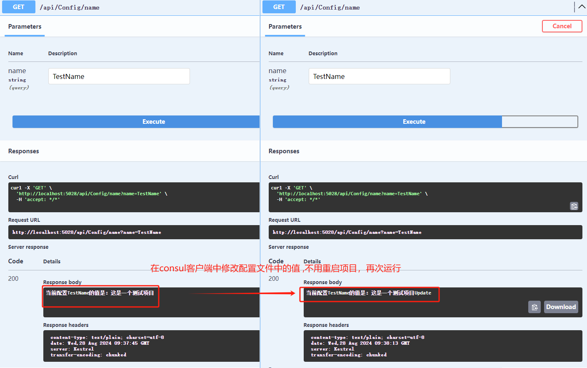

## 配置中心

配置是用来动态修改程序执行的一种行为的机制，实现热更新

### 优点

- 避免敏感信息在源代码中暴露，安全性提升
- 可以实现不重启应用就动态刷新配置
- 可以在应用间共享配置。原本只能在应用内共享配置
- 配置集中化管理，易于全局管理所有配置
- 对配置进行权限管理

### 缺点

- 如果配置服务挂了，应用会无法重启
- 不如配置放在项目中那么直观
- 多分支开发的时候，处理不当的话可能会互相影响

### 选型

- Apollo（携程）

  开发语言：Java

  依赖：MySQL

  Apollo分为MySQL，Config Service，Admin Service，Portal四个模块

  - MySQL存储Apollo元数据和用户配置数据; 
  - Config Service提供配置的读取、推送等功能，客户端请求都是落到Config Service上; 
  - Admin Service提供配置的修改、发布等功能；
  - Portal操作的服务就是Admin Service; Portal提供给用户配置管理界面;

  功能强大，社区活跃，但较为复杂，部署组件较多，运维成本比高

- Consul

  开发语言：go开发

  依赖：不依赖其他组件
  应用内/外：属于外部应用，侵入性小
  ACP原则：遵循CP原则（一致性+分离容忍） 服务注册稍慢，由于其一致性导致了在Leader挂掉时重新选举期间这个consul不可用。
  版本迭代：目前仍然进行版本迭代
  集成支持：支持K8S集成
  访问协议：HTTP/DNS
  雪崩保护：不支持雪崩保护
  自动注销实例：不支持

- Nacos（阿里巴巴）

  依赖：MySQL
  应用内/外：属于外部应用，侵入性小
  ACP原则：通知遵循CP原则（一致性+分离容忍） 和AP原则（可用性+分离容忍）
  版本迭代：目前仍然进行版本迭代，最近的提交是几天前
  集成支持：支持Dubbo 、SpringCloud、K8S集成
  访问协议：HTTP/动态DNS/UDP
  雪崩保护：支持雪崩保护

  >Consul实际上是和Nacos比较相似的产品，虽然Consul目前的主要发展方向放在了Service Mesh，但是Consul最初支持的服务发现和配置管理，也是Nacos的两大功能。虽然Nacos在Consul之后以与之相似的部署架构开源，但这并不意味着Nacos在功能和架构上也模仿Consul，Nacos的架构和功能是由阿里巴巴内部十年的运行演进经验得来，所以二者的比较也一定会让大家更加了解他们的定位和演进方向是完全不一样的。

- AgileConfig

## Consul

### 配置中心

- 引入nuget包：Winton.Extensions.Configuration.Consul

- Program文件中配置

  ```C#
  // 加载consul配置中心配置
  //多服务多个配置文件
  string consul_url = "http://localhost:8500";
  builder.Configuration.AddConsul(
      $"{builder.Environment.ApplicationName}/appsettings.json",
              options =>
              {
                  options.ConsulConfigurationOptions = cco => { cco.Address = new Uri(consul_url); }; // 1、consul地址
                  options.Optional = true; // 2、配置选项
                  options.ReloadOnChange = true; // 3、配置文件更新后重新加载
                  options.OnLoadException = exceptionContext => { exceptionContext.Ignore = true; }; // 4、忽略异常
              }
    ).AddConsul(
      $"{builder.Environment.ApplicationName}/customsettings.json",
              options =>
              {
                  options.ConsulConfigurationOptions = cco => { cco.Address = new Uri(consul_url); }; // 1、consul地址
                  options.Optional = true; // 2、配置选项
                  options.ReloadOnChange = true; // 3、配置文件更新后重新加载
                  options.OnLoadException = exceptionContext => { exceptionContext.Ignore = true; }; // 4、忽略异常
              });
  ```

  

- 在Consul客户端中新增一个key为  customsettings.json  的Json文件，追加自定义配置

  ```json
  {
    "ServiceCheck": {
      "Path": "/Health",
      "Interval": 5000,
      "Timeout": 5000,
      "Deregister": 10000
    },
    "TestName": "这是一个测试项目"
  }
  ```

  

-  在项目中新建一个读取配置的接口，方便测试，读取配置文件中的值 

  ```C#
      [Route("api/[controller]")]
      [ApiController]
      public class ConfigController(IConfiguration configuration) : ControllerBase
      {
          [HttpGet("name")]
          public IActionResult Get(string name)
          {
              return Ok($"当前配置{name}的值是：{configuration.GetSection(name)?.Value}");
          }
      }
  ```

- 测试

  

### 分布式锁

consul中锁的主要是依赖KV Store（存储锁定状态，通过绑定session实现锁定和释放）和Session（管理锁的生命周期，锁的持有者）相关API

**Session机制**

Consul提供session会话机制——可以用于构建分布式锁，session可以绑定到节点、健康检查、KV数据。目的是提供颗粒锁。

Consul session代表一个有非常具体的语义——合约，当构建一个session时，需要提供节点名称，健康检查列表，行为， TTL，锁期限。新建session返回唯一的标识ID。此ID可用于作为与KV操作的锁：互斥机制。

Consul提供的合约，发生如下任一情况，session都会被销毁：

- 节点销毁
- 任何的健康检查，注销
- 任何健康检查都要进入Critical状态
- 会话被显式销毁
- TTL到期，如果适用

**分布式锁**

步骤如下：

- 创建Session
- 加锁
- 处理共享资源
- 释放锁

代码如下：

```C#
    [Route("api/[controller]")]
    [ApiController]
    public class SessionController(IConsulClient consulClient) : ControllerBase
    {
        /// <summary>
        /// 创建锁
        /// </summary>
        /// <param name="key">共享资源的键值</param>
        /// <returns></returns>
        [HttpPost]
        public async Task<IActionResult> Create(string key)
        {
            var sessionEntry = new SessionEntry
            {
                TTL = TimeSpan.FromMinutes(1),
                LockDelay = TimeSpan.FromSeconds(1),//默认15s
                Behavior = SessionBehavior.Release //
            };
            var sessionRequest = await consulClient.Session.Create(sessionEntry);
            var sessionId = sessionRequest.Response;
            //获取失败，接口并不阻塞，如果想要加锁，需要再次发起请求
            var acquireLock = await consulClient.KV.Acquire(new KVPair(key)
            {
                Session = sessionId
            });
			
            return Ok(new {sessionId, acquireLock = acquireLock.Response});
        }


        /// <summary>
        /// 获取Session列表
        /// </summary>
        /// <returns></returns>
        [HttpGet]
        public async Task<IActionResult> Get()
        {
            var sessionRequest = await consulClient.Session.List();
            return Ok(sessionRequest.Response);
        }


        /// <summary>
        /// 释放锁
        /// </summary>
        /// <param name="key"></param>
        /// <param name="sessionId"></param>
        /// <returns></returns>
        [HttpDelete]
        public async Task<IActionResult> Delete(string key, string sessionId)
        {
            var released = await consulClient.KV.Release(new KVPair(key)
            {
                Session = sessionId
            });
            return Ok(released .Response);
        }
    }
```

- Behavior：

  当session失效后，会被销毁，不能再使用。关联的锁发生什么行为，取决于创建时指定的修饰符。Consul支持release和delete两种处理方式。如果没有指定，默认为release。

  - 如果使用了release，任何与该session相关的锁都会被释放，并且持有该锁的key的ModifyIndex也会递增。
  - 如果使用了delete，持有该锁的KEY将会被删除。

- LockDelay：为防止由于网络波动等原因，session的状态被错误的检查为`invalidate` 导致锁被释放。此时如果其它client需要加锁，则需要等待`lock-delay`，才能再次加锁成功。**(主动释放没有这个问题)**
  可以将`lock-delay`设置成0，表示不启用`lock-delay`机制

### Redis和Consul实现分布式锁的区别

**Redis分布式锁**

Redis是一种内存中的键值存储数据库，它可以将所有数据保存在内存中，因此它的读写速度非常快。Redis的分布式锁是通过SETNX命令实现的。当一个客户端发起请求时，Redis会尝试将一个特定的键值对设置为特定的值，如果该键值对已经存在，则说明锁已经被其他客户端获取，当前客户端需要等待一段时间后再进行重试。

Redis分布式锁的好处是实现简单，存储在内存中，读写速度快。但是，在分布式系统中使用Redis实现分布式锁也有一些缺点，例如：

- Redis宕机后，锁就会失效，因此需要在Redis发生故障时保证它的高可用性。
- 如果一个持有锁的客户端在没有释放锁的情况下会话失效，那么其他客户端将无法获得该锁，因此需要一些机制来解决会话失效的问题。
- 如果客户端持有锁的时间太长，会影响系统的运行效率。

**Consul分布式锁**

Consul是一种轻量级的服务注册和发现工具，它具有高可用性和健壮性。Consul提供的分布式锁是一种更加完善的解决方案，它可以有效地解决Redis分布式锁存在的一些问题，如：

- Consul的锁是基于分布式协议实现的，在Consul集群中自动选举一个锁的持有者，并且在持有者失效时重新选举锁的持有者。这保证了锁的高可用性
- Consul提供的锁也支持会话失效，并且在一个持有锁的会话失效时可以自动释放锁。这保证了锁的正确性。
- Consul提供的锁还可以设置超时时间，在锁的超时时间到达时自动释放锁，避免了长时间的持锁导致的性能问题。

## 扩展

### 惊群效应

#### 什么是惊群

惊群效应就是多个进程（线程）阻塞等待同一件事情（资源）上，当事件发生（资源可用）时，操作系统可能会唤醒所有等待这个事件（资源）的进程（线程），但是最终却只有一个进程（线程）成功获取该事件（资源），而其他进程（线程）获取失败，只能重新阻塞等待事件（资源）可用，但是这就造成了额外的性能损失。这种现象就称为惊群效应。

如果细心的你可能会问，为什么操作系统要同时唤醒多个进程呢？只唤醒一个不行吗？这样不就没有这种性能损失了吗？

确实如此，操作系统也想只唤醒一个进程，但是它做不到啊，因为它也不知道该唤醒哪一个，只好把所有等待在这件事情（资源）的进程都一起唤醒了。

那有没有办法解决呢？当然有，我们后面再说。惊群效应会造成多个进程白白唤醒而啥也做不了。那么唤醒进程损失了啥？这就涉及到进程上下文的概念。

#### 惊群造成进程切换

进程上下文包括了进程的虚拟内存，栈，全局变量等用户空间的资源，还包括内核堆栈，寄存器等内核空间的状态。

所以**进程上下文切换就首先需要保存用户态资源以及内核态资源，然后再去加载下一个进程，首先是加载了下一个进程的内核态，然后再去刷新进程的用户态空间**。然而 CPU 保存进程的用户态以及内核态资源，再去加载下一个进程的内核态和用户态是有代价的，也是耗时的，每次可能在几十纳秒到数微妙的时间，如果频繁发生进程切换，那么 CPU 将有大量的时间浪费在不断保存资源，加载资源，刷新资源等事情上，造成性能的浪费。

所以惊群效应会造成多个进程切换，造成性能损失。

#### 如何有效解决

？？？？

### 脑裂

#### 什么是脑裂

在一个高可用集群中，当多个服务器在指定的时间内，由于网络的原因无法互相检测到对方，而各自形成一个新的小规模集群，并且各小集群当中，会选举新的master节点，都对外提供独立的服务，

由于网络断裂的原因，一个高可用集群中，实际上分裂为多个小的集群，这种情况就称为裂脑。

也有的人称之为分区集群，或者大脑垂直分隔，互相接管对方的资源，出现多个Master的情况，都可以称为脑裂。

脑裂(Split-Brain)是一个形象的比喻，好比“大脑分裂”，也就是本来一个“大脑”被拆分了两个或多个“大脑”。

裂脑之后的后果是，可能会导致服务器端的数据不一致，或造成数据的丢失

#### 如何解决脑裂

**ZooKeeper**

- ZooKeeper集群节点数必须是奇数
- 选主时使用过半机制

**Elasticsearch**

？？？？

**Redis**

？？？？

### CAS操作

`CAS`全称`compare and swap`——比较并替换，它是并发条件下修改数据的一种机制，包含三个操作数：

> - 需要修改的数据的内存地址（V）；
> - 对这个数据的旧预期值（A）；
> - 需要将它修改为的值（B）；

  CAS的操作步骤如下：

> 1. 修改前记录数据的内存地址V；
> 2. 读取数据的当前的值，记录为A；
> 3. 修改数据的值变为B；
> 4. 查看地址V下的值是否仍然为A，若为A，则用B替换它；若地址V下的值不为A，表示在自己修改的过程中，其他的线程对数据进行了修改，则不更新变量的值，而是重新从步骤2开始执行，这被称为**自旋**；

## 参考资料

https://www.cnblogs.com/ibigboy/p/13425860.html#_label0

[JAVA面试题分享二百八十九：什么脑裂？_脑裂问题怎么解决java-CSDN博客](https://blog.csdn.net/qq_45038038/article/details/135023603)

[并发——详细介绍CAS机制](https://www.cnblogs.com/tuyang1129/p/12585019.html)


