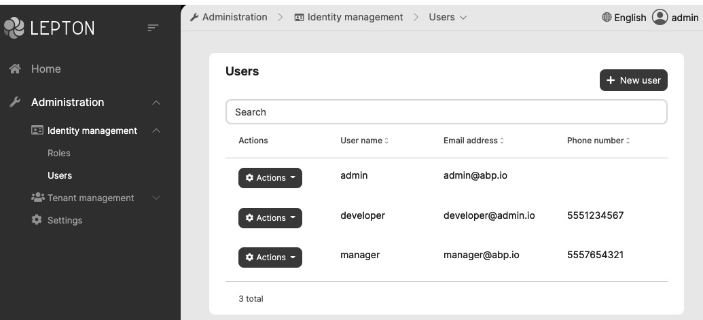
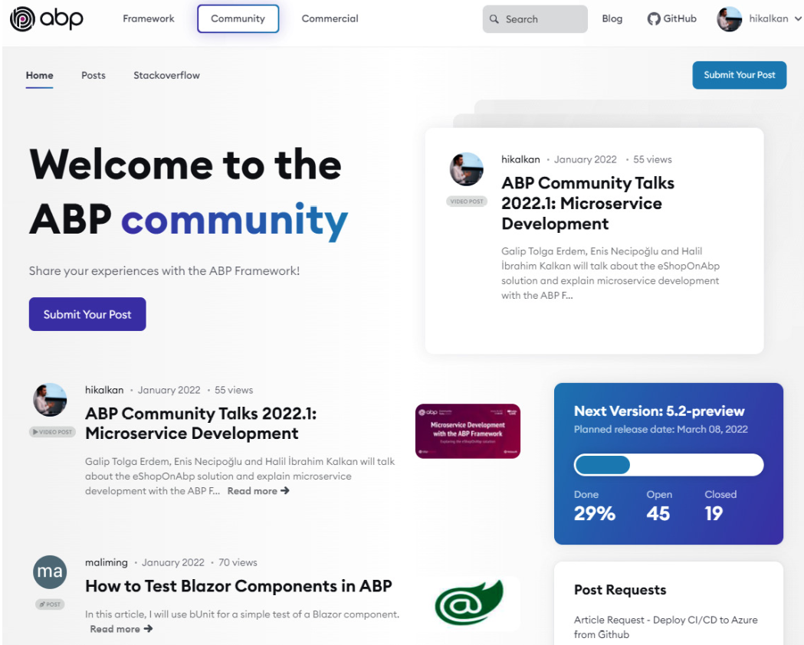

# 企业级软件开发和ABP框架

> 原文链接：https://www.cnblogs.com/jackyfei/p/16177496.html

#  1 导语

> 在开始文章之前，我给大家举一个发生在我身边的例子。我们交付的软件是面向企业的一锤子买卖，后期可能会存在个别定制化。前期我们直接按项目来走，因为我们也不知道未来的业务长什么样子，只是知道大概的范围。随着项目的增长，我们团队成员直接复制一份代码，然后修修改改就适配了一个新项目，因为认为这么做最快，因为是一次性买卖啊。所以，大家也懒得打磨，就这么交付了。大家可以脑补一下，后面会出现什么问题？具体答案在文末会有一个揭晓。

在深入挖掘ABP 框架之前，我想先介绍开发现代企业 Web 解决方案的挑战，以了解为什么我们需要ABP 框架。让我们从架构开始：

# 2 架构搭建的挑战

## 2.1 选型挑战

在开始编码之前，我们需要为解决方案创建一个适合当前和未来一段时期的架构基础。这是构建软件系统最具挑战性的阶段，在此阶段做出的任何决定都可能会影响应用程序的整个生命周期。

有一些常见的、知名的、系统级的架构模式，例如单体架构、模块化架构和微服务架构。不同的架构选型会决定后续的团队组织架构、部署和扩展，所以我们要根据需求尽量做最优的选型。

另外，软件开发模型，例如：命令和查询职责分离(CQRS)、领域驱动设计(DDD)、分层架构和清洁架构将决定您的基础代码结构。

在这个阶段，我们还需要决定将使用哪种语言、框架、工具和库。

所有这些决策都不是一件容易的事情。

> 我们思考一下：我们团队的软件架构师和开发人员具备以上这些能力和经验了吗？

现实是并非所有团队成员都具有丰富的经验和知识水平。我们需要从战略上制定标准规范，在战术上实践最佳编码。

## 2.2 重复造轮子

不要重复自己(DRY) 是软件开发的关键原则。

> 我们先思考一个问题：为什么我们在构建软件时会重复自己呢？

身份验证是每个软件都需要的功能，包括单点登录、基于令牌的身份验证、社交登录、双因素身份验证、忘记/重置密码、电子邮件激活等等，几乎所有的软件项目或多或少都有相似的身份验证需求。与其从头开始构建所有这些，不如复用现有的解决方案（例如云服务）更好，不管在实战还是安全方面都更加稳定成熟。

还有一些非功能性需求，例如异常处理、验证、授权、缓存、审计日志和数据库事务管理，是代码重复源头。这些关注点被称为横切关注点，应该在每个 Web 请求中处理。

当您集成到第三方系统（例如 RabbitMQ 和 Redis）时，您通常会创建抽象和装饰器。通过这种方式，您的业务逻辑与这些基础设施组件隔离开来。此外，您不会在系统中到处重复相同的连接、重试、异常处理和日志记录逻辑。

拥有一个预先构建的基础架构来自动执行这些重复性工作可以节省您的开发时间，以便您可以专注于您的业务逻辑。

## 2.3 UI 设计和选型

用户界面(UI)也是应用的基础。一个过时且无法使用的 UI 不会那么吸引人，即使它在幕后具有出色的商业价值。

虽然每个应用的 UI 功能和要求各不相同，但一些基本结构是常见的，例如警报、按钮、卡片、表单元素、选项卡和数据表。您可以使用 HTML/CSS 框架，例如 Bootstrap、Bulma 和 Ant Design，而不是为每个应用程序创建一个设计系统。

几乎每个 Web 应用程序都有响应式布局，主菜单、工具栏、页眉和页脚、自定义颜色等。您将需要为应用的页面和组件实现基本 UI 工具包。这样，UI 开发人员可以创建一致的 UI。

到目前为止，我们介绍了一些常见的基础架构需求，它们大多独立于任何业务应用。下面讨论常见的业务需求。

# 3 实现常见的业务需求

虽然每个应用系统是独特的，而且其价值来自于独特性，但是每个企业系统都有一些基本的配套需求。

基于权限的授权系统是这些基本要求之一。它用于控制应用的用户和客户端的权限。如果您想自己实现这一点，您应该创建一个包含数据库表、授权逻辑、权限缓存、API 和 UI 页面的端到端解决方案。但是，这样的系统非常通用，完全可以开发为可重用模块，由多个应用共同使用。

另外，许多系统需要审计日志报告、租户和订阅管理（针对 SaaS 应用）、语言管理、文件上传和共享、多语言管理和时区管理等功能。除了预先构建的应用功能之外，可能还有低级要求，例如实现软删除模式和在应用程序中存储二进制大对象(BLOB) 数据。

所有这些常见的需求都可以从头开始构建，但是这需要我们耗费巨大的成本和精力，如果你的团队没有经验丰富的架构团队，还不一定能完成得很好。如果这些功能不是公司的主要价值，我们完全可以考虑开源社区预构建的模块和库，并根据特定的要求进行定制。

# 4 ABP 框架

ABP 框架提供了一个稳定的架构用于构建企业级软件解决方案，它遵循了.NET 和 ASP.NET Core 平台之上的最佳实践。它内置了基础架构、生产级别的模块、主题、工具、指南和文档，并尽可能地自动化开发细节和解法我们的重复性工作。

在接下来的几个小节中，我将从架构层面介绍 ABP是如何完成所有这些工作。

## 4.1 ABP 架构

ABP 是一个特殊的架构，换句话说，它是一个有个性化的框架。先解释一下什么是没有个性的框架，什么是有个性的框架。

正如我在*搭建架构*部分所述，为搭建解决方案的基础设施需要大量决策工作；比如系统架构、开发模型、技术、模式、工具和库。

没有个性的框架，例如 ASP.NET Core，这些决定大多由您决定。例如，您可以通过将 UI 层与数据访问层分离来创建分层解决方案，或者您可以通过直接从 UI 页面/视图访问数据库来创建单层解决方案。您可以使用任何库，只要它与 ASP.NET Core 兼容，并且您可以应用任何架构模式。无个性使 ASP.NET Core 在不同的场景中变得灵活和可用。但是，所有的这些都需要我们自己去做决策。

我并不是说 ASP.NET Core 完全没有自己的个性想法。假定您正在构建基于 HTTP 规范的 Web 应用程序或 API。它清楚地定义了应该如何开发 UI 和 API 层。它还提供了一些低级的基础设施组件，例如依赖项注入、缓存和日志记录。但是，它并没有说明您的业务代码是应该要如何组建，应该使用哪些架构模式。

换句话说，ABP 框架是一个有个性倾向的框架。它相信软件开发方法本质上可以更好，因此可以引导开发人员在解决方案中使用更佳的架构、模式、工具和库。

尽管 ABP 框架足够灵活，可以使用不同的工具和库来改变您的架构决策，但当您遵循它的实践原则时，您将获得最大的价值。请别担心，因为它为通用架构提供了良好的、行业认可的解决方案。他的架构规则将节省您的时间，提高您的生产力，并使您专注于您的业务代码而不是基础设施问题。

在接下来，我将介绍 ABP 所支持的四种基本架构。

## 4.2 ABP四种基础架构

### 4.2.1 领域驱动设计

ABP 的主要目标是根据整洁代码原则提供一个模型来构建易维护的解决方案。它提供了一个基于DDD 模式和实践的分层架构 。它提供了一个分层的启动模板、基础架构以及架构应用指南。

由于 ABP 是一个软件框架，它专注于 DDD 的技术实现。本书的第 3 部分，实现领域驱动设计，解释了使用 ABP 框架构建基于 DDD 的最佳实践。

### 4.2.2 模块化

在软件开发中，模块化是一种拆分系统成独立模块的技术。最终目标是降低复杂性，提高可重用性，使不同的团队能够在不相互影响的情况下能并行处理不同的功能集。

ABP构建模块化有两个主要挑战：

- 第一个挑战是模块隔离。尽管ASP.NET Core 有一些特性（例如 Razor 组件库）来支持模块化。但是，它仍然非常有限，因为它是一个底层通用的框架，并且仅对 UI 和 API 部分支持。另一方面，ABP 框架提供了一个一致的模型和基础设施来构建完全隔离的、可重用的应用模块及数据库、领域、应用和 UI 层。
- 第二个挑战是模块之间如何通信，使之成为一个统一的应用程序。ABP 为模块化系统提供常见的模型，例如在模块之间共享数据库，在模块之间通过事件或 API 进行通信，以及模块安装。

ABP 提供了许多可在任何应用程序中使用的预构建模块。包括身份验证模块，它提供用户、角色和权限管理，同时也提供登录和注册页面。他们基本上都是可重用和自定义的。此外，ABP 提供了模块启动模板，帮助您构建可重用的应用程序。这方面的一个例子可以在[*第 15 章*]使用模块化中详细介绍。
模块化非常适合管理复杂的大型单体系统。但是，ABP 也可以帮助您创建微服务解决方案。

### 4.2.3 微服务

微服务和分布式架构是构建可扩展系统的公认方法。它允许不同的团队开发不同的服务并独立地对服务进行单独部署和扩展。

但是，构建微服务系统在团队开发、部署、微服务间通信、数据一致性、监控等方面存在一些重要挑战。

微服务系统是一种将不同的学科、方法、技术和工具结合在一起来解决独特问题的解决方案。每个微服务系统都有其要求和限制。每个团队都有一定程度的专业知识、知识和技能。

ABP 框架从一开始就被设计为**与微服务兼容**。它在具有事务支持的微服务之间提供了一个用于异步通信的分布式事件总线。它还提供 C# 客户端代理来轻松调用远程服务的 REST API。
所有预构建的 ABP 应用模块都经过设计，以便您可以将它们转换为微服务。ABP 也提供了详细指南来解释如何创建微服务兼容模块。这样，您可以从模块化单体开始，然后将其转换为微服务解决方案。

ABP 团队准备了一个使用 ABP 框架构建的开源微服务参考方案。它演示了如何使用 API 网关、微服务间通信、分布式事件、分布式缓存、多个数据库提供程序和多个 UI 应用程序。它还包括在容器上运行解决方案的 Kubernetes 和 Helm 配置。详情参阅。

### 4.2.4 SaaS/多租户

**软件即服务**(**SaaS**) 是一种广泛使用的架构模式。以下是多租户系统的典型特征：

- 在租户之间共享硬件和软件资源。
- 每个租户都有用户、角色和权限。
- 在租户之间隔离数据库、缓存和其他资源。
- 可以启用/禁用每个租户的应用功能。
- 可以为每个租户自定义应用配置。

ABP 框架涵盖了所有这些要求甚至更多。它可以帮助您优雅地构建多租户系统，而您几乎感受不到多租户的存在。
我们会在[*第 16 章*]实现多租户，介绍如何使用 ABP 框架进行多租户应用开发。

到目前为止，我已经介绍了四种 ABP 基本架构模式。此外，ABP 还提供了启动模板来轻松创建新的解决方案。

## 4.3 启动模板

使用 ASP.NET Core 自带的模板创建新解决方案时，只能获得单个项目，没有分层和依赖关系。您通常会花费大量时间来设置解决方案架构，包括安装工具和做配置基本。

ABP 框架提供了一个架构完善、分层清晰、预配置和生产就绪的启动解决方案模板。以下截图显示了当您运行 ABP 框架创建的启动模板时的初始 UI：

下面谈谈这个启动模板：

- 解决方案已经做好逻辑分层。
- 一些预构建模块，例如**Account**和**Identity**模块。已经实现了基本的*登录*、*注册*、*用户和角色管理*以及其他一些标准功能。
- 预先配置好的 **单元测试**和**集成测试**项目。
- 一些管理数据库迁移以及使用 HTTP API实用工具。

ABP的启动模板带有**UI框架**和**数据库提供**者的多个选项。你可以从**Angular**、**Blazor**或**MVC**(**Razor Pages**) 选择一个作为 UI框架，或者使用**Entity Framework Core**或**MongoDB**作为数据库提供者。

## 4.4 ABP 基础设施

ABP 基于您已经了熟悉的工具和库。它没有引入新的**对象关系映射器**（**ORM**），而是使用**Entity Framework Core**。同样，它使用 Serilog、AutoMapper、IdentityServer 和 Bootstrap，而不是自己创建类似的功能。它提供了一个解决方案集成了这些工具，并实现了常见的业务应用需求。

ABP 框架按照约定**简化**了异常处理、验证、授权、缓存、审计日志和数据库事务管理，并允许您在需要时进行精细控制。

ABP 与 IdentityServer 很好地集成，基于 cookie 和令牌的身份验证以及单点登录。它还提供了一个详细的、基于权限的授权系统来帮助您控制应用的权限。

同时也提供了后台作业、BLOB 存储、文本模板、审计日志和本地化等常见组件。

在 UI 部分，ABP 提供了完整的 UI 主题系统，帮助您开发无主题的模块化应用，并轻松为应用程序安装主题。它还在 UI 方面提供了大量功能和帮助程序，以消除重复代码。

## 4.5 社区

当您在公司中搭建解决方案架构时，除了开发人员没有人会去研究它。然而，ABP 拥有一个庞大而活跃的社区。他们使用相同的架构和基础设施，应用类似的最佳实践，并以类似的方式开发他们的应用程序。当您遇到基础架构问题或想要获得解决业务问题的想法或建议时，这具有很大的优势。由于 ABP 开发人员正在应用相同或相似的模式，因此在另一个解决方案中也更容易理解他人的代码。

ABP 框架自 2016 年以来一直存在并不断发展。截至 2021 年底，它在 GitHub 上拥有 7,000 多颗星、220 多位贡献者、22,000 多个提交、5,700 个已关闭问题，以及在 NuGet 上超过 4,000,000 次下载，超过 110 多个专业和次要版本。我的意思是，它是一个成熟的、被接受的、值得信赖的开源项目。

来自ABP 核心团队和社区的贡献者，有着不断持续输出的文章，视频教程可供大家学习：ABP社区网站：

# 5 概括

在本章中，我们介绍了构建业务解决方案的问题，并解释了 ABP 如何为这些常见问题提供解决方案。ABP 还通过提供预构建架构解决方案和实现该架构所需的基础设施来提高开发人员的生产力。

在下一章中，您将学习如何使用 ABP 的**命令行界面**(**CLI**) 工具创建新的解决方案并在您的开发环境中运行它。

最后，我们回答一下开头的那个问题，就是项目增长后出现的问题：代码库版本增多了。因为你不想通过一份代码在内部做if和else的不同项目判断，所以你宁愿拷贝一份可能是几百兆的项目代码，所以第二个问题就是代码急剧膨胀，占用大量的代码库空间。管理起来十分困难。归根结底，这一切是可以避免的，ABP给我们一个很好的启发。不知道读者君有没有自己的思路，欢迎留言。