# ABP应用开发

> 原文链接：https://www.cnblogs.com/jackyfei/p/16193430.html

> 本文主要通过逐步构建一个CRUD示例程序来介绍 ABP 框架的基础知识。它涉及到应用开发的多个方面。在本章结束时，您将了解ABP 框架的基本开发方式。建议入门人员学习，老手不要浪费您宝贵时间。

创建解决方案

第1步是为产品管理解决方案（如果您在前面已经创建过了**ProductManagement**解决方案，可以继续使用它）。在这里，我们运行以下**ABP CLI** 来进行创建：

```shell
abp new ProductManagement -t app
```

我们使用自己熟悉的 IDE 中打开解决方案，创建数据库，然后运行 Web 项目。如果您在运行解决方案时遇到问题，请参阅上一章，或者在知识星球里留言。

现在我们有一个正在可运行的解决方案。下一步创建领域对象来正式启动编码。

# 1 定义领域对象

该应用的领域很简单，有**Product**和**Category**两个实体以及一个**ProductStockState**枚举，如图所示：
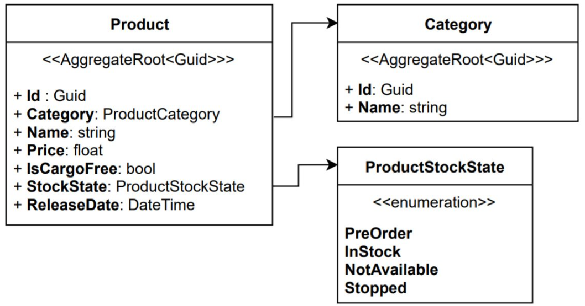
实体在解决方案的领域层中定义，它分为两个项目：

- **.Domain**用于定义您的实体、值对象、领域服务、存储库接口和其他与领域相关的核心类。
- **.Domain.Shared**用于定义一些可用于其他层的共享类型。通常，我们在这里定义枚举和一些常量。

### 1.1 产品类别实体（Category）

`Category`实体用于对产品进行分类。*在ProductManagement.Domain*项目中创建一个*Categories*文件夹，并在其中创建一个`Category`类：

```C#
using System;
using Volo.Abp.Domain.Entities.Auditing;
namespace ProductManagement.Categories
{
    public class Category : AuditedAggregateRoot<Guid>
    {
        public string Name { get; set; }
    }
}
```

`Category`类派生自`AuditedAggregateRoot<Guid>`，这里`Guid`是实体的主键 (`Id`) 。您可以使用任何类型的主键（例如`int`、`long`或`string`）。

`AggregateRoot`是一种特殊的实体，用于创建聚合的根实体。它是一个**领域驱动设计**(**DDD**) 概念，我们将在接下来的章节中更详细地讨论。

相比`AggregateRoot`类，`AuditedAggregateRoot`添加了更多属性：`CreationTime`、`CreatorId`、`LastModificationTime`和`LastModifierId`。

当您将实体插入数据库时，ABP 会自动给这些属性赋值，`CreationTime`会设置为当前时间，`CreatorId`会自动设置为当前用户的`Id`属性。

**关于充血领域模型**
在本章中，我们使用公共的 getter 和 setter 来保持实体的简单性。如果您想创建更丰富的领域模型并应用 DDD 原则和其他最佳实践，我们将在后面的文章中讨论它们。

### 1.2 产品库存状态枚举（ProductStockState）

`ProductStockState`是一个简单的枚举，用来设置和跟踪产品库存。

我们在*.Domain.Shared*项目中创建一个*Products*文件夹和一个枚举`ProductStockState`：

```C#
namespace ProductManagement.Products
{
    public enum ProductStockState : byte
    {
        PreOrder,
        InStock,
        NotAvailable,
        Stopped
    }
}
```

我们将在**数据传输对象(DTO)** 和界面层复用该枚举。

### 1.3 产品实体（Product）

在.Domain项目中创建一个*Products*文件夹，并在其中创建一个类`Product`：

```C#
using System;
using Volo.Abp.Domain.Entities.Auditing;
using ProductManagement.Categories;
namespace ProductManagement.Products
{
    public class Product : FullAuditedAggregateRoot<Guid>
    {
        public Category Category { get; set; }
        public Guid CategoryId { get; set; }
        public string Name { get; set; }
        public float Price { get; set; }
        public bool IsFreeCargo { get; set; }
        public DateTime ReleaseDate { get; set; }
        public ProductStockState StockState { get; set; }
    }
}
```

这一次，我继承自`FullAuditedAggregateRoot`，相比`Category`d的`AuditedAggregateRoot`类，它还增加了`IsDeleted`、`DeletionTime`和`DeleterId`属性。

`FullAuditedAggregateRoot`实现了`ISoftDelete`接口，用于实体的**软删除**。即它永远不会从数据库中做物理删除，而只是标记为已删除。ABP 会自动处理所有的软删除逻辑。包括下次查询时，已删除的实体会被自动过滤，除非您有意请求它们，否则它不会在查询结果中显示。

### 1.4 导航属性

在这个例子中，`Product.Category`是一个导航属性为`Category`的实体。如果您使用 MongoDB 或想要真正实现 DDD，则不应将导航属性添加到其他聚合中。但是，对于关系数据库，它可以完美运行并为我们的代码提供灵活性。

解决方案中的新文件如图所示：

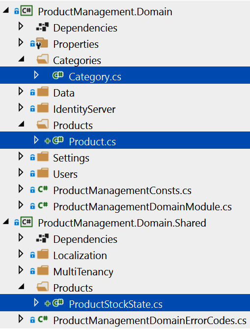

 


我们已经创建了领域对象。接下来是常量值。

### 1.5 常量值

这些常量将在输入验证和数据库映射阶段进行使用。

首先，在.Domain.Shared项目中创建一个 *Categories* 文件夹并在里面添加一个类`CategoryConsts`：

```C#
namespace ProductManagement.Categories
{
    public static class CategoryConsts
    {
        public const int MaxNameLength = 128;
    }
}
```

在这里，`MaxNameLength`值将用于`Category`的`Name`属性的约束。

然后，在.Domain.Shard的 *Products* 文件夹中创建一个`ProductConsts`类：

```C#
namespace ProductManagement.Products
{
    public static class ProductConsts
    {
        public const int MaxNameLength = 128;
    }
}
```

该`MaxNameLength`值将用于约束`Product`的`Name`属性。

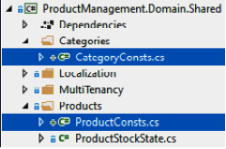
现在，领域层已经完成定义，接下来将为 EF Core 配置数据库映射。

# 2 EF Core和数据库映射

我们在该应用中使用**EF Core**。EF Core 是一个由微软提供的**对象关系映射**(**ORM**) 提供程序。ORM 提供了抽象，让您感觉像是在使用代码实体对象而不是数据库表。我们将在后面的使用数据访问基础架构中介绍 ABP 的 EF Core 集成。现在，我们先了解如何使用它。

1. 首先，我们将实体添加到`DbContext`类并定义实体和数据库表之间的映射；
2. 然后，我们将使用 EF Core 的**Code First**方法创建对应的数据库表；
3. 接下来，我们再看 ABP 的**种子数据**系统，并插入一些初始数据；
4. 最后，我们会将数据库表结构和种子数据迁移到数据库中，以便为应用程序做好准备。

让我们从定义`DbSet`实体的属性开始。

## 2.1 将实体添加到 DbContext 类

EF的`DbContext`有两个主要用途：

1. 定义实体和数据库表之间映射；
2. 访问数据库和执行数据库相关实体的操作。

*在.EntityFrameworkCore*项目中打开`ProductManagementDbContext`该类，添加以下属性：

```C#
public DbSet<Product> Products { get; set; }
public DbSet<Category> Categories { get; set; }
```

EF Core 可以使用基于属性名称和类型的约定进行大部分映射。如果要自定义默认的映射配置或额外的配置，有两种方法：**数据注释**（属性）和**Fluent API**。

在数据注释方法中，我们向实体属性添加特性，例如`[Required]`和`[StringLength]`，非常方便，也很容易理解。
与Fluent API相比，数据注释容易受限，比如，当你需要使用EF Core的自定义特性时，他会让你的领域层依赖EF Core的NuGet包，比如`[Index]`和`[Owned]`

在本章中，我更倾向 Fluent API 方法，它使实体更干净，并将所有 ORM 逻辑放在基础设施层中。

## 2.2 将实体映射到数据库表

类`ProductManagementDbContext`（在*.EntityFrameworkCore*项目中）包含一个`OnModelCreating`方法用来配置实体到数据库表的映射。当你首先创建您的解决方案时，此方法看起来如下所示：

```C#
protected override void OnModelCreating(ModelBuilder builder)
{
    base.OnModelCreating(builder);
    builder.ConfigurePermissionManagement();
    builder.ConfigureSettingManagement();
    builder.ConfigureIdentity();
    ...configuration of the other modules
    /* Configure your own tables/entities here */
}
```

再添加`Category`和`Product`实体的配置和映射关系：

```C#
builder.Entity<Category>(b =>
{
      b.ToTable("Categories");
      b.Property(x => x.Name)
            .HasMaxLength(CategoryConsts.MaxNameLength)
            .IsRequired();
      b.HasIndex(x => x.Name);
});
builder.Entity<Product>(b =>
{
      b.ToTable("Products");
      b.Property(x => x.Name)
            .HasMaxLength(ProductConsts.MaxNameLength)
            .IsRequired();
      b.HasOne(x => x.Category)
           .WithMany()
           .HasForeignKey(x => x.CategoryId)
           .OnDelete(DeleteBehavior.Restrict)
           .IsRequired();
b.HasIndex(x => x.Name).IsUnique();
});
```

我们使用`CategoryConsts.MaxNameLength`设置表`Category`的`Name`字段的最大长度。`Name`字段也是必填属性。最后，我们为属性定义了一个唯一的数据库索引，因为它有助于按`Name`字段搜索。

`Product`映射类似于`Category`。此外，它还定义了`Category`实体与`Product`实体之间的关系；一个`Product`实体属于一个`Category`实体，而一个`Category`实体可以有多个`Product`实体。

您可以参考 EF Core 官方文档进一步了解 Fluent API 的所有详细信息和其他选项。
映射配置完成后，我们就可以创建数据库迁移，把我们新加的实体转换成数据库结构。

## 2.3 添加迁移命令

当你创建一个新的实体或对现有实体进行更改，还应该同步到数据库中。EF Core 的**Code First**就是用来同步数据库和实体结构的强大工具。通常，我们需要先生成迁移脚本，然后执行迁移命令。迁移会对数据库的架构进行增量更改。有两种方法可以生成新迁移：

1 ）使用 Visual Studio

如果你正在使用Visual Studio，请打开视图|包管理器控制台菜单：
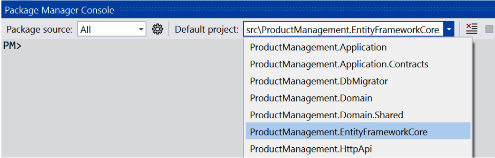

> 选择.EntityFrameworkCore项目作为默认项目，并右键设置.Web项目作为启动项目

现在，您可以在 控制台中键入以下命令：

```C#
Add-Migration `"Added_Categories_And_Products"`
```

如果你得到一个诸如*No DbContext was found in assembly...* 之类的错误，请确保您已将*.EntityFrameworkCore*项目设置为默认项目。

如果一切顺利，会在.EntityFrameworkCore项目的Migrations文件夹中添加一个新的迁移类。

2） 在命令行中

如果您不使用Visual Studio，你可以使用 EF Core命令行工具。如果尚未安装，请在命令行终端中执行以下命令：

```shell
dotnet tool install --global dotnet-ef
```

现在，在.EntityFrameworkCore项目的根目录中打开一个命令行终端，然后输入以下命令：

```shell
dotnet ef migrations add ``"Added_Categories_And_Products"
```

*一个新的迁移类会添加到.EntityFrameworkCore项目的Migrations文件夹中。*

## 2.4 添加种子数据

种子数据系统用于迁移数据库时添加一些初始数据。例如，身份模块在数据库中创建一个管理员用户，该用户具有登录应用程序的所有权限。

虽然种子数据在我们的场景中不是必需的，这里我想将一些产品类别和产品的初始化数据添加到数据库中，以便更轻松地开发和测试应用程序。

关于 EF Core 种子数据

本节使用 ABP 的种子数据系统，而 EF Core 有自己的种子数据功能。ABP 种子数据系统允许您在代码中**注入运行时服务并实现高级逻辑**，适用于**开发、测试和生产环境**。但是，对于简单的开发和测试，使用 EF Core 的种子数据基本够用。请查看官方文档。

在ProductManagement.Domain项目的Data文件夹中创建一个`ProductManagementDataSeedContributor`类：

```C#
using ProductManagement.Categories;
using ProductManagement.Products;
using System;
using System.Threading.Tasks;
using Volo.Abp.Data;
using Volo.Abp.DependencyInjection;
using Volo.Abp.Domain.Repositories;
namespace ProductManagement.Data
{
    public class ProductManagementDataSeedContributor :
           IDataSeedContributor, ITransientDependency
    {
        private readonly IRepository<Category, Guid>_categoryRepository;
        private readonly IRepository<Product, Guid>_productRepository;
        public ProductManagementDataSeedContributor(
            IRepository<Category, Guid> categoryRepository,
            IRepository<Product, Guid> productRepository)
        {
            _categoryRepository = categoryRepository;
            _productRepository = productRepository;
        }
        public async Task SeedAsync(DataSeedContext context)
        {
            /***** TODO: Seed initial data here *****/
        }
    }
}
```

该类实现了`IDataSeedContributor`接口，ABP 会自动发现并调用其`SeedAsync`方法。您也可以实现构造函数注入并使用类中的任何服务（例如本示例中的存储库）。

然后，在`SeedAsync`方法内部编码：

```C#
if (await _categoryRepository.CountAsync() > 0)
{
    return;
}
var monitors = new Category { Name = "Monitors" };
var printers = new Category { Name = "Printers" };
await _categoryRepository.InsertManyAsync(new[] { monitors, printers });
var monitor1 = new Product
{
    Category = monitors,
    Name = "XP VH240a 23.8-Inch Full HD 1080p IPS LED  Monitor",
    Price = 163,
    ReleaseDate = new DateTime(2019, 05, 24),
    StockState = ProductStockState.InStock
};
var monitor2 = new Product
{
    Category = monitors,
    Name = "Clips 328E1CA 32-Inch Curved Monitor, 4K UHD",
    Price = 349,
    IsFreeCargo = true,
    ReleaseDate = new DateTime(2022, 02, 01),
    StockState = ProductStockState.PreOrder
};
var printer1 = new Product
{
    Category = monitors,
    Name = "Acme Monochrome Laser Printer, Compact All-In One",
    Price = 199,
    ReleaseDate = new DateTime(2020, 11, 16),
    StockState = ProductStockState.NotAvailable
};
await _productRepository.InsertManyAsync(new[] { monitor1, monitor2, printer1 });
```


我们创建了两个类别和三种产品并将它们插入到数据库中。每次您运行DbMigrator应用时都会执行此类。同时，我们检查`if (await _categoryRepository.CountAsync() > 0)`以防止数据重复插入。

种子数据和数据库表结构准备就绪， 下面进入正式迁移。

## 2.5 迁移数据库

> EF Core 和 ABP 的迁移有何区别？

ABP 启动模板中包含一个在开发和生产环境中非常有用的DbMigrator控制台项目。当您运行它时，所有待处理的迁移都将应用到数据库中，并执行数据初始化。
它**支持多租户/多数据库的场景**，这是使用`Update-Database`无法实现的。

> 为什么要从主应用中分离出迁移项目？

在生产环境中部署和执行时，通常作为**持续部署**(**CD**) 管道的一个环节。从主应用中分离出迁移功能有个好处，主应用不需要更改数据库的权限。此外，如果不做分离可能会遇到数据库迁移和执行的并发问题。

将.DbMigrator项目设置为启动项目，然后*按 Ctrl*+*F5* 运行该项目，待应用程序退出后，您可以检查*Categories*和*Products*表是否已插入数据库中（如果您使用 Visual Studio，则可以使用**SQL Server 对象资源管理器**连接到**LocalDB**并浏览数据库）。

数据库已准备好了。接下来我们将在 UI 上显示产品数据。

# 3 定义应用服务

## 3.1 思路

我更倾向逐个功能地推进应用开发。本文将说明如何在 UI 上显示产品列表。

1. 首先，我们会为`Product`实体定义一个`ProductDto`；
2. 然后，我们将创建一个向表示层返回产品列表的应用服务方法；
3. 此外，我们将学习如何自动映射`Product`到`ProductDto`

在创建 UI 之前，我将向您展示如何为应用服务编写**自动化测试**。这样，在开始 UI 开发之前，我们就可以确定应用服务是否正常工作。

在整个在开发过程中，我们将探索 ABP 框架的一些能力，例如自动 API 控制器和动态 JavaScript 代理系统。

最后，我们将创建一个新页面，并在其中添加一个数据表，然后从服务端获取产品列表，并将其显示在 UI 上。

梳理完思路，我们从创建一个`ProductDto`类开始。

**ProductDto 类**

DTO 用于在应用层和表示层之间传输数据。最佳实践是将 DTO 返回到表示层而不是实体，因为将实体直接暴露给表示层可能导致序列化和安全问题，有了DTO，我们不但可以抽象实体，对接口展示内容也更加可控。

为了在 UI 层中可复用，DTO 规定在Application.Contracts项目中进行定义。我们首先在*.Application.Contracts项目的Products文件夹中创建一个`ProductDto`类：

```C#
using System;
using Volo.Abp.Application.Dtos;
namespace ProductManagement.Products
{
    public class ProductDto : AuditedEntityDto<Guid>
    {
        public Guid CategoryId { get; set; }
        public string CategoryName { get; set; }
        public string Name { get; set; }
        public float Price { get; set; }
        public bool IsFreeCargo { get; set; }
        public DateTime ReleaseDate { get; set; }
        public ProductStockState StockState { get; set; }
    }
}
```


`ProductDto`与实体类基本相似，但又有以下区别：

- 它派生自`AuditedEntityDto<Guid>`，它定义了`Id`、`CreationTime`、`CreatorId`、`LastModificationTime`和`LastModifierId`属性（我们不需要做删除审计`DeletionTime`，因为删除的实体不是从数据库中读取的）。
- 我们没有向实体`Category`添加导航属性，而是使用了一个`string`类型的`CategoryName`的属性，用以在 UI 上显示。

我们将使用使用`ProductDto`类从`IProductAppService`接口返回产品列表。

## 3.2 产品应用服务

**应用服务**实现了应用的业务逻辑，UI 调用它们用于用户交互。通常，应用服务方法返回一个 DTO。

### 3.2.1 应用服务与 API 控制器

> ABP的应用服务和MVC 中的 API 控制器有何区别？

您可以将应用服务与 ASP.NET Core MVC 中的 API 控制器进行比较。虽然它们有相似之处，但是：

1. 应用服务更适合 DDD ，它们不依赖于特定的 UI 技术。
2. 此外，ABP 可以自动将您的应用服务公开为 HTTP API。

我们在*.Application.Contracts项目的Products文件夹中创建一个`IProductAppService`接口：

```C#
using System.Threading.Tasks;
using Volo.Abp.Application.Dtos;
using Volo.Abp.Application.Services;
namespace ProductManagement.Products
{
    public interface IProductAppService : IApplicationService
    {
        Task<PagedResultDto<ProductDto>> GetListAsync(PagedAndSortedResultRequestDto input);
    }
}
```

我们可以看到一些预定义的 ABP 类型：

- `IProductAppService`约定从`IApplicationService`接口，这样ABP 就可以识别应用服务。
- `GetListAsync`方法的入参`PagedAndSortedResultRequestDto`是 ABP 框架的标准 DTO 类，它定义了`MaxResultCount`、`SkipCount`和`Sorting`属性。
- `GetListAsync`方法返回`PagedResultDto<ProductDto>`，其中包含一个`TotalCount`属性和一个`ProductDto`对象集合，这是使用 ABP 框架返回分页结果的便捷方式。

当然，您可以使用自己的 DTO 代替这些预定义的 DTO。但是，当您想要标准化一些常见问题，避免到处都使用相同的命名时，它们非常有用。

### 3.2.2 异步方法

将所有应用服务方法定义为异步方法是最佳实践。如果您定义为同步方法，在某些情况下，某些 ABP 功能（例如工作单元）可能无法按预期工作。

现在，我们可以实现`IProductAppService`接口来执行用例。

### 3.2.3 产品应用服务

我们在ProductManagement.Application项目中创建一个`ProductAppService`类：


```C#
using System.Linq.Dynamic.Core;
using System.Threading.Tasks;
using Volo.Abp.Application.Dtos;
using Volo.Abp.Domain.Repositories;
namespace ProductManagement.Products
{
    public class ProductAppService : ProductManagementAppService, IProductAppService
    {
        private readonly IRepository<Product, Guid>  _productRepository;
        public ProductAppService(IRepository<Product, Guid> productRepository)
        {
            _productRepository = productRepository;
        }
        public async Task<PagedResultDto<ProductDto>> GetListAsync(PagedAndSortedResultRequestDto input)
        {
            /* TODO: Implementation */
        }
    }
}
```


`ProductAppService`派生自`ProductManagementAppService`，它在启动模板中定义，可用作应用服务的基类。它实现了之前定义的`IProductAppService`接口，并注入`IRepository<Product, Guid>`服务。这就是通用**默认存储**库，方面我们对数据库执行操作（ABP 自动为所有聚合根实体提供默认存储库实现）。

我们实现`GetListAsync`方法，如下代码块所示：


```C#
public async Task<PagedResultDto<ProductDto>> GetListAsync(PagedAndSortedResultRequestDto input)
{
    var queryable = await _productRepository.WithDetailsAsync(x => x.Category);
    queryable = queryable
        .Skip(input.SkipCount)
        .Take(input.MaxResultCount)
        .OrderBy(input.Sorting ?? nameof(Product.Name));
    var products = await AsyncExecuter.ToListAsync(queryable);
    var count = await _productRepository.GetCountAsync();
    return new PagedResultDto<ProductDto>(
        count,
        ObjectMapper.Map<List<Product>, List<ProductDto>>(products)
    );
}
```


这里，`_productRepository.WithDetailsAsync`返回一个包含产品类别的`IQueryable<Product>`对象，（`WithDetailsAsync`方法类似于 EF Core 的`Include`扩展方法，用于将相关数据加载到查询中）。于是，我们就可以方便地使用标准的(**LINQ**) 扩展方法，比如`Skip`、`Take`和`OrderBy`等。

`AsyncExecuter`服务（基类中预先注入）用于执行`IQueryable`对象，这使得可以使用异步 LINQ 扩展方法执行数据库查询，而无需依赖应用程序层中的 EF Core 包。（我们将在[*第 6 章* ] 中对`AsyncExecuter`进行更详细的探讨）

最后，我们使用`ObjectMapper`服务（在基类中预先注入）将`Product`集合映射到`ProductDto`集合。

### 3.2.4 对象映射

`ObjectMapper`（`IObjectMapper`）会自动使用**AutoMapper**库进行类型转换。它要求我们在使用之前预先定义映射关系。启动模板包含一个配置文件类，您可以在其中创建映射。

在ProductManage.Application项目中打开`ProductManagementApplicationAutoMapperProfile`类，并将其更改为以下内容：


```C#
using AutoMapper;
using ProductManagement.Products;
namespace ProductManagement
{
    public class ProductManagementApplicationAutoMapperProfile : Profile
    {
        public ProductManagementApplicationAutoMapperProfile()
        {
            CreateMap<Product, ProductDto>();
        }
    }
}
```


如`CreateMap`所定义的映射。它可以自动将`Product`转换为`ProductDto`对象。

AutoMapper中有一个有趣的功能：**Flattening**，它默认会将复杂的对象模型展平为更简单的模型。在这个例子中，`Product`类有一个`Category`属性，而`Category`类也有一个`Name`属性。因此，如果要访问产品的类别名称，则应使用`Product.Category.Name`表达式。但是，`ProductDto`的`CategoryName`可以直接使用`ProductDto.CategoryName`表达式进行访问。AutoMapper 会通过展平`Category.Name`来自动映射成`CategoryName`。

# 4 测试 ProductAppService 类

启动模板附带测试基础架构，包括**xUnit**、**Shouldly**和**NSubstitute**库。它使用*SQLite 内存*数据库来模拟数据库，并为每个测试创建一个单独的数据库。它会自动初始化数据并在测试结束时销毁测试数据。通过这种方式，测试不会相互影响，并且您的真实数据库保持不变。

下面展示在 UI 上使用应用服务之前，如何为`ProductAppService`类的`GetListAsync`方法写单元测试代码（构建自动化测试细节后续再议）。

在.Application.Tests项目中创建*Products*文件夹，并在其中创建一个`ProductAppService_Tests`类：

```C#
using Shouldly;
using System.Threading.Tasks;
using Volo.Abp.Application.Dtos;
using Xunit;
namespace ProductManagement.Products
{
    public class ProductAppService_Tests : ProductManagementApplicationTestBase
    {
        private readonly IProductAppService _productAppService;
        public ProductAppService_Tests()
        {
            _productAppService =
                GetRequiredService<IProductAppService>();
        }
        /* TODO: Test methods */
    }
}
```

该类继承自`ProductManagementApplicationTestBase`，它默认集成 ABP 框架和其他基础设施库，这样我们就可以直接使用内置的测试能力。另外，我们使用方法`GetRequiredService`来解决测试代码中的依赖关系，而不是构造函数注入（这在测试中是不可能的）。

现在，我们可以编写第一个测试方法。在`ProductAppService_Tests`类中添加如下代码：

```C#
[Fact]
public async Task Should_Get_Product_List()
{
    //Act
    var output = await _productAppService.GetListAsync(
        new PagedAndSortedResultRequestDto()
    );
    //Assert
    output.TotalCount.ShouldBe(3);
    output.Items.ShouldContain(
        x => x.Name.Contains("Acme Monochrome Laser Printer")
    );
}
```

该方法调用该`GetListAsync`方法并检查结果是否正确。如果您打开**测试资源管理器**窗口（在 Visual Studio 中的**查看**|**测试资源管理器**菜单下），您可以看到我们添加的测试方法。**测试资源管理器**用于显示和运行解决方案中的测试：

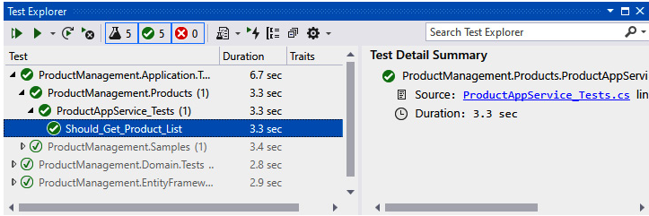
运行测试到检查它是否按预期工作。如果方法正常工作，将在测试方法名称的左侧看到一个绿色图标。

# 5 自动 API 控制器和 Swagger UI

**Swagger**一款服务于开发和测试HTTP API 的的流行工具。它启动模板中已经预先装了。

设置.Web项目为启动项目，然后*按 Ctrl*+*F5*运行该项目，启动后，输入`/swagger` URL，如图所示：
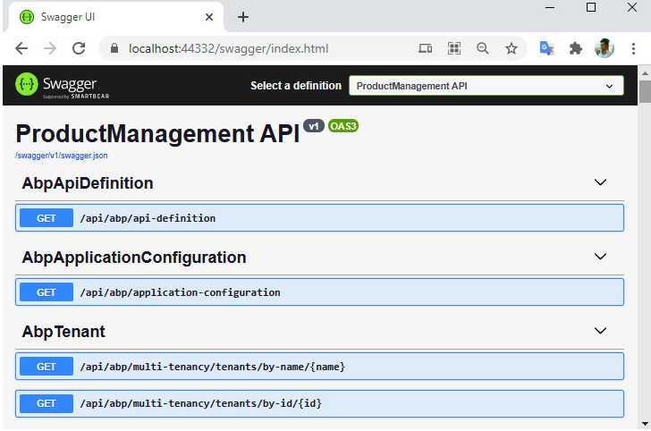

你会看到内置的很多 API。如果向下滚动，也会看到一个**Product**接口。您可以对其进行测试以获取产品列表：
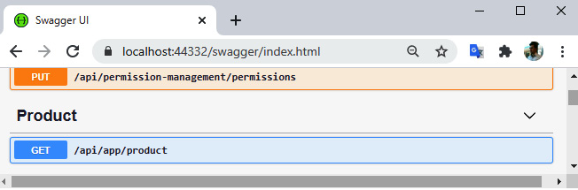

> 我们没有创建*ProductController*接口。这个接口是如何出现的？

这里运用的是ABP 框架的**自动 API 控制器**功能。它会根据命名约定和配置自动将您的应用服务公开为 HTTP API（通常，我们不会手动编写控制器）。

自动 API 控制器功能将在[*第 14 章*] *构建 HTTP API 和实时服务* 中详细介绍。

有了 HTTP API 来获取产品列表。下一步是在客户端代码中使用此 API。

# 6 动态 JavaScript 代理

通常，您通过 JavaScript 调用 HTTP API 接口。ABP 会为所有 HTTP API 动态创建客户端代理。然后，就可以使用这些动态 JavaScript 函数从客户端调用我们的 API。

再次运行*ProductManagement.Web*项目，并在登录页面上使用*F12*快捷键打开浏览器的**开发者控制台**，然后输入以下 JavaScript 代码：

```js
productManagement.products.product.getList({}).then(function(result) {
    console.log(result);
});
```

执行此代码后，将向服务器发出请求，并将返回结果记录在**Console**选项卡中，如图所示：

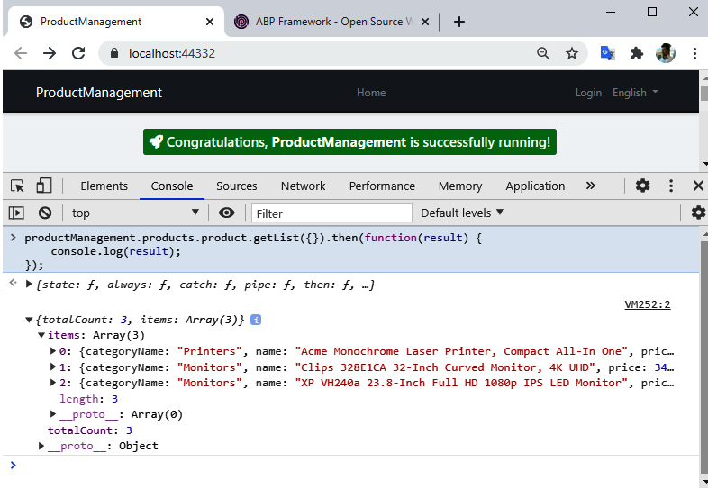

我们可以看到返回的产品列表数据显示在**控制台**选项卡中。这意味着我们可以轻松地运用 JavaScript 调用服务器端 API，而无需处理低级细节。

如果您想知道JavaScript 是在哪里定义`getList`的，您可以定位到`/Abp/ServiceProxyScript`地址，查看由 ABP 框架动态创建的 JavaScript 代理函数。

# 7 产品管理

## 7.1 产品列表

推荐使用 Razor Pages在 ASP.NET Core MVC 框架中创建 UI。

首先，在ProductManagement.Web项目的*Pages*文件夹下创建一个*Products文件夹。然后，右键单击Products*文件夹，然后选择**Add**|**Razor Page**。选择**Razor 页面 - 空**选项，命名为`Index.cshtml`。下图显示了我们添加的页面的位置：
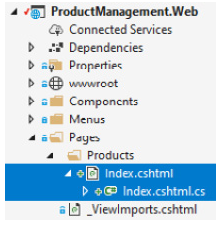

编辑内容，`Index.cshtml`如下代码块所示：

```js
@page
@using ProductManagement.Web.Pages.Products
@model IndexModel
<h1>Products Page</h1>
```

在这里，我放置一个`h1`元素作为页眉。接下来我们在主菜单中添加一个菜单来打开这个页面。

**1）添加菜单项**

ABP 提供了一个动态、模块化的菜单系统。每个模块都可以添加到主菜单。

打开*ProductManagement.Web项目的**Menus*文件夹中的`ProductManagementMenuContributor`类，并在`ConfigureMainMenuAsync`方法末尾添加以下代码：

```js
context.Menu.AddItem(
    new ApplicationMenuItem(
        "ProductManagement",
        l["Menu:ProductManagement"],
        icon: "fas fa-shopping-cart"
            ).AddItem(
        new ApplicationMenuItem(
            "ProductManagement.Products",
            l["Menu:Products"],
            url: "/Products"
        )
    )
);
```

此代码添加了一个*产品管理*主菜单，其中包含产品菜单项。里面的`l["…"]`语法是用来获取本地化的值。

打开ProductManagement.Domain.Shared 项目的Localization/ProductManagement文件夹中的`en.json`文件，并将以下代码添加到该`texts`部分的末尾：

```json
"Menu:ProductManagement": "Product Management",
"Menu:Products": "Products"
```

我们可以使用任意字符串值作为本地化键。在本例中，我们使用`Menu:`作为菜单的本地化键的前缀，例如`Menu:Products` 。我们将在[*第 8 章*] *使用 ABP 的功能和服务*中探讨本地化主题。

现在，重新运行，使用新的*产品管理*菜单打开*产品*页面，如图所示：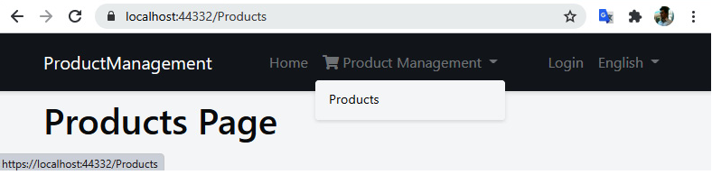

**2）创建产品数据表**

接下来我们将创建一个数据表显示带有分页和排序的产品列表。ABP 启动模板带有预安装和配置的JS 库 **Datatables.net**，用于显示表格数据。

打开`Index.cshtml`页面（在*Pages/Products*文件夹），并将其内容更改为以下内容：

```js
@page
@using ProductManagement.Web.Pages.Products
@using Microsoft.Extensions.Localization
@using ProductManagement.Localization
@model IndexModel
@inject IStringLocalizer<ProductManagementResource> L
@section scripts
{
    <abp-script src="/Pages/Products/Index.cshtml.js" />
}
<abp-card>
    <abp-card-header>
        <h2>@L["Menu:Products"]</h2>
    </abp-card-header>
    <abp-card-body>
        <abp-table id="ProductsTable" striped-rows="true" />
    </abp-card-body>
</abp-card>
```

`abp-script`是一个 ABP 标签助手，用于将脚本文件添加到页面，并具有自动捆绑、压缩和版本控制功能。`abp-card`是另一个标签助手，以一种类型安全且简单的方式渲染 Card 组件。

> 我们可以使用标准的 HTML 标签。但是，ABP 标签助手极大地简化了 MVC/Razor 页面中的 UI 创建。此外，它们支持智能感知和编译时错误类型检查。我们将在[*第 12 章*] *使用 MVC/Razor 页面*中研究标签助手。

*在Pages/Products*文件夹下创建一个新的 JavaScript 文件，命名为`Index.cshtml.js`，内容如下：

```js
$(function () {
    var l = abp.localization.getResource('ProductManagement');
    var dataTable = $('#ProductsTable').DataTable(
        abp.libs.datatables.normalizeConfiguration({
            serverSide: true,
            paging: true,
            order: [[0, "asc"]],
            searching: false,
            scrollX: true,
            ajax: abp.libs.datatables.createAjax(
                productManagement.products.product.getList),
            columnDefs: [
                /* TODO: Column definitions */
            ]
        })
    );
});
```

ABP 简化了数据表配置并提供了内置集成：

- `abp.localization.getResource` 返回一个本地化对象，ABP 允许您在 JS中重用服务器端定义的本地化。
- `abp.libs.datatables.normalizeConfiguration`是 ABP 框架定义的辅助函数。它通过为缺失选项提供常规默认值来简化数据表的配置。
- `abp.libs.datatables.createAjax` 使 ABP 的动态 JS 客户端代理来适配数据表的参数格式。
- `productManagement.products.product.getList`是动态JS代理方法。

`columnDefs`数组用于定义数据表中的列：

```js
{
    title: l('Name'),
    data: "name"
},
{
    title: l('CategoryName'),
    data: "categoryName",
    orderable: false
},
{
    title: l('Price'),
    data: "price"
},
{
    title: l('StockState'),
    data: "stockState",
    render: function (data) {
        return l('Enum:StockState:' + data);
    }
},
{
    title: l('CreationTime'),
    data: "creationTime",
    dataFormat: 'date'
}
```

通常，列有一个`title`字段和一个`data`字段。`data`字段匹配`ProductDto`类中的属性名称，格式为**驼峰**式（一种命名风格，其中每个单词的第一个字母大写，第一个单词除外；它是JavaScript 语言中常用的命名风格）。

该`render`选项用于精细控制如何显示列数据。

在此页面上，我们使用了一些本地化键。我们应该先在本地化资源中定义它们。打开ProductManagement.Domain.Shared项目的*Localization/ProductManagement* *文件*夹中的`en.json`文件，并在该部分的末尾添加以下条目`texts`：

```xml
"Name": "Name",
"CategoryName": "Category name",
"Price": "Price",
"StockState": "Stock state",
"Enum:StockState:0": "Pre-order",
"Enum:StockState:1": "In stock",
"Enum:StockState:2": "Not available",
"Enum:StockState:3": "Stopped",
"CreationTime": "Creation time"
```

看一下实际的产品数据表：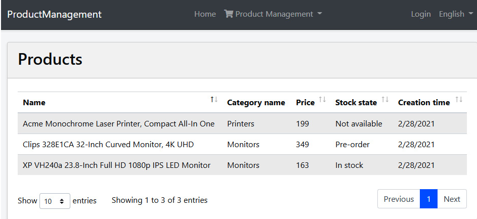

至此，我们创建了一个完整的工作页面，列出了支持分页和排序的产品。在接下来的部分中，我们将添加创建、编辑和删除产品的功能。

## 7.2 创建产品

在本节中，我们将开发新增产品所需的功能。我们的大致思路如下：
定义新的应用服务方法来获取类别和创建产品。

1. 定义应用服务的获取类别和创建产品方法。
2. 在 UI 部分，使用 ABP 的动态表单功能，基于 C# 类自动生成产品创建表单。

**1）定义应用接口**

让我们从给`IProductAppService`接口添加两个新方法开始：

Task CreateAsync(CreateUpdateProductDto input);

Task<ListResultDto<CategoryLookupDto>> GetCategoriesAsync();

在创建产品时，我们使用`GetCategoriesAsync`方法获取产品类别的下拉数据。我们定义了两个新的 DTO。

`CreateUpdateProductDto`用于创建和更新产品（我们将在*编辑产品*时候重复使用它）。我们在*ProductManagement.Application.Contracts项目*的*Products*文件夹中定义它：

```C#
using System;
using System.ComponentModel.DataAnnotations;
namespace ProductManagement.Products
{
    public class CreateUpdateProductDto
    {
        public Guid CategoryId { get; set; }
        [Required]
        [StringLength(ProductConsts.MaxNameLength)]
        public string Name { get; set; }
        public float Price { get; set; }
        public bool IsFreeCargo { get; set; }
        public DateTime ReleaseDate { get; set; }
        public ProductStockState StockState { get; set; }
    }
}
```

接下来，在*ProductManagement.Application.Contracts*项目的*Categories*文件夹中定义一个`CategoryLookupDto`类：

```C#
using System;
namespace ProductManagement.Categories
{
    public class CategoryLookupDto
    {
        public Guid Id { get; set; }
        public string Name { get; set; }
    }
}
```

定了接口相关类，现在我们可以在应用层实现接口了。

**2）实现应用服务**

在`ProductAppService`中实现`CreateAsync`和`GetCategoriesAsync`方法（*ProductManagement.Application*项目中），如下代码块：

```C#
public async Task CreateAsync(CreateUpdateProductDto input)
{
    await _productRepository.InsertAsync(
        ObjectMapper.Map<CreateUpdateProductDto, Product>(input)
    );
}
public async Task<ListResultDto<CategoryLookupDto>> GetCategoriesAsync()
{
    var categories = await _categoryRepository.GetListAsync();
    return new ListResultDto<CategoryLookupDto>(
        ObjectMapper.Map<List<Category>, List<CategoryLookupDto>>(categories)
    );
}
```

这里，`_categoryRepository`属于`IRepository<Category, Guid>`服务类型，通过构造函数注入，方法实现很简单，无需解释。

我们已经在上面的两个地方使用了对象映射，现在我们必须配置映射。打开`ProductManagementApplicationAutoMapperProfile.cs`文件（在*ProductManagement.Application*项目中），添加以下代码：

```C#
CreateMap<CreateUpdateProductDto, Product>();
CreateMap<Category, CategoryLookupDto>(); 
```

**3）用户界面**

在*ProductManagement.Web*项目的*Pages/Products*文件夹下创建一个`CreateProductModal.cshtml`Razor 页面。打开`CreateProductModal.cshtml.cs`文件，更改`CreateProductModalModel`代码：

```C#
using System.Linq;
using System.Threading.Tasks;
using Microsoft.AspNetCore.Mvc;
using Microsoft.AspNetCore.Mvc.Rendering;
using ProductManagement.Products;
namespace ProductManagement.Web.Pages.Products
{
    Public class CreateProductModalModel:ProductManagementPageModel
    {
        [BindProperty]
        public CreateEditProductViewModel Product { get; set; }
        public SelectListItem[] Categories { get; set; }
        private readonly IProductAppService  _productAppService;
 
 
        public CreateProductModalModel(IProductAppService productAppService)
        {
            _productAppService = productAppService;
        }
        public async Task OnGetAsync()
        {
            // TODO
        }
        public async Task<IActionResult> OnPostAsync()
        {
            // TODO
        }
    }
}
```

这里的`ProductManagementPageModel`是基类。你可以继承它来创建`PageModel`类。`[BindProperty]`是一个标准的 ASP.NET Core 属性，在HTTP Post 请求时，会将数据绑定到`Product`属性。`Categories`将用于显示下拉列表中的类别。我们通过注入`IProductAppService`接口以使用之前定义的方法。

目前使用到的`CreateEditProductViewModel`还没定义，我们将其定义在与`CreateProductModal.cshtml`相同的文件夹下：

```C#
using ProductManagement.Products;
using System;
using System.ComponentModel;
using System.ComponentModel.DataAnnotations;
using Volo.Abp.AspNetCore.Mvc.UI.Bootstrap.TagHelpers.Form;
namespace ProductManagement.Web.Pages.Products
{
    public class CreateEditProductViewModel
    {
        [SelectItems("Categories")]
        [DisplayName("Category")]
        public Guid CategoryId { get; set; }
        [Required]
        [StringLength(ProductConsts.MaxNameLength)]
        public string Name { get; set; }
        public float Price { get; set; }
        public bool IsFreeCargo { get; set; }
        [DataType(DataType.Date)]
        public DateTime ReleaseDate { get; set; }
        public ProductStockState StockState { get; set; }
    }
}
```

`SelectItems`告诉我们`CategoryId`属性将从`Categories`列表中选择。我们将在编辑模式对话框中重用此类。这就是我为什么命名它为`CreateEditProductViewModel`。

**4）DTO 与 ViewModel**

定义视图模型`CreateEditProductViewModel`似乎没有必要，因为它与 `CreateUpdateProductDto`DTO非常相似。当然你也可以在视图里复用DTO。但是，考虑到这些类具有不同的用途，并且随着时间的推移会向不同的方向发展，所更推荐的办法是将每个关注点分开。例如，`[SelectItems("Categories")]`属性指向 Razor Page 模型，它在应用层没有任何意义。

现在，我们可以在`CreateProductModalModel`类中实现`OnGetAsync`方法：

```C#
public async Task OnGetAsync()
{
    Product = new CreateEditProductViewModel
    {
        ReleaseDate = Clock.Now,
        StockState = ProductStockState.PreOrder
    };
    
    var categoryLookup = await _productAppService.GetCategoriesAsync();
    Categories = categoryLookup.Items.Select(x => new SelectListItem(x.Name, x.Id.ToString())).ToArray();
}
```

我们使用默认值创建`Product`类，然后使用产品应用服务填充`Categories`列表。`Clock`是 ABP 框架提供的服务，用于获取当前时间（在不处理时区和本地/UTC 时间的情况下），这里我们不再使用`DateTime.Now`。具体内容这将在[*第 8 章*] *使用 ABP 的功能和服务中*进行解释。

我们接着实现`OnPostAsync`代码块：

```C#
public async Task<IActionResult> OnPostAsync()
{
    await _productAppService.CreateAsync(
        ObjectMapper.Map<CreateEditProductViewModel,CreateUpdateProductDto> (Product)
    );
    return NoContent();
}
```

由于我们要映射`CreateEditProductViewModel`到`CreateProductDto`，所以需要定义映射配置。我们*在ProductManagement.Web*项目中打开`ProductManagementWebAutoMapperProfile`类，并更改以下代码块内容：

```C#
public class ProductManagementWebAutoMapperProfile : Profile
{
    public ProductManagementWebAutoMapperProfile()
    {
        CreateMap<CreateEditProductViewModel, CreateUpdateProductDto>();
    }
}
```

我们已经完成了产品创建 UI 的 C# 端，接下来可以开始构建 UI 和 JavaScript 代码。打开`CreateProductModal.cshtml`文件，并将内容更改如下：

```js
@page
@using Microsoft.AspNetCore.Mvc.Localization
@using ProductManagement.Localization
@using Volo.Abp.AspNetCore.Mvc.UI.Bootstrap.TagHelpers.Modal
@model ProductManagement.Web.Pages.Products.CreateProductModalModel
@inject IHtmlLocalizer<ProductManagementResource> L
@{
    Layout = null;
}
<abp-dynamic-form abp-model="Product" asp-page="/Products/CreateProductModal">
    <abp-modal>
        <abp-modal-header title="@L["NewProduct"].Value"></abp-modal-header>
        <abp-modal-body>
            <abp-form-content />
        </abp-modal-body>
        <abp-modal-footer buttons="@(AbpModalButtons.Cancel|AbpModalButtons.Save)"></abp-modal-footer>
    </abp-modal>
</abp-dynamic-form>
```

在这里，`abp-dynamic-form`会根据 C# 模型类自动创建表单元素。`abp-form-content`是呈现表单元素的地方。`abp-modal`用于创建模态对话框。

您也可以使用标准的 Bootstrap HTML 元素和 ASP.NET Core 的绑定来创建表单元素。但是，ABP 的 Bootstrap 和动态表单标签助手大大简化了 UI 代码。我们将在[*第 12 章*] *使用 MVC/Razor 页面*中介绍 ABP 标签助手。

我们已经完成创建产品的模态窗口代码。现在，我们将在产品页面添加一个**新产品**按钮以打开该窗口。打开*Pages/Products*文件夹中的`Index.cshtml`文件，然后将`abp-card-header`部分更改如下：

```js
<abp-card-header>
    <abp-row>
        <abp-column size-md="_6">
            <abp-card-title>@L["Menu:Products"]</abp-card-title>
        </abp-column>
        <abp-column size-md="_6" class="text-end">
            <abp-button id="NewProductButton"
                        text="@L["NewProduct"].Value"
                        icon="plus"
                        button-type="Primary"/>
        </abp-column>
    </abp-row>
</abp-card-header>
```

我添加了 2 列，其中每列都有一个`size-md="_6"`属性（即 12 列 Bootstrap 网格的一半）。左侧设置卡片标题，右侧放置了一个按钮。

之后，我添加以下代码到`Index.cshtml.js`文件末尾（在`})`之前）：

```js
var createModal = new abp.ModalManager(abp.appPath + 'Products/CreateProductModal');
createModal.onResult(function () {
    dataTable.ajax.reload();
});
$('#NewProductButton').click(function (e) {
    e.preventDefault();
    createModal.open();
});
 
```

- `abp.ModalManager`用于在客户端管理模式对话框。在内部，它使用 Twitter Bootstrap 的标准模态组件，封装了很多细节，并提供了一个简单的 API。当模型触发保存时会返回一个回调函数`createModal.onResult()`。
- `createModal.open()`用于打开模态对话框。

最后，我们需要在`en.json`文件中定义一些本地化文本（.Domain.Shared项目的*Localization/ProductManagement* *文件*夹下）：

```xml
"NewProduct": "New Product",
"Category": "Category",
"IsFreeCargo": "Free Cargo",
"ReleaseDate": "Release Date"
```

再次运行 Web 尝试创建新产品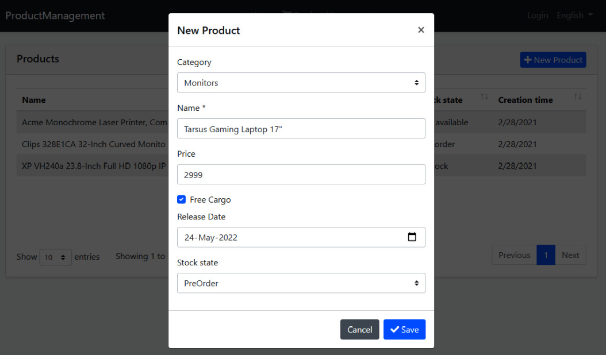

ABP基于 C# 类模型自动创建表单字段。本地化和验证也可以通过读取属性和使用约定来自动工作。我们将在[*第 12 章*] *使用 MVC/Razor 页面* 中更详细地介绍验证和本地化主题。

我们现在可以在 UI 上创建产品了。

## 7.3 编辑产品

编辑产品类似于添加新产品，现在让我们看看如何编辑产品：

**1）定义应用接口**

让我们从为`IProductAppService`接口定义两个新方法：

```C#
Task<ProductDto> GetAsync(Guid id);
Task UpdateAsync(Guid id, CreateUpdateProductDto input);
```

第一种方法用于通过ID获取产品。我们在`UpdateAsync`方法中重用之前定义的`CreateUpdateProductDto`。

**2）实现应用接口**

实现这些新方法非常简单。将以下方法添加到`ProductAppService`类中：

```C#
public async Task<ProductDto> GetAsync(Guid id)
{
    return ObjectMapper.Map<Product, ProductDto>(
        await _productRepository.GetAsync(id)
    );
}
public async Task UpdateAsync(Guid id, CreateUpdateProductDto input)
{
    var product = await _productRepository.GetAsync(id);
    ObjectMapper.Map(input, product);
}
```

`GetAsync`方法用于从数据库中获取产品，并将其映射到`ProductDto`对象后进行返回。`UpdateAsync`方法获取到一个产品后，将给定的DTO输入映射到产品。通过这种方式，我们用新值覆盖产品。

对于这个例子，我们不需要调用`_productRepository.UpdateAsync`，因为 EF Core有一个变更跟踪系统。ABP 的**工作单元**如果没有抛出异常，则在请求结束时会自动保存更改。我们将在[*第 6 章*] *使用数据访问基础架构”*中介绍工作单元系统。

应用层已完成。接下来，我们将创建一个产品编辑 UI。

**3）用户界面**

创建一个`EditProductModal.cshtml`Razor 页面（*ProductManagement.Web项目的* *Pages/Products*文件夹下）。打开`EditProductModal.cshtml.cs`，代码更改如下：

```C#
using System;
using System.Linq;
using System.Threading.Tasks;
using Microsoft.AspNetCore.Mvc;
using Microsoft.AspNetCore.Mvc.Rendering;
using ProductManagement.Products;
namespace ProductManagement.Web.Pages.Products
{
    public class EditProductModalModel : ProductManagementPageModel
    {
        [HiddenInput]
        [BindProperty(SupportsGet = true)]
        public Guid Id { get; set; }
        [BindProperty]
        public CreateEditProductViewModel Product { get; set; }
        public SelectListItem[] Categories { get; set; }
        private readonly IProductAppService _productAppService;
 
 
        public EditProductModalModel(IProductAppService productAppService)
        {
            _productAppService = productAppService;
        }
        public async Task OnGetAsync()
        {
            // TODO
        }
        public async Task<IActionResult> OnPostAsync()
        {
            // TODO
        }
    }
}
```

表单中`Id`字段将被隐藏。

它还应该支持 HTTP GET 请求，因为 GET 请求会打开此模型，并且我们需要产品 ID 来编辑表单。
`Product`和`Categories`属性类似于创建产品。
我们还将`IProductAppService`接口注入到构造函数。

我们实现`OnGetAsync`方法，如下代码块所示：

```C#
public async Task OnGetAsync()
{
    var productDto = await _productAppService.GetAsync(Id);
    Product = ObjectMapper.Map<ProductDto, CreateEditProductViewModel>(productDto);
    
    var categoryLookup = await _productAppService.GetCategoriesAsync();
    Categories = categoryLookup.Items
        .Select(x => new SelectListItem(x.Name, x.Id.ToString()))
        .ToArray();
}
```

首先，我们要先获取一个产品 ( `ProductDto`)，再将其转换为`CreateEditProductViewModel`，使用它在 UI 上来创建编辑表单。然后，我们在表单上选择产品类别。

因为这里映射了`ProductDto`到`CreateEditProductViewModel`，所以我们需要在`ProductManagementWebAutoMapperProfile`类中定义配置映射（*ProductManagement.Web*项目中），这和我们之前操作是一样的：

```C#
CreateMap<ProductDto, CreateEditProductViewModel>();
```

我们再看下`OnPostAsync()`方法:

```C#
public async Task<IActionResult> OnPostAsync()
{
    await _productAppService.UpdateAsync(Id,
        ObjectMapper.Map<CreateEditProductViewModel, CreateUpdateProductDto>(Product)
    );
    return NoContent();
}
```

`OnPostAsync`方法很简单，把`CreateEditProductViewModel`转换为`CreateUpdateProductDto`。

接着，我们切换到`EditProductModal.cshtml`，内容更改如下：

```js
@page
@using Microsoft.AspNetCore.Mvc.Localization
@using ProductManagement.Localization
@using Volo.Abp.AspNetCore.Mvc.UI.Bootstrap.TagHelpers.Modal
@model ProductManagement.Web.Pages.Products.EditProductModalModel
@inject IHtmlLocalizer<ProductManagementResource> L
@{
    Layout = null;
}
<abp-dynamic-form abp-model="Product" asp-page="/Products/EditProductModal">
    <abp-modal>
        <abp-modal-header title="@Model.Product.Name"></abp-modal-header>
        <abp-modal-body>
            <abp-input asp-for="Id" />
            <abp-form-content/>
        </abp-modal-body>
        <abp-modal-footer buttons="@(AbpModalButtons.Cancel|AbpModalButtons.Save)"></abp-modal-footer>
    </abp-modal>
</abp-dynamic-form>
```

页面与`CreateProductModal.cshtml`非常相似。我刚刚将`Id`字段作为隐藏字段添加到表单，用来存储`Id`编辑的产品的属性。

最后，我们可以添加一个**编辑**按钮以从产品列表中打开编辑模态窗口。打开`Index.cshtml.js`文件，并在`dataTable`代码的头部添加一个`ModalManager`对象：

```C#
var editModal = new abp.ModalManager(abp.appPath + 'Products/EditProductModal');
```

然后，在`dataTable`内部的`columnDefs`数组中定义一个列（第一项）：

```js
{
    title: l('Actions'),
    rowAction: {
        items:
            [
                {
                    text: l('Edit'),
                    action: function (data) {
                        editModal.open({ id: data.record.id });
                    }
                }
            ]
    }
},
```

[](javascript:void(0);)

此代码向数据表添加了一个新的**Actions**列，并添加了一个**Edit**操作按钮，单击即可打开编辑窗口。`rowAction`是 ABP Framework 提供的一个特殊选项。它用于在表中的一行添加一个或多个操作按钮。

最后，在`dataTable`初始化代码后添加如下：

```js
editModal.onResult(function () {
    dataTable.ajax.reload();
});
```

在保存产品编辑对话框后刷新数据表，确保我们可以看到表上的最新数据。最终的 UI 类似于下图：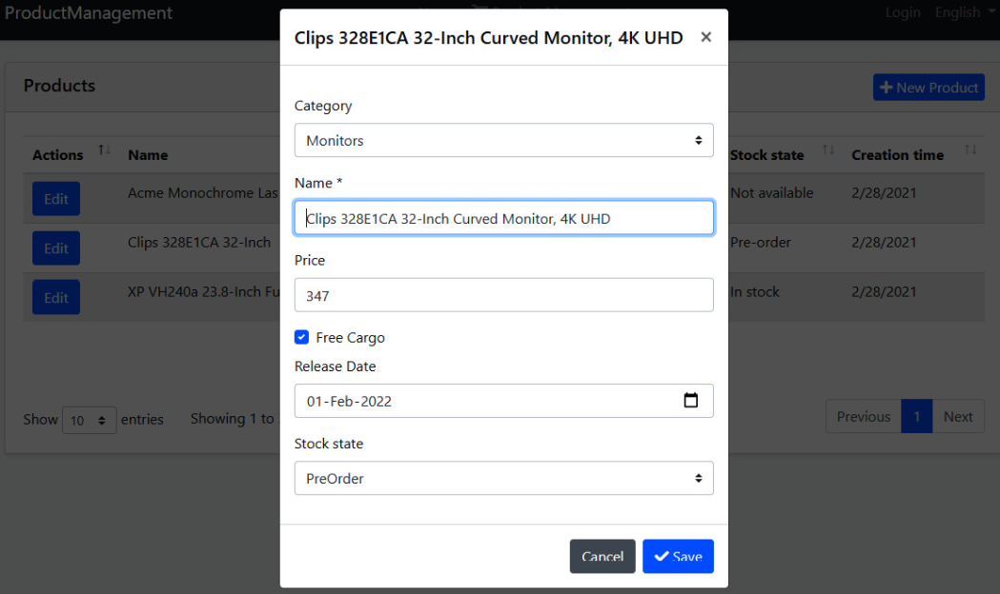

我们现在可以查看、创建和编辑产品了。最后一部分将实现删除产品。

## 7.4 删除产品

删除产品与创建或编辑操作相比，非常简单，因为删除我们不需要构建表单。

首先，在`IProductAppService`接口中添加一个新方法：

```C#
Task DeleteAsync(Guid id);
```

然后，在`ProductAppService`类中实现它：

```C#
public async Task DeleteAsync(Guid id)
{
    await _productRepository.DeleteAsync(id);
}
```

现在向产品列表添加一个新删除按钮。打开`Index.cshtml.js`，并在**Edit**操作之后添加以下定义（在`rowAction.items`数组中）：

```js
{
    text: l('Delete'),
    confirmMessage: function (data) {
        return l('ProductDeletionConfirmationMessage',data.record.name);
    },
    action: function (data) {
        productManagement.products.product
            .delete(data.record.id)
            .then(function() {
                abp.notify.info(l('SuccessfullyDeleted'));
                dataTable.ajax.reload();
            });
    }
}
```

`confirmMessage`用于在删除之前获得用户确认。`productManagement.products.product.delete`函数由 ABP 框架动态创建。通过这种方式，可以直接在 JS 代码中调用服务器端方法。我们只需传递当前记录的 ID。`then`函数传递一个回调函数，用于删除之后的操作。最后，我们使用`abp.notify.info`通知用户，最后刷新数据表。

我们使用了一些本地化文本，因此我们需要在本地化`en.json`文件中添加以下代码：

```json
"ProductDeletionConfirmationMessage": "Are you sure to delete this book: {0}",
"SuccessfullyDeleted": "Successfully deleted!"
```


再次访问 web 查看结果：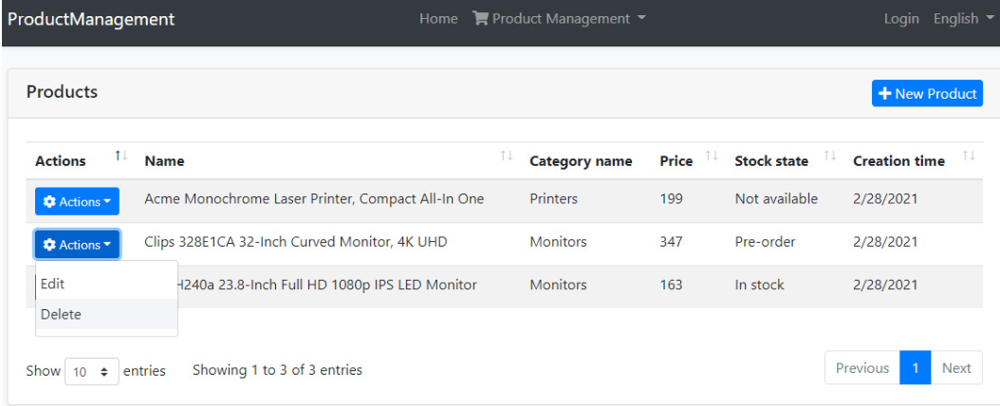

因为现在有两个操作按钮，所以**编辑**按钮会自动变成一个下拉选项。当您单击**删除**操作时，您会收到一条确认消息：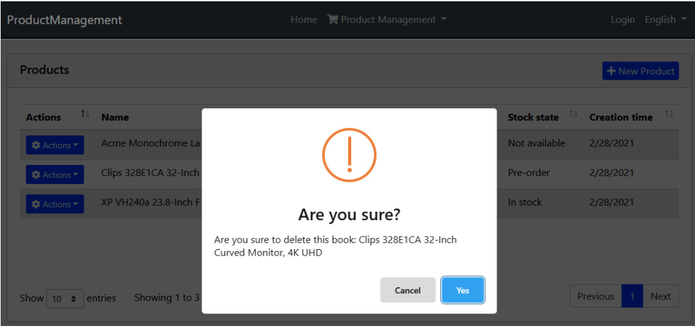

如果你点击在**是**按钮上，您将在页面上看到一条通知，并且数据表将被刷新。

实施产品删除非常简单。ABP 的内置功能帮助我们实现了常见的模式，例如客户端到服务器的通信、确认对话框和 UI 通知。

请注意，`Product`实体派生于`FullAuditedAggregateRoot`，所以它使用了软删除。删除产品后检查数据库，您会看到它并没有真正删除，但是`IsDeleted`字段已经设置为`true`（逻辑删除不是物理删除）。下次查询商品时，已删除的商品会自动过滤掉，不包含在查询结果中。这是由 ABP 框架的数据过滤系统完成的。

# 8 概括

至此上下篇章全部完成了，在本篇中，我们创建了一个完整的 CRUD 页面。我们介绍了解决方案中的所有层，并了解了ABP 的程序开发的基本方法。

同时，也向您介绍了许多不同的概念，例如实体、存储库、数据库映射和迁移、自动化测试、API 控制器、动态 JavaScript 代理、对象映射、软删除等。ABP 是一个全栈应用程序框架，可帮助您通过最佳实践来实现这些概念。它提供了必要的基础设施，使您的日常开发更容易。

此时您可能不了解所有细节。其余篇幅会深入研究这些概念并展示它们的细节和不同的用例。

以上的示例相对简单，它不包含任何重要的业务逻辑，因为我引入了许多概念目的是想让大家对这些基础概念有个初步的理解而不是业务复杂性。 