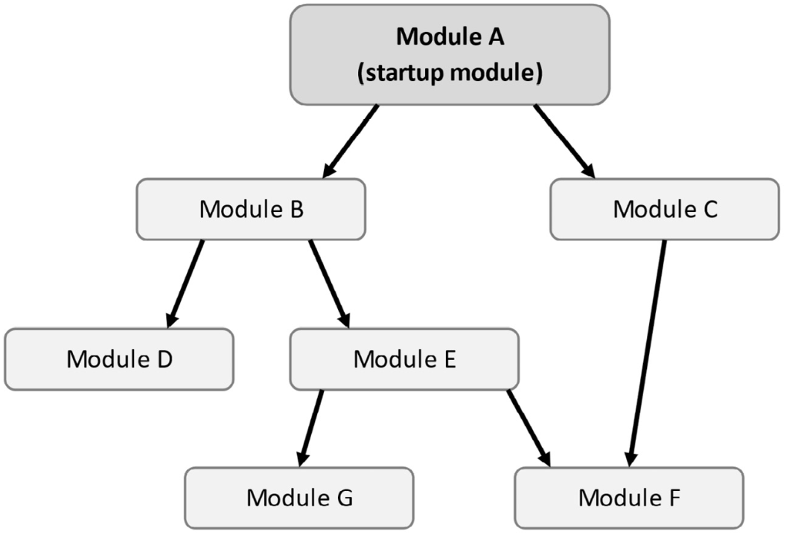

# ABP框架—基础架构

> 原文链接：[探索ABP基础架构-上 - 张飞洪[厦门\] - 博客园 (cnblogs.com)](https://www.cnblogs.com/jackyfei/p/16272230.html)

> 为了了解应用程序是如何配置和初始化，本文将探讨ASP.NET Core和ABP框架最基本的构建模块。我们将从 ASP.NET Core 的 `Startup`类开始了解为什么我们需要模块化系统，以及 ABP 如何提供模块化方式来配置和初始化应用程序。然后我们将探索 ASP.NET Core 的依赖注入，以及ABP是如何使用预定义规则（predefined rules）自动进行依赖注入。最后，我们将了解 ASP.NET Core 的配置和选项框架，以及其他类库。

以下是本文的所有主题：

- 了解模块化
- 使用依赖注入系统
- 配置应用程序
- 实现选项模式
- 日志系统

# 1 了解模块化

**模块化**是一种将大型软件按功能分解为更小的部分，并允许每个部分通过标准化接口进行通信。模块化有以下主要好处：

- 模块按规则进行隔离后，大大降低了系统复杂性。
- 模块之间松散耦合，提供了更大的灵活性。因为模块是可组装、可替换的。
- 因为模块是独立的，所以它允许跨应用被重用。

大多数企业的软件被设计成模块化，但是，实现模块化并不容易。ABP 框架的主要目标之一是为模块化提供基础设施和工具。我们将在后面详细介绍模块化开发，本节只介绍 ABP 模块的基础知识。

## 1.1 Startup 类

在定义ABP的模块之前，建议先熟悉 ASP.NET Core 中的`StartUp`类，我们看下ASP.NET Core 的`Startup`类：

```C#
public class Startup
{
    public void ConfigureServices(IServiceCollection services)
    {
        services.AddMvc();
        services.AddTransient<MyService>();
    }
    public void Configure(IApplicationBuilder app, IWebHostEnvironment env)
    {
        app.UseRouting();
        if (env.IsDevelopment())
        {
            app.UseDeveloperExceptionPage();
        }
        app.UseEndpoints(endpoints =>
        {
            endpoints.MapControllers();
        });
    }
}
```

`ConfigureServices`方法用于配置服务并将新服务注册到依赖注入系统。另一方面，`Configure`方法用于配置 ASP.NET Core 管道中间件，用于处理 HTTP 请求。
在应用程序启动之前，我们需要在`Program.cs`中配置`Startup`类：

```C#
public class Program
{
    public static void Main(string[] args)
    {
        CreateHostBuilder(args).Build().Run();
    }
    public static IHostBuilder CreateHostBuilder(string[] args) =>
        Host.CreateDefaultBuilder(args).ConfigureWebHostDefaults(webBuilder =>
            {
                webBuilder.UseStartup<Startup>();
            });
}
```

这个`Startup`类是独一无二的，我们只有一个点来配置和初始化所有的服务。但是，在模块化应用程序中，我们希望每个模块都能独立配置和初始化与该模块相关的服务。此外，一个模块通常需要使用或依赖于其他模块，因此模块配置顺序和初始化就非常重要了。我们来看下 ABP 的模块是如何定义的

## 1.2 模块定义

ABP 模块是一组类型（比如类或接口），它们一同开发一同交付的。它是一个程序集（一般来说是Visual Studio 中的一个*项目*），派生自`AbpModule`，模块类负责配置和初始化，并在必要时配置依赖模块。

下面是一个短信发送模块的简单定义：

```C#
using Microsoft.Extensions.DependencyInjection;
using Volo.Abp.Modularity;
namespace SmsSending
{
    public class SmsSendingModule : AbpModule 
    {
        public override void ConfigureServices(
ServiceConfigurationContext context)
        {
            context.Services.AddTransient<SmsService>();
        }
    }
}
```

每个模块都可以重写`ConfigureServices`方法，以便将其服务注册到依赖注入系统。此示例中的`SmsService`服务被注册为瞬态生命周期。该示例和上面Startup类似。但是，大多时候，您不需要手动注册服务，这要归功ABP 框架的按约定注册系统。

`OnApplicationInitialization`方法用在服务注册完成后，并且在应用准备就绪后执行。使用此方法，您可以在应用启动时执行任何操作。例如，您可以初始化一个服务：

```csharp
public class SmsSendingModule : AbpModule 
{
    //...
    public override void OnApplicationInitialization(ApplicationInitializationContext context)
    {
        var service = context.ServiceProvider.GetRequiredService<SmsService>();
        service.Initialize();
    }
}
```

这里，我们使用`context.ServiceProvider`从依赖注入系统请求并初始化服务。可见，此时服务已经完成注册。

> 您也可以将`OnApplicationInitialization`方法等同于`Startup`类的`Configure`方法。

您可以在此处构建 ASP.NET Core 请求管道。但是，通常我们会在**启动模块中配置请求管道**，如下一节所述。

## 1.3 模块依赖和启动模块

一个业务应用通常由多个模块组成，ABP 框架允许您声明模块之间的依赖关系。一个应用必须要有一个**启动模块**。启动模块可以依赖于其他模块，其他模块可以再依赖于其他模块，以此类推。

下图是一个简单的模块依赖关系图：


如果所示，如果模块 A 依赖于模块 B，则模块 B 总是在模块 A 之前初始化。这允许模块 A 使用、设置、更改或覆盖模块 B 定义的配置和服务。

对于示例图，模块初始化的顺序应该是：G、F、E、D、B、C、A。

> 您不必知道确切的初始化顺序；只需要知道如果你的模块依赖于模块xx，那么模块xx在你的模块之前被初始化。

ABP使用`[DependsOn]`（属性声明）方式来定义模块依赖：

```fsharp
[DependsOn(typeof(ModuleB), typeof(ModuleC))]
public class ModuleA : AbpModule
{    
}
```

这里，`ModuleA`通过`[DependsOn]`依赖于`ModuleB`和`ModuleC`。
本例中，启动模块`ModuleA`[负责设置ASP.NET](http://xn--asp-vd0ij93cr3b2a.net/) Core 的请求管道：

```csharp
[DependsOn(typeof(ModuleB), typeof(ModuleC))]
public class ModuleA : AbpModule
{
    //...
    public override void OnApplicationInitialization(ApplicationInitializationContext context)
    {
        var app = context.GetApplicationBuilder();
        var env = context.GetEnvironment();
        
        app.UseRouting();
        if (env.IsDevelopment())
        {
            app.UseDeveloperExceptionPage();
        }
        app.UseEndpoints(endpoints =>
        {
            endpoints.MapControllers();
        });
    }
}
```

[代码块和之前ASP.NET Core的 *Startup类* 创建请求管道相同。`context.GetApplicationBuilder()`和`context.GetEnvironment()`用于从依赖注入中获`IApplicationBuilder`和`IWebHostEnvironment`服务。

最后，我们在`Startup`里将ASP.NET Core 和 ABP 框架进行集成：

```cpp
public class Startup
{
    public void ConfigureServices(IServiceCollection services)
    {
        services.AddApplication<ModuleA>();
    }
    public void Configure(IApplicationBuilder app)
    {
        app.InitializeApplication();
    }
}
```

`services.AddApplication()`方法由 ABP 框架定义，用于ABP的模块配置。它按顺序执行了所有模块的`ConfigureServices`方法。而`app.InitializeApplication()`方法也是由 ABP 框架定义，它也是按照模块依赖的顺序来执行所有模块的`OnApplicationInitialization`方法。

> `ConfigureServices`和`OnApplicationInitialization`方法是模块类中最常用的方法。

## 1.4 模块生命周期

`AbpModule`中定义的生命周期方法，除了上面看到的`ConfigureServices`和`OnApplicationInitialization`，下面罗列其他生命周期相关方法：

- `PreConfigureServices`: 这个方法在`ConfigureServices`方法之前被调用。它允许您配置服务之前执行的代码。
- `ConfigureServices`：这是配置模块和注册服务的主要方法。
- `PostConfigureServices`: 该方法在`ConfigureServices`之后调用（包括依赖于您模块的模块），这里可以配置服务后执行的代码。
- `OnPreApplicationInitialization`: 这个方法在`OnApplicationInitialization`之前被调用。在这个阶段，您可以从依赖注入中解析服务，因为服务已经被初始化。
- `OnApplicationInitialization`：此方法用来配置 ASP.NET Core 请求管道并初始化您的服务。
- `OnPostApplicationInitialization`: 这个方法在初始化阶段后被调用。
- `OnApplicationShutdown`：您可以根据需要自己实现模块的关闭逻辑。
  带`Pre…`和`Post…`前缀的方法与原始方法具有相同的目的。它们提供了一种在模块之前或之后执行的一些配置/初始化代码，一般情况下我们很少使用到。

**异步生命周期方法**

> 本节介绍的生命周期方法是同步的。在编写本书时，ABP 框架团队正努力在 框架 5.1 版本引入异步生命周期方法。

如前所述，模块类主要包含**注册和配置**与该模块相关的服务的代码。在下一节中，我们将介绍如何使用 ABP 框架注册服务。

# 2 使用依赖注入系统

## 2.1 .NET 原生依赖注入

依赖注入是一种获取类的依赖的技术，它将创建类与使用该类分开。

假设我们有一个`UserRegistrationService`类，它调用`SmsService`类来发送验证短信，如下：

```csharp
public class UserRegistrationService
{
    private readonly SmsService _smsService;
    public UserRegistrationService(SmsService smsService)
    {
        _smsService = smsService;
    }
    public async Task RegisterAsync(
        string username,
        string password,
        string phoneNumber)
    {
        //...save user in the database
        await _smsService.SendAsync(
            phoneNumber,
            "Your verification code: 1234"
        );
    }
}
```

这里的`SmsService`使用**构造函数注入**来获取实例。也就是说，依赖注入系统会自动帮我们实例化类的依赖项，并将它们赋值给我们的_smsService。

> 注意：ABP采用的是ASP.NET Core原生的依赖注入框架，他自己并没有发明依赖注入框架。

在设计服务时，我们还要考虑另外一件重要的事情：服务生命周期。
ASP.NET Core 为服务注册提供了三个生命周期选项：

- **Transient（瞬态）**：每次您请求/注入服务时，都会创建一个新实例。
- **Scoped（范围）**: 通常这由请求生命周期来评估，您只有在同一范围内才能共享相同的实例。
- **Singleton（单例）**：在应用内有且仅有一个实例。所有请求都使用相同的实例。该对象在第一次请求创建。
  以下模块注册了两个服务，一个是瞬态的，另一个是单例的：

```cpp
public class MyModule : AbpModule
{
    public override void ConfigureServices(ServiceConfigurationContext context)
    {
        context.Services.AddTransient<ISmsService, SmsService>();
        context.Services.AddSingleton<OtherService>();
    }
}
```

`context.Services`的类型是`IServiceCollection`，它是一个扩展方法。

在第一个示例中使用接口注册，第二个示例使用引用类注册为单例。

## 2.2 ABP的依赖注入

使用 ABP 框架时，您不必考虑服务注册，这要归功于 ABP 框架独特的服务注册系统。

### 2.2.1 约定式注册

在 ASP.NET Core 中，所有服务需要显式注册到`IServiceCollection`，如上一节所示。这些注册大多重复，完全可以自动化操作。

ABP 对于以下类型采用自动注册：

- MVC controllers
- Razor page models
- View components
- Razor components
- SignalR hubs
- Application services
- Domain services
- Repositories
  以上类型均使用瞬态生命周期自动注册。如果您还有别的类型，可以考虑接口注册。

### 2.2.2 接口注册

您可以实现以下三种接口来注册：

- `ITransientDependency`
- `IScopedDependency`
- `ISingletonDependency`

例如，在下面代码块中，我们将服务注册为单例：

```kotlin
public class UserPermissionCache : ISingletonDependency
{ }
```

接口注册很容易并且是推荐的方式，但与下面的属性注册相比，它有一定的局限性。

### 2.2.3 属性注册

属性注册更精细，下面是和属性注册相关的配置参数

- `Lifetime`(`enum`): 服务的生命周期，包括`Singleton`,`Transient`和`Scoped`
- `TryRegister`(`bool`)：仅当服务尚未注册时才注册
- `ReplaceServices`(`bool`)：如果服务已经注册，则替换之前的注册

示例代码：

```cpp
using Microsoft.Extensions.DependencyInjection;
using Volo.Abp.DependencyInjection;
namespace UserManagement
{
    [Dependency(ServiceLifetime.Transient, TryRegister = true)]
    public class UserPermissionCache
    { }
}
```

### 2.2.4 接口属性混合注册

属性接口一起使用。如果属性定义了属性，属性比接口优先级更高。

如果一个类可能被注入不同的类或接口，具体取决于暴露的类型。

### 2.2.5 暴露服务

当一个类没有实现接口时，只能通过类引用注入。上一节中的`UserPermissionCache`类就是通过注入类引用来使用的。

假设我们有一个抽象 SMS 发送的接口：

```csharp
public interface ISmsService
{
    Task SendAsync(string phoneNumber, string message);
}
```

假设您要`ISmsService`实现 Azure 服务：

```csharp
public class AzureSmsService : ISmsService, ITransientDependency
{
    public async Task SendAsync(string phoneNumber, string message)
    {
        //TODO: ...
    }
}
```

这里的`AzureSmsService`实现了`ISmsService`和`ITransientDependency`两个接口。而`ITransientDependency`接口才是用于自动注册到依赖注入中的。这里的注入主要通过**命名约定**来实现，因为`AzureSmsService`以`SmsService`作为后缀结尾。
我们再举一个通过命名约定的例子，假设我们有一个实现多个接口的类：

```kotlin
public class PdfExporter: IExporter, IPdfExporter, ICanExport, ITransientDependency
{ }
```

`PdfExporter`服务可以通过注入`IPdfExporter`和`IExporter`接口来使用，也可以直接注入`PdfExporter`类引用来使用。但是，您不能使用`ICanExport`接口注入它，因为名称`PdfExporter`不以`CanExport`为后缀。

一旦您使用该`ExposeServices`属性来暴露服务，如以下代码块所示：

```kotlin
[ExposeServices(typeof(IPdfExporter))]
public class PdfExporter: IExporter, IPdfExporter, ICanExport, ITransientDependency
{ }
```

现在，您只能通过注入`IPdfExporter`接口来使用`PdfExporter`类。

> 我应该为每个服务定义接口吗？

ABP 不会强迫你这么做，但是通用接口来定义是最佳实践：如果你想松散地耦合你的服务。比如，在单元测试中可以轻松模拟测试数据。

这就是为什么我们将接口与实现物理分离（例如，我们在项目中定义`Application.Contracts`接口，并在`Application`项目中实现它们，或者在领域层中定义存储库接口，在基础设施层中实现它们）。

# 3 配置应用程序

ASP.NET Core 的**配置**系统提供了一个基于键值对的配置方法。它是一个可扩展的系统，可以从各种资源中读取键值对，例如 JSON 设置文件、环境变量、命令行参数等等。

## 3.1 设置配置值

默认使用`appsettings.json`文件是配置的最简单方法。假设我们正在构建一个使用 Azure 发送 SMS 的服务，并且我们需要以下配置值：

- `Sender`: 发件人号码
- `ConnectionString`: 你的 Azure 资源的连接字符串

我们可以在`appsettings.json`文件的配置部分定义这些：

```bash
{
  ...
  "AzureSmsService": {
    "Sender": "+901112223344",
    "ConnectionString": "..."
  }
}
```

这里的键名是完全任意的，只要您在代码中使用相同的键，您就可以轻松地读取它们的值。

## 3.2 读取配置值

您可以在需要读取配置值的地方注入`IConfiguration`以使用该服务。例如，我们可以在 `AzureSmsService`中获取Azure 配置值用于发送 SMS：

```csharp
using System.Threading.Tasks;
using Microsoft.Extensions.Configuration;
using Volo.Abp.DependencyInjection;
namespace SmsSending
{
    public class AzureSmsService : ISmsService, ITransientDependency
    {
        private readonly IConfiguration _configuration;
        public AzureSmsService(IConfiguration configuration)
        {
            _configuration = configuration;
        }
        
        public async Task SendAsync(string phoneNumber, string message)
        {
            string sender = _configuration["AzureSmsService:Sender"];
            string ConnectionString = _configuration["AzureSmsService:ConnectionString"];
            //TODO: Use Azure to send the SMS message
        }
    }
}
```

`IConfiguration`服务也可用于`ConfigureServices`中：

```csharp
public override void ConfigureServices(ServiceConfigurationContext context)
{
    IConfiguration configuration = context.Services.GetConfiguration();
    string sender = configuration["AzureSmsService:Sender"];
}
```

这里，我们可以在服务注入之前访问配置值。

以上的配置方式固然方便，但是，如果您正在构建一个可重用的库，则**选项模式**可能是更好的方法，因为它是**类型安全**。

## 3.3 实现选项模式

为了使用**选项模式**，我们使用一个普通的类（有时称为**POCO**–**Plain Old C# Object**），我们从如何定义、配置和使用配置开始。

**定义选项类**

选项类是一个简单的类。我们为 Azure SMS 服务定义一个选项类，如以下代码块所示：

```csharp
public class AzureSmsServiceOptions
{
    public string Sender { get; set; }
    public string ConnectionString { get; set; }
}
```

将后缀`Options`添加到选项类是一种约定。

**配置选项**

您可以在模块的`ConfigureServices`方法中配置，可以使用`IServiceCollection.Configure`的扩展方法为任何选项类设置值。看下下面的代码块是如何配置的：

```csharp
[DependsOn(typeof(SmsSendingModule))]
public class MyStartupModule : AbpModule
{
    public override void ConfigureServices(ServiceConfigurationContext context)
    {
        context.Services.Configure<AzureSmsServiceOptions>(options =>
        {
            options.Sender = "+901112223344";
            options.ConnectionString = "...";
        });
    }
}
```

`context.Services.Configure`方法是获取选项类的通用方法。它还需要一个委托来设置选项值。在此示例中，我们通过在指定的 lambda 表达式中设置`Sender`和`ConnectionString`属性来进行配置。

`AbpModule`基类提供了一个`Configure`方法作为`context.Services.Configure`方法的快捷方式，因此您可以重写代码如下：

```cpp
public override void ConfigureServices(ServiceConfigurationContext context)
{
    Configure<AzureSmsServiceOptions>(options =>
    {
        options.Sender = "+901112223344";
        options.ConnectionString = "...";
    });
}
```

你应该看到了一点点区别了吧？

**使用配置选项值**

ASP.NET Core 提供了一个`IOptions<T>`接口来注入选项类。我们使用`AzureSmsServiceOptions`重写`AzureSmsService`里的`IConfiguration`服务，如以下代码块所示：
public class AzureSmsService : ISmsService, ITransientDependency
{

```csharp
private readonly AzureSmsServiceOptions _options;
    public AzureSmsService(IOptions<AzureSmsServiceOptions> options)
    {
        _options = options.Value;
    }
    
    public async Task SendAsync(string phoneNumber, string message)
    {
        string sender = _options.Sender;
        string ConnectionString = _options.ConnectionString;
        //TODO...
    }
}
```

我们注入`IOptions<AzureSmsServiceOptions>`并使用其`Value`属性来获取配置值。`IOptions<T>`接口定义在`Microsoft.Extensions.Options`包里，是一种标准的选项类注入方式，如果你直接注入`AzureSmsServiceOptions`类，你会得到一个依赖注入异常。所以要通过`IOptions<T>`把选项类包裹起来.

上面只是简单地定义、配置和使用了这些选项。如果我们想结合配置系统来设置选项该怎么办？
首先，我们用`IConfiguration`读取配置，并设置选项值：

```csharp
[DependsOn(typeof(SmsSendingModule))]
public class MyStartupModule : AbpModule
{
    public override void ConfigureServices(ServiceConfigurationContext context)
    {
        var configuration = context.Services.GetConfiguration();        
        Configure<AzureSmsServiceOptions>(options =>
        {
            options.Sender =  configuration\["AzureSmsService:Sender"\];
            options.ConnectionString = configuration\["AzureSmsService:ConnectionString"\];
        });
    }
}
```

我们通过上下文的`context.Services.GetConfiguration()`方法获得`IConfiguration`接口，然后进行赋值操作。
由于这种用法很常见，我们可以重写一下代码，如下块所示：

```csharp
public override void ConfigureServices(ServiceConfigurationContext context)
{
    var configuration = context.Services.GetConfiguration();    
    Configure<AzureSmsServiceOptions>(configuration.GetSection("AzureSmsService"));
}
```

> [success] 翻译点评：虽然改动量很小，但是非常漂亮，可见作者精益求精的态度。

使用这种用法，配置代替了委托操作，它通过命名约定自动将配置键与选项类的属性进行匹配。如果`AzureSmsService`未在配置中定义，则此代码也不会影响选项。

选项模式为开发人员提供了更大的灵活性：他们可以从`IConfiguration`或者其他数据源进行选项设置。

> [success] 提示：默认情况下从配置中设置选项

如果您正在构建可重用模块，最好尽可能从配置中设置选项。也就是说，您可以将前面的代码写入您的模块中。这样，开发人员可以直接从`appsettings.json`文件中配置他们的模块。

**ASP.NET Core 和 ABP 选项**

ASP.NET Core 和 ABP 框架都集中预先使用选项模式配置选项。

以下示例显示了在 ABP 框架中配置选项：

```lisp
Configure<AbpAuditingOptions>(options =>
{
    options.IgnoredTypes.Add(typeof(ProductDto));
});
```

`AbpAuditingOptions`由 ABP 框架的审计日志系统定义。我们正在添加一个类型，用于在审计日志中忽略`ProductDto`。

下一个示例显示在 ASP.NET Core 中配置选项：

```javascript
Configure<MvcOptions>(options =>
{
    options.RespectBrowserAcceptHeader = true;
});
```

`MvcOptions`由 ASP.NET Core 内部定义，用于配置 ASP.NET Core MVC 框架的行为。

**选项类中的复杂类型**

请注意，`AbpAuditingOptions.IgnoredTypes`是一个的`Type`列表，它不是在`appsettings.json`文件中定义的那种简单原始类型，这是选项模式的好处之一：您可以定义具有复杂类型的属性甚至回调动作。

配置和选项系统提供了一种便捷的方式来配置服务的行为。

# 4 概括

本文介绍了 ASP.NET Core 和 ABP 框架的核心模块。

你已经了解了如何使用`Startup`类、配置系统和选项模式来配置 ASP.NET Core 和 ABP 框架服务。

ABP 提供了一个模块化系统，相比 ASP.NET Core 的初始化和配置，ABP支持创建多个模块，其中每个模块支持独立的初始化和配置。通过这种方式，您可以将应用拆分为多个模块，以更好地方式组织代码或创建在不同应用中可重用的模块。

依赖注入系统是ASP.NET Core 最基本的基础设施。一个服务通常使用依赖注入系统消费其他服务。这里介绍了依赖注入系统的基本方面，并解释了 ABP 如何简化服务注册。