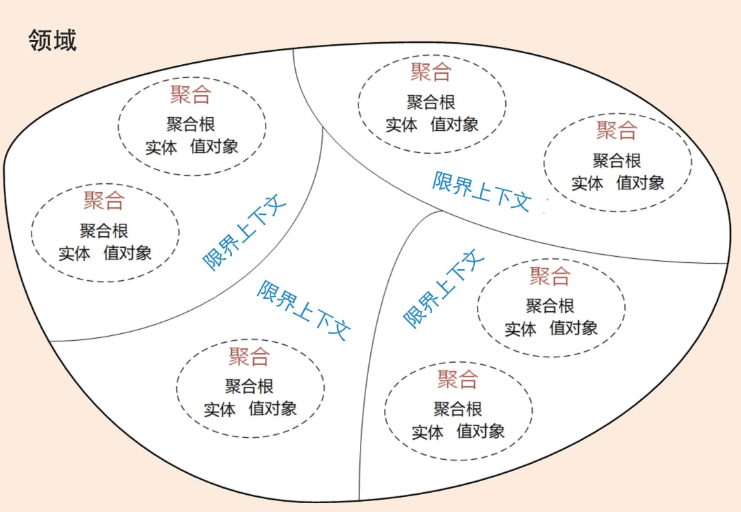

# 为什么要选择DDD

## 软件架构模式的演进

这些年来随着设备和新技术的发展，软件的架构模式发生了很大的变化。软件架构模式大体来说经历了从单机、集中式到分布式微服务架构三个阶段的演进。随着分布式技术的快速兴起，我们已经进入到了微服务架构时代。

**第一阶段是单机架构：**采用面向过程的设计方法，系统包括客户端 UI 层和数据库两层，采用 C/S 架构模式，整个系统围绕数据库驱动设计和开发，并且总是从设计数据库和字段开始。

**第二阶段是集中式架构：**采用面向对象的设计方法，系统包括业务接入层、业务逻辑层和数据库层，采用经典的三层架构，也有部分应用采用传统的 SOA 架构。这种架构容易使系统变得臃肿，可扩展性和弹性伸缩性差。

**第三阶段是分布式微服务架构：**随着微服务架构理念的提出，集中式架构正向分布式微服务架构演进。微服务架构可以很好地实现应用之间的解耦，解决单体应用扩展性和弹性伸缩能力不足的问题。

我们知道，在单机和集中式架构时代，系统分析、设计和开发往往是独立、分阶段割裂进行的。比如，在系统建设过程中，我们经常会看到这样的情形：A 负责提出需求，B 负责需求分析，C 负责系统设计，D 负责代码实现，这样的流程很长，经手的人也很多，很容易导致信息丢失。最后，就很容易导致需求、设计与代码实现的不一致，往往到了软件上线后，我们才发现很多功能并不是自己想要的，或者做出来的功能跟自己提出的需求偏差太大。因此在单机和集中式架构这两种模式下，软件无法快速响应需求和业务的迅速变化，最终错失发展良机。而后面出现的微服务架构能够解决原来采用集中式架构的单体应用的很多问题，比如扩展性、弹性伸缩能力、小规模团队的敏捷开发等等，但它也不全是优点，我们要说到微服务的设计和拆分困境。

## 微服务拆分设计和拆分的困境

微服务实践过程中也产生了不少的争论和疑惑：微服务的粒度应该多大呀？微服务到底应该如何拆分和设计呢？微服务的边界应该在哪里？

由于并没有一套鲜明的系统理论和方法进行明确指导，因此，有人认为：“微服务很简单，不过就是把原来一个单体包拆分为多个部署包，或者将原来的单体应用架构替换为一套支持微服务架构的技术框架，就算是微服务了。” 还有人说：“微服务嘛，就是要微要小，拆得越小效果越好。”然后，你在技术圈中一定听说过一些项目因为前期微服务拆分过度，导致项目复杂度过高，无法上线和运维。

而这里微服务拆分困境产生的根本原因就是不知道业务或者微服务的边界到底在什么地方。换句话说，确定了业务边界和应用边界，这个困境也就迎刃而解了。

而恰恰DDD正好擅长做这些，DDD 核心思想是通过领域驱动设计方法定义领域模型，从而确定业务和应用边界，保证业务模型与代码模型的一致性。

## 为什么DDD适合微服务

DDD 是一种处理高度复杂领域的设计思想，它试图分离技术实现的复杂性，并围绕业务概念构建领域模型来控制业务的复杂性，以解决软件难以理解，难以演进的问题。**DDD 不是架构，而是一种架构设计方法论**，它通过边界划分将复杂业务领域简单化，帮我们设计出清晰的领域和应用边界，可以很容易地实现架构演进。

## DDD包括战略设计和战术设计两部分

战略设计主要从业务视角出发，建立业务领域模型，划分领域边界，建立通用语言的限界上下文，限界上下文可以作为微服务设计的参考边界。

战术设计则从技术视角出发，侧重于领域模型的技术实现，完成软件开发和落地，包括：聚合根、实体、值对象、领域服务、应用服务和资源库等代码逻辑的设计和实现。战术设计关注的是领域中的具体情境和场景，需要针对具体的问题进行具体的分析和设计，以满足业务需求。

DDD 战略设计会建立领域模型，领域模型可以用于指导微服务的设计和拆分。事件风暴是建立领域模型的主要方法，它是一个从发散到收敛的过程。它通常采用用例分析、场景分析和用户旅程分析，尽可能全面不遗漏地分解业务领域，并梳理领域对象之间的关系，这是一个发散的过程。事件风暴过程会产生很多的实体、命令、事件等领域对象，我们将这些领域对象从不同的维度进行聚类，形成如聚合、限界上下文等边界，建立领域模型，这就是一个收敛的过程。

三步来划定领域模型和微服务的边界法：

第一步：在事件风暴中梳理业务过程中的用户操作、事件以及外部依赖关系等，根据这些要素梳理出领域实体等领域对象。

第二步：根据领域实体之间的业务关联性，将业务紧密相关的实体进行组合形成聚合，同时确定聚合中的聚合根、值对象和实体。在这个图里，聚合之间的边界是第一层边界，它们在同一个微服务实例中运行，这个边界是逻辑边界，所以用虚线表示。

第三步：根据业务及语义边界等因素，将一个或者多个聚合划定在一个限界上下文内，形成领域模型。在这个图里，限界上下文之间的边界是第二层边界，这一层边界可能就是未来微服务的边界，不同限界上下文内的领域逻辑被隔离在不同的微服务实例中运行，物理上相互隔离，所以是物理边界，边界之间用实线来表示。

有了这两层边界，微服务的设计就不是什么难事了。

在战略设计中我们建立了领域模型，划定了业务领域的边界，建立了通用语言和限界上下文，确定了领域模型中各个领域对象的关系。到这儿，业务端领域模型的设计工作基本就完成了，这个过程同时也基本确定了应用端的微服务边界。

在从业务模型向微服务落地的过程中，也就是从战略设计向战术设计的实施过程中，我们会将领域模型中的领域对象与代码模型中的代码对象建立映射关系，将业务架构和系统架构进行绑定。当我们去响应业务变化调整业务架构和领域模型时，系统架构也会同时发生调整，并同步建立新的映射关系

## DDD 与微服务的关系

DDD 是一种架构设计方法，微服务是一种架构风格，两者从本质上都是为了追求高响应力，而从业务视角去分离应用系统建设复杂度的手段。两者都强调从业务出发，其核心要义是强调根据业务发展，合理划分领域边界，持续调整现有架构，优化现有代码，以保持架构和代码的生命力，也就是我们常说的演进式架构。

DDD 主要关注：从业务领域视角划分领域边界，构建通用语言进行高效沟通，通过业务抽象，建立领域模型，维持业务和代码的逻辑一致性。

微服务主要关注：运行时的进程间通信、容错和故障隔离，实现去中心化数据管理和去中心化服务治理，关注微服务的独立开发、测试、构建和部署。

# DDD基础概念

## 领域和子域

DDD 会按照一定的规则将业务领域进行细分，当领域细分到一定的程度后，DDD 会将问题范围限定在特定的边界内，在这个边界内建立领域模型，进而用代码实现该领域模型，解决相应的业务问题。简言之，DDD 的领域就是这个边界内要解决的业务问题域。

由于领域是用来界定范围的，因此会有大有小，进而领域可以进一步划分为子领域。我们把划分出来的多个子领域称为子域，每个子域对应一个更小的问题域或更小的业务范围。

下面通过一个自然学科中研究桃树的案例来理解，就能更加通俗易懂了。

第一步：确定研究对象，即研究领域，这里是一棵桃树。

第二步：对研究对象进行细分，将桃树细分为器官，器官又分为营养器官和生殖器官两种。其中营养器官包括根、茎和叶，生殖器官包括花、果实和种子。桃树的知识体系是我们已经确定要研究的问题域，对应 DDD 的领域。根、茎、叶、花、果实和种子等器官则是细分后的问题子域。这个过程就是 DDD 将领域细分为多个子域的过程。

第三步：对器官进行细分，将器官细分为组织。比如，叶子器官可细分为保护组织、营养组织和输导组织等。这个过程就是 DDD 将子域进一步细分为多个子域的过程。

第四步：对组织进行细分，将组织细分为细胞，细胞成为我们研究的最小单元。细胞之间的细胞壁确定了单元的边界，也确定了研究的最小边界。*--涉及到我们后面的界限上下文概念了，可以接合后文介绍回过头来看。*

从上面这个过程我们能够发现，我们把一个庞大的植物体，最后可以细分到研究细胞这个小单元。其实这就是领域建模的一个核心思想了，也是我们在微服务实践过程的一种指导思想，就是将问题域逐步分解，降低业务理解和系统实现的复杂度

## 核心域、通用域、支撑域

在领域不断划分的过程中，领域会细分为不同的子域，子域可以根据自身重要性和功能属性划分为三类子域，它们分别是：核心域、通用域和支撑域。

决定产品和公司核心竞争力的子域是核心域，它是业务成功的主要因素和公司的核心竞争力。没有太多个性化的诉求，同时被多个子域使用的通用功能子域是通用域。还有一种功能子域是必需的，但既不包含决定产品和公司核心竞争力的功能，也不包含通用功能的子域，它就是支撑域。

这三类子域相较之下，核心域是最重要的，我们下面讲目的的时候还会以核心域为例详细介绍。通用域和支撑域如果对应到企业系统，举例来说的话，通用域则是你需要用到的通用系统，比如认证、权限等等，这类应用很容易买到，没有企业特点限制，不需要做太多的定制化。而支撑域则具有企业特性，但不具有通用性，例如数据代码类的数据字典等系统。

那为什么要划分核心域、通用域和支撑域，主要目的是什么呢？实际上，它的目的主要是通过领域划分，区分不同子域在公司内的不同功能属性和重要性，从而公司可对不同子域采取不同的资源投入和建设策略，其关注度也会不一样。

另外，我们要注意，我们在实际的工作中，每个公司的商业模式的不同会导致核心域划分结果的不同。有的公司核心域可能在客户服务，有的可能在产品质量，有的可能在物流。在公司领域细分、建立领域模型和系统建设时，我们就要结合公司战略重点和商业模式，找到核心域了，且重点关注核心域。

## 界限上下文：定义领域边界的利器

在 DDD 领域建模和系统建设过程中，有很多的参与者，包括领域专家、产品经理、项目经理、架构师、开发经理和测试经理等。对同样的领域知识，不同的参与角色可能会有不同的理解，那大家交流起来就会有障碍，怎么办呢？因此，在 DDD 中就出现了“通用语言”和“限界上下文”这两个重要的概念。

这两者相辅相成，通用语言定义上下文含义，限界上下文则定义领域边界，以确保每个上下文含义在它特定的边界内都具有唯一的含义，领域模型则存在于这个边界之内。为了更好的理解界限上下文，接下来我们先从通用语言开始学习。

### 什么是通用语言

通用语言就我个人来理解，就是一种约定的规范和规则，在事件风暴（是Workshop 的形式展开的一种沟通会，类似敏捷活动中的工作坊）过程中，通过团队交流达成共识的，能够简单、清晰、准确描述业务涵义和规则的语言就是通用语言。也就是说，通用语言是团队统一的语言，不管你在团队中承担什么角色，在同一个领域的软件生命周期里都使用统一的语言进行交流。

其作用是解决交流障碍这个问题，使领域专家和开发人员能够协同合作，从而确保业务需求的正确表达

通用语言包含术语和用例场景，并且能够直接反映在代码中。通用语言中的名词可以给领域对象命名，如商品、订单等，对应实体对象；而动词则表示一个动作或事件，如商品已下单、订单已付款等，对应领域事件或者命令。

通用语言贯穿 DDD 的整个设计过程。作为项目团队沟通和协商形成的统一语言，基于它，你就能够开发出可读性更好的代码，将业务需求准确转化为代码设计。

### 什么是界限上下文？

我们知道语言都有它的语义环境，同样，通用语言也有它的上下文环境。为了避免同样的概念或语义在不同的上下文环境中产生歧义，DDD 在战略设计上提出了“限界上下文”这个概念，用来确定语义所在的领域边界。

我们可以将限界上下文拆解为两个词：限界和上下文。限界就是领域的边界，而上下文则是语义环境。通过领域的限界上下文，我们就可以在统一的领域边界内用统一的语言进行交流。

总结：用来封装通用语言和领域对象，提供上下文环境，保证在领域之内的一些术语、业务相关对象等（通用语言）有一个确切的含义，没有二义性。这个边界定义了模型的适用范围，使团队所有成员能够明确地知道什么应该在模型中实现，什么不应该在模型中实现。

案例理解：

正如电商领域的商品一样，商品在不同的阶段有不同的术语，在销售阶段是商品，而在运输阶段则变成了货物。同样的一个东西，由于业务领域的不同，赋予了这些术语不同的涵义和职责边界，这个边界就可能会成为未来微服务设计的边界。看到这，我想你应该非常清楚了，领域边界就是通过限界上下文来定义的。

### 3、界限上下文和微服务的关系

理论上限界上下文就是微服务的边界。我们将限界上下文内的领域模型映射到微服务，就完成了从问题域到软件的解决方案。可以说，限界上下文是微服务设计和拆分的主要依据。在领域模型中，如果不考虑技术异构、团队沟通等其它外部因素，一个限界上下文理论上就可以设计为一个微服务。

## 实体和值对象

### 实体

**概念**

在 DDD 中有这样一类对象，它们拥有唯一标识符，且标识符在历经各种状态变更后仍能保持一致。对这些对象而言，重要的不是其属性，而是其延续性和标识，对象的延续性和标识会跨越甚至超出软件的生命周期。我们把这样的对象称为实体

**实体的业务形态**

在 DDD 不同的设计过程中，实体的形态是不同的。在战略设计时，实体是领域模型的一个重要对象。领域模型中的实体是多个属性、操作或行为的载体。在事件风暴中，我们可以根据命令、操作或者事件，找出产生这些行为的业务实体对象，进而按照一定的业务规则将依存度高和业务关联紧密的多个实体对象和值对象进行聚类，形成聚合。你可以这么理解，实体和值对象是组成领域模型的基础单元。

**实体的代码形态**

在代码模型中，实体的表现形式是实体类，这个类包含了实体的属性和方法，通过这些方法实现实体自身的业务逻辑。在 DDD 里，这些实体类通常采用充血模型（充血模型是指数据和对应的业务逻辑被封装到同一个类中），与这个实体相关的所有业务逻辑都在实体类的方法中实现，跨多个实体的领域逻辑则在领域服务中实现。

**实体的运行形态**

实体以 DO（领域对象）的形式存在，每个实体对象都有唯一的 ID。我们可以对一个实体对象进行多次修改，修改后的数据和原来的数据可能会大不相同。但是，由于它们拥有相同的 ID，它们依然是同一个实体。比如商品是商品上下文的一个实体，通过唯一的商品 ID 来标识，不管这个商品的数据如何变化，商品的 ID 一直保持不变，它始终是同一个商品。

在领域模型映射到数据模型时，一个实体可能对应 0 个、1 个或者多个数据库持久化对象。大多数情况下实体与持久化对象是一对一。在某些场景中，有些实体只是暂驻静态内存的一个运行态实体，它不需要持久化。比如，基于多个价格配置数据计算后生成的折扣实体。

而在有些复杂场景下，实体与持久化对象则可能是一对多或者多对一的关系。比如，用户 user 与角色 role 两个持久化对象可生成权限实体，一个实体对应两个持久化对象，这是一对多的场景。再比如，有些场景为了避免数据库的联表查询，提升系统性能，会将客户信息 customer 和账户信息 account 两类数据保存到同一张数据库表中，客户和账户两个实体可根据需要从一个持久化对象中生成，这就是多对一的场景。

**实体的数据库形态**

与传统数据模型设计优先不同，DDD 是先构建领域模型，针对实际业务场景构建实体对象和行为，再将实体对象映射到数据持久化对象。

### 值对象

**概念**

通过对象属性值来识别的对象，它将多个相关属性组合为一个概念整体。在 DDD 中用来描述领域的特定方面，并且是一个没有标识符的对象，叫作值对象。

也就说，值对象描述了领域中的一件东西，这个东西是不可变的，它将不同的相关属性组合成了一个概念整体。当度量和描述改变时，可以用另外一个值对象予以替换。它可以和其它值对象进行相等性比较，且不会对协作对象造成副作用。

简单来说，值对象本质上就是一个集合。那这个集合里面有什么呢？若干个用于描述目的、具有整体概念和不可修改的属性。那这个集合存在的意义又是什么？在领域建模的过程中，值对象可以保证属性归类的清晰和概念的完整性，避免属性零碎。举例如下：

人员实体原本包括：姓名、年龄、性别以及人员所在的省、市、县和街道等属性。这样显示地址相关的属性就很零碎了对不对？现在，我们可以将“省、市、县和街道等属性”拿出来构成一个“地址属性集合”，这个集合就是值对象了。

**值对象的业务形态**

值对象是 DDD 领域模型中的一个基础对象，它跟实体一样都来源于事件风暴所构建的领域模型，都包含了若干个属性，它与实体一起构成聚合。

我们不妨对照实体，来看值对象的业务形态，这样更好理解。本质上，实体是看得到、摸得着的实实在在的业务对象，实体具有业务属性、业务行为和业务逻辑。而值对象只是若干个属性的集合，只有数据初始化操作和有限的不涉及修改数据的行为，基本不包含业务逻辑。值对象的属性集虽然在物理上独立出来了，但在逻辑上它仍然是实体属性的一部分，用于描述实体的特征。

在值对象中也有部分共享的标准类型的值对象，它们有自己的限界上下文，有自己的持久化对象，可以建立共享的数据类微服务，比如数据字典。

**值对象的代码形态**

值对象在代码中有这样两种形态。如果值对象是单一属性，则直接定义为实体类的属性；如果值对象是属性集合，则把它设计为 Class 类，Class 将具有整体概念的多个属性归集到属性集合，这样的值对象没有 ID，会被实体整体引用。

我们看一下下面这段代码，person 这个实体有若干个单一属性的值对象，比如 Id、name 等属性；同时它也包含多个属性的值对象，比如地址 address。

**值对象的运行形态**

值对象一般以嵌入实体的方式运行，有两种方式，分别是属性嵌入的方式和序列化大对象的方式。引用单一属性的值对象或只有一条记录的多属性值对象的实体，可以采用属性嵌入的方式嵌入。引用一条或多条记录的多属性值对象的实体，可以采用序列化大对象的方式嵌入；

案例 1：以属性嵌入的方式形成的人员实体对象，地址值对象直接以属性值嵌入人员实体中。

案例 2：以序列化大对象的方式形成的人员实体对象，地址值对象被序列化成大对象 Json 串后，嵌入人员实体中。

**值对象的数据库形态**

DDD 引入值对象是希望实现从“数据建模为中心”向“领域建模为中心”转变，减少数据库表的数量和表与表之间复杂的依赖关系，尽可能地简化数据库设计，提升数据库性能。

传统的数据建模大多是根据数据库范式设计的，每一个数据库表对应一个实体，每一个实体的属性值用单独的一列来存储，一个实体主表会对应 N 个实体从表。而值对象在数据库持久化方面简化了设计，它的数据库设计大多采用非数据库范式，值对象的属性值和实体对象的属性值保存在同一个数据库实体表中。

举个例子，还是基于上述人员和地址那个场景，实体和数据模型设计通常有两种解决方案：第一是把地址值对象的所有属性都放到人员实体表中，创建人员实体，创建人员数据表；第二是创建人员和地址两个实体，同时创建人员和地址两张表。

第一个方案会破坏地址的业务涵义和概念完整性，第二个方案增加了不必要的实体和表，需要处理多个实体和表的关系，从而增加了数据库设计的复杂性。

我们可以综合这两个方案的优势，扬长避短，分成领域建模和数据建模两个层面。在领域建模时，我们可以把地址作为值对象，人员作为实体，这样就可以保留地址的业务涵义和概念完整性。而在数据建模时，我们可以将地址的属性值嵌入人员实体数据库表中，只创建人员数据库表。这样既可以兼顾业务含义和表达，又不增加数据库的复杂度。

总结：在领域建模时，我们可以将部分对象设计为值对象，保留对象的业务涵义，同时又减少了实体的数量；在数据建模时，我们可以将值对象嵌入实体，减少实体表的数量，简化数据库设计。

另外，也有 DDD 专家认为，要想发挥对象的威力，就需要优先做领域建模，弱化数据库的作用，只把数据库作为一个保存数据的仓库即可。即使违反数据库设计原则，也不用大惊小怪，只要业务能够顺利运行，就没什么关系。

**值对象的优势和局限**

值对象采用序列化大对象的方法简化了数据库设计，减少了实体表的数量，可以简单、清晰地表达业务概念。这种设计方式虽然降低了数据库设计的复杂度，但却无法满足基于值对象的快速查询，会导致搜索值对象属性值变得异常困难。

值对象采用属性嵌入的方法提升了数据库的性能，但如果实体引用的值对象过多，则会导致实体堆积一堆缺乏概念完整性的属性，这样值对象就会失去业务涵义，操作起来也不方便。

### 实体和值对象的关系

值对象和实体在某些场景下可以互换，很多 DDD 专家在这些场景下，其实也很难判断到底将领域对象设计成实体还是值对象？可以说，值对象在某些场景下有很好的价值，但是并不是所有的场景都适合值对象。你需要根据团队的设计和开发习惯，以及上面的优势和局限分析，选择最适合的方法。

DDD 提倡从领域模型设计出发，而不是先设计数据模型。前面讲过了，传统的数据模型设计通常是一个表对应一个实体，一个主表关联多个从表，当实体表太多的时候就很容易陷入无穷无尽的复杂的数据库设计，领域模型就很容易被数据模型绑架。可以说，值对象的诞生，在一定程度上，和实体是互补的。

还是前面的例子：

在领域模型中人员是实体，地址是值对象，地址值对象被人员实体引用。在数据模型设计时，地址值对象可以作为一个属性集整体嵌入人员实体中，组合形成上图这样的数据模型；也可以以序列化大对象的形式加入到人员的地址属性中，前面表格有展示。

从这个例子中，我们可以看出，同样的对象在不同的场景下，可能会设计出不同的结果。有些场景中，地址会被某一实体引用，它只承担描述实体的作用，并且它的值只能整体替换，这时候你就可以将地址设计为值对象，比如收货地址。而在某些业务场景中，地址会被经常修改，地址是作为一个独立对象存在的，这时候它应该设计为实体，比如行政区划中的地址信息维护。

总结：在 DDD 中，实体和值对象是很基础的领域对象。实体一般对应业务对象，它具有业务属性和业务行为；而值对象主要是属性集合，对实体的状态和特征进行描述。但实体和值对象都只是个体化的对象，它们的行为表现出来的是个体的能力

## 聚合和聚合根

### 聚合

领域模型内的实体和值对象就好比个体，而能让实体和值对象协同工作的组织就是聚合，它用来确保这些领域对象在实现共同的业务逻辑时，能保证数据的一致性。

你可以这么理解，聚合就是由业务和逻辑紧密关联的实体和值对象组合而成的，聚合是数据修改和持久化的基本单元，每一个聚合对应一个仓储，实现数据的持久化。

聚合有一个聚合根和上下文边界，这个边界根据业务单一职责和高内聚原则，定义了聚合内部应该包含哪些实体和值对象，而聚合之间的边界是松耦合的。按照这种方式设计出来的微服务很自然就是“高内聚、低耦合”的。

聚合在 DDD 分层架构里属于领域层，领域层包含了多个聚合，共同实现核心业务逻辑。聚合内实体以充血模型实现个体业务能力，以及业务逻辑的高内聚。跨多个实体的业务逻辑通过领域服务来实现，跨多个聚合的业务逻辑通过应用服务来实现。比如有的业务场景需要同一个聚合的 A 和 B 两个实体来共同完成，我们就可以将这段业务逻辑用领域服务来实现；而有的业务逻辑需要聚合 C 和聚合 D 中的两个服务共同完成，这时你就可以用应用服务来组合这两个服务。

### 聚合根

聚合根的主要目的是为了避免由于复杂数据模型缺少统一的业务规则控制，而导致聚合、实体之间数据不一致性的问题。

传统数据模型中的每一个实体都是对等的，如果任由实体进行无控制地调用和数据修改，很可能会导致实体之间数据逻辑的不一致。而如果采用锁的方式则会增加软件的复杂度，也会降低系统的性能。

**如果把聚合比作组织，那聚合根就是这个组织的负责人。聚合根也称为根实体，它不仅是实体，还是聚合的管理者。**

首先它作为实体本身，拥有实体的属性和业务行为，实现自身的业务逻辑。

其次它作为聚合的管理者，在聚合内部负责协调实体和值对象按照固定的业务规则协同完成共同的业务逻辑

最后在聚合之间，它还是聚合对外的接口人，以聚合根 ID 关联的方式接受外部任务和请求，在上下文内实现聚合之间的业务协同。也就是说，聚合之间通过聚合根 ID 关联引用，如果需要访问其它聚合的实体，就要先访问聚合根，再导航到聚合内部实体，外部对象不能直接访问聚合内实体。

### 怎样设计聚合？

DDD 领域建模通常采用事件风暴，它通常采用用例分析、场景分析和用户旅程分析等方法，通过头脑风暴列出所有可能的业务行为和事件，然后找出产生这些行为的领域对象，并梳理领域对象之间的关系，找出聚合根，找出与聚合根业务紧密关联的实体和值对象，再将聚合根、实体和值对象组合，构建聚合。

### 聚合的一些设计原则

在领域驱动设计中，聚合设计是非常重要的一部分。以下是聚合设计的一些原则

- 保持完整性：聚合中包含一组相互关联的实体和值对象，它们被视为一个整体。聚合的边界应该明确，以保持其完整性。
- 保持一致性：聚合内数据强一致性，而聚合之间数据最终一致性。聚合中的实体和值对象在业务规则和约束下保持一致。如果一个聚合违反了业务规则或约束，那么它就不是一个一致的聚合。
- 保持小型聚合：聚合尽可能小，只包含必要的实体和值对象。小型聚合可以降低由于业务过大导致聚合重构，有助于提高系统的可维护性和可扩展性。
- 避免聚合根以外的实体：聚合根以外的实体应该尽可能避免，因为它们增加了系统的复杂性和耦合度。如果必须使用这些实体，应该确保它们与聚合根之间的关系是一致的。
- 避免跨聚合引用：如果一个实体或值对象需要引用另一个聚合中的实体或值对象，通过关联外部聚合根ID的方式引用，而不是直接对象引用的方式。这样可以保持聚合的独立性和可维护性。

## 聚合、聚合根、实体、值对象之间的特点

- 聚合：高内聚、低耦合，它是领域模型中最底层的边界，可以作为拆分微服务的最小单位
- 聚合根是实体，有实体的特点，具有全局唯一标识，有独立的生命周期
- 一个聚合只有一个聚合根

- 实体具有聚合内唯一性标识，状态可变，依附于聚合根，其生命周期由聚合根管理

- 值对象无标识，不可变，无生命周期

  

# 微服务架构

> 领域服务与应用服务
>
> - 跨多个实体的业务逻辑通过领域服务来实现
> - 跨多个聚合的业务逻辑通过应用服务来实现
>   - 一个聚合：A和B两个实体（领域服务）
>   - 聚合C和聚合D中的两个领域服务（应用服务）
> - 应用服务用来表述应用行为，而领域服务用来表述领域行为
>   - 应用行为描述了一个具体操作，从开始到结束的每一个环节
>   - 领域行为则是对应用行为的细化，用来处理具体的某一个环节购物（用户购物车=>结算=应用行为，用户例程；计算金额、支付、订单、物流）

## DDD分层架构

分层架构：将领域模型和业务逻辑分离出来，并减少对基础设施和应用层的依赖，从最早三层架构，演化到四层架构、五层架构，包括用户接口层、应用层、领域层和基础设施层。分层架构中，每层只能与位于其下方的层耦合。

- 用户接口层：负责展示用户界面和处理用户输入，它通常包含一些前端框架和UI组件
- 应用层：负责处理业务逻辑和应用程序的流程，它通常包含一些应用程序服务，例如事务处理、规则验证和流程管理等
- 领域层：领域层是领域模型的核心，它负责表示业务领域中的实体、值对象、聚合、领域服务等。领域层通常包含一些领域模型类、领域服务类和领域事件等。
- 基础设施层：负责提供一些通用服务和功能，例如数据存储、消息传递、日志记录等。基础设施层通常包含一些工具类、库和框架等。

在传统架构中，由于上层应用对数据库的强耦合，很多业务在架构演进中担心更换数据库对应用的影响，因为一旦更换数据库，就可能需要重写大部分代码，这对开发来说是致命的。采用依赖倒置的设计后，应用层通过解耦保持独立的核心业务逻辑，当数据库变更后，只需要更换数据库基础服务即可，对应用的影响降到最低。

## 整洁架构

整洁架构又名“洋葱架构”。为什么叫它洋葱架构？看看下面这张图你就明白了。整洁架构的层就像洋葱片一样，它体现了分层的设计思想。

在整洁架构里，同心圆代表应用软件的不同部分，从里到外依次是领域模型、领域服务、应用服务和最外围的容易变化的内容，比如用户界面和基础设施。

整洁架构最主要的原则是依赖原则，它定义了各层的依赖关系，越往里依赖越低，代码级别越高，越是核心能力。外圆代码依赖只能指向内圆，内圆不需要知道外圆的任何情况。

在洋葱架构中，各层的职能是这样划分的：

- 领域模型实现领域内核心业务逻辑，它封装了企业级的业务规则。领域模型的主体是实体，一个实体可以是一个带方法的对象，也可以是一个数据结构和方法集合。
- 领域服务实现涉及多个实体的复杂业务逻辑。
- 应用服务实现与用户操作相关的服务组合与编排，它包含了应用特有的业务流程规则，封装和实现了系统所有用例。
- 最外层主要提供适配的能力，适配能力分为主动适配和被动适配。主动适配主要实现外部用户、网页、批处理和自动化测试等对内层业务逻辑访问适配。被动适配主要是实现核心业务逻辑对基础资源访问的适配，比如数据库、缓存、文件系统和消息中间件等。

红圈内的领域模型、领域服务和应用服务一起组成软件核心业务能力。

## 六边形架构

六边形架构又称为“端口-适配器”架构，对于每种外界类型，都有一个适配器与之相对应，其核心设计思想是外界通过应用API与内部进行交互。

如图所示的六边形架构中，核心业务逻辑（应用程序和领域模型）与外部资源（包括Web应用、基础设施等）完全隔离，仅通过适配器进行交互。除了核心的领域模型，还包括如下三个层次：

- 应用程序层（Application Layer）：负责处理业务逻辑和应用程序的流程，它通常包含一些应用程序服务，例如事务处理、规则验证和流程管理等。
- 适配器层（Adapter Layer）：负责与外部系统进行交互，例如与数据库、消息队列、Web 服务等进行通信和交互。它通常包含一些适配器类和工具类等。
- 基础设施层（Infrastructure Layer）：负责提供一些通用服务和功能，例如数据存储、消息传递、日志记录等。基础设施层通常包含一些工具类、库和框架等。

在六边形架构中，一个端口可能对应多个外部系统，不同的外部系统也可能会使用不同的适配器，由适配器负责协议转换。因此在使用时，根据用例来设计应用程序，所有的适配器使用相同的API满足不同的端口访问需求。

## 架构对比

虽然 DDD 分层架构、整洁架构、六边形架构的架构模型表现形式不一样，但你不要被它们的表象所迷惑，这三种架构模型的设计思想正是微服务架构高内聚低耦合原则的完美体现，而它们身上闪耀的正是以领域模型为中心的设计思想。

请你重点关注图中的红色线框，它们是非常重要的分界线，这三种架构里面都有，它的作用就是将核心业务逻辑与外部应用、基础资源进行隔离。

红色框内部主要实现核心业务逻辑，但核心业务逻辑也是有差异的，有的业务逻辑属于领域模型的能力，有的则属于面向用户的用例和流程编排能力。按照这种功能的差异，我们在这三种架构中划分了应用层和领域层，来承担不同的业务逻辑。

- 领域层实现面向领域模型，实现领域模型的核心业务逻辑，属于原子模型，它需要保持领域模型和业务逻辑的稳定，对外提供稳定的细粒度的领域服务，所以它处于架构的核心位置。
- 应用层实现面向用户操作相关的用例和流程，对外提供粗粒度的 API 服务。它就像一个齿轮一样进行前台应用和领域层的适配，接收前台需求，随时做出响应和调整，尽量避免将前台需求传导到领域层。应用层作为配速齿轮则位于前台应用和领域层之间。

可以说，这三种架构都考虑了前端需求的变与领域模型的不变。需求变幻无穷，但变化总是有矩可循的，用户体验、操作习惯、市场环境以及管理流程的变化，往往会导致界面逻辑和流程的多变。但总体来说，不管前端如何变化，在企业没有大的变革的情况下，核心领域逻辑基本不会大变，所以领域模型相对稳定，而用例和流程则会随着外部应用需求而随时调整。把握好这个规律，我们就知道该如何设计应用层和领域层了。

架构模型通过分层的方式来控制需求变化从外到里对系统的影响，从外向里受需求影响逐步减小。面向用户的前端可以快速响应外部需求进行调整和发布，灵活多变，应用层通过服务组合和编排来实现业务流程的快速适配上线，减少传导到领域层的需求，使领域层保持长期稳定。

这样设计的好处很明显了，就是可以保证领域层的核心业务逻辑不会因为外部需求和流程的变动而调整，对于建立前台灵活、中台稳固的架构很有帮助。

# 其他

##  贫血模型和充血模型

- 贫血模型（Anemic Domain Model）

  所谓的贫血模型指的是定义领域对象的时候，只有对象的属性信息，没有对象的行为信息。贫血模型强调了业务逻辑和数据之间的分离，将业务逻辑和数据分别放在不同的对象中，导致领域模型变得贫血、不灵活和难以维护。

- 充血模型（Rich Domain Model）

  充血模型指的是领域对象既包括属性信息，又包含行为信息。在充血模型中，领域对象包含了业务逻辑、数据和规则，它们被组织在一个聚合根中。相对而言贫血模型相对简单，模型上只有数据没有行为，针对简单的模型可以快速的完成交付，但是后期的成本较高，并且难以保证事务的一致性和完整性。充血模型则是领域模型模式，实现逻辑上由各自的对象负责，具备事务的一致性和完整性，事务边界也被包含在聚合根中。

# 参考资料

[DDD从入门到精通（请点赞收藏，欢迎互粉）_ddd入门-CSDN博客](https://blog.csdn.net/wanghaiping1993/article/details/125433802)