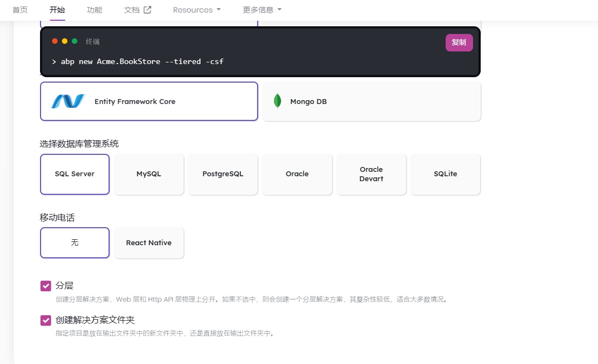
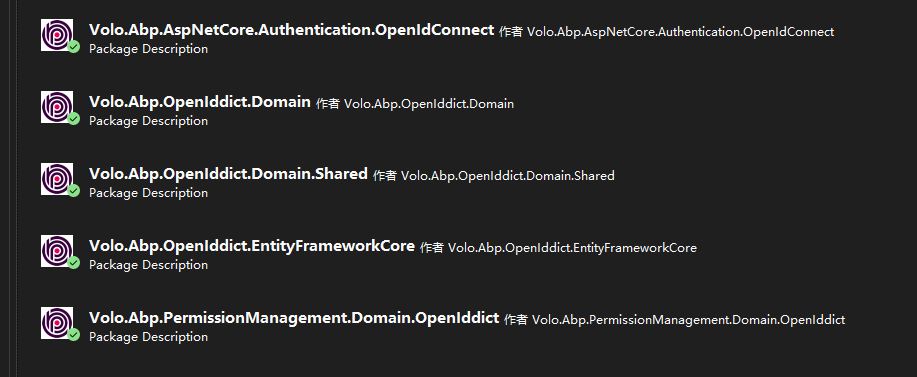

## `数据过滤器`

## 虚拟文件系统

## 本地化模块

## 异常处理

## 集成日志

## `DTO模型验证`


学习资料：

[[Abp 源码分析\]十三、多语言(本地化)处理 - MyZony - 博客园 (cnblogs.com)](https://www.cnblogs.com/myzony/p/9496490.html)

[Virtual File System | Documentation Center | ABP.IO](https://docs.abp.io/zh-Hans/abp/latest/Virtual-File-System)


ABP集成IdentityServer模块

创建分层解决方案



命令：

```shell
abp new Id4.BookStore --tiered -csf
```

卸载项目已集成的OpenIddict相关包

移除项目中OpenIddict相关依赖

删除OpenID相关的数据种子相关类

安装IdentitySevver模块

可通过命令行安装

（1）在解决方案文件夹执行以下命令

```C#
app add-module Volo.IdentityServer --skip-db-migrations
```

（2）手动添加

- 删除OpenID相关模块

  

- 引入Nuget包（Volo.Abp.IdentityServer开头）

  Volo.Abp.AspNetCore.Authentication.IdentityServer（AuthServer项目）

  Volo.Abp.IdentityServer.Domain（Domain项目）

  Volo.Abp.PermissionManagement.Domain.IdentityServer（Domain项目）

  Volo.Abp.IdentityServer.Domain.Shared（Domain.Shared项目）

  Volo.Abp.IdentityServer.EntityFrameWorkCore

- 在各个模块添加相关依赖

  *.Domain项目

  ```C#
  [DependsOn(typeof(AbpIdentityServerDomainModule),
  typeof(AbpPermissionManagementDomainIdentityServerModule))]
  ```

  *.EntityFrameWorkCore项目

  ```C#
  [DependsOn(typeof(AbpIdentityServerEntityFrameworkCoreModule))]
  ```

  修改EFCore上下文DBContext,添加Id4实体

  ```C#
  builder.ConfigureIdentityServer();
  ```

  

  删掉OpenID（迁移Migrations文件夹）

  添加新的迁移

  程序包管理控制台

  ```shell
  Add-Migration InitialCreate
  ```

  添加种子贡献类

  IdentityServer/IdentityServerDataSeedContributor.cs(可参照abp示例类)

  添加IdentitySever相关配置项

  修改*.DbMigratord的appsettings.json文件

  将“OpenIddict”修改为“IdentityServers”

  将“Applications”修改为“Clients”

  其他配置项都是通用的

  修改授权服务器

  修改Nuget包Volo.Abp.Account.Web.OpenIddict->Volo.Abp.Account.Web.IdentityServer

  修改模块依赖为IdentityServer相关

  删除PreConfigureServices中OpenID配置

  修改中间件为app.UseIdentityServer()

  修改前端

  将Applications修改为Clients

  将OpenIdApplicationReposity修改为ClientReposity

- 需要用到Redis，配置Redis服务器地址

- 执行DbMigrator生成数据库


