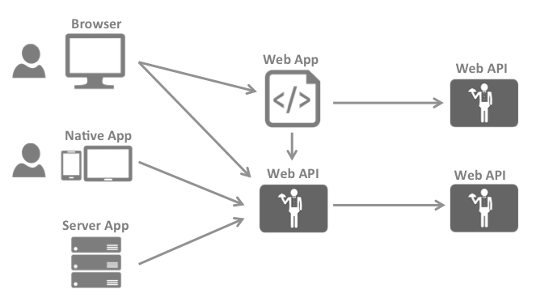
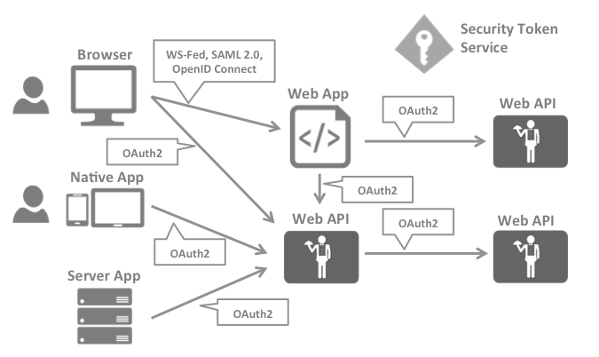

# IdentityServer4 中文文档与实战

> 原文链接：https://www.cnblogs.com/stulzq/p/8119928.html

# 1. 介绍

## 1. 特性一览

entityServer4是ASP.NET Core 2的OpenID Connect和OAuth 2.0框架。它可以在您的应用程序中提供以下功能：

它使你的应用程序具有如下特点：

- 认证即服务

  适用于所有应用程序（web, native, mobile, services）的集中登录逻辑和工作流程。IdentityServer是OpenID Connect的官方认证实现。

- 单点登录/注销

  多个类型的应用程序在一个点进行登录和注销操作。

- API 访问控制

  为各种类型的客户端颁发API的访问令牌，例如 服务器到服务器、Web应用程序，SPA、本地应用和移动应用程序。

-  联合网关

  支持Azure Active Directory，Google，Facebook等外部身份提供商。这可以保护您的应用程序免受如何连接到这些外部提供商的详细信息的影响

- 专注于定制

  最重要的部分 - IdentityServer的许多方面都可以根据您的需求进行定制。由于IdentityServer是一个框架而不是现成的产品或SaaS，因此您可以编写代码以使系统适应您的方案。

-  成熟的开源

  IdentityServer使用的Apache 2开源协议，允许在其上构建商业产品。它也是.NET Foundation的一部分，它提供治理和法律支持

-  免费和商业支持

  如果您需要帮助构建或运行您的身份平台，请告知IdentityServer官方。 他们可以通过多种方式为您提供帮助。

## 2. 整体介绍

- 整体情况

  现代应用程序看起来更像这个：

  最常见的相互作用：

  - 浏览器与Web应用程序的通信 Browser -> Web App
  - Web应用程序与Web API通信
  - 基于浏览器的应用程序与Web API
  - 本机应用程序与Web API进行沟通
  - 基于服务器的应用程序与Web API
  - Web API与Web API通信

  通常，每个层（前端、中间层和后端）必须保护资源并实现身份验证或授权——通常针对同一个用户存储区。 

  将这些基本安全功能外包给安全令牌服务可以防止在这些应用程序和端点上复制该功能。 

  应用支持安全令牌服务将引起下面的体系结构和协议：

- 认证

  认证可以让一个应用程序知道当前用户的身份。 通常，这些应用程序代表该用户管理数据，并且需要确保该用户只能访问允许他访问的数据。最常见的示例是Web应用程序，但基于本地和基于js的应用程序也需要进行身份验证。 

  最常用的认证协议saml2p、WS-Federation和OpenID，saml2p协议是最流行和实际应用最多的。

  OpenID Connect对于现在应用来说是被认为是未来最有潜力的，这是专为移动应用场景设计的，一开始就被设计成对移动应用场景友好。

- API访问

  应用程序有两种基本方式与API进行通信，一种是使用应用程序标识，另一种是委托用户的身份。有时这两种方法都需要结合。

  OAuth2协议，它允许应用程序从一个安全令牌服务要求访问令牌，使用这个访问令牌来访问API。这个机制降低了客户机应用程序和API的复杂性，因为身份验证和授权可以是集中式的。

- OpenID Connect和OAuth2.0结合

  OpenID Connect 和 OAuth 2.0非常相似，事实上OpenID Connect 是在OAuth 2.0之上的一个扩展。两个基本的安全问题，认证和API访问，被组合成单个协议，通常只需一次往返安全令牌服务。

   我们认为OpenID Connect和OAuth 2.0的组合是可预见在未来是保护现代应用程序的最佳方法。IdentityServer4是这两种协议的实现，并且被高度优化以解决当今移动应用、本地应用和web应用的典型安全问题

- IdentityServer4可以帮助你做什么

  IdentityServer是将规范兼容的OpenID Connect和OAuth 2.0端点添加到任意ASP.NET Core应用程序的中间件。通常，您构建（或重新使用）包含登录和注销页面的应用程序，IdentityServer中间件会向其添加必要的协议头，以便客户端应用程序可以与其对话 使用这些标准协议。

## 3. 术语的解释

- 身份认证服务器（IdentityServer）

  IdentityServer是一个OpenID Connect提供程序，它实现了OpenID Connect 和 OAuth 2.0 协议。

  同样的角色，不同的文档使用不同的术语。在有些文档中，它（IdentityServer）可能会被叫做安全令牌服务器（security token service）、身份提供者（identity provider）、授权服务器（authorization server）、 标识提供方（(IP-STS，什么是[IP-STS](https://msdn.microsoft.com/zh-cn/library/ee748489.aspx)）等等。

  但是它们都是一样的，都是向客户端发送安全令牌（security token），

  IdentityServer有许多功能：

  - 保护你的资源

  - 使用本地帐户或通过外部身份提供程序对用户进行身份验证

  - 提供会话管理和单点登录

  - 管理和验证客户机

  - 向客户发出标识和访问令牌

  - 验证令牌

- 用户（User）

  用户是使用注册的客户端访问资源的人。

- 客户端（Client）

  客户端是从IdentityServer请求令牌的软件，用于验证用户（请求身份令牌）或访问资源（请求访问令牌）。 必须首先向IdentityServer注册客户端才能请求令牌。

  客户端可以是Web应用程序，本地移动或桌面应用程序，SPA，服务器进程等。

- 资源（Resources）

  资源是您想要使用IdentityServer保护的资源 ， 您的用户的身份数据或API。

  每个资源都有一个唯一的名称 ，客户端使用这个名称来指定他们想要访问的资源。

  用户身份数据标识信息，比如姓名或邮件地址等。

  API资源，表示客户端想要调用的功能 ，通常被建模为Web API，但不一定。

- 身份令牌（Identity Token）

  身份令牌表示身份验证过程的结果。 它最低限度地标识了某个用户，还包含了用户的认证时间和认证方式。 它可以包含额外身份数据。

- 访问令牌（Access Token）

  访问令牌允许访问API资源。 客户端请求访问令牌并将其转发到API。 访问令牌包含有关客户端和用户的信息（如果存在）。 API使用该信息来授权访问其数据。

## 4. 支持的规范

IdentityServer实现以下规范：

- OpenID Connect

  OpenID Connect Core 1.0 (spec)
  OpenID Connect Discovery 1.0 (spec)
  OpenID Connect Session Management 1.0 - draft 22 (spec)
  OpenID Connect HTTP-based Logout 1.0 - draft 03 (spec)

- OAuth 2.0
  OAuth 2.0 (RC-6749)
  OAuth 2.0 Bearer Token Usage (RFC 6750)
  OAuth 2.0 Multiple Response Types (spec)
  OAuth 2.0 Form Post Response Mode (spec)
  OAuth 2.0 Token Revocation (RFC 7009)
  OAuth 2.0 Token Introspection (RFC 7662)
  Proof Key for Code Exchange (RFC 7636)
  JSON Web Tokens for Client Authentication (RFC 7523)

## 1.5 包和构建说明

IdentityServer有许多Nuget包组件

- IdentityServer4
  nuget | github

  包含IdentityServer核心对象模型、服务和中间件。默认只包含了基于内存（In-Memory）的配置和用户信息的存储，主要用于快速学习、测试IdentityServer4，你可通过实现 IdentityServer4 提供的接口，来接入自定义持久化存储。

- Quickstart UI
  github

  包含一个简单的入门UI，包括登录，注销和授权询问页面。

- Access token validation middleware
  nuget | github

  用于验证API中令牌的ASP.NET Core身份验证处理程序。处理程序允许在同一API中支持JWT和reference Token。

- ASP.NET Core Identity
  nuget | github

  IdentityServer的ASP.NET Core Identity集成包。此包提供了一个简单的配置API，可以让IdentityServer用户使用ASP.NET Identity。

- EntityFramework Core
  nuget | github

  IdentityServer的EntityFramework Core存储实现。这个包提供了IdentityServer的配置和操作存储的EntityFramework Core实现。

- Dev builds
  此外，开发/临时构建将发布到MyGet。如果要尝试，请将以下包源添加到Visual Studio：https://www.myget.org/F/identity/
