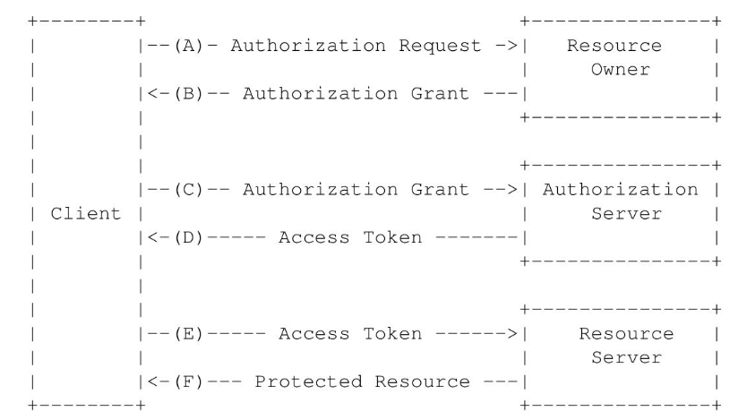
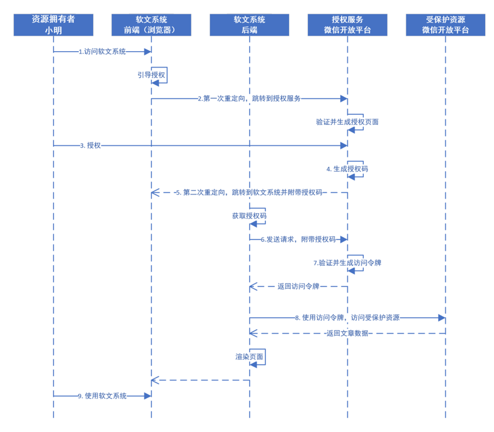
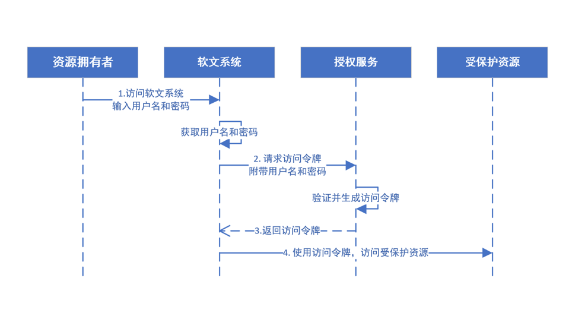
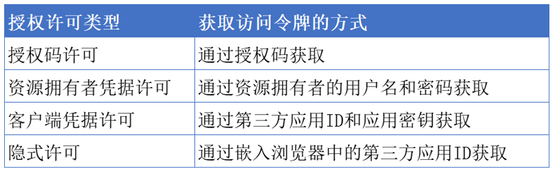

# IdentityServer4 中文文档与实战

> 原文链接：https://www.cnblogs.com/stulzq/p/8119928.html

# 扩展阅读

## 1. OAuth2解决什么问题的？

举个栗子先。**小明**在**QQ空间**积攒了多年的照片，想挑选一些照片来打印出来。然后小明在找到一家提供在线打印并且包邮的网站（我们叫它**PP**吧（Print Photo缩写 😂））。

那么现在问题来了，小明有两个方案来得到打印的服务。

1. 在自己的QQ空间把想要打印的照片下载下来，然后提供给PP（直接发邮件给PP或者网盘共享给PP等等）。
2. 把自己的QQ账号密码给PP，然后告诉PP我要打印哪些照片。

针对方案（1）：小明要去下载这些照片，然后给PP，小明累觉不爱，，，

针对方案（2）：小明交出去自己的QQ账号密码，还要告诉PP哪些需要打印，哪些不需要，小明觉得自己有些小秘密不想给PP看，，，

小明觉得很痛苦，，，那么有没有不给PP账号密码，不下载照片，自己选哪些要打印直接扔给PP去打印的办法呢？OAuth走了过来扔给小明一块肥皂...

## 2 OAuth2简介

总结来说，OAuth2 是一个**开放授权标准，**它允许用户（小明）让第三方应用（PP）访问该用户在某服务的**特定私有资源**（QQ空间中小明的照片，可以不包含小明的小视频哦）但是不提供账号密码信息给第三方应用（PP）*。*

> 有个小问题，为啥是OAuth2呢？1在哪？嗯，这个嘛，其实是有1和1.1版本的，只是因为1和1.1版本流程比较复杂，应用不是很广范，这里就不介绍了。据笔者以前做过的项目，Twitter是使用的OAuth1.1的版本，感兴趣的可以去了解下https://dev.twitter.com/oauth。

 **OAuth2的四个重要角色**

进入正题，在OAuth2的完整授权流程中有4个重要的角色参与进来：

1. **Resource Owner**：资源拥有者，上面栗子中的**小明**；
2. **Resource Server**：资源服务器，上面栗子中的**QQ空间**，它是小明想要分享照片给PP的照片的提供方；
3. **Client**：第三方应用客户端，上面栗子中的**PP**，代指任何可以消费资源服务器的第三方应用；
4. **Authorization Server** ：授权服务器，管理**Resource Owner，Client和Resource Server的三角关系的中间层**。

其中Authorization server和Resource server可以是独立的服务提供商，也可以是在一起的，比如腾讯提供QQ空间作为资源服务器的同时也提供授权服务。

从这里可以看出，OAuth2在解决小明遇到的问题的过程中增加了一个**Authorization server**的角色。又印证了那句话，在计算机领域的所有问题都可以添加一个中间层来解决。

OAuth2解决问题的关键在于使用Authorization server提供一个访问凭据给Client，使得Client可以在不知道Resource owner在Resource server上的用户名和密码的情况下消费Resource owner的受保护资源。

## 3. 部署OAuth2需要的完成的工作

由于OAuth2引入了Authorization server来管理Resource Owner，Client和Resource Server的三角关系，那么想要用上OAuth2，是实现以下功能的。

1. 增加一个Authorization server，提供授权的实现，一般由Resource server 来提供。
2. Resource server 为第三方应用程序提供注册接口。
3. Resource server 开放相应的受保护资源的API。
4. Client 注册成为Resource server的第三方应用。
5. Client 消费这些API。

作为资源服务提供商来说，1，2，3这三件事情是需要完成的。

作为第三方应用程序，要完成的工作是在4和5这两个步骤中。

其中作为Resource owner来说，是不用做什么的，是OAuth2受益的千千万万的最终人类用户。

### 3.1 Resource server

在一般情况下，Resource server提供Authorization server服务，主要提供两类接口：

1. 授权接口：接受Client的授权请求，引导用户到Resource server完成登陆授权的过程。
2. 获取访问令牌接口：使用授权接口提供的许可凭据来颁发Resource owner的访问令牌给Client，或者由Client更新过期的访问令牌。

除此之外，还需要提供一个第三方应用程序注册管理的服务。通常情况下会为注册完成的第三方应用程序分配两个成对出现的重要参数：

1. client_id：第三方应用程序的一个标识id，这个信息通常是公开的信息，用来区分哪一个第三方应用程序。
2. client_secret：第三方应用程序的私钥信息，这个信息是私密的信息，不允许在OAuth2流程中传递的，用于安全方面的检测和加密。

### 3.2 Client

在Client取得client_id和client_secret之后。使用这些信息来发起授权请求、获取access_token请求和消费受保护的资源。

## 4. OAuth2的授权流程

在上述的OAuth完整流程中，（A）->（B）->（C）->（D）是授权的过程（参与者有**小明**，**PP**，**QQ空间**，**Authorization server**）；（E）->（F）是消费资源的过程（参与者有**PP**和**QQ空间**）。

- （A）**小明**访问**PP**，**PP**向**QQ空间**发起授权请求；
- （B）**QQ空间**接受**PP**的授权请求，并返回*授权许可*给**PP**；
- （C）**PP**使用*授权许可*向**Authorization server**发起请求**；**
- （D）**Authorization server**验证**PP**的身份和*授权许可*，发送*访问令牌*给**PP**；
- （E）**PP**用*访问令牌*请求**小明**存储在**QQ空间**的照片；
- （F）**QQ空间**根据*访问令牌*，返回**小明**的照片信息给**PP**。

这其中比较重要的一个概念是***访问令牌*** ，它代表的信息是整个OAuth2的核心，也是ABCD这些步骤最终要得到的信息。

访问令牌是对**PP可以在QQ空间访问小明的哪些信息**这个完整权限的一个抽象，比如PP要访问小李在QQ空间的照片，那么就是另外一个访问令牌了。

访问令牌背后抽象的信息有哪些呢?如下3类信息。

1. 客户端标识（比如**PP**）；
2. 用户标识（比如**小明**）；
3. 客户端能访问资源所有者的哪些资源以及其相应的权限。

有了这三类信息，那么资源服务器（Resouce Server）就可以区分出来是哪个第三方应用（Client）要访问哪个用户（Resource Owner）的哪些资源（以及有没有权限）。

## 5. OAuth2的4种授权许可

上一小节介绍了OAuth2的授权流程，除了访问令牌之外，还有一个重要的概念**授权许可（Authorization Grant）。**

书面化的方式解释就是**授权许可是一个代表资源所有者授权（访问受保护资源）的凭据，客户端用它来获取访问令牌**。读起来比较抽象，翻一下就是**授权许可是小明授予PP获得QQ空间访问令牌的一个凭据**。

那么如何获得这个凭据呐，OAuth2定义了四种许可类型以及用于定义其他类型的可扩展性机制：

- Authorization Code：授权码；

  适合用户授权第三方应用获取当前APP的某些资源。

- Implicit：隐式许可；

  安全性较低；适合于没有后端的前端应用，即纯粹的js应用

- Resource Owner Password Credentials：资源所有者密码凭据；

  需要客户端提供用户名和密码，密码模式相较于客户端凭证模式。通过User的用户名和密码向Identity Server申请访问令牌

  适用于当前的APP是专门为服务端设计的情况(比如为主项目设计的子项目）

- Client Credentials ：客户端凭据。

  客户端模式只对客户端进行授权，不涉及到用户信息。如果你的api需要提供到第三方应用，第三方应用自己做用户授权，不需要用户参与授权，就可以用客户端模式，只对客户端进行授权访问api资源。

**注意：以下4种授权许可是对上述(4. OAuth2的授权流程)中的ABDE四个阶段的展开。**

### 5.1 Authorization Code(授权码)

这是OAuth2最常用的一种授权许可类型，比如QQ，微博，Facebook和豆瓣等等。

示例流程图：

思考：

- 为什么不直接办法访问令牌，而是先办法授权码，然后通过授权码获取访问令牌？

  如果直接返回访问令牌，则会将访问令牌暴露在URL中，导致安全问题

- 为什么不省略第四步重定向，直接把访问令牌返回给软文系统后端处理

  如果这样做，软文系统后端获取到资源后，无法返回页面给前端，第一次重定向后，资源拥有者小明就与软文系统失去了联系，所以必须要有第二次重定向，与小明获取联系

### 5.2 Implicit（简化/隐式模式）

这个是Authorization Code的简化版本。其中省略掉了颁发授权码（Authorization Code）给客户端的过程，而是直接返回访问令牌和可选的刷新令牌。其`适用于没有Server服务器来接受处理Authorization Code的第三方应用，即纯前端引用`，示例流程图：

### 5.3 Resource Owner Password Credentials Grant（资源拥有者许可模式）

需要客户端提供用户名和密码，密码模式相较于客户端凭证模式。通过User的用户名和密码向Identity Server申请访问令牌。`适用于当前的APP是专门为服务端设计的情况(比如为主项目设计的子项目）`

### 5.4 Client Credentials Grant（客户端模式）

这种类型就更简化了，Client直接已自己的名义而不是Resource owner的名义去要求访问Resource server的一些受保护资源。

客户端模式只对客户端进行授权，不涉及到用户信息。如果你的api需要提供到第三方应用，第三方应用自己做用户授权，`不需要用到你的用户资源，就可以用客户端模式`，只对客户端进行授权访问api资源。

### 5.5 混合模式（OIDC）

授权码模式+隐式许可=在返回授权码的同时返回返回令牌

授权码：获取访问令牌①（权限更多）

访问令牌②：访问受保护资源（特指用户身份信息）

授权码获取的访问令牌①与此此访问令牌②是不同的

分离了身份验证操作+授权操作

### 5.6 总结

OIDC===身份认证+授权：是建立在OAUth2.0，在此基础上加上了身份认证（登录、登出、用户信息）
