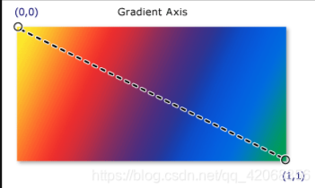
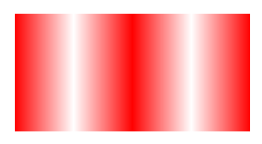
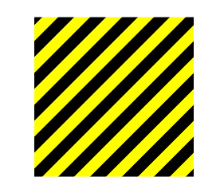

## LinearGradientBrush

LinearGradientBrush线性渐变画刷
LinearGradientBrush其实很简单，我们只需要关注5个属性，使用这5个属性你就可以完成这个画刷几乎所有的变化。

### 属性介绍

#### StartPoint

渐变画刷的起点，默认规定起点坐标是(0,0)。

注：这个0是指整个长度的0%的位置，而不是坐标为0。

#### EndPoint

渐变画刷的终点，默认规定终点坐标是(1,1)。

注：这个1是指整个长度的100%的位置，而不是坐标为1。即0.5指的是影响一半的长度。

#### MappingMode

该值指定渐变画笔的定位坐标的解释方式。
这个属性只有两个枚举值可选RelativeToBoundingBox(默认)和Absolute。

首先我们假设上面这个矩形Width=100,Height=50。
使用RelativeToBoundingBox时，起点坐标和终点坐标就是(0,0)和(1,1)，和矩形长宽无关。
使用Absolute时，起点坐标和终点坐标就是(0,0)和(100,50)。

#### SpreadMethod

用于绘制渐变的扩展方法的类型
该属性有三个枚举值可选Pad(默认)，Reflect，Repeat。
使用Pad时， 渐变向量末端的颜色值填充剩余的空间。
使用Reflect时， 按设置颜色的倒转方向重复渐变，直至充满空间。
使用Repeat时， 按原始方向重复渐变，直至充满空间。

#### GradientStops

该属性用于存放多个GradientStop，用于设置渐变停止点，之前设置的颜色会在渐变停止点停止渐变。
GradientStop有两个属性
Offset ：偏移量，值为0~1表示渐变停止的坐标。
Color ：颜色，该坐标的颜色。
上一个坐标的颜色会慢慢渐变成这个坐标的颜色。

### 实例

1、一个从蓝色渐变成红色的画刷

```xaml
    <Window.Resources>
        <LinearGradientBrush x:Key="cutomBrush" StartPoint="0,0" EndPoint="1,0">
            <GradientStop Color="Blue" Offset="0"/>
            <GradientStop Color="Red" Offset="1"/>
        </LinearGradientBrush>
    </Window.Resources>
    <Grid>
        <Border Width="200" Height="200" Background="{StaticResource cutomBrush}"/>
    </Grid>
```


2、设置SpreadMethod属性为Reflect或者Repeat时，可以实现重复填充。

```xaml
    <Window.Resources>
        <LinearGradientBrush x:Key="cutomBrush" SpreadMethod="Reflect" MappingMode="Absolute" StartPoint="0,0" EndPoint="100,0">
            <GradientStop Color="White" Offset="1"/>
            <GradientStop Color="Red" Offset="0"/>
        </LinearGradientBrush>
    </Window.Resources>
    <Grid>
        <Border Width="400" Height="200" Background="{StaticResource cutomBrush}"/>
    </Grid>
```



3、如果两个GradientStop之间颜色相同，那就不会发生渐变，这样就可以做出多条重复实线的画刷。

```xaml
    <Window.Resources>
        <LinearGradientBrush x:Key="cutomBrush" SpreadMethod="Reflect" MappingMode="Absolute" StartPoint="0,0" EndPoint="10,10">
            <GradientStop Color="Yellow" Offset="1"/>
            <GradientStop Color="Black" Offset="1"/>
            <GradientStop Color="Black" Offset="0.5"/>
            <GradientStop Color="Yellow" Offset="0.5"/>
            <GradientStop Color="Yellow" Offset="0"/>
            <GradientStop Color="Black" Offset="0"/>
        </LinearGradientBrush>
    </Window.Resources>
    <Grid>
        <Border Width="200" Height="200" Background="{StaticResource cutomBrush}"/>
    </Grid>
```

