> 原文链接：https://blog.csdn.net/qq_39847278/article/details/129721802

# Sharp（形状）

## Sharp的基本信息

Sharp是一种UIElement，你可以在屏幕上绘制形状

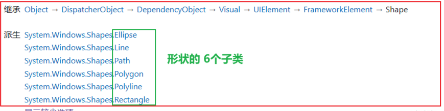

由上可知：可用的形状对象包括 Ellipse、Line、Path、Polygon、Polyline 和 Rectangle 都是派生自Shape，另外Shape 对象共享以下公共的属性：

- Stroke：描述形状边框的绘制方式。
- StrokeThickness：描述形状边框的粗细。
- Fill：描述形状内部的绘制方式。
- Stretch ：定如何拉伸 Shape 对象的内容（要绘制的形状）以填充 Shape 对象的布局空间
- 用于指定坐标和顶点的数据属性，以与设备无关的像素来度量。

由于它们是 UI 元素，因此可在 Panel 元素和大多数控件中使用 Shape 对象。由于 Canvas 面板支持其子对象的绝对位置，因此特别适合创建复杂的图形。另外辅以ViewBox的使用，则可以自动缩放创建的图形！

下面案例则是通过Canvas 和Shape创建的复杂图形：

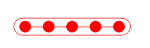

```xaml
    <Canvas Height="30" Width="200"  Margin="0,10,0,0">
        <Border CornerRadius="15" Width="200" Height="30" BorderThickness="1" BorderBrush="Red"></Border>
        <Ellipse Height="20" Width="20" Fill="Red" Canvas.Top="5" Canvas.Left="10"></Ellipse>
        <Ellipse Height="20" Width="20" Fill="Red" Canvas.Top="5" Canvas.Left="50"></Ellipse>
        <Ellipse Height="20" Width="20" Fill="Red" Canvas.Top="5" Canvas.Left="90"></Ellipse>
        <Ellipse Height="20" Width="20" Fill="Red" Canvas.Top="5" Canvas.Left="130"></Ellipse>
        <Ellipse Height="20" Width="20" Fill="Red" Canvas.Top="5" Canvas.Left="170"></Ellipse>
        <Border Height="1" Background="Red" Width="180" Canvas.Top="15" Canvas.Left="10"></Border>
    </Canvas>
```

## Ellipse(椭圆)

### 属性

- Width和Height：指定Ellipse的宽度和高度。可以通过设置这两个属性来调整椭圆的大小。
- Fill：指定Ellipse的填充颜色。可以使用Brush对象设置填充颜色，例如SolidColorBrush。
- Stroke和StrokeThickness：Stroke属性定义了Ellipse的边框颜色，可以使用Brush对象设置边框颜色。StrokeThickness属性定义了边框的宽度。
- StrokeDashArray和StrokeDashOffset：用于创建虚线边框效果。StrokeDashArray属性指定了虚线的样式，而StrokeDashOffset属性定义了虚线的起始偏移量。
- Opacity：指定Ellipse的不透明度，取值范围为0.0到1.0之间。设置为1.0表示完全不透明，而设置为0.0表示完全透明。

### 示例

```xaml
    <StackPanel  Orientation="Horizontal" Background="LightBlue">
        <Ellipse Margin="10" Height="80" Width="80" Stroke="White" StrokeThickness="5">
            <Ellipse.Fill>
                <ImageBrush ImageSource="pack://application:,,,/QQ.jpg" Stretch="Fill"/>
            </Ellipse.Fill>
        </Ellipse>
        <Ellipse Margin="10" Height="80" Width="80" Stroke="White" StrokeThickness="5" Fill="Gray"/>
        <Ellipse Margin="10" Height="80" Width="120" Stroke="Green" StrokeThickness="5" StrokeDashArray="3,2">
            <Ellipse.Fill>
                <LinearGradientBrush StartPoint="0,0" EndPoint="1,1">
                    <GradientStop Color="Yellow" Offset="0"/>
                    <GradientStop Color="Red" Offset="1"/>
                </LinearGradientBrush>
            </Ellipse.Fill>
        </Ellipse>
        <Ellipse Margin="10" Height="80" Width="120" Stroke="White" StrokeThickness="5" Fill="Gray"/>
    </StackPanel>
```

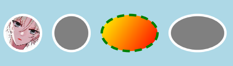

> 关于图片
>
> 图片必须设置为资源：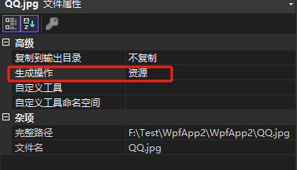
>
> 设置文件路径的方式：
>
> 相对路径或者统一资源标识Uri
>
> 统一资源标识Uri
>
> WPF引入了统一资源标识Uri(Unified Resource Identifier)来标识和访问资源。其中较为常见的情况是用Uri加载图像。Uri表达式的一般形式为：协议+授权+路径，协议：pack://，授权：有两种。
> 一种用于访问编译时已经知道的文件，用application:///
> 一种用于访问编译时不知道、运行时才知道的文件，用siteoforigin:///
> 一般用逗号代替斜杠，也就是改写作application:,和pack:,
> 路径：分为绝对路径和相对路径。一般选用相对路径，普适性更强
>
> 以下是三种设置文件路径的方式：
>
> ```xaml
> 
> 		<!--<ImageBrush ImageSource="pack://application:,,,/QQ.jpg" Stretch="Fill"/>-->
>          <!--<ImageBrush ImageSource="/WpfApp2;component/QQ.jpg" Stretch="Fill"/>-->
>          <ImageBrush ImageSource="QQ.jpg" Stretch="Fill"/>
> ```
>
> 

## Rectangle

### 属性

- Rectangle 的RadiusX 和 RadiusY 属性是设置方形的圆角
- 其他：参照Elipse

### 示例

```xaml
    <StackPanel>
        <Rectangle Width="100" Height="100" Fill="Red" RadiusX="20" RadiusY="20"/>
    </StackPanel>
```

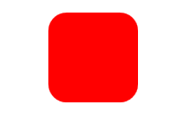

## Line

### 属性

- StrokeDashArray 属性可以设置线条的样式，StrokeDashArray不同的值呈现出的虚线的间隔和虚线节点长度均有不同
- StrokeDashCap 表示虚线中每个节点起端或末尾形状（线帽），可以设置成圆形，尖角或者平头
- StrokeStartLineCap 和StrokeEndLineCap 属性 设置Line起端或末尾形状（线帽），同样可以设置成圆形，尖角或者平头
- 对于Line而言，设置Fill无用，直接通过设置Stroke设置Line的颜色，并且可以通过Stroke设置各种Brush,包括渐变和图像

### 示例

```xaml
    <StackPanel>
        <Line X1="10" Y1="20" X2="180" Y2="20" Stroke="Black" StrokeThickness="5"/>
        <Line X1="10" Y1="20" X2="180" Y2="40" Stroke="Black" StrokeThickness="5" StrokeDashArray="3,2"/>
        <Line X1="10" Y1="20" X2="180" Y2="20" Stroke="Purple" StrokeThickness="5" StrokeStartLineCap="Round" StrokeEndLineCap="Round"/>
        <Line X1="10" Y1="20" X2="180" Y2="20" Stroke="Red" StrokeThickness="5" StrokeDashArray="2" StrokeDashCap="Round"/>
        <Line X1="10" Y1="20" X2="180" Y2="20" StrokeStartLineCap="Round" StrokeEndLineCap="Round"  StrokeThickness="13">
            <Line.Stroke>
                <LinearGradientBrush StartPoint="0,0" EndPoint="0,1">
                    <GradientStop Color="Yellow" Offset="0"/>
                    <GradientStop Color="ForestGreen" Offset="0.5"/>
                    <GradientStop Color="Purple" Offset="1"/>
                </LinearGradientBrush>
            </Line.Stroke>
        </Line>
    </StackPanel>
```

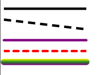

## 

## Polyline&Polygon

Polyline 用来绘制折线，它是一系列连接的线， Polyline 元素不是封闭形状（尽管可以使用线将头尾连接，但仍旧不是封闭形状），如需创建封闭形状，推荐使用 Polygon 元素。

Polygon 元素用于绘制闭合形状，同样和Polyline一样使用其 Points 属性指定形状的顶点；并且Polygon 不用指定最后一个封闭的点，该元素会自动绘制一条连接第一个点和最后一个点的线。

### 属性

- Polyline通过 Points 属性设置线段顶点，然后连点成多段线
- Point中的多个点的设置 ，如Points="0,0 10,20 200,10" 表示三个坐标点(0,0)，(10,20)，(200,10)依次相连
- Point 每个坐标点之间，使用空格 隔开即可
- 设置Fill 即可填充折线连接而成的形状

### 示例

```xaml
    <Grid>
        <Grid.ColumnDefinitions>
            <ColumnDefinition/>
            <ColumnDefinition/>
        </Grid.ColumnDefinitions>
        <StackPanel>
            <Label FontSize="20" Content="PolyLine"/>
            <Polyline Margin="10" Points="0,0 50,50 200,100" Fill="Red" Stroke="Green" StrokeThickness="5"/>
            <Polyline Margin="10" Points="0,0 50,50 200,100 0,0" Fill="Red" Stroke="Green" StrokeThickness="5"/>
            <Polyline Margin="10" Points="0,0 50,50 150,50 200,0 0,0" Fill="Red" Stroke="Green" StrokeThickness="5"/>
            <Polyline Margin="10" Points="0,0 150,0 150,80 0,80 0,0" Fill="LightBlue" Stroke="Yellow" StrokeThickness="5"
                  StrokeDashCap="Round" StrokeDashArray="5"/>
        </StackPanel>
        <StackPanel Grid.Column="1">
            <Label FontSize="20" Content="Polygon"/>
            <Polygon Margin="10" Points="0,0 50,50 200,100" Fill="Purple" Stroke="Blue" StrokeThickness="5"/>
            <Polygon Margin="10" Points="0,0 50,50 200,100" Fill="Purple" Stroke="Blue" StrokeThickness="5"/>
            <Polygon Margin="10" Points="0,0 50,50 150,50 200,0" Fill="Purple" Stroke="Blue" StrokeThickness="5"/>
            <Polygon Margin="10" Points="0,0 150,0 150,80 0,80" Fill="LightBlue" Stroke="Yellow" StrokeThickness="5"
                  StrokeDashCap="Round" StrokeDashArray="5"/>
        </StackPanel>
    </Grid>
```

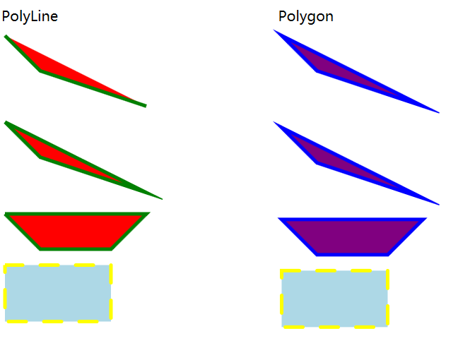

# Geometry（几何图形）

Geometry 是一个通用类，用于呈现 2D 图形、命中测试对象和定义剪切区域

### Geometry和Shape的区别

Geometry 类以及从其派生的类（如 EllipseGeometry、PathGeometry 和 CombinedGeometry）可用于描述 2D 形状的几何图形；Geometry 对象可以是矩形和圆形等简单类型，也可以是由两个或更多个几何对象创建的复合类型。 可使用 PathGeometry 和 StreamGeometry 类创建更复杂的几何图形，这些类可用于描述弧线和曲线。

Geometry 和 Shape 类的相似之处在于它们均描述 2D 形状（例如比较 EllipseGeometry 和 Ellipse），但它们之间存在一些重要区别。
Geometry 类继承自 Freezable 类，而 Shape 类继承自 FrameworkElement。 由于它们是元素，因此 Shape 对象可以自行呈现并参与布局系统，而 Geometry 对象则不能，需要由Path来呈现。
尽管 Shape 对象比 Geometry 对象更易于使用，但 Geometry 对象更通用。 尽管 Shape 对象用于呈现 2D 图形，但 Geometry 对象可用于定义 2D 图形的几何区域、定义剪裁的区域或定义命中测试的区域等。

### Geometry类型

所有几何图形的基类都是抽象类 Geometry。 派生自 Geometry 类的类可大致分为三个类别：简单几何、路径几何和复合几何。

|                   |                  |                                                              |
| ----------------- | ---------------- | ------------------------------------------------------------ |
| LineGeometry      | 简单几何         | 作用类似于Shape中的Line                                      |
| RectangleGeometry | 简单几何         | 作用类似于Shape中的Rectangle                                 |
| EllipseGeometry   | 简单几何         | 作用类似于Shape中的Ellipse                                   |
| GeometryGroup     | 用于创建复合几何 | 为单个路径添加任意多个Geometry对象，使用EvenOdd或NonZero填充规则来确定要填充的区域。 |
| CombinedGeometry  | 用于创建复合几何 | 将两个几何图形合并为一个形状。可使用CombineMode属性选择如何组合两个几何图形。 |
| PathGeometry      | 路径几何         | 代表更复杂的弧线、曲线以及直线构成的图形，并且既可以是闭合的，也可以是不闭合的。 |
| StreamGeometry    | 路径几何         | 相当于PathGeometry的只读轻量级。StreamGeometry图形可节省内存，因为它不在内存中同时保存路径的所有分段。并且这类图形一旦被创建就不能再修改。 |

### 简单几何

> 首先这里面的坐标体系，同Shape中的坐标体系是一样的，设置水平X和竖直Y轴，都类似于设置Margin的左间隔和上间隔的值

- LineGeometry 通过指定直线的起点StartPoint和终点EndPoint来定义。
- EllipseGeometry 由中心点Center、X半径和 Y 半径定义。
- RectangleGeometry 使用 Rect 结构来定义，该结构指定其相对位置以及高度和宽度。 可以通过设置 RadiusX 和 RadiusY 属性来创建圆角矩形。

```xaml
    <Grid>
        <Grid.ColumnDefinitions>
            <ColumnDefinition/>
            <ColumnDefinition/>
            <ColumnDefinition/>
        </Grid.ColumnDefinitions>
        <StackPanel Height="200" Width="200"  Orientation="Horizontal">
            <Line X1="10" Y1="20" X2="40" Y2="180" Stroke="Red" StrokeThickness="10" StrokeEndLineCap="Round"/>
            <Path  Stroke="Green" StrokeThickness="10" StrokeEndLineCap="Round">
                <Path.Data>
                    <LineGeometry StartPoint="10,20" EndPoint="40,180"/>
                </Path.Data>
            </Path>
        </StackPanel>
        <StackPanel Height="100" Width="200" Grid.Column="1" Background="White" Margin="10" Orientation="Horizontal">
            <Ellipse Height="40" Width="40" Stroke="Red" StrokeThickness="4" Fill="Green"></Ellipse>
            <Path Stroke="Green" StrokeThickness="4" Fill="Red">
                <Path.Data>
                    <EllipseGeometry Center="40,50" RadiusX="20" RadiusY="20"></EllipseGeometry>
                </Path.Data>
            </Path>
        </StackPanel>
        <StackPanel Height="100" Width="200" Grid.Column="2" Background="White" Margin="10" Orientation="Horizontal">
            <Rectangle Height="40" Width="40" Stroke="Red" StrokeThickness="4" Fill="Green"></Rectangle>
            <Path Stroke="Green" StrokeThickness="4" Fill="Red">
                <Path.Data>
                    <RectangleGeometry Rect="40,30,40,40" />
                </Path.Data>
            </Path>
        </StackPanel>
    </Grid>
```

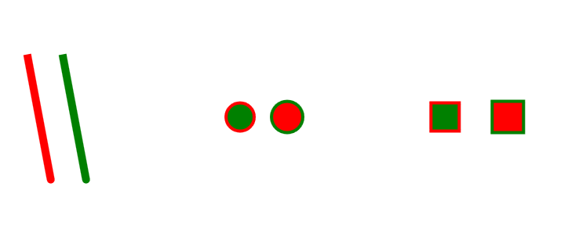

> 补充：可以通过设置 RadiusX 和 RadiusY 属性来调整EllipseGeometry 矩形的圆角大小，设置为大于零的值。 值越大，EllipseGeometry 矩形的角越圆。

### PathGeometry路径几何

PathGeometry 类及其轻型等效项（StreamGeometry 类）提供了描述由弧线、曲线和直线组成的多个复杂图形的方法。

#### PathGeometry中的层级关系

PathGeometry 的核心是 PathFigure 对象的集合，之所以如此命名，是因为每个图形都描述 PathGeometry 中的一个离散形状。 每个 PathFigure 本身都由一个或多个 PathSegment 对象组成，其中每一个都描述了图形的一个线段。
```xaml
        <Path Stroke="Green" StrokeThickness="20" StrokeStartLineCap="Round" StrokeEndLineCap="Round">
            <Path.Data>
                <PathGeometry>
                    <PathGeometry.Figures>
                        <PathFigure StartPoint="20,20">
                            <PathFigure.Segments>
                                <LineSegment Point="20,130"/>
                                <LineSegment Point="200,130"/>
                                <LineSegment Point="200,260"/>
                            </PathFigure.Segments>
                        </PathFigure>
                    </PathGeometry.Figures>
                </PathGeometry>
            </Path.Data>
        </Path>
```

- PathGeometry 对象由一个或多个 PathFigure 对象组成；
- 每个 PathFigure 本身由一个或多个 PathSegment 对象组成

#### PathFigure 和 PathSegment

- PathFigure 代表不同的“图形”或形状，PathSegment 代表图形或形状中的组成部件线段。
- PathFigure 内的多个线段组合成单个几何形状，每个线段的终点是下一个线段的起点。
- PathFigure 的 StartPoint 属性指定绘制第一个线段的起点。 每个后续段都从上一段的终点开始。

| PathFigure 中属性 | 说明                                                         |
| ----------------- | ------------------------------------------------------------ |
| StartPoint        | 指示从何处开始绘制图形的Point对象                            |
| Segments          | 用于绘制图形的PathSegment对象的集合                          |
| IsClosed          | 指定是否连接PathFigure 的起点和终点，如果为True，不连接，反之，则连接起点和终点。默认False |
| IsFilled          | 是否该PathFigure可用于进行命中测试，呈现和剪辑。 如果为True,就使用Path.Fill画刷填充图形内部的区域。 |

| PathSegment 线段类型       | 说明                                 |
| -------------------------- | ------------------------------------ |
| LineSegment                | 创建两个点之间的直线。               |
| ArcSegment                 | 两点之间创建一条椭圆弧。             |
| QuadraticBezierSegment     | 创建二次贝塞尔曲线。                 |
| BezierSegment              | 在两点之间创建一个三次方贝塞尔曲线。 |
| PolyLineSegment            | 创建一系列直线。                     |
| PolyQuadraticBezierSegment | 创建一系列二次贝塞尔曲线。           |
| PolyBezierSegment          | 创建一系列三次方贝塞尔曲线。         |

- **LineSegment** 

  PathFigure 的 StartPoint 属性指定绘制第一个线段的起点，LineSegment 中的Point属性，就是设置线段的终点坐标；第一个LineSegment 的终点，将作为下一个LineSegment 的起点，依次类推。

- **PolyLineSegment**

  PathFigure 的 StartPoint 属性指定绘制第一个线段的起点，PolyLineSegment中的Points属性是一个Point的集合，例如如`Points="100,100 250,50 50,50"` 则表示 三个坐标点(100,100)、 (250,50)、 (50,50) ，坐标内用逗号分开，每一对坐标之间用空格分开。

  ```xaml
      <Grid>
          <Grid.ColumnDefinitions>
              <ColumnDefinition/>
              <ColumnDefinition/>
          </Grid.ColumnDefinitions>
          <Grid.RowDefinitions>
              <RowDefinition/>
              <RowDefinition/>
          </Grid.RowDefinitions>
          <Path Stroke="Green" StrokeThickness="10">
              <Path.Data>
                  <PathGeometry>
                      <PathFigure StartPoint="20,20">
                          <PathFigure.Segments>
                              <LineSegment Point="20,100"/>
                              <LineSegment Point="200,100"/>
                              <LineSegment Point="20,20"/>
                          </PathFigure.Segments>
                      </PathFigure>
                  </PathGeometry>
              </Path.Data>
          </Path>
          <Path Stroke="Red" StrokeThickness="10" Grid.Row="1">
              <Path.Data>
                  <PathGeometry>
                      <PathFigure StartPoint="20,20">
                          <PathFigure.Segments>
                              <PolyLineSegment Points="20,100,200,100,20,20"/>
                          </PathFigure.Segments>
                      </PathFigure>
                  </PathGeometry>
              </Path.Data>
          </Path>
          <TextBlock Grid.Column="1" VerticalAlignment="Center" FontSize="24" Foreground="Red" Text="LineSegment"/>
          <TextBlock Grid.Row="1" Grid.Column="1" VerticalAlignment="Center" FontSize="24" Foreground="Red" Text="PolyLineSegment"/>
      </Grid>
  ```

  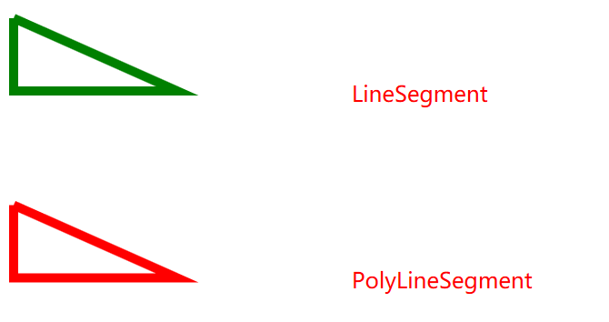

- **ArcSegment** 

  ArcSegment在两点之间创建一条椭圆弧。

  - Size 获取或设置椭圆弧的 X轴半径和Y轴半径
  - RotationAngle 获取或设置椭圆围绕x轴旋转的角度，默认值为0
  - IsLargeArc 获取或设置一个值，该值指示椭圆弧是否应大于180度；当设置为true的时候，绘制的椭圆弧大于180，反之，小于180度
  - SweepDirection 获取或设置一个值，制定该值是以Clockwise顺时针方向绘制椭圆弧，还是以Counterclockwise 逆时针方向绘制椭圆弧
  - Point 获取或设置椭圆弧的终点

  ```xaml
      <Grid>
          <Grid.RowDefinitions>
              <RowDefinition/>
              <RowDefinition/>
              <RowDefinition/>
          </Grid.RowDefinitions>
          <Grid.ColumnDefinitions>
              <ColumnDefinition/>
              <ColumnDefinition/>
              <ColumnDefinition/>
          </Grid.ColumnDefinitions>
          <Path Stroke="Green" StrokeThickness="5">
              <Path.Data>
                  <PathGeometry>
                      <PathFigure StartPoint="40,20">
                          <PathFigure.Segments>
                              <ArcSegment Point="150,20" Size="30,60" IsLargeArc="True" RotationAngle="0"  SweepDirection="Counterclockwise"/>
                          </PathFigure.Segments>
                      </PathFigure>
                  </PathGeometry>
              </Path.Data>
          </Path>
          <Path Stroke="Green" StrokeThickness="5" Grid.Column="1">
              <Path.Data>
                  <PathGeometry>
                      <PathFigure StartPoint="40,20">
                          <PathFigure.Segments>
                              <ArcSegment Point="150,20" Size="30,60" IsLargeArc="True" RotationAngle="30"  SweepDirection="Counterclockwise"/>
                          </PathFigure.Segments>
                      </PathFigure>
                  </PathGeometry>
              </Path.Data>
          </Path>
          <Path Stroke="Green" StrokeThickness="5" Grid.Column="2">
              <Path.Data>
                  <PathGeometry>
                      <PathFigure StartPoint="40,20">
                          <PathFigure.Segments>
                              <ArcSegment Point="150,20" Size="30,60" IsLargeArc="True" RotationAngle="60"  SweepDirection="Counterclockwise"/>
                          </PathFigure.Segments>
                      </PathFigure>
                  </PathGeometry>
              </Path.Data>
          </Path>
          <Path Stroke="Green" StrokeThickness="5" Grid.Row="1">
              <Path.Data>
                  <PathGeometry>
                      <PathFigure StartPoint="40,20">
                          <PathFigure.Segments>
                              <ArcSegment Point="100,10" Size="50,60" IsLargeArc="True" RotationAngle="0"  SweepDirection="Counterclockwise"/>
                          </PathFigure.Segments>
                      </PathFigure>
                  </PathGeometry>
              </Path.Data>
          </Path>
          <Path Stroke="Green" StrokeThickness="5" Grid.Row="1" Grid.Column="1">
              <Path.Data>
                  <PathGeometry>
                      <PathFigure StartPoint="40,20">
                          <PathFigure.Segments>
                              <ArcSegment Point="100,10" Size="50,60" IsLargeArc="False" RotationAngle="0"  SweepDirection="Counterclockwise"/>
                          </PathFigure.Segments>
                      </PathFigure>
                  </PathGeometry>
              </Path.Data>
          </Path>
          <Path Stroke="Green" StrokeThickness="5" Grid.Row="2">
              <Path.Data>
                  <PathGeometry>
                      <PathFigure StartPoint="40,20">
                          <PathFigure.Segments>
                              <ArcSegment Point="100,10" Size="50,60" IsLargeArc="True" RotationAngle="0"  SweepDirection="Counterclockwise"/>
                          </PathFigure.Segments>
                      </PathFigure>
                  </PathGeometry>
              </Path.Data>
          </Path>
          <Path Stroke="Green" StrokeThickness="5" Grid.Row="2" Grid.Column="1">
              <Path.Data>
                  <PathGeometry>
                      <PathFigure StartPoint="40,120">
                          <PathFigure.Segments>
                              <ArcSegment Point="100,110" Size="50,60" IsLargeArc="True" RotationAngle="0"  SweepDirection="Clockwise"/>
                          </PathFigure.Segments>
                      </PathFigure>
                  </PathGeometry>
              </Path.Data>
          </Path>
      </Grid>
  ```

  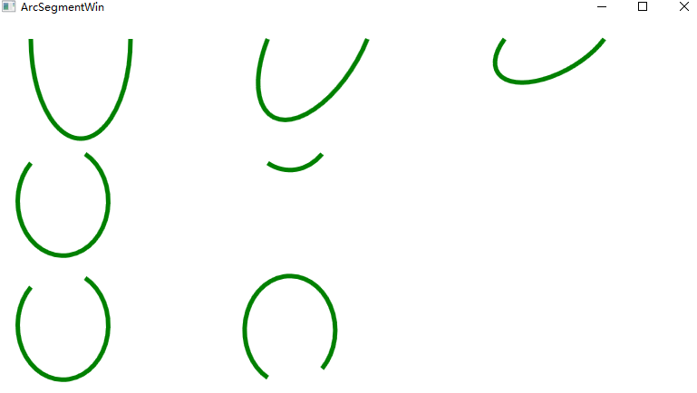

- **QuadraticBezierSegment **

  关于[贝塞尔曲线](https://so.csdn.net/so/search?q=贝塞尔曲线&spm=1001.2101.3001.7020)的数学原理可查看[贝塞尔曲线原理](https://blog.csdn.net/sinat_35676815/article/details/120884682)，本文将从该文截取部分内容，辅助介绍该知识点。
  二次贝塞尔曲线的原理图如下所示：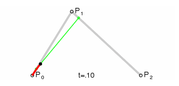

  PathFigure的StartPoint属性确定了曲线的起点，QuadraticBezierSegment 的Point1属性则是确定了贝塞尔曲线的控制点坐标，Point2属性确定了贝塞尔曲线的终点坐标，由此便可以绘制一条贝塞尔曲线。

- **PolyQuadraticBezierSegment**

  PolyQuadraticBezierSegment 就是创建一系列二次贝塞尔曲线，可以通过Points属性设置一系列的Point来完成。例如：`PolyQuadraticBezierSegment Points="200,200 300,100 400,200 600,50" ` 则表示有两个二次贝塞尔曲线，第一个曲线的Point1为(200,200),Point2为(300,100) ;第二个曲线的Point1为(400,200),Point2为(600,50) ;

- **BezierSegment** 

  BezierSegment用于在两点之间创建一个三次方贝塞尔曲线。首先我们看下三次放贝塞尔曲线的原理图：

  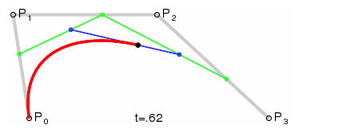

  上图中P0为起点，P1，P2为控制点，P3为终点，三点绘制一个三次贝塞尔曲线。

  PathFigure的StartPoint属性确定了曲线的起点，BezierSegment的Point1，Point2属性则是确定了三次贝塞尔曲线的两个控制点坐标，Point3属性确定了三次贝塞尔曲线的终点坐标，由此便可以绘制一条三次贝塞尔曲线。

- **PolyBezierSegment** 

  ```xaml
      <Grid>
          <Grid.RowDefinitions>
              <RowDefinition/>
              <RowDefinition/>
          </Grid.RowDefinitions>
          <StackPanel>
              <Path Stroke="Green" StrokeThickness="5">
                  <Path.Data>
                      <PathGeometry>
                          <PathFigure StartPoint="50,50">
                              <PathFigure.Segments>
                                  <BezierSegment Point1="100,200" Point2="200,0" Point3="400,150"/>
                              </PathFigure.Segments>
                          </PathFigure>
                      </PathGeometry>
                  </Path.Data>
              </Path>
          </StackPanel>
          <StackPanel Grid.Row="1">
              <Path Stroke="Red" StrokeThickness="5">
                  <Path.Data>
                      <PathGeometry>
                          <PathFigure StartPoint="50,50">
                              <PathFigure.Segments>
                                  <PolyBezierSegment Points="0,0,200,0,300,100,300,0,400,0,600,100"/>
                              </PathFigure.Segments>
                          </PathFigure>
                      </PathGeometry>
                  </Path.Data>
              </Path>
          </StackPanel>
      </Grid>
  ```

  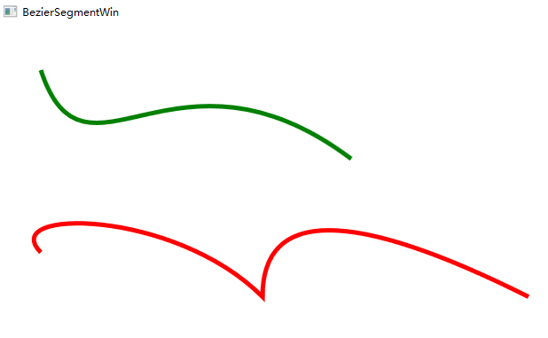


