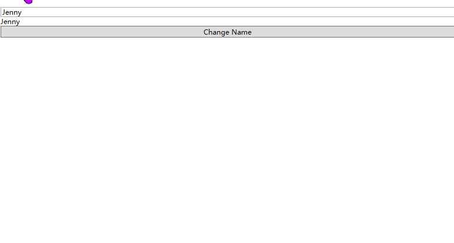

> 原文链接：[WPF布局介绍(1) - 痕迹g - 博客园 (cnblogs.com)](https://www.cnblogs.com/zh7791/p/11369020.html)
>
> 原文链接：[WPF 入门笔记 - 03 - 样式基础及模板 - LeonLiu^ - 博客园 (cnblogs.com)](https://www.cnblogs.com/kanoakliu/p/17478282.html)

## XAML语言

### XAML的根元素

通常XAML的根元素有两个：**一个是Window,说明这是一个桌面应用程序；另一个是Page，主要用在互联网应用程序，也就是网页**。

> 区别只是根元素不同

1）XAML桌面应用程序

```XAML
<Window x:Class="WpfApp1.WinTest"
        xmlns="http://schemas.microsoft.com/winfx/2006/xaml/presentation"
        xmlns:x="http://schemas.microsoft.com/winfx/2006/xaml"
        xmlns:d="http://schemas.microsoft.com/expression/blend/2008"
        xmlns:mc="http://schemas.openxmlformats.org/markup-compatibility/2006"
        xmlns:local="clr-namespace:WpfApp1"
        mc:Ignorable="d"
        Title="WinTest" Height="450" Width="800">
    <Grid>
        
    </Grid>
</Window>
```

2）XAML网页应用程序

```xaml
<Page x:Class="WpfApp1.PageTest"
      xmlns="http://schemas.microsoft.com/winfx/2006/xaml/presentation"
      xmlns:x="http://schemas.microsoft.com/winfx/2006/xaml"
      xmlns:mc="http://schemas.openxmlformats.org/markup-compatibility/2006" 
      xmlns:d="http://schemas.microsoft.com/expression/blend/2008" 
      xmlns:local="clr-namespace:WpfApp1"
      mc:Ignorable="d" 
      d:DesignHeight="450" d:DesignWidth="800"
      Title="PageTest">

    <Grid>
        
    </Grid>
</Page>
```

### XMAL命名空间

1）引用程序集时需要使用命名空间引入，通过 "**xmlns:\****" 格式来引入命名空间。

2）合并命名空间：

在项目的 AssemblyInfo.cs 文件中使用 XmlnsDefinition 属性

```xaml
[assembly: XmlnsDefinition("http://NewNameSpace.com/WPFExample"(新命名空间地址), "OldNameSpace.OldExample1"(需要合并的命名空间))]
[assembly: XmlnsDefinition("http://NewNameSpace.com/WPFExample"(新命名空间地址), "OldNameSpace.OldExample2"(需要合并的命名空间))]
```

上面的代码会将 OldNameSpace.OldExample1 和 OldNameSpace.OldExample2 合并在新的命名空间 [http://NewNameSpace.com/WPFExample]中，通过引用新命名空间就能使用合并的两个命名空间的控件

### XAML标记扩展

WPF标记扩展：StaticResource、 DynamicResource、 Binding、 RelativeSource 、 TemplateBinding

XAML标记扩展：x:Type、x:Static、x:nul、 x:Array


#### 数据绑定

Binding：将自身某项属性与指定对象属性值绑定（包括自己）,理论上来说，可以绑定任何数据。

绑定其它对象：

```xaml
    <StackPanel>
        <ScrollBar x:Name="scroll" Orientation="Horizontal"  Maximum="100" LargeChange="10" SmallChange="1"/>
        <!--绑定对象为 x:Name="scroll"，绑定该对象的 Value 值-->
        <TextBlock x:Name="textblo" Margin="20"  Height="20" Background="LightCyan"
                   Text="{Binding ElementName=scroll,Path=Value}"/> 
    </StackPanel>
```

绑定自己：

```xaml
    <StackPanel>
        <!--通过控件名绑定自己的数据-->
        <TextBlock x:Name="textblo" Margin="20" Height="20" Background="LightCyan"
                   Text="{Binding ElementName=textblo,Path=Height}"/>
    </StackPanel>
```


#### 相对数据源绑定

RelativeSource：将自身某项属性绑定在与自身有关系的对象上（绑定跟自己有关联的对象的数据）

```xaml
    <StackPanel Orientation="Horizontal" HorizontalAlignment="Center">
        <TextBlock FontSize="20" Background="Yellow" Text="{Binding RelativeSource={RelativeSource self},Path=FontSize}"></TextBlock>
        <TextBlock FontSize="20" Background="Red" Text="{Binding RelativeSource={RelativeSource AncestorType={x:Type StackPanel}},Path=Orientation}"></TextBlock>        
    </StackPanel>
```


#### 模板绑定

TemplateBinding：直接引用模版对象预设的属性值

```xaml
    <Window.Resources>
        <!--设置数据来源-->
        <!--设置样式为 Button 和索引 key-->
        <ControlTemplate TargetType="Button" x:Key="buttonTemp">
            <!--设置模版的各项属性值-->
            <Border Background="Yellow" Height="50" Width="50">
                <ContentControl Content="Text" Foreground="Red"/>
            </Border>            
        </ControlTemplate>
    </Window.Resources>

    <StackPanel Orientation="Horizontal" HorizontalAlignment="Center">
        <!--通过 Template 绑定模版-->
        <Button Template="{StaticResource buttonTemp}"/>
    </StackPanel>
```


#### 对象类型扩展

x:Type 扩展在 XAML 中取对象的类型,相当于C中的typeof操作,这种操作发生在编译时刻

```xaml
<Window.Resources> 
        <ControlTemplate TargetType="{x:Type Button}" x:Key="buttonTemp"> 
<Window.Resources>
```

它等价于C语句：

```csharp
ControlTemplate tmplt = new ControlTemplate();
tmplt.TargetType=typeof(Button);
```

#### 静态属性扩展

x:Static：用来把某个对象中的属性或域的值赋给目标对象的相关属性。这个扩展总是而且只有一个参数,这个参数就是源对象的属性

```xaml
    <Grid>
        <TextBlock x:Name="text2"  Height="50" Width="50"
                   Background="{DynamicResource {x:Static SystemColors.ActiveBorderBrushKey}}"/>
    </Grid>
```


#### 空属性扩展

x:null：作用就是把目标属性设置为null

例如：

```html
    <Button Background="{x:Null}"/> //将按钮的背景设置为null
```

> 如果把相关属性设置为 null 会打断相关属性的继承链

#### 静态数组扩展

x:Array： 扩展就是在 XAML 里创建一个数组。使用 Array 扩展创建数组不需要使用大括号"{}"。

```xaml
    <Window.Resources>
        <x:Array x:Key="numArray" Type="{x:Type sys:String}">
            <sys:String>你</sys:String>
            <sys:String>我</sys:String>
            <sys:String>他</sys:String>
        </x:Array>
    </Window.Resources>
    <StackPanel>
        <ListBox ItemsSource="{StaticResource numArray}"/>
    </StackPanel>
```


## 常用布局


- WPF布局原则
  - 一个窗口中只能包含一个元素
  - 不应显式设置元素尺寸
  - 不应使用坐标设置元素的位置
  - 可以嵌套布局容器
- WPF布局容器
  - *StackPanel*: 水平或垂直排列元素、Orientation属性分别: Horizontal / Vertical
  - *WrapPanel* : 水平或垂直排列元素、针对剩余空间不足会进行换行或换列进行排列
  - *DockPanel* : 根据容器的边界、元素进行Dock.Top、Left、Right、Bottom设置
  - *Grid* : 类似table表格、可灵活设置行列并放置控件元素、比较常用
  - *UniformGrid* : 指定行和列的数量, 均分有限的容器空间
  - *Canvas* : 使用固定的坐标设置元素的位置、不具备锚定停靠等功能。

### StackPanel

StackPanel主要用于垂直或水平排列元素、在容器的可用尺寸内放置有限个元素，元素的尺寸总和(长/高)不允许超过StackPanel的尺寸, 否则超出的部分不可见。

| 常用属性        | 描述                              |
| --------------- | --------------------------------- |
| Orientation     | 定义UI排列方向（默认 Horizontal） |
| LayoutTransform | 定义UI缩放旋转                    |
| SizeToContent   | 根据内容调整大小                  |

```xaml
		<!--横向排列-->
        <StackPanel Orientation="Horizontal" Grid.Row="0">
            <Button Content="横向排列1" Width="150"  Height="40"/>
            <Button Content="横向排列2" Width="150"  Height="40"/>
            <Button Content="横向排列3" Width="150"  Height="40"/>
        </StackPanel>
        
        <!--纵向排列-->
        <StackPanel Orientation="Vertical" Grid.Column="1">
            <Button Content="纵向排列1" Width="150"  Height="100"/>
            <Button Content="纵向排列2" Width="150"  Height="100"/>
            <Button Content="纵向排列3" Width="150"  Height="100"/>
        </StackPanel>
```

显示结果：


### WrapPanel

WrapPanel默认排列方向与StackPanel相反、WrapPanel的Orientation默认为Horizontal。
WrapPanel具备StackPanel的功能基础上具备在尺寸变更后自动适应容器的宽高进行换行换列处理。

| 常用属性    | 描述                            |
| ----------- | ------------------------------- |
| Orientation | 定义排列方向（默认 Horizontal） |
| ItemWidth   | 定义所有子元素宽度              |
| ItemHeight  | 定义所有子元素高度              |

```xaml
		<WrapPanel Orientation="Horizontal" Grid.Row="0">
            <Button Content="横向排列1" Width="150"  Height="40"/>
            <Button Content="横向排列2" Width="150"  Height="40"/>
            <Button Content="横向排列3" Width="150"  Height="40"/>
        </WrapPanel>
        <WrapPanel Orientation="Vertical" Grid.Column="1">
            <Button Content="纵向排列1" Width="150"  Height="100"/>
            <Button Content="纵向排列2" Width="150"  Height="100"/>
            <Button Content="纵向排列3" Width="150"  Height="100"/>
        </WrapPanel>
```

显示结果：


### DockPanel

默认DockPanel中的元素具备DockPanel.Dock属性, 该属性为枚举具备: Top、Left、Right、Bottom。
默认情况下, DockPanel中的元素不添加DockPanel.Dock属性, 则系统则会默认添加 Left。

| 常用属性      | 描述                                                         |
| ------------- | ------------------------------------------------------------ |
| Dock          | 定义 UI 的停靠位置                                           |
| LastChildFill | 该属性默认为true, 该属性作用为, 当容器中的最后一个元素时, 默认该元素填充DockPanel所有空间。 |

```xaml
        <DockPanel LastChildFill="False">
            <Button Content="上" DockPanel.Dock="Top"  Width="100"  Height="40"/>
            <Button Content="下" DockPanel.Dock="Bottom"  Width="100"  Height="40"/>
            <Button Content="左" DockPanel.Dock="Left"  Width="100"  Height="40"/>
            <Button Content="右" DockPanel.Dock="Right"   Width="100"  Height="40"/>
        </DockPanel>
```

显示结果：


### Grid

| 属性                     | 描述                                                         |
| ------------------------ | ------------------------------------------------------------ |
| <Grid.RowDefinitions>    | 用来定义行，其中包含的多个 <RowDefinition> 元素来定义每行的高度。 |
| <Grid.ColumnDefinitions> | 用来定义列，其中包含多个 <ColumnDefinition> 元素来定义每列的宽度。 |
| Grid.Row                 | 指定控件所在行                                               |
| Grid.Column              | 指定控件所在列                                               |
| Grid.RowSpan             | 属性用于指定一个元素跨越的行数，可以设置为大于 1 的整数值    |
| Grid.ColumnSpan          | 属性用于指定一个元素跨越的列数，同样可以设置为大于 1 的整数值 |
| ShowGridLines            | 显示网格线                                                   |

宽高的几种方式：

- 固定大小（Fixed Size）： 可以使用具体数值（如像素、设备无关单位等）来指定行高度和列宽度，例如 RowDefinition.Height="100" 和 ColumnDefinition.Width="200"。这样可以使行和列具有固定的大小。
- 自动调整（Auto Sizing）： 可以使用 Auto 关键字来指定行高度和列宽度，例如 RowDefinition.Height="Auto" 和 ColumnDefinition.Width="Auto"。这样会根据行或列的内容自动调整大小，以适应内容的需求。
- 剩余空间填充（Star Sizing）： 可以使用 * 关键字来指定行高度和列宽度，例如 RowDefinition.Height="*" 和 ColumnDefinition.Width="*"。这样会使行或列占据剩余可用空间的比例。如果多个行或列都设置为 *，它们将平均分配剩余空间。

```xaml
    <Grid>
        <Grid.RowDefinitions>
            <RowDefinition />
            <RowDefinition Height="2*"/>
            <RowDefinition Height="50"/>
        </Grid.RowDefinitions>
        <Grid.ColumnDefinitions>
            <ColumnDefinition/>
            <ColumnDefinition/>
        </Grid.ColumnDefinitions>
        <Border Margin="3" Background="red"/>
        <Border Margin="3" Grid.Column="1" Background="Yellow"/>
        <Border Margin="3" Grid.Row="1" Background="Green"/>
        <Border Margin="3" Grid.Row="1" Grid.Column="1" Background="Blue"/>
        <!--该元素设置了水平位置居中HorizontalAlignment，垂直位置居中VerticalAlignment，跨了2列-->
        <TextBlock Text="Microsoft" FontSize="30" Grid.Row="2" Grid.ColumnSpan="2" HorizontalAlignment="Center" VerticalAlignment="Center"/>
    </Grid>
```

显示结果：


### GridSplitter

GridSplitter 用于在 Grid 布局中创建可调整大小的分割效果。它允许用户通过拖动分隔条来改变相邻行或列的大小。

GridSplitter 的 ResizeBehavior 属性设置为 PreviousAndNext，表示它将影响前一个列和后一个列的大小。

用户可以在运行时通过拖动 GridSplitter 控件来调整左侧和右侧列的宽度。

GridSplitter 还有其他属性可用于定制其外观和行为，例如 Background、ResizeDirection、ResizeCursor 等。您可以根据需要设置这些属性来满足特定的布局要求。

请注意，GridSplitter 只能用于 Grid 布局，并且需要适当的行和列定义才能正常工作。确保在使用 GridSplitter 时，考虑布局的其他方面，如最小宽度、最大宽度等，以提供更好的用户体验。

### UniformGrid

Grid 简化版，强制所有单元格具有相同尺寸。每个单元格的大小相同，不用在定义行列集合。均布网格每个单元格只能容纳一个元素，将自动按照定义在其内部的元素个数，自动创建行列，并通常保持相同的行列数。UniformGrid中没有Row和Column附加属性，也没有空白单元格。

> 与Grid布局控件相比，UniformGrid布局控件很少使用。Grid面板是用于创建简单乃至复杂窗口布局的通用工具。UniformGrid面板是一个一种更特殊的布局容器，主要用于在一个刻板的网格中快速地布局元素。

```xaml
    <UniformGrid>
        <TextBox Margin="5" Text="1"/>
        <TextBox Margin="5" Text="2"/>
        <TextBox Margin="5" Text="3"/>
        <TextBox Margin="5" Text="4"/>
        <TextBox Margin="5" Text="5"/>
        <TextBox Margin="5" Text="6"/>
        <TextBox Margin="5" Text="7"/>
        <TextBox Margin="5" Text="8"/>
        <TextBox Margin="5" Text="9"/>
    </UniformGrid>
```

显示结果：


### Canvas

可对其内部元素设定边界值，其作用类似于（Margin），默认为停靠左上角。

```xaml
    <Canvas>
        <TextBox Text="左上角" Background="red" Width="100" Height="100" Canvas.Top="20" Canvas.Left="20"/>
        <TextBox Text="右上角" Background="LightBlue"  Width="100" Height="100" Canvas.Top="20" Canvas.Right="20"/>
        <TextBox Text="左下角" Background="LightGreen" Width="100" Height="100" Canvas.Bottom="20" Canvas.Left="20"/>
        <TextBox Text="右下角" Background="LightPink" Width="100" Height="100" Canvas.Bottom="20" Canvas.Right="20"/>
    </Canvas>
```

显示结果：


### ViewBox

> 一个Viewbox中只能放一个控件。如果多添加了一个控件就会报错。

Viewbox 是一个容器控件，允许其内容根据可用空间进行缩放，同时保持其纵横比。它通常用于为其中的内容提供自动缩放和调整大小的行为。

ViewBox这个控件通常和其他控件结合起来使用，是WPF中非常有用的控件，用来定义一个内容容器。ViewBox组件的作用是拉伸或延展位于其中的组件，以填满可用空间，使之有更好的布局及视觉效果。
下是一些常用的 Viewbox 属性：

| 属性                                                         | 描述                                                         |
| ------------------------------------------------------------ | ------------------------------------------------------------ |
| Stretch（拉伸）                                              | 指定内容在视图框中的拉伸方式。常见的取值包括：<br/>Uniform（均匀）：保持内容的纵横比，同时填充视图框，可能导致内容被裁剪。<br/>UniformToFill（均匀填充）：保持内容的纵横比，同时填充视图框，可能导致内容被裁剪。<br/>Fill（填充）：不保持内容的纵横比，将内容拉伸以填充视图框。 |
| StretchDirection（拉伸方向）                                 | 指定内容在视图框中拉伸的方向。常见的取值包括：<br/>Both（双向）：内容可以在水平和垂直方向上拉伸。<br/>DownOnly（仅向下）：内容只能在垂直方向上拉伸。<br/>UpOnly（仅向上）：内容只能在水平方向上拉伸。 |
| HorizontalAlignment（水平对齐）<br/>VerticalAlignment（垂直对齐） | 指定内容在视图框中的水平和垂直对齐方式。常见的取值包括：<br/>Left（左对齐）：内容在视图框的左侧对齐。<br/>Center（居中对齐）：内容在视图框的中间对齐。<br/>Right（右对齐）：内容在视图框的右侧对齐。<br/>Top（顶部对齐）：内容在视图框的顶部对齐。<br/>Bottom（底部对齐）：内容在视图框的底部对齐。 |
| MaxWidth（最大宽度）<br/>MaxHeight（最大高度）               | 指定内容在视图框中的最大宽度和最大高度限制。当内容超过指定的最大尺寸时，将被自动缩放以适应。 |

```xaml
    <Viewbox Stretch="Uniform">
        <Button Content="Hello，Welcome to Beijing！"/>
    </Viewbox>
```


### Border

Border不是布局面板，但是经常与布局类的面板一起配合使用，用于为其内部的内容提供边框和可选的背景样式。它可以包含单个子元素，并且可以根据需要调整其大小以适应子元素。

以下是 Border 控件的一些常用属性：

| 属性                        | 描述                                                         |
| --------------------------- | ------------------------------------------------------------ |
| Background（背景）          | 指定 Border 的背景颜色或背景画刷。可以使用颜色名称、十六进制值或画刷对象来设置背景。 |
| BorderBrush（边框画刷）     | 指定 Border 的边框颜色或边框画刷。可以使用颜色名称、十六进制值或画刷对象来设置边框。 |
| BorderThickness（边框厚度） | 指定 Border 的边框厚度。可以设置为单个值，表示统一的边框宽度，或设置为 Left、Top、Right、Bottom 分别指定不同的边框宽度。 |
| CornerRadius（圆角半径）    | 指定 Border 的圆角半径，以使边框的角变得圆润。可以设置为单个值，表示统一的圆角半径，或设置为 TopLeft、TopRight、BottomRight、BottomLeft 分别指定不同的圆角半径。 |
| Padding（内边距）           | 指定 Border 内容与边框之间的空间，也就是内边距。可以设置为单个值，表示统一的内边距，或设置为 Left、Top、Right、Bottom 分别指定不同的内边距。 |
| Child（子元素）             | 指定 Border 的单个子元素。这个子元素将被包含在边框内部，并且可以根据需要调整边框的大小。 |

通过使用 Border 控件，您可以为内部内容提供边框和背景样式，并控制边框的大小、边框颜色以及内部内容的对齐和间距。这使得 Border 成为一种常用的容器控件，用于组织和美化界面元素。

```xaml
    <!--Border-->
    <Border Height="300" Width="300"
            Background="LightGray"
            BorderBrush="LightGreen"
            BorderThickness="5"
            HorizontalAlignment="Center"
            VerticalAlignment="Center"
            CornerRadius="10">
        <Canvas Background="LightYellow">
            <Rectangle Canvas.Left="100"
                       Canvas.Top="100"
                        Height="50" Width="50"
                       Fill="LightBlue"
                       Stroke="Red"
                       StrokeThickness="5">                
            </Rectangle>
        </Canvas>
    </Border>   
```


### ScrollerViewer

> 只能放单个子元素

ScrollViewer是 WPF 中常用的滚动容器控件，用于在需要时提供滚动功能以显示超出容器可见区域的内容。**它可以包含单个子元素，并根据需要在垂直和/或水平方向上显示滚动条。**

以下是 ScrollViewer 控件的一些常用属性：

| 属性                                              | 描述                                                         |
| ------------------------------------------------- | ------------------------------------------------------------ |
| HorizontalScrollBarVisibility（水平滚动条可见性） | 指定水平滚动条的可见性。常见的取值包括：<br/>Disabled（禁用）： 禁用水平滚动条<br/>Auto（自动）： 根据需要自动显示水平滚动条 <br/>Visible（可见）： 始终显示水平滚动条 |
| VerticalScrollBarVisibility（垂直滚动条可见性）： | 指定垂直滚动条的可见性。常见的取值包括：<br/>Disabled（禁用）： 禁用水平滚动条<br/>Auto（自动）： 根据需要自动显示水平滚动条 <br/>Visible（可见）： 始终显示水平滚动条 |
| CanContentScroll（内容滚动）                      | 指定 `ScrollViewer` 是否以逻辑单元（例如行或项）为单位滚动内容。当设置为 `True` 时，滚动条将以逻辑单元为单位滚动，而不是以像素为单位滚动。 |
| Content（内容）                                   | 指定 ScrollViewer`的单个子元素。这个子元素将被包含在滚动容器中，并可以根据需要进行滚动。 |

```xaml
    <!--ScrollViewer-->
    <Window.Resources>
        <Style x:Key="TextBlock1" TargetType="TextBlock">
            <Setter Property="Height" Value="30"/>
            <Setter Property="FontSize" Value="22"/>
            <Setter Property="FontWeight" Value="Bold"/>
            <Setter Property="Background" Value="LightBlue"/>
        </Style>
        <Style x:Key="TextBlock2" TargetType="TextBlock">
            <Setter Property="Height" Value="30"/>
            <Setter Property="FontSize" Value="22"/>
            <Setter Property="FontWeight" Value="Bold"/>
            <Setter Property="Background" Value="LightGreen"/>
        </Style>
    </Window.Resources>
    <Grid>
        <Grid.RowDefinitions>
            <RowDefinition/>
            <RowDefinition/>
            <RowDefinition/>
        </Grid.RowDefinitions>
        <Grid.ColumnDefinitions>
            <ColumnDefinition/>
            <ColumnDefinition/>
            <ColumnDefinition/>
        </Grid.ColumnDefinitions>
        <ScrollViewer HorizontalScrollBarVisibility="Auto" 
                      VerticalScrollBarVisibility="Auto"
                      CanContentScroll="True">
            <StackPanel>
                <TextBlock Text="WPF的ScrollViewer控件测试01" Style="{StaticResource TextBlock1}"/>
                <TextBlock Text="WPF的ScrollViewer控件测试02" Style="{StaticResource TextBlock2}"/>
                <TextBlock Text="WPF的ScrollViewer控件测试03" Style="{StaticResource TextBlock1}"/>
                <TextBlock Text="WPF的ScrollViewer控件测试04" Style="{StaticResource TextBlock2}"/>
                <TextBlock Text="WPF的ScrollViewer控件测试05" Style="{StaticResource TextBlock1}"/>
                <TextBlock Text="WPF的ScrollViewer控件测试06" Style="{StaticResource TextBlock2}"/>
                <TextBlock Text="WPF的ScrollViewer控件测试07" Style="{StaticResource TextBlock1}"/>
                <TextBlock Text="WPF的ScrollViewer控件测试08" Style="{StaticResource TextBlock2}"/>
                <TextBlock Text="WPF的ScrollViewer控件测试09" Style="{StaticResource TextBlock1}"/>
                <TextBlock Text="WPF的ScrollViewer控件测试10" Style="{StaticResource TextBlock2}"/>
            </StackPanel>
        </ScrollViewer>
    </Grid>
```


### 关于窗口大小调整

1）有时候需要把视窗的大小根据其中的内容来自动调整，方法是设置视窗的 **SizeToContent** 属性 SizeToContent 是枚举类型。

2）WPF提供 ScrollBar 和 ScrollViewer 来实现屏幕滚动。

ScrollViewer 有两个控制滚动条显示方式的相关属性：

- HorizontalScrollBarVisibility (控制水平滚动条)
- VerticalScrollBarVisibility (控制竖直滚动条)

ScrollViewer 提供8个控制滚动范围的方法（这些方法可以在程序中模拟人工操作滚动条）：

- LineUp、LineDown、LineLeft、LineRight
- PageUp、PageDown、PageLeft、PageRight

## 控件介绍

### 控件结构


### 布局控件

> 1. 可容纳多个控件或者容纳其他布局控件
> 2. 共同父类是Panel

### 内容控件

> 1. 只能容纳一个其他控件或者布局控件作为其内容
> 2. 共同父类是ContentControl

```xaml
<Window x:Class="WpfApp1.MainWindow"
        xmlns="http://schemas.microsoft.com/winfx/2006/xaml/presentation"
        xmlns:x="http://schemas.microsoft.com/winfx/2006/xaml"
        xmlns:d="http://schemas.microsoft.com/expression/blend/2008"
        xmlns:mc="http://schemas.openxmlformats.org/markup-compatibility/2006"
        xmlns:local="clr-namespace:WpfApp1"
        mc:Ignorable="d"
        Title="HelloWorld" Height="450" Width="800">
    <!--错误：已多次设置属性Content-->
    <!--控件目录下只允许设置一次Content-->
    <Button Content="按钮" Width="20" Height="20"/>
    <Label Content="标签" Width="20" Height="20"/>
    <CheckBox Content="按钮" Width="20" Height="20"/>
</Window>

```

正确的使用方式：

```xaml
<Window x:Class="WpfApp1.MainWindow"
        xmlns="http://schemas.microsoft.com/winfx/2006/xaml/presentation"
        xmlns:x="http://schemas.microsoft.com/winfx/2006/xaml"
        xmlns:d="http://schemas.microsoft.com/expression/blend/2008"
        xmlns:mc="http://schemas.openxmlformats.org/markup-compatibility/2006"
        xmlns:local="clr-namespace:WpfApp1"
        mc:Ignorable="d"
        Title="HelloWorld" Height="450" Width="800">
    <StackPanel>
        <Button Content="按钮" Width="20" Height="20"/>
        <Label Content="标签" Width="20" Height="20"/>
        <CheckBox Content="按钮" Width="20" Height="20"/>
    </StackPanel>
</Window>
```


### 带标题内容控件

> 1. 相当于一个内容控件，但可以加一个标题（Header），标题部分亦可容纳一个控件或布局控件。
> 2. 共同父类是HeaderedContentControl

```xaml
    <WrapPanel Orientation="Vertical">
        <GroupBox Header="测试">
            <TextBlock></TextBlock>
        </GroupBox>
        <TabControl>
            <TabItem Header="测试页1"/>
            <TabItem Header="测试页2"/>
            <TabItem Header="测试页3"/>
        </TabControl>
    </WrapPanel>
```

同样,该类控件目录下只允许设置一次Conent和Header, 如下错误所示, 出现2次设置Header与Content报错:

```xaml
    <WrapPanel Orientation="Vertical">
        <GroupBox Header="测试">
            <GroupBox.Header>
                <TextBlock/>
            </GroupBox.Header>
            <TextBlock/>
            <TextBlock/>
        </GroupBox>
    </WrapPanel>
```


### 条目控件

> 1. 可以显示一列数据，一般情况下这一列数据的类型相同
> 2. 共同父类是 ItemsControl

-  Items 属性：与内容控件中只能含有一个控件不同，ItemsControl 中含有 Items 属性，这个属性具有 ItemCollection 类型，在内容控件中，其内容可以是任何一个Object类型的对象；在Items属性中则可以加入任何一个 Object 类型的对象。
-  ItemsSource属性：ItemsControl 类中还有一个重要的属性 ItemsSource，这个属性是用来作数据绑定。需要注意的是，一旦我们使用了 ItemsSource 属性，Items 属性就会被自动设置为 null。这表明`只能使用 ItemsSource 和 Items 两个属性当中的一个，而且ItemsSource 具有更高的优先级`。

条目控件可以分成两类，一类是可以放条目的条目包容器，一类是条目本身。

| 条目包容器类 | 条目类        |
| ------------ | ------------- |
| ComboBox     | ComboBoxItem  |
| ContextMenu  | MenuItem      |
| ListBox      | ListBoxItem   |
| ListView     | ListViewItem  |
| Menu         | MenuItem      |
| StatusBar    | StatusBarItem |
| TabControl   | TabItem       |
| TreeView     | TreeViewItem  |

#### 菜单（Menu）

菜单里面含有菜单条目（MenuItem），MenuItem 是一个带有标题的条目控件，它从HeaderedItemControl 类中派生出来。菜单条目下会有子菜单，子菜单的条目下还会有下一层的子菜单，等等。

| 常用属性         | 描述                           |
| ---------------- | ------------------------------ |
| Icon             | 获取或设置菜单图标             |
| InputGestureText | 获取或设置菜单描述             |
| IsCheckable      | 获取或设置菜单是否可被选中     |
| IsChecked        | 获取或设置菜单的选中状态       |
| IsPressed        | 获取菜单是否被按下             |
| IsSubmenuOpen    | 获取或设置菜单是否打开         |
| StaysOpenOnClick | 获取或设置菜单被点击时是否关闭 |

菜单有两种用法，一种是下拉式菜单，另一种是弹出菜单。

- 下拉菜单

  ```xaml
          <Menu FontSize="18" Background="Gray" Height="200" Width="200" HorizontalAlignment="Left" VerticalAlignment="Top">
              <MenuItem Header="班级">
                  <MenuItem.Icon>
                      <TextBlock Text="*" HorizontalAlignment="Left" FontSize="18"/>
                  </MenuItem.Icon>
                  <MenuItem Header="1班">
                      <MenuItem.Icon>
                          <TextBlock Text="*" HorizontalAlignment="Left" FontSize="18"/>
                      </MenuItem.Icon>
                      <MenuItem Header="小杜" Background="LightGreen" BorderBrush="Green" 
                                IsCheckable="True" InputGestureText="男"  StaysOpenOnClick="True"/>
                  </MenuItem>
              </MenuItem>
          </Menu>
  ```

  显示结果：

  

- 弹出菜单

  XAML代码：

  ```xaml
      <StackPanel>
          <TextBox Name="txtContent" TextWrapping="Wrap" Margin="10">
              点击右键弹出菜单......
              <TextBox.ContextMenu>
                  <ContextMenu>
                      <MenuItem Header="字体加粗" IsCheckable="True" Checked="Bold_Checked" Unchecked="Bold_Unchecked"/>
                      <MenuItem Header="字体倾斜" IsCheckable="True" Checked="Italic_Checked" Unchecked="Italic_Unchecked"/>
                      <Separator/>
                      <MenuItem Header="字体增大" Click="IncreaseFont_Click" />
                      <MenuItem Header="字体减小" Click="DecreaseFont_Click" />
                  </ContextMenu>
              </TextBox.ContextMenu>
          </TextBox>
      </StackPanel>
  ```

  C#代码：

  ```C#
      /// <summary>
      /// Interaction logic for MainWindow.xaml
      /// </summary>
      public partial class MainWindow : Window
      {
          public MainWindow()
          {
              InitializeComponent();
          }
  
          private void Bold_Checked(object sender, RoutedEventArgs e)
          {
              txtContent.FontWeight = FontWeights.Bold;
          }
  
          private void Bold_Unchecked(object sender, RoutedEventArgs e)
          {
              txtContent.FontWeight = FontWeights.Normal;
          }
  
          private void DecreaseFont_Click(object sender, RoutedEventArgs e)
          {
              if (txtContent.FontSize > 10)
              {
                  txtContent.FontSize -= 2;    
              }
          }
  
          private void IncreaseFont_Click(object sender, RoutedEventArgs e)
          {
              if (txtContent.FontSize < 18)
              {
                  txtContent.FontSize += 2;
              }
          }
  
          private void Italic_Checked(object sender, RoutedEventArgs e)
          {
  
              txtContent.FontStyle = FontStyles.Italic;
          }
  
          private void Italic_Unchecked(object sender, RoutedEventArgs e)
          {
              txtContent.FontStyle = FontStyles.Normal;
  
          }
      }
  ```

  

  显示结果：

  

#### 工具条（ToolBar）

工具条用于为常用功能提供快捷入口并提供功能提示。

使用工具条要涉及两个类：ToolBarTray 和 ToolBar。ToolBarTray 含有一个或多个 ToolBar ，ToolBar 中含有一个或多个WPF控件。这里的控件通常是 Button、CheckBox、ListBox、ComboBox 和 TextBox 等。

ToolBarTray 负责工具条的排版，ToolBar 负责工具条的内容 。

| 常用属性       | 描述                                        |
| -------------- | ------------------------------------------- |
| IsOverflowOpen | 获取或设置 ToolBar 溢出区当前是否可见       |
| Band           | 获取或设置 ToolBar 所在行                   |
| BandIndex      | 获取或设置 ToolBar 所在列                   |
| Orientation    | 获取或设置 ToolBar 停靠方向 （ToolBarTray） |

```xaml
  <StackPanel>
        <ToolBarTray Background="White">
            <ToolBar Band="0" BandIndex="0" Background="LightGray" Margin="10,0,10,0">
                <Button Content="Button" Margin="5,0" Background="LightBlue"/>
            </ToolBar>
            <ToolBar Band="1" BandIndex="0" Background="LightGray" Margin="10,0,0,0" 
                     IsOverflowOpen="False">//设置False以后溢出部分不会在运行时展示
                <TextBlock Text="TextBlock" Margin="5,0" Background="LightCoral" Width="100"/>
                <TextBlock Text="TextBlock" Margin="5,0" Background="Black" Width="100"/>
                <TextBlock Text="TextBlock" Margin="5,0" Background="Blue" Width="100"/>
                <TextBlock Text="TextBlock" Margin="5,0" Background="Yellow" Width="100"/>
                <TextBlock Text="TextBlock" Margin="5,0" Background="Green" Width="100"/>
            </ToolBar>
            <ToolBar Band="2" BandIndex="0" Background="LightGray" Margin="10,0,0,0" 
                     IsOverflowOpen="True" >//设置True以后溢出部分运行时自动展示
                <TextBlock Text="TextBlock" Margin="5,0" Background="LightCoral" Width="100"/>
                <TextBlock Text="TextBlock" Margin="5,0" Background="Black" Width="100"/>
                <Button Content="Button" Margin="5,0" Background="Blue" Width="100"/>
                <Button Content="Button" Margin="5,0" Background="Yellow" Width="100"/>
                <Button Content="Button" Margin="5,0" Background="Green" Width="100"/>
            </ToolBar>
        </ToolBarTray>
    </StackPanel>
```

显示结果：


#### 组合框ComboBox）

1）关于 Selector 类

Selector 类是一个抽象类，不可以直接创建 Selector 对象。

Selector 类是下面三个条目控件的基类：

- ComboBox
- ListBox
- TabControl

这三个控件共同的特点是：其中包含一个或多个条目供用户选择。

| 常用属性      | 描述                       |
| ------------- | -------------------------- |
| SelectedIndex | 获取或设置被选中条目的序号 |
| SelectedItem  | 获取或设置被选中条目的对象 |
| SelectedValue | 获取或设置条目的数据       |
| SelectedPath  | 获取或设置条目的数据来源   |


2）组合框（ComboBox）

组合框是一组带有下拉列表的选择控件，通过单击控件上的箭头可显示或隐藏下拉列表。

| 常用属性       | 描述                                            |
| -------------- | ----------------------------------------------- |
| IsDropDownOpen | 获取或设置组合框下拉列表是否展开                |
| IsEditable     | 获取或设置启用或禁用编辑文本框中文本的 ComboBox |
| IsReadOnly     | 获取或设置所选内容只读不可编辑                  |

XAML代码：

```xaml
    <StackPanel>
        <StackPanel.Resources>
            <!--这里引用了C#类，记得要在Window 里引用命名空间(clr-namespace:命名空间）-->
            <local:MyValues x:Key="myValues"/>
        </StackPanel.Resources>
        <ComboBox Name="classCmb" Text="三年级" IsEditable="True" IsDropDownOpen="False" FontSize="20">
            <ComboBoxItem Content="1班"/>
            <ComboBoxItem Content="2班"/>
            <ComboBoxItem Content="3班"/>
            <ComboBoxItem Content="4班"/>
        </ComboBox>
        <TextBlock Text="{Binding ElementName=classCmb,Path=SelectedItem}" 
                   Foreground="LightGreen" 
                   FontSize="20"/>
        <!--这里使用ItemsSource的方式做个演示-->
        <ComboBox Name="classCmb2" Text="课程" IsEditable="True" IsReadOnly="True"  IsDropDownOpen="False" 
                  FontSize="20" ItemsSource="{StaticResource myValues}"/>
        <TextBlock Text="{Binding ElementName=classCmb2,Path=SelectedItem}" 
                   Foreground="LightGreen" 
                   FontSize="20"/>
    </StackPanel>
```


C#代码:

```C#
namespace WpfApp1
{
    public class MyValues : ObservableCollection<string>
    {
        public MyValues()
        {
            Add("语文");
            Add("数学");
            Add("物理");
            Add("化学");
            Add("体育");
        }
    }
}
```


显示结果：


#### 标签控件（TabControl）

标签控件，该控件将多个控件包含在同一空间中，可以节省页面空间。

```xaml
  <StackPanel>
        <TabControl>
            <TabItem Header="一年级">
                <TextBlock>
                    一班<LineBreak/>
                    二班<LineBreak/>
                    三班<LineBreak/>
                </TextBlock>
            </TabItem>
            <TabItem Header="二年级">
                <TextBlock Text="一班" FontSize="18"/>
            </TabItem>
            <TabItem Header="三年级">
                <StackPanel>
                    <ComboBox Text="班级" IsEditable="True" IsReadOnly="False">
                        <ComboBoxItem Content="一班"/>
                        <ComboBoxItem Content="二班"/>
                        <ComboBoxItem Content="三班"/>
                    </ComboBox>
                    <TabControl>
                        <TabItem Header="主科">
                            <ComboBox Text="课程" IsEditable="True" IsReadOnly="True">
                                <ComboBoxItem Content="语文"/>
                                <ComboBoxItem Content="英语"/>
                                <ComboBoxItem Content="数学"/>
                            </ComboBox>
                        </TabItem>
                        <TabItem Header="副科">
                        <ComboBox Text="课程" IsEditable="False" IsReadOnly="True">
                            <ComboBoxItem Content="音乐"/>
                            <ComboBoxItem Content="美术"/>
                            <ComboBoxItem Content="体育"/>
                            </ComboBox>
                        </TabItem>
                    </TabControl>
                </StackPanel>
            </TabItem>
        </TabControl>
    </StackPanel>
```

显示结果：


#### 列表框（ListBox）

列表框，该控件包含一个或多个可选项列表，提供用户选择操作。

ListBox 中含有至少一个 ListBoxItem 。ListBoxItem 从内容控件 (ContentControl) 中派生出来，因此具有内容控件的特征。

ListBox 中有一个 SelectionMode 属性，该属性为枚举类型。可以取 Single、Multiple 和 Extended 三个值。

- Single：用户只能选择 ListBox 中一个条目；
- Multiple ：用户可以选择 ListBox 中多个条目；
- Extended：用户需要按下“SHIFT”键，才能选择ListBox中的多个条目；

由于 ListBox 允许用户选择多个 ListBoxItem，所以它有一个 SelectedItems 。这是一个集合，其中含有用户选择的多个条目**。**

```xaml
    <StackPanel>
        <TextBox Name="textBox" Height="30" Margin="5"></TextBox>
        <TabControl>
            <TabItem Header="单选">
                <ListBox Width="100" Height="100" SelectionChanged="PrintText" SelectionMode="Single">
                    <ListBoxItem Content="项目1"/>
                    <ListBoxItem Content="项目2"/>
                    <ListBoxItem Content="项目3"/>
                    <ListBoxItem Content="项目4"/>
                    <ListBoxItem Content="项目5"/>
                </ListBox>              
            </TabItem>
            <TabItem Header="多选">
                <ListBox Width="100" Height="100" SelectionChanged="PrintText" SelectionMode="Multiple">
                    <ListBoxItem Content="项目1"/>
                    <ListBoxItem Content="项目2"/>
                    <ListBoxItem Content="项目3"/>
                    <ListBoxItem Content="项目4"/>
                    <ListBoxItem Content="项目5"/>
                </ListBox>
            </TabItem>
            <TabItem Header="SHIFT多选">
                <ListBox Width="100" Height="100" SelectionChanged="PrintText" SelectionMode="Extended">
                    <ListBoxItem Content="项目1"/>
                    <ListBoxItem Content="项目2"/>
                    <ListBoxItem Content="项目3"/>
                    <ListBoxItem Content="项目4"/>
                    <ListBoxItem Content="项目5"/>
                </ListBox>
            </TabItem>
        </TabControl>
    </StackPanel>
```

显示结果：


#### 列表控件（ListView）

列表控件用于显示数据项列表。

ListView 平时用得比较多，这里例举 3 种常用方式：

**1）前端界面绑定数据**

XAML代码：

```xaml
    <StackPanel>
        <TextBlock Text="1.前端界面绑定数据" FontSize="16" Foreground="LightGreen" Margin="10,5"/>
        <ListView x:Name="listView">
            <ListView.View>
                <GridView AllowsColumnReorder="False">
                    <GridViewColumn Header="姓名" Width="60" DisplayMemberBinding="{Binding Path=Name}"/>
                    <GridViewColumn Header="年龄" Width="60" DisplayMemberBinding="{Binding Path=Age}"/>
                    <GridViewColumn Header="性别" Width="60" DisplayMemberBinding="{Binding Path=Sex}"/>
                    <GridViewColumn Header="职业" Width="60" DisplayMemberBinding="{Binding Path=Job}"/>
                </GridView>
            </ListView.View>
        </ListView>
    </StackPanel>
```

C#代码

```C#
 //创建 Employee 类，储存数据，继承 INotifyPropertyChanged（作用是：当属性发生变化时，传递变化属性的值）
    public class Employee : INotifyPropertyChanged
    {
        public event PropertyChangedEventHandler? PropertyChanged;

        private string name;
        public string Name
        {
            get { return this.name; }
            set { 
                this.name = value;
                if(PropertyChanged != null)
                {
                    PropertyChanged(this, new PropertyChangedEventArgs("Name"));
                }
            }
        }

        private int age;
        public int Age
        {
            get { return this.age; }
            set
            {
                this.age = value;
                if (PropertyChanged != null)
                {
                    PropertyChanged(this, new PropertyChangedEventArgs("Age"));
                }
            }
        }

        private string sex;
        public string Sex
        {
            get { return this.sex; }
            set
            {
                this.sex = value;
                if (PropertyChanged != null)
                {
                    PropertyChanged(this, new PropertyChangedEventArgs("Sex"));
                }
            }
        }

        private string job;
        public string Job
        {
            get { return this.job; }
            set
            {
                this.job = value;
                if (PropertyChanged != null)
                {
                    PropertyChanged(this, new PropertyChangedEventArgs("Job"));
                }
            }
        }
        public Employee(string  name,int age,string sex ,string job)
        {
            this.name=name;
            this.age = age;
            this.sex = sex; 
            this.job = job;
        }
    }


        private void SetData()
        {
            //使用 ObservableCollection 动态数据集合来通知 ListView 数据变化
            ObservableCollection<Employee> employees = new ObservableCollection<Employee>();
            employees.Add(new Employee("张三", 23, "男", "教师"));
            employees.Add(new Employee("李四", 35, "女", "经理"));
            employees.Add(new Employee("王五", 28, "男", "财务"));
            //为 ListView 绑定数据来源
            listView.ItemsSource = employees;
        }
```

显示结果：


**2）后台动态绑定数据**

XAML代码：

```xaml
    <StackPanel>
        <TextBlock Text="2.后台动态绑定" FontSize="16" Foreground="LightGreen" Margin="10,5"/>
        <ListView x:Name="listView"/>
    </StackPanel>
```

C#代码：

```C#
        private void SetData_2()
        {
            //表头
            string[] c_headers = new string[] { "姓名", "年龄", "性别", "职业" };
            //通过后台绑定时使用的属性字段名该数组里的字段名就是下面定义的Employee类里面的字段名 
            string[] d_headers = new string[] { "Name", "Age", "Sex", "Job" };
            //获取前端表格视图对象引用
            GridView grid = new GridView();
            //设置表头以及表格列数据
            for (int i= 0;i< c_headers.Length;i++)
            {
                //创建列数据对象，该对象用来设置每一列中的数据内容格式
                GridViewColumn gvc = new GridViewColumn();
                //设置列表头
                gvc.Header = c_headers[i];
                //设置列表头宽度
                gvc.Width = 60;
                //使用 DisplayMemberBinding 属性来进行设置
                //设置的时候只要设置读取的字段名就行
                gvc.DisplayMemberBinding = new Binding(d_headers[i]);
                //添加每一列的列数据对象
                grid.Columns.Add(gvc);
            }
            //为 listView 设置视图展示对象
            listView.View = grid;
            //使用 ObservableCollection 动态数据集合来通知 ListView 数据变化
            ObservableCollection<Employee> employees = new ObservableCollection<Employee>();
            employees.Add(new Employee("张三", 23, "男", "教师"));
            employees.Add(new Employee("李四", 35, "女", "经理"));
            employees.Add(new Employee("王五", 28, "男", "财务"));
            //为 ListView 绑定数据来源
            listView.ItemsSource = employees;
        }
```


显示结果：


**3）后台读取XML数据**

XAML代码：

```xaml
    <StackPanel>
        <TextBlock Text="3.后台读取XML数据" FontSize="16" Foreground="LightGreen" Margin="10,5"/>
        <ListView x:Name="listView"/>
    </StackPanel>
```


C#代码：

```C#
        private void SetData_3()
        {
            //表头
            string[] c_headers = new string[] { "编号", "产地", "名称" };
            //通过后台绑定时使用的属性字段名该数组里的字段名就是下面定义的Employee类里面的字段名 
            string[] d_headers = new string[] { "PetID", "Producer", "PetName" };
            //获取前端表格视图对象引用
            GridView grid = new GridView();
            //设置表头以及表格列数据
            for (int i = 0; i < c_headers.Length; i++)
            {
                //创建列数据对象，该对象用来设置每一列中的数据内容格式
                GridViewColumn gvc = new GridViewColumn();
                //设置列表头
                gvc.Header = c_headers[i];
                //设置列表头宽度
                gvc.Width = 60;
                //使用 DisplayMemberBinding 属性来进行设置
                //设置的时候只要设置读取的字段名就行
                gvc.DisplayMemberBinding = new Binding(d_headers[i]);
                //添加每一列的列数据对象
                grid.Columns.Add(gvc);
            }
            //为 listView 设置视图展示对象
            listView.View = grid;


            //XML 文件地址
            string path = "Pets.xml";
            //new 一个 XmlTextReader 对象
            XmlTextReader reader = new XmlTextReader(path);

            //使用 DataTable 读取 XML 需要先为 DataTable 定义好 XML 框架
            //框架内容即为表格头字段
            //1.设置 DataTable 的列表名，这个列表名必须和 XML 中的列表名一致（列表名不等于根元素）
            DataTable dataXml = new DataTable("Pets");

            //2.设置 DataTable 表头，同样的，必须和 XML 里面的字段一致
            dataXml.Columns.Add("PetID");
            dataXml.Columns.Add("Producer");
            dataXml.Columns.Add("PetName");

            //3.设置好框架以后，才能读取 XML
            dataXml.ReadXml(reader);

            //4.为 listView 设置数据来源
            //前面都只是设定数据模版，数据来源由这里设定
            listView.ItemsSource = dataXml.DefaultView;
        }
```

显示结果：


#### 状态条（StatusBar）

状态条，主要用于应用程序窗口的水平栏中显示项和信息。

```xaml
    <StackPanel>
        <StatusBar VerticalAlignment="Bottom" Background="Beige">
            <StatusBarItem>
                <TextBlock>下载进度：</TextBlock>
            </StatusBarItem>
            <StatusBarItem>
                <ProgressBar Width="200" Height="20" Name="progressBar">
                    <ProgressBar.Triggers>
                        <EventTrigger RoutedEvent="ProgressBar.Loaded">
                            <BeginStoryboard>
                                <Storyboard>
                                    <DoubleAnimation Storyboard.TargetName="progressBar" 
                                                     Storyboard.TargetProperty="Value" 
                                                     From="0" To="100" Duration="0:0:5"/>
                                </Storyboard>
                            </BeginStoryboard>                            
                        </EventTrigger>
                    </ProgressBar.Triggers>
                </ProgressBar>
            </StatusBarItem>
            <Separator/>
            <TextBlock Text="耗时：5s"/>
            <Separator/>
            <TextBlock Text="大小：5MB"/>
        </StatusBar>        
    </StackPanel>
```

显示结果：


### 树形控件（TreeView）

树形控件，以树状结构（其中的项可以展开和折叠）显示分层数据。

1）TreeView中的相关属性：

| 属性              | 描述                   |
| ----------------- | ---------------------- |
| SelectedItem      | 获取表示当前选中条目   |
| SelectedValue     | 获取当前节点上的值     |
| SelectedValuePath | 读写属性，用于绑定数据 |


2）TreeViewItem中的相关属性：

| 属性              | 描述                         |
| ----------------- | ---------------------------- |
| IsExpanded        | 获取或设置节点是否展开       |
| IsSelected        | 获取或设置当前节点是否被选中 |
| IsSelectionActive | 获取当前节点是否具备输入焦点 |

```xaml
    <StackPanel>
        <TreeView>
            <TreeViewItem Header="三年级一班">
                <TreeViewItem Header="张三">
                    <TreeViewItem Header="男"/>
                    <TreeViewItem Header="北京"/>
                </TreeViewItem>
                <TreeViewItem Header="李四">
                    <TreeViewItem Header="女"/>
                    <TreeViewItem Header="上海"/>
                </TreeViewItem>
                <TreeViewItem Header="王五">
                    <TreeViewItem Header="男"/>
                    <TreeViewItem Header="武汉"/>
                </TreeViewItem>
            </TreeViewItem>
        </TreeView>
        <TreeView>
            <TreeViewItem Header="三年级二班" IsExpanded="True" >
                <TreeViewItem Header="孙少">
                    <TreeViewItem Header="男"/>
                    <TreeViewItem Header="深圳"/>
                </TreeViewItem>
                <TreeViewItem Header="王丽">
                    <TreeViewItem Header="女"/>
                    <TreeViewItem Header="南京"/>
                </TreeViewItem>
                <TreeViewItem Header="吕桥" IsSelected="True">
                    <TreeViewItem Header="女"/>
                    <TreeViewItem Header="江苏"/>
                </TreeViewItem>
            </TreeViewItem>
        </TreeView>
    </StackPanel>
```


显示结果：


## 样式与模板

### 样式（Style）

样式（Style），负责控制控件元素的外观以及行为，是可用于元素的属性值集合，可以把样式（Style）看成一种将一组属性值应用到多个元素的便捷方法，使用资源的最常见原因之一就是保存样式，有点类似与Web中的css文件，但是WPF中的样式Style还支持触发器（Trigger），比如当元素属性发生变化时，可通过触发器改变控件样式，这使得WPF可以通过样式可以完成CSS所不具备的功能。

简单来说，样式就是控件的外观、风格，在WPF中，样式就像是控件身上的衣服。

样式可以应用于单个控件或整个应用程序范围内的所有控件。通过定义样式，可以设置控件的属性、视觉效果、动画、模板等内容，从而改变控件的外观和行为。此外，样式是组织和重用格式化选项的重要工具，我们都知道，重复的代码就是问题，不提倡在xaml中使用重复的属性填充控件，而应该创建一系列封装了这些细节要点的样式，在需要的控件上应用该样式。

在Style类里面，定义了几个重要的属性：

| 属性       | 描述                                                         |
| ---------- | ------------------------------------------------------------ |
| TargetType | 设置样式所针对的控件类型，设置该属性后，在XAML中设置Setters或Triggers中元素的Property属性时，可以不用添加类作用域限定（这个后面部分会提到） |
| Setters    | 属性设置器SetterBase对象集合 - SetterBase类主要用于控制控件的静态外观风格 |
| Triggers   | 条件触发器TriggerBase对象集合 - TriggerBase类主要用于控制控件的动态行为风格 |
| BaseOn     | 在已有样式的基础上继承另一个样式                             |
| Resources  | 资源字典ResourceDictionary对象集合                           |
| IsSealed   | 是否允许“派生”出其他样式                                     |

#### Setters & BaseOn

```xaml
    <Window.Resources>
        <Style x:Key="ButtonStyle1" TargetType="Button">
            <Setter Property="Height" Value="50"/>
            <Setter Property="FontSize" Value="24"/>
            <Setter Property="Foreground" Value="Red"/>
            <Setter Property="Background" Value="Green"/>
            <Setter Property="Content" Value="样式1"/>
        </Style>
        <Style x:Key="ButtonStyle2" TargetType="Button">
            <Setter Property="Height" Value="30"/>
            <Setter Property="Background" Value="Blue"/>
            <Setter Property="Content" Value="样式2"/>
        </Style>
        <Style x:Key="ButtonStyle3" TargetType="Button" BasedOn="{StaticResource ButtonStyle1}">
            <Setter Property="FontWeight" Value="Bold"/>
            <Setter Property="FontStyle" Value="Italic"/>
        </Style>
    </Window.Resources>
    <StackPanel>
        <Button Style="{StaticResource ButtonStyle1}"/>
        <Button Style="{StaticResource ButtonStyle2}"/>
        <Button Style="{StaticResource ButtonStyle3}"/>
        <Button Style="{x:Null}"  Height="50"/>
    </StackPanel>
```

显示结果：

> 尽管乍一看通过BaseOn进行样式继承看起来非常方便，但它也存在一些缺点需要注意：
>
> 1. 紧密的样式耦合：使用`BasedOn`属性继承样式时，子样式会紧密地依赖于父样式。这意味着如果父样式发生了变化，子样式可能也会受到影响，导致意外的样式改变。这种紧密的样式耦合可能会增加代码维护的复杂性。
> 2. 代码可读性下降：当样式继承层级变得很深时，代码的可读性可能会下降。阅读代码时需要跟踪样式的继承关系，理解每个样式的作用和效果可能会变得更加困难。
> 3. 样式冗余和性能影响：使用`BasedOn`属性继承样式时，子样式可能会继承了一些不必要的属性或样式，导致样式冗余。这可能会增加界面的渲染时间和内存消耗，对性能产生一定的影响。同时，样式继承层级的增加也可能会导致样式的解析和应用变慢。
> 4. 难以调试和定位问题：当样式继承层级复杂时，如果出现样式的问题或者需要进行调试，可能需要在多个样式中进行追踪和定位，增加了调试的复杂性。
>
> 样式继承所产生的依赖性会使程序变得更脆弱，上面演示的实例倒还好说，但是，通常，根据不同的内容类型以及内容所扮演的角色会出现各类的样式，通过样式继承之后往往会得到一个更复杂的模型，并且真正重复使用的样式设置少之又少。**除非有特殊原因要求一个样式继承自另一个样式（比如，第二个样式是第一个样式的特例，并且只改变了继承来的大量设置中的几个特征），否则不建议使用样式继承**

#### Trigger

触发器（Triggers）用于在特定条件满足时改变控件的外观或行为。它们是一种强大的工具，用于响应用户交互、数据变化或其他事件，从而实现动态的控件效果。

触发器可以在控件模板的Style或ControlTemplate中定义。它们基于属性的值来触发特定的动作或设置。

WPF中有几种类型的触发器，包括：

| 类型             | 描述                                                         |
| ---------------- | ------------------------------------------------------------ |
| Trigger          | 用于在属性值满足特定条件时触发动作或设置。例如，当按钮被点击时改变其背景色。 |
| MultiTrigger     | 与Trigger类似，但可以同时满足多个属性的条件。                |
| DataTrigger      | 根据数据绑定的值触发动作或设置。例如，当绑定的数据达到某个特定值时隐藏控件。 |
| MultiDataTrigger | 与DataTrigger类似，但可以同时满足多个数据绑定的条件。        |
| EventTrigger     | 在特定事件发生时触发动作或设置。例如，当鼠标移入控件时改变其透明度。 |

- Trigger

  ```xaml
      <!--触发器:Trigger-->
      <Window.Resources>
          <Style x:Key="borderStype" TargetType="Border">
              <Setter Property="BorderThickness" Value="5"/>
              <Style.Triggers>
                  <Trigger Property="IsMouseOver" Value="True">
                      <Setter Property="Background" Value="LightBlue"/>
                      <Setter Property="BorderBrush" Value="Blue"/>
                  </Trigger>
                  <Trigger Property="IsMouseOver" Value="False">
                      <Setter Property="Background" Value="LawnGreen"/>
                      <Setter Property="BorderBrush" Value="Green"/>
                  </Trigger>
              </Style.Triggers>
          </Style>
      </Window.Resources>
      <StackPanel>
          <Border Height="100" Width="100" Style="{DynamicResource borderStype}"/>
      </StackPanel>
  ```

  

  显示结果：

  

- MultiTrigger

  ```xaml
      <!--触发器：MultiTrigger-->
      <Window.Resources>
          <Style x:Key="textStyle" TargetType="TextBox">
              <Style.Triggers>
                  <MultiTrigger>
                      <MultiTrigger.Conditions>
                          <Condition Property="IsMouseOver" Value="True"/>
                          <Condition Property="IsFocused" Value="True"/>
                      </MultiTrigger.Conditions>
                      <MultiTrigger.Setters>
                          <Setter Property="Background" Value="Red"/>
                      </MultiTrigger.Setters>
                  </MultiTrigger>
                  <MultiTrigger>
                      <MultiTrigger.Conditions>
                          <Condition Property="IsMouseOver" Value="False"/>
                          <Condition Property="IsFocused" Value="False"/>
                      </MultiTrigger.Conditions>
                      <MultiTrigger.Setters>
                          <Setter Property="Background" Value="Yellow"/>
                      </MultiTrigger.Setters>
                  </MultiTrigger>
              </Style.Triggers>
          </Style>
      </Window.Resources>
      <StackPanel>
          <TextBox Text="测试" Style="{DynamicResource textStyle}"/>
          <Button Content="按钮" />
      </StackPanel>
  ```

  

  显示结果：

  

- EventTrigger

  ```xaml
      <!--触发器：EventTrigger-->
      <Window.Resources>
          <Style x:Key="btnStyle" TargetType="Button">
              <Setter Property="BorderThickness" Value="1"/>
              <Style.Triggers>
                  <EventTrigger RoutedEvent="MouseMove">
                      <EventTrigger.Actions>
                          <BeginStoryboard>
                              <Storyboard>
                                  <DoubleAnimation Duration="0:0:1" Storyboard.TargetProperty="FontSize" To="20"/>
                              </Storyboard>
                          </BeginStoryboard>
                      </EventTrigger.Actions>
                  </EventTrigger>
                  <EventTrigger RoutedEvent="MouseLeave">
                      <EventTrigger.Actions>
                          <BeginStoryboard>
                              <Storyboard>
                                  <DoubleAnimation Duration="0:0:1" Storyboard.TargetProperty="FontSize" To="8"/>
                              </Storyboard>
                          </BeginStoryboard>
                      </EventTrigger.Actions>
                  </EventTrigger>
              </Style.Triggers>
          </Style>
      </Window.Resources>
      <StackPanel HorizontalAlignment="Center" VerticalAlignment="Center">
          <Button Content="按钮大小测试" Width="100" Height="100" FontSize="8" Style="{DynamicResource btnStyle}"/>
      </StackPanel>
  ```

  显示结果：

  

#### 全局样式

上面所演示的例子中，样式都是定义在目标控件所在的页面的资源里的，只有当前页面上的控件可以应用样式，这样当出现跨页面的时候样式的定义方式就显得有点无力了。想象一下，你的软件有多个页面，每个页面里面又有多个按钮、文本框、标签等控件，如果每个控件都手动设置它们的属性值来达到一致的外观，这将非常繁琐和容易出错。在大型软件工程中，当你需要开发多个WPF应用程序或DLL时，确保这些应用程序具有一致的外观是非常重要的。这也是样式（Styles）的真正强大之处所在。

现在的程序一般不都是会带有主题自定义的功能吗，可以通过调整给出的配置项自由修改页面效果，还有明暗主题切换。虽然WPF没有Theme、Skin之类的东西，但是我们可以通过样式很好的完成这项工作捏🍗

尝试一下实现一个简单的明暗主题切换

**（1）构建主题字典**

分别创建了两个资源字典：DictionaryDarkStyle.xaml、DictionaryDefaultStyle.xaml用来存放默认主题以及深色主题，对应xaml代码如下：

Default:

```xaml
    <Style x:Key="BorderDefaultStyle" TargetType="Border">
        <Setter Property="Background" Value="#fafafa"/>
        <Setter Property="BorderThickness" Value="0"/>
    </Style>
    <Style x:Key="ButtonDefaultStyle" TargetType="Button">
        <Setter Property="Background" Value="#fafafa"/>
        <Setter Property="Foreground" Value="#333333"/>
        <Setter Property="Margin" Value="5"/>
        <Setter Property="FontSize" Value="16"/>
    </Style>
    <Style x:Key="LabelDefaultStyle" TargetType="Label">
        <Setter Property="Background" Value="#fafafa"/>
        <Setter Property="Foreground" Value="#333333"/>
        <Setter Property="FontSize" Value="16"/>
    </Style>
```

Dark:

```xaml

    <Style x:Key="BorderDarkStyle" TargetType="Border">
        <Setter Property="Background" Value="#292d3e"/>
        <Setter Property="BorderThickness" Value="0"/>
    </Style>
    <Style x:Key="ButtonDarkStyle" TargetType="Button">
        <Setter Property="Background" Value="#292d3e"/>
        <Setter Property="Foreground" Value="#a9a9b3"/>
        <Setter Property="Margin" Value="5"/>
        <Setter Property="FontSize" Value="16"/>        
    </Style>
    <Style x:Key="LabelDarkStyle" TargetType="Label">
        <Setter Property="Background" Value="#292d3e"/>
        <Setter Property="Foreground" Value="#a9a9b3"/>
        <Setter Property="FontSize" Value="16"/>
    </Style>
```

**（2）加载切换主题资源字典**

在App.xaml中添加程序的资源，也就是我们定义的资源字典：

```xaml
    <Application.Resources>
        <ResourceDictionary>
            <ResourceDictionary.MergedDictionaries>
                <ResourceDictionary Source="DictionaryDarkStyle.xaml"/>
                <ResourceDictionary Source="DictionaryDefaultStyle.xaml"/>
            </ResourceDictionary.MergedDictionaries>
        </ResourceDictionary>
    </Application.Resources>
```

**（3）应用样式及切换**

默认页面的xaml如下：

```xaml
    <Grid>
        <Border x:Name="border" Style="{StaticResource BorderDefaultStyle}">
            <StackPanel>
                <Label Name="label1"
                       Height="100"
                       Content="你想和老爹斗吗？"
                       Style="{StaticResource LabelDefaultStyle}" />
                <Label Name="label2"
                       Height="200"
                       Content="还有一件事！永远不要怀疑老爹的话！"
                       Style="{StaticResource LabelDefaultStyle}" />
                <Button Name="button"
                        Height="100"
                        Click="button_Click"
                        Content="SwitchTheme"
                        Style="{StaticResource ButtonDefaultStyle}" />
            </StackPanel>
        </Border>
    </Grid>
```

通过按钮的点击事件来切换样式：

```C#
        private bool isDarkStyle = false;
        private void button_Click(object sender, RoutedEventArgs e)
        {
            if (isDarkStyle)
            {
                border.Style = (Style)Application.Current.Resources["BorderDefaultStyle"];
                button.Style = (Style)Application.Current.Resources["ButtonDefaultStyle"];
                label1.Style = (Style)Application.Current.Resources["LabelDefaultStyle"];
                label2.Style = (Style)Application.Current.Resources["LabelDefaultStyle"];
                isDarkStyle = false;
            }
            else
            {
                border.Style = (Style)Application.Current.Resources["BorderDarkStyle"];
                button.Style = (Style)Application.Current.Resources["ButtonDarkStyle"];
                label1.Style = (Style)Application.Current.Resources["LabelDarkStyle"];
                label2.Style = (Style)Application.Current.Resources["LabelDarkStyle"];
                isDarkStyle = true;
            }

        }
```

显示结果：


### 模版

WPF里有三中模板：

- 控件模板（ControlTemplate）：控件造型师，用于定义控件的外观和布局，可以完全重写控件的外观，让控件具有全新的视觉效果。
- 数据模板（DataTemplate）：用于定义数据对象的可视化呈现方式。数据模板通常与数据绑定一起使用，将数据对象与界面元素关联起来。
- 面板模板（ItemsPanelTemplate）：用于定义ItemsControl的布局方式的模板，它决定了集合项在布局面板中的排列和位置规则。

#### 控件模版

控件模板定义了控件在界面上的呈现方式，包括控件的布局、样式、触发器和绑定等。通过修改控件模板，可以自定义控件的外观，使其符合特定的设计需求和用户体验要求。在控件模板中，可以使用各种控件和容器元素来构建控件的可视化结构。例如，可以使用Grid、StackPanel、Border等容器元素来布局控件的子元素，使用TextBlock、Button、TextBox等控件来显示文本和图标，还可以使用触发器（Trigger）来定义控件在不同状态下的样式变化。

在xaml里面创建一个空按钮，我们会发现它通常是这个样子的：灰色的背景色、黑色的边框、鼠标悬停会背景色会发生变化等等，但是我们之前说多控件是被设计成无外观的，这不是矛盾的吗💢

WPF中的每一个控件都有默认模板，该模板描述了控件的外观以及外观对外界的变化所做出的反应。我们可以自定义一个模板来替换掉控件的默认模板以便打造个性化的控件。与样式Style不同，Style只能改变控件的已有属性值来定制控件，但控件模板可以改变控件的内部结构（VisualTree，视觉树）来完成更为复杂的定制，比如我们可以定制一个带图标的按钮：在它的左边部分显示一个图片，右半部分显示文本，一个带图标的Button就搞定了。

通过控件模板，我们可以定制控件的每一个细节，包括背景、边框、文本、图标等等。可以使用各种布局容器和可视化元素，将它们巧妙地组合在一起，创造出独特的界面风格和布局效果。我们先来看一下控件模板ControlTemplate的组成：

选中设计器页面上的Button右击 => 编辑模板 => 编辑副本 => 创建Style资源 => 会在当前页面<Windows.Resources>下面生成一个key为ButtonStyle1作用于Button的样式：


ControlTemplate中

- Border 元素: 用于包裹 Button 的内容，并提供边框和背景样式。
- ContentPresenter 用于呈现 Button 的内容。它负责将控件的内容显示在 Button 内部，并根据模板中的属性设置进行对齐和布局。
- ControlTemplate.Triggers 元素: 包含了一系列触发器（Trigger），用于根据控件的状态改变外观和行为。在这个样式中，定义了几个触发器来响应 IsDefaulted、IsMouseOver、IsPressed和 IsEnabled属性的变化，并根据状态改变相应的样式。
- TemplateBinding（模板绑定）：在控件模板中绑定控件自身的属性，以实现属性的传递和绑定。
- Triggers：触发器就很好理解了，这里就不再赘述了，大家可以查看 [触发器 Triggers]章节内容。

自定义控件模板

```xaml
    <Window.Resources>
        <ControlTemplate x:Key="RadiusButton" TargetType="Button">
            <Border x:Name="border"
                    Background="{TemplateBinding Background}"
                    BorderBrush="{TemplateBinding BorderBrush}"
                    BorderThickness="{TemplateBinding BorderThickness}"
                    CornerRadius="6"
                    SnapsToDevicePixels="true">
                <ContentPresenter x:Name="contentPresenter"
                                  Margin="{TemplateBinding Padding}"
                                  HorizontalAlignment="{TemplateBinding HorizontalContentAlignment}"
                                  VerticalAlignment="{TemplateBinding VerticalContentAlignment}"
                                  Focusable="False"
                                  RecognizesAccessKey="True"
                                  SnapsToDevicePixels="{TemplateBinding SnapsToDevicePixels}" />
            </Border>
            <ControlTemplate.Triggers>
                <Trigger Property="IsMouseOver" Value="True">
                    <Setter Property="Background" Value="#bec5ff" />
                </Trigger>
            </ControlTemplate.Triggers>
        </ControlTemplate>
    </Window.Resources>
    <Grid >
        <Button Template="{StaticResource RadiusButton}" Content="RadiusButton" Height="60" Width="150"/>
    </Grid>
```

显示结果：


#### 数据模板

说完了控件模板，接着来聊一下数据模板，它可能是在开发中比较常用的一种模板。控件模板是针对于控件来设置控件的外观以及行为的，而数据模板用于定义数据对象的可视化呈现方式，主要是针对某种类型的数据而定制的模板，该模板会自动根据绑定的数据类型组织显示的内容。

> DataTemplate用于为底层数据提供可视结构，而ControlTemplate与底层数据无关，仅为控件本身提供可视化布局

数据模板通常与数据绑定一起使用，将数据对象与界面元素关联起来。通过数据绑定，数据对象的属性值可以自动地显示在界面上，实现数据的呈现和更新。在WPF中，有两种类型的控件支持数据模板：

- 内容控件通过ContentTemplate属性支持数据模板。内容模板用于显示任何放置在Content属性中的内容。
- 列表控件（继承自ItemsControl类的控件）通过ItemTemplate或者CellTemplate属性支持数据模板。这个模板
  用于显示作为ItemsSource提供的集合中的每个项（或者来自DataTable的每一行）


**（1）ItemTemplate**

假设需要一个页面呈现用户信息，包括用户的姓名及年龄。

XAML代码：

```xaml
    <Grid>
        <ListBox x:Name="listBox">
            <ListBox.ItemTemplate>
                <DataTemplate>
                    <StackPanel>
                        <TextBlock Text="{Binding Name}"/>
                        <TextBlock Text="{Binding Age}"/>
                        <TextBlock Text="{Binding Sex}"/>
                    </StackPanel>
                </DataTemplate>
            </ListBox.ItemTemplate>
        </ListBox>
    </Grid>
```

C#代码：

```C#
	List<Person> personList = new List<Person>()
	{
		new Person() { Name = "张三", Age = 29, Sex = "男" },
		new Person() { Name = "李四", Age = 35, Sex = "女" },
		new Person() { Name = "王五", Age = 24, Sex = "女" },
		new Person() { Name = "孙六", Age = 45, Sex = "男" }
	};
	listBox.ItemsSource = personList;
```


以上就是一个简单的ItemTemplate数据模板，我们只需要关注数据就可以达到最开始通过很多行重复代码所实现的效果了，同时也把UI元素和数据区分开来。

当然也可定义通用的数据模板，在需要的时候应用。

```xaml
    <Window.Resources>
        <DataTemplate x:Key="PersonTemplate" DataType="{x:Type local:Person}">
            <StackPanel>
                <TextBlock Text="{Binding Name}"/>
                <TextBlock Text="{Binding Age}"/>
                <TextBlock Text="{Binding Sex}"/>
            </StackPanel>
        </DataTemplate>
    </Window.Resources>
    <Grid>
        <ListBox x:Name="listBox" ItemTemplate="{StaticResource PersonTemplate}"/>
    </Grid>
```

可通过后端绑定数据，也可以通过前端绑定数据

- 后端绑定数据

  ```xaml
    listBox.ItemsSource = personList;
  ```

- 界面绑定

  XAML代码

  ```xaml
  <ListBox x:Name="listBox" ItemTemplate="{StaticResource PersonTemplate}" ItemsSource="{Binding PersonList}"/>
  ```

  C#代码

  ```C#
          //public List<Person> PersonList  = new List<Person>();//必须带有{get;set;}
          public List<Person> PersonList { get; set; } = new List<Person>();
          public void GetItemTemplateData()
          {
              PersonList = new List<Person>()
              {
                  new Person() { Name = "张三", Age = 29, Sex = "男" },
                  new Person() { Name = "李四", Age = 35, Sex = "女" },
                  new Person() { Name = "王五", Age = 24, Sex = "女" },
                  new Person() { Name = "孙六", Age = 45, Sex = "男" }
              };
              //this.listBox.ItemsSource = personList;
              this.DataContext = this;
          }
  ```

> 扩展:
>
> [【WPF】WPF数据绑定——Datacontext和itemsource的区别 - 小林野夫 - 博客园 (cnblogs.com)](https://www.cnblogs.com/cdaniu/p/16726923.html)

**（2）CellTemplate**
DataGrid里通过CellTemplate属性支持数据模板，同样的内容在DataGridView里可以这样定义：

XAML代码：

```xaml
    <Grid>
        <DataGrid x:Name="MyGrid" AutoGenerateColumns="False" CanUserSortColumns="False" CanUserAddRows="False">
            <DataGrid.Columns>
                <DataGridTextColumn Binding="{Binding Name}" Header="姓名" Width="50"/>
                <DataGridTextColumn Binding="{Binding Age}" Header="年龄" Width="50"/>
                <DataGridTextColumn Binding="{Binding Sex}" Header="性别" Width="50"/>
                <DataGridTemplateColumn Header="操作" Width="100">
                    <DataGridTemplateColumn.CellTemplate>
                        <DataTemplate>
                            <StackPanel Orientation="Horizontal" VerticalAlignment="Center">
                                <Button Content="新建"/>
                                <Button Content="详细"/>
                                <Button Content="删除"/>
                            </StackPanel>
                        </DataTemplate>
                    </DataGridTemplateColumn.CellTemplate>
                </DataGridTemplateColumn>
            </DataGrid.Columns>
        </DataGrid>
    </Grid>
```

C#代码

```C#
        public void GetCellTemplateData()
        {
            PersonList = new List<Person>()
            {
                new Person() { Name = "张三", Age = 29, Sex = "男" },
                new Person() { Name = "李四", Age = 35, Sex = "女" },
                new Person() { Name = "王五", Age = 24, Sex = "女" },
                new Person() { Name = "孙六", Age = 45, Sex = "男" }
            };
            this.MyGrid.ItemsSource = PersonList;
        }
```


#### 面板模板

XAML代码：

```xaml
    <Window.Resources>
        <DataTemplate x:Key="PersonTemplate" DataType="{x:Type local:Person}">
            <Border BorderBrush="Blue" Background="LightBlue">
                <StackPanel Orientation="Vertical">
                    <TextBlock Text="{Binding Name}"/>
                    <TextBlock Text="{Binding Age}"/>
                    <TextBlock Text="{Binding Sex}"/>
                    <TextBlock/>
                </StackPanel>
            </Border>
        </DataTemplate>
        <!--定义ItemsPanelTemplate-->
        <ItemsPanelTemplate x:Key="listItemsPanelTem">
            <StackPanel Orientation="Horizontal"
                    VerticalAlignment="Center"
                    HorizontalAlignment="Left"/>
        </ItemsPanelTemplate>
    </Window.Resources>
    <!--使用ItemsPanelTemplate只需要赋值给ItemsPanel属性即可-->
    <ListBox Name="listBox" ItemsPanel="{StaticResource listItemsPanelTem}" ItemTemplate="{StaticResource PersonTemplate}" />
```

C#代码

```C#
        public void GetCellTemplateData()
        {
            PersonList = new List<Person>()
            {
                new Person() { Name = "张三", Age = 29, Sex = "男" },
                new Person() { Name = "李四", Age = 35, Sex = "女" },
                new Person() { Name = "王五", Age = 24, Sex = "女" },
                new Person() { Name = "孙六", Age = 45, Sex = "男" }
            };
            this.listBox.ItemsSource = PersonList;
        }
```

显示结果：


## 数据绑定

什么是数据绑定？

数据绑定（Data Binding）是WPF一种强大的机制，用于在应用程序的各个部分之间建立数据的双向关联。它允许你将数据从一个源（例如对象、集合、数据库等）绑定到目标控件的属性，实现数据的自动同步和更新。

简单来说，数据绑定是一种在WPF中建立关系的机制，用于将数据源的值与目标对象（如控件的属性、集合的项等）进行动态绑定，实现数据的自动更新和同步。如果绑定具有正确的关系，并且数据提供适当的通知，则在数据更改其值时，绑定到该数据的元素会自动反映更改。此外，数据绑定还意味着如果元素中数据的外部表示形式发生更改，则基础数据可以自动进行更新以反映更改。 例如，如果用户编辑 TextBox 元素中的值，则基础数据值会自动更新以反映该更改。

数据绑定技术中，WPF的数据绑定最为灵活，功能也是最强大的，同时绑定的语法和用法丰富多样，可以通过XAML或代码进行定义和配置、可以使用绑定连接各种数据源（如对象、属性、集合、XML、数据库等）和目标控件的属性，概括来说WPF中的数据绑定大致具有以下优势：

- 实时数据更新：当源数据发生变化时，绑定机制会自动更新目标控件的属性值，确保数据的实时性和一致性。
- 双向绑定：除了从源数据到目标控件的单向绑定外，WPF还支持双向绑定，允许目标控件的属性值的变化反向同步到源数据中，实现数据的双向交互。
- 值转换：绑定机制支持值转换器（Value Converter），可以对源数据进行转换后再绑定到目标控件，或者将目标控件的属性值转换后再更新到源数据中，提供灵活的数据处理能力。
- 集合绑定：WPF绑定还支持集合数据的绑定，可以将集合中的数据绑定到列表控件或者其他可显示数据的控件上，实现动态的数据展示和操作。
- 触发器绑定：绑定机制还可以与触发器（Trigger）结合使用，根据源数据的状态或属性值的变化，触发控件的样式、行为或动画等效果。

这么说可能有点抽象，但却反映了数据绑定技术的多样性以及重要性，我们可以喊我们的老朋友Winform来举个例子：

在Winform里面控件和数据之前是没有所谓的数据绑定的，除了一些显式具有DataSource属性可以添加数据源的控件比如DataGridView，通常来讲，我们在Winform一般都是这样的：

假如我们有个Label需要实时显示被一个文本框TextBox的内容，那我们大概率是需要给这个文本框都添加一个事件，当文本内容发生变化的时候，触发该事件然后通过赋值操作修改Label显示的内容：

```C#
public Form1()
{
    InitializeComponent();
    textBox.TextChanged += TextBox_TextChanged;
}

private void TextBox_TextChanged(object sender, EventArgs e)
{
    // 将 TextBox 的文本内容赋值给 Label 的文本
    label.Text = textBox.Text;
}
```

这显然不能称之为数据绑定，因为它是缺乏自动更新机制的，无论哪一个发生了变化，如果我们没有显式处理方法来保持它们内容的一致性，它们就不会实时更新，而且从上面例子也能看出来，即使我们通过事件将Label显式的内容一直为文本框的内容，但是当Label的内容发生变化时，无法自动更新到TextBox中，需要自行处理事件或方法来实现双向更新。

总之，WPF的绑定机制是其核心特性之一，为开发者提供了强大且灵活的数据绑定功能，帮助简化和加速应用程序的开发过程，同时提升用户体验和数据的一致性。

### 概念

不论要绑定什么元素，也不论数据源是什么性质，每个绑定都始终遵循下图所示的模型，数据绑定实质上是绑定目标与绑定源之间的桥梁，数据通过该“桥梁”在两层间流动：


数据绑定发生在目标对象和源对象之间，当源对象或目标对象的属性值发生改变时，所绑定的对象也会跟着发生改变。先简单说明一下依赖属性，依赖属性（Dependency Property）就是自己没有值，通过Binding从数据源获得值，依赖在别人身上，拥有依赖属性的对象称为依赖对象（Dependency Object）。

通常情况下，每个绑定具有四个组件：

- 绑定目标
- 目标属性（必须是依赖属性）
- 源对象
- 源对象属性（既可以是依赖属性，也可以是普通属性）

例如，如果将 `TextBox` 的内容绑定到 `Employee.Name` 属性，则可以类似如下所示设置绑定：

| 设置                 | “值”     |
| :------------------- | :------- |
| 目标                 | TextBox  |
| 目标属性             | Text     |
| 源对象               | Employee |
| 源对象属性（值路径） | Name     |

数据绑定的过程就是将源目标中的数据属性与目标属性建立绑定关系，当源目标中的数据属性发生变化时，目标属性也会随之变化。这样可以实现控件的动态更新，使得用户界面与数据状态保持同步。

根据数据源的类型我们可以将数据源分为两种，能看到的UI类元素和不能看见的非UI类元素。

### 绑定到UI元素对象

在数据绑定中，绑定源是指用户从其获取数据的对象。源对象可以是任何内容，可以是一个WPF UI元素、或ADO.NET数据对象、.NET CLR对象、XML对象或自定义的数据对象等。数据绑定的核心是System.Windows.Data.Binding对象，它充当了目标对象和源对象之间的粘合剂。通过数据绑定，这两个对象可以以指定的方式相互连接，并建立一条通信通道。一旦建立了数据绑定，它将在应用程序的生命周期内自动处理数据的同步工作。

这里先来介绍最简单的UI元素之间的绑定，基本语法如下：

```xaml
TargetProperty="{Binding ElementName=SourceObjectName,Path=SourceProperty}"
```

#### 最简单的数据绑定

控件到控件

```xaml
    <StackPanel>
        <Slider x:Name="slider"/>
        <StackPanel Orientation="Horizontal">
            <Label  Content="Slider Value:"/>
            <TextBox  Width="100" Text="{Binding ElementName=slider,Path=Value}"/>
        </StackPanel>
    </StackPanel>
```


#### 绑定模式

在WPF中，数据绑定模式指定了数据在绑定源对象和目标对象之间传递的方式和行为。而绑定最重要的特点就是源对象和目标对象间的自动更新，但是上面的滑块示例是存在缺陷的，即目标对象属性发生变化时源属性并不会发生变化，自动更新仅在源属性发生变化时生效。为了很好的控制源对象和目标对象之间的更新影响关系，`WPF`提供了绑定模式来指定绑定的方向。以下是常见的绑定模式：

- OneWay（单向）：默认的绑定模式，数据只能从绑定源传递到绑定目标，不会反向传递。当源对象的值发生变化时，目标对象会自动更新，但目标对象的值变化不会影响到源对象。

  ```xaml
  <TextBlock Text="{Binding Path=PropertyName, Mode=OneWay}" />
  ```

- TwoWay（双向）：数据可以在绑定源和绑定目标之间进行双向传递。当源对象的值变化时，目标对象会更新，同时当目标对象的值变化时，源对象也会更新。

  ```xaml
  <TextBox Text="{Binding Path=PropertyName, Mode=TwoWay}" />
  ```

- OneTime（单次）：数据只在初始绑定时传递一次，之后不再更新。这意味着绑定源对象的值变化不会反映到绑定目标对象上，也不会影响到绑定源对象。

  ```xaml
  <TextBlock Text="{Binding Path=PropertyName, Mode=OneTime}" />
  ```

- OneWayToSource（单向到源）：数据只能从绑定目标传递到绑定源，不会反向传递。当目标对象的值发生变化时，源对象会更新，但源对象的值变化不会影响到目标对象。

  ```xaml
  <TextBox Text="{Binding Path=PropertyName, Mode=OneWayToSource}" />
  ```

- Default：根据上下文和绑定目标类型自动选择适当的绑定模式，默认情况下是OneWay。

通过设置Mode属性来指定绑定模式，根据需要选择适合的模式来实现所需的数据交互行为。继续用上面的滑块演示，我们来验证一下每种模式的具体效果，为了更直观的观察滑块变化，我们给滑块加上刻度线：

```xaml
    <StackPanel>
        <Slider x:Name="slider" Width="Auto" Maximum="100" SmallChange="1"/>
        <StackPanel>
            <WrapPanel Margin="5">
                <Label  Width="Auto" Content="不声明模式:"/>
                <TextBox  Width="200" Text="{Binding ElementName=slider,Path=Value}"/>
            </WrapPanel>
            <WrapPanel Margin="5">
                <Label  Width="Auto" Content="OneWay（单向）:"/>
                <TextBox  Width="200" Text="{Binding ElementName=slider,Path=Value,Mode=OneWay}"/>
            </WrapPanel>
            <WrapPanel Margin="5">
                <Label  Width="Auto" Content="TwoWay（双向）:"/>
                <TextBox  Width="200" Text="{Binding ElementName=slider,Path=Value,Mode=TwoWay}"/>
            </WrapPanel>
            <WrapPanel Margin="5">
                <Label  Width="Auto" Content="OneTime（单次）:"/>
                <TextBox  Width="200" Text="{Binding ElementName=slider,Path=Value,Mode=OneTime}"/>
            </WrapPanel>
            <WrapPanel Margin="5">
                <Label  Width="Auto" Content="OneWayToSource（单向到源）:"/>
                <TextBox  Width="200" Text="{Binding ElementName=slider,Path=Value,Mode=OneWayToSource,FallbackValue=20}"/>
            </WrapPanel>
            <WrapPanel Margin="5">
                <Label  Width="Auto" Content="Default:"/>
                <TextBox  Width="200" Text="{Binding ElementName=slider,Path=Value,Mode=Default}"/>
            </WrapPanel>
        </StackPanel>
    </StackPanel>
```

OneWay


TwoWay


OneTime


OneWayToSource

> 关于`OneWayToSource`在运行时显示为红色，而且会出现绑定失败的问题：
>
> 因为它是从绑定目标传递到绑定源，使用`OneWayToSource`的时候滑块显示的值需要由`Text`中的内容提供，我们只声明模式不给`Text`初值就会出现爆红的情况，但是不写是不影响其功能的，可以在后面附上初值：
>
> ```xaml
> <WrapPanel Margin="5">
> <Label Width="Auto" Content="OneWayToSource（单向到源） : " />
> <TextBox Width="200" Text="{Binding ElementName=slider, Path=Value, Mode=OneWayToSource,FallbackValue=20}" />
> </WrapPanel>
> ```
>
> 这个时候设计器中的滑块值就全变成20了，并且运行也是20。


Default

在这种模式下，若源对象的属性是只读的，WPF会把绑定模式设为OneWay，若源对象的属性是读写属性，WPF会把绑定模式设为TwoWay，所以这种默认模式一般可以包括大多数情况。此处可以看出来是TwoWay的模式。


#### 控件绑定的时刻

在上面的示例中可以发现，在文本框中输入的内容只有在文本框失去焦点以后才会生效，这是因为它们的行为是由Binding.UpdateSourceTrigger属性控制的，默认值为Default。

数据绑定允许你自由地控制数据传递发生的时刻，控制绑定对象间数据传递发生的时刻是由UpdateSourceTrigger来完成:


而Text的UpdateSourceTrigger属性的默认值为LostFocus - 当元素失去焦点时，更新绑定源。加入我们想在修改的时候就能立刻看到效果，可以将属性值设置为PropertyChanged：

```xaml
    <StackPanel>
        <Slider x:Name="slider" Width="Auto" Maximum="100" SmallChange="1"/>
        <StackPanel>
            <WrapPanel Margin="5">
                <Label  Width="Auto" Content="TwoWay（双向）:"/>
                <TextBox  Width="200" Text="{Binding ElementName=slider,Path=Value,Mode=TwoWay, UpdateSourceTrigger=PropertyChanged}"/>
            </WrapPanel>
            <WrapPanel Margin="5">
                <Label  Width="Auto" Content="OneWayToSource（单向到源）:"/>
                <TextBox  Width="200" Text="{Binding ElementName=slider,Path=Value,Mode=OneWayToSource,FallbackValue=20, UpdateSourceTrigger=PropertyChanged}"/>
            </WrapPanel>
        </StackPanel>
    </StackPanel>
```


### 绑定到非UI元素对象

上面说的都是`UI`元素之间的绑定，也就是控件相互绑定，通过ElementName=SourceObjectName来完成，但是实际数据场景中，更常见的情况是`UI`绑定在一个.NET对象上，也就是非UI元素的对象，这个时候就不能使用ElementName来确定源对象了。

|     数据源     | 描述                                                         |
| :------------: | :----------------------------------------------------------- |
|     Source     | Source属性用于直接指定绑定的数据源对象。你可以将`Source`属性设置为一个具体的对象实例，它将作为绑定的源。 |
| RelativeSource | RelativeSource属性允许你相对于绑定目标元素来查找绑定的数据源，用来标识和当前控件关联的对象，通常用于自我引用或数据模板。 |
|  ElementName   | ElementName属性用于通过元素的名称引用其他元素作为绑定的数据源。你可以使用ElementName属性指定另一个元素的名称，并将其作为绑定的数据源。这对于在不同元素之间建立绑定关系很有用。 |
|  DataContext   | 如果没有显式指定一个数据源，WPF会从当前元素开始在元素树中向上查找。检查每个元素的DataContext属性，并使用第一个非空的`DataContext`属性，当然你也可以自己设置`DataContext`属性。 |

#### 使用DataContext作为绑定源

> 使用DataContext作为绑定源适用于多个控件需要使用绑定关注同一个对象的应用场景。

DataContext比较重要，DataContext是每一个控件都有的属性，包括布局控件，适用于Binding只知道数据源的路径的情况，Binding会从当前的元素树向上查找到第一个非空的DataContext属性为源对象，如果没找到就不会显式数据。

下面演示一下如何使用DataContext属性来绑定一个自定义对象的属性，这个自定义对象最好实现INotifyPropertyChanged接口，以便在数据发生更改时通知 UI进行更新。这样可以实现动态数据绑定，使UI及时反映数据的变化：

C#代码：

```C#
    /// <summary>
    /// DataBindingWin.xaml 的交互逻辑
    /// </summary>
    public partial class DataBindingWin : Window
    {
        private Person _person;
        public DataBindingWin()
        {
            InitializeComponent();
            _person = new Person() { Name = "Jenny" };
            DataContext = _person;
        }

        private void Button_Click(object sender, RoutedEventArgs e)
        {
            _person.Name = "Mike";
        }
    }
    public class Person : INotifyPropertyChanged
    {
        private string _name;
        public string Name
        {
            get { return _name; }
            set
            {
                if (_name != value)
                {
                    _name = value;
                    OnPropertyChanged("Name");
                }
            }
        }
        public event PropertyChangedEventHandler? PropertyChanged;
        protected virtual void OnPropertyChanged(string propertyName)
        {
            PropertyChanged?.Invoke(this, new PropertyChangedEventArgs(propertyName));
        }
    }
```

XAML代码：

```xaml
    <StackPanel Margin="5">
        <TextBox Text="{Binding Name, UpdateSourceTrigger=PropertyChanged}" />
        <TextBlock Text="{Binding Path=Name}"/>
        <Button Content="Change Name" Click="Button_Click" />
    </StackPanel>
```

显示结果：



#### 使用Source作为绑定源

演示一下绑定到资源字典中的静态源：

```xaml
    <Window.Resources>
        <TextBlock Text="Alcohol helps me listen to your bullshit and pretend to believe it." x:Key="txtContent"/>
    </Window.Resources>
    <StackPanel Margin="5">
        <TextBlock Text="{Binding Source={StaticResource txtContent}, Path=Text}"/>
    </StackPanel>
```

显示结果：


#### 使用RelativeSource作为绑定源

> RelativeSource 适用于标识和当前控件关联的对象，通常用于自我引用或数据模板。

```XAMl
    <StackPanel Margin="10">
        <TextBlock Text="Parent Text"/>
        <StackPanel Orientation="Horizontal">
            <TextBlock Text="{Binding RelativeSource={RelativeSource Mode=FindAncestor,AncestorType={x:Type StackPanel}},Path = Children.Count}"/>
            <TextBlock Text="Child Text"/>
        </StackPanel>
    </StackPanel>
```

在这个例子中，我们有一个嵌套的StackPanel，它包含两个子元素：一个是上层的 TextBlock（父级元素），另一个是内部的 StackPanel（子级元素）。我们使用 RelativeSource 绑定将子级 TextBlock 的文本设置为父级 StackPanel 的子元素数量。

通过 RelativeSource 的设置，我们指定了绑定源的相对位置，具体是通过 Mode=FindAncestor, AncestorType={x:Type StackPanel} 来找到类型为 StackPanel 的父级元素。然后通过 Path=Children.Count 来访问父级 StackPanel 的 Children 属性的 Count 属性，即子元素的数量。


### 资源基础

#### 前言

WPF中的每一个元素都有一个Resources属性，该属性存储了一个资源字典集合。一般来说，可以把WPF的资源按照不同的性质分为两种 - 程序集资源（Assembly Resources）和逻辑资源（Logical Resources）：

- 程序集资源（Assembly Resources）或二进制资源（Binary Resources）： MSDN称其为应用资源，这些资源通常是嵌入在应用程序的程序集中的文件，例如图像、音频、视频等。它们被视为应用程序的一部分，并且在运行时作为二进制数据进行访问。可以使用Pack URI或Relative URI来引用这些资源。
- 逻辑资源（Logical Resources）或对象资源（Object Resources）： MSDN称其为XAML 资源，这些资源是在XAML中定义的，用于表示控件样式、模板、数据对象等。它们通过键值对的形式进行定义，并在应用程序中以逻辑方式进行引用和使用。逻辑资源可以在XAML或代码中进行定义，并且可以在整个应用程序中进行共享和重用。[ 尽管可以在代码中创建和操作资源，但通常在XAML中定义 ]

#### 应用资源

又称程序集资源或二进制资源，是指嵌入在应用程序的程序集中的文件或数据。这些资源在编译时被包含在应用程序的可执行文件或程序集中，并以二进制形式存储。

以图片为例，假设在Image文件夹下有张名为Test.png的图片：
访问位于项目文件夹中的图片文件的方式：

```xaml
    <StackPanel>
        <Image Height="100" Source="F:\Test\WpfApp1\WpfApp1\image\Test.png"/>
        <Image  Height="200" Source="image\Test.png"/>
        <Image Height="150" Source="pack://application:,,,/image/Test.png"/>
    </StackPanel>
```

#### XAML资源

又称逻辑资源，它是一些保存在元素Resources属性中的.NET对象，可以是各种类型的对象，如颜色、样式、数据模板、控件等也可以是一般的.NET对象，可以通过键（Key）来标识资源，以StaticResource或者DynamicResource的方式来引用资源，具体取决于相应的应用场景。

```xaml
    <Window.Resources>
        <SolidColorBrush x:Key="BrushColor" Color="OrangeRed"/>
        <system:String x:Key="MyStringResource">Hello, WPF!</system:String>
    </Window.Resources>
    <StackPanel>
        <Button BorderBrush="{DynamicResource BrushColor}" BorderThickness="3" Height="50" Content="在Button内定义资源">
            <Button.Resources>
                <SolidColorBrush x:Key="BrushColor"  Color="Green"/>
            </Button.Resources>
        </Button>
        <Button  BorderBrush="{DynamicResource BrushColor}" BorderThickness="3" Height="50" Content="在窗体内定义资源"/>
        <TextBlock Text="{StaticResource MyStringResource}" FontSize="15" HorizontalAlignment="Center"/>
    </StackPanel>
```


#### 资源分级

资源可以按照不同的级别进行分级，例如：

- 系统资源，一般会在app.xaml中集成:

  

- 窗体资源，上面例子中的Window.Resources:

  

- 控件资源，上面例子中的Button.Resources:

  

#### 静态资源和动态资源

静态资源（StaticResource）和动态资源（DynamicResource）是 WPF 中用于资源绑定的两种不同方式。

（1）静态资源（StaticResource）：

- 静态资源是在 XAML 中定义并在编译时解析的。
- 一旦静态资源被解析并应用于目标元素，它们的值将保持不变，不会随后续的资源更改而自动更新。
- 静态资源适用于在应用程序的生命周期内保持不变的资源，如样式、模板、图像等。
- 由于静态资源在解析时进行了性能优化，因此在性能要求较高的情况下，静态资源是一个更好的选择。

（2）动态资源（DynamicResource）：

- 动态资源是在运行时进行解析和更新的。
- 动态资源允许在应用程序运行时更改资源的值，并自动更新所有使用该资源的目标元素。
- 动态资源适用于需要动态更改的资源，如主题、样式、语言切换等。
- 由于动态资源需要在运行时进行解析和更新，因此在性能方面可能会比静态资源稍差。

写个示例看一下具体区别：

C#代码：

```C#
        private bool isConvert = false;
        private void Button_Click(object sender, RoutedEventArgs e)
        {
            if (isConvert)
            {
                SolidColorBrush solidColor = new SolidColorBrush(Colors.HotPink);
                this.Resources["BrushColor"] = solidColor;
                isConvert = false;
            }
            else
            {
                SolidColorBrush solidColor = new SolidColorBrush(Colors.Green);
                this.Resources["BrushColor"] = solidColor;
                isConvert = true;
            }
        }
```

XAML代码：

```xaml
    <Window.Resources>
        <SolidColorBrush x:Key="BrushColor" Color="HotPink"/>
    </Window.Resources>
    <StackPanel>
        <Button Margin="5" BorderBrush="{StaticResource BrushColor}" BorderThickness="3" Height="50" Content="静态资源"/>
        <Button Margin="5" BorderBrush="{DynamicResource BrushColor}" BorderThickness="3" Height="50" Content="动态资源"/>
        <Button Margin="5" BorderThickness="3" Height="50" Content="修改边框颜色" Click="Button_Click"/>       
    </StackPanel>
```


#### 资源字典

资源字典（Resource Dictionary）：一种用于组织和管理资源的集合。

在前面中有提到，每个Resources属性存储着一个资源字典集合。如果希望在多个项目之间共享资源的话，就可以使用资源字典。使用资源字典可以将资源集中管理，提高代码的可维护性和重用性。


（1）创建资源字典（ResourceDictionary.xaml）

```xaml
<ResourceDictionary xmlns="http://schemas.microsoft.com/winfx/2006/xaml/presentation"
                    xmlns:x="http://schemas.microsoft.com/winfx/2006/xaml">
    <Style x:Key="ButtonStyle" TargetType="Button">
        <Setter Property="Margin" Value="5"/>
        <Setter Property="BorderBrush" Value="HotPink"/>
        <Setter Property="BorderThickness" Value="3"/>
        <Setter Property="Content" Value="测试"/>
        <Setter Property="FontSize" Value="18"/>
    </Style>
</ResourceDictionary>
```

（2）想要使用这个资源字典的话，首先需要将其合并到应用程序中资源集合位置，当然你也可以合并到窗口资源集合中，但是通常是合并到应用程序资源集合中，因为资源字典的目的就是在于多个窗体中共享，具体的XAML代码如下所示：

```xaml
    <!--App.xaml-->
    <Application.Resources>
        <ResourceDictionary>
            <ResourceDictionary.MergedDictionaries>
                <ResourceDictionary Source="ResourceDictionary.xaml"/>
            </ResourceDictionary.MergedDictionaries>
        </ResourceDictionary>
    </Application.Resources>
```

（3）使用资源字典

```xaml
    <StackPanel>
        <Button Style="{StaticResource ButtonStyle}"/>
        <Button Style="{StaticResource ButtonStyle}"/>
        <Button Style="{StaticResource ButtonStyle}"/>
    </StackPanel>
```


可以看到几个按钮都是和样式里定义是一样的，同时在别的窗口或者页面也是可以使用字典中的样式的。

由此可见，资源字典是一种强大的工具，可以帮助管理和组织应用程序中的各种资源，提高代码的可重用性、可维护性和一致性，同时还允许动态更新和定制化。使用资源字典具有以下好处：

- 代码重用：资源字典允许在应用程序的多个地方定义和使用相同的资源。这样可以避免重复编写相同的代码，提高代码的重用性和可维护性。
- 统一的外观和样式：通过将样式、模板、颜色和其他外观相关的资源放在资源字典中，可以轻松地对整个应用程序的外观进行统一和集中管理。这样可以确保应用程序的各个部分都具有一致的外观和样式。
- 资源共享：资源字典允许在应用程序的不同部分共享资源。这意味着您可以在不同的页面、窗口或控件中引用和使用相同的资源，以实现一致性和统一性。
- 动态更新：资源字典中的资源可以动态更新。当修改资源字典中的资源时，引用了该资源的控件会自动更新其外观和行为，而无需手动修改每个控件。
- 可扩展性：资源字典可以很容易地进行扩展和定制。可以在已有的资源字典基础上添加新的资源，或者创建自己的自定义资源字典，并将其与应用程序中的其他资源字典进行组合和使用。

#### 查找资源

在WPF中，可以使用以下几种方法通过后台代码查找资源：

1. 使用FindResource方法：这是一种常用的方法，通过调用控件或应用程序的FindResource方法来查找资源。该方法会在当前元素及其父级元素的资源字典中进行查找，并返回找到的资源对象。例如：

   ```C#
   var resource = this.FindResource("ResourceKey");
   ```

2. 使用TryFindResource方法：与FindResource方法类似，但是TryFindResource方法不会抛出异常，而是返回一个布尔值表示是否找到了资源。这样可以更容易地处理资源查找失败的情况。例如：

   ```C#
   bool found = this.TryFindResource("ResourceKey", out var resource);
   ```

3. 使用Resources属性：每个FrameworkElement都有一个Resources属性，该属性是一个ResourceDictionary对象，它包含了该元素的资源字典。可以通过访问该属性来查找资源。例如：

   ```C#
   var resource = this.Resources["ResourceKey"];
   ```

4. 使用Application.Current.Resources：可以通过访问Application.Current.Resources属性来查找应用程序级别的资源。这个属性返回一个ResourceDictionary对象，其中包含了整个应用程序的资源。例如：

   ```C#
   var resource = Application.Current.Resources["ResourceKey"];
   ```

## 依赖属性

### WPF属性系统

WPF提供一组服务，这些服务可用于扩展公共语言运行时 (CLR) 属性的功能。这些服务通常统称为WPF属性系统。 由WPF属性系统支持的属性称为依赖属性。

在WPF中，属性可以分为以下几类：

- CLR属性（CLR Properties）：CLR属性是指使用C#或其他.NET语言在代码中定义的普通属性，通常用于表示类的内部状态或行为，并不具备依赖属性的高级特性。
- 相关属性（Related Properties）：相关属性指的是一组彼此关联的属性，它们一起控制某个方面的控件或元素的外观或行为。例如，FontSize和FontFamily、Background是相关属性，它们一起定义了文本的字体大小和字体系列
- 附加属性（Attached Properties）：附加属性是一种特殊类型的依赖属性，它可以附加到任何元素上，而不仅仅是它所属的类型。附加属性允许在不修改元素的原始类型定义的情况下，为元素添加额外的属性。常见的例子是Grid.Row和Grid.Column属性，它们用于指定元素在Grid布局中所在的行和列。
- 依赖属性（Dependency Properties）：依赖属性是WPF中的一种特殊类型的属性，具有依赖项对象和依赖项属性的特性。它们支持数据绑定、样式、动画、值继承等高级特性，并具有属性系统提供的更强大的功能。依赖属性在WPF中广泛使用，用于控件的布局、外观、行为等方面。

### 依赖属性

依赖属性（Dependency Properties）是WPF中的一项关键特性，它具有一些附加的功能和特性，使其在数据绑定、样式应用、动画和属性值继承等方面更加强大和灵活。它被视为一种具有依赖关系的属性，可以在没有明确值的情况下依赖于其他对象或数据源。当使用数据绑定时，依赖属性可以从数据源获取值，并在数据源值发生变化时自动更新。

依赖属性的依赖关系和值的改变过程很复杂，尤其在涉及多个依赖属性之间的相互依赖时。但是WPF的属性系统提供了强大的机制和框架，以管理和处理这些依赖关系，确保属性值的正确传递和更新，这些功能都包含在强大的DependencyProperty类中。

需要注意的是，依赖属性的存在并不意味着所有属性都具有依赖关系，只有通过属性注册和属性元数据定义为依赖属性的属性才具有这种特性。但是，依赖属性基本应用在了WPF的所有需要设置属性的元素。

所谓依赖，主要应用在以下地方：

- 双向绑定。有了这个，依赖项属性不用写额外的代码，也不用实现什么接口，它本身就俱备双向绑定的特性，比如把员工对象的姓名绑定到文本框，一旦绑定，只要文本框中的值发生改变，依赖项属性员工姓名也会跟着变化，反之亦然；

- 触发器。比如一个按钮背景是红色，我想让它在鼠标停留在它上面是背景变成绿色，而鼠标一旦移开，按钮恢复红色。

  在传统的Windows编程中，你一定会想办法弄一些事件，或者委托来处理，还要写一堆代码。但是有了依赖项属性，你将一行代码都不用写，所有的处理均由WPF属性系统自动处理，而且触发器只是临时改变属性的值，当触完成时，属性值自动被“还原”。

- 附加属性。附加属性也是依赖项属性，它可以把A类型的的某些属性推迟到运行时根据B类型的具体情况来进行设置，而且可以同时被多个类型对象同时维护同一个属性值，但每个实例的属性值是独立的。

与传统的CLR属性和面向对象相比依赖属性有很多新颖之处，其中包括：

- 新功能：加入了属性变化通知，限制、验证等等功能，这样就可以使我们更方便的实现我们的应用，同时也使代码量大大减少了，许多之前不可能的功能都可以轻松的实现了。
- 节约内存：在WinForm中，我们知道控件的属性很多并且通常都必须有初始值的，在新建控件对象时为每一个属性存储一个字段将是对内存的巨大浪费。WPF依赖属性很好地解决了这个问题，它内部使用高效的稀疏存储系统，仅仅存储改变了的属性，即默认值在依赖属性中只存储一次。【依赖属性最终会存放在一个静态的全局HashTable中】
- 支持多个提供对象：我们可以通过多种方式来设置依赖属性的值。同时其内部可以储存多个值，配合Expression、Style、Animation等可以给我们带来很强的开发体验.

#### 初识依赖属性

以TextBox控件的Text属性为例，依赖属性的特点是可以通过数据绑定与其他对象进行绑定，实现属性值的自动更新和同步。下面是一个简单的例子：

```xaml
<StackPanel>
    <TextBox x:Name="textBox" Text="Hello" />
    <TextBlock Text="{Binding ElementName=textBox, Path=Text}" />
</StackPanel>
```

在这个例子中，我们有一个TextBox控件和一个TextBlock控件。TextBox的Text属性被设置为"Hello"，而TextBlock的Text属性通过数据绑定与TextBox的Text属性绑定。这意味着当TextBox的文本发生变化时，TextBlock的文本也会自动更新。

这种绑定关系是通过依赖属性的特性实现的，转到Text属性的定义，可以发现有一个名为TextProperty的静态只读字段，字段类型是DependencyProperty。该字段是用来标识Text依赖项属性的，DependencyProperty是WPF中用于定义依赖属性的类，它包含了属性的元数据信息以及属性的访问方法。


> 需要注意的是，依赖属性是一个类的静态字段，只能是DependencyProperty类型的字段

看一个不是依赖属性的例子，出于安全考虑，在WPF中，PasswordBox控件的Password属性不支持数据绑定的，查看PasswordBox的定义可以看到并没有类型是DependencyProperty的PasswordProperty字段，写个例子看一下是不是不支持绑定，为了好理解，我们在绑定里把科技和狠活都整上：

```xaml
    <StackPanel>
        <TextBox x:Name="textBox" Text="Hello" />
        <TextBox Text="{Binding ElementName=passWD, Path=Password, Mode=TwoWay, UpdateSourceTrigger=PropertyChanged}" />
        <PasswordBox x:Name="passWD" Password="7355608" />
    </StackPanel>
```


XAML中数据绑定模式是双向的，默认情况下，当源对象的值发生变化时，会自动更新目标对象的值，但实际上PasswordBox的Password属性本身不是依赖属性，因此它不支持直接的数据绑定。因此，当你修改第一个TextBox的文本时，会将新的文本值传递给passWD的Password属性，反过来，TextBox的文本是不能响应Password属性的变化的。

#### 自定义依赖属性

自定义的依赖属性通常定义在自定义的依赖对象（继承自DependencyObject）中，并与其他依赖属性或相关的对象建立依赖关系。

> 在VS中快速创建依赖属性的方法：键入propdp，连续按两下Tab健。

```C#
    public class CustomTextBox : TextBox
    {

        public bool IsEmpty
        {
            get { return (bool)GetValue(IsEmptyProperty); }
            set { SetValue(IsEmptyProperty, value); }
        }

        // Using a DependencyProperty as the backing store for MyProperty.  This enables animation, styling, binding, etc...
        public static readonly DependencyProperty IsEmptyProperty =
            DependencyProperty.Register("IsEmpty", typeof(bool), typeof(CustomTextBox), new PropertyMetadata(false));

    }
```

依赖属性的定义通常通过以下几个步骤定义：

- 在自定义依赖对象的类中继承DependencyObject，使得该类具有支持依赖属性的功能。

  示例中的CustomTextBox继承自TextBox类，显然TextBox类已经完成了这项工作。

- 声明一个静态只读的DependencyProperty字段，用于标识依赖属性，这个字段才是真正的依赖属性。该字段通常使用public static readonly修饰符，命名方式一般为PropertyNameProperty。

  示例中的IsEmptyProperty字段。

- 使用DependencyProperty.Register方法进行属性注册，将依赖属性与相应的元数据关联起来。该方法接受参数包括属性名称、属性类型、拥有者类型以及可选的属性元数据。

- 定义公共属性（通常为CLR属性） - 属性封装器，用于封装依赖属性的获取和设置逻辑。在属性的get和set访问器中，使用GetValue和SetValue方法来操作依赖属性的值。该项不是必要的，我们也可以直接通过使用GetValue和SetValue方法来操作依赖属性的值，但是为了代码的简洁，一般通过所定义的属性进行操作。

  示例中的IsEmpty属性。

- 可选：根据需要，可以为依赖属性添加属性元数据，如默认值（实例中传递的false）、属性改变回调函数等，以控制依赖属性的行为和特性。

自定义依赖属性的步骤中，最重要的就是依赖属性的注册，定义的公共属性仅仅提供我们访问依赖属性的便捷方法，不写也是可以的，只不过我们得在每次使用依赖属性的时候都调用GetValue和SetValue方法完成对于依赖属性的操作。一个依赖属性的注册最全的形式是下面这样子的：

```C#
public static DependencyProperty Register(string name, 
                                          Type propertyType,
                                          Type ownerType, 
                                          PropertyMetadata typeMetadata,
                                          ValidateValueCallback validateValueCallback);
```

一个参数是该依赖属性的名字，第二个参数是依赖属性的类型，第三个参数是该依赖属性的所有者的类型，第五个参数是一个验证值的回调委托，第四个PropertyMetadata是我们上面提到的属性的元数据，上面示例中我们将PropertyMetadata作为依赖属性的初值，事实上它还有很多可以实现强大功能的重载，转到定义可以看到：

其他的PropertyChangedCallback和CoerceValueCallback是PropertyMetadata构造函数中的两个回调参数，它们分别用于属性值变化和值强制转换时的回调操作：

PropertyChangedCallback：

- 当依赖属性的值发生变化时，PropertyChangedCallback会被调用。这个回调函数允许我们在属性值发生变化时执行一些自定义的逻辑或操作。
- 通过在回调函数中编写逻辑，我们可以根据新的属性值执行一些特定的行为，例如更新界面上的相关元素、触发其他事件或通知其他对象。
- 这个回调函数的签名通常是void MyPropertyChangedCallback(DependencyObject d, DependencyPropertyChangedEventArgs e)，其中参数d表示拥有该属性的对象，参数e包含了旧值和新值等相关信息。

CoerceValueCallback：

- 当依赖属性的值需要强制转换时，CoerceValueCallback会被调用。这个回调函数允许我们在属性值被设置之前对其进行强制转换或限制。
- 通过在回调函数中编写逻辑，我们可以对属性值进行验证、限制范围、自动修正或其他转换操作。
- 这个回调函数的签名通常是object MyCoerceValueCallback(DependencyObject d, object baseValue)，其中参数d表示拥有该属性的对象，参数baseValue表示属性的基本值（还未进行强制转换的值），回调函数应该返回经过转换后的值。

这两个回调函数在自定义依赖属性时非常有用，它们使我们能够在属性值变化和强制转换时进行自定义操作，以满足特定的需求，如验证、更新界面、修正值等。

> - 普通属性是直接对类的一个私有字段进行封装，读取值的时候，直接读取这个字段；
> - 依赖属性则是通过调用继承自DependencyObject的GetValue()和SetValue()来进行操作，这也是为什么依赖属性只能是DependencyProperty类型的原因。它实际存储在DependencyProperty的一个HashTable中，键(Key)就是该属性的HashCode值，值(Value)是我们注册的DependencyProperty。
> - 属性封装器不应该是验证数据或引发事件的正确位置，它仅仅提供对依赖属性的便捷访问；进行验证数据或引发事件应使用依赖项属性的回调函数。

#### 只读依赖属性

在定义普通属性时，我们可以设置属性为只读的来防止外界对属性的恶意更改。同样在WPF中也可以设置只读的依赖属性，比如我们常见的IsMouseOver就是一个只读的依赖属性。

如何创建一个只读的依赖属性呢？定义方式和一般依赖属性的定义方式差不多，只不过需要用DependencyProperty.RegisterReadonly替换DependencyProperty.Register：

比如我们把上面的IsEmpty定义成一个只读的依赖属性，用于标识TextBox输入框是否为空：

```C#
    public class CustomTextBox : TextBox
    {
        public bool IsEmpty
        {
            get { return (bool)GetValue(IsEmptyProperty); }
        }

        public static readonly DependencyProperty IsEmptyProperty = IsEmptyPropertyKey.DependencyProperty;
        public static readonly DependencyPropertyKey
            IsEmptyPropertyKey = DependencyProperty.RegisterReadOnly(
                "IsEmpty",
                typeof(bool),
                typeof(TextBox),
                new PropertyMetadata(false)
            );

    }
```

定义只读的依赖属性与可以读写的依赖属性主要有以下几处不同：

- 注册方法是RegisterReadOnly,且返回值类型是DependencyPropertyKey
- 为了保证取值的一致性，需要同时创建一个静态公开DependencyProperty字段IsEmptyProperty(注意名称符合依赖属性的规范)，其值是IsEmptyPropertyKey.DependencyProperty
- 如果需要开放CLR属性的包装器，需要限制set的访问权限。

### 附加属性

附加属性（Attached Properties）是一种特殊类型的依赖属性，它可以附加到其他对象上并为其提供额外的属性。与普通的依赖属性不同，附加属性没有直接的所有者对象，而是通过"附加"到其他对象上。这使得你可以在不修改对象类定义的情况下，为其添加额外的属性。最常见的附加属性地例子就是Grid.Row和Grid.Column属性，用于指定元素在Grid布局中所在的行和列。

相较于依赖属性，附加属性有以下优势：

- 扩展性：附加属性允许我们为任何类添加额外的属性，即使这些类不是直接派生自DependencyObject。这使得我们可以为现有的类添加自定义的属性，而无需修改它们的源代码。
- 无侵入性：使用附加属性可以避免对现有类进行修改，从而避免破坏现有代码或增加额外的复杂性。我们可以通过外部扩展属性的方式，为类添加新的功能和数据。
- 可重用性：附加属性可以在不同的类之间共享和重复使用。例如，可以为多个控件添加相同的附加属性，以实现一致的行为或外观。

> 在VS中快速创建依赖属性的方法：键入propa，连续按两下Tab健。

```C#
    public class CustomAttachedProperty
    {

        public static bool GetIsHighLighted(DependencyObject obj)
        {
            return (bool)obj.GetValue(IsHighLighted);
        }

        public static void SetIsHighLighted(DependencyObject obj, bool value)
        {
            obj.SetValue(IsHighLighted, value);
        }

        // Using a DependencyProperty as the backing store for IsHighLighted.  This enables animation, styling, binding, etc...
        public static readonly DependencyProperty IsHighLighted =
            DependencyProperty.RegisterAttached(
                "IsHighLighted", 
                typeof(bool), 
                typeof(CustomAttachedProperty), 
                new PropertyMetadata(false));
    }
```

在这个例子中，我们定义了一个名为IsHighlighted的附加属性，它是一个bool类型的属性。可以看出，创建附加属性其实和普通的依赖属性是差不多的，只不过所有者类型的限制和属性获取/设置方法不同：

- 属性的所有者类型可以是任何类，包括非派生自DependencyObject的类。
- 使用DependencyProperty.RegisterAttached方法来注册附加属性，并通过该方法返回的DependencyProperty对象来获取和设置属性值。
- 附加属性的获取和设置方法需要显式地定义为静态方法，并接受一个DependencyObject参数。

假设我们有一个TextBlock控件，我们想要将IsHighlighted属性附加到其子元素上，以指示是否要突出显示该子元素。我们可以在XAML中使用附加属性语法来设置和获取该属性的值，如下所示：

```xaml
    <StackPanel>
        <TextBox local:CustomAttachedProperty.IsHighLighted="False" Text="{Binding RelativeSource={RelativeSource Self},Path=(local:CustomAttachedProperty.IsHighLighted)}"/>
    </StackPanel>
```

### 依赖属性 or 附加属性

- 依赖属性和附加属性在WPF中都是用于为对象添加自定义属性的机制，它们有着不同的用途和适用场景。
- 依赖属性适用于为自定义控件或自定义数据对象定义属性，并允许这些属性具备数据绑定、样式化、动画等功能。依赖属性通常定义在继承自DependencyObject的类中，并且可以通过属性元数据和属性注册进行进一步的配置。使用依赖属性可以使对象具备更强大的属性系统，允许属性值的变化通知其他对象进行相应的更新。
- 附加属性则用于向现有的WPF控件添加自定义属性，扩展其功能，而无需修改原始控件的类定义。附加属性可以附加到任何对象上，而不仅仅是DependencyObject的子类。通过附加属性，我们可以为控件添加额外的属性，以满足特定的需求，例如布局、样式、行为等。附加属性通常定义在静态类中，并使用RegisterAttached方法进行注册。

用我们之前的IsEmpty做一个演示，首先，在CustomTextBox类中定义IsEmpty依赖属性和属性更改回调方法：

```C#
    public class CustomTextBox : TextBox
    {

        public bool IsEmpty
        {
            get { return (bool)GetValue(IsEmptyProperty); }
            set { SetValue(IsEmptyProperty, value); }
        }

        // Using a DependencyProperty as the backing store for MyProperty.  This enables animation, styling, binding, etc...
        public static readonly DependencyProperty IsEmptyProperty =
            DependencyProperty.Register(
                "IsEmpty",
                typeof(bool), 
                typeof(CustomTextBox), 
                new PropertyMetadata(true, OnIsEmptyChanged));
        public static void OnIsEmptyChanged(DependencyObject d, DependencyPropertyChangedEventArgs e)
        {
            CustomTextBox textBox = (CustomTextBox)d;
            textBox.UpdateTextBoxStyle();
        }
        private void UpdateTextBoxStyle()
        {
            if (IsEmpty)
            {
                Style = null;
            }
            else
            {
                Style = FindResource("GreenTextBoxStyle") as Style;

            }
        }
    }
```

注册依赖属性的时候，元数据我们加一个PropertyMetadata属性变化的回调，在回调里调整样式。接下来，在XAML中定义CustomTextBox控件，并为其创建背景变化样式：

```xaml
    <Window.Resources>
        <Style x:Key="GreenTextBoxStyle" TargetType="local:CustomTextBox">
            <Setter Property="Background" Value="Green"/>
            <Setter Property="Foreground" Value="AntiqueWhite"/>
        </Style>
    </Window.Resources>
    <StackPanel>
        <local:CustomTextBox x:Name="customTxtBox" Width="200" Height="30" TextChanged="customTxtBox_TextChanged"/>
    </StackPanel>
```

最后，通过注册TextBox TextChanged事件，根据文本框的内容更新IsEmpty属性的值：

```C#
        private void customTxtBox_TextChanged(object sender, TextChangedEventArgs e)
        {
            CustomTextBox textBox = (CustomTextBox)sender;
            textBox.IsEmpty = string.IsNullOrEmpty(textBox.Text);
        }
```

这样，根据IsEmpty属性的值的变化，就可以动态地改变CustomTextBox的样式了：


### 属性优先级

在WPF中，属性设置的优先级由以下顺序决定（从高到低）：

- 直接设置值：如果属性通过直接赋值方式进行设置，优先级最高。例如，通过在XAML中显式设置属性值或通过代码为属性赋值。
- 样式（Style）：样式可以通过Setter元素为属性设置值，并且可以将样式应用于多个元素。在应用样式时，Setter元素中的属性值将覆盖直接设置的值。
- 模板（Template）：模板可以通过控件的外观定义，包括属性的默认值。如果在模板中为属性设置了值，它将覆盖直接设置的值和样式中的值。
- 数据绑定（Data Binding）：使用数据绑定可以将属性绑定到数据源，以实现动态更新属性值的功能。如果属性被绑定到数据源，数据源提供的值将覆盖直接设置的值、样式中的值和模板中的值。
- 触发器（Triggers）：触发器可以根据特定的条件来改变属性的值。当满足触发器中定义的条件时，属性将使用触发器中指定的值进行设置。触发器可以覆盖直接设置的值、样式中的值、模板中的值和数据绑定的值。
- 继承（Inheritance）：一些属性可以从父元素继承其值。如果属性没有在当前元素上设置值，它将继承自父元素。如果没有父元素设置该属性的值，则将使用属性的默认值。
- 默认值（Default Value）：每个属性都有一个默认值，在没有其他方式设置属性值时将使用默认值。
  注意：这只是属性设置优先级的一般规则，实际情况可能会因控件类型、继承关系、样式和模板等因素而有所不同。

## 命令

### 前言

相较而言，命令对我来说是一个新概念，因为在Winform中压根没有所谓的命令这个概念。从文字角度理解，"命令"可以指代一种明确的指令或要求，用于向某个实体传达特定的操作或行为。它可以是一个动词性的词语，表示对某个对象或主体的要求或指示。命令通常具有明确的目标和执行内容，它告诉接收者要执行什么操作，并在某种程度上对行为进行约束。

在软件开发中，"命令"是一种设计模式，它描述了将操作封装为对象的方法，以便在不同的上下文中使用和重用。这种命令模式通过将请求和操作封装到一个命令对象中，使得发送者和接收者之间解耦，从而实现了更灵活和可扩展的设计。在这种模式下，命令对象充当了发送者和接收者之间的中间媒介，接收者通过执行命令对象来完成特定的操作。

在提到命令的时候，我们通常拿它来和事件作比较。我们都知道，WPF里已经有了路由事件，比如按钮在被点击以后做出的反应（直接事件），我们一般会通过Button的Click新建一个事件，然后在这个事件里面写一些业务代码：


```C#
private void Button_Click(object sender, RoutedEventArgs e)
{
    MessageBox.Show("You click me.");
}
```

当我们运行程序点击按钮时，Button_Click事件会被驱动响应点击的动作弹出一个消息对话框，没有问题对吧。我们都知道，在早期的GUI框架中，应用程序的外观和行为方式之间没有真正的分离，回到这里也一样，将业务代码直接写在事件处理程序中会导致界面和业务逻辑紧密耦合在一起，使得两者难以分离和独立变更。实际开发中，我们会给按钮一个特定功能，当按钮的功能发生变化时，我们需要在UI界面中修改与这个功能所绑定的东西，同时也需要调整业务代码，这就导致了界面元素（外观）和业务逻辑（行为）混在一起，使得按钮的XAML代码既承担了外观的定义，又承担了业务逻辑的实现。此外，假设我们有很多个一样的按钮，都需要在用户点击按钮后为它提供相同的功能，通过上述面的方法，当这个功能发生改变时，我们就需要调正每一个涉及到的按钮以及相应的事件。为了解决这个问题，WPF提供了命令机制（Command），可以将按钮的行为与其外观进行分离。

命令（Command）在WPF中是一种用于处理用户界面交互的机制，它们提供了一种在界面元素（UI）和后台逻辑之间进行解耦的方式，使得交互操作可以以一种统一的、可重用的方式进行处理。WPF命令的概念和实现是基于MVVM（Model-View-ViewModel）架构模式的，它使得界面元素的交互操作可以通过命令对象进行管理和处理，而不需要直接在界面代码中编写事件处理程序。

通过使用命令，我们能够更好地组织和管理界面交互行为，使得代码结构清晰，易于维护和扩展。同时，命令还提供了一些额外的功能，如参数传递、命令的可用性控制等，使得我们能够更灵活地处理用户的操作。

> 事件和命令：
>
> 事件是与用户动作进行联动的，而命令是那些想要与界面分离的动作，比如常见的复制粘贴命令，当我们点击一个具有**复制**功能的按钮时，相当于我们通过点击的这个动作触发了一个复制的命令，这样做的好处就是 - 界面的交互操作变得简单、代码可重用性提高，在不破坏后台逻辑的情况下可以更加灵活的控制用户界面。

### 命令模型

WPF命令模型主要包含以下几个基本元素：

- 命令（Command）:指的是实现了ICommand接口的类，例如RoutedCommand类及其子类RoutedUICommand类，一般不包含具体逻辑。
- 命令源（Command Source）:即命令的发送者，指的是实现了ICommandSource接口的类。像Button、MenuItem等界面元素都实现了这个接口，单击它们都会执行绑定的命令。
- 命令目标（Command Target）:即命令的接受者，指的是实现了IInputElement接口的类。
- 命令关联（Command Binding）:即将一些外围逻辑和命令关联起来。


#### ICommand

ICommand接口，包含一个事件两个方法：

```C#
public interface ICommand
{
    //
    // 摘要:
    //     当出现影响是否应执行该命令的更改时发生。
    event EventHandler CanExecuteChanged;

    // 摘要:
    //     定义用于确定此命令是否可以在其当前状态下执行的方法。
    //
    // 参数:
    //   parameter:
    //     此命令使用的数据。如果此命令不需要传递数据，则该对象可以设置为 null。
    //
    // 返回结果:
    //     如果可以执行此命令，则为 true；否则为 false。
    bool CanExecute(object parameter);
    
    //
    // 摘要:
    //     定义在调用此命令时调用的方法。
    //
    // 参数:
    //   parameter:
    //     此命令使用的数据。如果此命令不需要传递数据，则该对象可以设置为 null。
    void Execute(object parameter);
}
```

反过来看：

Execute - 执行某个动作

CanExecute - 能不能执行动作

CanExecuteChanged - 命令状态发生变化是响应的事件

通过实现ICommand接口，我们可以创建自定义的命令对象，并将其与界面元素进行绑定。这样，界面元素就可以与命令相关联，通过调用命令的Execute方法来执行具体的操作，而无需直接编写事件处理程序。

#### 定义命令

下面我们试着用命令的方式来实现上面的点击事件，并逐步理解模型中的内容。我们新建一个类`MainViewModel`来提供我们需要的功能方法：

```C#
using System.Windows;

namespace WPFDemo
{
    public class MainViewModel
    {
        public void ShowInfo()
        {
            MessageBox.Show("You click me.");
        }
    }
}
```

ShowInfo()这个时候跟UI界面是分开的对吧，有了方法之后，我们可以说MainViewModel中的ShowInfo就命令了吗，根据模型来看显然还不行。继续走，写一个实现ICommand接口但不带具体逻辑的类，比如CustomCommand:


```C#
    
       public class CustomCommand : ICommand
    {
        public event EventHandler? CanExecuteChanged;

        private readonly Action _execute;
        public CustomCommand(Action action)
        {
            _execute = action;
        }
        public bool CanExecute(object? parameter)
        { 
            // 在这里实现命令的可执行逻辑
            return true; // 默认返回true，表示命令可执行
        }

        public void Execute(object? parameter)
        {
            // 在这里实现命令的执行逻辑
            _execute?.Invoke();
        }
    }
```

之后在CommandViewModel类中需要添加一个公共属性来暴露CustomCommand实例作为ShowInfoCommand，以便在XAML中进行绑定;

```C#
    public class CommandViewModel : ViewModelBase
    {
        public CustomCommand ShowInfoCommand { get; set; }
        public CommandViewModel()
        {
            ShowInfoCommand = new CustomCommand(ShowInfo);
        }
        public void ShowInfo()
        {
            MessageBox.Show("You Click me!");
        }
    }
```

最后，将CustomCommand实例与界面元素进行绑定：

```xaml
    <Window.DataContext>
        <local:CommandViewModel/>
    </Window.DataContext>
	<StackPanel>
        <Button Content="Click me" Command="{Binding ShowInfoCommand}"/>
    </StackPanel>
```


> 设置数据上下文也可以在后台代码中完成

回到命令模型上来，梳理以下对应关系：

- CustomCommand 类本身是一个命令对象（ICommand），它实现了命令接口，包括 Execute 和 CanExecute 方法。这个命令对象是命令模式中的 "具体命令"。
- CommandViewModel 类作为命令的执行者（或者称为命令目标），其中包含了 ShowInfo 方法。在命令模式中，执行者负责实际执行命令所需的操作。在我们的示例中，ShowInfo 方法是具体执行的业务逻辑。
- 在XAML中，我们使用 CommandBinding 将按钮的 Click 事件与 ShowInfoCommand 关联起来。这个关联是通过在 Window 或 UserControl 的 CommandBindings 集合中添加一个新的 CommandBinding 对象来完成的。这个 CommandBinding 指定了 ShowInfoCommand 作为命令和 CommandViewModel 作为命令的执行者。

> 注意：Command属性仅仅作为Click行为的绑定，其他行为，如鼠标移入、移出。。。等行为，要使用另外的MVVM方式进行绑定

#### 通知更改

在WPF中，实现属性的通知更改是通过实现 INotifyPropertyChanged 接口来实现的。这个接口定义了一个 PropertyChanged 事件，当属性的值发生变化时，可以通过触发该事件来通知界面进行更新。

在实现通知更改的方式中，可以将通知更改的逻辑定义在一个基类中，例如 ViewModelBase 类。这个基类可以包含通用的属性更改通知实现，以便其他具体的视图模型类可以继承该基类并重用这些通知更改的功能。

以下是一个简单的示例，展示了如何在 ViewModelBase 类中实现通知更改：

```C#
    public class ViewModelBase : INotifyPropertyChanged
    {
        public event PropertyChangedEventHandler? PropertyChanged;

        protected virtual void OnPropertyChanged([CallerMemberName] string? propertyName = null)
        {
            PropertyChanged?.Invoke(this, new PropertyChangedEventArgs(propertyName));
        }
    }
```

在上面的代码中，ViewModelBase 类实现了INotifyPropertyChanged 接口，并提供了 OnPropertyChanged 方法用于触发属性更改通知事件，并将属性名称作为参数传递。

> 默认情况下，CallerMemberName 特性用于自动获取调用该方法的成员的名称，并作为属性名称传递。

通过继承 ViewModelBase 类，并使用 OnPropertyChanged 方法来设置属性，可以简化视图模型类中属性更改通知的实现：

```C#
    <Window.DataContext>
        <local:CommandViewModel/>
    </Window.DataContext>
    <StackPanel>
        <!--<Button Content="Click me" Click="Button_Click"/>-->
        <Button Content="Click me" Command="{Binding ShowInfoCommand}"/>
        <TextBox Height="30" Text="{Binding Name}" />
        <TextBox Height="30" Text="{Binding Description}" />
    </StackPanel>
```

显示结果：


在这个示例中，MainViewModel 类继承了 ViewModelBase 类，并使用 OnPropertyChanged 方法来设置 Name 属性。当 Name 属性的值发生更改时，SetProperty 方法会自动处理属性更改通知的逻辑，无需手动触发事件或编写重复的代码。

通过将通知更改的实现定义在基类中，可以实现更简洁、可维护和可重用的代码，避免在每个具体的视图模型类中重复编写通知更改的逻辑。

#### 命令参数

有时候我们需要在执行命令时传递参数。在WPF中，可以使用CommandParameter属性来传递参数给命令。

CommandParameter是一个附加属性，可以将任意对象指定为命令的参数。当命令执行时，命令的Execute方法会接收到该参数，并可以在命令处理逻辑中使用它。

以下是一个示例，展示如何在XAML中为命令指定CommandParameter：

```xaml
<Button Content="Click Me" Command="{Binding MyCommand}" CommandParameter="Hello, World!" />
```


在这个示例中，我们将Button的Command属性绑定到MyCommand命令。同时，我们通过CommandParameter属性指定了一个字符串参数"Hello, World!"。当点击按钮时，该参数将传递给MyCommand命令的Execute方法。

在命令的执行逻辑中，可以通过命令参数来获取传递的值。以下是一个简单的命令类示例：

CustomCommand.cs：

```C#
    public class CustomCommand : ICommand
    {
        public event EventHandler? CanExecuteChanged;

        private readonly Action<object> _execute;
        public CustomCommand(Action<object> action)
        {
            _execute = action;
        }
        public bool CanExecute(object? parameter)
        { 
            // 在这里实现命令的可执行逻辑
            return true; // 默认返回true，表示命令可执行
        }

        public void Execute(object? parameter)
        {
            // 在这里实现命令的执行逻辑
            _execute?.Invoke(parameter);
        }
    }
```

CommandViewModel.cs

```C#
    public class CommandViewModel : ViewModelBase
    {
        public CustomCommand ShowInfoCommand { get; set; }
        public CommandViewModel()
        {
            ShowInfoCommand = new CustomCommand(ShowInfo);
        }
        public void ShowInfo(object paramter)
        {
            MessageBox.Show(paramter as string);
        }
    }
```

```xaml
    <Window.DataContext>
        <local:CommandViewModel/>
    </Window.DataContext>
    <StackPanel>
        <Button Content="Click me" Command="{Binding ShowInfoCommand}" CommandParameter="Hello,My Name is Jenny" />
    </StackPanel>
```

### MVVM

在文章开篇介绍命令时我们就有提到过WPF命令的概念和实现是基于MVVM（Model-View-ViewModel）架构模式的，而且从后续编码以及项目结构也可以看出来示例确实涉及了MVVM（Model-View-ViewModel）的思想，下边我们来看一下具体什么是MVVM以及一些主流的MVVM框架的引用与使用方法。

MVVM是一种软件架构模式,是Model（数据类型），View（界面），ViewModel（数据与界面之间的桥梁）的缩写，旨在将用户界面的逻辑与业务逻辑分离，以提高代码的可维护性、可测试性和可扩展性。

MVVM模式由以下三个核心组件组成：

- Model（模型）：模型代表应用程序的数据和业务逻辑。它独立于用户界面和视图模型，负责处理数据的获取、存储和处理等任务。
- View（视图）：视图是用户界面的可视部分，负责展示数据和与用户的交互。它通常是XAML文件，描述了用户界面的布局和外观。视图应该只关注外观和布局，而不涉及具体的业务逻辑。
- ViewModel（视图模型）：视图模型充当视图与模型之间的中介。它通过暴露命令和属性来向视图提供数据绑定和事件处理的功能。视图模型通过与模型交互获取和处理数据，并将处理后的数据以属性的形式提供给视图绑定。视图模型还负责处理用户交互，并将交互结果传递给模型进行处理。
  MVVM模式的优势在于它实现了界面逻辑和业务逻辑的分离，使得代码更加清晰、可维护和可测试，视图和视图模型的解耦使得可以独立开发和测试它们，同时也提供了更好的可扩展性，使得可以在不影响视图的情况下修改和增加业务逻辑。

总结起来，MVVM模式通过将用户界面、数据和业务逻辑进行分离，提供了一种结构化的方式来开发和维护WPF应用程序。它使得开发人员能够更好地管理代码，并使得应用程序更具可扩展性和可测试性。

构建MVVM框架时有自己造轮子的，就像上面命令的示例中那样；也有使用现成的开源项目，下面例举两个比较常见的现成的框架包。

### MvvmLight

> 项目地址：[mvvmlight](https://github.com/lbugnion/mvvmlight)

> MVVM Light is not maintained anymore. Over the years, thousands of users have found this project useful with millions of downloads. We are truly overwhelmed by the kindness shown by a huge amount of members of this awesome community. Thanks so much for making this little project so popular and for making it all worthwhile.
>
> `MvvmLight`不再维护。多年来，成千上万的用户发现这个项目有数百万的下载量。我们真的被这个令人敬畏的社区的大量成员所表现出的善意所淹没。非常感谢你让这个小项目如此受欢迎，让它一切都变得有价值。

> We strongly recommend [looking into the Microsoft MVVM Toolkit](https://docs.microsoft.com/windows/communitytoolkit/mvvm/introduction), an open source project from the Windows Community Toolkit, as the successor of MVVM Light.
>
> 我们强烈建议研究Microsoft MVVM Toolkit，这是Windows社区工具包中的一个开源项目，作为MVVM Light的继任者。

MvvmLight 是一个轻量级的 MVVM 框架，它提供了许多用于实现 MVVM 模式的工具和功能。以下是 MvvmLight 的一些主要特点和组成部分：

- ViewModel 基类： MvvmLight 提供了一个称为 ViewModelBase 的基类，用于派生自定义的视图模型类。这个基类实现了 INotifyPropertyChanged 接口，简化了属性更改通知的实现，并提供了一些其他实用的功能。
- 事件聚合器（Event Aggregator）： MvvmLight 提供了一个事件聚合器，用于实现视图模型之间的松耦合通信。视图模型可以发布事件，其他视图模型可以订阅并响应这些事件，实现了解耦的消息传递机制。
- 命令实现： MvvmLight 提供了 RelayCommand 类，它是一个通用的实现了 ICommand 接口的命令类。通过使用 RelayCommand，开发人员可以轻松地在视图模型中定义和执行命令，并与视图进行绑定。
- 消息传递： MvvmLight 提供了一个消息传递机制，允许视图模型之间进行简单的消息通信。开发人员可以发送消息并订阅消息，以实现视图模型之间的通信和交互。
- 服务定位器（Service Locator）： MvvmLight 提供了一个简单的服务定位器，用于解耦视图模型和具体的服务实现。通过使用服务定位器，视图模型可以轻松地获取所需的服务实例，而不需要直接实例化服务类。

### CommunityToolkit.Mvvm

> [MVVM 工具包简介](https://learn.microsoft.com/zh-cn/dotnet/communitytoolkit/mvvm/)

CommunityToolkit.Mvvm包（又名 MVVM 工具包，以前名为 Microsoft.Toolkit.Mvvm）是一个现代、快速且模块化的 MVVM 库。


> 该工具包没有.Net Framework的版本

## 动画

一般来说，动画可以被看作是连续变量进行离散化，然后把离散的内容连续播放的过程。在WPF中，动画不一定是位置变化，它可以是任意相关属性的值随时间的变化，只要满足以下两条件即可：

● 该相关属性所在的类必须是DependencyObject的派生类，并且移植了IAnimatable接口

● 该相关属性的数据类型是WPF动画所支持的数据类型

也就是说，可以用来制作动画的属性必须是WPF动画所支持的依赖属性，好巧不巧的是，WPF对各数据类型动画的支持从控件到几何图形、从排版到风格和模板、几乎所有的对象都可以进行动画。WPF中用于支持动画的类大多位于System.Windows.Media.Animation名称空间中，大概有200多个类，根据不同的数据类型可以分为几大类，每一种数据类型WPF都提供了专门的类。

以Double类型为例Animation类的典型类继承树结构如下图所示：


对于其他数据类型，结构是类似的，都是从AnimationTimeLine派生出来的，一般情况下，每个类型会从AnimationTimeLine派生出一个xxxxxBase的抽象基类，然后它们又派生出3种具体的动画 - 简单动画（xxAnimation）、关键帧动画(xxAnimationUsingKeyFrame)、沿路径运动的动画(xxAnimationUsingPath)：

### 简单动画

#### 示例

所谓“简单动画”，就是仅仅由变化的起点、终点、变化幅度、变化时间4个要素构成的动画：

●　变化起点（From属性）：如果没有指定变化起点则以变化目标属性的当前值为起点。【可以省略，前提是所选属性值必须是已经设置过硬编码的值，如果属性设置的是自动值会出现AnimationException：无法使用 NaN 的默认 origin 值】

●　变化终点（To属性）：如果没有指定变化终点，程序将采用上一次动画的终点或默认值。【同样可省略，同样需要注意无值问题】

●　变化幅度（By属性）：如果同时指定了变化终点，变化幅度将被忽略。

●　变化时间（Duration属性）：必须指定，数据类型为Duration。

下面是一个简单动画的例子：

```xaml
    <StackPanel VerticalAlignment="Center" HorizontalAlignment="Center" >
        <Button x:Name="btnShow" Width="Auto" Height="50" 
                VerticalContentAlignment="Center"
                HorizontalAlignment="Center"                
                FontSize="26" Content="Click Me" 
                Click="btnShow_Click">
            <Button.Background>
                <LinearGradientBrush StartPoint="0,0" EndPoint="1,1" >
                    <GradientStop Color="HotPink" Offset="0"/>
                    <GradientStop Color="LightGreen" Offset="1"/>
                </LinearGradientBrush>
            </Button.Background>
        </Button>
    </StackPanel>
```

```C#
        private void btnShow_Click(object sender, RoutedEventArgs e)
        {
            DoubleAnimation doubleAnimation = new DoubleAnimation();
            doubleAnimation.From = btnShow.ActualWidth;
            doubleAnimation.To = this.Width-150;
            doubleAnimation.Duration = TimeSpan.FromSeconds(1);
            btnShow.BeginAnimation(WidthProperty, doubleAnimation);
        }
```


> ActualWidth和Width属性的区别:
>
> Width属性反应的是选择的期望宽度，而AcutalWidth值指示的是最终使用的渲染宽度。如果使用自动布局，可能根本就没有的Width值，所Width属性只会返回Double.NaN值，开始动画时会抛异常。

这是一个改变按钮Width属性的动画，因为Width属性是double类型，所以要用DoubleAinmation类，单击按钮后会把按钮的宽度变为当前窗体的宽度-150，时长1秒。这个例子虽然简单，但说明了WPF动画设计的一般步骤：

- 选定动画对象；
- 选定动画对象中的相关属性；
- 根据相关属性的数据类型，选定相应的动画类，如本例中的Width为double类型，选用DoubleAnimation；
- 设置动画属性，如本例中的From、To等；
- 选择触发动画的条件，如本例中用单击鼠标开始动画。
- 调用所要动画对象中的BeginAnimation方法，该方法把DoubleAnimation和按钮的WidthProperty联系起来

#### 动画控制

使用From、To、By、Duration几个属性的组合就已经可以显示很多不同的效果了，但WPF动画系统的强大远不如此。从动画的类继承树可以知道，动画的很多特性都是由TimeLine类控制的，这个类提供了动画常用的属性，比如动画时间、开始时刻、动画重复次数、动画终止的状态等，除了上面的Duration动画时间，TimeLine还有以下属性，可以帮助实现更复杂的动画：


比如可以使用AutoReverse属性实现自动复原，RepeatBehavior属性控制动画重复特性：

```C#
        private void btnShow_Click(object sender, RoutedEventArgs e)
        {
            DoubleAnimation doubleAnimation = new DoubleAnimation();
            doubleAnimation.From = btnShow.ActualWidth;
            doubleAnimation.To = this.Width-150;
            doubleAnimation.Duration = TimeSpan.FromSeconds(1);
            doubleAnimation.AutoReverse = true;
            doubleAnimation.RepeatBehavior = new RepeatBehavior(3);
            btnShow.BeginAnimation(WidthProperty, doubleAnimation);
        }
```


#### 故事板

Storyboard是ParallelTimeline的派生类，支持多个动画并发进行。假如你设计的动画只使用了极少的设置内容，你可以使用故事板在Xaml中实现动画的设计，可以理解为故事板是BeginAnimation()方法的Xaml等价物。此外，动画的开始需要一个触发条件，为此WPF专门设计了一个触发器类BeginStoryBoard，它为Storyboard类提供了宿主，每个中能够且仅能够含有一个Storyboard。

上面的例子加个按钮，通过故事板控制新按钮动画：

```xaml
    <StackPanel VerticalAlignment="Center" HorizontalAlignment="Center" >
        <Button x:Name="btnShow" Width="Auto" Height="50" 
                VerticalContentAlignment="Center"
                HorizontalAlignment="Center"                
                FontSize="26" Content="Click Me" 
                Click="btnShow_Click">
            <Button.Background>
                <LinearGradientBrush StartPoint="0,0" EndPoint="1,1" >
                    <GradientStop Color="HotPink" Offset="0"/>
                    <GradientStop Color="LightGreen" Offset="1"/>
                </LinearGradientBrush>
            </Button.Background>
            <Button.Triggers>
                <EventTrigger RoutedEvent="Button.Click">
                    <EventTrigger.Actions>
                        <BeginStoryboard>
                            <Storyboard>
                                <DoubleAnimation AutoReverse="True"
                                                 Storyboard.TargetName="cmdGrow"
                                                 Storyboard.TargetProperty="Width"
                                                 Duration="0:0:1"
                                                 To="300" />
                            </Storyboard>
                        </BeginStoryboard>
                    </EventTrigger.Actions>
                </EventTrigger>
            </Button.Triggers>
        </Button>
        <Button Padding="10"
                    Name="cmdGrow"
                    Height="40"
                    Width="200"
                    HorizontalAlignment="Center"
                    VerticalAlignment="Center"
                    Content="Click me and make me grow" Margin="5">
        </Button>
    </StackPanel>
```


Storyboard类中含有三个重要的附加属性：

- Target，类型为相关对象（DependencyObject)
- TargetName，其类型为string，必须是FrameworkElement、FrameworkContentElement或Freezable对象的名字；
- TargetProperty，其类型为PropertyPath，必须指向相关属性。

在Storyboard标签内内可以定义多个动画，并发运行。比如，上面的例子改一下，不用Button_Click事件，改用故事板并且两按钮同时变化 - 并行动画：

```xaml
    <StackPanel VerticalAlignment="Center" HorizontalAlignment="Center" >
        <Button x:Name="btnShow" Width="200" Height="50" 
                VerticalContentAlignment="Center"
                HorizontalAlignment="Center"                
                FontSize="26" Content="Click Me">
            <Button.Background>
                <LinearGradientBrush StartPoint="0,0" EndPoint="1,1" >
                    <GradientStop Color="HotPink" Offset="0"/>
                    <GradientStop Color="LightGreen" Offset="1"/>
                </LinearGradientBrush>
            </Button.Background>
            <Button.Triggers>
                <EventTrigger RoutedEvent="Button.Click">
                    <EventTrigger.Actions>
                        <BeginStoryboard>
                            <Storyboard>
                                <DoubleAnimation AutoReverse="True"
                                                 Storyboard.TargetName="cmdGrow"
                                                 Storyboard.TargetProperty="Width"
                                                 Duration="0:0:1"
                                                 To="300" />
                                <DoubleAnimation AutoReverse="True"
                                                 Storyboard.TargetName="btnShow"
                                                 Storyboard.TargetProperty="Width"
                                                 Duration="0:0:1"
                                                 To="300" />
                            </Storyboard>
                        </BeginStoryboard>
                    </EventTrigger.Actions>
                </EventTrigger>
            </Button.Triggers>
        </Button>
        <Button Padding="10"
                    Name="cmdGrow"
                    Height="40"
                    Width="200"
                    HorizontalAlignment="Center"
                    VerticalAlignment="Center"
                    Content="Click me and make me grow" Margin="5">
        </Button>
    </StackPanel>
```


### 关键帧动画

“关键帧动画” - 显然就是一段动画中比较重要的一些帧。帧，即帧率，游戏玩家应该熟悉什么是帧率，比如CSGO的游戏帧率300FPS，一般游戏内的FPS指的是画面每秒钟重绘的次数，帧率越高画面的刷新次数就越高，被一枪头的概率就越低，当然低头选手需要排除😅。放到WPF里，属性每次细微变化后产生的每一个新画面就称为帧，帧率越高动画越细腻。普通的动画类只支持从一个值到另一个值的线性内插，关键帧动画则允许我们设计动画过程中某些时刻达到的效果。

此外，关键帧动画可以完成前面所述动画的所有功能。

在关键帧动画里，没有From、To、By的属性，关键帧动画的目标值使用关键帧对象进行描述，因此称作“关键帧动画”。适用关键帧动画的前提需要有允许使用关键帧动画的类，比如DoubleAnimation有一个DoubleAnimationUsingKeyFrame的伴随类，对于其他的xxAnimation也一样【支持关键帧的动画类可以查阅MSDN文档】。

学习一下MSDN提供的关键帧动画示例：

```xaml
    <StackPanel>
        <Rectangle Fill="Blue" Width="50" Height="50" HorizontalAlignment="Left">
            <Rectangle.RenderTransform>
                <TranslateTransform x:Name="MyAnimatedTranslateTransform" X="0" Y="0"/>
            </Rectangle.RenderTransform>
            <Rectangle.Triggers>
                <EventTrigger RoutedEvent="Rectangle.MouseLeftButtonDown">
                    <BeginStoryboard>
                        <Storyboard>
                            <DoubleAnimationUsingKeyFrames Duration="0:0:10" Storyboard.TargetName="MyAnimatedTranslateTransform" Storyboard.TargetProperty="X">
                                <LinearDoubleKeyFrame KeyTime="0:0:0" Value="0"/>
                                <LinearDoubleKeyFrame KeyTime="0:0:2" Value="300"/>
                                <LinearDoubleKeyFrame KeyTime="0:0:7" Value="50"/>
                                <LinearDoubleKeyFrame KeyTime="0:0:8" Value="200"/>
                            </DoubleAnimationUsingKeyFrames>
                        </Storyboard>
                    </BeginStoryboard>
                </EventTrigger>
            </Rectangle.Triggers>
        </Rectangle>
    </StackPanel>
```


这段Xaml创建了一个矩形，通过故事板Storyboard添加了一的点击事件触发的动画，矩形会从左边移动到右边。Storyboard之前的内容和之前是一样的，主要关注一下它里面的内容：

- <Rectangle>：定义一个宽度为 50、高度为 50 的蓝色矩形。
- <TranslateTransform>：定义一个用于平移的变换，初始位置为 (0, 0)。
- <EventTrigger>：当矩形的左键点击事件触发时执行动画。
- <Storyboard>：定义动画的序列。
- <DoubleAnimationUsingKeyFrames>：通过关键帧定义矩形的 X 坐标在动画过程中的变化。
- <LinearDoubleKeyFrame>：定义不同时间点的关键帧，以实现位置的平滑过渡。
- <BeginStoryboard>：触发动画开始。

通过这些关键帧，矩形元素将在10秒的动画过程中，从0秒开始，X位置从0逐渐变为350，然后在7秒时突然变为50，最后在8秒时变为200。这个过程会通过平滑的动画效果展示出来。

> 关键帧对象(Frame) 主要包含两个参数, Value是目标值， KeyTime是到达目标值的时刻
>
> "0:0:10" - 这是使用TimeSpan说明的动画时间，一般格式为：
>
> ```C#
> days.hours:minutes:seconds.fraction.
> ```
>
> 
>
> 注意在日和小时之间使用的是点“.”，在时分秒之间使用的是“:”，秒以下又是点“.”。常用动画通常在分秒之间，可以使用简化的形式:"0:0:5"。但不能把3.5秒写成“3.5”而是写成“0：0：3.5”，因为只写“3.5”表示3天5小时

#### 线性关键帧

- 在线性关键帧中，属性的值在关键帧之间以恒定速率变化，即属性在相邻关键帧之间的变化是均匀的。
- 线性关键帧会产生一个平稳的、匀速的过渡效果。
- 在一个线性关键帧中，属性的变化率（速度）是固定的。

写一个拍球动画：

```xaml
    <StackPanel>
        <Ellipse x:Name="Ball" Width="50" Height="50" Fill="HotPink">
            <Ellipse.RenderTransform>
                <TransformGroup>
                    <RotateTransform Angle="0"/>
                    <TranslateTransform X="10" Y="10"/>
                    <ScaleTransform ScaleX="1" ScaleY="1"/>
                    <SkewTransform AngleX="0"/>
                </TransformGroup>
            </Ellipse.RenderTransform>
            <Ellipse.Triggers>
                <EventTrigger RoutedEvent="Ellipse.MouseLeftButtonDown">
                    <BeginStoryboard>
                        <Storyboard  RepeatBehavior="Forever">
                            <DoubleAnimationUsingKeyFrames BeginTime="0:0:0"  Storyboard.TargetName="Ball" Storyboard.TargetProperty="(Ellipse.RenderTransform).(TransformGroup.Children)[1].(TranslateTransform.Y)">
                                <LinearDoubleKeyFrame KeyTime="0:0:0" Value="0"/>
                                <LinearDoubleKeyFrame KeyTime="0:0:3" Value="300"/>
                                <LinearDoubleKeyFrame KeyTime="0:0:6" Value="0"/>
                            </DoubleAnimationUsingKeyFrames>
                            <ColorAnimationUsingKeyFrames BeginTime="0:0:0" Storyboard.TargetName="Ball" Storyboard.TargetProperty="(Ellipse.Fill).(SolidColorBrush.Color)">
                                <LinearColorKeyFrame KeyTime="0:0:0" Value="DeepPink"/>
                                <LinearColorKeyFrame KeyTime="0:0:3" Value="OrangeRed"/>
                                <LinearColorKeyFrame KeyTime="0:0:6" Value="Pink"/>
                            </ColorAnimationUsingKeyFrames>
                        </Storyboard>
                    </BeginStoryboard>
                </EventTrigger>
            </Ellipse.Triggers>
        </Ellipse>
                 
    </StackPanel>
```

这段代码实现了一个无限循环的动画，当点击椭圆时，它会在垂直方向上上下移动，同时填充颜色从深粉红变化到橙红再到粉红，每个颜色变化的持续时间为 3 秒。整个动画序列会不断循环播放：


#### 非线性关键帧

可以看到线性关键帧是匀速的，但有时候为了使效果更逼真，动画不一定都是均匀变化的。这个时候就需要用到Spline KeyFrame非线性关键帧:

- 在非线性关键帧中，属性的值可以在关键帧之间以不同的速率变化，产生非均匀的变化效果。
- 非线性关键帧允许属性在动画过程中出现加速或减速的效果，从而创造出更加生动和多样的动画效果。
- 在一个非线性关键帧中，属性的变化率可以在关键帧之间不断变化。

还是上面的拍球例子，球向下运动时，由于重力的作用，球的速度应该是加快的；当球从地上弹起时，球的速度是减慢的。为此，可以用非线性关键帧对它改造一下：

```xaml
    <DoubleAnimationUsingKeyFrames BeginTime="0:0:0"
        toryboard.TargetName="Ball"
        Storyboard.TargetProperty="(Ellipse.RenderTransform).(TransformGroup.Children)[1].(TranslateTransform.Y)">
        <SplineDoubleKeyFrame KeyTime="00:00:00" Value="0" />
        <SplineDoubleKeyFrame KeyTime="00:00:03" Value="293" KeySpline="0.9,0.06 1,1" />
        <SplineDoubleKeyFrame KeyTime="00:00:06" Value="0" KeySpline="0.06,0.9 1,1" />
    </DoubleAnimationUsingKeyFrames>
```

> `KeySpline` 属性的值是一个贝塞尔曲线的控制点，其值范围应该在 0 到 1 之间，详细内容可以看一下[MSDN文档关键帧动画概述内插方法小节的内容](https://learn.microsoft.com/zh-cn/dotnet/desktop/wpf/graphics-multimedia/key-frame-animations-overview?view=netframeworkdesktop-4.8)


> 此外，也可以使用不同的缓动函数（Easing Function）来替代 KeySpline。例如，你可以使用 QuadraticEase、CubicEase 等来实现想要的效果。

#### 离散关键帧

离散关键帧（Discrete Keyframe）用于创建不连续、突然变化的动画效果。与其他关键帧类型不同，离散关键帧没有过渡，属性值会在关键帧之间突然改变。

在 WPF 动画中，离散关键帧的每个关键帧都是一个明确的属性值，并且不会在关键帧之间插值。当动画播放到离散关键帧时，属性值会突然从前一个关键帧的值变为当前关键帧指定的值。这种突变效果可以用于创造一些特殊的动画效果，比如文字闪烁、元素的跳跃等。

文字闪烁：

```xaml
    <StackPanel VerticalAlignment="Center" HorizontalAlignment="Center">
        <TextBlock x:Name="txtContent" FontSize="24" 
                   Text="Shoot for the moon; even if you miss, you'll land among the stars.">
            <TextBlock.Triggers>
                <EventTrigger RoutedEvent="Loaded">
                    <BeginStoryboard>
                        <Storyboard RepeatBehavior="Forever">
                            <ColorAnimationUsingKeyFrames BeginTime="0:0:0" Storyboard.TargetName="txtContent" Storyboard.TargetProperty="(TextBlock.Foreground).(SolidColorBrush.Color)">
                                <DiscreteColorKeyFrame KeyTime="0:0:0" Value="Blue"/>
                                <DiscreteColorKeyFrame KeyTime="0:0:1" Value="Red"/>
                                <DiscreteColorKeyFrame KeyTime="0:0:2" Value="Green"/>
                                <DiscreteColorKeyFrame KeyTime="0:0:3" Value="Purple"/>                                
                            </ColorAnimationUsingKeyFrames>                                                          
                        </Storyboard>                            
                    </BeginStoryboard>
                </EventTrigger>
            </TextBlock.Triggers>                
        </TextBlock>
    </StackPanel>
```


在这个示例中，DiscreteColorKeyFrame 被用来在指定的时间点突然改变文本颜色，创造出了文本闪烁的效果。每个 DiscreteColorKeyFrame 关键帧都表示了一个明确的颜色，而不会在关键帧之间进行颜色的平滑过渡。

### 沿路径运动的动画

沿路径运动的动画是一种将元素沿着指定的路径进行移动的动画效果。在 WPF 中，可以使用 PathGeometry 和 DoubleAnimationUsingPath 来实现沿路径运动的动画。

比如沿着之前画的贝塞尔曲线的路径运动的动画：

```xaml
    <Grid>
        <Canvas>
            <Path Data="M0,200 Q150,-100 300,200 400,50 500,40"
                  Stroke="Black"
                  StrokeThickness="1" />
            <Ellipse Name="ball"
                     Width="20"
                     Height="20"
                     HorizontalAlignment="Center"
                     VerticalAlignment="Top"
                     Fill="HotPink"
                     RenderTransformOrigin="0.5,0.5"
                     Stroke="LightPink"
                     StrokeThickness="3">
                <Ellipse.RenderTransform>
                    <TransformGroup>
                        <ScaleTransform ScaleX="1" ScaleY="1" />
                        <SkewTransform AngleX="0" AngleY="0" />
                        <RotateTransform x:Name="MyRotateTransform" Angle="0" />
                        <TranslateTransform x:Name="MyTranslateTransform" X="0" Y="200" />
                    </TransformGroup>
                </Ellipse.RenderTransform>
                <Ellipse.Triggers>
                    <EventTrigger RoutedEvent="Ellipse.MouseLeftButtonDown">
                        <BeginStoryboard>
                            <Storyboard RepeatBehavior="Forever">
                                <DoubleAnimationUsingPath AutoReverse="True" RepeatBehavior="Forever" Duration="0:0:10"  Source="Angle"
                                                               Storyboard.TargetName="MyRotateTransform" Storyboard.TargetProperty="Angle">
                                    <DoubleAnimationUsingPath.PathGeometry>
                                        <PathGeometry Figures="M0,200 Q150,-100 300,200 400,50 500,40" />
                                    </DoubleAnimationUsingPath.PathGeometry>
                                </DoubleAnimationUsingPath>
                                <DoubleAnimationUsingPath AutoReverse="True" RepeatBehavior="Forever" Duration="0:0:10" Source="X"
                                                               Storyboard.TargetName="MyTranslateTransform" Storyboard.TargetProperty="X">
                                    <DoubleAnimationUsingPath.PathGeometry>
                                        <PathGeometry Figures="M0,200 Q150,-100 300,200 400,50 500,40" />
                                    </DoubleAnimationUsingPath.PathGeometry>
                                </DoubleAnimationUsingPath>
                                <DoubleAnimationUsingPath AutoReverse="True" RepeatBehavior="Forever" Duration="0:0:10" Source="Y"
                                                               Storyboard.TargetName="MyTranslateTransform" Storyboard.TargetProperty="Y">
                                    <DoubleAnimationUsingPath.PathGeometry>
                                        <PathGeometry Figures="M0,200 Q150,-100 300,200 400,50 500,40" />
                                    </DoubleAnimationUsingPath.PathGeometry>
                                </DoubleAnimationUsingPath>
                            </Storyboard>
                        </BeginStoryboard>
                    </EventTrigger>
                </Ellipse.Triggers>
                
            </Ellipse>
        </Canvas>    
    </Grid>
```


