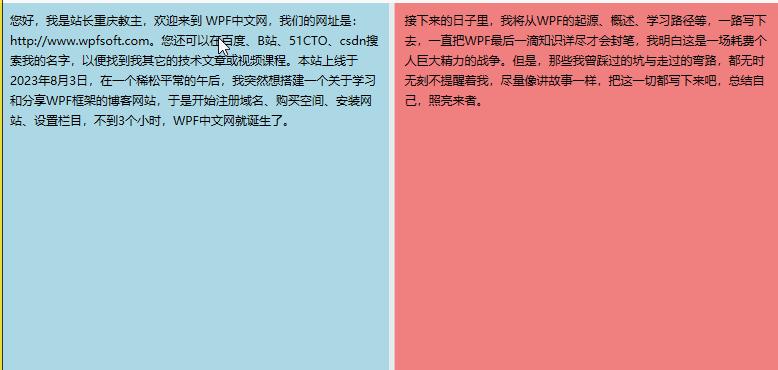

此文主要记录关于学习[WPF中文网 - 从小白到大佬 (wpfsoft.com)](https://www.wpfsoft.com/)的重点笔记

# DispatcherObject类

.NET为WPF准备了两个线程（WPF应用启动时），分别用于呈现界面（后台线程）和管理界面（UI线程）。后台线程一直隐藏于后台默默运行，我们感知不到，我们唯一能操作的就是UI线程。

绝大多数对象或控件都必须在UI线程上创建，而且，其它后台子线程不能直接访问UI线程上的控件，那么，后台线程非要访问UI线程的控件或对象，该怎么办呢？微软说，这样吧，我在UI线程上给你们提供一个中间商Dispatcher（调度员），将Dispatcher放到一个抽象类DispatcherObject，然后我向你保证，**我所有的控件都从这个DispatcherObject类继承**，这样当你们在后台线程中要访问控件时，就可以从控件中找到那位中间商Dispatcher，由中间商来完成你要对控件的操作访问。

从此，DispatcherObject在WPF的世界中，便登上了至高无上的宝座，成为了几乎所有类型的终极基类。

而作为DispatcherObject类的成员Dispatcher（调度员）又提供了哪些功能？简单点说，它便是后台线程和前台线程的架海紫金梁，虽然所有的控件都必须在前台UI线程中创建，但是在开发过程中，难免需要在后台线程中去操作控件，于是Dispatcher调度员提供了Invoke和BeginInvoke两个方法，供我们可以安全的访问UI线程中的控件。

> 官方解释
>
> 在 WPF 中， DispatcherObject 只能由 Dispatcher 它与之关联的访问。 例如，后台线程无法更新与 Dispatcher UI 线程上关联的内容Button。 为了使后台线程访问该 Content 属性 Button，后台线程必须将工作委托给 Dispatcher 与 UI 线程关联的工作。 这是通过使用 Invoke 或BeginInvoke。 Invoke 是同步的， BeginInvoke 是异步的。 操作将添加到指定DispatcherPriority位置的队列Dispatcher中。

我们以前面课程中的HelloWorld项目为例，在Grid中添加一个button，在MainWindow的构造函数中增加如下代码。

XAML代码

```xaml
    <StackPanel>
        <Button x:Name="btnContent" Content="我是需要被更新的内容" Width="Auto" Height="30"/>
        <Button x:Name="btnNewThread" Content="通过后台线程更新按钮Content" Width="Auto" Height="30" Click="btnNewThread_Click"/>
    </StackPanel>
```


C#代码

```C#
        private void btnNewThread_Click(object sender, RoutedEventArgs e)
        {
            Task.Factory.StartNew(() =>
            {
                btnContent.Dispatcher.Invoke(() =>
                {
                    btnContent.Content = "我已更新";

                });
            });
        }
```

我们利用Task工厂创建了一个子线程（后台线程），然后调用了button的Dispatcher调度员，其Invoke方法中传入了一个匿名函数，在这个匿名函数中去改变button按钮的Content属性。

为什么button按钮有Dispatcher？因为button按钮继承了WPF的带头大哥DispatcherObject类，而DispatcherObject类有Dispatcher成员。

那么DispatcherObject 类的主要方针路线到底是什么呢？主要有两个职责：

- 提供对对象所关联的当前 Dispatcher 的访问权限，意思是说谁继承了它，谁就拥有了Dispatcher。
- 提供方法以检查 (CheckAccess) 和验证 (VerifyAccess) 某个线程是否有权访问对象（派生于 DispatcherObject）。CheckAccess 与 VerifyAccess 的区别在于 CheckAccess 返回一个布尔值，表示当前线程是否有可以使用的对象，而 VerifyAccess 则在线程无权访问对象的情况下引发异常。

# GridSplitter分割窗口

GridSplitter控件用来分割窗体的布局，必须放在Grid栅格控件中配合使用，通过鼠标按住GridSplitter进行左右或上下拖动，即可调整行列尺寸。

注意事项：

1、如果您希望GridSplitter控件可以水平调整左右的Grid列宽时，那么HorizontalAlignment属性必须设置为Stretch或者Center。

2、如果您希望GridSplitter控件可以垂直调整行高，那么VerticalAlignment属性必须设置为Stretch或者Center。

3、ShowsPreview属性表示拖动时是否及时绘制调整尺寸。

接下来，我们通过一个例子来说明它的用法

```xaml
    <Grid>
        <Grid.ColumnDefinitions>
            <ColumnDefinition/>
            <ColumnDefinition Width="Auto"/>
            <ColumnDefinition/>
        </Grid.ColumnDefinitions>
        <Grid Grid.Row="0" Grid.Column="0" Background="#ADD8E6">
            <TextBlock TextWrapping="Wrap" Padding="10" LineHeight="20">                
                您好，我是站长重庆教主，欢迎来到 WPF中文网，我们的网址是：http://www.wpfsoft.com。您还可以在百度、B站、51CTO、csdn搜索我的名字，以便找到我其它的技术文章或视频课程。本站上线于2023年8月3日，在一个稀松平常的午后，我突然想搭建一个关于学习和分享WPF框架的博客网站，于是开始注册域名、购买空间、安装网站、设置栏目，不到3个小时，WPF中文网就诞生了。
            </TextBlock>
        </Grid>
        <GridSplitter Grid.Column="1" Width="5" HorizontalAlignment="Center"   ShowsPreview="False"/>
        <Grid Grid.Row="0" Grid.Column="2" Background="#F08080">
            <TextBlock TextWrapping="Wrap" Padding="10" LineHeight="20">                
                接下来的日子里，我将从WPF的起源、概述、学习路径等，一路写下去，一直把WPF最后一滴知识详尽才会封笔，我明白这是一场耗费个人巨大精力的战争。但是，那些我曾踩过的坑与走过的弯路，都无时无刻不提醒着我，尽量像讲故事一样，把这一切都写下来吧，总结自己，照亮来者。
            </TextBlock>
        </Grid>
    </Grid>
```

