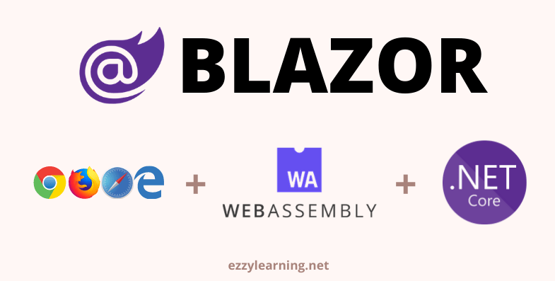
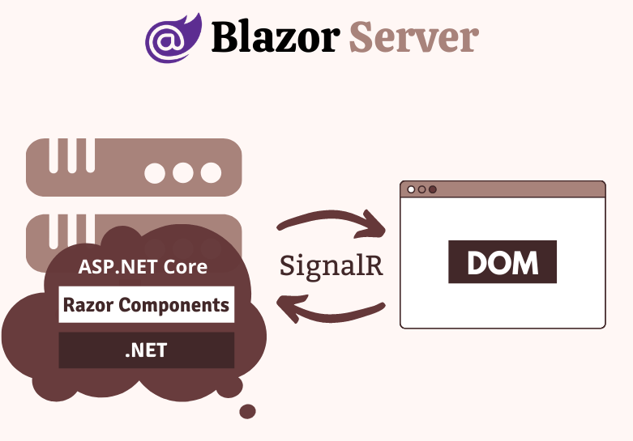
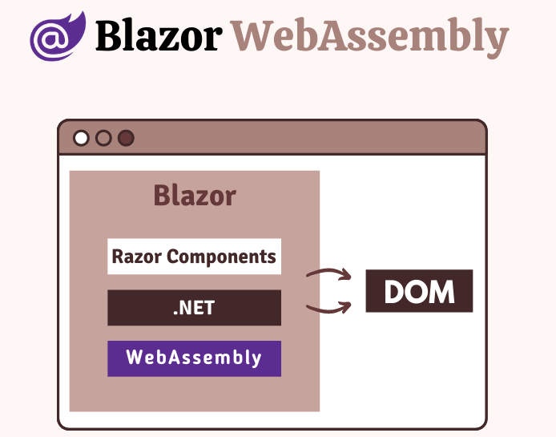
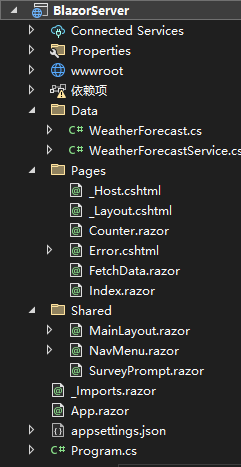
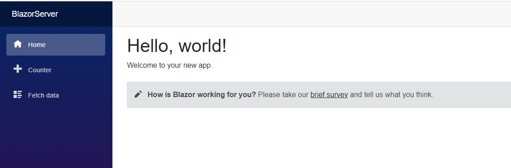
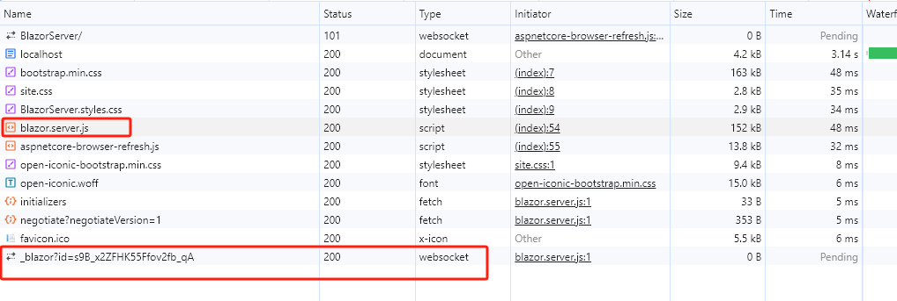
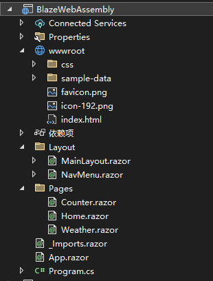

## Blazor

Blazor 是一个免费、开源的单页应用程序（SPA）开发框架，使开发人员能够在服务端和客户端上使用 C# 构建交互式 Web 应用程序。Blazor 不需要在客户端上安装任何插件来在浏览器中执行 C#/.NET 代码。它使用 WebAssembly 执行 .NET 代码，WebAssembly 是所有主流浏览器都支持的 Web 标准。Blazor 还可以在服务端运行 .NET 代码并构建 UI，然后通过 SignalR 连接仅将更新的 DOM 传输到客户端。



## WebAssembly

### WebAssembly是什么

官方对WebAssembly的描述为：

WebAssembly是一种可以在现代浏览器中运行的新型代码——它是一种低级的类似汇编的语言，具有紧凑的二进制格式，运行起来具有接近原生的性能，其为C/C++、C#和Rust等语言提供了一个编译目标，以便它们可以在web上运行。它还被设计为与JavaScript一起运行，允许两者一起工作。

通过这段描述已经可以对WebAssembly有一个初步认识，我们再进一步给它拆开来看：

- 首先，WebAssembly是一门新的编程语言，它于2019年12月5日正式成为与HTML、CSS以及JavaScript 并列的web领域第四类编程语言。
- 其次，WebAssembly是"汇编语言"而不是高级语言，程序员不直接编写WebAssembly代码，而是通过特殊的编译器将高级语言转换成WebAssembly代码。
- 再次，WebAssembly是预处理过后的二进制格式，它实际是一个IR(Intermediate Representation)！类似Java的ByteCode或者.Net的MSIL/CIL。
- 最后，WebAssembly是web上的语言，这意味着主流的浏览器可以读取并且执行它。

### 为什么需要WebAssembly

在web领域，我们已经有了JavaScript这样利器，但美中不足的是JavaScript的性能不佳，即使可以通过各种编译优化来解决一部分问题，但在类似图形图像处理、3D游戏、AR、VR这些高性能应用的场景下，我们似乎任然需要一个更好的选择。

“**快”是相对的，目前我们可以认为在运行速度上：原生C/C++代码 > WebAssembly > asm.js > 原生JavaScript**。其中WebAssembly比asm.js要快的原因在于：

- 文件抓取阶段：WebAssembly 体积更小，JavaScript 通过gzip压缩后已经可以节约很大一部分空间，但WebAssembly 的二进制格式在被精心设计之后可以比gzip压缩后的JavaScript 代码**小10-20%左右**。
- 解析阶段：WebAssembly 解析更快，WebAssembly 解析速度比 JavaScript **快了一个数量级**，这也是得益于其二进制的格式。除此之外，WebAssembly还可以在多核CPU上进行并行解析。
- 编译和优化阶段：WebAssembly 更具优势，因为 WebAssembly 的代码更接近机器码，而 JavaScript 要先通过服务器端进行代码优化。
- 重优化阶段：WebAssembly 不会发生重优化现象。而 JS 引擎的优化假设则可能会发生“抛弃优化代码<->重优化”现象。
- 执行阶段：WebAssembly 更快是因为开发人员不需要懂太多的编译器技巧，而这在 JavaScript 中是需要的。WebAssembly 代码也更适合生成机器执行效率更高的指令。
- 垃圾回收阶段：WebAssembly 垃圾回收都是手动控制的，效率比自动回收更高。

当然，速度上的提升并不是全部。WebAssembly的意义在于开辟了一个新的标准，不再拘泥于JavaScript而是直接面向跟底层的机器码。用任何语言都可以开发WebAssembly，而WebAssembly又可以高效运行在任何环境下，这也是Mozilla的程序员对WebAssembly抱有的最远大的宏图大业

### 如何正确使用 WebAssembly 

WebAssembly的诞生并不是要取代JavaScript，web端整个主框架还是HTML+JS+CSS这一套。web应用的大部分基础功能也依然是靠JavaScript来实现，我们只是将web应用中对性能有较高要求的模块替换为wasm实现。在这样的场景下，正确使用WebAssembly的步骤为：

- **整理web应用中所有模块，梳理出有性能瓶颈的地方。**例如你的web应用里有视频上传、文件对比、视频编解码、游戏等模块，这些都是很适合用WebAssembly来实现的。相反，基础的网页交互功能并不适合用WebAssembly来实现。
- **进行简单的demo性能测试**，看是否能达到预期的加速效果。如果加速效果并不明显，那么就不适合切换到Wasm。
- **确定用来编译成WebAssembly的源语言，**目前主流的语言基本都是支持WebAssembly的，唯一不同的区别是其编译器的优化程度。如果你使用过C++、RUST，最好还是用这两种语言来编写，其编译优化程度会更高。当然了如果你想使用PHP/GO/JS/Python这些你更加熟悉的语言的话，也是不错的选择，毕竟有时候开发效率会比运行效率要更加重要。
- **编码实现，然后导出.wasm文件。**这一步基本没什么难度，确定了语言之后使用对应的编译器即可，需要注意的是记得尽量多打开debug选项，不然有运行时报错的话你就只能对着一堆二进制代码懵逼了。
- **编写JavaScript胶水代码，加载.wasm模块。**在最小可行版本的实现中，在 Web 上访问 WebAssembly 的唯一方法是通过显式的JavaScript API调用，而在ES6标准中，WebAssembly 也可以直接从<script type='module'>的HTML标签加载和运行。

## Blazor托管模型

Blazor 组件模型是 Blazor 的核心，它的设计方式使计算 UI 更改和呈现 UI 彼此分离。 这就是为什么无论您使用何种方式渲染您的应用程序，基本的组件模型都保持不变的原因。 在撰写本文时，有四种渲染/托管模型可用，它们都处于不同的开发阶段。

- Blazor Server
- Blazor WebAssembly
- Blazor Electron
- Mobile Blazor Bindings

Blazor Electron 和 Mobile Blazor Bindings 目前处于实验阶段，Microsoft 尚未承诺发布这些托管模型，因此我不会在本文中讨论它们。

### Blazor Server

> 瘦客户端

Blazor Server 应用程序在服务器上运行，可享受完整的 .NET Core 运行时支持。所有处理都在服务器上完成，UI/DOM 更改通过 SignalR 连接回传给客户端。这种双向 SignalR 连接是在用户第一次从浏览器中加载应用程序时建立的。 由于 .NET 代码已经在服务器上运行，因此您无需为前端创建 API。您可以直接访问服务、数据库等，并在传统的服务端技术上做任何您想做的事情。在客户端上，Blazor 脚本 (`blazor.server.js`) 与服务器建立 SignalR 连接。 脚本由 ASP.NET Core 共享框架中的嵌入资源提供给客户端应用。 客户端应用负责根据需要保持和还原应用状态。

此方式是浏览器通过SignalR请求服务器，UI渲染和用户交互都在服务器上进行，而不是在客户端。客户端接收到的是已经渲染的页面，可直接显示（页面渲染在后端而不是在前端）。云游戏就是应用类似的方式，对客户机的性能要求不高，只要可以显示网页即可畅玩，因为所有处理都在服务端，而客户机只需显示画面。



**何时使用Blazor Server**

- 当您想在完整的 .NET Core 运行时上运行应用程序时
- 当您想要保持应用程序的初始下载大小非常小时
- 当您想保持应用启动时间非常快时
- 当您想把应用程序的代码保留在服务器上，而不希望它被下载到客户端时
- 当您想要一个快速的应用开发周期，而现有的 .NET 开发人员几乎不需要学习曲线时
- 当您想让您的应用对搜索引擎友好时
- 当您希望应用程序在旧的浏览器上运行，而不依赖于 WebAssembly 时
- 当您想在 Visual Studio 中像调试普通 .NET 应用程序一样调试 .NET 代码时
- 当您想要构建内部网或低需求的面向公众的应用程序时

### 何时不要使用 Blazor Serve

- 当您的应用程序在高延迟环境中运行时
- 当您希望您的应用程序离线工作，而不需要一个与服务器的固定 SignalR 连接时
- 当您不想增加服务器资源以响应大量连接的 SignalR 客户端时

### Blazor WebAssembly

> 胖客户端

Blazor WebAssembly（WASM）应用程序在浏览器中基于WebAssembly的.NET运行时运行客户端。Blazor应用程序及其依赖项和.NET运行时被下载到浏览器中。该应用程序直接在浏览器的UI线程上执行。UI更新和事件处理在同一进程中进行。应用程序的资产被作为静态文件部署到能够为客户提供静态内容的网络服务器或服务上。当Blazor WebAssembly应用被创建用于部署，而没有后端ASP.NET Core应用为其提供文件时，该应用被称为独立的Blazor WebAssembly应用。当应用程序被创建用于部署，并有一个后端应用程序为其提供文件时，该应用程序被称为托管的Blazor WebAssembly应用程序。



**何时使用 Blazor WebAssembly**

- 当您想要将整个应用程序编译为静态文件，并将它们提供给客户端，而不需要服务器上的 .NET 运行时时。这意味着您的后端可以用 PHP、Node 或 Rails 编写，并服务于用 Blazor 编写的前端应用程序。
- 当您想要构建可以在客户端脱机运行而无需持续连接到服务端的应用程序时。
- 当您想要将处理转移到客户端并减少服务端的负载时。
- 当您想在客户端和服务端之间共享代码和库时

**何时不要使用 Blazor WebAssembly**

- 当由于下载到客户端的文件/DLL 太多，而您无法在有效负载上妥协时。
- 当您无法在缓慢的启动时间上（特别是在网络连接不佳的情况下）妥协时。
- 当您无法妥协于应用程序必须运行在具有完整的安全限制的浏览器沙箱环境中时。

## Blazor项目结构

### Blazor Server



- **Program.cs**

  ```C#
          public static void Main(string[] args)
          {
              var builder = WebApplication.CreateBuilder(args);
  
              // Add services to the container.
              builder.Services.AddRazorPages();
              builder.Services.AddServerSideBlazor();
              builder.Services.AddSingleton<WeatherForecastService>();
  
              var app = builder.Build();
  
              // Configure the HTTP request pipeline.
              if (!app.Environment.IsDevelopment())
              {
                  app.UseExceptionHandler("/Error");
                  // The default HSTS value is 30 days. You may want to change this for production scenarios, see https://aka.ms/aspnetcore-hsts.
                  app.UseHsts();
              }
  
              app.UseHttpsRedirection();
  
              app.UseStaticFiles();
  
              app.UseRouting();
  
              app.MapBlazorHub();
              app.MapFallbackToPage("/_Host");
  
              app.Run();
          }
  ```

  这个文件包含 Main 方法，它是项目的入口点。Main 方法中调用 CreateBuilder 方法，为我们配置默认的 ASP.NET Core 宿主。它与我们在标准 ASP.NET Core 项目中使用的文件相同。需要重点注意的一点是Main方法中调用了 AddServerSideBlazor，该方法添加与 Blazor Server App 相关的服务。

  MapBlazorHub方法配置 Blazor Server App 所需的 SignalR Hub Endpoints。

  MapFallbackToPage 方法会将所有未与任何控制器、razor 页面等匹配的请求映射到 **_Host** 页面，这将允许所有动态内容请求路由到 SPA 框架，而不是抛出 *404 Not Found*。

- **_Host.cshtml**

  这是应用程序的根页面，每个 Razor 组件/页面都将在此 host 页面中呈现。它具有基本的 HTML 元素，例如 html、head 和 body，以及一些特殊元素。请注意，Blazor 是一个基于组件的框架，Blazor 中的每一内容都是一个组件。`<component>` 指定了我们想让应用程序根组件呈现的位置。

  ```html
  <component type="typeof(App)" render-mode="ServerPrerendered" />
  ```

  

- **App.razor**

  这是 Blazor App 的主要组件，其主要工作是拦截路由并呈现 Found 或 NotFound 组件。 如果找到与路由匹配的组件，则呈现 Found 组件，如果未找到匹配的组件，则呈现 NotFound 组件。

  ```C#
  <Router AppAssembly="@typeof(App).Assembly">
      <Found Context="routeData">
          <RouteView RouteData="@routeData" DefaultLayout="@typeof(MainLayout)" />
          <FocusOnNavigate RouteData="@routeData" Selector="h1" />
      </Found>
      <NotFound>
          <PageTitle>Not found</PageTitle>
          <LayoutView Layout="@typeof(MainLayout)">
              <p role="alert">Sorry, there's nothing at this address.</p>
          </LayoutView>
      </NotFound>
  </Router>
  ```

- **MainLayout.cshtml**

  MainLayout 文件包含应用程序的主布局，其标记可以被多个 Razor 组件共享。这个布局组件通常包含应用程序的常见 UI 元素，例如页眉、菜单、页脚、侧边栏等。为我们生成的默认 MainLayout 有一个侧边栏，用来渲染 **NavMenu** 组件，它还使用 Razor 语法 **@Body** 来指定其他组件的内容将在布局标记中呈现的位置。

  ```html
  @inherits LayoutComponentBase
  
  <PageTitle>BlazorServer</PageTitle>
  
  <div class="page">
      <div class="sidebar">
          <NavMenu />
      </div>
  
      <main>
          <div class="top-row px-4">
              <a href="https://docs.microsoft.com/aspnet/" target="_blank">About</a>
          </div>
  
          <article class="content px-4">
              @Body
          </article>
      </main>
  </div>
  ```

- **wwwroot 文件夹**

  该文件夹包含静态文件，例如图片、字体、图标、CSS 和 JavaScript 文件等。

- **Pages 和 Shared 文件夹**

  该文件夹包含我们之前讨论过的 _Host.cshtml 文件以及一些 Razor 组件。Blazor 应用程序是具有 .razor 扩展名的 Razor 组件的集合。其中一些组件称为可路由组件，因为可以使用其路由访问它们。例如，当我们导航到应用程序根 URL 时，将呈现下面的 Index.razor 组件。该 URL 是使用 Index.razor 组件顶部的 @page 指令指定的。

- **Index.razor**

  ```C#
  @page "/"
  
  <PageTitle>Index</PageTitle>
  
  <h1>Hello, world!</h1>
  
  Welcome to your new app.
  
  <SurveyPrompt Title="How is Blazor working for you?" />
  ```

  请注意，上面的页面还使用了一个子组件 SurveyPrompt，之所以称它为子组件，是因为它没有 @page 指令，它可以被嵌入到其他组件中。

  Pages 文件夹中还有一些其他的 razor 组件，这些组件都可以使用文件顶部指定的路径进行访问。例如，当我们导航到 /counter 路径时，Counter 组件将呈现。类似地，FetchData 组件将使用 /fetchdata 路径呈现。

  Razor Server 应用程序还有一个包含共享组件的 Shared 文件夹。这些组件可以被整个应用程序中的任何组件使用，就像我们上面看到的 SurveyPrompt 组件一样。Shared 文件夹中另一个有趣的共享组件是 NavMenu 组件，它呈现 Blazor Server 应用程序的顶部导航栏。

- **_Imports.razor**

  该文件类似于我们在 ASP.NET MVC Web 应用程序中的 *_ViewImports.cshtml* 文件，它包含我们可以在不同 razor 组件中使用的命名空间列表。在 *_Imports.razor* 文件中声明所有这些命名空间的好处是我们不需要在每个 razor 组件中重复引入它们。

现在是时候运行我们的 Blazor Server 应用程序并在浏览器中查看它的运行情况了。在 Visual Studio 中按 `F5`，您将看到一个漂亮的默认 Blazor Server 应用程序。试试从侧边栏导航到不同的页面，并尝试在 Counter 页面上使用计数器，您会注意到没有页面刷新或回传到服务器。一切都像经典的 SPA 那样流畅和快速，浏览器和服务端的所有通信都是使用 SignalR 连接进行的。




您也可以打开浏览器开发者工具，您会注意到所有标准的 CSS 和 JavaScript 文件（包括 blazor.server.js 文件）都下载到了客户端，并通过 Web Sockets 建立了一个 SignalR 连接。



### Blazor WebAssembly



您可以轻松发现这两种类型的应用程序之间的一些差异。例如，在 Blazor WebAssembly 应用程序中没有以下文件：

1. _Host.cshtml
2. Error.cshtml
3. appsettings.json

- **index.html**

  在 Blazor WebAssembly 应用程序中，我们会在 wwwroot 文件夹中有一个 index.html 文件，作为主页面， 该文件在末尾注入了 blazor.webassembly.js 文件，此文件由框架提供以处理下载 .NET 运行时、Blazor 应用程序及其所有依赖项。它还包含为了运行应用而初始化运行时的代码。在 Blazor WebAssembly 应用程序中，我们会在 wwwroot 文件夹中有一个 index.html 文件，作为主页面， 该文件在末尾注入了 blazor.webassembly.js 文件，此文件由框架提供以处理下载 .NET 运行时、Blazor 应用程序及其所有依赖项。它还包含为了运行应用而初始化运行时的代码。

- **Program.cs**

  在 Blazor WebAssembly 应用程序中，应用程序的根组件在 Program.cs 文件中的 Main 方法中指定。应用程序的根组件是 App.razor，你可以看到它是如何被添加到 RootComponents 集合中的。

  ```C#
          public static async Task Main(string[] args)
          {
              var builder = WebAssemblyHostBuilder.CreateDefault(args);
              builder.RootComponents.Add<App>("#app");
              builder.RootComponents.Add<HeadOutlet>("head::after");
  
              builder.Services.AddScoped(sp => new HttpClient { BaseAddress = new Uri(builder.HostEnvironment.BaseAddress) });
  
              await builder.Build().RunAsync();
          }
  ```

在 Visual Studio 中按 F5，您将看到一个相似的 Blazor WebAssembly 应用程序。尝试从侧边栏导航到不同的页面，并尝试像之前在 Blazor Server App 中所做的那样在 Counter 页面上使用计数器。 一切看起来感觉一模一样，也没有服务器端回传。

正如我们已经知道的那样，Blazor WebAssembly 应用程序会在客户端下载应用程序及其所有依赖项，因此如果您打开浏览器开发者工具，会看到客户端下载了大量 DLL（*只会在第一次浏览时下载*）。

以上所有文件只会在第一次请求时下载，然后它们被缓存在浏览器中。如果您再次刷新页面，将会看到这一次下载的文件很少。

> 问题：启动Blazor Assembl项目报错：未能启动调试适配器......
>
> 解决：启动单步调试即Ctrl+F5 可以正常启动
>
> ​           F5运行时不能以IISExpress方式启动，否则报错（此方式不会命中断点？？？）

开启浏览器的WebAssembly

浏览器的地址栏中输入 "about:flags"（不含引号）—>开启Experimental WebAssembly


## Blazor组件

参考资料

[万字长文,看这一篇就够了！WebAssembly原理剖析与生产应用 - 知乎 (zhihu.com)](https://zhuanlan.zhihu.com/p/620767652?utm_id=0)

https://ittranslator.cn/

[Blazor Server 和 WebAssembly 应用程序入门指南 - 技术译民 - 博客园 (cnblogs.com)](https://www.cnblogs.com/ittranslator/p/a-beginners-guide-to-blazor-server-and-webassembly-applications.html)

