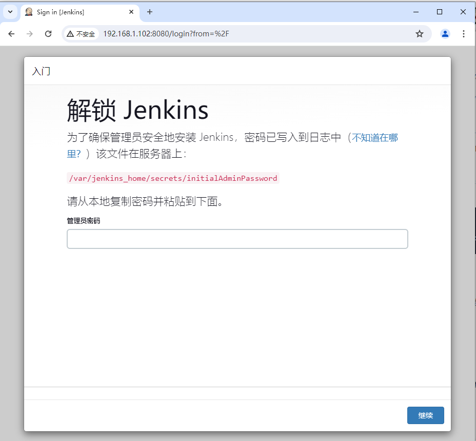
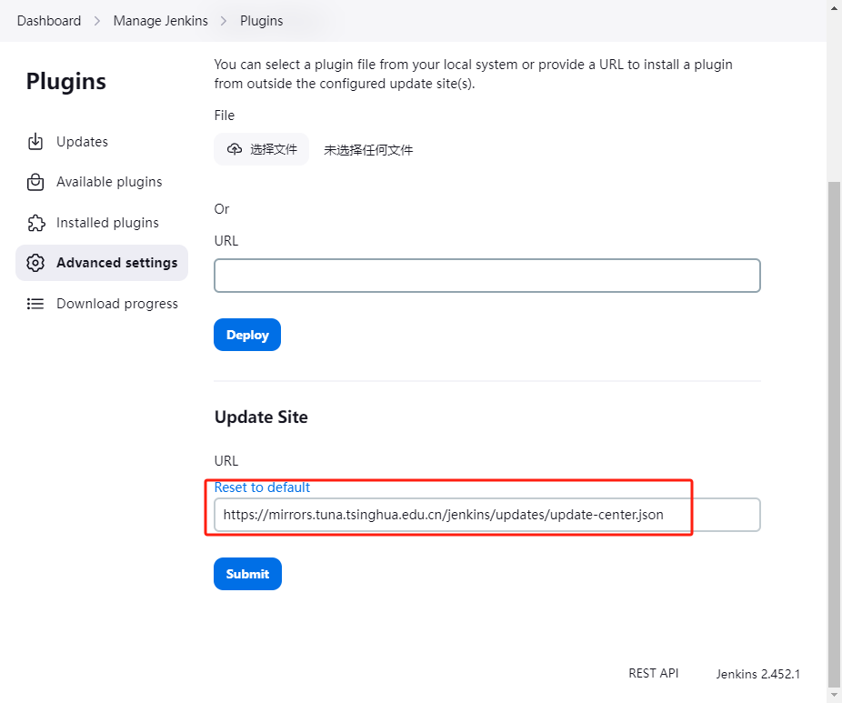

# DevOps

## DevOps介绍

DevOps是Development和Operations的组合词,意为开发(Dev)和运维(Ops)的结合与协作。它是一种重视"软件开发人员(Dev)"和"IT运维技术人员(Ops)"之间沟通合作的文化、运动或惯例。

### DevOps目标

DevOps的主要目标是打破开发和运维之间的壁垒,提高软件交付的速度、质量和可靠性。通过DevOps实践,可以实现:

- 加快软件发布周期:通过自动化流程和工具,缩短开发、测试、部署的时间,实现快速迭代。
- 提高部署频率:通过持续集成和持续交付,使软件随时可以部署,满足业务需求。
- 降低故障率:通过自动化测试和监控,在开发阶段就发现和解决问题,提高软件质量。
- 缩短恢复时间:通过快速回滚和故障恢复机制,最小化故障的影响。
- 提高协作效率:打破部门壁垒,形成开发、测试、运维、安全等跨职能团队,提高沟通和协作效率。

## 主要实践

DevOps涉及的主要实践：

- 持续集成与持续交付(CI/CD)，持续集成是开发人员频繁将代码合并到共享仓库中以自动构建和测试的实践，而持续交付则确保软件可以随时安全地部署到生产环境，两者都通过自动化过程加速软件开发并提高质量。
- 基础设施即代码(Infrastructure as Code)，基础设施即代码是一种实践，通过使用代码自动化管理和配置硬件设施，以提高基础设施的部署速度和一致性，同时减少人为错误。
- 配置管理(Configuration Management)，DevOps中的配置管理是使用工具如Ansible、Puppet、Chef等,通过代码自动化管理和配置服务器、应用和资源,确保环境的一致性、可重复性和可追溯性。
- 容器化(Containerization)，容器化是一种将应用程序及其依赖打包在一起的技术,通过容器引擎如Docker提供隔离的运行环境,实现应用的快速部署、扩展和迁移。
- 微服务架构(Microservices Architecture)，微服务架构是一种将应用程序设计为一组小型服务的架构风格,每个服务运行在自己的进程中,通过轻量级机制(通常是HTTP API)进行通信,这些服务围绕业务能力构建,可以通过自动化部署机制独立部署,从而实现应用的解耦、敏捷开发和快速迭代。
- 监控与日志管理(Monitoring and Logging)，监控与日志管理是DevOps中的重要实践,通过收集、聚合和分析应用和基础设施的指标和日志数据,实现对系统的实时监控、故障排查、性能优化和安全审计。
- 自动化测试(Automated Testing)，自动化测试是使用工具和脚本自动执行测试用例,包括单元测试、集成测试、功能测试等,通过持续运行测试来验证软件质量,尽早发现缺陷,减少手工测试工作,提高测试效率和可靠性。
- DevOps是一种强调开发和运维协作的文化和实践,通过自动化和工具链的支持,提高软件交付的效率和质量,更好地满足业务需求。它已经成为现代软件开发和IT运营的重要方法论和趋势。

二、DevOps 开源工具组合
DevOps的开源工具生态非常丰富,可以针对不同的场景和需求选择合适的工具组合。以下是一些常见的开源工具组合:

- 代码管理与协作
  版本控制系统:Git
  代码托管平台:GitLab、GitHub、Gitee
  代码审查工具:Gerrit、GitLab Code Review
- CI/CD平台:Jenkins、GitLab CI/CD
  构建工具:Maven、Gradle、Ant、Make
  制品仓库:Nexus、JFrog Artifactory、Harbor
- 配置管理与基础设施即代码
  配置管理工具:Ansible、Puppet
  基础设施即代码工具:Terraform、AWS CloudFormation
- 容器化与容器编排
  容器引擎:Docker
  容器编排平台:Kubernetes、Docker Swarm、Apache Mesos
  容器镜像仓库:Docker Registry、Harbor
- 监控与日志管理
  监控平台:Prometheus、Zabbix、Nagios
  可视化工具:Grafana
  日志管理平台:ELK Stack(Elasticsearch、Logstash、Kibana)、Graylog、Fluentd
- 自动化测试
  单元测试框架:JUnit、PyTest、RSpec
  接口测试工具:Postman、SoapUI、REST-assured
  自动化测试工具:Selenium、Appium、Robot Framework
- 安全与合规
  安全扫描工具:SonarQube、OWASP ZAP、Nessus
  合规即代码工具:InSpec、Open Policy Agent
- 协作与项目管理
  问题跟踪系统:Jira、Redmine、Bugzilla
  团队沟通工具:Slack、Mattermost、Rocket.Chat
  文档协作平台:Confluence、Wiki

这只是DevOps开源工具的一部分,实际的工具组合会根据团队的技术栈、架构特点、业务需求等因素而有所不同。选择工具时,除了考虑功能和性能,还要评估工具的成熟度、社区活跃度、文档完整性、集成性等方面。

同时,工具只是实现DevOps的一种手段,更重要的是形成合适的文化和流程,打通开发、测试、运维等部门之间的协作,建立端到端的自动化交付流水线。选择合适的工具组合,并持续优化和完善DevOps实践,可以显著提升软件交付的效率和质量。

# CI/CD

持续集成(Continuous Integration, CI)、持续交付(Continuous Delivery, CD)和持续部署(Continuous Deployment)是现代软件开发中的三个重要概念,它们共同构成了一种高效、自动化的软件开发实践。

## 持续集成(CI)

> Continuous Integration, CI

持续集成是一种软件开发实践,团队成员频繁地将他们的工作集成到一个共享的代码仓库中。每次集成都会触发自动化构建和测试,以尽早发现和解决集成问题。

持续集成的核心目标是尽早发现错误,减少集成问题,提高软件质量。通过频繁的代码合并和自动化测试,团队可以更快地发现和修复缺陷,避免了在开发后期进行大规模集成时出现的复杂问题。

持续集成的关键实践包括:

- 维护一个共享的代码仓库
- 频繁地将代码变更提交到仓库
- 每次提交都触发自动化构建和测试
- 快速修复构建和测试中发现的问题
- 保证主干代码始终处于可构建、可测试的状态

## 持续交付(CD)

> Continuous Delivery, CD

持续交付在持续集成的基础上更进一步,将集成后的代码自动化地部署到类生产环境中,使得软件随时都处于可发布的状态。

持续交付的目标是缩短发布周期,降低发布风险,提高发布质量。通过自动化部署和严格的质量关卡,团队可以频繁、可靠地将新功能交付给用户,同时降低了发布过程中的人工错误和风险。

持续交付的关键实践包括:

- 自动化构建、测试和部署流程
- 将代码部署到类生产环境进行验证
- 使用特性开关等技术控制新功能的发布
- 强调部署流程的可重复性和可靠性
- 持续收集用户反馈,快速响应变化

## 持续部署(CD)

> Continuous Deployment,CD

持续部署是持续交付的延伸,它将经过充分验证的代码自动化地部署到生产环境,无需人工干预。每一次通过自动化测试和质量关卡的代码变更都会自动上线,真正实现了代码从提交到部署的全流程自动化。

持续部署的核心目标是最大限度地加速发布过程,让新功能以最快的速度到达用户手中。它要求团队具有完善的自动化测试和部署流程,以及对系统质量的高度自信。

持续部署的关键实践包括:

- 完全自动化的构建、测试和部署流程
- 大量的自动化测试确保系统质量
- 灰度发布、金丝雀发布等技术降低发布风险
- 实时监控和快速回滚机制
- 培养团队对自动化部署的信心和文化
- 持续集成、持续交付和持续部署是现代软件开发中的三个重要实践,它们相互关联,逐步构建起一个自动化、高效、可靠的软件交付流程。

## Jenkins实现CI/CD

Jenkins作为一个广泛使用的开源自动化服务器,在持续集成、持续交付和持续部署中扮演着关键的角色。以下是Jenkins在这三个方面的主要作用:

## Jenkins与持续集成

- 自动化构建:Jenkins可以根据预定义的构建脚本自动编译、打包和构建应用程序。
- 代码质量检查:通过集成代码质量检测工具(如SonarQube),Jenkins可以在每次构建时对代码进行静态分析,发现潜在的质量问题。
- 自动化测试:Jenkins可以自动运行单元测试、集成测试和端到端测试,确保代码变更不会引入新的缺陷。
- 构建结果通知:Jenkins可以在构建完成后通过邮件、即时消息等方式通知相关人员构建结果。
- 构建工件管理:Jenkins可以将构建产生的工件(如jar包、docker镜像)存储到制品仓库中,供后续使用。

## Jenkins与持续交付

- 自动化部署:Jenkins可以将构建后的应用程序自动部署到测试环境、预发布环境等,减少人工部署的错误和工作量。
- 部署流水线管理:通过Jenkins Pipeline,可以定义和管理从代码提交到部署的整个流程,实现自动化和可视化。
- 部署审批:Jenkins可以在部署流程中引入人工审批步骤,确保在关键节点上有人工控制。
- 部署结果追踪:Jenkins可以记录每次部署的状态、时间和responsible,方便问题追踪和审计。

## Jenkins与持续部署

- 自动化发布:Jenkins可以将通过所有测试和质量关卡的应用程序自动发布到生产环境,无需人工干预。
- 发布流程编排:通过Jenkins Pipeline,可以定义生产环境的发布流程,包括smoke test、金丝雀发布等步骤。
- 发布回滚:Jenkins可以与容器编排工具(如Kubernetes)集成,实现一键回滚到上一个稳定版本。
- 发布监控:Jenkins可以与监控系统集成,在发布后自动检查系统健康状况,发现潜在问题。

除了以上功能,Jenkins还提供了丰富的插件生态,可以与各种开发工具(如Git、Docker)和云平台(如AWS、Kubernetes)集成,扩展其在CI/CD中的能力。Jenkins作为一个灵活、可扩展的自动化服务器,在持续集成、持续交付和持续部署中提供了自动化构建、测试、部署和发布等关键功能,是实现现代软件开发高效交付的重要工具。

# Jenkins安装

## doker安装

```shell
docker run --name jenkins --user root -d --privileged \
-v jenkins_home:/var/jenkins_home \
-v /var/run/docker.sock:/var/run/docker.sock \
-p 8080:8080 -p 50000:50000 \
--restart=always \
jenkins/jenkins:lts-jdk17
```

说明：

- privileged：用于授予容器内的进程对主机系统的更高权限

- 挂载/var/run/docker.sock文件是被被映射到了容器内，有以下两个作用：

  - 1.在容器内只要向/var/run/docker.sock发送http请求就能和Docker Daemon通信。
  - 2.如果容器内有docker文件，那么在容器内执行docker ps、docker port这些命令，和在宿主机上执行的效果是一样的，因为它们的请求发往的是同一个docker daemon；

  注意：需要在docker容器中安装docker客户端

  ```shell
  docker exec -it -u root 容器名 bash
  curl -ssl https://get.docker.com | sh
  ```

- 50000端口是jenkins的监听端口，8080是jenkins运行的端口

## CentOS安装

```shell
# 更新系统。首先,确保你的CentOS 7系统是最新的
sudo yum update

#安装Java
sudo yum install java-11-openjdk-devel

#添加Jenkins存储库
sudo wget -O /etc/yum.repos.d/jenkins.repo https://pkg.jenkins.io/redhat-stable/jenkins.repo

#导入Jenkins密钥
#为了确保下载的Jenkins包是官方提供的,需要导入Jenkins的GPG密钥
sudo rpm --import https://pkg.jenkins.io/redhat-stable/jenkins.io-2023.key

#安装Jenkins
sudo yum install jenkins

#启动Jenkins服务
sudo systemctl start jenkins

#设置Jenkins服务开机自启
sudo systemctl enable jenkins

#调整防火墙规则(如果启用了防火墙)
#如果你的CentOS 7启用了防火墙,需要允许访问8080端口,Jenkins默认运行在这个端口上。运行以下命令:
sudo firewall-cmd --permanent --zone=public --add-port=8080/tcp
sudo firewall-cmd --reload

#访问Jenkins
http://your_server_ip_or_domain:8080
```

## 初识Jenkins

1、访问 Jenkins 控制台



3、获取初始管理员密码并登录

除了从以上目录获取，还可以通过容器启动日志查看

```shell
docker logs 
```

输入初始管理员密码后，您将进入 Jenkins 安装向导。按照向导中的说明进行操作，包括安装建议的插件或选择自定义插件（新手可以跳过此步）。

为了方便下次登录，建议修改用户密码

4、修改镜像源仓库

默认是国外地址，此处更新为国内镜像源。

```shell
https://mirrors.tuna.tsinghua.edu.cn/jenkins/updates/update-center.json
```



注意：需要重启jenkins才会生效

5、安装中文插件


## 初识Jenkins

1、创建一个Hellow任务

# 参考资料

[DevOps（四）在Ubuntu20.04和CentOS7安装Jenkins_ubuntu20.04安装jenkins-CSDN博客](https://lpoyx.blog.csdn.net/article/details/137735499)