# ElasticSearch

## 1  Elasticsearch 概述

### `(1)Elasticsearch 是什么`

>​	The Elastic Stack, 包括 Elasticsearch、Kibana、Beats 和 Logstash（也称为 ELK Stack）。 能够安全可靠地获取任何来源、任何格式的数据，然后实时地对数据进行搜索、分析和可视 化。
>
>​	Elaticsearch，简称为 ES，ES 是一个`开源的高扩展的分布式全文搜索引擎`，是整个 Elastic  Stack 技术栈的核心。它可以近乎实时的存储、检索数据；本身扩展性很好，可以扩展到上 百台服务器，处理 PB 级别的数据。

### `(2)全文搜索引擎`

>​	全文搜索引擎指的是目前广泛应用的主流搜索引擎。它的工作原理是计算机 索引程序通过扫描文章中的每一个词，对每一个词建立一个索引，指明该词在文章中出现的 次数和位置，当用户查询时，检索程序就根据事先建立的索引进行查找，并将查找的结果反 馈给用户的检索方式。这个过程类似于通过字典中的检索字表查字的过程。


## 2  Elasticsearch 入门

### `(1)Elasticsearch 安装（Windows）`

>1、下载软件
>
>​	Elasticsearch 的官方地址：https://www.elastic.co/cn/ 
>
>​	Elasticsearch 最新的版本是 7.11.2（截止 2021.3.10），我们选择 7.8.0 版本（最新版本半 年前的版本）
>
>​	 下载地址：https://www.elastic.co/cn/downloads/past-releases#elasticsearch
>
>2、安装软件
>
>​		Windows 版的 Elasticsearch 的安装很简单，解压即安装完毕，解压后的 Elasticsearch 的 目录结构如下
>
>​		
>
>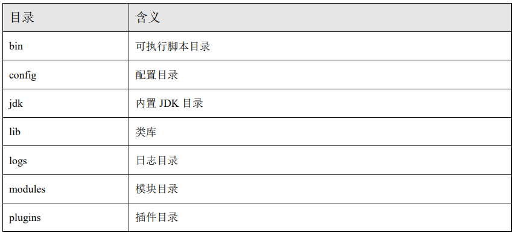
>
>解压后，进入 bin 文件目录，点击 elasticsearch.bat 文件启动 ES 服务
>
>注意：9300 端口为 Elasticsearch 集群间组件的通信端口，9200 端口为浏览器访问的 http 协议 RESTful 端口。
>
>打开浏览器（推荐使用谷歌浏览器），输入地址：http://localhost:9200，测试结果：
>
>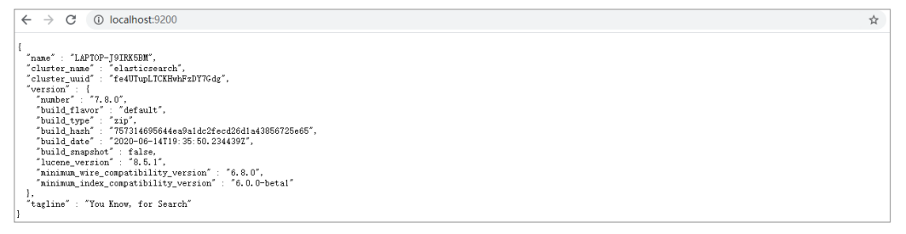
>
>3、问题解决
>
>- Elasticsearch 是使用 java 开发的，且 7.8 版本的 ES 需要 JDK 版本 1.8 以上，默认安装 包带有 jdk 环境，如果系统配置 JAVA_HOME，那么使用系统默认的 JDK，如果没有配 置使用自带的 JDK，一般建议使用系统配置的 JDK。
>
>- 双击启动窗口闪退，通过路径访问追踪错误，如果是“空间不足”，请修改 config/jvm.options 配置文件
>
>  

### `(2)Kibana安装（Windows）`

>​	Kibana 是一个免费且开放的用户界面，能够让你对 Elasticsearch 数据进行可视化，并 让你在 Elastic Stack 中进行导航。你可以进行各种操作，从跟踪查询负载，到理解请求如 何流经你的整个应用，都能轻松完成。
>
>下载地址：https://artifacts.elastic.co/downloads/kibana/kibana-7.8.0-windows-x86_64.zip
>
>1） 解压缩下载的 zip 文件 
>
>2） 修改 config/kibana.yml 文件
>
>```shell
># 默认端口
>server.port: 5601
># ES 服务器的地址
>elasticsearch.hosts: ["http://localhost:9200"]
># 索引名
>kibana.index: ".kibana"
># 支持中文
>i18n.locale: "zh-CN"
>```
>
>3）Windows 环境下执行 bin/kibana.bat 文件
>
>4）通过浏览器访问 : http://localhost:5601
>
>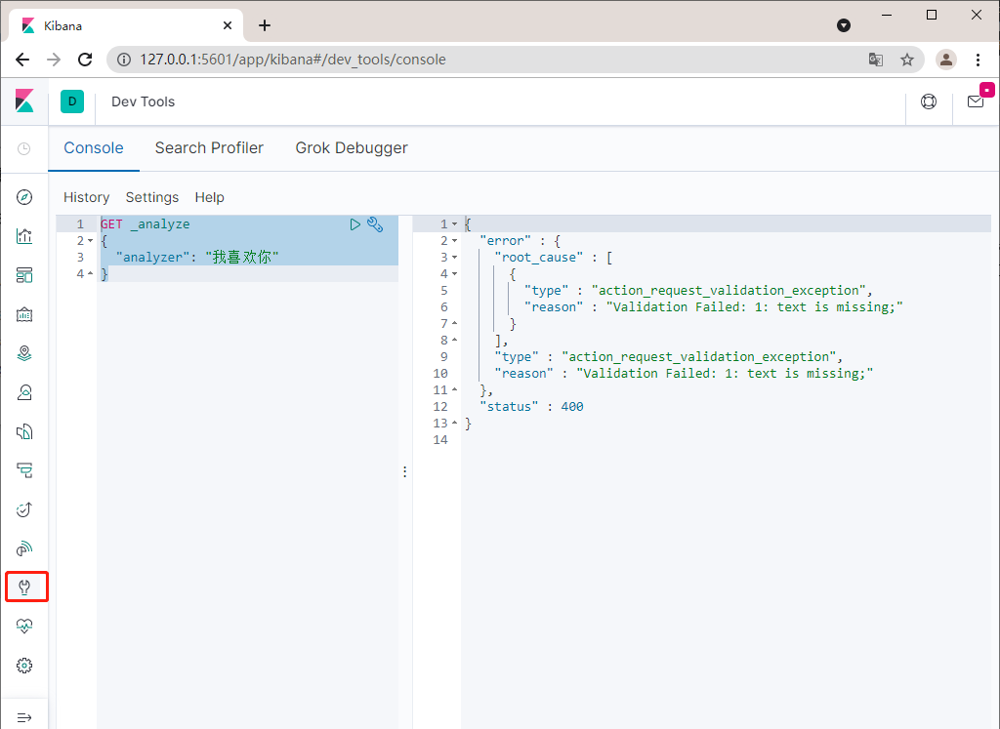

### `(3)IK分词器安装（Windows）`

>1）首先我们通过Kibana发送以下请求
>
>```shell
>GET _analyze
>{
>  "analyzer": "我喜欢你"
>}
>```
>
>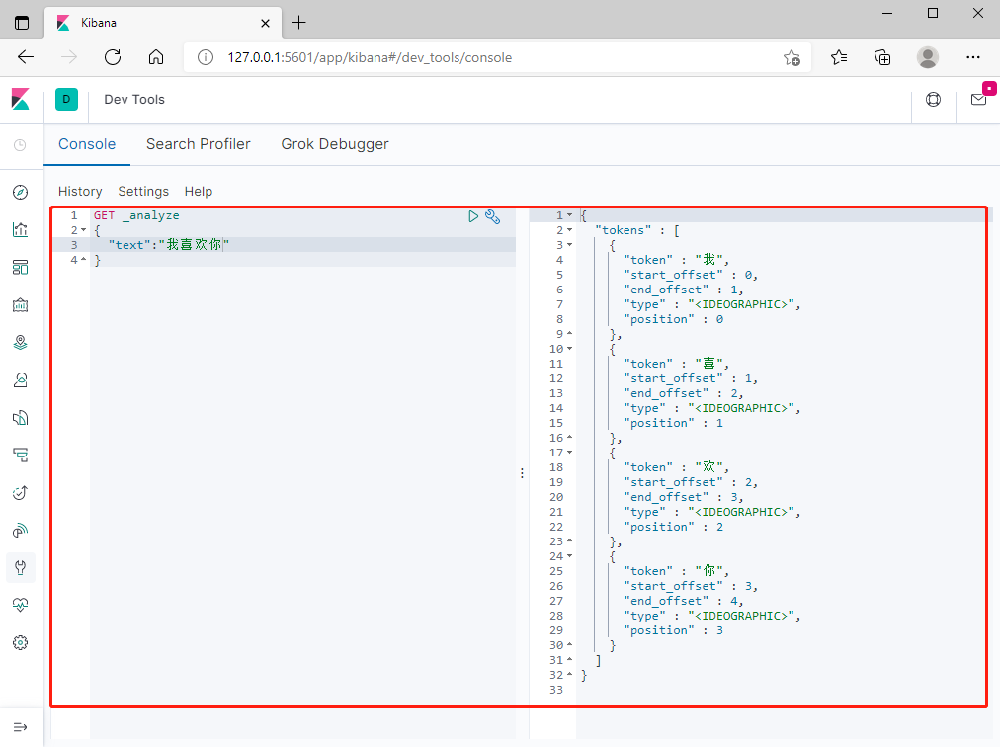
>
>ES 的默认分词器无法识别中文中测试、单词这样的词汇，而是简单的将每个字拆完分为一 个词
>
>这样的结果显然不符合我们的使用要求，所以我们需要下载 ES 对应版本的中文分词器
>
> 2）IK 中文分词器，下载地址为:  https://github.com/medcl/elasticsearch-analysis-ik/releases/tag/v7.8.0
>
>将解压后的后的文件夹放入 ES 根目录下的 plugins 目录下，重启 ES 即可使用。
>
>3）安装后查询结果：
>
>```shell
>GET _analyze
>{
>  "text":"我喜欢你",
>  "analyzer":"ik_max_word"
>}
>```
>
>- **`ik_max_word：会将文本做最细粒度的拆分`**
>-  **`ik_smart：会将文本做最粗粒度的拆分`**
>
>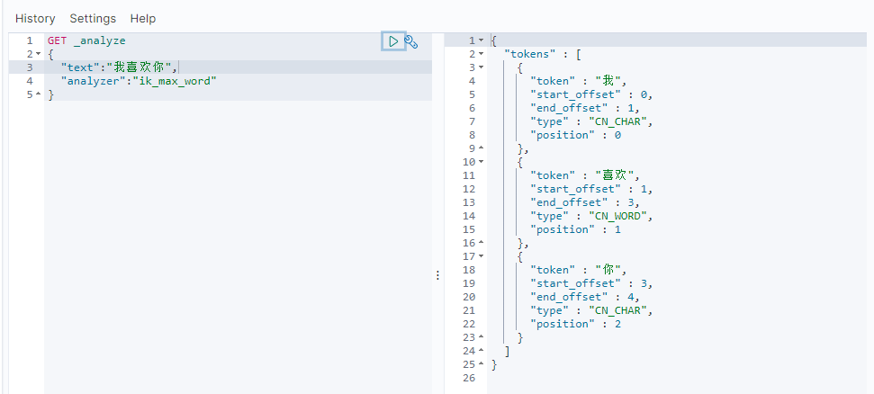
>
>4）ES也可以进行词汇扩展
>
>首先查询
>
>```shell
>GET _analyze
>{
>  "text":"弗雷尔卓德",
>  "analyzer":"ik_max_word"
>}
>```
>
>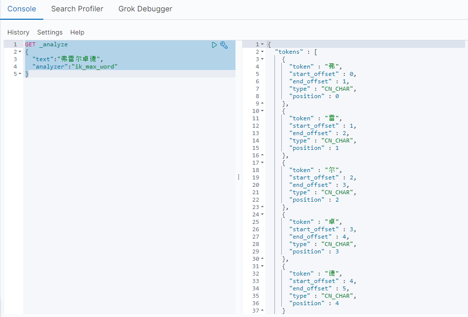
>
>仅仅可以得到每个字的分词结果，我们需要做的就是使分词器识别到弗雷尔卓德也是一个词语，进行如下操作即可：
>
>​	首先进入 ES 根目录中的 plugins 文件夹下的 ik 文件夹，进入 config 目录，创建 custom.dic 文件，写入弗雷尔卓德。同时打开 IKAnalyzer.cfg.xml 文件，将新建的 custom.dic 配置其中， 重启 ES 服务器
>
>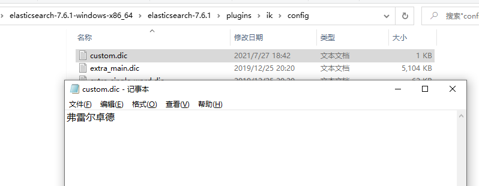
>
>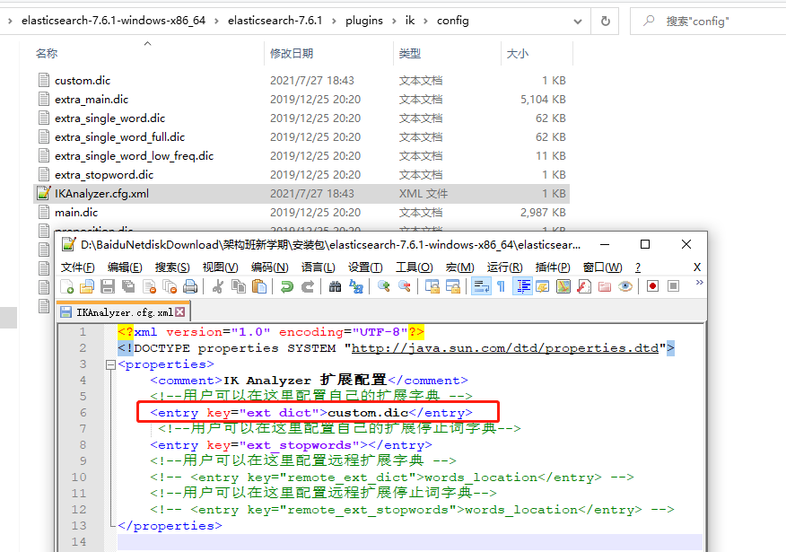
>
>重启ES后查询结果如下：
>
>

## 3 Elasticsearch 基本操作

###   `(1)客户端安装`

>​	如果直接通过浏览器向 Elasticsearch 服务器发请求，那么需要在发送的请求中包含 HTTP 标准的方法，而 HTTP 的大部分特性且仅支持 GET 和 POST 方法。所以为了能方便 地进行客户端的访问，可以使用 Postman 软件
>
>​	Postman 官网：https://www.getpostman.com
>
> 	Postman 下载：https://www.getpostman.com/apps

### `(2)数据格式`

>​	Elasticsearch 是面向文档型数据库，一条数据在这里就是一个文档。
>
>​	为了方便大家理解， 我们将 Elasticsearch 里存储文档数据和关系型数据库 MySQL 存储数据的概念进行一个类比
>
>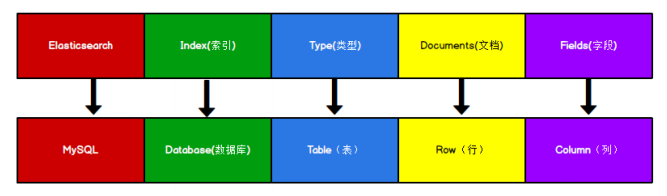
>
>说明：
>
>​		ES 里的 Index 可以看做一个库，而 Types 相当于表，Documents 则相当于表的行。 这里 `Types 的概念已经被逐渐弱化`，Elasticsearch 6.X 中，一个 index 下已经只能包含一个 type，Elasticsearch 7.X 中, Type 的概念已经被删除了

### `(3)HTTP 操作`

>此处参照`AAAAAAAAA文件`

## 4 Elasticsearch 环境

### `(1)相关概念`

>1、单机 & 集群
>
>​	单台 Elasticsearch 服务器提供服务，往往都有最大的负载能力，超过这个阈值，服务器 性能就会大大降低甚至不可用，所以生产环境中，一般都是运行在指定服务器集群中。
>
>​	 除了负载能力，单点服务器也存在其他问题： 
>
> - 单台机器存储容量有限 
> - 单服务器容易出现单点故障，无法实现高可用
> -  单服务的并发处理能力有限 配置服务器集群时，集群中节点数量没有限制，大于等于 2 个节点就可以看做是集群了。一 般出于高性能及高可用方面来考虑集群中节点数量都是 3 个以上。
>
>2、集群 Cluster
>
>​	一个集群就是由一个或多个服务器节点组织在一起，共同持有整个的数据，并一起提供 索引和搜索功能。一个 Elasticsearch 集群有一个唯一的名字标识，这个名字默认就 是”elasticsearch”。这个名字是重要的，因为一个节点只能通过指定某个集群的名字，来加入 这个集群。

### `(2)Windows 集群`

>1、部署集群
>
>1）创建 elasticsearch-cluster 文件夹，在内部复制三个 elasticsearch 服务
>
>
>
>2）修改集群文件目录中每个节点的 config/elasticsearch.yml 配置文件
>
>- es-node1 节点
>
>  ```shell
>  #节点1的配置信息
>  #集群名称，节点之间要保持一致
>  cluster.name: elasticsearch-cluster
>  #节点名称，集群内要唯一
>  node.name: es-node1
>  network.bind_host: 0.0.0.0
>  network.publish_host: 120.78.170.106
>  http.port: 9200
>  cluster.initial_master_nodes: ["120.78.170.106:9300"]
>  transport.tcp.port: 9300
>  http.cors.enabled: true
>  http.cors.allow-origin: "*"
>  node.master: true
>  node.data: true
>  discovery.zen.ping.unicast.hosts: ["120.78.170.106:9300","120.78.170.106:9301","120.78.170.106:9302"]
>  discovery.zen.minimum_master_nodes: 2es-node2 节点
>  ```
>
>- es-node2节点
>
>  ```shell
>  #节点1的配置信息
>  #集群名称，节点之间要保持一致
>  cluster.name: elasticsearch-cluster
>  #节点名称，集群内要唯一
>  node.name: es-node2
>  network.bind_host: 0.0.0.0
>  network.publish_host: 120.78.170.106
>  http.port: 9201
>  cluster.initial_master_nodes: ["120.78.170.106:9300"]
>  transport.tcp.port: 9301
>  http.cors.enabled: true
>  http.cors.allow-origin: "*"
>  node.master: true
>  node.data: true
>  discovery.zen.ping.unicast.hosts: ["120.78.170.106:9300","120.78.170.106:9301","120.78.170.106:9302"]
>  discovery.zen.minimum_master_nodes: 2
>  ```
>
>- es-node3节点
>
>  ```shell
>  #节点1的配置信息
>  #集群名称，节点之间要保持一致
>  cluster.name: elasticsearch-cluster
>  #节点名称，集群内要唯一
>  node.name: es-node3
>  node.master: true
>  node.data: true
>  
>  ##ip 地址
>  network.bind_host: 0.0.0.0
>  network.publish_host: 120.78.170.106
>  #http 端口
>  http.port: 9202
>  #tcp 监听端口
>  transport.tcp.port: 9302
>  
>  #集群内的可以被选为主节点的节点列表
>  cluster.initial_master_nodes: ["120.78.170.106:9300"]
>  #跨域配置
>  http.cors.enabled: true
>  http.cors.allow-origin: "*"
>  #配置集群地址
>  discovery.zen.ping.unicast.hosts: ["120.78.170.106:9300","120.78.170.106:9301","120.78.170.106:9302"]
>  #该属性定义的是为了形成一个集群，有主节点资格并互相连接的节点的最小数目。
>  discovery.zen.minimum_master_nodes: 2
>  ```
>
>  
>
>2、启动集群
>
>1）启动前先删除每个节点中的 data 目录中所有内容（如果存在）
>
>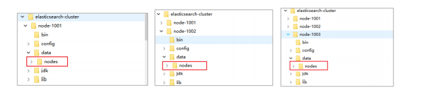
>
>2）分别双击执行 bin/elasticsearch.bat, 启动节点服务器，启动后，会自动加入指定名称的集群

### `(3)Linux 集群`


## 5、Elasticsearch 进阶

### `(1)核心概念`

>1）索引
>
>2）Type
>
>3）文档
>
>4）字段
>
>5）映射：mapping 是处理数据的方式和规则方面做一些限制，如：某个字段的数据类型、默认值、 分析器、是否被索引等等。
>
>6）分片
>
>​	**定义：**一个索引可以存储超出单个节点硬件限制的大量数据。比如，`一个具有 10 亿文档数据 的索引占据 1TB 的磁盘空间，而任一节点都可能没有这样大的磁盘空间。或者单个节点处 理搜索请求，响应太慢`。**为了解决这个问题**，Elasticsearch 提供了将索引划分成多份的能力， 每一份就称之为分片。
>
>​	当你创建一个索引的时候，你可以指定你想要的分片的数量。每个分 片本身也是一个功能完善并且独立的“索引”，这个“索引”可以被放置到集群中的任何节点 上。 
>
>​	分片很重要，主要有两方面的原因： 
>
>- 允许你水平分割 / 扩展你的内容容量。
>
>- 允许你在分片之上进行分布式的、并行的操作，进而提高性能/吞吐量。
>
>   至于一个分片怎样分布，它的文档怎样聚合和搜索请求，是完全由 Elasticsearch 管理的， 对于作为用户的你来说，这些都是透明的，无需过分关心。
>
>7）副本
>
> 复制分片之所以重要，有两个主要原因： 
>
>- 在分片/节点失败的情况下，提供了高可用性。因为这个原因，注意到复制分片从不与 原/主要（original/primary）分片置于同一节点上是非常重要的。 
>-  扩展你的搜索量/吞吐量，因为搜索可以在所有的副本上并行运行
>
>8）分配

### `(2)分布式集群`

>## 1、单节点集群
>
>​	我们在包含一个空节点的集群内创建名为 users 的索引，为了演示目的，我们将分配 3个主分片和一份副本（每个主分片拥有一个副本分片）
>
>```shell
>{
>"settings" : {
>"number_of_shards" : 3,
>"number_of_replicas" : 1
>} }
>```
>
>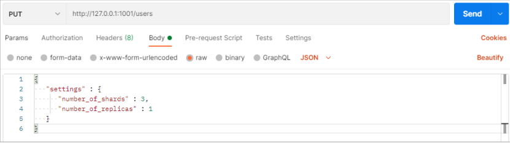
>
>我们的集群现在是拥有一个索引的单节点集群。所有 3 个主分片都被分配在 node-1 
>
>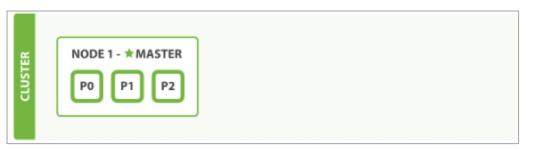
>
>通过 elasticsearch-head 插件查看集群情况
>
>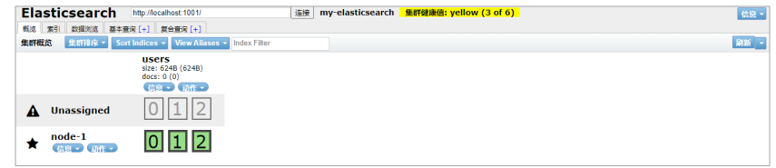
>
>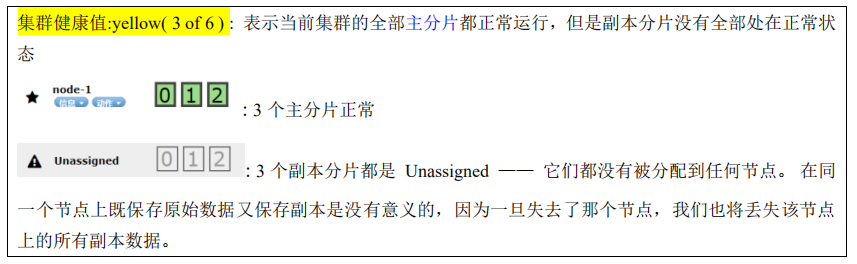
>
>当前我们的集群是正常运行的，但是在硬件故障时有丢失数据的风险。
>
>## 2、故障转移
>
>​	当集群中只有一个节点在运行时，意味着会有一个单点故障问题——没有冗余。 幸运的是，我们只需再启动一个节点即可防止数据丢失。当你在同一台机器上启动了第二个节点时，只要它和第一个节点有同样的 cluster.name 配置，它就会自动发现集群并加入到其中。但是在不同机器上启动节点的时候，为了加入到同一集群，你需要配置一个可连接到的单播主机列表。之所以配置为使用单播发现，以防止节点无意中加入集群。只有在同一台机器上运行的节点才会自动组成集群
>
>​	如果启动了第二个节点，我们的集群将会拥有两个节点的集群 : 所有主分片和副本分片都已被分配
>
>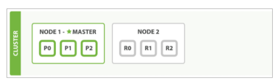
>
>通过 elasticsearch-head 插件查看集群情况
>
>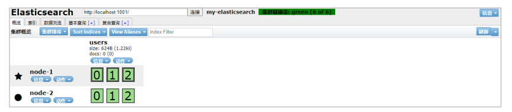
>
>
>
>## 3、水平扩容
>
>怎样为我们的正在增长中的应用程序按需扩容呢？当启动了第三个节点，我们的集群将会拥有三个节点的集群 : 为了分散负载而对分片进行重新分配。
>
>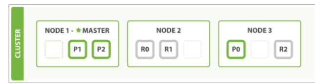
>
>通过 elasticsearch-head 插件查看集群情况
>
>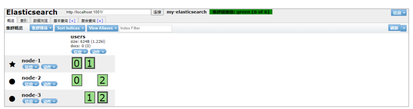
>
>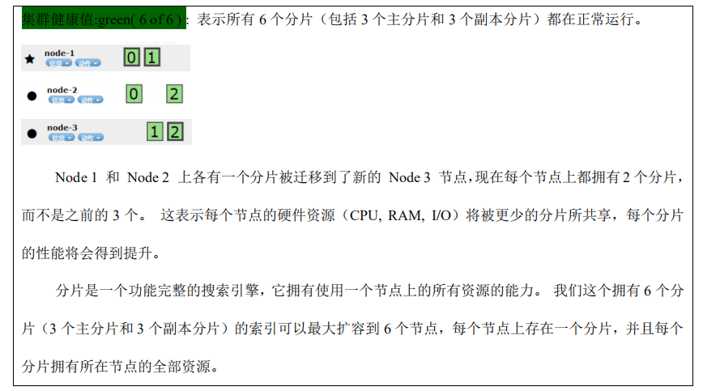
>
>## 4、应对故障
>
>当关闭主节点后，集群必须拥有一个主节点来保证正常工作，所以发生的第一件事情就是选举一个新的主节点： Node 2 。在我们关闭 Node 1 的同时也失去了主分片 1 和 2 ，并且在缺失主分片的时候索引也不能正常工作。 如果此时来检查集群的状况，我们看到的状态将会为red ：不是所有主分片都在正常工作
>
>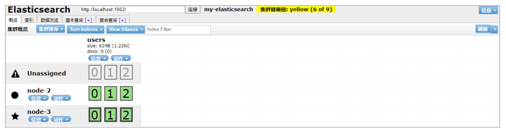
>
>幸运的是，在其它节点上存在着这两个主分片的完整副本， 所以新的主节点立即将这些分片在 Node 2 和 Node 3 上对应的副本分片提升为主分片， 此时集群的状态将会为yellow。这个提升主分片的过程是瞬间发生的，如同按下一个开关一般。
>
>

### `(3)路由计算`

>​	**当索引一个文档的时候，文档会被存储到一个主分片中。 Elasticsearch 如何知道一个**
>
>**文档应该存放到哪个分片中呢？**
>
>​	**当我们创建文档时，它如何决定这个文档应当被存储在分片1 还是分片 2 中呢？**
>
>​	首先这肯定不会是随机的，否则将来要获取文档的时候我们就不知道从何处寻找了。实际上，这个过程是根据下面这个公式决定的：
>
>
>
>routing 是一个可变值，默认是文档的 _id ，也可以设置成一个自定义的值。 routing 通过hash 函数生成一个数字，然后这个数字再除以 number_of_primary_shards （主分片的数量）后得到余数 。这个分布在 0 到 number_of_primary_shards-1 之间的余数，就是我们所寻求的文档所在分片的位置。
>
>这就解释了为什么我们`要在创建索引的时候就确定好主分片的数量 并且永远不会改变这个数量`：因为如果数量变化了，那么所有之前路由的值都会无效，文档也再也找不到了。

### `(4)分片控制`

>​	我们假设有一个集群由三个节点组成。 它包含一个叫 emps 的索引，有两个主分片，每个主分片有两个副本分片。相同分片的副本不会放在同一节点。
>
>```shell
>{
> "settings" : {
>     "number_of_shards" : 2,
>     "number_of_replicas" :2
> 	} 
> }
>```
>
>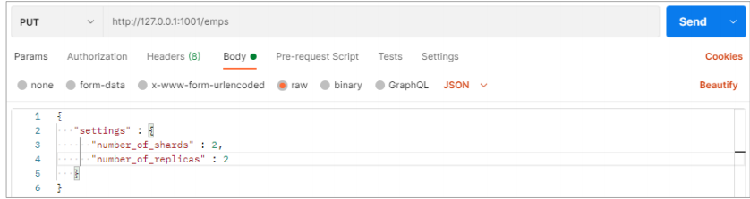
>
>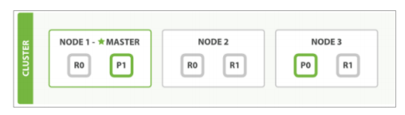
>
>通过 elasticsearch-head 插件查看集群情况，所以我们的集群是一个有三个节点和一个索引的集群。
>
>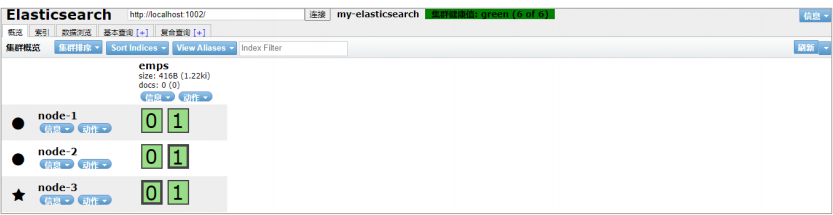
>
>**当发送请求的时候， 为了扩展负载，更好的做法是轮询集群中所有的节点**
>
>## 1、写流程
>
>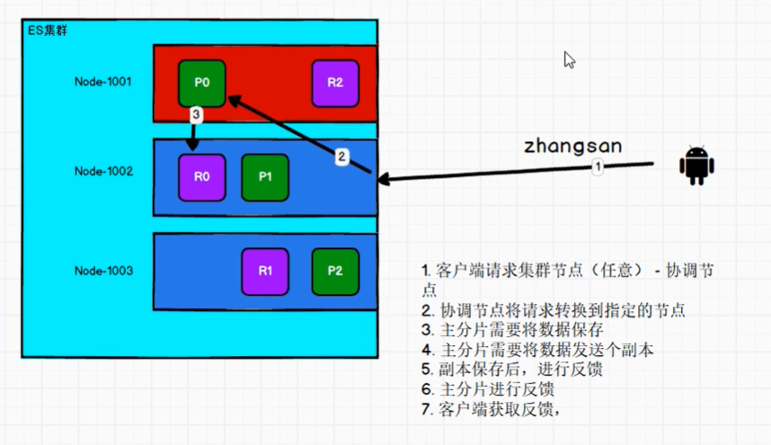
>
>## 2、读流程
>
>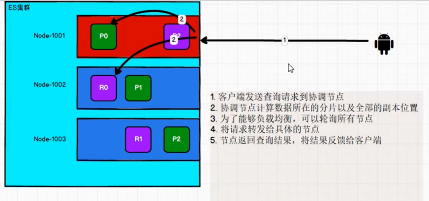
>
>
>
>

### `(5)文档搜索`


### `(6)文档处理`

>**文档冲突**
>
>​		当我们使用 index API 更新文档 ，可以一次性读取原始文档，做我们的修改，然后重新索引 整个文档 。 最近的索引请求将获胜：无论最后哪一个文档被索引，都将被唯一存储在 Elasticsearch 中。如果其他人同时更改这个文档，他们的更改将丢失。
>
>​		很多时候这是没有问题的。也许我们的主数据存储是一个关系型数据库，我们只是将数据复制到 Elasticsearch 中并使其可被搜索。 也许两个人同时更改相同的文档的几率很小。或者对于我们的业务来说偶尔丢失更改并不是很严重的问题。
>
>​		但有时丢失了一个变更就是 非常严重的 。例如：商品库存。
>
>在数据库领域中，有两种方法通常被用来确保并发更新时变更不会丢失：
>
>- **悲观并发控制**
>
>  ​         假定有变更冲突可能发生，因此阻塞访问资源以防止冲突。 一个典型的例子是读取一行数据之前先将其锁住，确保只有放置锁的线程能够对这行数据进行修改。
>
>- **乐观并发控制**
>
>  假定冲突是不可能发生的，并且不会阻塞正在尝试的操作。 然而，如果源数据在读写当中被修改，更新将会失败。应用程序接下来将决定该如何解决冲突。 例如，可以重试更新、使用新的数据、或者将相关情况报告给用户。

### `(7)算法&数据结构`

>1、索引压缩发--->压缩Key
>
>2、索引压缩发--->压缩Value


