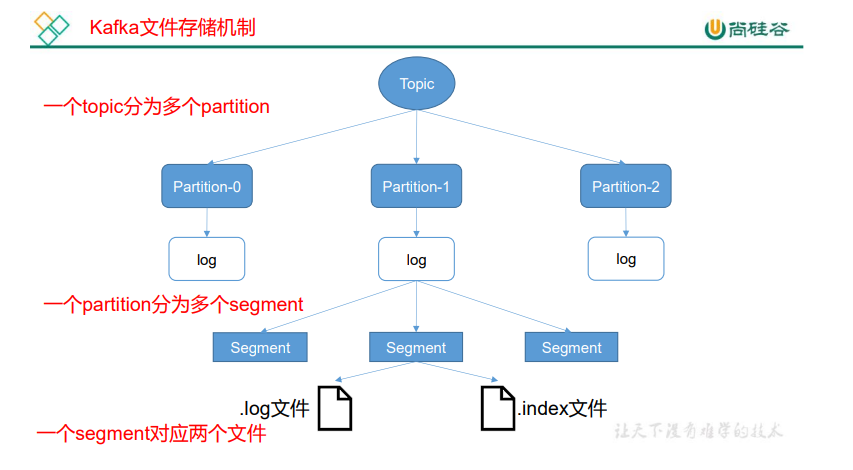
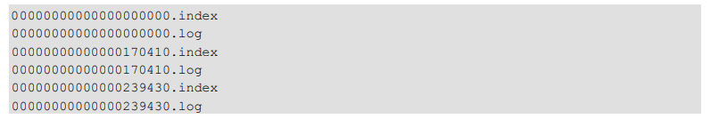
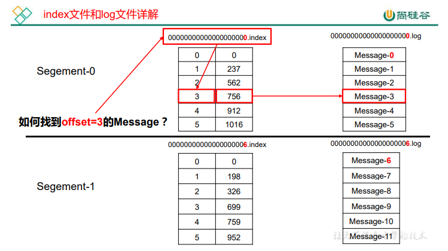
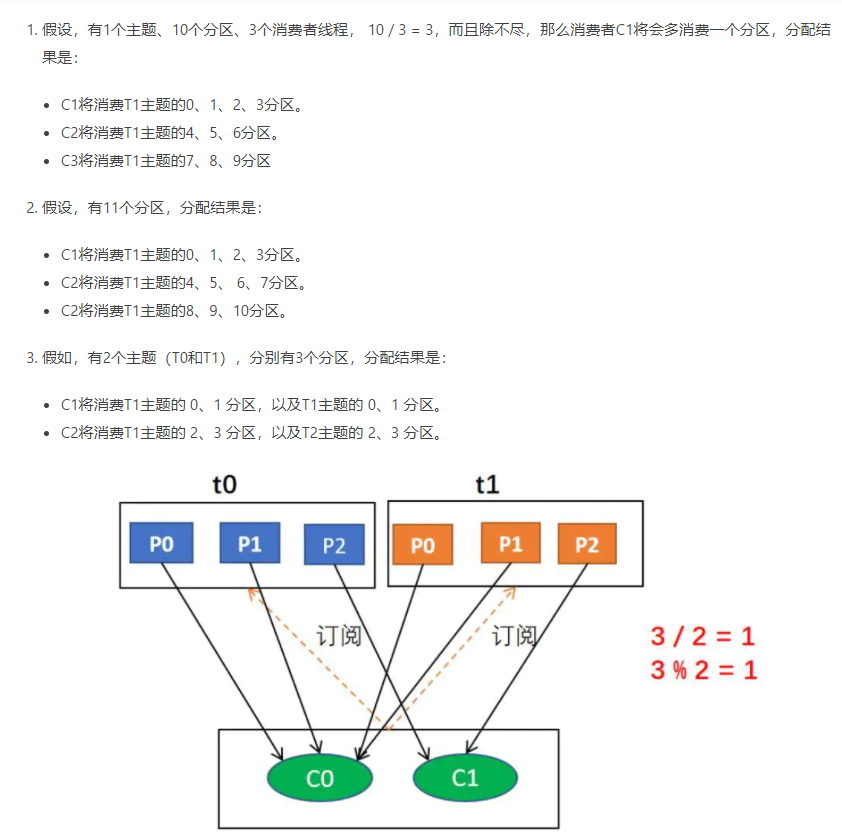
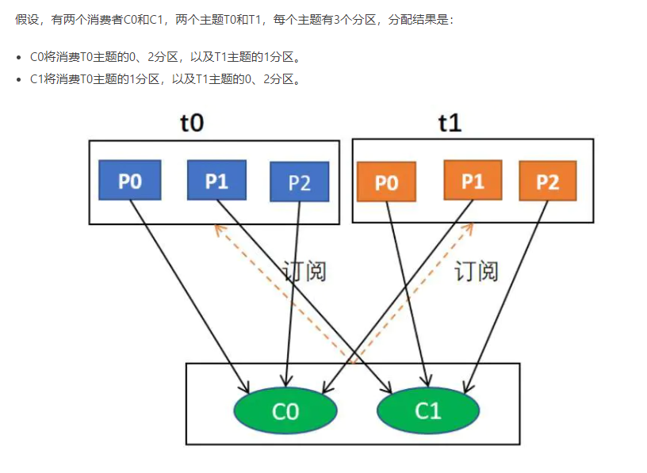
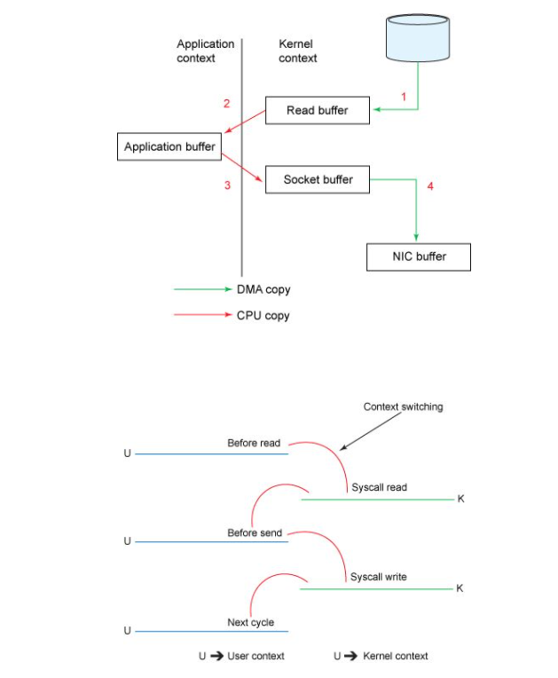
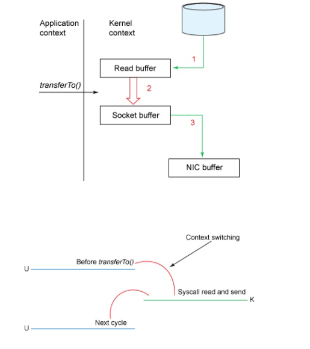
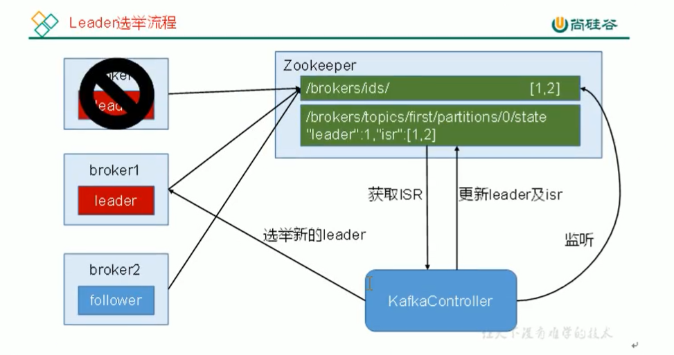
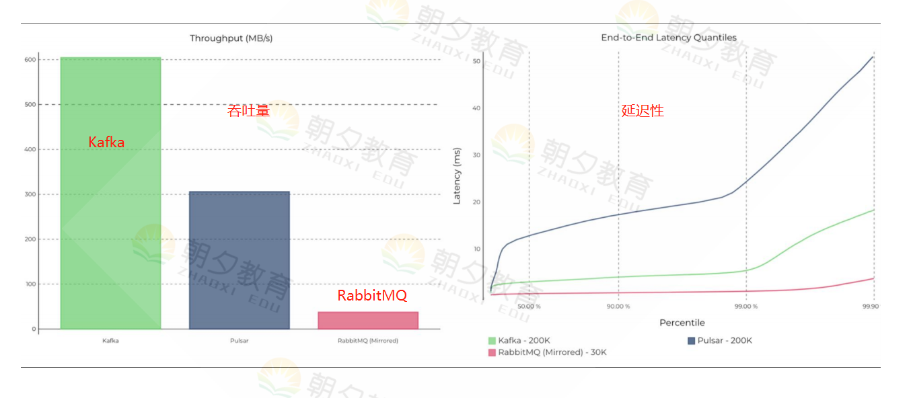

## 一、为什么要使用消息队列

* # 解耦

  

* # 接口异步处理

  

* #  削峰

  

## 二、消息队列通信的模式

* # 点对点模式

  

  定义：点对点模式通常是基于拉取或者轮询的消息传送模型 
  特点：发送到队列的消息被一个且只有一个消费者进行处理。生产者将消息放入消息队列后，由消费者主动的去拉			取消息进行消费。  
  优点：消费者拉取消息的频率可以由自己控制。 
  缺点：消息队列是否有消息需要消费，在消费者端无法感知，所以在消费者端需要额外的线程去监控。

* # 发布订阅模式

​	定义：发布订阅模式是一个基于消息送的消息传送模型，该模型可以有多种不同的订阅者。
​	特点：生产者将消息放入消息队列后，队列会将消息推送给订阅过该类消息的消费者 
​	优点：消费者端无需要额外的线程去监控是否有消息需要消费。 
​	缺点：由于机器性能（consumer1、consumer2、consumer3）不一样，所以处理消息的能力也会不一样，但消息队				列却无法感知消费者消费的速度！所以推送的速度成了发布订阅模模式的一个问题！  
​               假设三个消费者处理速度分别是8M/s、5M/s、2M/s，如果队列推送的速度为5M/s，则consumer3无法承受。        				如果队列推送的速度为2M/s，则consumer1、consumer2会出现资源的极大浪费！

## 三、Kafka基础架构及术语

（1）Producer：Producer即生产者，消息的产生者，是消息的入口。
（2）Broker：Broker是kafka实例，每个服务器上有一个或多个kafka的实例，我们姑且认为每个broker对应一台服务器。每个kafka集群内的broker都有一个不重复的编号，如图中的broker-0、broker-1等…… 
（3）Topic：消息的主题，可以理解为消息的分类，kafka的数据就保存在topic。在每个broker上都可以创建多个topic。
（4）Partition：Topic的分区，每个topic可以有多个分区，分区的作用是做负载均衡，提高kafka的吞吐量。同一个topic在不同的分区的数据是不重复的，partition的表现形式就是一个一个的文件夹！
（5）Replication:每一个分区都有多个副本，副本的作用是做备胎。当主分区（Leader）故障的时候会选择一个备胎（Follower）上位，成为Leader。在kafka中默认副本的最大数量是10个，且副本的数量不能大于Broker的数量，follower和leader绝对是在不同的机器，同一机器对同一个分区也只可能存放一个副本（包括自己）。
（6）Message：每一条发送的消息主体。
（7）Consumer：消费者，即消息的消费方，是消息的出口。
（8）Consumer Group：我们可以将多个消费组组成一个消费者组，在kafka的设计中同一个分区的数据只能被消费者组中的某一个消费者消费。同一个消费者组的消费者可以消费同一个topic的不同分区的数据，这也是为了提高kafka的吞吐量！
（9）Zookeeper：kafka集群依赖zookeeper来保存集群的的元信息，来保证系统的可用性。

## 四、Kafka原理

### 1. 工作流程

  

  

### 2. 文件存储

​        由于生产者生产的消息会不断追加到 log 文件末尾，为防止 log 文件过大导致数据定位 效率低下，Kafka 采取了分片和索引机制，将每个 partition 分为多个 segment。每个 segment 对应两个文件——“.index”文件和“.log”文件。这些文件位于一个文件夹下，该文件夹的命名 规则为：topic 名称+分区序号。例如，first 这个 topic 有三个分区，则其对应的文件夹为 first-0，first-1,first-2

​	index 和 log 文件以当前 segment 的第一条消息的 offset 命名。下图为 index 文件和 log 文件的结构示意图。

“.index”文件存储大量的索引信息，“.log”文件存储大量的数据，索引文件中的元 数据指向对应数据文件中 message 的物理偏移地址。

### 3. 分区策略（生产者）

  1）分区原因

  ​	①方便在集群中扩展，提高负载能力。因为一个topic可以有多个partition，所以我们可以通过扩展机器去轻松的应对日益增长的数据量。

  ​	②可以提高并发，以partition为读写单位，可以多个消费者同时消费数据，提高了消息的处理效率。

  2）分区的原则

  ​          我们向某个服务器发送请求的时候，服务端可能会对请求做一个负载，将流量分发到不同的服务器，那在kafka中，如果某个topic有多个partition，producer又怎么知道该将数据发往哪个partition呢？有以下原则：

  ​	　① partition在写入的时候可以指定需要写入的partition，如果有指定，则写入对应的partition。
  ​		② 如果没有指定partition，但是设置了数据的key，则会根据key的值hash出一个partition。
  　　③ 如果既没指定partition，又没有设置key，则会轮询选出一个partition。

### 4. 数据可靠性保证（生产者）

  ​		为保证producer发生的数据，能可靠的发生到指定的topic，topic的每个partition收到producer发送的数据后，都需要向producer发送ack，如果producer收到ack，就会进行下一轮发送，否则重新发送。

  

  - **副本数据同步策略**

    | 方案                        | 优点                                               | 缺点                                                |
    | :-------------------------- | :------------------------------------------------- | :-------------------------------------------------- |
    | 半数以上完成同步，就发生ack | 延迟低                                             | 选举新的leader时，容忍n台节点的故障，需要2n+1个副本 |
    | 全部完成同步，才发送ack     | 选举新的leader时，容忍n台节点的故障，需要n+1个副本 | 延迟高                                              |

    Kafka选择了第二种方案，原因如下：

    1、同样为了容忍n台节点的故障，第一种方案需要2n+1个副本，而第二种方案只需n+1个副本，而kafka的每个分区都有大量的数据，第一种方案会造成大量数据的冗余。

    2、虽然第二种方案的网络延迟会比较高，但网络延迟对Kafka的影响较小。

  - **ISR（副本同步队列）**

    采用第二种方案，会出现以下情况：

    ​	leader收到数据后，所有follower都开始同步数据，但是一个follower，因为某种故障，迟迟不能与leader进行同步，那么leader就要一直等下去，知道它完成同步，才能发送ack。

    这种情况如何解决呢？

    ​	Leader维护了一个动态的ISR，意为和leader保持同步的follower集合。当ISR中的follower完成数据的同步之后，leader就会给follower发送ack，如果follower长时间未向leader同步数据，则该follower将被踢出ISR。该时间阈值有reolica.lag.time.max.ms参数设定。Leader发生故障之后，就会从ISR中选举新Leader。

  - **ack应答机制**

    ​	对于某些不太重要的数据，对数据可靠性要求不是很高，能够容忍数据的少量丢失，所以没有必要的ISR的follower全部接受成功。

    ​	Kafka为用户提供了三种可靠性级别，用户可根据需求进行选择：
    　　0：代表producer往集群发送数据不需要等到集群的返回，不确保消息发送成功。安全性最低但是效率最高。
    　　1：代表producer往集群发送数据只要leader应答就可以发送下一条，只确保leader发送成功。
    　　all（-1）：代表producer往集群发送数据需要所有的follower都完成从leader的同步才会发送下一条，确保leader发送成功和所有的副本都完成备份。安全性最高，但是效率最低。（可能会导致数据重复，这时需要开启幂等性）

  - **故障细节处理**

    

    （1）follower故障

    ​          follower发送故障后会被临时踢出ISR，待该follower恢复后，follower会读取本地磁盘记录的上次的HW，并将log文件高于HW的部分截取调，从HW开始向Leader进行同步，等待该follower的LEO大于等于该Partition的HW，即follower追上leader之后，就可以重新加入ISR了。

    （2）leader故障

    ​	leader发生故障后，会从ISR中选出一个新的leader。之后，为保证多个副本之间的数据一致性，其余的follower会先将各自的log文件高于HW的部分截掉，然后从新的leader同步数据。

    **注意：**这只能保证副本之间的数据一致性，并不能保证数据不丢失或者不重复。

### 5. 精准一致性（生产者）

​	**至少一次（ack=all） + 幂等性 = 精准一致性**

​	要启用幂等性，只需要将producer的参数中enable.idompotence设置为true即可。

​	Kafka的幂等性实现其实就是将原来下有需要做的去重放在了数据上游。开启幂等性的produce在初始化的时候会被分配一个PID，发往同一个partition的消息会附带SeqNumber，而broker端会对<PID，Partition，SeqNumber>做缓存，当具有相同主键的消息提交时，Broker只会持久化一条

**注**：PID重启就会变化，同时不同的partition也具有不同的主键，所以幂等性无法保证跨分区跨会话的精准一致性

### 6. 消费方式（消费者）

  Consumer是采用pull（拉）模式从broker中读取数据

  - push（推）模式很难适应消费速率不同的消费者，因为消息发送速率是由broker决定的。

    目标是尽可能以最夸速度传递消息，但是这样很容易造成consumer来不及处理消息。

    典型表现就是拒绝服务以及网络拥塞。而pull模式则可以根据consumer的消费能力以适当的速率消费消息

  - pull（拉）模式不足之处是，如果kafka没有数据，消费者可能会陷入循环中，一直返回空数据。

    针对这一点，Kafka的消费者在消费数据时会传入一个时长参数timeout，如果当前没有数据可供消费，consumer会等待一段时间之后再返回，这段时长即为timeout

### 7. 分区分配策略

  消费者以消费者组的名义订阅主题，主题有多个分区，消费者组中有多个消费者实例，同一时刻，一条消息只能被消费者组中的某一个一个消费者实例消费。

  1）如果分区数大于或者等于组中的消费者实例数，一个消费者会负责多个分区。

  2）如果分区数小于组中的消费者实例数，有些消费者将处于空闲状态并且无法接收消息。

  - #### Range策略（默认分配策略）

    1）首先，将分区按数字顺序排行序，消费者按名称的字典序排序。

    2）然后，用分区总数除以消费者总数。如果能够除尽，平均分配；若除不尽，则位于排序前面的消费者将多负责一个分区。

    例如：

    

    **缺点：**

    ​	极端情况下，会出现某个消费者过载的情况，比如，一个消费者组内有2个消费者，消费者组订阅了5个topic，每个topic都只有3个分区，那么会出现第一个消费者分配了10个分区，第二个分配了5个。

  - #### RoundRobin策略

    1）首先，将所有主题的分区组成TopicAndPartition列表。

    2）然后对TopicAndPartition列表按照hashCode进行排序某个 topic。

    例如：

    

    **缺点：**

    ​	例如：

    同一消费者组中，有3个消费者C0、C1和C2，他们共订阅了 3 个主题： 
    	t0（1个分区） 
    	t1（2个分区）  
    	t2（三个分区）

    即整个消费者所订阅的所有分区可以标识为 t0p0、t1p0、t1p1、t2p0、t2p1、t2p2。 
    具体而言，消费者C0订阅的是主题t0，  
    					消费者C1订阅的是主题t0和t1， 
    					消费者C2订阅的是主题t0、t1和t2， 
    最终分区分配结果如下：

    消费者C0 ：消费 t0p0
    消费者C1 ： 消费 t1p0 
    消费者C2 ： 消费 t1p1、t2p0、t2p1、t2p2 

      从如上实例，可以看到RoundRobin策略也并不是时分完美，这样分配其实并不是最优解，因为完全可以将分区 t1p1 分配给消费者 C1。

    **说明：**

    如果想要使用RoundRobin 轮询分区策略，必须满足如下两个条件：

       ①每个消费者订阅的主题，必须是相同的

       ②每个主题的消费者实例都是相同的。

  - **何时触发分区分配策略**

     ① 同一个 consumer 消费者组 group.id 中，新增了消费者进来，会执行 Rebalance 操作

     ② 消费者离开当期所属的 consumer group组。比如 主动停机  或者  宕机

     ③ 分区数量发生变化时(即 topic 的分区数量发生变化时)

     ④ 消费者主动取消订阅

###  8. Kafka高效读写数据

  - **顺序写磁盘**

    Kafka的Produce生产数据，要落盘，写的过程是一直追加到文件末端，为顺序写。

    官网有数据表明，顺序写的能到600M/s，而随机写只有100K/s。这与磁盘的机械机构有关，顺序写之所以快，是因为其节省大量寻址时间。

  - **零复制技术**

    文件复制流程：

    

    零复制技术：

    

###  9. Zookeeper在Kafka中的作用

  Kafka集群中有一个broker会被选举为Controoler，负责管理集群broker的上下学，所有topic的分区副本工作和Leader选举等工作

  

### 10. Kafka事务

* **Producer 事务** 

  ​		为了实现跨分区跨会话的事务，需要引入一个全局唯一的 Transaction ID，并将 Producer 获得的PID 和Transaction ID 绑定。这样当Producer 重启后就可以通过正在进行的 Transaction ID 获得原来的 PID。 为了管理 Transaction，Kafka 引入了一个新的组件 Transaction Coordinator。Producer 就 是通过和 Transaction Coordinator 交互获得 Transaction ID 对应的任务状态。Transaction Coordinator 还负责将事务所有写入 Kafka 的一个内部 Topic，这样即使整个服务重启，由于 事务状态得到保存，进行中的事务状态可以得到恢复，从而继续进行。

*  **Consumer 事务**

  ​		上述事务机制主要是从 Producer 方面考虑，对于 Consumer 而言，事务的保证就会相对 较弱，尤其时无法保证 Commit 的信息被精确消费。这是由于 Consumer 可以通过 offset 访 问任意信息，而且不同的 Segment File 生命周期不同，同一事务的消息可能会出现重启后被 删除的情况。

## 五、面试题

**1、 kafka的数据写入是有顺序的吗？**

答：1）如果默认一个分区，则是有顺序 
		2）如果是多个分区，则不能保证数据的顺序，

**2、通过什么来维护ISR: 是根据心跳，还是我们备份数据量？**

答：可根据条数和时间

​	1）条数，leader和副本数据差，超过这个配置差，则就认为副本节点不行，然后从isr移除，当数据备份跟的上来，然后又纳入到我们ISR集合

​	2）多久的时间没有进行心跳。 超过配置时间，则认为不行，移除，当心跳跟的上，再重新进入集合。

由于 kafka是个高吞吐的消息队列， 发送数据的时候，有批量发送的功能，每次发数据的可以发送大量的数据（发送的数据量是可配的） 所以如果根据条数，则副本节点，会经常性的从ISR移除和增加。 因为这种考虑，kafka的开发者，选择使用了第二种，根据时间来判断。

**3、副本和leader就是两份一模一样的数据，消费后，两份数据都清空嘛，什么时候清空**

答：保留7天，kafka可以配置。默认7天，消息积压有处理。

**4、kafka与RabbitMQ的比较**

RabbitMQ：1s中的吞吐量约是36M，轻量级											

Kafka：1s中的吞吐量约是610M，重量级

kafka适合数据量大的场景，rabbitmq适合可靠，对速度要求不高的场景

