# 分布式链路追踪

## 一、APM系统

### 1. APM系统概述

​		APM (Application Performance Management) 即应用性能管理系统，是对企业系统即时监控以实现对应用程序性能管理和故障管理的系统化的解决方案。应用性能管理，主要指对企业的关键业务应用进行监测、优化，提高企业应用的可靠性和质量，保证用户得到良好的服务，降低IT总拥有成本。


​		**APM系统是可以帮助理解系统行为、用于分析性能问题的工具，以便发生故障的时候，能够快速定位和解决问题。**


### 2. 分布式链路追踪

​		随着分布式系统和微服务架构的出现，一次用户的请求会经过多个系统，不同服务之间的调用关系十分复杂，任何一个系统出错都可能影响整个请求的处理结果。以往的监控系统往往只能知道单个系统的健康状况、一次请求的成功失败，无法快速定位失败的根本原因。

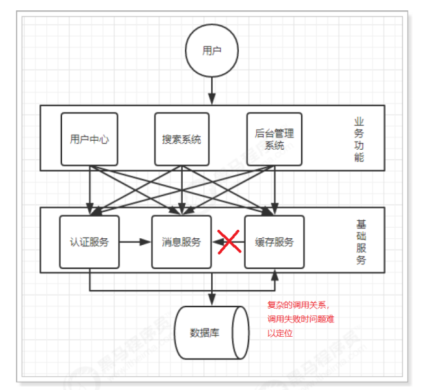


除此之外，复杂的分布式系统也面临这下面这些问题：

- **性能分析**：一个服务依赖很多服务，被依赖的服务也依赖了其他服务。如果某个接口耗时突然变长了，那未必是直接调用的下游服务慢了，也可能是下游的下游慢了造成的，如何快速定位耗时变长的根本原因呢？

- **链路梳理**：需求迭代很快，系统之间调用关系变化频繁，靠人工很难梳理清楚系统链路拓扑(系统之间的调用关系)。

### 3. OpenTrancing

**（1）概述**

​		为了解决这些问题，Google推出了一个分布式链路跟踪系统Dapper ，之后各个互联网公司都参照Dapper的思想推出了自己的分布式链路跟踪系统，而这些系统就是分布式系统下的APM系统分布式链路跟踪最先由Google在Dapper论文中提出，而OpenTracing通过提供平台无关、厂商无关的API，使得开发人员能够方便的添加（或更换）追踪系统的实现。


下图是一个分布式调用的例子，客户端发起请求，请求首先到达负载均衡器，接着经过认证服务，订单服务，然后请求资源，最后返回结果。

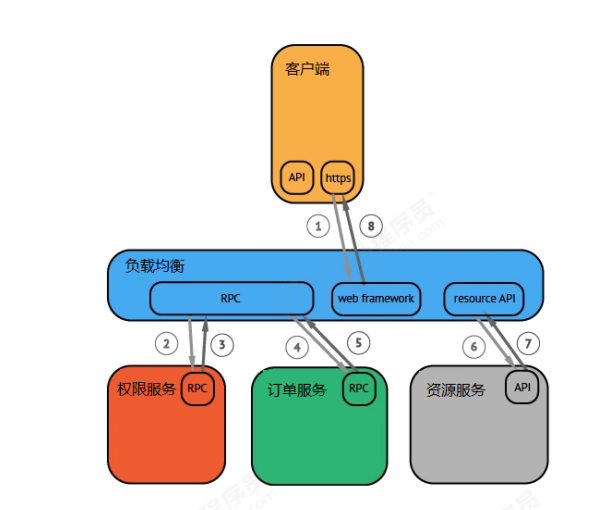


​		虽然这种图对于看清各组件的组合关系是很有用的，但是存在下面两个问题：

它不能很好显示组件的调用时间，是串行调用还是并行调用，如果展现更复杂的调用关系，会更加复杂，甚至无法画出这样的图。这种图也无法显示调用间的时间间隔以及是否通过定时调用来启动调用。


一种更有效的展现一个调用过程的图：

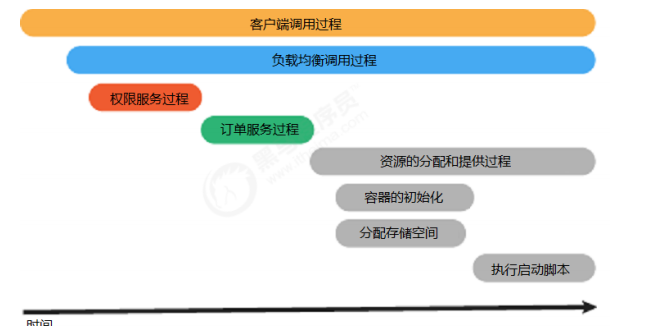

**（2）Trace**

​	客户端发起的一次请求，就可以认为是一个Trace

**（3）Span**

一个Span代表系统中具有开始时间和执行时长的逻辑运行单元。span之间通过嵌套或者顺序排列建立逻辑因果关系。Span里面的信息包括：操作的名字，开始时间和结束时间，可以附带多个 key:value 构成的 Tags(key必须是String，value可以是 String, bool 或者数字)，还可以附带 Logs 信息(不一定所有的实现都支持)也是 key:value形式。


下面例子是一个 Trace，里面有8个 Span：

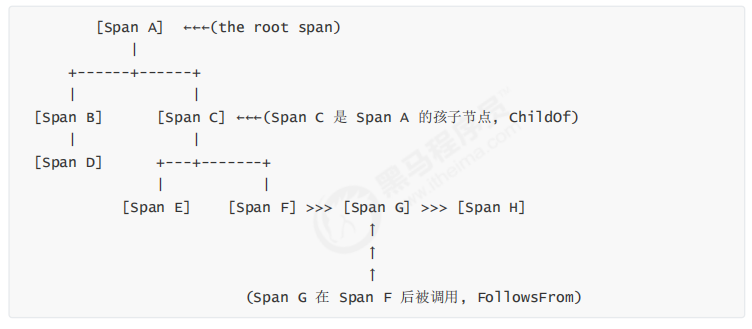

​		一个span可以和一个或者多个span间存在因果关系。OpenTracing定义了两种关系： ChildOf 和 FollowsFrom 。**这两种引用类型代表了子节点和父节点间的直接因果关系**。未来，OpenTracing将支持非因果关系的span引用关系。（例如：多个span被批量处理，span在同一个队列中，等等）


​		**ChildOf **很好理解，就是父亲 Span 依赖另一个孩子 Span。比如函数调用，被调者是调用者的孩子，比如说 RPC 调用，服务端那边的Span，就是 ChildOf 客户端的。很多并发的调用，然后将结果聚合起来的操作，就构成了 ChildOf 关系。如果父亲 Span 并不依赖于孩子 Span 的返回结果，这时可以说它他构成 **FollowsFrom** 关系


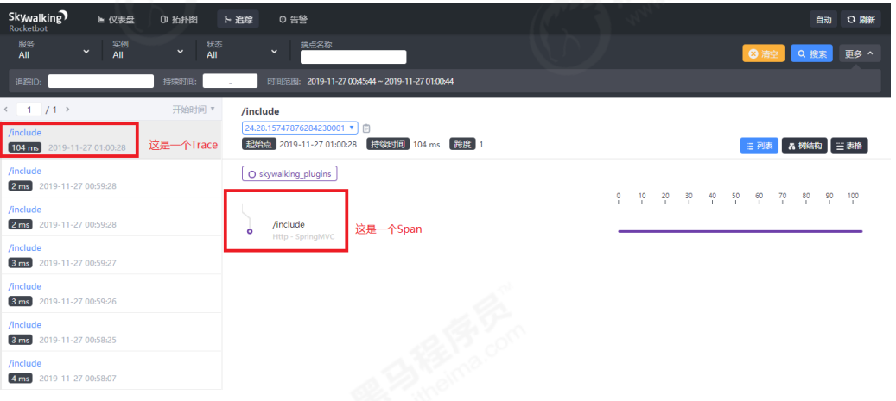

如图所示，左边的每一条追踪代表一个Trace，而右边时序图中每一个节点就是一个Span


**（4）Logs**

​		每个span可以进行多次**Logs**操作，每一次**Logs**操作，都需要一个带时间戳的时间名称，以及可选的任意大小的存储结构。

如下图是一个异常的Log： 

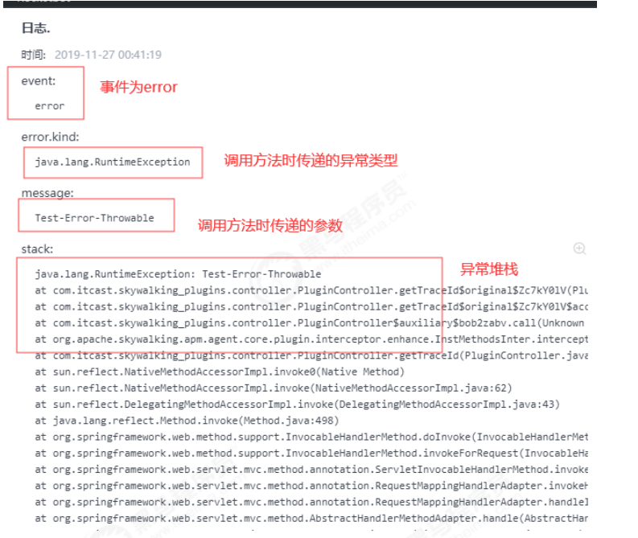


如下图是两个正常信息的Log，它们都带有时间戳和对应的事件名称、消息内容。


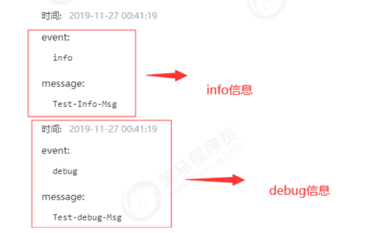


**（5）Tags**

​		每个span可以有多个键值对（key:value）形式的**Tags**，**Tags**是没有时间戳的，支持简单的对span进行注解和补充。

如下图就是一个Tags的详细信息，其中记录了数据库访问的SQL语句等内容。

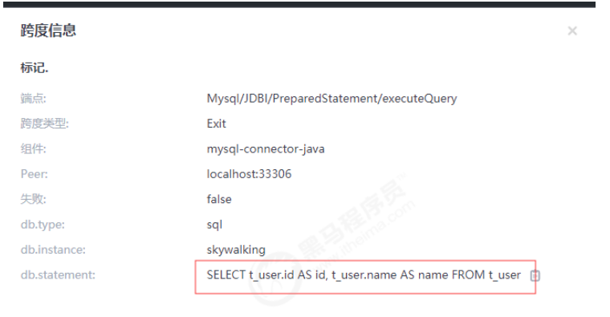


### 4. 主流的开源APM产品

- SkyWalking

​		SkyWalking是apache基金会下面的一个开源APM项目，为微服务架构和云原生架构系统设计。它通过探针自动收集所需的指标，并进行分布式追踪。通过这些调用链路以及指标，Skywalking APM会感知应用间关系和服务间关系，并进行相应的指标统计。Skywalking支持链路追踪和监控应用组件基本涵盖主流框架和容器。

官方网站：http://skywalking.apache.org/

- ZipKin

​		Zipkin是由Twitter开源，是分布式链路调用监控系统，聚合各业务系统调用延迟数据，达到链路调用监控跟踪。Zipkin基于Google的Dapper论文实现，主要完成数据的收集、存储、搜索与界面展示。

官方网站：https://zipkin.io/

- 其他
  - 阿里巴巴鹰眼(EagleEye)
  - 美团CAT
  - 京东Hydra
  - Pinpoint(APM)

## 二、SkyWalking

### 1. 概述

​		根据官方的解释，Skywalking是一个可观测性分析平台（Observability Analysis Platform简称OAP）和应用性能管理系统（Application Performance Management简称APM）。

​		提供分布式链路追踪、服务网格(Service Mesh)遥测分析、度量(Metric)聚合和可视化一体化解决方案。

下面是Skywalking的几大特点：

- 多语言自动探针，Java，.NET Core和Node.JS。
- 多种监控手段，语言探针和service mesh。
- 轻量高效。不需要额外搭建大数据平台。
- 模块化架构。UI、存储、集群管理多种机制可选。
- 支持告警。
- 优秀的可视化效果。

### 2. 优势

Skywalking相比较其他的分布式链路监控工具，具有以下特点：

- 社区相当活跃
- Skywalking支持Java，.NET Core和Node.JS语言。相对于其他平台：比如Pinpoint支持Java和PHP,具有较大的优势。
- 探针无倾入性。不修改原有项目一行代码就可以进行集成。
- 探针性能优秀。有网友对Pinpoint和Skywalking进行过测试，由于Pinpoint收集的数据过多，所以对性能损耗较大，而Skywalking探针性能十分出色。
- 支持组件较多。特别是对Rpc框架的支持，这是其他框架所不具备的。Skywalking对Dubbo、gRpc等有原生的支持，甚至连小众的motan和sofarpc都支持。

### 3. 整体架构

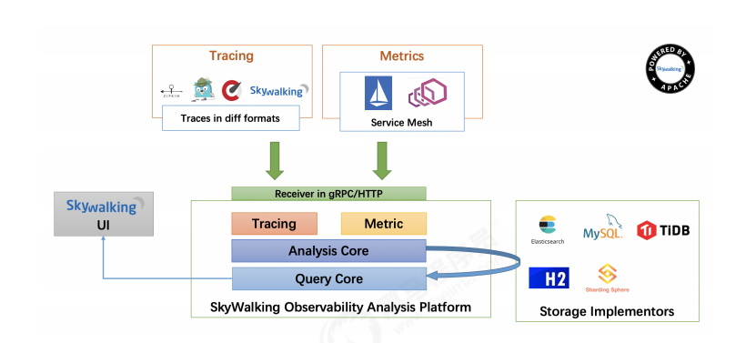

整体架构包含如下三个组成部分：

- **探针**(agent)：负责进行数据的收集，包含了Tracing和Metrics的数据，agent会被安装到服务所在的服务器上，以方便数据的获取。
-  **可观测性分析平台OAP**(Observability Analysis Platform)：接收探针发送的数据，并在内存中使用分析引擎（Analysis Core)进行数据的整合运算，然后将数据存储到对应的存储介质上，比如Elasticsearch、MySQL数据库、H2数据库等。同时OAP还使用查询引擎(Query Core)提供HTTP查询接口。
- **UI**： Skywalking提供单独的UI进行数据的查看，此时UI会调用OAP提供的接口，获取对应的数据然后进行展示。

### 4. 跟踪、记录和度量

​		微服务领域很早因为追踪、日志和指标相辅相成，合力支持多维度、多形态的监控体系，三类监控各有各的类型：

- **跟踪：**它在单次请求的范围内，处理信息。任何的数据、元数据都被绑定到系统中的信息的各个事务上。例如：一次调用远程服务的RPC执行过程；一次实际的SQL查询语句；一次HTTP请求的业务性ID；
- **日志记录：**不知道大家有没有监控信息等的定义或记录。等等这类数据记录的事件，大部分情况下记录的数据很可能是错误信息，或者是记录当前的情况，或者是当前的情况的警告信息。
- **Metrics：**我们想知道 QPS 是多少服务，或者当日的用户登录次数等等，我们可能需要将某个事件进行聚合或计数，也就是说的 Metrics。特征，它们是服务内的例子（请求或者直方图）或者是元。简单的加法聚合，当持续一段时间我们又可以为直方图建模。

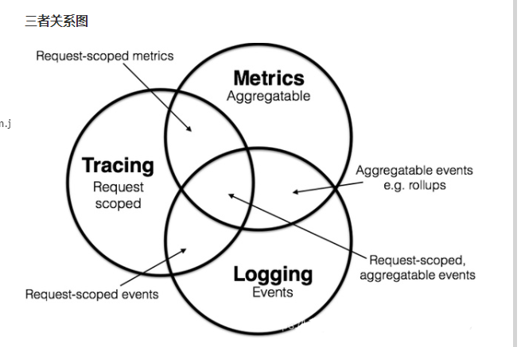

### 5. 环境搭建

skywalking/docker-compose.yml

```yaml
version: '3.3'
services:
  elasticsearch:
    image: docker.elastic.co/elasticsearch/elasticsearch:7.5.0
    container_name: elasticsearch
    restart: always
    ports:
      - 9200:9200
    environment:
      - discovery.type=single-node
      - bootstrap.memory_lock=true
      - "ES_JAVA_OPTS=-Xms256m -Xmx256m"
    ulimits:
      memlock:
        soft: -1
        hard: -1
  oap:
    image: apache/skywalking-oap-server:8.8.0
    container_name: oap
    depends_on:
      - elasticsearch
    links:
      - elasticsearch
    restart: always
    ports:
      - 11800:11800
      - 12800:12800
    environment:
      SW_STORAGE: elasticsearch
      SW_STORAGE_ES_CLUSTER_NODES: elasticsearch:9200
  ui:
    image: apache/skywalking-ui
    container_name: ui
    depends_on:
      - oap
    links:
      - oap
    restart: always
    ports:
      - 8080:8080
    environment:
      SW_OAP_ADDRESS: http://oap:12800
```

检查是否部署成功

Skywallking：http://192.168.200.104:8080/

ES：http://192.168.200.104:9200/

### 6. Skywalking UI的使用

**（1）仪表盘**

打开RocketBot默认会出现仪表盘页面：

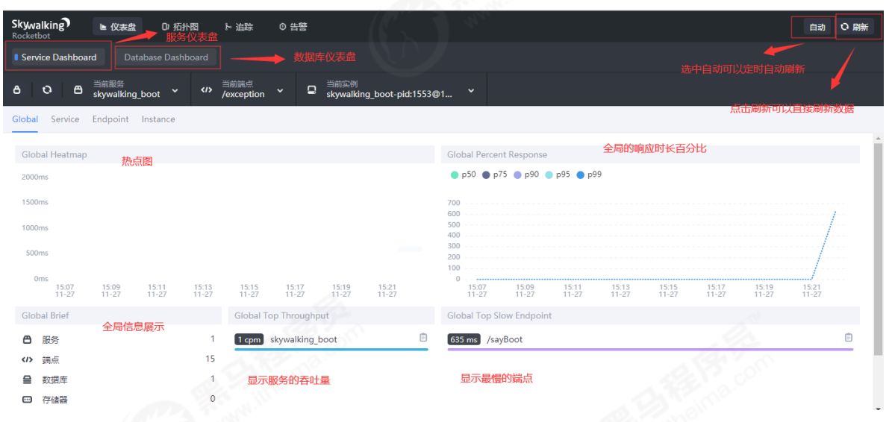

仪表盘页面分为两大块：

- 服务仪表盘，展示服务的调用情况
- 数据库仪表盘，展示数据库的响应时间等数据

选中服务仪表盘，有四个维度的统计数据可以进行查看：

- 全局，查看全局接口的调用，包括全局响应时长的百分比，最慢的端点，服务的吞吐量等
- 服务，显示服务的响应时长、SLA、吞吐量等信息
- 端点，显示端点的响应时长、SLA、吞吐量等信息

实例，显示实例的响应时长、SLA、吞吐量等信息，还可以查看实例的JVM的GC信息、CPU信息、内存信息

**（2）拓扑图**

Skywalking提供拓扑图，直观的查看服务之间的调用关系：

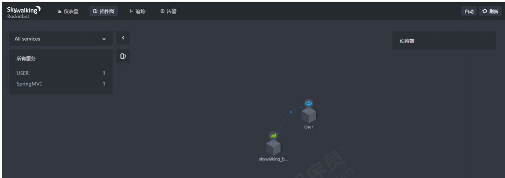


图中Skywalking_boot应用被User调用，同时显示它是一个Spring MVC的应用。后续案例中会出现多个应用调用，使用拓扑图就能清楚的分析其调用关系了。

**（3）追踪**

在Skywalking中，每一次用户发起一条请求，就可以视为一条追踪数据，每条追踪数据携带有一个ID值。追踪数据在追踪页面中可以进行查询：

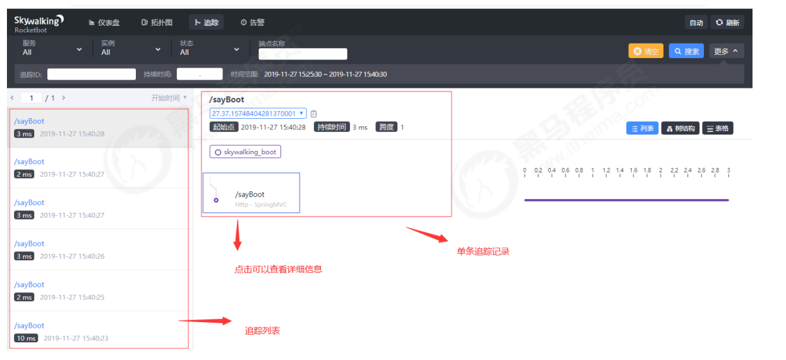


左侧是追踪列表，也可以通过上方的追踪ID来进行查询。点击追踪列表某一条记录之后，右侧会显示出此条追踪的详细信息。有三种显示效果：

- 列表
- 树结构
- 表格

可以很好的展现此条追踪的调用链情况而链路上每个节点，可以通过左键点击节点查看详细信息：

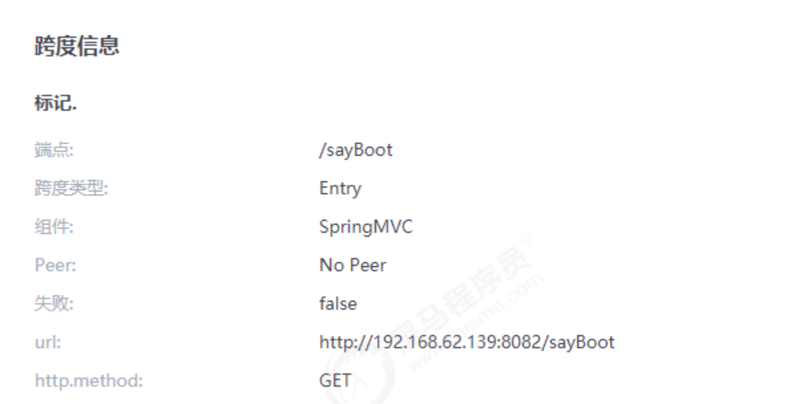

**（4）告警**

​		Skywalking中的告警功能相对比较简单，在达到告警阈值之后会生成一条告警记录，在告警页面上进行展示。后面会有独立的章节介绍告警功能如何使用，本节中暂不详细介绍。

### 7. 对接单个.Net程序

（1）添加依赖

```C#
<ItemGroup>
    <PackageReference Include="SkyAPM.Agent.AspNetCore" Version="1.3.0" />
</ItemGroup>
```

（2）配置文件`skyapm.json`

```json
{
  "SkyWalking": {
    "ServiceName": "SkyWalking_Order",//服务名称，必须与环境变量保持一致
    "Namespace": "",
    "HeaderVersions": [
      "sw8"
    ],
    "Sampling": {	//采样配置节点
      "SamplePer3Secs": -1,		//每3秒采样数
      "Percentage": -1.0		// 采样百分比，例如10%采样则配置为10
    },
    "Logging": {	//日志配置节点
      "Level": "Information",	//日志级别
      "FilePath": "logs\\skyapm-{Date}.log"	//日志保存路径
    },
    "Transport": {	//传输配置节点
      "Interval": 3000,			//每多少毫秒刷新
      "ProtocolVersion": "v8",	
      "QueueSize": 30000,
      "BatchSize": 3000,
      "gRPC": {			gRPC配置节点
        "Servers": "192.168.200.104:11800", //Skywalking服务地址，生产环境替需替换成生产skyapm发布后的地址，多个用逗号“,”
        "Timeout": 10000,	//创建gRPC链接的超时时间，毫秒
        "ConnectTimeout": 10000,	//gRPC最长链接时间，毫秒
        "ReportTimeout": 600000,
        "Authentication": ""
      }
    }
  }
}
```

说明：

如何生成skyapm.json文件

- 安装CLI（SkyAPM.DotNet.CLI）

```shell
 dotnet tool install -g SkyAPM.DotNet.CLI
```

- 自动生成skyapm.json文件

```shell
dotnet skyapm config [service name] [server]:11800
 eg: dotnet skyapm config MySkyWalking_OrderService 192.168.3.245:11800
```

server name指的就是您刚才配置的SKYWALKING__SERVICENAME

server指的是您Skywalking的ip地址。

执行命令后，会自动生成一个skywalking.json 。


（3）在`launchSettings.json`添加环境变量

```json
"profiles": { // 项目
    "IIS Express": { // IIS部署项
      "commandName": "IISExpress",
      "launchBrowser": true,
      "launchUrl": "weatherforecast",
      "environmentVariables": {
        "ASPNETCORE_ENVIRONMENT": "Development",
        "ASPNETCORE_HOSTINGSTARTUPASSEMBLIES": "SkyAPM.Agent.AspNetCore",
        "SKYWALKING__SERVICENAME": "SkyWalking_Order"
      }
    },
    "SkyWalkingDemo": { // Kestrel部署项
      "commandName": "Project",
      "launchBrowser": true,
      "launchUrl": "weatherforecast",
      "applicationUrl": "http://localhost:5000",
      "environmentVariables": {
        "ASPNETCORE_ENVIRONMENT": "Development",
        "ASPNETCORE_HOSTINGSTARTUPASSEMBLIES": "SkyAPM.Agent.AspNetCore", // 必须配置
        "SKYWALKING__SERVICENAME": "SkyWalking_Order" // 必须配置，在skywalking做标识
      }
    }
  }
```

（4） 添加Skywalking相关配置

```
services.AddSkyApmExtensions(); // 添加Skywalking相关配置
```

（5）发起请求，即可查看链路信息（有延迟）

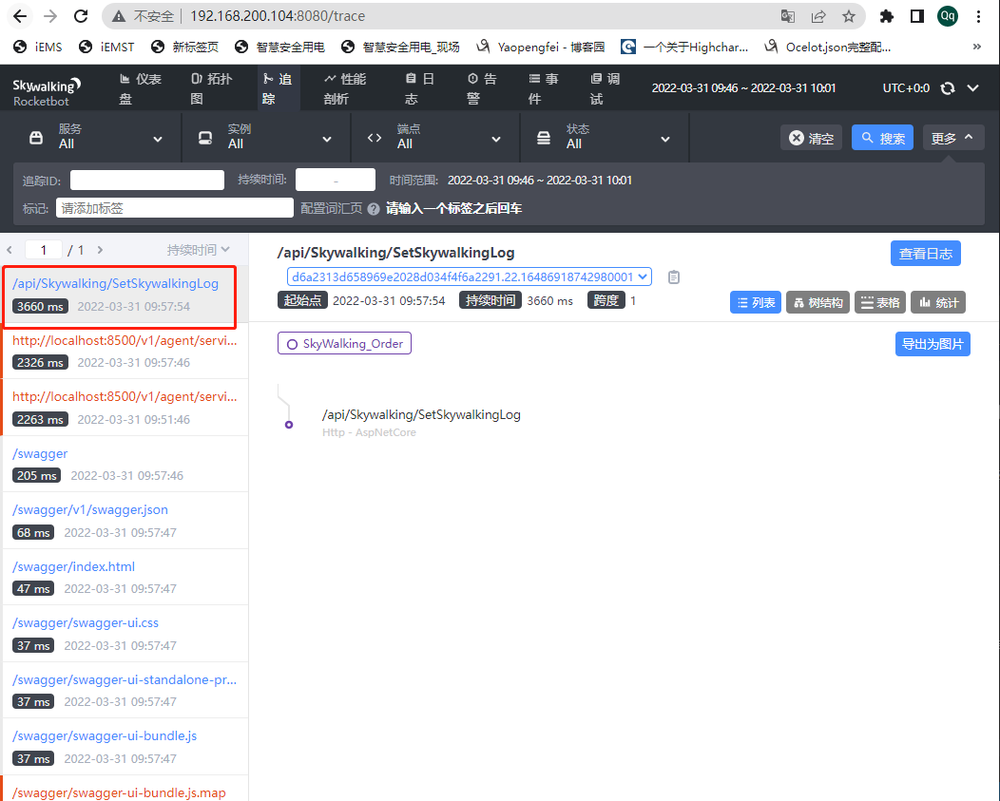

### 8. 对接微服务网关+后台微服务

（1）网关/后台微服务（UserService、OrderService），添加依赖（同上）

​		说明：公共依赖可以添加到公共类中，方便以后统一修改

（2）追加配置文件`skyapm.json`（同上）

（3）在`launchSettings.json`添加环境变量（同上）

（4）根据服务配置网关

（5）发起请求

链路追踪如下图所示：

网关->OrderService->UserService

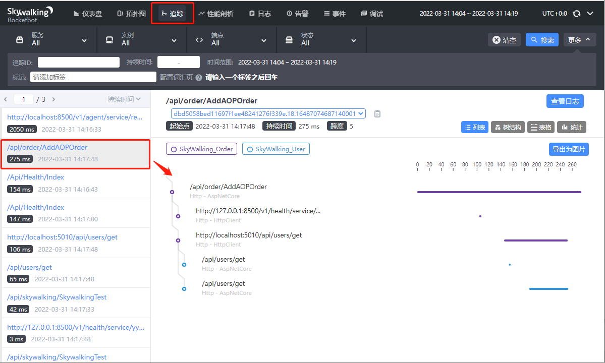

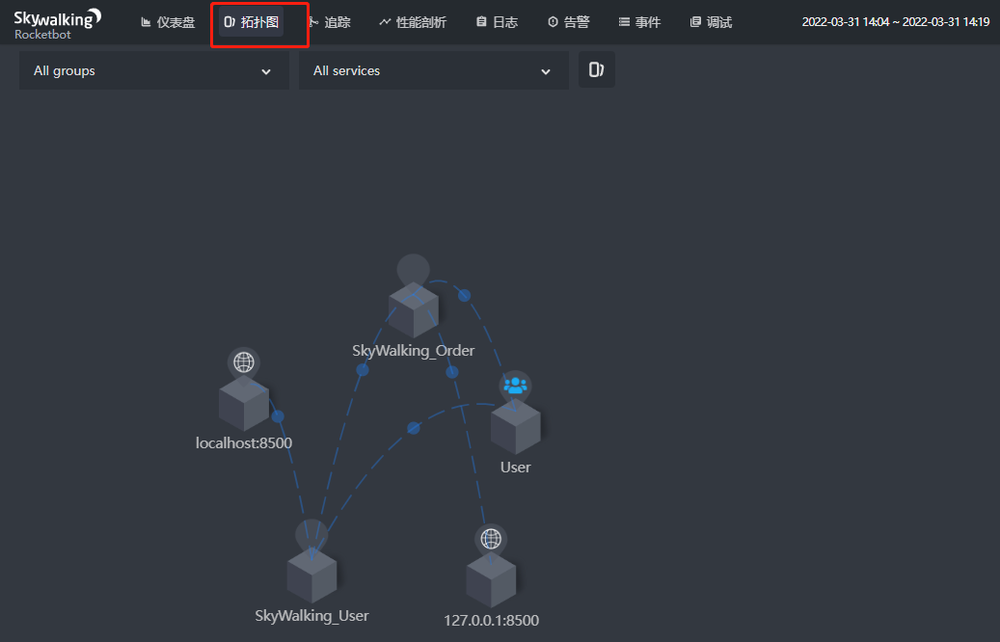


### 9. 配置Swalking告警

**（1）告警功能简介**

Skywalking每隔一段时间根据收集到的链路追踪的数据和配置的告警规则（如服务响应时间、服务响应时间百分比）等，判断如果达到阈值则发送相应的告警信息。发送告警信息是通过调用webhook接口完成，具体的webhook接口可以使用者自行定义，从而开发者可以在指定的webhook接口中编写各种告警方式，比如邮件、短信等。告警的信息也可以在RocketBot中查看到。

**（2）查阅配置规则文件及配置规则解读**

**以下是默认的告警规则配置，位于skywalking安装目录下的confifig文件夹下 alarm-settings.yml 文件中：**

```yaml

rules:
  # Rule unique name, must be ended with `_rule`.
  service_resp_time_rule:
    metrics-name: service_resp_time
    op: ">"
    threshold: 1000
    period: 10
    count: 3
    silence-period: 5
    message: Response time of service {name} is more than 1000ms in 3 minutes of last 10 minutes.
  service_sla_rule:
    # Metrics value need to be long, double or int
    metrics-name: service_sla
    op: "<"
    threshold: 8000
    # The length of time to evaluate the metrics
    period: 10
    # How many times after the metrics match the condition, will trigger alarm
    count: 2
    # How many times of checks, the alarm keeps silence after alarm triggered, default as same as period.
    silence-period: 3
    message: Successful rate of service {name} is lower than 80% in 2 minutes of last 10 minutes
  service_resp_time_percentile_rule:
    # Metrics value need to be long, double or int
    metrics-name: service_percentile
    op: ">"
    threshold: 1000,1000,1000,1000,1000
    period: 10
    count: 3
    silence-period: 5
    message: Percentile response time of service {name} alarm in 3 minutes of last 10 minutes, due to more than one condition of p50 > 1000, p75 > 1000, p90 > 1000, p95 > 1000, p99 > 1000
  service_instance_resp_time_rule:
    metrics-name: service_instance_resp_time
    op: ">"
    threshold: 1000
    period: 10
    count: 2
    silence-period: 5
    message: Response time of service instance {name} is more than 1000ms in 2 minutes of last 10 minutes
  database_access_resp_time_rule:
    metrics-name: database_access_resp_time
    threshold: 1000
    op: ">"
    period: 10
    count: 2
    message: Response time of database access {name} is more than 1000ms in 2 minutes of last 10 minutes
  endpoint_relation_resp_time_rule:
    metrics-name: endpoint_relation_resp_time
    threshold: 1000
    op: ">"
    period: 10
    count: 2
    message: Response time of endpoint relation {name} is more than 1000ms in 2 minutes of last 10 minutes
#  Active endpoint related metrics alarm will cost more memory than service and service instance metrics alarm.
#  Because the number of endpoint is much more than service and instance.
#
#  endpoint_avg_rule:
#    metrics-name: endpoint_avg
#    op: ">"
#    threshold: 1000
#    period: 10
#    count: 2
#    silence-period: 5
#    message: Response time of endpoint {name} is more than 1000ms in 2 minutes of last 10 minutes

webhooks:
#  - http://127.0.0.1/notify/
#  - http://127.0.0.1/go-wechat/

```


以上文件定义了默认的4种规则：

- 最近3分钟内服务的平均响应时间超过1秒 
-  最近2分钟服务成功率低于80%
-  最近3分钟90%服务响应时间超过1秒 
-  最近2分钟内服务实例的平均响应时间超过1秒

规则中的参数属性如下：

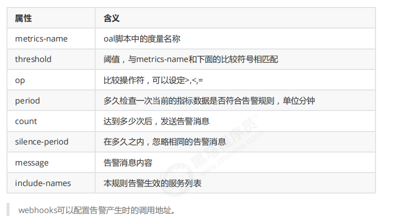


（3）告警功能测试

​	a. 进入docker容器

```
docker exec -it dockerID /bin/sh
```

  b. 修改告警规则

```
vim /skywalking/config/alarm-settings.yml
```

服务成功率在过去2分钟内低于80%就报警

```yaml
rules:
	service_test_sal_rule:
		# 指定指标名称
    	metrics-name: service_test_sal
    	# 小于
    	op: "<"
    	# 指定阈值
    	threshold: 8000
    	# 每2分钟检测告警该规则
    	period: 2
    	# 触发1次规则就告警
    	count: 1
    	# 设置三分钟内容相同告警，不重复告警
    	silence-period: 3
    	# 配置告警信息
    	message: Successful rate of service {name} is lower than 80% in 2 minutes of last 10 minutes
#  Active endpoint related metrics alarm will cost more memory than service and service instance metrics alarm.
#  Because the number of endpoint is much more than service and instance.
#
#  endpoint_avg_rule:
#    metrics-name: endpoint_avg
#    op: ">"
#    threshold: 1000
#    period: 10
#    count: 2
#    silence-period: 5
#    message: Response time of endpoint {name} is more than 1000ms in 2 minutes of last 10 minutes

webhooks:
  - http://172.17.6.196:5030/api/alarm/alarmmsg  
```

c. 追加告警类

```C#
    /// <summary>
    /// Skywalking告警数据模型
    /// </summary>
    public class AlarmMsg
    {
        public int scopeId { get; set; }
        public string? scope { get; set; }
        public string? name { get; set; }
        public string? id0 { get; set; }
        public string? id1 { get; set; }
        public string? ruleName { get; set; }
        public string? alarmMessage { get; set; }
    }
```

d. 告警信息如下：

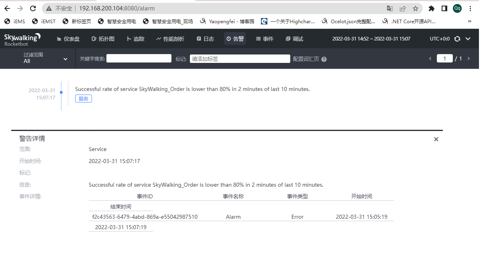


## 三、Zipkin

### 1. 简介

​	Zipkin 是一个开放源代码分布式的跟踪系统，每个服务向zipkin报告计时数据，zipkin会根据调用关系通过Zipkin UI生成依赖关系图。Zipkin提供了可插拔数据存储方式：In-Memory、MySql、Cassandra以及Elasticsearch。为了方便在开发环境我直接采用了In-Memory方式进行存储，生产数据量大的情况则推荐使用Elasticsearch。

### 2. 整体架构

​		Zipkin是由Twitter开源的一款基于Java语言开发的分布式实时数据追踪系统(Distributed Tracking System),其主要功能是采集来自各个系统的实时监控数据。该系统让开发者可通过一个 Web 前端轻松的收集和分析数据，例如用户每次请求服务的处理时间等，可方便的监测系统中存在的瓶颈。它大致可以分为三个核心概念：

- **上报端**：它主要通过代码的形式集成到程序中，用于上报Trace数据到Collector端。
- **Collector**：负责接收客户端发送过来的数据，保存到内存或外部存储系统中，供UI展示。
- **存储端**：可以是基于zipkin内存完全不依赖外部存储的In-Memory形式或依赖外部存储系统的形式，一般采用外部存储系统存储链路数据，毕竟内存有限。它可支持的存储数据库有MySQL、Cassandra、Elasticsearch。
- **UI**：负责展示采集的链路数据，及系统之间的依赖关系。

架构图如下：

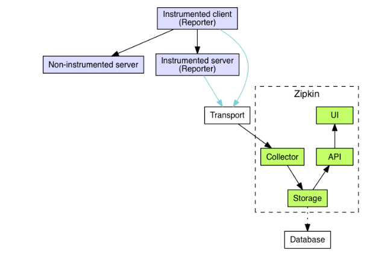

### 3. 基本概念

在学习链路跟踪的过程中会设计到相关概念，我们接下来介绍链路跟踪几个相关的概念

- **TranceId**：一般一次全局的请求会有一个唯一的TraceId，用于代表一次唯一的请求。比如我请求了订单管理系统，而订单管理系统内部还调用了商品管理系统，而商品管理系统还调用了缓存系统或数据库系统。但是对全局或外部来说这是一次请求，所以会有唯一的一个TraceId。
- **SpanId**：虽然全局的来说是一次大的请求，但是在这个链路中内部间还会发起别的请求，这种内部间的每次请求会生成一个SpanId。

​	如果将整条链路串联起来的话，我们需要记录全局的TraceId，代表当前节点的SpanId和发起对当前节点调用的的父级ParentId。

然后基于链路跟踪的核心概念，然后介绍一下Zipkin衍生出来了几个相关概念：

- **cs**：Clent Sent 客户端发起请求的时间，比如 dubbo 调用端开始执行远程调用之前。
- **cr**：Client Receive 客户端收到处理完请求的时间。
- **ss**：Server Receive 服务端处理完逻辑的时间。
- **sr**：Server Receive 服务端收到调用端请求的时间。

```
sr - cs = 请求在网络上的耗时
ss - sr = 服务端处理请求的耗时
cr - ss = 回应在网络上的耗时
cr - cs = 一次调用的整体耗时
```


### 4. 环境搭建

docker-compose.yml

```yml
version: "3.6"
services:
  elasticsearch:
    # 我使用的是7.5.0版本
    image: elasticsearch:7.5.0
    container_name: elasticsearch
    restart: always
    #暴露es端口
    ports:
      - 9200:9200
    environment:
      - discovery.type=single-node
      - bootstrap.memory_lock=true
      #es有内存要求
      - "ES_JAVA_OPTS=-Xms256m -Xmx256m"
    ulimits:
      memlock:
        soft: -1
        hard: -1
    networks:
      default:
        aliases:
          - elasticsearch

  zipkin:
    image: openzipkin/zipkin
    container_name: zipkin
    restart: always
    networks:
      default:
        aliases:
        - zipkin
    environment:
      #存储类型为es
      - STORAGE_TYPE=elasticsearch
      #es地址
      - ES_HOSTS=elasticsearch:9200
    ports:
      - 9411:9411
    #依赖es所以在es启动完成后在启动zipkin
    depends_on:
      - elasticsearch
```


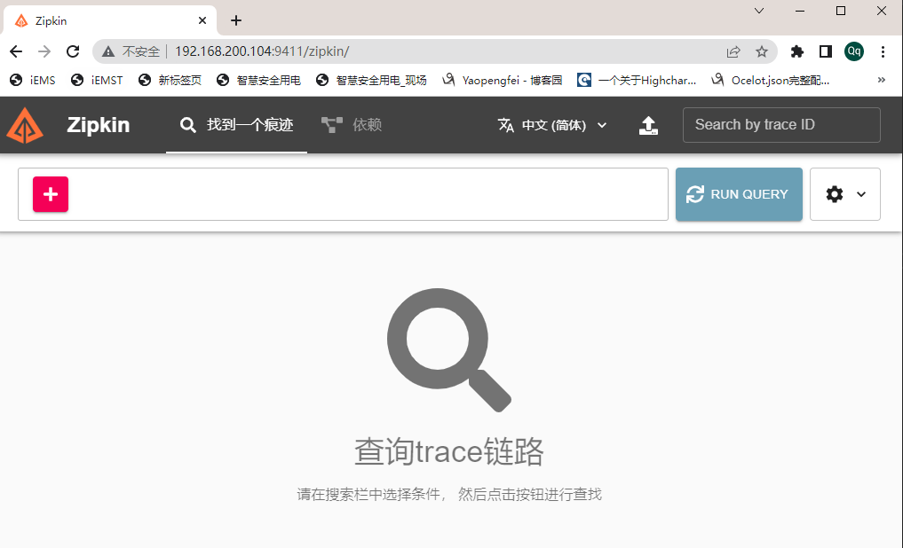

### 5. 对接单个.Net程序

（1）添加依赖

```C#
	<ItemGroup>
		<PackageReference Include="zipkin4net" Version="1.5.0" />
		<PackageReference Include="zipkin4net.middleware.aspnetcore" Version="1.5.0" />
		<PackageReference Include="Microsoft.Extensions.DiagnosticAdapter" Version="3.1.7" />
		<PackageReference Include="Microsoft.Extensions.Hosting.Abstractions" Version="3.1.8" />
	</ItemGroup>
```

（2）修改`Startup.cs`文件

```C#
            #region 基于LifetTime对象注册Zipkin
            IHostApplicationLifetime lifetime = app.ApplicationServices.GetService<IHostApplicationLifetime>();
            ILoggerFactory loggerFactory = app.ApplicationServices.GetService<ILoggerFactory>()!;
            lifetime.ApplicationStarted.Register(() =>
            {
                //记录数据密度，1.0代表全部记录
                TraceManager.SamplingRate = 1.0f;
                //链路日志
                var logger = new TracingLogger(loggerFactory, "zipkin4net");
                //zipkin服务地址和内容类型
                var httpSender = new HttpZipkinSender("http://192.168.200.104:9411/", "application/json");
                var tracer = new ZipkinTracer(httpSender, new JSONSpanSerializer(), new Statistics());
                var consoleTracer = new zipkin4net.Tracers.ConsoleTracer();

                TraceManager.RegisterTracer(tracer);
                TraceManager.RegisterTracer(consoleTracer);
                TraceManager.Start(logger);
            });
            //程序停止时停止链路跟踪
            lifetime.ApplicationStopped.Register(() => TraceManager.Stop());
            //引入zipkin中间件，用于跟踪服务请求,这边的名字可自定义代表当前服务名称
            app.UseTracing("OrderService");
            #endregion
```

（3）运行项目

（4）在zipkin的UI上面查看是否被追踪，看到如下结果代表成功：

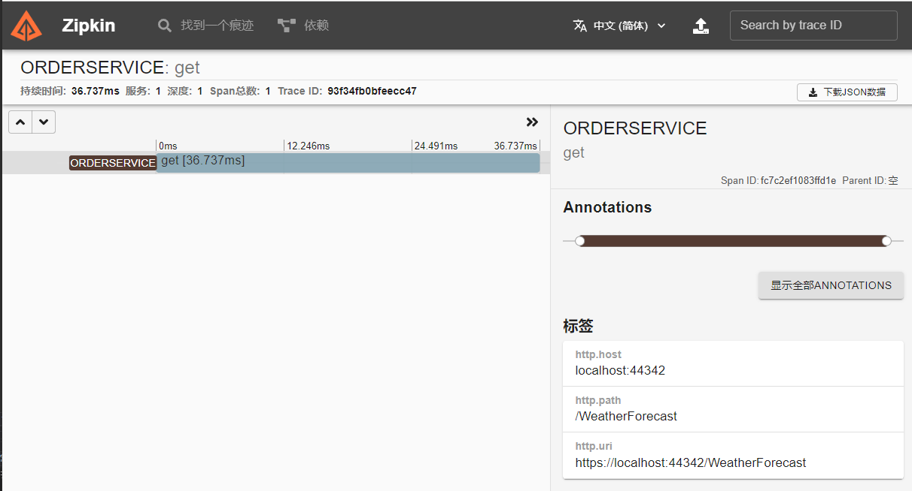


（5）启动另一服务UserService，OrderService调用UserService，在Zipkin中看到的结果如下，即独立的链路：

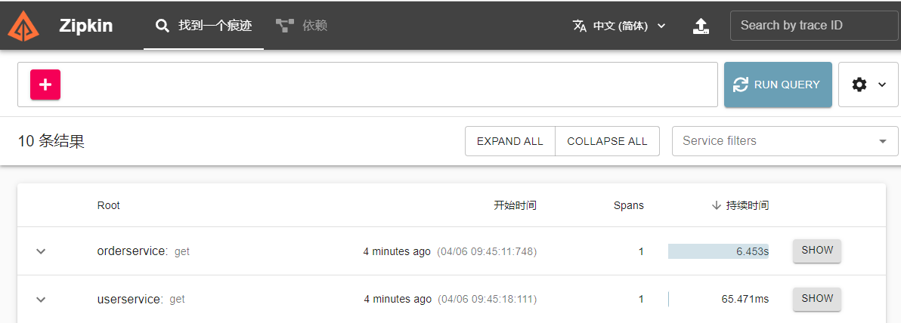


问题：

​	其实在上面的演示中，我们可以明显的看到明显的不足，就是很多时候其实我们没办法去设置HttpClient相关的参数的，很多框架虽然也是使用的HttpClient或HttpClientFactory相关，但是在外部我们没办法通过自定义的方式去设置他们的相关操作，比如Ocelot其实也是使用HttpClient相关发起的转发请求，但是对外我们没办法通过我们的程序去设置HttpClient的参数。还有就是在.Net Core中WebRequest其实也是对HttpClient的封装，但是我们同样没办法在我们的程序中给他们传递类似TracingHandler的操作。

解决方法：**参考封装扩展**

### 6. 封装扩展

（1）借助ClientTrace记录一些标签，其他的相关操作都是由zipkin4net提供的。对HttpClient进行链路跟踪埋点。
我们结合Microsoft.Extensions.DiagnosticAdapter扩展包定义如下类：

```C#

    /// <summary>
    /// 自定义埋点诊断监听类
    /// </summary>
    public class HttpDiagnosticListener : ITraceDiagnosticListener
    {
        public string DiagnosticName => "HttpHandlerDiagnosticListener";

        private ClientTrace? clientTrace;
        private readonly IInjector<HttpHeaders> _injector = 
            Propagations.B3String.Injector<HttpHeaders>((carrier, key, value) => carrier.Add(key, value));

        [DiagnosticName("System.Net.Http.Request")]
        public void HttpRequest(HttpRequestMessage request)
        {
            clientTrace = new ClientTrace("Gateway", request.Method.Method);
            if (clientTrace.Trace != null)
            {
                _injector.Inject(clientTrace.Trace.CurrentSpan, request.Headers);
            }
        }

        [DiagnosticName("System.Net.Http.Response")]
        public void HttpResponse(HttpResponseMessage response)
        {
            if (clientTrace!.Trace != null)
            {
                Console.WriteLine("=========================>自定义埋点");
                // 标记请求的路径
                clientTrace.AddAnnotation(Annotations.Tag(zipkinCoreConstants.HTTP_PATH, response.RequestMessage!.RequestUri!.LocalPath));
                // 标记请求的方法
                clientTrace.AddAnnotation(Annotations.Tag(zipkinCoreConstants.HTTP_METHOD, response.RequestMessage.Method.Method));
                // 标记请求的主机
                clientTrace.AddAnnotation(Annotations.Tag(zipkinCoreConstants.HTTP_HOST, response.RequestMessage.RequestUri.Host));
                if (!response.IsSuccessStatusCode)
                {
                    clientTrace.AddAnnotation(Annotations.Tag(zipkinCoreConstants.HTTP_STATUS_CODE, ((int)response.StatusCode).ToString()));
                }
            }
        }

        [DiagnosticName("System.Net.Http.Exception")]
        public void HttpException(HttpRequestMessage request, Exception exception)
        {
        }
    }
```

（2）ITraceDiagnosticListener是我们方便操作DiagnosticListener定义的接口，接口仅包含DiagnosticName用来表示DiagnosticListener监听的名称.

```C#
    public interface ITraceDiagnosticListener
    {
        string DiagnosticName { get; }
    }
```

（3）订阅操作的实现

```C#
    public class TraceObserver : IObserver<DiagnosticListener>
    {
        private IEnumerable<ITraceDiagnosticListener> _traceDiagnostics;
        public TraceObserver(IEnumerable<ITraceDiagnosticListener> traceDiagnostics)
        {
            _traceDiagnostics = traceDiagnostics;
        }

        public void OnCompleted()
        {
        }

        public void OnError(Exception error)
        {
        }

        public void OnNext(DiagnosticListener listener)
        {
            var traceDiagnostic = _traceDiagnostics.FirstOrDefault(i => i.DiagnosticName == listener.Name);
            if (traceDiagnostic != null)
            {
                //适配订阅
                listener.SubscribeWithAdapter(traceDiagnostic);
            }
        }
    }
```

（4）Zipkin封装扩展

```C#
    public static class ZipkinExtension
    {
        public static IServiceCollection AddZipkin(this IServiceCollection services)
        {
            services.AddSingleton<ITraceDiagnosticListener, HttpDiagnosticListener>();
            return services.AddSingleton<TraceObserver>();
        }

        public static IApplicationBuilder UseZipkin(this IApplicationBuilder app, IHostApplicationLifetime lifetime, ILoggerFactory loggerFactory, string serviceName, string zipkinUrl)
        {
            // 必须订阅
            DiagnosticListener.AllListeners.Subscribe(app.ApplicationServices.GetService<TraceObserver>()!);
            lifetime.ApplicationStarted.Register(() =>
            {
                //配置数据采样率，1.0代表全部采样
                TraceManager.SamplingRate = 1.0f;
                //链路日志
                var logger = new TracingLogger(loggerFactory, "zipkin4net");
                //zipkin服务地址和内容类型
                var httpSender = new HttpZipkinSender(zipkinUrl, "application/json");
                var tracer = new ZipkinTracer(httpSender, new JSONSpanSerializer(), new Statistics());
                var consoleTracer = new zipkin4net.Tracers.ConsoleTracer();

                TraceManager.RegisterTracer(tracer);
                TraceManager.RegisterTracer(consoleTracer);
                TraceManager.Start(logger);

            });
            //程序停止时停止链路跟踪
            lifetime.ApplicationStopped.Register(() => TraceManager.Stop());
            //引入zipkin中间件，用于跟踪服务请求,这边的名字可自定义代表当前服务名称
            app.UseTracing(serviceName);
            return app;
        }
    }
```

### 7. 对接微服务网关+后台微服务

（1）网关/后台微服务（UserService、OrderService），追加如下代码

​		说明：公共依赖可以添加到公共类中，方便以后统一修改

`Startup.cs\ConfigureServices`

```C#
  #region Zipkin
  services.AddZipkin();
  #endregion
```


`Startup.cs\Configure`

```C#
 IHostApplicationLifetime lifetime = app.ApplicationServices.GetService<IHostApplicationLifetime>();
 ILoggerFactory loggerFactory = app.ApplicationServices.GetService<ILoggerFactory>()!;
 app.UseZipkin(lifetime, loggerFactory!, "OrderService", "http://192.168.3.245:9411/");
```

（2）根据服务配置网关

（3）发起请求

链路追踪如下图所示：

网关->OrderService->UserService

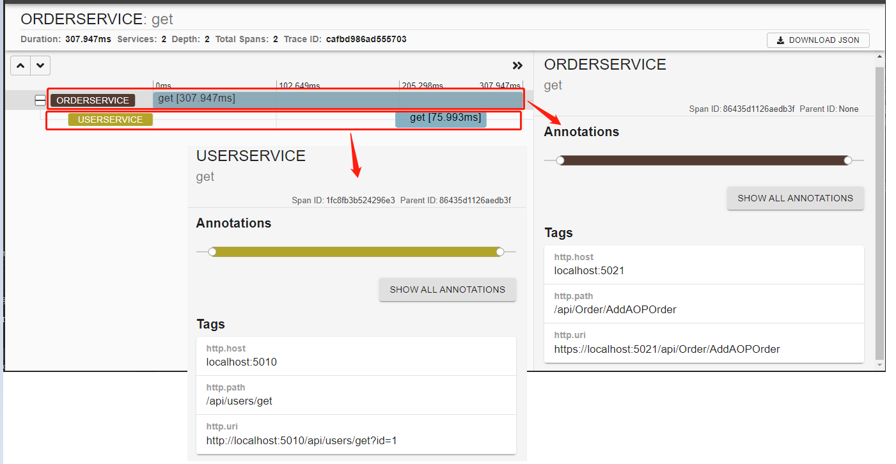


## 

