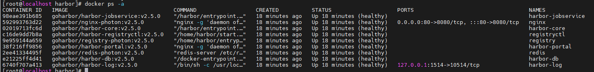
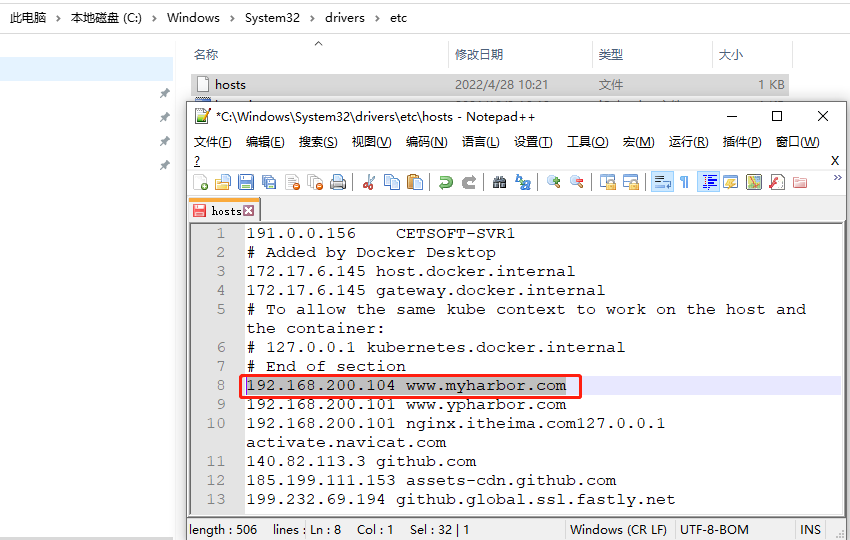
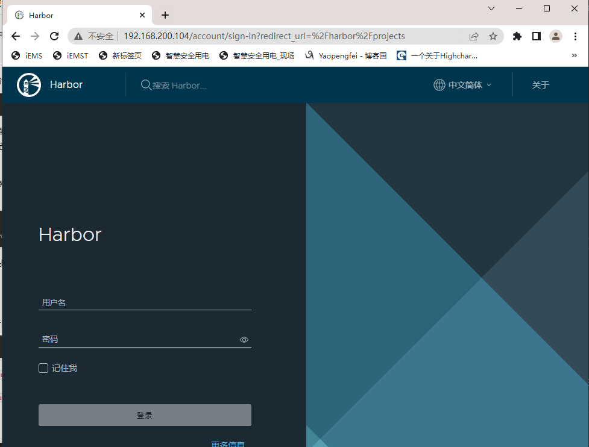
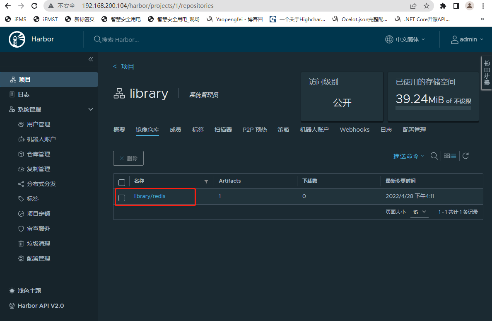

# Harbor企业级镜像仓库

## 一、基于Harbor搭建仓库

### 1. Harbor简介

​	Harbor是VMware公司开源的一个企业级Docker Registry项目，项目地址：https://github.com/goharbor/harbor

​	

​	Harbor工程是一个企业级的镜像服务器，用于存储和分发Docker镜像。Harbor扩展了开源软件`Docker Distribution`，添加了如`security`、`identity`和`management`等功能。作为一个企业级的私有镜像仓库，Harbor提供了更好的性能和安全性。Harbor支持建立多个`registries`,并提供这些仓库间镜像的复制能力。Harbor也提供了更加先进的安全特性，比如用户管理、访问控制、活动审计


Harbor特性：

- **基于角色的访问控制**: `users`和`repositories`都是以projects的方式组织的。在一个project下面，每一个用户对镜像有不同的全向。
- **基于策略的镜像复制**: 在多个registry之间镜像可以同步，并且在出现错误的时候可以进行自动重试。在负载均衡、高可用性、多数据中心和异构云环境下都表现出色。
- **脆弱性扫描(Vulnerability Scanning)**: Harbor会周期性的扫描镜像，然后警告用户相应的脆弱性
- **LDAP/AD支持**: Harbor可以和已存在的企业版LDAP/AD系统集成，以提供用户认证和管理
- **镜像删除 & 垃圾回收**: Images可以被删除，然后回收它们所占用的空间
- **可信任(Notary)**: 可以确保镜像的真实性
- **用户界面(Graphical user portal)**: 用户可以人容易的浏览、搜索仓库和管理工程
- **审计(Auditing)**: 所有对仓库的操作都会被跟踪记录
- **RESTful API**: 对于大部分的管理操作都提供了RESTful API， 很容易和外部系统进行集成
- **易部署**: 提供了离线和在线安装

### 2. Harbor的安装

**此文档只针对默认端口80进行说明（自定义端口需要修改docker-compose.yml配置以及端口映射）**

在[Harbor Release](https://github.com/goharbor/harbor/releases)页面下载对应的离线安装包，目前我们下载最新版本`v2.5.0`

本机环境

```powershell
[root@localhost harbor]# docker -v
Docker version 20.10.12, build e91ed57
[root@localhost harbor]# docker-compose -v
docker-compose version 1.29.2, build 5becea4c
```

（1）解压到指定目录

```powershell
[root@localhost harbor]# tar -zxvf harbor-offline-installer-v2.5.0.tgz -C /test/
[root@localhost harbor]# cd /test/harbor/
[root@localhost harbor]# ls -a
.  ..  common.sh  harbor.v2.5.0.tar.gz  harbor.yml.tmpl  install.sh  LICENSE  prepare
```

（2）设置主机名（可忽略此步骤）

```powershell
[root@localhost harbor]# hostnamectl set-hostname www.myharbor.com
[root@localhost harbor]# hostname
www.myharbor.com
```

```powershell
[root@localhost harbor]# vim /etc/hosts
192.168.200.104 www.myharbor.com
# 测试能否ping通 www.myharbor.com 主机
[root@localhost harbor]# ping www.myharbor.com
PING www.myharbor.com (192.168.200.104) 56(84) bytes of data.
64 bytes from www.myharbor.com (192.168.200.104): icmp_seq=1 ttl=64 time=0.026 ms
64 bytes from www.myharbor.com (192.168.200.104): icmp_seq=2 ttl=64 time=0.031 ms
```

（3）修改Harbor配置文件

```powershell
[root@localhost harbor]# cp harbor.yml.tmpl harbor.yml
[root@localhost harbor]# vim harbor.yml
```

① `hostname`: www.myharbor.com  #修改主机名

② `https`：删除https相关配置

```yml
hostname: www.myharbor.com  #修改主机名，也可使用IP地址
# https:			# 注释掉证书，不使用证书就需要注释
  # https port for harbor, default is 443
 # port: 443
  # The path of cert and key files for nginx
 # certificate: /your/certificate/path
 # private_key: /your/private/key/path
 harbor_admin_password: Harbor12345			# 默认的登录密码

# 以上这些需要修改，其余保持默认
```

（4）启动脚本安装

```powershell
#查看80端口是否被占用，如果被占用，则需修改harbor.yml配置文件的端口，或者关闭当前占用端口的进程
[root@localhost harbor]# lsof -i:80

# 启动脚本进行安装
[root@localhost harbor]# ./install.sh

[Step 0]: checking if docker is installed ...

Note: docker version: 20.10.12

[Step 1]: checking docker-compose is installed ...

Note: docker-compose version: 1.29.2

[Step 2]: loading Harbor images ...
# ......安装过程省略
✔ ----Harbor has been installed and started successfully.----

# 安装完成会自动启动很多容器
[root@localhost harbor]# docker ps -a
```



（5）修改Windows访问端的DNS域名配置

C:\Windows\System32\drivers\etc



（6）测试访问

可使用ip：port来访问，也可以使用域名访问

例如：192.168.200.104  或者	www.myharbor.com



### 3. Harbor相关命令

（1）停止Habor

```shell
docker-compose stop
```


（2）重启Habor

```shell
docker-compose start
```


（3）配置更新

如果要改变Harbor的配置，首先要停止当前已存在的Harbor实例，然后更新harbor.cfg。然后再运行`prepare`脚本更新配置文件，最后再重新创建并启动Harbor实例

```shell	
sudo docker-compose down -v
vim harbor.yml
sudo prepare
sudo docker-compose up -d
```


（4）移除Harbor容器，但保留文件系统上的image data及Harbor数据库

```shell
docker-compose down -v
```


（5）移除Harbor数据库及image data(用于干净环境下Harbor重装)

```shell
rm -rf /data/database
rm -rf /data/registry
```

（6）Harbor中push/pull镜像

- 确认/etc/docker/daemon.json配置

注意：如果如下错误，则需要修改/etc/docker/daemon.json文件

```shell
Harbor Error response from daesmon: Get http://reg.zll.com/v2/: dial tcp 192.168.243.138:80: connect: connection refused
```

/etc/docker/daemon.json

```json
{
"registry-mirrors": ["https://kn0t2bca.mirror.aliyuncs.com"],
"insecure-registries": ["192.168.200.104"]
}
```


- 确认 /usr/lib/systemd/system/docker.service配置

注意：如果如下错误，则需要删除daemon.json或者docker.service的nsecure-registries配置（只需配置一次），重复配置则会报错（出现以下错误也有可能是daemon.json格式不正确）

```powershell
Job for docker.service failed because start of the service was attempted too often. See "systemctl status docker.service" and "journalctl -xe" for details.
```

/usr/lib/systemd/system/docker.service

追加`--insecure-registry 192.168.200.104`

```powershell
[root@www system]# cat /usr/lib/systemd/system/docker.service | grep ExecStart
ExecStart=/usr/bin/dockerd -H fd:// --containerd=/run/containerd/containerd.sock  --insecure-registry 192.168.200.104
```

- 登录Harbor

```powershell
[root@www ~]# systemctl daemon-reload
[root@www ~]# systemctl restart docker
[root@www ~]# docker login 192.168.200.104
Username: admin
Password:
WARNING! Your password will be stored unencrypted in /root/.docker/config.json.
Configure a credential helper to remove this warning. See
https://docs.docker.com/engine/reference/commandline/login/#credentials-store

Login Succeeded
```

- 上传镜像

```powershell
# 重新为镜像打tag,这里我们用Harbor中的默认库
[root@www harbor]# docker tag redis 192.168.200.104/library/redis:alpine
[root@www harbor]# docker images | grep redis
goharbor/redis-photon                           v2.5.0              1e00fcc9ae63   3 weeks ago
192.168.200.104/library/redis                   alpine              7614ae9453d1   4 months ag
redis                                           latest              7614ae9453d1   4 months ag
# 上传镜像到Harbor
[root@www harbor]# docker push 192.168.200.104/library/redis:alpine
The push refers to repository [192.168.200.104/library/redis]
8e5669d83291: Pushed
9975392591f2: Pushed
529cdb636f61: Pushed
4b8e2801e0f9: Pushed
9b24afeb7c2f: Pushed
2edcec3590a4: Pushed
alpine: digest: sha256:563888f63149e3959860264a1202ef9a644f44ed6c24d5c7392f9e2262bd3553 size: 1573
```

登录192.168.200.104查看镜像仓库



- 下载镜像

```powershell
# 删除本地镜像
[root@www harbor]# docker rmi redis
Untagged: redis:latest
Untagged: redis@sha256:db485f2e245b5b3329fdc7eff4eb00f913e09d8feb9ca720788059fdc2ed8339

# 从Harbor镜像仓库拉去镜像
[root@www harbor]# docker pull 192.168.200.104/library/redis:alpine
alpine: Pulling from library/redis
Digest: sha256:563888f63149e3959860264a1202ef9a644f44ed6c24d5c7392f9e2262bd3553
Status: Image is up to date for 192.168.200.104/library/redis:alpine
192.168.200.104/library/redis:alpine

# 查看本地镜像版本
[root@www harbor]# docker ps | grep redis
297156f16ad7   goharbor/redis-photon:v2.5.0  "redis-server /etc/r…"   12 minutes ago   Up 12 minutes (healthy)    redis

```


